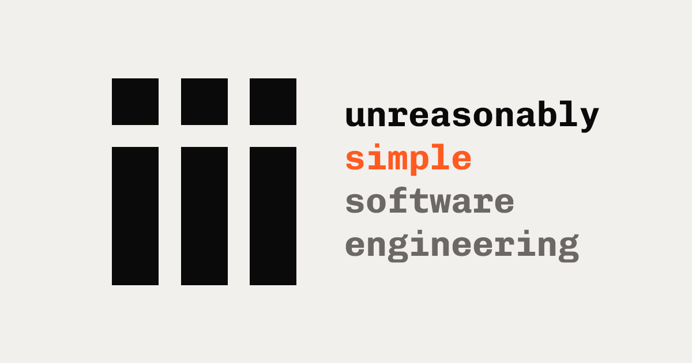

[](engine/LICENSE)
[](sdk/LICENSE)
[](https://hub.docker.com/r/iiidev/iii)
[](https://www.npmjs.com/package/iii-sdk)
[](https://pypi.org/project/iii-sdk/)
[](https://crates.io/crates/iii-sdk)

# Anything that does work is a worker.

iii is a small engine and an open registry of workers. **Three nouns close the model. The set never closes.**

Function. Trigger. Worker. Any capability you can name fits one of three shapes — your services, your agents, your browser tabs, your sandboxes, your APIs, the thing nobody's built yet. Same registration. Same trigger. Same trace. Same composition. Across every language, location, and runtime.

The model never changes when something new shows up.

---

## Three nouns. Concrete every time.

**Anything is a Function.** A typed input, an optional output, a globally unique ID.

```
orders::handle      →  local TypeScript handler
ml::classify        →  remote Python worker
stripe::charge      →  third-party HTTP API, wrapped
sandbox::run        →  a worker that doesn't exist yet
```

Same call site every time:

```ts
await iii.trigger(id, input)
```

**Anything is a Trigger.** HTTP, cron, queue, stream, state change, or an event source contributed by a worker. The same Function fires from completely different things, no code change.

```
http     POST /orders          →  orders::handle
cron     0 9 * * *             →  reports::daily
queue    durable subscriber    →  orders::handle
state    on change users::*    →  audit::log
```

**Anything is a Worker.** A service, an agent, a browser tab, a sandbox, a CLI, a device, your code. Same registration line in every SDK.

```
service   your Node / Python / Rust / browser process
agent     an LLM with tools and memory
browser   the iii SDK running in a tab
sandbox   untrusted code in a microVM
```

---

## Add anything to your backend

```bash
iii worker add postgres
iii worker add browser
iii worker add agent
iii worker add ./my-service
```

Workers can be a binary, an OCI image, a build, or a local directory. Categories are descriptive, not load-bearing — the model doesn't care whether a worker is a database, an agent, or something with no category yet.

## Compose them like they're one system

```ts
import { registerWorker } from "iii-sdk";

const iii = registerWorker("ws://localhost:49134");

iii.registerFunction({
  id: "tickets::handle",
  handler: async ({ id }) => {
    const ticket     = await iii.trigger("postgres::query", { sql: "...", id });
    const screenshot = await iii.trigger("browser::screenshot", { url: ticket.url });
    const reply      = await iii.trigger("agent::reply", { ticket, screenshot });
    return reply;
  },
});
```

That's the whole loop. Add a worker, call it, ship.

## One trace across all of it

```
trace_id 7c…b51
┌─ http POST /tickets/handle                            12ms
├─ tickets::handle              [TS · service]       1.31s
├─ postgres::query              [SQL · service]       86ms
├─ browser::screenshot          [browser tab]        742ms
├─ ml::classify                 [PY · model]         186ms
├─ agent::reply                 [LLM agent]          294ms
└─ crm::update                  [RUST · worker]       38ms
```

Four languages. Three runtimes. One trace. Because everything obeys the same model.

---

## What this looks like for you

**Backend engineers.** Your stack is already a bunch of workers — they just don't know it. Postgres, Redis, your queue, your scheduler, your auth middleware, your trace pipeline, your services — and the next layer that doesn't exist yet — under one model. Register a function, bind a trigger, get a trace.

**AI / agent engineers.** Agents aren't a special feature. They're workers like everything else. So is the browser tab they're acting in. So is the Python model they call. So is the Rust service that writes the result. One trace stitches every step end-to-end, regardless of language or location.

**Platform engineers.** `iii worker add` resolves to libkrun microVMs with their own rootfs. `iii-bridge` federates to remote engines. The HTTP route table swaps in place; the worker set reloads from yaml; local-dir workers re-sync into the VM. Same model, many implementations.

---

## Quick start

```bash
# Run the engine
curl -fsSL https://iii.dev/install.sh | sh

# Add your first worker
iii worker add postgres

# Or write your own — pick a language
npm  install iii-sdk
pip  install iii-sdk
cargo add    iii-sdk
npm  install iii-browser-sdk
```

Full walkthrough: [iii.dev/docs/quickstart](https://iii.dev/docs/quickstart).

## SDKs

| Language | Package                                                            | Install                       |
| -------- | ------------------------------------------------------------------ | ----------------------------- |
| Node.js  | [`iii-sdk`](https://www.npmjs.com/package/iii-sdk)                 | `npm install iii-sdk`         |
| Browser  | [`iii-browser-sdk`](https://www.npmjs.com/package/iii-browser-sdk) | `npm install iii-browser-sdk` |
| Python   | [`iii-sdk`](https://pypi.org/project/iii-sdk/)                     | `pip install iii-sdk`         |
| Rust     | [`iii-sdk`](https://crates.io/crates/iii-sdk)                      | `cargo add iii-sdk`           |

The browser SDK is the real thing — it runs as a worker inside the tab itself. No headless gymnastics.

## Console — operate, don't just observe

The [iii-console](console/) is an operations surface. Because every worker speaks the same model, every action works on every worker — your code or anything else.

- **invoke** any function from the UI
- **publish** a JSON message to a queue
- **redrive** a single message or the whole DLQ
- **retry** a failed step from inside a trace
- **inspect** live workers, traces, streams, state

See the [Console docs](https://iii.dev/docs/console).

## Agent skills

Give your AI coding agent full context on iii:

```bash
npx skillkit add iii-hq/iii/skills
```

27 skills covering every primitive. Works with Claude Code, Cursor, Gemini CLI, Codex, and [30+ other agents](https://agentskills.io). See [skills/](skills/) for the full list.

## Repository structure

| Directory     | What it is                                                | README                                 |
| ------------- | --------------------------------------------------------- | -------------------------------------- |
| `engine/`     | iii Engine (Rust) — reference implementation              | [engine/README.md](engine/README.md)   |
| `sdk/`        | SDKs for Node.js, Browser, Python, and Rust               | [sdk/README.md](sdk/README.md)         |
| `console/`    | Operations dashboard (React + Rust)                       | [console/README.md](console/README.md) |
| `frameworks/` | Higher‑level frameworks built on the SDK                  | [frameworks/motia/](frameworks/motia/) |
| `skills/`     | Agent skills for AI coding agents                         | [skills/README.md](skills/README.md)   |
| `spec/`       | Wire‑level protocol specification                         | [spec/README.md](spec/README.md)       |
| `website/`    | iii.dev marketing site                                    | [website/](website/)                   |
| `docs/`       | Documentation site (Mintlify/MDX)                         | [docs/README.md](docs/README.md)       |

See [STRUCTURE.md](STRUCTURE.md) for the full monorepo layout, dependency chain, and CI/CD details.

## Resources

- [Documentation](https://iii.dev/docs)
- [Examples](https://github.com/iii-hq/iii-examples)
- [Console](console/)
- [Contributing](CONTRIBUTING.md)

## License

| Layer                                                              | License                                      |
| ------------------------------------------------------------------ | -------------------------------------------- |
| `engine/` — reference engine                                       | [Elastic License 2.0](engine/LICENSE)        |
| Everything else (SDKs, console, frameworks, docs, website, skills) | [Apache License 2.0](sdk/LICENSE)            |
| `spec/` — protocol                                                 | TBD (see [`spec/README.md`](spec/README.md)) |

See [CONTRIBUTING.md](CONTRIBUTING.md) for additional details.
