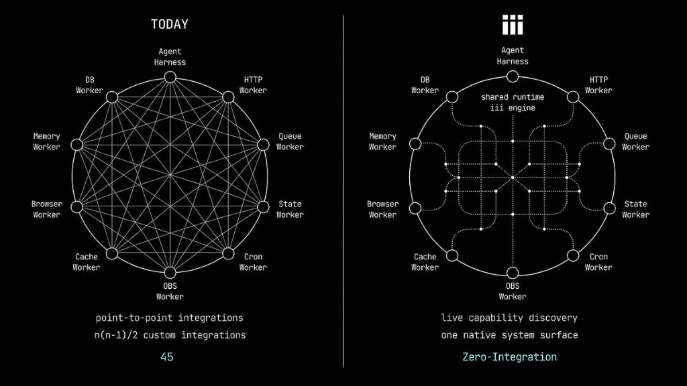

# iii



<p align="center">
<a href="https://trendshift.io/repositories/22583?utm_source=repository-badge&amp;utm_medium=badge&amp;utm_campaign=badge-repository-22583" target="_blank" rel="noopener noreferrer"></a>
</p>


<!-- Release -->
<p align="center">
  <a href="https://hub.docker.com/r/iiidev/iii"></a>
  <a href="https://www.npmjs.com/package/iii-sdk"></a>
  <a href="https://pypi.org/project/iii-sdk/"></a>
  <a href="https://crates.io/crates/iii-sdk"></a>
  <a href="https://discord.gg/iiidev"></a>
</p>

<!-- Downloads -->
<p align="center">
  <a href="https://workers.iii.dev/"></a>
  <a href="https://workers.iii.dev/"></a>
  <a href="https://hub.docker.com/r/iiidev/iii"></a>
  <a href="https://www.npmjs.com/package/iii-sdk"></a>
  <a href="https://pepy.tech/projects/iii-sdk"></a>
  <a href="https://crates.io/crates/iii-sdk"></a>
</p>

<!-- Index -->
<p align="center">
  <a href="#what-is-iii">What is iii?</a> ·
  <a href="#quick-start">Quick Start</a> ·
  <a href="#add-workers">Add Workers</a> ·
  <a href="#sdks">SDKs</a> ·
  <a href="#agent-skills">Agent Skills</a> ·
  <a href="#console">Console</a> ·
  <a href="#resources">Resources</a>
</p>

## What is iii?

iii is the easiest way to compose, extend, and observe every service in your stack in real time.

Every backend starts as a project before the first line of business logic. Queues, cron, HTTP,
state, observability, agents, and sandboxes each usually bring their own integration story. iii
collapses that into one live system surface.

```bash
iii compose --namespace dev --up
iii trigger -n dev compose::add worker=queue
iii trigger -n dev compose::add worker=agent
iii trigger -n dev compose::add worker=<anything>
```

Each worker joins the live catalog. Every other worker is notified and can call it immediately.
Browse available workers at [workers.iii.dev](https://workers.iii.dev/).

That is the agent story too: when a task needs a capability the system does not have, an agent can
add a worker, discover its functions, call them, and trace what happened. Same interface a developer
uses.

### Three Primitives

Worker _ Function _ Trigger is the entire mental model.

**Workers** are processes that register with the iii engine and then register triggers and
functions. A TypeScript API service is a worker. A Python data pipeline is a worker. A Rust
microservice is a worker. Any functionality can be transformed into a worker with a few lines of
code. Compose can also add workers at runtime, so agents and applications can extend the system
while it is running.

**Triggers** are anything that causes a function to run. A trigger can be a direct call to a
function, an HTTP endpoint, a cron schedule, a queue subscription, a state change, a stream event,
or anything else. Triggers are declarative: the Worker defines "this function runs when this thing
happens," and iii handles routing, serialization, and delivery.

**Functions** are units of work with a stable identifier (e.g., `content::classify`,
`orders::validate`). It receives input, does work, and optionally returns output. Functions exist in
workers.

By mapping everything a service can do to these three primitives iii creates a development process
that is both effortlessly composable, and completely observable.

## What Changes

Before iii:

- New observability tool: uncountable integrations
- New agent harness: separate retry config, separate traces, separate timeouts
- New queue: vendor evaluation, procurement, and weeks of integration

After iii:

- Declare workers in `worker-compose.yaml`
- Run them with `iii compose --up`
- Done. It is in the system, traceable, and callable.

Platform teams publish workers. Application teams register functions and declare triggers. Agents
use the same catalog and the same function calls.

Extending iii is adding a Compose worker. Composing iii is calling functions. Observing iii is
opening the trace.

## Quick Start

<a href="https://assets.motia.dev/videos/mp4/site/v1/iii-intro.mp4">
  
</a>

Install `iii`:

```bash
curl -fsSL https://install.iii.dev/iii/main/install.sh | sh
```

Then scaffold and start a project:

```bash
iii project init myapp    # scaffold a project
cd myapp
# declare project workers in worker-compose.yaml
iii compose --up          # start the engine and project workers
```

Full walkthrough at the [Quickstart guide](https://iii.dev/docs/quickstart).

## Add Workers

Declare project workers in `worker-compose.yaml`, or add them through a running Compose daemon:

```bash
iii trigger -n dev compose::add worker=queue
```

Browse packages at [workers.iii.dev](https://workers.iii.dev/) and see the
[Compose documentation](https://iii.dev/docs/using-iii/compose).

## SDKs

| Language | Package                                            | Install                                     |
| -------- | -------------------------------------------------- | ------------------------------------------- |
| Node.js  | [`iii-sdk`](https://www.npmjs.com/package/iii-sdk) | `pnpm add iii-sdk` or `npm install iii-sdk` |
| Python   | [`iii-sdk`](https://pypi.org/project/iii-sdk/)     | `pip install iii-sdk`                       |
| Rust     | [`iii-sdk`](https://crates.io/crates/iii-sdk)      | Add to `Cargo.toml`                         |
| Go       | [`iii-sdk`](sdk/packages/go/iii)                       | `go get github.com/iii-hq/iii/sdk/packages/go/iii` |

## Agent Skills

Install iii's agent-readable reference material for the engine primitives:

```bash
npx skills add iii-hq/iii/skills
```

These cover every iii primitive: HTTP endpoints, queues, cron, state, streams, custom triggers, and
more. See [skills/](skills/) for the full list.

Each worker in [iii-hq/workers](https://github.com/iii-hq/workers) also ships its own skill. Install
them alongside the worker itself:

```bash
npx skills add iii-hq/workers --list        # list available worker skills
npx skills add iii-hq/workers --skill database # one worker
npx skills add iii-hq/workers --all         # every worker skill
```

The engine-owned workers (`configuration`, `iii-worker-manager`, `iii-http-functions`,
`iii-stream`, and `iii-sandbox`) and the automatically supplied engine functions, telemetry, and
observability workers live in this repo. HTTP, cron, queue, state, pubsub, and bridge are standalone
Compose workers. Install an engine skill with
`npx skills add iii-hq/iii --full-depth --skill <name>`; standalone workers ship their own skills in
[iii-hq/workers](https://github.com/iii-hq/workers).

## Console

The [iii-console](console/) is a developer and operations console for inspecting workers, functions,
triggers, queues, traces, logs, and real-time state. See the
[Console docs](https://iii.dev/docs/using-iii/console) for setup and usage.

## Repository Structure

| Directory  | What it is                                              | README                                 |
| ---------- | ------------------------------------------------------- | -------------------------------------- |
| `engine/`  | iii Engine (Rust) - core runtime, modules, and protocol | [engine/README.md](engine/README.md)   |
| `sdk/`     | SDKs for Node.js, Python, Rust, and Go                  | [sdk/README.md](sdk/README.md)         |
| `console/` | Developer console (React + Rust)                        | [console/README.md](console/README.md) |
| `skills/`  | Agent-readable reference material                       | [skills/README.md](skills/README.md)   |
| `website/` | iii website                                             | [website/](website/)                   |
| `docs/`    | Documentation site (Mintlify/MDX)                       | [docs/README.md](docs/README.md)       |

See [STRUCTURE.md](STRUCTURE.md) for the full monorepo layout, dependency chain, and CI/CD details.

## Examples

See the [Quickstart guide](https://iii.dev/docs/quickstart) for step-by-step tutorials.

## Resources

- [Documentation](https://iii.dev/docs)
- [CLI & Engine](https://github.com/iii-hq/iii)
- [Console](console/)
- [Examples](https://github.com/iii-hq/iii-examples)
- [Contributing](CONTRIBUTING.md)

## Star History

<p align="center">
  <a href="https://www.star-history.com/?repos=iii-hq%2Fiii&type=date&legend=top-left">
    <picture>
      <source media="(prefers-color-scheme: dark)" srcset="https://api.star-history.com/chart?repos=iii-hq/iii&type=date&theme=dark&legend=bottom-right" />
      <source media="(prefers-color-scheme: light)" srcset="https://api.star-history.com/chart?repos=iii-hq/iii&type=date&legend=bottom-right" />
      
    </picture>
  </a>
</p>

## License

The iii is licensed as such:

| Directory  | License                               |
| ---------- | ------------------------------------- |
| `engine/`  | [Elastic License 2.0](engine/LICENSE) |
| `sdk/`     | [Apache License 2.0](sdk/LICENSE)     |
| `console/` | [Apache License 2.0](console/LICENSE) |
| `docs/`    | [Apache License 2.0](docs/LICENSE)    |
| `website/` | [Apache License 2.0](website/LICENSE) |

The engine runtime is licensed under the Elastic License 2.0 (ELv2). All SDKs, CLI, console,
documentation, and the website are licensed under the Apache License 2.0.

See [CONTRIBUTING.md](CONTRIBUTING.md) for additional details.


## 🌐 Web Resources & Interactive Index
- [MERGE ARCHER DEFENSE](https://brainquestskr.pages.dev/merge-archer-defense.html)
- [POTION MERGE WITCH](https://quizzesarena.github.io/potion-merge-witch.html)
- [CATEGORY POINT AND CLICK123](https://quizzesarena.web.app/category-point-and-click123.html)
- [INDEX2](https://quizzesarena.onrender.com/index2.html)
- [CATEGORY THINKY](https://brainquestspt.pages.dev/category-thinky.html)
- [MEGA ESCAPE CAR PARKING PUZZLE](https://quizzesarena.web.app/mega-escape-car-parking-puzzle.html)
- [CATEGORY BASKETBALL](https://brainquestspt.pages.dev/category-basketball.html)
- [TAG RUN](https://quizzesarena.web.app/tag-run.html)
- [PECKSHOT](https://quizzesarena.web.app/peckshot.html)
- [PAINT POP 3D](https://quizzesarena.onrender.com/paint-pop-3d.html)
- [CHAMPIONS FC](https://quizzesarena.web.app/champions-fc.html)
- [SUDOKU RELAX](https://quizzesarena.web.app/sudoku-relax.html)
- [FRUITSLAND ESCAPE FROM THE AMUSEMENT PARK](https://quizzesarena.web.app/fruitsland-escape-from-the-amusement-park.html)
- [BUCKSHOT ROULETTE](https://brainquestspt.pages.dev/buckshot-roulette.html)
- [OMG WORD RAINBOW](https://quizzesarena.web.app/omg-word-rainbow.html)
- [MAJESTIC DRAGONS MERGE](https://quizzesarena.onrender.com/majestic-dragons-merge.html)
- [RELAY RACE](https://quizzesarena.onrender.com/relay-race.html)
- [SLAP AND RUN](https://quizzesarena.web.app/slap-and-run.html)
- [CATEGORY MATCH 3 2](https://brainquestspt.pages.dev/category-match-3-2.html)
- [RUN 3D](https://quizzesarena.web.app/run-3d.html)
- [MINEBUILD](https://quizzesarena.web.app/minebuild.html)
- [DRUNKEN FIGHTERS](https://quizzesarena.onrender.com/drunken-fighters.html)
- [CONSTRUCTION TRUCK BUILDING GAMES FOR KIDS](https://quizzesarena.web.app/construction-truck-building-games-for-kids.html)
- [PAPER DOLL DIARY CHIBI DOLLS](https://brainquestspt.pages.dev/paper-doll-diary-chibi-dolls.html)
- [JELI2D](https://quizzesarena.web.app/jeli2d.html)
- [SUPER SLIME](https://quizzesarena.onrender.com/super-slime.html)
- [CHAIN PUZZLE](https://quizzesarena.onrender.com/chain-puzzle.html)
- [COLOR BLOCK JAM 2](https://quizzesarena.web.app/color-block-jam-2.html)
- [100 ROOMS ESCAPE](https://quizzesarena.onrender.com/100-rooms-escape.html)
- [CATEGORY PUZZLE 10](https://quizzesarena.web.app/category-puzzle-10.html)
- [KITTY SCRAMBLE](https://quizzesarena.onrender.com/kitty-scramble.html)
- [PUNCHERS](https://quizzesarena.onrender.com/punchers.html)
- [ROMANTIC MATCH TACTICS](https://quizzesarena.web.app/romantic-match-tactics.html)
- [SITEMAP](https://esskillcrafts.pages.dev/sitemap.html)
- [WORD SEARCH UNIVERSE ANIMALS](https://quizzesarena.onrender.com/word-search-universe-animals.html)
- [CONNECT BALLS NEW YEAR PUZZLES](https://eduquestkr.pages.dev/connect-balls-new-year-puzzles.html)
- [CATEGORY MANAGEMENT210](https://welearnaction.onrender.com/category-management210.html)
- [STICKHOLEIO](https://quizzesarena.web.app/stickholeio.html)
- [BUBLIX BUBBLE HIT](https://quizzesarena.onrender.com/bublix-bubble-hit.html)
- [GOO SLIME JUMP](https://ieduquests.web.app/goo-slime-jump.html)
- [WORD RUSH](https://eduquestspt.pages.dev/word-rush.html)
- [ESCAPE ANCIENT EGYPT](https://welearnaction.onrender.com/escape-ancient-egypt.html)
- [COLOR CONQUEST TERRITORY WAR](https://quizzesarena.web.app/color-conquest-territory-war.html)
- [CATEGORY BATTLE ROYALE GAMES](https://brainquestspt.pages.dev/category-battle-royale-games.html)
- [CATEGORY SURVIVAL365](https://welearnaction.onrender.com/category-survival365.html)
- [WORD RIVERS](https://quizzesarena.onrender.com/word-rivers.html)
- [WONDERS OF EGYPT MATCH 2](https://quizzesarena.onrender.com/wonders-of-egypt-match-2.html)
- [CATEGORY RACING DRIVING 3](https://quizzesarena.web.app/category-racing-driving-3.html)
- [SPACE PIN MASTER PULL PIN PUZZLE](https://quizzesarena.web.app/space-pin-master-pull-pin-puzzle.html)
- [THRONE VS BALLOONS](https://eduquestspt.pages.dev/throne-vs-balloons.html)
- [DRAG MATCH MAZE TILE](https://quizzesarena.onrender.com/drag-match-maze-tile.html)
- [SOLVE THE CUBE WOODEN BLOCKS 2D](https://quizzesarena.onrender.com/solve-the-cube-wooden-blocks-2d.html)
- [CATEGORY 1 PLAYER139](https://eduquests.netlify.app/category-1-player139.html)
- [FORCE MASTER 3D](https://quizzesarena.onrender.com/force-master-3d.html)
- [DUNK CHALLENGE](https://learnaction.netlify.app/dunk-challenge.html)
- [MAGNET TRUCK](https://quizzesarena.onrender.com/magnet-truck.html)
- [HAIR SALON BEAUTY SALON](https://quizzesarena.onrender.com/hair-salon-beauty-salon.html)
- [CATEGORY ADVENTURE 2](https://eduquests.github.io/category-adventure-2.html)
- [INDEX23](https://eduquestspt.pages.dev/index23.html)
- [CINDERELLA DRESS UP GIRL GAMES](https://brainquests.pages.dev/cinderella-dress-up-girl-games.html)
- [SAVE THE PIGGIES](https://eduquestspt.pages.dev/save-the-piggies.html)
- [DRAW TO HOME 3D](https://brainquests.pages.dev/draw-to-home-3d.html)
- [EPIC STUNTS PVP 3D](https://eduquests.pages.dev/epic-stunts-pvp-3d.html)
- [GIANT WANTED MONSTER](https://brainquests.pages.dev/giant-wanted-monster.html)
- [FOAM AND FIND](https://quizzesarena.onrender.com/foam-and-find.html)
- [HEXA TILE TRIO](https://quizzesarena.web.app/hexa-tile-trio.html)
- [3D BLOCK GLADIATOR SWORD DRAW](https://eduquests.github.io/3d-block-gladiator-sword-draw.html)
- [CATEGORY JUMPING150](https://brainquestspt.pages.dev/category-jumping150.html)
- [POP PUZZLE](https://welearnaction.onrender.com/pop-puzzle.html)
- [TOPSY TURVY](https://quizzesarena.onrender.com/topsy-turvy.html)
- [POOPY ESCAPE THE PRISON](https://quizzesarena.onrender.com/poopy-escape-the-prison.html)
- [TERMS](https://themindplay.github.io/terms.html)
- [CATEGORY MAKEUP51](https://eduquests.pages.dev/category-makeup51.html)
- [EMERGENCY JAM](https://quizzesarena.web.app/emergency-jam.html)
- [CHRISTMAS MERGE](https://quizzesarena.web.app/christmas-merge.html)
- [UNBLOCK IT 3D](https://quizzesarena.onrender.com/unblock-it-3d.html)
- [WAVE ROAD 3D](https://quizzesarena.onrender.com/wave-road-3d.html)
- [COOKING FESTIVAL](https://eduquests.pages.dev/cooking-festival.html)
- [INDEX9](https://eduquests.pages.dev/index9.html)
- [BALL CRAZE SORT](https://quizzesarena.web.app/ball-craze-sort.html)
- [CELEBRITY FACE DANCE](https://quizzesarena.onrender.com/celebrity-face-dance.html)
- [JELI2D](https://eduquests.pages.dev/jeli2d.html)
- [FARM BLOCK PUZZLE](https://quizzesarena.web.app/farm-block-puzzle.html)
- [STICKMAN TEAM DETROIT](https://quizzesarena.web.app/stickman-team-detroit.html)
- [CATEGORY TOWER DEFENSE118](https://eduquests.github.io/category-tower-defense118.html)
- [DEADLOCKIO](https://quizzesarena.web.app/deadlockio.html)
- [MY PARKING LOT](https://ieduquests.web.app/my-parking-lot.html)
- [CATEGORY STRATEGY](https://welearnaction.onrender.com/category-strategy.html)
- [POPPY STRIKE 5](https://eduquests.onrender.com/poppy-strike-5.html)
- [INDEX40](https://ieduquests.web.app/index40.html)
- [AMONG SQUID CHALLENGE ONLINE](https://ieduquests.web.app/among-squid-challenge-online.html)
- [CATEGORY RACING DRIVING](https://eduquestsjp.pages.dev/category-racing-driving.html)
- [CATEGORY MEME BLOXY24](https://brainquestspt.pages.dev/category-meme-bloxy24.html)
- [CATEGORY BATTLE GAMES](https://eduquestsjp.pages.dev/category-battle-games.html)
- [BUBBLE SHOOTER GO](https://quizzesarena.onrender.com/bubble-shooter-go.html)
- [BLOCK ESCAPE](https://ieduquests.web.app/block-escape.html)
- [PIRATES MATCH THE LOST TREASURE](https://eduquests.pages.dev/pirates-match-the-lost-treasure.html)
- [CATEGORY RACING127](https://learnaction.netlify.app/category-racing127.html)
- [SITEMAP](https://welearnaction.onrender.com/sitemap.html)
- [OBBY ON A BIKE](https://brainquestspt.pages.dev/obby-on-a-bike.html)
- [INDEX5](https://eduquestsjp.pages.dev/index5.html)
- [SNAKE KING](https://eduquestkr.pages.dev/snake-king.html)
- [CATEGORY BIKE63](https://eduquests.pages.dev/category-bike63.html)
- [PRINXY HOUSE OF FASHION](https://eduquestsjp.pages.dev/prinxy-house-of-fashion.html)
- [SEA BATTLE ADMIRAL](https://eduquests.github.io/sea-battle-admiral.html)
- [GIANT SUSHI MERGE MASTER GAME](https://ieduquests.web.app/giant-sushi-merge-master-game.html)
- [CAT ESCAPE](https://quizzesarena.onrender.com/cat-escape.html)
- [FRUIT NINJA](https://quizzesarena.web.app/fruit-ninja.html)
- [COSMIC TETRIZ PUZZLES](https://brainquests.pages.dev/cosmic-tetriz-puzzles.html)
- [HERO TOWER WAR](https://welearnaction.onrender.com/hero-tower-war.html)
- [BFFS K POP FANGIRLS](https://brainquestspt.pages.dev/bffs-k-pop-fangirls.html)
- [SMART DOTS RELOADED](https://quizzesarena.github.io/smart-dots-reloaded.html)
- [CATEGORY CASUAL 15](https://ieduquests.web.app/category-casual-15.html)
- [INDEX18](https://brainquestspt.pages.dev/index18.html)
- [PET SALON 2](https://quizzesarena.github.io/pet-salon-2.html)
- [PLANTS VS ZOMBIES WAR](https://quizzesarena.web.app/plants-vs-zombies-war.html)
- [FROGGY HOP](https://quizzesarena.onrender.com/froggy-hop.html)
- [WORD OF FORTUNE](https://eduquestkr.pages.dev/word-of-fortune.html)
- [ARMY FIGHT 3D](https://quizzesarena.web.app/army-fight-3d.html)
- [BLOCK PUZZLE CATS](https://quizzesarena.web.app/block-puzzle-cats.html)
- [ANGRY SNAKE IO](https://eduquests.netlify.app/angry-snake-io.html)
- [CATEGORY GOGUARDIAN](https://eduquestsjp.pages.dev/category-goguardian.html)
- [MINI OBBY WAR GAME](https://eduquestsjp.pages.dev/mini-obby-war-game.html)
- [PUT THE FRUIT TOGETHER](https://quizzesarena.github.io/put-the-fruit-together.html)
- [ASSOCIATIONS](https://eduquests.github.io/associations.html)
- [CHILL GIRL CLICKER](https://quizzesarena.web.app/chill-girl-clicker.html)
- [THE LOST CITY MATCH 3](https://quizzesarena.github.io/the-lost-city-match-3.html)
- [HERO FIGHT CLASH](https://eduquests.pages.dev/hero-fight-clash.html)
- [MONOCHROME LOOKS](https://eduquests.pages.dev/monochrome-looks.html)
- [DOP PUZZLE ERASE MASTER](https://brainquests.pages.dev/dop-puzzle-erase-master.html)
