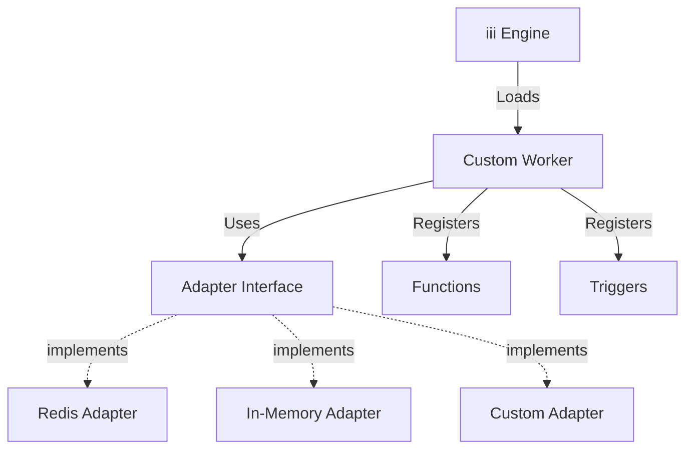
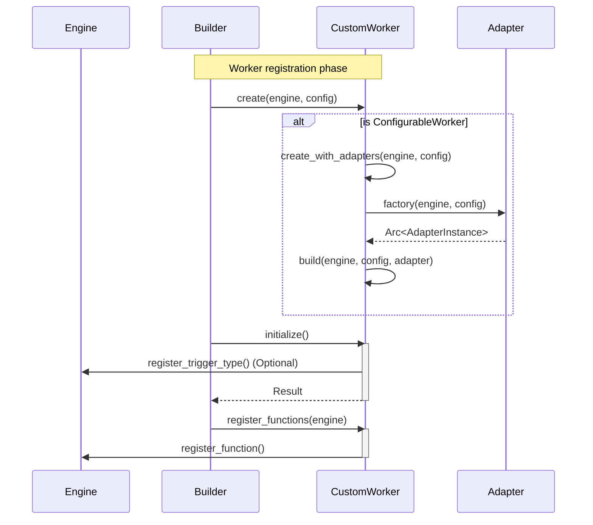
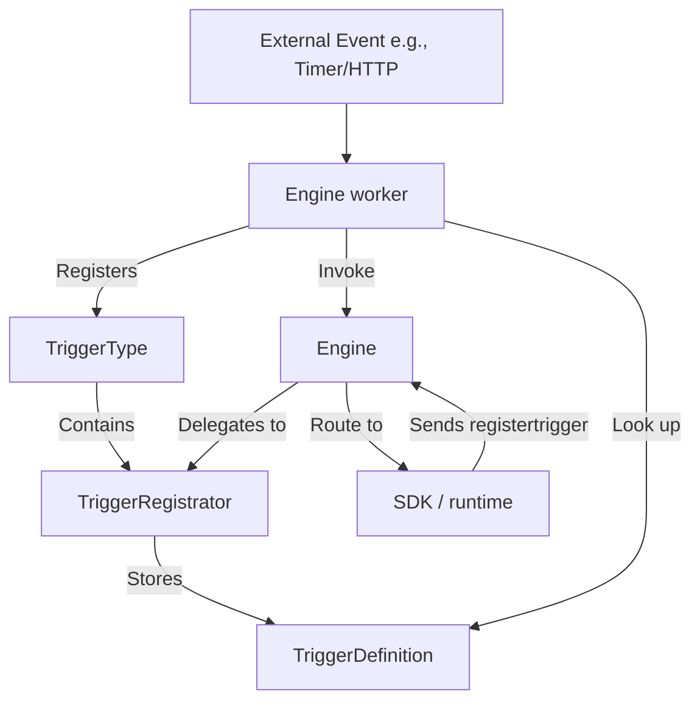

Custom workers in the iii Engine allow developers to extend the core functionality of the system. A worker acts as a container for logic that can register functions, triggers, and integrate with external systems.

## Introduction

Workers are dynamically loaded and configured, often utilizing an Adapter pattern to allow for swappable backend implementations (e.g., swapping an in-memory event bus for a Redis-backed one).

The engine provides a trait-based system where each worker type implements the `Worker` trait for lifecycle management and the `ConfigurableWorker` trait for handling configuration and adapter injection.



## Worker architecture

The worker system is built around two primary traits: `Worker` and `ConfigurableWorker`.

### Core Traits

| Trait                  | Description                                                                                   | Key Methods                                                  |
| ---------------------- | --------------------------------------------------------------------------------------------- | ------------------------------------------------------------ |
| **Worker**         | The base trait for all workers. Handles lifecycle, identification, and function registration. | `name()`, `create()`, `initialize()`, `register_functions()`, `start_background_tasks()`, `destroy()` |
| **ConfigurableWorker** | Extends `Worker` to support typed configuration and pluggable adapters.                   | `build()`, `registry()`, `adapter_name_from_config()`, `adapter_config_from_config()`       |

### Lifecycle Flow

The following diagram illustrates the lifecycle of a worker from creation to initialization.



## Implementing a configurable worker

Developing a custom worker typically involves defining an adapter interface, implementing specific adapters, and then wrapping them in a worker type.

### Step 1: Define the Adapter Trait

Define an `async_trait` that specifies the behavior your worker's backend must implement. This allows users to switch implementations via configuration.

```rust
use async_trait::async_trait;
use serde_json::Value;

#[async_trait]
pub trait CustomEventAdapter: Send + Sync + 'static {
    async fn emit(&self, topic: &str, event_data: Value);
    async fn subscribe(&self, topic: &str, id: &str, function_id: &str);
    async fn unsubscribe(&self, topic: &str, id: &str);
}
```

**Why async_trait?** Rust's async traits require this macro to handle the complexity of async function pointers.

### Step 2: Implement Adapter Registration

To make adapters discoverable by the configuration system, you must define a registration struct and use the `inventory` crate.

```rust
use std::sync::Arc;
use std::future::Future;
use std::pin::Pin;
use iii::engine::Engine;
use iii::modules::registry::AdapterRegistrationEntry;

pub type CustomEventAdapterFuture = Pin<
    Box<dyn Future<Output = anyhow::Result<Arc<dyn CustomEventAdapter>>> + Send>
>;

pub struct CustomEventAdapterRegistration {
    pub name: &'static str,
    pub factory: fn(Arc<Engine>, Option<Value>) -> CustomEventAdapterFuture,
}

// Implement AdapterRegistrationEntry trait
impl AdapterRegistrationEntry<dyn CustomEventAdapter> for CustomEventAdapterRegistration {
    fn name(&self) -> &'static str {
        self.name
    }

    fn factory(&self) -> fn(Arc<Engine>, Option<Value>) -> CustomEventAdapterFuture {
        self.factory
    }
}

// Register the type with inventory
inventory::collect!(CustomEventAdapterRegistration);
```

**Purpose**: This registration system allows the engine to discover and instantiate adapters dynamically based on configuration.

### Step 3: Create Adapter Factories

Define factory functions that instantiate your specific adapter implementations (e.g., `InMemory` or `Logging`).

```rust
fn make_inmemory_adapter(
    engine: Arc<Engine>,
    config: Option<Value>
) -> CustomEventAdapterFuture {
    Box::pin(async move {
        Ok(Arc::new(InMemoryEventAdapter::new(config, engine).await?)
            as Arc<dyn CustomEventAdapter>)
    })
}

// Register the specific adapter implementation
iii::register_adapter!(
    <CustomEventAdapterRegistration>
    "my::InMemoryEventAdapter",
    make_inmemory_adapter
);
```

### Step 4: Implement Adapter Logic

Create the actual adapter implementations.

<AccordionGroup>
  <Accordion title="In-Memory Adapter" icon="memory-stick">
    Simple in-memory implementation for development and testing.

    ```rust
    use std::collections::HashMap;
    use tokio::sync::RwLock;

    pub struct InMemoryEventAdapter {
        subscriptions: Arc<RwLock<HashMap<String, HashMap<String, String>>>>,
        engine: Arc<Engine>,
    }

    impl InMemoryEventAdapter {
        pub async fn new(
            _config: Option<Value>,
            engine: Arc<Engine>
        ) -> anyhow::Result<Self> {
            Ok(Self {
                subscriptions: Arc::new(RwLock::new(HashMap::new())),
                engine,
            })
        }
    }

    #[async_trait]
    impl CustomEventAdapter for InMemoryEventAdapter {
        async fn emit(&self, topic: &str, event_data: Value) {
            let subs = self.subscriptions.read().await;
            if let Some(by_id) = subs.get(topic) {
                for function_id in by_id.values() {
                    let _ = self.engine.call(function_id, event_data.clone()).await;
                }
            }
        }

        async fn subscribe(&self, topic: &str, id: &str, function_id: &str) {
            let mut subs = self.subscriptions.write().await;
            subs.entry(topic.to_string())
                .or_insert_with(HashMap::new)
                .insert(id.to_string(), function_id.to_string());
        }

        async fn unsubscribe(&self, topic: &str, id: &str) {
            let mut subs = self.subscriptions.write().await;
            if let Some(by_id) = subs.get_mut(topic) {
                by_id.remove(id);
            }
        }
    }
    ```

  </Accordion>

  <Accordion title="Logging Wrapper Adapter" icon="file-text">
    Wrapper adapter that logs all events while delegating to another adapter.

    ```rust
    pub struct LoggingEventAdapter {
        inner: Arc<dyn CustomEventAdapter>,
    }

    #[async_trait]
    impl CustomEventAdapter for LoggingEventAdapter {
        async fn emit(&self, topic: &str, event_data: Value) {
            tracing::info!(
                topic = %topic,
                event_data = %event_data,
                "Emitting event"
            );
            self.inner.emit(topic, event_data).await;
        }

        async fn subscribe(&self, topic: &str, id: &str, function_id: &str) {
            tracing::info!(topic = %topic, "Subscribing to topic");
            self.inner.subscribe(topic, id, function_id).await;
        }

        async fn unsubscribe(&self, topic: &str, id: &str) {
            tracing::info!(topic = %topic, "Unsubscribing from topic");
            self.inner.unsubscribe(topic, id).await;
        }
    }
    ```

  </Accordion>
</AccordionGroup>

### Step 5: Implement the worker logic

The worker struct holds the `Engine` reference and the injected `Adapter`.

```rust
use std::sync::Arc;

use async_trait::async_trait;
use iii::engine::Engine;
use iii::modules::module::{AdapterEntry, AdapterFactory, ConfigurableWorker};
use once_cell::sync::Lazy;
use serde::Deserialize;
use serde_json::Value;
use std::collections::HashMap;
use tokio::sync::RwLock;

#[derive(Debug, Clone, Deserialize, Default)]
#[serde(deny_unknown_fields)]
pub struct CustomEventWorkerConfig {
    #[serde(default)]
    pub adapter: Option<AdapterEntry>,
}

#[derive(Clone)]
pub struct CustomEventWorker {
    adapter: Arc<dyn CustomEventAdapter>,
    engine: Arc<Engine>,
    _config: CustomEventWorkerConfig,
}

#[async_trait]
impl ConfigurableWorker for CustomEventWorker {
    type Config = CustomEventWorkerConfig;
    type Adapter = dyn CustomEventAdapter;
    type AdapterRegistration = CustomEventAdapterRegistration;
    const DEFAULT_ADAPTER_NAME: &'static str = "my::InMemoryEventAdapter";

    // Define how to access the registry
    async fn registry() -> &'static RwLock<HashMap<String, AdapterFactory<Self::Adapter>>> {
        static REGISTRY: Lazy<RwLock<HashMap<String, AdapterFactory<dyn CustomEventAdapter>>>> =
            Lazy::new(|| RwLock::new(CustomEventWorker::build_registry()));
        &REGISTRY
    }

    // Builder method
    fn build(
        engine: Arc<Engine>,
        config: Self::Config,
        adapter: Arc<Self::Adapter>
    ) -> Self {
        Self {
            engine,
            _config: config,
            adapter
        }
    }

    fn adapter_name_from_config(config: &Self::Config) -> Option<String> {
        config.adapter.as_ref().map(|a| a.name.clone())
    }

    fn adapter_config_from_config(config: &Self::Config) -> Option<Value> {
        config.adapter.as_ref().and_then(|a| a.config.clone())
    }
}
```

## Registering Functions

Workers expose functionality to the engine (and thus to connected runtimes) by registering functions. This is typically done in the `initialize` method or `register_functions`.

### Registration Request Structure

When registering a function, you must provide a `RegisterFunctionRequest`.

| Field             | Type             | Description                                    |
| ----------------- | ---------------- | ---------------------------------------------- |
| `function_id`     | `String`         | Unique function ID (e.g., "custom::emit")      |
| `description`     | `Option<String>` | Human-readable description of the function     |
| `request_format`  | `Option<Value>`  | JSON Schema defining the expected input        |
| `response_format` | `Option<Value>`  | JSON Schema defining the expected output       |

<Note>
When using the `#[service]` macro with `#[function]` attributes, `request_format` and `response_format` are **auto-generated** as standard JSON Schema from your Rust types (via [`schemars`](https://docs.rs/schemars)). Your input/output types must derive `JsonSchema`. Manual schema specification is only needed for custom worker registration.
</Note>

### Example Registration

```rust
use std::sync::Arc;

use iii::engine::{Engine, RegisterFunctionRequest};
use iii::modules::module::Worker;
use serde_json::Value;

#[async_trait]
impl Worker for CustomEventWorker {
    fn name(&self) -> &'static str {
        "custom_event"
    }

    fn register_functions(&self, _engine: Arc<Engine>) {
        // Additional synchronous function registrations can go here
    }

    async fn create(engine: Arc<Engine>, config: Option<Value>) -> anyhow::Result<Box<dyn Worker>> {
        Self::create_with_adapters(engine, config).await
    }

    async fn initialize(&self) -> anyhow::Result<()> {
        self.engine.register_function(
            RegisterFunctionRequest {
                function_id: "custom::emit".to_string(),
                description: Some("Emit a custom event".to_string()),
                request_format: Some(serde_json::json!({
                    "type": "object",
                    "properties": {
                        "topic": { "type": "string" },
                        "data": { "type": "object" }
                    },
                    "required": ["topic", "data"]
                })),
                response_format: None,
                metadata: None,
            },
            Box::new(self.clone()), // The handler
        );
        Ok(())
    }
}
```

## Handling Function Invocations

To handle invocations, the worker (or a specific handler struct) must implement the `FunctionHandler` trait.

```rust
use std::future::Future;
use std::pin::Pin;

use iii::function::{FunctionHandler, FunctionResult};
use iii::protocol::ErrorBody;
use serde_json::Value;
use uuid::Uuid;

impl FunctionHandler for CustomEventWorker {
    fn handle_function(
        &self,
        _invocation_id: Option<Uuid>,
        _function_id: String,
        input: Value,
    ) -> Pin<Box<dyn Future<Output = FunctionResult<Option<Value>, ErrorBody>> + Send + 'static>> {
        let adapter = self.adapter.clone();
        Box::pin(async move {
            // 1. Parse Input
            let topic = match input
                .get("topic")
                .and_then(|v| v.as_str())
            {
                Some(t) => t,
                None => {
                    return FunctionResult::Failure(ErrorBody {
                        code: "missing_topic".into(),
                        message: "Missing 'topic' field".into(),
                        stacktrace: None,
                    });
                }
            };

            let data = input.get("data").cloned().unwrap_or(Value::Null);

            // 2. Execute Logic (using the adapter)
            adapter.emit(topic, data).await;

            // 3. Return Result
            FunctionResult::Success(None)
        })
    }
}
```

## Registering Triggers

Workers can also act as sources of events by registering `TriggerType`s. This allows the engine to route external events (like Cron ticks or HTTP requests) to specific functions.

### Trigger Architecture



### Implementation

To support triggers, a worker implements `TriggerRegistrator`.

```rust
use iii::{TriggerRegistrator, Trigger, TriggerType};
use std::future::Future;
use std::pin::Pin;

impl TriggerRegistrator for CustomEventWorker {
    fn register_trigger(
        &self,
        trigger: Trigger,
    ) -> Pin<Box<dyn Future<Output = Result<(), anyhow::Error>> + Send + '_>> {
        let adapter = self.adapter.clone();
        let trigger_id = trigger.id.clone();
        let function_id = trigger.function_id.clone();
        Box::pin(async move {
            // Extract configuration
            let config = trigger.config;
            let subscribes = config.get("subscribes")
                .and_then(|v| v.as_array())
                .ok_or_else(|| anyhow::anyhow!("Missing 'subscribes' array"))?;

            // Subscribe to each topic
            for topic in subscribes {
                let topic_str = topic.as_str()
                    .ok_or_else(|| anyhow::anyhow!("Invalid topic"))?;

                adapter
                    .subscribe(topic_str, &trigger_id, &function_id)
                    .await;
            }

            Ok(())
        })
    }
}
```

Then, register the trigger type during initialization:

```rust
async fn initialize(&self) -> anyhow::Result<()> {
    // Register functions
    // ... (function registration code)

    // Register trigger type
    let trigger_type = TriggerType {
        id: "event".to_string(),
        registrator: Box::new(self.clone()),
        description: Some("Event-based trigger".to_string()),
    };

    self.engine.register_trigger_type(trigger_type).await?;

    Ok(())
}
```

## Configuration

Workers are configured via `iii-config.yaml` or JSON passed during initialization. The `ConfigurableWorker` trait maps this configuration to a Rust struct.

### Configuration Struct

```rust
#[derive(Debug, Clone, Deserialize, Default)]
#[serde(deny_unknown_fields)]
pub struct CustomEventWorkerConfig {
    #[serde(default)]
    pub adapter: Option<AdapterEntry>,
}
```

### Usage in Config File

```yaml
workers:
  - name: my-custom-event
    config:
      adapter:
        name: my::LoggingEventAdapter
        config:
          inner_adapter: my::InMemoryEventAdapter
```

**Nested Adapters**: The logging adapter wraps the in-memory adapter, creating a decorator pattern for cross-cutting concerns.

## Complete Example

Here's a complete custom worker implementation:

### examples/custom_event_worker.rs

```rust
use async_trait::async_trait;
use once_cell::sync::Lazy;
use serde::Deserialize;
use serde_json::Value;
use std::collections::HashMap;
use std::future::Future;
use std::pin::Pin;
use std::sync::Arc;
use tokio::sync::RwLock;
use uuid::Uuid;

use iii::engine::{Engine, RegisterFunctionRequest};
use iii::function::{FunctionHandler, FunctionResult};
use iii::modules::module::{AdapterEntry, AdapterFactory, ConfigurableWorker, Worker};
use iii::modules::registry::{AdapterFuture, AdapterRegistrationEntry};
use iii::protocol::ErrorBody;
use iii::{Trigger, TriggerRegistrator, TriggerType};

// 1. Define Adapter Trait
#[async_trait]
pub trait CustomEventAdapter: Send + Sync + 'static {
    async fn emit(&self, topic: &str, event_data: Value);
    async fn subscribe(&self, topic: &str, id: &str, function_id: &str);
    async fn unsubscribe(&self, topic: &str, id: &str);
}

// 2. Implement In-Memory Adapter
pub struct InMemoryEventAdapter {
    subscriptions: Arc<RwLock<HashMap<String, HashMap<String, String>>>>,
    engine: Arc<Engine>,
}

impl InMemoryEventAdapter {
    pub async fn new(_config: Option<Value>, engine: Arc<Engine>) -> anyhow::Result<Self> {
        Ok(Self {
            subscriptions: Arc::new(RwLock::new(HashMap::new())),
            engine,
        })
    }
}

#[async_trait]
impl CustomEventAdapter for InMemoryEventAdapter {
    async fn emit(&self, topic: &str, event_data: Value) {
        let subs = self.subscriptions.read().await;
        if let Some(by_id) = subs.get(topic) {
            for function_id in by_id.values() {
                let _ = self.engine.call(function_id, event_data.clone()).await;
            }
        }
    }

    async fn subscribe(&self, topic: &str, id: &str, function_id: &str) {
        let mut subs = self.subscriptions.write().await;
        subs.entry(topic.to_string())
            .or_insert_with(HashMap::new)
            .insert(id.to_string(), function_id.to_string());
    }

    async fn unsubscribe(&self, topic: &str, id: &str) {
        let mut subs = self.subscriptions.write().await;
        if let Some(by_id) = subs.get_mut(topic) {
            by_id.remove(id);
        }
    }
}

type CustomEventAdapterFuture = AdapterFuture<dyn CustomEventAdapter>;

pub struct CustomEventAdapterRegistration {
    pub name: &'static str,
    pub factory: fn(Arc<Engine>, Option<Value>) -> CustomEventAdapterFuture,
}

impl AdapterRegistrationEntry<dyn CustomEventAdapter> for CustomEventAdapterRegistration {
    fn name(&self) -> &'static str {
        self.name
    }

    fn factory(&self) -> fn(Arc<Engine>, Option<Value>) -> CustomEventAdapterFuture {
        self.factory
    }
}

inventory::collect!(CustomEventAdapterRegistration);

fn make_inmemory_adapter(
    engine: Arc<Engine>,
    config: Option<Value>,
) -> CustomEventAdapterFuture {
    Box::pin(async move {
        Ok(Arc::new(InMemoryEventAdapter::new(config, engine).await?)
            as Arc<dyn CustomEventAdapter>)
    })
}

iii::register_adapter!(
    <CustomEventAdapterRegistration>
    "my::InMemoryEventAdapter",
    make_inmemory_adapter
);

// 3. Define worker configuration
#[derive(Debug, Clone, Deserialize, Default)]
#[serde(deny_unknown_fields)]
pub struct CustomEventWorkerConfig {
    #[serde(default)]
    pub adapter: Option<AdapterEntry>,
}

// 4. Implement worker type
#[derive(Clone)]
pub struct CustomEventWorker {
    adapter: Arc<dyn CustomEventAdapter>,
    engine: Arc<Engine>,
    _config: CustomEventWorkerConfig,
}

#[async_trait]
impl ConfigurableWorker for CustomEventWorker {
    type Config = CustomEventWorkerConfig;
    type Adapter = dyn CustomEventAdapter;
    type AdapterRegistration = CustomEventAdapterRegistration;
    const DEFAULT_ADAPTER_NAME: &'static str = "my::InMemoryEventAdapter";

    async fn registry() -> &'static RwLock<HashMap<String, AdapterFactory<Self::Adapter>>> {
        static REGISTRY: Lazy<RwLock<HashMap<String, AdapterFactory<dyn CustomEventAdapter>>>> =
            Lazy::new(|| RwLock::new(CustomEventWorker::build_registry()));
        &REGISTRY
    }

    fn build(
        engine: Arc<Engine>,
        config: Self::Config,
        adapter: Arc<Self::Adapter>,
    ) -> Self {
        Self {
            engine,
            _config: config,
            adapter,
        }
    }

    fn adapter_name_from_config(config: &Self::Config) -> Option<String> {
        config.adapter.as_ref().map(|a| a.name.clone())
    }

    fn adapter_config_from_config(config: &Self::Config) -> Option<Value> {
        config.adapter.as_ref().and_then(|a| a.config.clone())
    }
}

#[async_trait]
impl Worker for CustomEventWorker {
    fn name(&self) -> &'static str {
        "custom_event"
    }

    fn register_functions(&self, _engine: Arc<Engine>) {}

    async fn create(engine: Arc<Engine>, config: Option<Value>) -> anyhow::Result<Box<dyn Worker>> {
        Self::create_with_adapters(engine, config).await
    }

    async fn initialize(&self) -> anyhow::Result<()> {
        // Register emit function
        self.engine.register_function(
            RegisterFunctionRequest {
                function_id: "custom::emit".to_string(),
                description: Some("Emit a custom event".to_string()),
                request_format: Some(serde_json::json!({
                    "type": "object",
                    "properties": {
                        "topic": { "type": "string" },
                        "data": { "type": "object" }
                    },
                    "required": ["topic", "data"]
                })),
                response_format: None,
                metadata: None,
            },
            Box::new(self.clone()),
        );

        // Register trigger type
        let trigger_type = TriggerType {
            id: "event".to_string(),
            registrator: Box::new(self.clone()),
            description: Some("Event-based trigger".to_string()),
        };
        self.engine.register_trigger_type(trigger_type).await?;

        Ok(())
    }
}

impl FunctionHandler for CustomEventWorker {
    fn handle_function(
        &self,
        _invocation_id: Option<Uuid>,
        _function_id: String,
        input: Value,
    ) -> Pin<Box<dyn Future<Output = FunctionResult<Option<Value>, ErrorBody>> + Send + 'static>> {
        let adapter = self.adapter.clone();
        Box::pin(async move {
            let topic = input.get("topic").and_then(|v| v.as_str()).unwrap_or("");
            let data = input.get("data").cloned().unwrap_or(Value::Null);

            adapter.emit(topic, data).await;
            FunctionResult::Success(None)
        })
    }
}

impl TriggerRegistrator for CustomEventWorker {
    fn register_trigger(
        &self,
        trigger: Trigger,
    ) -> std::pin::Pin<Box<dyn std::future::Future<Output = Result<(), anyhow::Error>> + Send + '_>> {
        let adapter = self.adapter.clone();
        let trigger_id = trigger.id.clone();
        let function_id = trigger.function_id.clone();
        Box::pin(async move {
            let config = trigger.config;
            let subscribes = config.get("subscribes")
                .and_then(|v| v.as_array())
                .ok_or_else(|| anyhow::anyhow!("Missing 'subscribes' array"))?;

            for topic in subscribes {
                let topic_str = topic.as_str()
                    .ok_or_else(|| anyhow::anyhow!("Invalid topic"))?;
                adapter
                    .subscribe(topic_str, &trigger_id, &function_id)
                    .await;
            }

            Ok(())
        })
    }
}

iii::register_worker!("my-custom-event", CustomEventWorker);
```

### iii-config.yaml

```yaml
workers:
  - name: my-custom-event
    config:
      adapter:
        name: my::InMemoryEventAdapter
```

## Best Practices

<AccordionGroup>
  <Accordion title="Use Adapter Pattern">
    Always use adapters for external integrations to allow swapping implementations.

    ```rust
    // Good: Adapter-based design
    pub trait StorageAdapter {
        async fn save(&self, key: &str, value: Value);
    }

    // Avoid: Hard-coded implementation
    pub struct CoupledService {
        redis: RedisClient,  // Tightly coupled
    }
    ```

  </Accordion>

  <Accordion title="Implement Graceful Shutdown">
    Handle cleanup in the worker's `Drop` implementation or provide shutdown hooks.

    ```rust
    impl Drop for CustomEventWorker {
        fn drop(&mut self) {
            // Clean up resources
            tracing::info!("Shutting down CustomEventWorker");
        }
    }
    ```

  </Accordion>

  <Accordion title="Provide JSON Schemas">
    Always define request and response formats for functions to enable validation and documentation.

    ```rust
    request_format: Some(serde_json::json!({
        "type": "object",
        "properties": {
            "email": { "type": "string", "format": "email" },
            "age": { "type": "number", "minimum": 0 }
        },
        "required": ["email"]
    }))
    ```

  </Accordion>

  <Accordion title="Use Structured Logging">
    Use the `tracing` crate for structured logging with context.

    ```rust
    tracing::info!(
        topic = %topic,
        subscriber_count = by_id.len(),
        "Emitting event to subscribers"
    );
    ```

  </Accordion>
</AccordionGroup>

## Next Steps

<CardGroup cols={2}>
  <Card title="Built-in workers" href="/modules" icon="cubes">
    Explore built-in engine workers
  </Card>
  <Card title="Adapters" href="/advanced/adapters" icon="gear">
    Learn more about the adapter pattern
  </Card>
</CardGroup>
