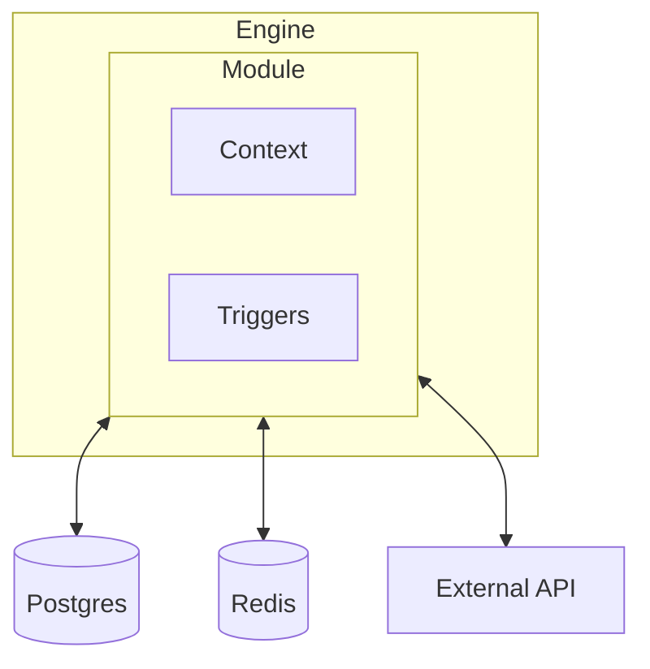

Modules are the interface between the Engine and the rest of the application. They are responsible for establishing connections to services, implementing trigger types, and supplying application Context.

Every capability in iii (HTTP endpoints, cron scheduling, state management, queues, streams, observability) is implemented as a Module. This modular architecture means the Engine itself stays small and focused on orchestration, while Modules handle all external concerns.



## Built-in Modules

| Module | Provides | Config key |
|--------|----------|------------|
| [HTTP](/modules/module-http) | HTTP trigger type, request/response handling | `rest_api` |
| [Queue](/modules/module-queue) | Async message processing with retries | `queue` |
| [Cron](/modules/module-cron) | Scheduled task execution | `cron` |
| [State](/modules/module-state) | Key-value state storage with atomic updates | `state` |
| [Stream](/modules/module-stream) | Real-time data streams with WebSocket push | `stream` |
| [PubSub](/modules/module-pubsub) | Publish/subscribe messaging | `pubsub` |
| [Observability](/modules/module-observability) | Structured logging, tracing, and metrics | `observability` |
| [Exec](/modules/module-exec) | Shell command execution | `exec` |
| [Bridge](/modules/module-bridge) | WebSocket bridge for SDK connections | `bridge` |

## How Modules Work

A Module has two responsibilities:

1. **Register trigger types**: A Module can introduce new ways to invoke Functions. For example, the HTTP module registers the `http` trigger type, and the Cron module registers the `cron` trigger type.

2. **Supply Context**: A Module can add capabilities to the Context object that gets passed to every Function. For example, the State module adds `state::get`, `state::set`, and other state operations.

Modules are configured in `config.yaml` (the engine default). Use `-c iii-config.yaml` to specify a custom path:

```yaml
modules:
  - class: modules::api::RestApiModule
    config:
      port: 3111
      host: 0.0.0.0
  - class: modules::state::StateModule
    config:
      adapter:
        class: modules::state::adapters::KvStore
        config:
          store_method: in_memory
  - class: modules::queue::QueueModule
    config:
      adapter:
        class: modules::queue::BuiltinQueueAdapter
        config:
          store_method: in_memory
```

<Info title="Custom Modules">
  You can build your own Modules to integrate any service or infrastructure. See [Custom Modules](/advanced/custom-modules) for a detailed guide.
</Info>
