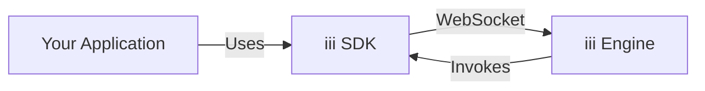
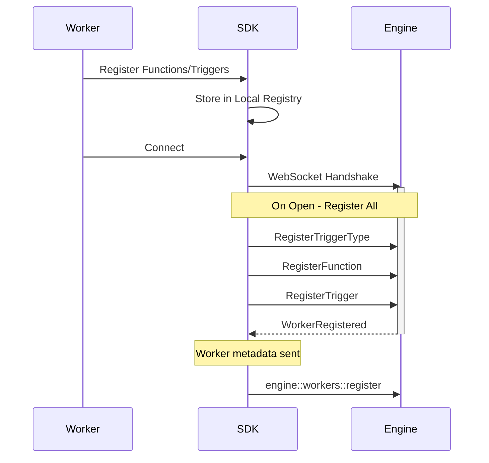

The iii SDK is available for Node.js, Python, and Rust, providing a client that connects to the iii Engine via WebSocket for function registration, trigger setup, and remote procedure calls.

## SDK Architecture

Each SDK maintains a persistent WebSocket connection to the engine. Functions and triggers are registered locally, then flushed to the engine on connection (and re-registered on reconnect).



## Connection Lifecycle

The SDK establishes a WebSocket connection to the engine (defaulting to `ws://127.0.0.1:49134`). Upon connection, it flushes all pending registration messages (trigger types, services, functions, triggers) to ensure the engine is aware of the worker's capabilities.




### Reconnection

All three SDKs handle reconnection automatically. The Node SDK supports configurable exponential backoff with jitter. On reconnect, all registered functions, triggers, and services are re-sent to the engine.

## Message Types and Protocol

The SDKs communicate with the engine using JSON messages over WebSocket. Each message has a `type` field.

| Message Type | Description | Key Fields |
| --- | --- | --- |
| `registerfunction` | Registers a triggerable function | `id`, `description` |
| `registertrigger` | Binds a trigger config to a function | `trigger_type`, `function_id`, `config` |
| `invokefunction` | Requests function execution | `function_id`, `data`, `invocation_id` |
| `invocationresult` | Returns execution result | `invocation_id`, `result`, `error` |
| `registertriggertype` | Registers a custom trigger type | `id`, `description` |
| `workerregistered` | Engine confirms worker registration | `worker_id` |

Invocations can be fire-and-forget by omitting `invocation_id`. Distributed tracing context is propagated via `traceparent` and `baggage` fields.

## Node.js Implementation

The Node.js SDK (`iii-sdk`) uses TypeScript and the `ws` library.

### Installation

```bash
npm install iii-sdk
```

### Basic Usage

```typescript
import { registerWorker, Logger } from 'iii-sdk'

const iii = registerWorker('ws://127.0.0.1:49134')

iii.registerFunction(
  { id: 'users::create', description: 'Create a user' },
  async (data) => {
    const logger = new Logger()
    logger.info('Creating user', data)
    const user = { id: crypto.randomUUID(), ...data }
    return { status_code: 201, body: user } satisfies ApiResponse
  },
)

iii.registerTrigger({
  type: 'http',
  function_id: 'users::create',
  config: { api_path: '/users', http_method: 'POST' },
})
```

### Internal Structure

The `Sdk` class (returned by `registerWorker()`) manages:
- `functions` — `Map<string, RemoteFunctionData>` of registered handlers
- `triggers` — `Map<string, RegisterTriggerMessage>` of trigger bindings
- `invocations` — `Map<string, Invocation>` of pending call/response pairs
- `messagesToSend` — queue for messages sent before the socket is open

On connection open, all registrations are flushed and worker metadata is sent. On close, automatic reconnection is scheduled with exponential backoff.

### OpenTelemetry

OpenTelemetry is initialized automatically by default. Each function invocation is wrapped in a span with trace context propagated from the engine. Disable with `registerWorker(url, { otel: { enabled: false } })` or `OTEL_ENABLED=false`.

### Subpath Exports

| Import | Contents |
| --- | --- |
| `iii-sdk` | `registerWorker`, `Logger`, `OTel context`, `ISdk`, `ApiRequest`, `ApiResponse` |
| `iii-sdk/stream` | `IStream`, stream input/output types, `UpdateOp` |
| `iii-sdk/state` | State management types |
| `iii-sdk/telemetry` | `initOtel`, `getTracer`, `getMeter`, `withSpan`, `SpanKind`, etc. |

## Python Implementation

The Python SDK (`iii-sdk` on PyPI, imported as `iii`) uses `websockets`.

### Installation

```bash
pip install iii-sdk
```

### Basic Usage

```python
from iii import InitOptions, ApiRequest, ApiResponse, register_worker

iii = register_worker(
    address="ws://127.0.0.1:49134",
    options=InitOptions(worker_name="my-worker"),
)

def create_user(data):
    logger = Logger()
    logger.info("Creating user")
    user = {"id": "123", **data}
    return {"status_code": 201, "body": user}

iii.register_function({"id": "users::create"}, create_user)

iii.register_trigger({
    "type": "http",
    "function_id": "users::create",
    "config": {"api_path": "/users", "http_method": "POST"},
})
```

### Key Components

<AccordionGroup>
  <Accordion title="III" icon="network-wired">
    The main client class. Manages the WebSocket connection, function/trigger registries, and reconnection.

    ```python
    from iii import InitOptions, register_worker

    iii = register_worker(
        address="ws://127.0.0.1:49134",
        options=InitOptions(worker_name="worker-1"),
    )
    ```

  </Accordion>

  <Accordion title="Logger" icon="file-text">
    Context-aware logger that emits structured logs via OpenTelemetry LogRecords when OTel is initialized, falling back to Python's `logging` module.

    ```python
    from iii import Logger

    logger = Logger(service_name="my-worker")
    logger.info("Processing started")
    logger.error("Something failed")
    ```

  </Accordion>

  <Accordion title="Types" icon="code">
    Pydantic models for API request/response and stream operations.

    ```python
    from iii import ApiRequest, ApiResponse

    def handler(data) -> ApiResponse:
        req = ApiRequest(**data)
        return ApiResponse(status_code=200, body={"path": req.path_params})
    ```

  </Accordion>
</AccordionGroup>

### Streams

Register a custom stream by implementing the `IStream` abstract class:

```python
from iii import register_worker
from iii.stream import IStream, StreamGetInput, StreamSetInput, StreamDeleteInput, StreamListInput, StreamUpdateInput

iii = register_worker('ws://localhost:49134')

class MyStream(IStream):
    async def get(self, input: StreamGetInput):
        ...
    async def set(self, input: StreamSetInput):
        ...
    async def delete(self, input: StreamDeleteInput):
        ...
    async def list(self, input: StreamListInput):
        ...
    async def list_groups(self, input):
        ...
    async def update(self, input: StreamUpdateInput):
        ...

iii.create_stream("my-stream", MyStream())
```

## Rust Implementation

The Rust SDK (`iii-sdk` crate, lib name `iii_sdk`) uses `tokio` and `tokio-tungstenite`.

### Installation

```toml
[dependencies]
iii-sdk = { version = "0.2", features = ["otel"] }
```

### Basic Usage

```rust
use iii_sdk::{InitOptions, Logger, register_worker, RegisterFunctionMessage, RegisterTriggerInput};
use serde_json::json;

#[tokio::main]
async fn main() -> Result<(), Box<dyn std::error::Error>> {
    let iii = register_worker("ws://127.0.0.1:49134", InitOptions::default())?;

    iii.register_function(RegisterFunctionMessage { id: "users::create".into(), description: None, request_format: None, response_format: None, metadata: None, invocation: None }, |input| async move {
        let logger = Logger();
        logger.info("Creating user", None);
        Ok(json!({
            "status_code": 201,
            "body": { "id": "123", "name": input["name"] },
        }))
    });

    iii.register_trigger(RegisterTriggerInput { trigger_type: "http".into(), function_id: "users::create".into(), config: json!({
        "api_path": "/users",
        "http_method": "POST",
    }) })?;

    loop {
        tokio::time::sleep(std::time::Duration::from_secs(60)).await;
    }
}
```

### Streams

The Rust SDK provides atomic stream updates via the `Streams` helper:

```rust
use iii_sdk::{Streams, UpdateOp};

let streams = Streams::new(iii.clone());

let result = streams.update(
    "orders::user-123::order-456",
    vec![
        UpdateOp::increment("total", 100),
        UpdateOp::set("status", json!("processing")),
    ],
).await?;
```

### Error Handling

All fallible operations return `Result<T, IIIError>`. Common variants:

- `IIIError::NotConnected` — WebSocket is not open
- `IIIError::Timeout` — invocation timed out
- `IIIError::Remote` — remote function returned an error
- `IIIError::Serde` — JSON serialization failed

## Request and Response Models

All three SDKs use the same `ApiRequest` / `ApiResponse` shape for HTTP trigger handlers.

### ApiRequest

<ResponseField name="path_params" type="dict / Record">
  URL path parameters.

```python
req.path_params  # {"userId": "123"}
```

</ResponseField>

<ResponseField name="query_params" type="dict / Record">
  Query string parameters.

```python
req.query_params  # {"status": "active"}
```

</ResponseField>

<ResponseField name="body" type="Any / unknown">
  Parsed request payload.
</ResponseField>

<ResponseField name="headers" type="dict / Record">
  Request headers.
</ResponseField>

<ResponseField name="method" type="str / string">
  HTTP method (GET, POST, etc.).
</ResponseField>

### ApiResponse

<ResponseField name="status_code" type="int / number">
  HTTP status code.

<Tabs groupId="language" persist items={['Node / TypeScript', 'Python', 'Rust']}>
  <Tab value="Node / TypeScript">

```typescript
return { status_code: 200, body: { message: 'OK' } } satisfies ApiResponse
```

  </Tab>
  <Tab value="Python">

```python
return ApiResponse(status_code=200, body={"message": "OK"})
```

  </Tab>
  <Tab value="Rust">

```rust
Ok(json!({ "status_code": 200, "body": { "message": "OK" } }))
```

  </Tab>
</Tabs>

</ResponseField>

<ResponseField name="body" type="Any / unknown">
  Response payload (serialized to JSON).
</ResponseField>

<ResponseField name="headers" type="dict / Record">
  Response headers (optional).
</ResponseField>

## Stream Management

All SDKs interact with the engine's Stream module via `stream::` namespace functions.

| Operation | Function ID | Description |
| --- | --- | --- |
| Get | `stream::get({stream_name})` | Retrieve an item |
| Set | `stream::set({stream_name})` | Save an item |
| Delete | `stream::delete({stream_name})` | Remove an item |
| List | `stream::list({stream_name})` | List items in a group |
| List Groups | `stream::list_groups({stream_name})` | List all groups |
| Update | `stream::update({stream_name})` | Atomic update with operations |

Custom stream implementations override the default engine behavior for a given stream name. Register them with `createStream` (Node), `create_stream` (Python), or by registering the individual `stream::*` functions (Rust).

## Best Practices

<AccordionGroup>
  <Accordion title="Type Safety">
    Use typed request/response models for better IDE support and fewer runtime errors.

    <Tabs groupId="language" persist items={['Node / TypeScript', 'Python', 'Rust']}>
      <Tab value="Node / TypeScript">

```typescript
import type { ApiRequest, ApiResponse } from 'iii-sdk'

iii.registerFunction({ id: 'handler' }, async (data: ApiRequest) => {
  return { status_code: 200, body: { ok: true } } satisfies ApiResponse
})
```

      </Tab>
      <Tab value="Python">

```python
from iii import ApiRequest, ApiResponse

def handler(data) -> ApiResponse:
    req = ApiRequest(**data)
    return ApiResponse(status_code=200, body={"ok": True})
```

      </Tab>
      <Tab value="Rust">

```rust
use iii_sdk::{types::ApiRequest, RegisterFunctionMessage};

iii.register_function(RegisterFunctionMessage { id: "handler".into(), description: None, request_format: None, response_format: None, metadata: None, invocation: None }, |input| async move {
    let req: ApiRequest = serde_json::from_value(input)?;
    Ok(json!({ "status_code": 200, "body": { "ok": true } }))
});
```

      </Tab>
    </Tabs>

  </Accordion>

  <Accordion title="Error Handling">
    Always handle errors gracefully and return appropriate HTTP status codes.

    ```python
    def handler(data):
        try:
            result = process_data(data)
            return ApiResponse(status_code=200, body=result)
        except ValueError as e:
            logger = Logger()
            logger.error(f"Validation error: {e}")
            return ApiResponse(status_code=400, body={"error": str(e)})
    ```

  </Accordion>

  <Accordion title="Graceful Shutdown">
    Implement proper shutdown to flush telemetry and clean up resources.

    <Tabs groupId="language" persist items={['Node / TypeScript', 'Python', 'Rust']}>
      <Tab value="Node / TypeScript">

```typescript
process.on('SIGINT', async () => {
  await iii.shutdown()
  process.exit(0)
})
```

      </Tab>
      <Tab value="Python">

```python
try:
    threading.Event().wait()
finally:
    iii.shutdown()
```

      </Tab>
      <Tab value="Rust">

```rust
tokio::signal::ctrl_c().await?;
iii.shutdown_async().await;
```

      </Tab>
    </Tabs>

  </Accordion>
</AccordionGroup>

## Next Steps

<Card title="API Reference" href="/docs/api-reference/iii-sdk">
  Full method signatures for all three SDKs
</Card>