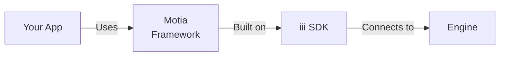

Motia is a high-level polyglot framework built on top of the iii SDK that provides type safety, declarative configuration, and structured workflows. Steps can be written in JavaScript, TypeScript, or Python.

## Why Motia?

While the base `iii` SDK gives you full control, Motia adds:

- **Polyglot Support**: Write steps in JavaScript, TypeScript, or Python
- **Type Safety**: Validation and type checking for all configurations
- **Declarative Steps**: Define workflows as step files
- **Auto-Discovery**: CLI automatically finds and loads steps
- **Flow Context**: Built-in state, logging, and event emission
- **Middleware Support**: Request/response interceptors for API routes



## Installation

### JavaScript/TypeScript

```bash
npm install @iii-dev/motia
# or
yarn add @iii-dev/motia
```

### Python

```bash
pip install motia
```

## Quick Start

### 1. Create a Step File

Steps are the building blocks of Motia, and can be written in JavaScript, TypeScript, or Python.

### TypeScript

**TypeScript Example** (`steps/hello.step.ts`):

```typescript
import type { ApiRouteConfig, Handlers } from '@iii-dev/motia'
import { z } from 'zod'

export const config: ApiRouteConfig = {
  type: 'api',
  name: 'hello',
  path: '/hello/:name',
  method: 'GET',
  responseSchema: {
    200: z.object({
      message: z.string(),
    }),
  },
}

export const handler: Handlers<typeof config> = async (req, { logger }) => {
  const name = req.pathParams.name || 'World'

  logger.info(`Greeting ${name}`)

  return {
    status: 200,
    body: { message: `Hello, ${name}!` },
  }
}
```

### Python

**Python Example** (`steps/hello.step.py`):

```python
from motia import ApiRouteConfig, ApiRequest, ApiResponse, FlowContext, logger, step_wrapper

# Define step configuration
config = ApiRouteConfig(
    type="api",
    name="hello",
    path="/hello/:name",
    method="GET"
)

# Define handler
def handler(req: ApiRequest, ctx: FlowContext) -> ApiResponse:
    name = req.path_params.get("name", "World")

    logger.info(f"Greeting {name}")

    return ApiResponse(
        status=200,
        body={"message": f"Hello, {name}!"}
    )

# Register step
step_wrapper(config, __file__, handler)
```

### 2. Run Your Application

```bash
# Start iii engine (in another terminal)
iii

# Run Motia
motia run --dir steps
```

### 3. Test Your Endpoint

```bash
curl http://localhost:3111/hello/Alice
# {"message": "Hello, Alice!"}
```

## Step Types

### API Steps

Handle HTTP requests with validation and type safety.

### TypeScript

```typescript
import type { ApiRouteConfig, Handlers } from '@iii-dev/motia'
import { z } from 'zod'

export const config: ApiRouteConfig = {
  type: 'api',
  name: 'create-user',
  path: '/users',
  method: 'POST',
  bodySchema: z.object({
    name: z.string(),
    email: z.string().email(),
  }),
  responseSchema: {
    201: z.object({
      id: z.string(),
      name: z.string(),
      email: z.string(),
    }),
  },
  emits: ['user-created'],
}

export const handler: Handlers<typeof config> = async (req, { emit, logger }) => {
  const user = await createUser(req.body)

  // Emit event
  await emit({ topic: 'user-created', data: user })

  logger.info('User created', { userId: user.id })

  return { status: 201, body: user }
}
```

### Python

```python
from motia import ApiRouteConfig, ApiRequest, ApiResponse, FlowContext, step_wrapper

config = ApiRouteConfig(
    type="api",
    name="create-user",
    path="/users",
    method="POST",
    body_schema={
        "type": "object",
        "properties": {
            "name": {"type": "string"},
            "email": {"type": "string", "format": "email"}
        },
        "required": ["name", "email"]
    }
)

def handler(req: ApiRequest, ctx: FlowContext) -> ApiResponse:
    user = create_user(req.body)

    # Emit event
    ctx.emit("user.created", user)

    return ApiResponse(status=201, body=user)

step_wrapper(config, __file__, handler)
```

### Event Steps

React to events from the event bus.

### TypeScript

```typescript
import type { EventConfig, Handlers } from '@iii-dev/motia'
import { z } from 'zod'

export const config: EventConfig = {
  type: 'event',
  name: 'send-welcome-email',
  subscribes: ['user-created'],
  input: z.object({
    id: z.string(),
    name: z.string(),
    email: z.string(),
  }),
}

export const handler: Handlers<typeof config> = async (data, { logger }) => {
  logger.info(`Sending welcome email to ${data.email}`)
  await sendEmail(data.email, 'Welcome!')
}
```

### Python

```python
from motia import EventConfig, FlowContext, logger, step_wrapper

config = EventConfig(
    type="event",
    name="send-welcome-email",
    subscribes=["user.created"]
)

def handler(data, ctx: FlowContext):
    logger.info(f"Sending welcome email to {data['email']}")
    send_email(data['email'], "Welcome!")

step_wrapper(config, __file__, handler)
```

### Cron Steps

Run tasks on a schedule using cron expressions.

### TypeScript

```typescript
import type { CronConfig, Handlers } from '@iii-dev/motia'

export const config: CronConfig = {
  type: 'cron',
  name: 'daily-report',
  cron: '0 9 * * *', // Every day at 9 AM
  emits: ['report-generated'],
}

export const handler: Handlers<typeof config> = async ({ emit, logger }) => {
  const report = await generateDailyReport()
  await emit({ topic: 'report-generated', data: report })
  logger.info('Daily report generated')
}
```

### Python

```python
from motia import CronConfig, FlowContext, logger, step_wrapper

config = CronConfig(
    type="cron",
    name="daily-report",
    cron="0 9 * * *",  # Every day at 9 AM
    emits=["report.generated"]
)

def handler(data, ctx: FlowContext):
    report = generate_daily_report()
    ctx.emit("report.generated", report)
    logger.info("Daily report generated")

step_wrapper(config, __file__, handler)
```

## Flow Context

Every handler receives a `FlowContext` with runtime utilities:

> **Naming Conventions**: TypeScript uses camelCase (`traceId`, `pathParams`) while Python uses snake_case (`trace_id`, `path_params`). The examples below show both styles.

<ResponseField name="emit" type="function">
  Emit events to the event bus.

**TypeScript:**

```typescript
await emit({ topic: 'topic-name', data: { key: 'value' } })
```

**Python:**

```python
ctx.emit("topic.name", {"key": "value"})
```

</ResponseField>

<ResponseField name="traceId / trace_id" type="string">
  Distributed tracing identifier for correlating logs.

**TypeScript:**

```typescript
logger.info(`[${traceId}] Processing request`)
```

**Python:**

```python
logger.info(f"[{current_trace_id()}] Processing request")
```

</ResponseField>

<ResponseField name="state" type="InternalStateManager">
  Internal state management (uses `$$internal-state` stream).

**TypeScript:**

```typescript
await state.set('config', 'theme', 'dark')
const theme = await state.get('config', 'theme')
```

**Python:**

```python
ctx.state.set("config", "theme", "dark")
theme = ctx.state.get("config", "theme")
```

</ResponseField>

<ResponseField name="streams" type="Streams">
  Access to stream instances.

**TypeScript:**

```typescript
await streams.todos.set('inbox', 'item-1', { title: 'Buy milk' })
```

**Python:**

```python
todo_stream = Stream("todos")
todo_stream.set("inbox", "item-1", {"title": "Buy milk"})
```

</ResponseField>

<ResponseField name="logger" type="Logger">
  Context-aware logger with trace ID.

**TypeScript:**

```typescript
logger.info('Processing started')
logger.error('An error occurred')
```

**Python:**

```python
logger.info("Processing started")
logger.error("An error occurred", exc_info=True)
```

</ResponseField>

## Streams and State

### Using Streams

Streams provide distributed state management:

```python
from motia import Stream, ApiRequest, ApiResponse, FlowContext, step_wrapper

# Define stream
todo_stream = Stream("todos")

def create_todo(req: ApiRequest, ctx: FlowContext) -> ApiResponse:
    todo_id = generate_id()
    todo = {
        "id": todo_id,
        "title": req.body["title"],
        "completed": False
    }

    # Store in stream
    todo_stream.set("inbox", todo_id, todo)

    return ApiResponse(status=201, body=todo)

def get_todos(req: ApiRequest, ctx: FlowContext) -> ApiResponse:
    # Get all todos in group
    todos = todo_stream.get_group("inbox")
    return ApiResponse(status=200, body=todos)
```

**Stream Hierarchy:**

- **Stream Name**: `todos` (top-level namespace)
- **Group ID**: `inbox` (partition within stream)
- **Item ID**: `todo-123` (unique identifier)
- **Data**: The actual JSON payload

### Internal State

Use `ctx.state` for configuration and internal data:

```python
def handler(req: ApiRequest, ctx: FlowContext) -> ApiResponse:
    # Set state
    ctx.state.set("user-prefs", "theme", "dark")

    # Get state
    theme = ctx.state.get("user-prefs", "theme")

    # Get all in group
    prefs = ctx.state.get_group("user-prefs")

    # Delete
    ctx.state.delete("user-prefs", "theme")
```

## Middleware

Add middleware for authentication, logging, or validation:

```python
from motia import ApiRouteConfig, ApiRequest, ApiResponse, FlowContext, step_wrapper

# Define middleware
def auth_middleware(req: ApiRequest, ctx: FlowContext, next_handler):
    token = req.headers.get("authorization")

    if not token:
        return ApiResponse(status=401, body={"error": "Unauthorized"})

    # Validate token
    user = validate_token(token)
    if not user:
        return ApiResponse(status=401, body={"error": "Invalid token"})

    # Add user to context (you can modify req or ctx here)
    ctx.user = user

    # Call next handler
    return next_handler(req, ctx)

# Use middleware in step
config = ApiRouteConfig(
    type="api",
    name="protected-route",
    path="/protected",
    method="GET",
    middleware=[auth_middleware]  # Add middleware
)

def handler(req: ApiRequest, ctx: FlowContext) -> ApiResponse:
    # ctx.user is available here
    return ApiResponse(
        status=200,
        body={"message": f"Hello, {ctx.user['name']}"}
    )

step_wrapper(config, __file__, handler)
```

## Infrastructure Configuration

Define compute resources and queue behavior for your steps:

```python
from motia import EventConfig, InfrastructureConfig, HandlerConfig, QueueConfig, step_wrapper

config = EventConfig(
    type="event",
    name="heavy-processing",
    subscribes=["data.uploaded"],
    infrastructure=InfrastructureConfig(
        handler=HandlerConfig(
            ram=512,      # 512 MB memory
            cpu=2,        # 2 CPU cores
            timeout=300   # 5 minute timeout
        ),
        queue=QueueConfig(
            type="fifo",            # FIFO queue
            max_retries=5,          # Retry 5 times
            visibility_timeout=60,  # 1 minute visibility
            delay_seconds=10        # 10 second delay
        )
    )
)

def handler(data, ctx: FlowContext):
    # Heavy processing logic
    process_large_file(data)

step_wrapper(config, __file__, handler)
```

## CLI Commands

<AccordionGroup>
  <Accordion title="motia run">
    Run your Motia application:

    ```bash
    # Run with default directory (./steps)
    motia run

    # Specify directory
    motia run --dir ./my-steps

    # Enable watch mode for hot-reload
    motia run --watch

    # Verbose logging
    motia run --verbose
    ```

  </Accordion>

  <Accordion title="motia build">
    Build your project (prepare for deployment):

    ```bash
    motia build
    ```

  </Accordion>
</AccordionGroup>

## Project Structure

Organize your Motia project. Steps can use `.ts`, `.js`, or `.py` extensions:

**TypeScript/JavaScript Project:**

```
my-app/
├── steps/
│   ├── api/
│   │   ├── users.step.ts
│   │   └── orders.step.ts
│   ├── events/
│   │   ├── notifications.step.ts
│   │   └── analytics.step.ts
│   └── cron/
│       └── cleanup.step.ts
├── config.yaml          # Engine configuration
├── package.json
└── tsconfig.json
```

**Python Project:**

```
my-app/
├── steps/
│   ├── api/
│   │   ├── users.step.py
│   │   └── orders.step.py
│   ├── events/
│   │   ├── notifications.step.py
│   │   └── analytics.step.py
│   └── cron/
│       └── cleanup.step.py
├── config.yaml          # Engine configuration
└── requirements.txt
```

## Complete Example: Todo API

This example shows a simple Todo API with create, list, and notification functionality.

### TypeScript

**steps/create_todo.step.ts**

```typescript
import type { ApiRouteConfig, Handlers } from '@iii-dev/motia'
import { z } from 'zod'

const todoSchema = z.object({
  id: z.string(),
  title: z.string(),
  completed: z.boolean(),
})

export const config: ApiRouteConfig = {
  type: 'api',
  name: 'create-todo',
  path: '/todos',
  method: 'POST',
  bodySchema: z.object({
    title: z.string(),
  }),
  responseSchema: {
    201: todoSchema,
  },
  emits: ['todo-created'],
}

export const handler: Handlers<typeof config> = async (req, { streams, emit, logger }) => {
  const todoId = `todo-${Date.now()}-${Math.random().toString(36).substring(2, 9)}`

  const todo = {
    id: todoId,
    title: req.body.title,
    completed: false,
  }

  await streams.todos.set('default', todoId, todo)
  await emit({ topic: 'todo-created', data: todo })

  logger.info('Created todo', { todoId })

  return { status: 201, body: todo }
}
```

**steps/list_todos.step.ts**

```typescript
import type { ApiRouteConfig, Handlers } from '@iii-dev/motia'
import { z } from 'zod'

export const config: ApiRouteConfig = {
  type: 'api',
  name: 'list-todos',
  path: '/todos',
  method: 'GET',
  responseSchema: {
    200: z.array(
      z.object({
        id: z.string(),
        title: z.string(),
        completed: z.boolean(),
      }),
    ),
  },
}

export const handler: Handlers<typeof config> = async (req, { streams }) => {
  const todos = await streams.todos.getGroup('default')
  return { status: 200, body: todos }
}
```

**steps/notify_todo.step.ts**

```typescript
import type { EventConfig, Handlers } from '@iii-dev/motia'
import { z } from 'zod'

export const config: EventConfig = {
  type: 'event',
  name: 'notify-todo-created',
  subscribes: ['todo-created'],
  input: z.object({
    id: z.string(),
    title: z.string(),
    completed: z.boolean(),
  }),
}

export const handler: Handlers<typeof config> = async (data, { logger }) => {
  logger.info('New todo created', { title: data.title })
  // Send notification logic here
}
```

### Python

**steps/create_todo.step.py**

```python
from motia import ApiRouteConfig, ApiRequest, ApiResponse, FlowContext, Stream, logger, step_wrapper

todo_stream = Stream("todos")

config = ApiRouteConfig(
    type="api",
    name="create-todo",
    path="/todos",
    method="POST"
)

def handler(req: ApiRequest, ctx: FlowContext) -> ApiResponse:
    import uuid

    todo_id = str(uuid.uuid4())
    todo = {
        "id": todo_id,
        "title": req.body["title"],
        "completed": False
    }

    todo_stream.set("default", todo_id, todo)
    ctx.emit("todo.created", todo)

    logger.info(f"Created todo: {todo_id}")

    return ApiResponse(status=201, body=todo)

step_wrapper(config, __file__, handler)
```

**steps/list_todos.step.py**

```python
from motia import ApiRouteConfig, ApiRequest, ApiResponse, FlowContext, Stream, step_wrapper

todo_stream = Stream("todos")

config = ApiRouteConfig(
    type="api",
    name="list-todos",
    path="/todos",
    method="GET"
)

def handler(req: ApiRequest, ctx: FlowContext) -> ApiResponse:
    todos = todo_stream.get_group("default")
    return ApiResponse(status=200, body=todos)

step_wrapper(config, __file__, handler)
```

**steps/notify_todo.step.py**

```python
from motia import EventConfig, FlowContext, logger, step_wrapper

config = EventConfig(
    type="event",
    name="notify-todo-created",
    subscribes=["todo.created"]
)

def handler(data, ctx: FlowContext):
    logger.info(f"New todo created: {data['title']}")
    # Send notification logic here

step_wrapper(config, __file__, handler)
```

## Best Practices

<AccordionGroup>
  <Accordion title="Organize by Feature">
    Group related steps together:

    ```
    steps/
    ├── users/
    │   ├── create.step.py
    │   ├── update.step.py
    │   └── notify.step.py
    └── orders/
        ├── create.step.py
        └── process.step.py
    ```

  </Accordion>

  <Accordion title="Use Type Hints">
    Leverage Python type hints for better IDE support:

    ```python
    from typing import Dict, Any

    def handler(
        req: ApiRequest[Dict[str, Any]],
        ctx: FlowContext
    ) -> ApiResponse[Dict[str, Any]]:
        ...
    ```

  </Accordion>

  <Accordion title="Error Handling">
    Always handle errors gracefully:

    ```python
    def handler(req: ApiRequest, ctx: FlowContext) -> ApiResponse:
        try:
            result = process_data(req.body)
            return ApiResponse(status=200, body=result)
        except ValueError as e:
            logger.error(f"Validation error: {e}")
            return ApiResponse(status=400, body={"error": str(e)})
        except Exception as e:
            logger.error(f"Unexpected error: {e}", exc_info=True)
            return ApiResponse(status=500, body={"error": "Internal error"})
    ```

  </Accordion>

  <Accordion title="Emit Events for Workflows">
    Use events to chain operations:

    ```python
    # Step 1: Create order
    ctx.emit("order.created", order)

    # Step 2: Process payment (separate step listening to order.created)
    # Step 3: Send confirmation (separate step listening to payment.completed)
    ```

  </Accordion>
</AccordionGroup>

## Next Steps

<Columns cols={2}>
  <Card icon={<Code />} title="Base SDK" href="/docs/tutorials/quickstart">
    Learn about the low-level iii SDK
  </Card>
  <Card icon={<Activity />} title="Streams" href="/docs/modules/module-stream">
    Deep dive into state management
  </Card>
</Columns>
