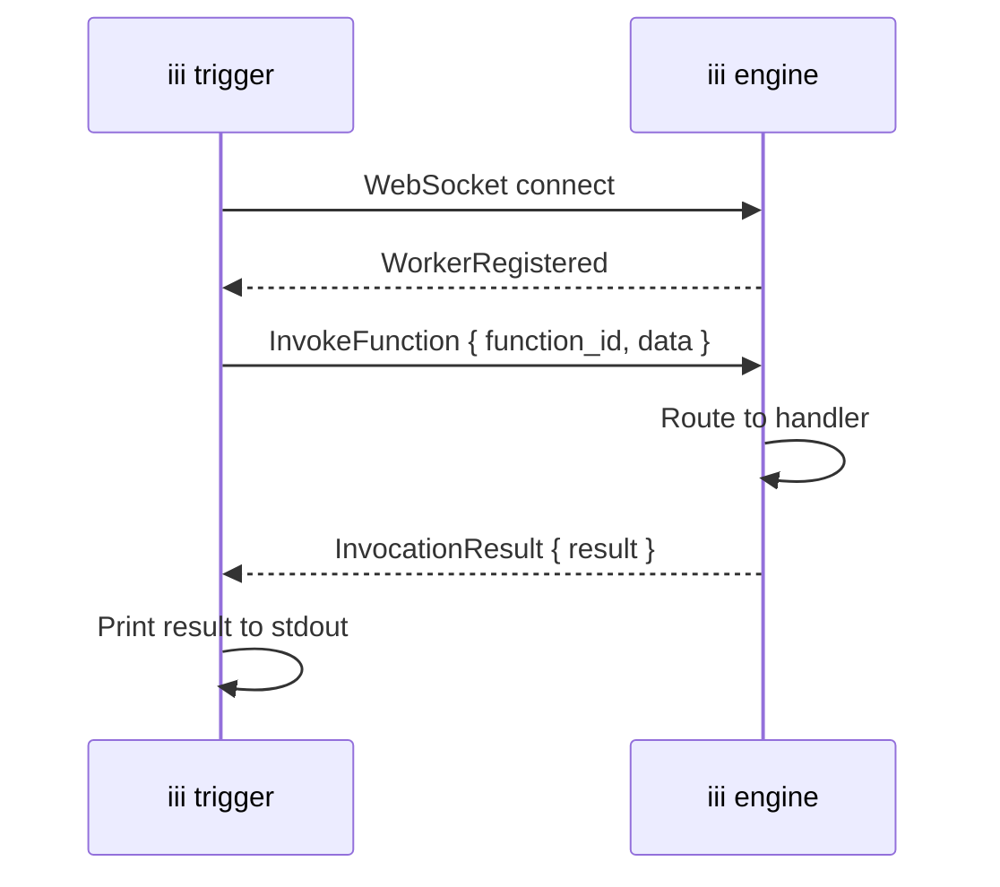

## Goal

Invoke a registered function on a running iii engine directly from the terminal, without writing application code or connecting an SDK.

## When to Use This

- Redriving dead-letter queue messages after fixing a bug
- Testing a function during development without wiring up a trigger
- Running one-off operational tasks against a live engine
- Scripting engine operations in CI/CD pipelines or shell scripts

## Command Reference

```bash
iii trigger <function-path> [key=value ...] [--json '<obj>']
```

| Argument / Flag | Required | Default | Description |
|---|---|---|---|
| `<function-path>` (positional) | Yes | — | The ID of the function to invoke (e.g. `iii::queue::redrive`, `orders::process`) |
| `key=value` (positional, repeated) | No | — | Payload tokens. Values are JSON-decoded when possible (`count=10` → `10`), otherwise treated as strings |
| `--json` | No | — | JSON payload. Combinable with `key=value`: when both are given, `--json` provides the base object and key=value tokens override individual keys |
| `--address` | No | `localhost` | The hostname or IP of the engine |
| `--port` | No | `49134` | The engine's WebSocket port |
| `--timeout-ms` | No | `30000` | Max time in milliseconds to wait for the invocation result |

## Steps

<Steps>
  <Step title="Ensure the engine is running">
    The `iii trigger` command connects to a running engine instance. If you don't have one running yet, follow the [Quickstart](/quickstart) to get started.
  </Step>
  <Step title="Identify the function path">
    Every function registered with the engine has a unique path. Built-in functions use the `iii::` prefix. User-defined functions use the ID you specified during registration.

    Examples of function paths:
    - `iii::queue::redrive` — built-in DLQ redrive
    - `orders::process-payment` — a user-defined function
    - `iii::durable::publish` — the built-in topic-based publish function
  </Step>
  <Step title="Build the payload">
    Pass payload fields as `key=value` tokens after the function path. Values are JSON-decoded when possible.

    ```bash
    # Numbers and booleans are decoded as JSON
    iii trigger orders::process amount=149.99 currency=USD active=true

    # Strings with spaces require quoting
    iii trigger orders::process name="Alice Smith"

    # Empty payload (for functions that don't require input)
    iii trigger iii::queue::redrive
    ```

    For nested or complex payloads, use `--json` with a literal JSON object:

    ```bash
    iii trigger orders::process \
      --json '{"orderId": "ord_789", "items": [{"sku": "A", "qty": 2}]}'
    ```

    The two forms are combinable. When both are supplied, `--json` provides the base object and `key=value` tokens override individual keys (shallow merge):

    ```bash
    iii trigger orders::process \
      --json '{"orderId": "ord_789", "amount": 100}' \
      amount=149.99
    # → {"orderId": "ord_789", "amount": 149.99}
    ```
  </Step>
  <Step title="Run the command">
    ```bash
    iii trigger iii::queue::redrive queue=payment
    ```

    The CLI connects to the engine over WebSocket, sends the invocation, and waits for the result. On success, the function's return value is printed to stdout as pretty-printed JSON:

    ```json
    {
      "queue": "payment",
      "redriven": 12
    }
    ```

    If the function returns an error, it is printed to stderr and the process exits with code 1.
  </Step>
</Steps>

## Targeting a Remote Engine

By default, `iii trigger` connects to `localhost:49134`. Use `--address` and `--port` to target a different engine instance:

```bash
iii trigger iii::queue::redrive queue=payment \
  --address 10.0.1.5 \
  --port 49134
```

## How It Works

The `iii trigger` command operates as a lightweight WebSocket client:



The CLI connects to the engine's WebSocket endpoint (the same protocol SDKs use), waits for the `WorkerRegistered` handshake, sends an `InvokeFunction` message with the function ID and payload, and prints the `InvocationResult` when it arrives.

<Info title="Protocol details">
  The WebSocket protocol is documented in the [Protocol reference](/advanced/protocol). The `iii trigger` command uses the same `InvokeFunction` / `InvocationResult` message pair that all SDKs use.
</Info>

## Examples

### Redrive a dead-letter queue

Move all failed messages from the `payment` queue's DLQ back to the main queue:

```bash
iii trigger iii::queue::redrive queue=payment
```

```json
{
  "queue": "payment",
  "redriven": 12
}
```

<Info title="DLQ guide">
  For the full workflow of inspecting and redriving failed messages, see [Use Dead Letter Queues](/how-to/dead-letter-queues#redrive-messages).
</Info>

### Invoke a user-defined function

Trigger any function registered by your workers:

```bash
iii trigger orders::process-payment orderId=ord_789 amount=149.99 currency=USD
```

### Publish to a topic-based queue

Use the built-in `iii::durable::publish` function to publish a message to a topic. The nested `data` object makes `--json` the cleanest form:

```bash
iii trigger iii::durable::publish \
  --json '{"topic": "order.created", "data": {"orderId": "ord_789"}}'
```

### Use in a shell script

```bash
#!/bin/bash
QUEUES=("payment" "email" "notifications")

for queue in "${QUEUES[@]}"; do
  echo "Redriving $queue..."
  iii trigger iii::queue::redrive queue="$queue"
done
```

## Error Handling

| Scenario | Behavior |
|----------|----------|
| Missing function path | Error printed immediately, no connection attempted |
| Invalid JSON in `--json` | Error printed immediately, no connection attempted |
| `--json` not an object combined with `key=value` tokens | Error printed immediately |
| Engine not running (connection refused) | Error with the target address and port |
| Function not found | Engine returns a `function_not_found` error, printed to stderr |
| Function returns an error | Error body printed to stderr, exit code 1 |
| Invocation exceeds `--timeout-ms` | Timeout error printed to stderr, exit code 1 |
| Connection drops before result | Error indicating the connection closed unexpectedly |

## Next Steps

<CardGroup cols={2}>
  <Card title="Trigger Actions" href="/how-to/trigger-actions" icon="bolt">
    Compare synchronous, Void, and Enqueue invocation modes from SDKs
  </Card>
  <Card title="Dead Letter Queues" href="/how-to/dead-letter-queues" icon="skull">
    Inspect and redrive failed queue messages
  </Card>
  <Card title="Queue Worker Reference" href="/workers/iii-queue" icon="gear">
    Full reference for builtin queue functions including `iii::queue::redrive`
  </Card>
  <Card title="Protocol Reference" href="/advanced/protocol" icon="code">
    WebSocket message catalog and envelope format
  </Card>
</CardGroup>
