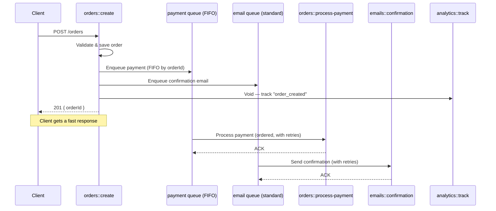
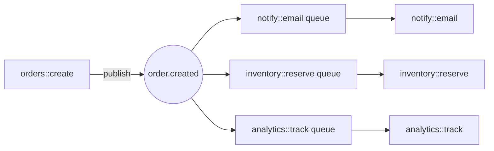
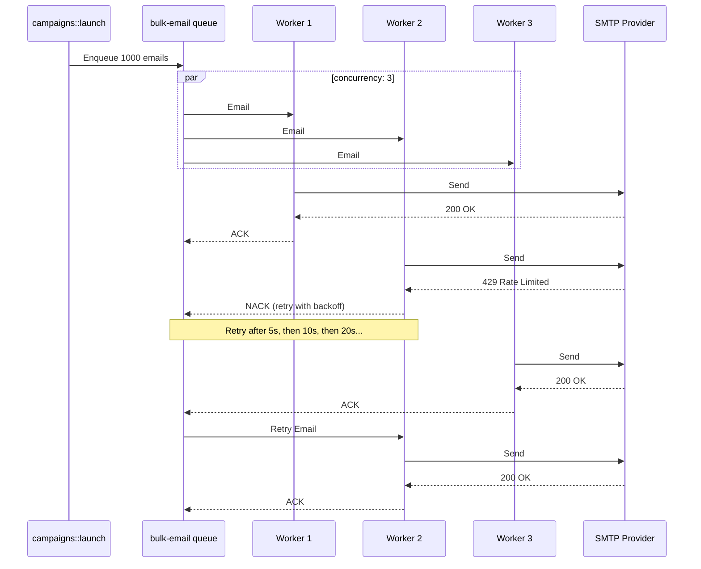

## Goal

This guide covers two independent queue modes: topic-based queues which are durable pub-sub, and named queues that queue functions for later execution. For help deciding, see [When to use which](/modules/module-queue#when-to-use-which).

<Info title="Trigger actions primer">
  Named queues use the `Enqueue` trigger action. Refer to [Trigger Actions](./trigger-actions) to learn more.
</Info>

## Enable the Queue module

```yaml title="iii-config.yaml"
modules:
  - class: modules::queue::QueueModule
    config:
      queue_configs:
        default:
          max_retries: 5
          concurrency: 10
          type: standard
      adapter:
        class: modules::queue::BuiltinQueueAdapter
        config:
          store_method: file_based
          file_path: ./data/queue_store
```

<Info title="Full configuration reference">
  For complete configuration options please refer to [Queue module reference](/modules/module-queue#configuration).
</Info>

---

## Topic-Based Queues

### Goal

Subscribe multiple functions to a topic so that every published message fans out to all subscribers, with each function processing its copy independently.

<Steps>
  <Step title="Register consumers for a topic">
    Subscribe one or more functions to the same topic. Each function gets its own internal queue.

    <Tabs>
    <Tab title="Node / TypeScript">
    ```typescript
    import { registerWorker } from 'iii-sdk'

    const iii = registerWorker(process.env.III_URL ?? 'ws://localhost:49134')

    iii.registerFunction('notify::email', async (data) => {
      await sendEmail(data.userId, `Order ${data.orderId} created`)
      return {}
    })

    iii.registerFunction('audit::log', async (data) => {
      await writeAuditLog('order.created', data)
      return {}
    })

    iii.registerTrigger({
      type: 'queue',
      function_id: 'notify::email',
      config: { topic: 'order.created' },
    })

    iii.registerTrigger({
      type: 'queue',
      function_id: 'audit::log',
      config: { topic: 'order.created' },
    })
    ```
    </Tab>
    <Tab title="Python">
    ```python
    from iii import register_worker

    iii = register_worker("ws://localhost:49134")


    def send_email_notification(data):
        send_email(data["userId"], f"Order {data['orderId']} created")
        return {}


    def write_audit(data):
        write_audit_log("order.created", data)
        return {}


    iii.register_function("notify::email", send_email_notification)
    iii.register_function("audit::log", write_audit)

    iii.register_trigger({
        "type": "queue",
        "function_id": "notify::email",
        "config": {"topic": "order.created"},
    })

    iii.register_trigger({
        "type": "queue",
        "function_id": "audit::log",
        "config": {"topic": "order.created"},
    })
    ```
    </Tab>
    <Tab title="Rust">
    ```rust
    use iii_sdk::{register_worker, InitOptions, RegisterFunction, RegisterTriggerInput};
    use serde_json::{json, Value};

    let iii = register_worker("ws://localhost:49134", InitOptions::default());

    iii.register_function(RegisterFunction::new_async(
        "notify::email",
        |data: Value| async move {
            send_email(data["userId"].as_str().unwrap_or(""), &format!("Order {} created", data["orderId"])).await?;
            Ok(json!({}))
        },
    ));

    iii.register_function(RegisterFunction::new_async(
        "audit::log",
        |data: Value| async move {
            write_audit_log("order.created", &data).await?;
            Ok(json!({}))
        },
    ));

    iii.register_trigger(RegisterTriggerInput {
        trigger_type: "queue".into(),
        function_id: "notify::email".into(),
        config: json!({ "topic": "order.created" }),
        metadata: None,
    })?;

    iii.register_trigger(RegisterTriggerInput {
        trigger_type: "queue".into(),
        function_id: "audit::log".into(),
        config: json!({ "topic": "order.created" }),
        metadata: None,
    })?;
    ```
    </Tab>
    </Tabs>

    Both `notify::email` and `audit::log` are now subscribed to `order.created`. Every message published to that topic reaches both functions.
  </Step>

  <Step title="Publish events to the topic">
    From any function, publish a message using the builtin `enqueue` function. The engine fans it out to every subscribed function.

    <Tabs>
    <Tab title="Node / TypeScript">
    ```typescript
    await iii.trigger({
      function_id: 'enqueue',
      payload: {
        topic: 'order.created',
        data: { orderId: 'ord_789', userId: 'usr_42', total: 149.99 },
      },
    })
    ```
    </Tab>
    <Tab title="Python">
    ```python
    iii.trigger({
        "function_id": "enqueue",
        "payload": {
            "topic": "order.created",
            "data": {"orderId": "ord_789", "userId": "usr_42", "total": 149.99},
        },
    })
    ```
    </Tab>
    <Tab title="Rust">
    ```rust
    use iii_sdk::{TriggerRequest};
    use serde_json::json;

    iii.trigger(TriggerRequest {
        function_id: "enqueue".into(),
        payload: json!({
            "topic": "order.created",
            "data": { "orderId": "ord_789", "userId": "usr_42", "total": 149.99 },
        }),
        timeout_ms: None,
    }).await?;
    ```
    </Tab>
    </Tabs>

    The producer does not need to know which functions are subscribed — it only knows the topic name.
  </Step>

  <Step title="Understand fan-out delivery">
    Topic-based queues use **fan-out per function**:

    - Each distinct function subscribed to a topic receives a **copy** of every message.
    - If a function has multiple replicas running, they **compete** on a shared per-function queue — only one replica processes each message.

    ```mermaid
    sequenceDiagram
        participant P as Producer
        participant E as Engine
        participant Q1 as order.created::notify::email
        participant Q2 as order.created::audit::log
        participant E1 as notify::email (replica 1)
        participant E2 as notify::email (replica 2)
        participant A1 as audit::log

        Note over Q1,Q2: Both functions subscribed to topic "order.created"

        P->>E: enqueue({ topic: "order.created", data })

        par Engine copies message to each function's queue
            E->>Q1: push(data)
            E->>Q2: push(data)
        end

        Note over Q1,E2: Replicas compete — only one processes the message
        Q1->>E1: deliver
        E1-->>Q1: Ack

        Q2->>A1: deliver
        A1-->>Q2: Ack

        P->>E: enqueue({ topic: "order.created", data })

        par
            E->>Q1: push(data)
            E->>Q2: push(data)
        end

        Note over Q1,E2: This time replica 2 wins
        Q1->>E2: deliver
        E2-->>Q1: Ack

        Q2->>A1: deliver
        A1-->>Q2: Ack
    ```

    This gives you pub/sub-style event distribution with the durability and retry guarantees of a queue.
  </Step>

  <Step title="Filter messages with conditions (optional)">
    Attach a condition function to a queue trigger to filter which messages reach the handler. The condition receives the message data and returns `true` or `false`. If `false`, the handler is not called — no error is surfaced.

    <Tabs>
    <Tab title="Node / TypeScript">
    ```typescript
    iii.registerFunction('conditions::is_high_value', async (data) => data.total > 1000)

    iii.registerTrigger({
      type: 'queue',
      function_id: 'notify::vip-team',
      config: {
        topic: 'order.created',
        condition_function_id: 'conditions::is_high_value',
      },
    })
    ```
    </Tab>
    <Tab title="Python">
    ```python
    def is_high_value(data):
        return data.get("total", 0) > 1000


    iii.register_function("conditions::is_high_value", is_high_value)

    iii.register_trigger({
        "type": "queue",
        "function_id": "notify::vip-team",
        "config": {
            "topic": "order.created",
            "condition_function_id": "conditions::is_high_value",
        },
    })
    ```
    </Tab>
    <Tab title="Rust">
    ```rust
    iii.register_function(RegisterFunction::new_async(
        "conditions::is_high_value",
        |data: Value| async move {
            Ok(json!(data["total"].as_f64().unwrap_or(0.0) > 1000.0))
        },
    ));

    iii.register_trigger(RegisterTriggerInput {
        trigger_type: "queue".into(),
        function_id: "notify::vip-team".into(),
        config: json!({
            "topic": "order.created",
            "condition_function_id": "conditions::is_high_value",
        }),
        metadata: None,
    })?;
    ```
    </Tab>
    </Tabs>

    <Info title="Conditions guide">
      See [Conditions](/examples/conditions) for the full pattern including HTTP and state trigger conditions.
    </Info>
  </Step>
</Steps>

### Result

Every function subscribed to a topic receives a copy of each published message. If a function has multiple replicas, they compete on a shared per-function queue — only one replica processes each message. The producer only knows the topic name; it does not need to know which functions are subscribed.

---

## Named Queues

### Goal

Enqueue jobs to a specific function by name with configurable retries, concurrency limits, FIFO ordering, and dead-letter support. All named queues are defined centrally in `iii-config.yaml`.

<Steps>
  <Step title="Define named queues in config">
    Declare one or more named queues under `queue_configs`. Each queue has independent retry, concurrency, and ordering settings.

    ```yaml title="iii-config.yaml"
    modules:
      - class: modules::queue::QueueModule
        config:
          queue_configs:
            default:
              max_retries: 5
              concurrency: 10
              type: standard
            payment:
              max_retries: 10
              concurrency: 2
              type: fifo
              message_group_field: orderId
            email:
              max_retries: 8
              backoff_ms: 2000
              concurrency: 5
              type: standard
          adapter:
            class: modules::queue::BuiltinQueueAdapter
            config:
              store_method: file_based
              file_path: ./data/queue_store
    ```

    <Info title="Full configuration reference">
      FIFO queues enforce ordering in a queue and they require a `message_group_field` to order on. Queues can also set `backoff_ms` for exponential retry delays. See more on this in the steps below.
      
      For full configuration options refer to the [Queue module reference](/modules/module-queue#queue-configuration).
    </Info>
  </Step>

  <Step title="Enqueue work via trigger action">
    From any function, enqueue a job by calling `trigger()` with `TriggerAction.Enqueue` and the target queue name. The caller receives an acknowledgement (`messageReceiptId`) once the engine accepts the job — it does not wait for processing.

    <Tabs>
    <Tab title="Node / TypeScript">
    ```typescript
    import { registerWorker, TriggerAction } from 'iii-sdk'

    const iii = registerWorker(process.env.III_URL ?? 'ws://localhost:49134')

    const receipt = await iii.trigger({
      function_id: 'orders::process-payment',
      payload: { orderId: 'ord_789', amount: 149.99, currency: 'USD' },
      action: TriggerAction.Enqueue({ queue: 'payment' }),
    })

    console.log(receipt.messageReceiptId)
    ```
    </Tab>
    <Tab title="Python">
    ```python
    from iii import register_worker, TriggerAction

    iii = register_worker("ws://localhost:49134")

    receipt = iii.trigger({
        "function_id": "orders::process-payment",
        "payload": {"orderId": "ord_789", "amount": 149.99, "currency": "USD"},
        "action": TriggerAction.Enqueue(queue="payment"),
    })

    print(receipt["messageReceiptId"])
    ```
    </Tab>
    <Tab title="Rust">
    ```rust
    use iii_sdk::{register_worker, InitOptions, TriggerAction, TriggerRequest};
    use serde_json::json;

    let iii = register_worker("ws://localhost:49134", InitOptions::default());

    let receipt = iii.trigger(TriggerRequest {
        function_id: "orders::process-payment".to_string(),
        payload: json!({
            "orderId": "ord_789",
            "amount": 149.99,
            "currency": "USD",
        }),
        action: Some(TriggerAction::Enqueue { queue: "payment".to_string() }),
        timeout_ms: None,
    }).await?;

    println!("{}", receipt["messageReceiptId"]);
    ```
    </Tab>
    </Tabs>

    The target function receives the `payload` as its input — it does not need to know it was invoked via a queue.
  </Step>

  <Step title="Handle the enqueue result">
    The enqueue call can fail synchronously if the queue name is unknown or FIFO validation fails. Always handle the result.

    <Tabs>
    <Tab title="Node / TypeScript">
    ```typescript
    try {
      const receipt = await iii.trigger({
        function_id: 'orders::process-payment',
        payload: { orderId: 'ord_789', amount: 149.99 },
        action: TriggerAction.Enqueue({ queue: 'payment' }),
      })
      console.log('Enqueued:', receipt.messageReceiptId)
    } catch (err) {
      if (err.enqueue_error) {
        console.error('Queue rejected job:', err.enqueue_error)
      }
    }
    ```
    </Tab>
    <Tab title="Python">
    ```python
    try:
        receipt = iii.trigger({
            "function_id": "orders::process-payment",
            "payload": {"orderId": "ord_789", "amount": 149.99},
            "action": TriggerAction.Enqueue(queue="payment"),
        })
        print("Enqueued:", receipt["messageReceiptId"])
    except Exception as e:
        print("Queue rejected job:", e)
    ```
    </Tab>
    <Tab title="Rust">
    ```rust
    match iii.trigger(TriggerRequest {
        function_id: "orders::process-payment".to_string(),
        payload: json!({ "orderId": "ord_789", "amount": 149.99 }),
        action: Some(TriggerAction::Enqueue { queue: "payment".to_string() }),
        timeout_ms: None,
    }).await {
        Ok(receipt) => println!("Enqueued: {}", receipt["messageReceiptId"]),
        Err(e) => eprintln!("Queue rejected job: {}", e),
    }
    ```
    </Tab>
    </Tabs>

    Common rejection reasons:
    - The queue name does not exist in `queue_configs`
    - A FIFO queue's `message_group_field` is missing or `null` in the payload
  </Step>

  <Step title="Use FIFO queues for ordered processing">
    When processing order matters — for example, financial transactions for the same account — set `type: fifo` and specify `message_group_field`. Jobs sharing the same group value are processed strictly in order.

    ```yaml title="iii-config.yaml (excerpt)"
    queue_configs:
      payment:
        max_retries: 10
        concurrency: 2
        type: fifo
        message_group_field: transaction_id
    ```

    The payload **must** contain the field named by `message_group_field`, and its value must be non-null.

    <Tabs>
    <Tab title="Node / TypeScript">
    ```typescript
    await iii.trigger({
      function_id: 'payments::process',
      payload: { transaction_id: 'txn-abc-123', amount: 49.99, currency: 'USD' },
      action: TriggerAction.Enqueue({ queue: 'payment' }),
    })
    ```
    </Tab>
    <Tab title="Python">
    ```python
    iii.trigger({
        "function_id": "payments::process",
        "payload": {
            "transaction_id": "txn-abc-123",
            "amount": 49.99,
            "currency": "USD",
        },
        "action": TriggerAction.Enqueue(queue="payment"),
    })
    ```
    </Tab>
    <Tab title="Rust">
    ```rust
    iii.trigger(TriggerRequest {
        function_id: "payments::process".to_string(),
        payload: json!({
            "transaction_id": "txn-abc-123",
            "amount": 49.99,
            "currency": "USD",
        }),
        action: Some(TriggerAction::Enqueue { queue: "payment".to_string() }),
        timeout_ms: None,
    }).await?;
    ```
    </Tab>
    </Tabs>
  </Step>

  <Step title="Configure retries and backoff">
    Every named queue retries failed jobs automatically. Backoff is exponential:

    ```
    delay = backoff_ms × 2^(attempt - 1)
    ```

    | Attempt | `backoff_ms: 1000` | `backoff_ms: 2000` |
    |---------|--------------------|--------------------|
    | 1       | 1 000 ms           | 2 000 ms           |
    | 2       | 2 000 ms           | 4 000 ms           |
    | 3       | 4 000 ms           | 8 000 ms           |
    | 4       | 8 000 ms           | 16 000 ms          |
    | 5       | 16 000 ms          | 32 000 ms          |

    ```yaml title="iii-config.yaml (excerpt)"
    queue_configs:
      email:
        max_retries: 8
        backoff_ms: 2000
        concurrency: 5
        type: standard
    ```

    After all retries are exhausted, the job moves to a dead-letter queue (DLQ).

    <Info title="Dead letter queues">
      See [Manage Failed Triggers](./dead-letter-queues) for DLQ inspection and redrive.
    </Info>
  </Step>

  <Step title="Control concurrency">
    The `concurrency` field sets the maximum number of jobs the engine processes simultaneously from a single queue (per engine instance).

    ```yaml title="iii-config.yaml (excerpt)"
    queue_configs:
      default:
        concurrency: 10
        type: standard
      payment:
        concurrency: 2
        type: fifo
        message_group_field: transaction_id
    ```

    - **Standard queues**: the engine pulls up to `concurrency` jobs simultaneously.
    - **FIFO queues**: the engine processes one job at a time (prefetch=1) to preserve ordering, regardless of the `concurrency` value.

    Use low concurrency to protect rate-limited APIs. Use high concurrency for embarrassingly parallel work like image resizing.
  </Step>
</Steps>

### Result

Jobs are enqueued and acknowledged immediately — the caller receives a `messageReceiptId` without waiting for processing. The engine delivers each job to the target function, retries failures with exponential backoff, and routes exhausted jobs to the dead-letter queue. Standard queues process jobs concurrently; FIFO queues guarantee per-group ordering.

<Info title="Standard vs FIFO queues">
  For a detailed comparison of standard and FIFO queue behavior — including processing model, ordering guarantees, and flow diagrams — see the [Queue module reference](/modules/module-queue#standard-vs-fifo-queues). For retry and dead-letter flow, see [Retry and dead-letter flow](/modules/module-queue#retry-and-dead-letter-flow).
</Info>

---

## Real-World Scenarios

### HTTP API to Queue Pipeline

The most common pattern — an HTTP endpoint accepts a request, responds immediately, and offloads the actual work to a queue. This keeps API response times fast regardless of how long downstream processing takes.

```yaml title="iii-config.yaml"
modules:
  - class: modules::queue::QueueModule
    config:
      queue_configs:
        payment:
          max_retries: 10
          concurrency: 2
          type: fifo
          message_group_field: orderId
        email:
          max_retries: 5
          concurrency: 10
          type: standard
          backoff_ms: 2000
      adapter:
        class: modules::queue::BuiltinQueueAdapter
        config:
          store_method: file_based
          file_path: ./data/queue_store
```



<Tabs>
<Tab title="Node / TypeScript">
```typescript
import { registerWorker, TriggerAction, Logger } from 'iii-sdk'

const iii = registerWorker(process.env.III_URL ?? 'ws://localhost:49134')

iii.registerFunction('orders::create', async (req) => {
  const logger = new Logger()
  const order = { id: crypto.randomUUID(), ...req.body }

  await iii.trigger({
    function_id: 'orders::process-payment',
    payload: { orderId: order.id, amount: order.total, currency: 'USD' },
    action: TriggerAction.Enqueue({ queue: 'payment' }),
  })

  await iii.trigger({
    function_id: 'emails::confirmation',
    payload: { email: order.email, orderId: order.id },
    action: TriggerAction.Enqueue({ queue: 'email' }),
  })

  await iii.trigger({
    function_id: 'analytics::track',
    payload: { event: 'order_created', orderId: order.id },
    action: TriggerAction.Void(),
  })

  logger.info('Order created', { orderId: order.id })
  return { status_code: 201, body: { orderId: order.id } }
})

iii.registerTrigger({
  type: 'http',
  function_id: 'orders::create',
  config: { api_path: '/orders', http_method: 'POST' },
})
```
</Tab>
<Tab title="Python">
```python
import os
import uuid

from iii import Logger, TriggerAction, register_worker

iii = register_worker(os.environ.get("III_URL", "ws://localhost:49134"))


def create_order(req):
    logger = Logger()
    order = {"id": str(uuid.uuid4()), **req.get("body", {})}

    iii.trigger({
        "function_id": "orders::process-payment",
        "payload": {"orderId": order["id"], "amount": order["total"], "currency": "USD"},
        "action": TriggerAction.Enqueue(queue="payment"),
    })

    iii.trigger({
        "function_id": "emails::confirmation",
        "payload": {"email": order["email"], "orderId": order["id"]},
        "action": TriggerAction.Enqueue(queue="email"),
    })

    iii.trigger({
        "function_id": "analytics::track",
        "payload": {"event": "order_created", "orderId": order["id"]},
        "action": TriggerAction.Void(),
    })

    logger.info("Order created", {"orderId": order["id"]})
    return {"status_code": 201, "body": {"orderId": order["id"]}}


fn = iii.register_function("orders::create", create_order)

iii.register_trigger({
    "type": "http",
    "function_id": fn.id,
    "config": {"api_path": "/orders", "http_method": "POST"},
})
```
</Tab>
<Tab title="Rust">
```rust
use iii_sdk::{
    register_worker, InitOptions, Logger, RegisterFunction,
    RegisterTriggerInput, TriggerAction, TriggerRequest,
};
use serde_json::{json, Value};

let iii = register_worker("ws://localhost:49134", InitOptions::default());

let iii_clone = iii.clone();
let reg = RegisterFunction::new_async("orders::create", move |req: Value| {
    let iii = iii_clone.clone();
    async move {
        let logger = Logger::new();
        let order_id = uuid::Uuid::new_v4().to_string();

        iii.trigger(TriggerRequest {
            function_id: "orders::process-payment".into(),
            payload: json!({ "orderId": order_id, "amount": req["body"]["total"], "currency": "USD" }),
            action: Some(TriggerAction::Enqueue { queue: "payment".into() }),
            timeout_ms: None,
        }).await?;

        iii.trigger(TriggerRequest {
            function_id: "emails::confirmation".into(),
            payload: json!({ "email": req["body"]["email"], "orderId": order_id }),
            action: Some(TriggerAction::Enqueue { queue: "email".into() }),
            timeout_ms: None,
        }).await?;

        iii.trigger(TriggerRequest {
            function_id: "analytics::track".into(),
            payload: json!({ "event": "order_created", "orderId": order_id }),
            action: Some(TriggerAction::Void),
            timeout_ms: None,
        }).await?;

        logger.info("Order created", Some(json!({ "orderId": order_id })));
        Ok(json!({ "status_code": 201, "body": { "orderId": order_id } }))
    }
});
iii.register_function(reg);

iii.register_trigger(RegisterTriggerInput {
    trigger_type: "http".into(),
    function_id: "orders::create".into(),
    config: json!({ "api_path": "/orders", "http_method": "POST" }),
    metadata: None,
})?;
```
</Tab>
</Tabs>

This example uses all three [trigger actions](./trigger-actions): **Enqueue** for payment (reliable, ordered) and email (reliable, parallel), and **Void** for analytics (best-effort).

### Event Fan-Out with Topic Queues

An order system publishes `order.created` events. Multiple independent services — email notifications, inventory updates, and analytics — each need to process every order. Topic-based queues fan out each message to all subscribers with independent retries per function.



<Tabs>
<Tab title="Node / TypeScript">
```typescript
import { registerWorker } from 'iii-sdk'

const iii = registerWorker(process.env.III_URL ?? 'ws://localhost:49134')

iii.registerFunction('notify::email', async (data) => {
  await sendEmail(data.email, `Your order ${data.orderId} is confirmed!`)
  return {}
})

iii.registerFunction('inventory::reserve', async (data) => {
  for (const item of data.items) {
    await reserveStock(item.sku, item.quantity)
  }
  return {}
})

iii.registerFunction('analytics::track', async (data) => {
  await trackEvent('order_created', { orderId: data.orderId, total: data.total })
  return {}
})

iii.registerTrigger({
  type: 'queue',
  function_id: 'notify::email',
  config: { topic: 'order.created' },
})

iii.registerTrigger({
  type: 'queue',
  function_id: 'inventory::reserve',
  config: { topic: 'order.created' },
})

iii.registerTrigger({
  type: 'queue',
  function_id: 'analytics::track',
  config: { topic: 'order.created' },
})

iii.registerFunction('orders::create', async (req) => {
  const order = { id: crypto.randomUUID(), ...req.body }

  await iii.trigger({
    function_id: 'enqueue',
    payload: { topic: 'order.created', data: order },
  })

  return { status_code: 201, body: { orderId: order.id } }
})
```
</Tab>
<Tab title="Python">
```python
from iii import register_worker

iii = register_worker("ws://localhost:49134")


def send_email_notification(data):
    send_email(data["email"], f"Your order {data['orderId']} is confirmed!")
    return {}


def reserve_inventory(data):
    for item in data["items"]:
        reserve_stock(item["sku"], item["quantity"])
    return {}


def track_analytics(data):
    track_event("order_created", {"orderId": data["orderId"], "total": data["total"]})
    return {}


iii.register_function("notify::email", send_email_notification)
iii.register_function("inventory::reserve", reserve_inventory)
iii.register_function("analytics::track", track_analytics)

for fid in ["notify::email", "inventory::reserve", "analytics::track"]:
    iii.register_trigger({
        "type": "queue",
        "function_id": fid,
        "config": {"topic": "order.created"},
    })


def create_order(req):
    import uuid
    order = {"id": str(uuid.uuid4()), **req.get("body", {})}

    iii.trigger({
        "function_id": "enqueue",
        "payload": {"topic": "order.created", "data": order},
    })

    return {"status_code": 201, "body": {"orderId": order["id"]}}


iii.register_function("orders::create", create_order)
```
</Tab>
<Tab title="Rust">
```rust
use iii_sdk::{
    register_worker, InitOptions, RegisterFunction,
    RegisterTriggerInput, TriggerRequest,
};
use serde_json::{json, Value};

let iii = register_worker("ws://localhost:49134", InitOptions::default());

iii.register_function(RegisterFunction::new_async(
    "notify::email",
    |data: Value| async move {
        send_email(data["email"].as_str().unwrap_or(""), &format!("Your order {} is confirmed!", data["orderId"])).await?;
        Ok(json!({}))
    },
));

iii.register_function(RegisterFunction::new_async(
    "inventory::reserve",
    |data: Value| async move {
        for item in data["items"].as_array().unwrap_or(&vec![]) {
            reserve_stock(item["sku"].as_str().unwrap_or(""), item["quantity"].as_u64().unwrap_or(0)).await?;
        }
        Ok(json!({}))
    },
));

iii.register_function(RegisterFunction::new_async(
    "analytics::track",
    |data: Value| async move {
        track_event("order_created", &json!({ "orderId": data["orderId"], "total": data["total"] })).await?;
        Ok(json!({}))
    },
));

for fid in &["notify::email", "inventory::reserve", "analytics::track"] {
    iii.register_trigger(RegisterTriggerInput {
        trigger_type: "queue".into(),
        function_id: fid.to_string(),
        config: json!({ "topic": "order.created" }),
        metadata: None,
    })?;
}

let iii_clone = iii.clone();
iii.register_function(RegisterFunction::new_async("orders::create", move |req: Value| {
    let iii = iii_clone.clone();
    async move {
        let order_id = uuid::Uuid::new_v4().to_string();

        iii.trigger(TriggerRequest {
            function_id: "enqueue".into(),
            payload: json!({ "topic": "order.created", "data": { "id": order_id, "items": req["body"]["items"] } }),
            timeout_ms: None,
        }).await?;

        Ok(json!({ "status_code": 201, "body": { "orderId": order_id } }))
    }
}));
```
</Tab>
</Tabs>

All three functions receive every `order.created` event independently. If `inventory::reserve` fails and retries, it does not affect `notify::email` or `analytics::track`.

### Financial Transaction Ledger (FIFO)

Transactions for the same account must be applied in order to prevent balance inconsistencies. Different accounts can process in parallel.

```yaml title="iii-config.yaml (excerpt)"
queue_configs:
  ledger:
    max_retries: 15
    concurrency: 1
    type: fifo
    message_group_field: account_id
    backoff_ms: 500
```

```mermaid
sequenceDiagram
    participant API as transactions::submit
    participant Q as ledger queue (FIFO)
    participant W as Worker
    participant DB as Database

    API->>Q: Deposit $100 (account: acct_A)
    API->>Q: Withdraw $50 (account: acct_A)
    API->>Q: Deposit $200 (account: acct_B)

    Note over Q: acct_A jobs are ordered; acct_B is independent

    Q->>W: Deposit $100 (acct_A)
    W->>DB: UPDATE balance SET balance + 100
    DB-->>W: OK (balance: $100)
    W-->>Q: ACK

    Q->>W: Withdraw $50 (acct_A)
    W->>DB: UPDATE balance SET balance - 50
    DB-->>W: OK (balance: $50)
    W-->>Q: ACK

    Q->>W: Deposit $200 (acct_B)
    W->>DB: UPDATE balance SET balance + 200
    DB-->>W: OK
    W-->>Q: ACK
```

<Tabs>
<Tab title="Node / TypeScript">
```typescript
import { registerWorker, TriggerAction } from 'iii-sdk'

const iii = registerWorker(process.env.III_URL ?? 'ws://localhost:49134')

iii.registerFunction('transactions::submit', async (req) => {
  const { account_id, type, amount } = req.body

  const receipt = await iii.trigger({
    function_id: 'ledger::apply',
    payload: { account_id, type, amount },
    action: TriggerAction.Enqueue({ queue: 'ledger' }),
  })

  return { status_code: 202, body: { receiptId: receipt.messageReceiptId } }
})

iii.registerFunction('ledger::apply', async (txn) => {
  const { account_id, type, amount } = txn
  if (type === 'deposit') {
    await db.query('UPDATE accounts SET balance = balance + $1 WHERE id = $2', [amount, account_id])
  } else if (type === 'withdraw') {
    const { rows } = await db.query('SELECT balance FROM accounts WHERE id = $1', [account_id])
    if (rows[0].balance < amount) {
      throw new Error('Insufficient funds')
    }
    await db.query('UPDATE accounts SET balance = balance - $1 WHERE id = $2', [amount, account_id])
  }
  return { applied: true }
})
```
</Tab>
<Tab title="Python">
```python
from iii import TriggerAction, register_worker

iii = register_worker("ws://localhost:49134")


def submit_transaction(req):
    account_id = req["body"]["account_id"]
    txn_type = req["body"]["type"]
    amount = req["body"]["amount"]

    receipt = iii.trigger({
        "function_id": "ledger::apply",
        "payload": {"account_id": account_id, "type": txn_type, "amount": amount},
        "action": TriggerAction.Enqueue(queue="ledger"),
    })

    return {"status_code": 202, "body": {"receiptId": receipt["messageReceiptId"]}}


def apply_transaction(txn):
    account_id = txn["account_id"]
    if txn["type"] == "deposit":
        db.execute(
            "UPDATE accounts SET balance = balance + %s WHERE id = %s",
            (txn["amount"], account_id),
        )
    elif txn["type"] == "withdraw":
        balance = db.query("SELECT balance FROM accounts WHERE id = %s", (account_id,))
        if balance < txn["amount"]:
            raise ValueError("Insufficient funds")
        db.execute(
            "UPDATE accounts SET balance = balance - %s WHERE id = %s",
            (txn["amount"], account_id),
        )
    return {"applied": True}


iii.register_function("transactions::submit", submit_transaction)
iii.register_function("ledger::apply", apply_transaction)
```
</Tab>
<Tab title="Rust">
```rust
use iii_sdk::{
    register_worker, InitOptions, RegisterFunction,
    TriggerAction, TriggerRequest,
};
use serde_json::{json, Value};

let iii = register_worker("ws://localhost:49134", InitOptions::default());

let iii_clone = iii.clone();
let reg = RegisterFunction::new_async("transactions::submit", move |req: Value| {
    let iii = iii_clone.clone();
    async move {
        let receipt = iii.trigger(TriggerRequest {
            function_id: "ledger::apply".into(),
            payload: json!({
                "account_id": req["body"]["account_id"],
                "type": req["body"]["type"],
                "amount": req["body"]["amount"],
            }),
            action: Some(TriggerAction::Enqueue { queue: "ledger".into() }),
            timeout_ms: None,
        }).await?;

        Ok(json!({
            "status_code": 202,
            "body": { "receiptId": receipt["messageReceiptId"] },
        }))
    }
});
iii.register_function(reg);
```
</Tab>
</Tabs>

Because the `ledger` queue is FIFO with `message_group_field: account_id`, the deposit for `acct_A` always completes before the withdrawal. Without FIFO ordering, the withdrawal could execute first and fail with "Insufficient funds" even though the deposit was submitted first.

### Bulk Email with Rate Limiting

A marketing system sends thousands of emails. The SMTP provider has a rate limit. A standard queue with low concurrency prevents overloading the provider while retrying transient failures.

```yaml title="iii-config.yaml (excerpt)"
queue_configs:
  bulk-email:
    max_retries: 5
    concurrency: 3
    type: standard
    backoff_ms: 5000
```



<Tabs>
<Tab title="Node / TypeScript">
```typescript
import { registerWorker, TriggerAction } from 'iii-sdk'

const iii = registerWorker(process.env.III_URL ?? 'ws://localhost:49134')

iii.registerFunction('campaigns::launch', async (campaign) => {
  for (const recipient of campaign.recipients) {
    await iii.trigger({
      function_id: 'emails::send',
      payload: {
        to: recipient.email,
        subject: campaign.subject,
        body: campaign.body,
      },
      action: TriggerAction.Enqueue({ queue: 'bulk-email' }),
    })
  }

  return { enqueued: campaign.recipients.length }
})

iii.registerFunction('emails::send', async (email) => {
  const response = await fetch('https://smtp-provider.example/send', {
    method: 'POST',
    body: JSON.stringify(email),
    headers: { 'Content-Type': 'application/json' },
  })

  if (!response.ok) {
    throw new Error(`SMTP error: ${response.status}`)
  }

  return { sent: true }
})
```
</Tab>
<Tab title="Python">
```python
import requests
from iii import TriggerAction, register_worker

iii = register_worker("ws://localhost:49134")


def launch_campaign(campaign):
    for recipient in campaign["recipients"]:
        iii.trigger({
            "function_id": "emails::send",
            "payload": {
                "to": recipient["email"],
                "subject": campaign["subject"],
                "body": campaign["body"],
            },
            "action": TriggerAction.Enqueue(queue="bulk-email"),
        })

    return {"enqueued": len(campaign["recipients"])}


def send_email(email):
    response = requests.post(
        "https://smtp-provider.example/send", json=email
    )
    response.raise_for_status()
    return {"sent": True}


iii.register_function("campaigns::launch", launch_campaign)
iii.register_function("emails::send", send_email)
```
</Tab>
<Tab title="Rust">
```rust
use iii_sdk::{
    register_worker, InitOptions, RegisterFunction,
    TriggerAction, TriggerRequest,
};
use serde_json::{json, Value};

let iii = register_worker("ws://localhost:49134", InitOptions::default());

let iii_clone = iii.clone();
let reg = RegisterFunction::new_async("campaigns::launch", move |campaign: Value| {
    let iii = iii_clone.clone();
    async move {
        let recipients = campaign["recipients"].as_array().unwrap();
        for recipient in recipients {
            iii.trigger(TriggerRequest {
                function_id: "emails::send".into(),
                payload: json!({
                    "to": recipient["email"],
                    "subject": campaign["subject"],
                    "body": campaign["body"],
                }),
                action: Some(TriggerAction::Enqueue { queue: "bulk-email".into() }),
                timeout_ms: None,
            }).await?;
        }
        Ok(json!({ "enqueued": recipients.len() }))
    }
});
iii.register_function(reg);
```
</Tab>
</Tabs>

With `concurrency: 3`, at most three emails are in-flight at any time. Failed sends retry with exponential backoff (5s, 10s, 20s, 40s, 80s), protecting the SMTP provider from overload.

<Info title="Adapters and configuration">
  For adapter options (builtin, RabbitMQ, Redis), scenario-based recommendations, and the full queue configuration reference, see the [Queue module reference](/modules/module-queue#adapter-comparison).
</Info>

## Remember

Producers enqueue work and return immediately. The engine delivers each job to the target function, retries failures with exponential backoff, and routes permanently failed jobs to a dead-letter queue. Topic-based queues fan out messages to every subscriber; named queues target a single function with configurable concurrency, FIFO ordering, and per-queue retry policies.

## Next Steps

<CardGroup cols={2}>
  <Card title="Trigger Actions" href="/how-to/trigger-actions" icon="bolt">
    Understand synchronous, Void, and Enqueue invocation modes
  </Card>
  <Card title="Dead Letter Queues" href="/how-to/dead-letter-queues" icon="skull">
    Handle and redrive failed queue messages
  </Card>
  <Card title="Queue Module Reference" href="/modules/module-queue" icon="gear">
    Full configuration reference for queues and adapters
  </Card>
  <Card title="Conditions" href="/examples/conditions" icon="filter">
    Filter queue messages with condition functions
  </Card>
</CardGroup>
