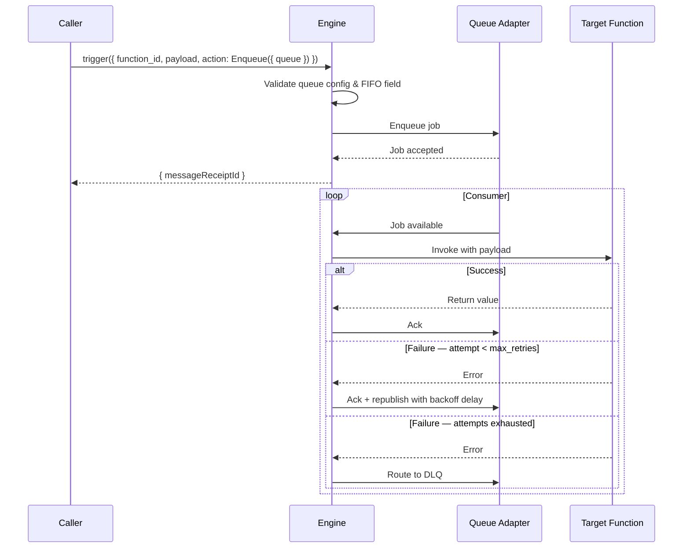

A module for asynchronous job processing. It supports two modes: **topic-based queues** (register a consumer per topic, emit events) and **named queues** (enqueue function calls via `TriggerAction.Enqueue`, no trigger registration).

```
modules::queue::QueueModule
```

<Info title="How-to guidance">
  For step-by-step instructions, see [Use Queues](../how-to/use-queues) and [Manage Failed Triggers](../how-to/dead-letter-queues).
</Info>

## Queue modes

### Topic-based queues

Register a consumer for a topic and emit events to it.

1. **Register a consumer** with `registerTrigger({ type: 'queue', function_id: 'my::handler', config: { topic: 'order.created' } })`. This subscribes the handler to that topic.
2. **Emit events** by calling `trigger({ function_id: 'enqueue', payload: { topic: 'order.created', data: payload } })` or `trigger({ function_id: 'enqueue', payload: { topic, data }, action: TriggerAction.Void() })` for fire-and-forget. The `enqueue` function routes the payload to all subscribers of that topic.
3. **Action on the trigger**: the handler receives the `data` as its input. Optional `queue_config` on the trigger controls per-subscriber retries and concurrency.

The producer knows the topic name; consumers register to receive it. Queue settings can live at the trigger registration site.

### Named queues

Define queues in `iii-config.yaml`, then enqueue function calls directly. No trigger registration.

1. **Define queues** in `queue_configs` (see [Configuration](#configuration)).
2. **Enqueue a function call** with `trigger({ function_id: 'orders::process', payload, action: TriggerAction.Enqueue({ queue: 'payment' }) })`. The engine routes the job to the named queue and invokes the function when a worker consumes it.
3. **Action on the trigger**: the target function receives `payload` as its input. Retries, concurrency, and FIFO are configured in `iii-config.yaml`.

The producer targets the function and queue explicitly. Queue configuration is centralized.

### When to use which

| | Topic-based | Named queues |
|---|---|---|
| **Producer** | Calls `trigger({ function_id: 'enqueue', payload: { topic, data } })` | Calls `trigger({ function_id, payload, action: TriggerAction.Enqueue({ queue }) })` |
| **Consumer** | Registers `registerTrigger({ type: 'queue', config: { topic } })` | No registration — function is the target |
| **Config** | Optional `queue_config` on trigger | `queue_configs` in `iii-config.yaml` |
| **Use case** | Pub/sub, multiple subscribers per topic | Direct function invocation with retries, FIFO, DLQ |

Both modes are valid. Named queues offer config-driven retries, concurrency, and FIFO. See [Queue System](../architecture/queue-system) for design rationale.

## Sample Configuration

```yaml
- class: modules::queue::QueueModule
  config:
    queue_configs:
      default:
        max_retries: 5
        concurrency: 5
        type: standard
      payment:
        max_retries: 10
        concurrency: 2
        type: fifo
        message_group_field: transaction_id
    adapter:
      class: modules::queue::BuiltinQueueAdapter
      config:
        store_method: file_based
        file_path: ./data/queue_store
```

## Configuration

<ResponseField name="queue_configs" type="map[string, FunctionQueueConfig]" required>
  A map of named queue configurations. Each key is the queue name referenced in `TriggerAction.Enqueue({ queue: 'name' })`. Define a queue named `default` in config for the common case; reference it as `TriggerAction.Enqueue({ queue: 'default' })`.
</ResponseField>

<ResponseField name="adapter" type="Adapter">
  The transport adapter for queue persistence and distribution. Defaults to `modules::queue::BuiltinQueueAdapter` when not specified.
</ResponseField>

## Queue Configuration

Each entry in `queue_configs` defines an independent named queue with its own retry, concurrency, and ordering settings.

<ResponseField name="max_retries" type="u32">
  Maximum delivery attempts before routing the job to the dead-letter queue. Defaults to `3`.
</ResponseField>

<ResponseField name="concurrency" type="u32">
  Maximum number of jobs processed simultaneously from this queue. Defaults to `10`.
</ResponseField>

<ResponseField name="type" type="string">
  Delivery mode: `standard` (concurrent, default) or `fifo` (ordered within a message group).
</ResponseField>

<ResponseField name="message_group_field" type="string">
  Required when `type` is `fifo`. The JSON field in the job payload whose value determines the ordering group. Jobs with the same group value are processed strictly in order. The field must be present and non-null in every enqueued payload.
</ResponseField>

<ResponseField name="backoff_ms" type="u64">
  Base retry backoff in milliseconds. Applied with exponential scaling: `backoff_ms × 2^(attempt − 1)`. Defaults to `1000`.
</ResponseField>

<ResponseField name="poll_interval_ms" type="u64">
  Worker poll interval in milliseconds. Defaults to `100`.
</ResponseField>

## Adapters

### modules::queue::BuiltinQueueAdapter

Built-in in-process queue. No external dependencies. Suitable for single-instance deployments — messages are not shared across engine instances.

```yaml
class: modules::queue::BuiltinQueueAdapter
config:
  store_method: file_based   # in_memory | file_based
  file_path: ./data/queue_store  # required when store_method is file_based
```

<ResponseField name="store_method" type="string">
  Persistence strategy: `in_memory` (lost on restart) or `file_based` (durable across restarts). Defaults to `in_memory`.
</ResponseField>

<ResponseField name="file_path" type="string">
  Path to the queue store directory. Required when `store_method` is `file_based`.
</ResponseField>

### modules::queue::RedisAdapter

Uses Redis as the queue backend. Enables message distribution across multiple engine instances. Does not support retries or dead-letter queues.

```yaml
class: modules::queue::RedisAdapter
config:
  redis_url: ${REDIS_URL:redis://localhost:6379}
```

<ResponseField name="redis_url" type="string">
  The URL of the Redis instance to connect to.
</ResponseField>

### modules::queue::RabbitMQAdapter

Uses RabbitMQ as the queue backend. Supports durable delivery, retries, and dead-letter queues across multiple engine instances.

The engine owns consumer loops, retry acknowledgement, and backoff logic — RabbitMQ is used as a transport only. Retry uses explicit ack + republish to a retry exchange with an `x-attempt` header, keeping compatibility with both classic and quorum queues.

```yaml
class: modules::queue::RabbitMQAdapter
config:
  amqp_url: ${RABBITMQ_URL:amqp://localhost:5672}
```

<ResponseField name="amqp_url" type="string">
  The AMQP URL of the RabbitMQ instance to connect to.
</ResponseField>

## Adapter Comparison

|  | BuiltinQueueAdapter | RabbitMQAdapter | RedisAdapter |
|---|---|---|---|
| **Retries** | Yes | Yes | No |
| **Dead-letter queue** | Yes | Yes | No |
| **FIFO ordering** | Yes | Yes | No |
| **Named queues** | Yes | Yes | No |
| **Multi-instance** | No | Yes | Yes |

## Queue Flow


