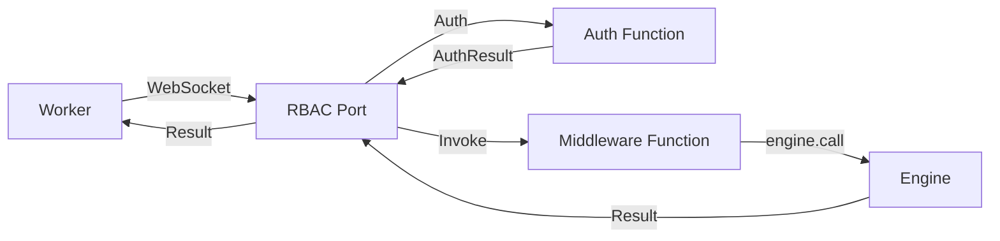

Enable RBAC for workers through a dedicated WebSocket port with authentication, authorization, trigger registration controls, and request middleware.

```
modules::worker::WorkerModule
```

The `WorkerModule` is mandatory and always loaded. When explicitly configured in the `modules:` section, the first entry's `port` sets the main engine WebSocket port. Additional entries with an `rbac` block start dedicated RBAC listeners. Multiple `WorkerModule` entries are supported.

<Info title="How-to guidance">
  For step-by-step instructions on enabling RBAC, writing auth and middleware functions, and connecting workers, see [Worker RBAC](../how-to/worker-rbac).
</Info>

## Architecture



Workers connect via WebSocket to the RBAC port. On connection, the optional auth function is called with the request headers, query parameters, and client IP address. Once authenticated, workers can invoke exposed functions and register triggers subject to RBAC rules. An optional middleware function receives every invocation request before it reaches the engine.

## Sample Configuration

```yaml title="iii-config.yaml"
# First entry defines the main engine port
- class: modules::worker::WorkerModule
  config:
    port: 49134

# Second entry starts an RBAC listener
- class: modules::worker::WorkerModule
  config:
    host: 0.0.0.0
    port: 49135
    middleware_function_id: my-project::middleware-function
    rbac:
      auth_function_id: my-project::auth-function
      on_trigger_registration_function_id: my-project::on-trigger-reg
      on_trigger_type_registration_function_id: my-project::on-trigger-type-reg
      expose_functions:
        - match("engine::*")
        - match("*::public")
        - metadata:
            public: true
        - metadata:
            name: match("*public*")
```

## Configuration

Top-level fields on the `config` object:

<ResponseField name="port" type="number" required>
  The port to listen on. For the first `WorkerModule` entry, this sets the main engine WebSocket port. For entries with an `rbac` block, this sets the RBAC listener port. Defaults to `49134`.
</ResponseField>

<ResponseField name="host" type="string">
  The host to bind to. Defaults to `0.0.0.0`.
</ResponseField>

<ResponseField name="middleware_function_id" type="string">
  Function ID to invoke before every function call from a worker. Receives a `MiddlewareFunctionInput` with the target function ID, payload, action, and auth context. The middleware is responsible for calling the target function and returning the result.
</ResponseField>

<ResponseField name="rbac" type="RbacConfig">
  RBAC configuration block. When present, this `WorkerModule` entry starts a dedicated RBAC listener. Contains the fields below.
</ResponseField>

### rbac

<ResponseField name="auth_function_id" type="string">
  Function ID to invoke for authentication when a worker connects. Receives an `AuthInput` with headers, query parameters, and IP address. Must return an `AuthResult` object. If the function fails or returns no result, the connection is rejected.
</ResponseField>

<ResponseField name="expose_functions" type="FunctionFilter[]">
  List of filters that determine which functions are accessible to workers on the RBAC port. A function is accessible if it matches **any** filter. Two filter types are supported:

  - **match("pattern")** -- Wildcard pattern on the function ID. `*` matches any characters.
  - **metadata** -- Key-value conditions on function metadata.
</ResponseField>

<ResponseField name="on_trigger_registration_function_id" type="string">
  Function ID to invoke when a worker attempts to register a trigger. Receives the trigger details and auth context. Must return `true` to allow the registration.
</ResponseField>

<ResponseField name="on_trigger_type_registration_function_id" type="string">
  Function ID to invoke when a worker attempts to register a trigger type. Receives the trigger type details and auth context. Must return `true` to allow the registration.
</ResponseField>

## Function Filters

### Wildcard Match

Match functions by their ID using `*` as a wildcard:

```yaml
expose_functions:
  - match("engine::*")       # all functions starting with engine::
  - match("*::public")       # all functions ending with ::public
  - match("api::*::read")    # e.g. api::users::read, api::orders::read
```

### Metadata Match

Match functions by their registered metadata. Values can be exact or use `match()` for wildcard patterns:

```yaml
expose_functions:
  - metadata:
      public: true                   # metadata.public === true
  - metadata:
      name: match("*public*")        # metadata.name contains "public"
      tier: "free"                   # metadata.tier === "free"
```

All keys in a metadata filter must match for the filter to pass (AND logic). Multiple filters in `expose_functions` use OR logic -- a function is exposed if **any** filter matches.

## Authentication

When `auth_function_id` is configured, the function is called on every new WebSocket connection before the worker can invoke any functions.

### Auth Input

The auth function receives:

<Expandable title="AuthInput">
  <ResponseField name="headers" type="Record&lt;string, string&gt;" required>
    HTTP headers from the WebSocket upgrade request.
  </ResponseField>
  <ResponseField name="query_params" type="Record&lt;string, string[]&gt;" required>
    Query parameters from the connection URL. Each key maps to an array of values to support repeated keys.
  </ResponseField>
  <ResponseField name="ip_address" type="string" required>
    IP address of the connecting client.
  </ResponseField>
</Expandable>

### Auth Result

The auth function must return:

<Expandable title="AuthResult">
  <ResponseField name="allowed_functions" type="string[]">
    Additional function IDs to allow beyond `expose_functions`. Defaults to empty.
  </ResponseField>
  <ResponseField name="forbidden_functions" type="string[]">
    Function IDs to deny even if they match `expose_functions`. Takes precedence over `allowed_functions`. Defaults to empty.
  </ResponseField>
  <ResponseField name="allowed_trigger_types" type="string[]">
    Trigger type IDs this worker is allowed to register triggers for. When omitted, all types are allowed.
  </ResponseField>
  <ResponseField name="allow_trigger_type_registration" type="boolean">
    Whether this worker can register new trigger types. Defaults to `false`.
  </ResponseField>
  <ResponseField name="context" type="Record&lt;string, unknown&gt;">
    Arbitrary context object passed to the middleware function on every invocation. Defaults to empty object.
  </ResponseField>
</Expandable>

### Access Resolution Order

1. If the function is in `forbidden_functions` -- **denied**
2. If the function is in `allowed_functions` -- **allowed**
3. If the function is `engine::channels::create` -- **allowed** (always whitelisted for channel support)
4. If any `expose_functions` filter matches -- **allowed**
5. Otherwise -- **denied**

## Middleware

When `middleware_function_id` is configured, every worker invocation is routed through the middleware instead of calling the target function directly.

### MiddlewareFunctionInput

The middleware function receives:

<Expandable title="MiddlewareFunctionInput">
  <ResponseField name="function_id" type="string" required>
    The function the worker wants to invoke.
  </ResponseField>
  <ResponseField name="payload" type="Record&lt;string, unknown&gt;" required>
    The payload sent by the worker.
  </ResponseField>
  <ResponseField name="action" type="TriggerAction">
    Routing action (enqueue, void), if any.
  </ResponseField>
  <ResponseField name="context" type="Record&lt;string, unknown&gt;" required>
    The context from the auth result for this connection.
  </ResponseField>
</Expandable>

The middleware is responsible for calling the target function (e.g. via `trigger()`) and returning the result. This gives you full control to modify, validate, or audit requests.

## Trigger Registration

Workers on the RBAC port can register trigger types and triggers when permitted by the auth result.

### Trigger Type Registration

A worker can register a trigger type if **both** conditions are met:
1. `allow_trigger_type_registration` is `true` in the auth result
2. If `on_trigger_type_registration_function_id` is configured, the hook returns `true`

### Trigger Registration

A worker can register a trigger if **both** conditions are met:
1. The trigger's `trigger_type` is in `allowed_trigger_types` from the auth result
2. If `on_trigger_registration_function_id` is configured, the hook returns `true`

Triggers registered by a session are automatically cleaned up when the worker disconnects.

## Protocol

The RBAC port uses the standard iii engine protocol. SDK workers connect with `registerWorker()` and everything works out of the box. The following message types are supported:

### Worker to Server

| Type | Fields | Description |
|------|--------|-------------|
| `invokefunction` | `invocation_id`, `function_id`, `data` | Invoke an exposed function. RBAC checks are applied. |
| `registertriggertype` | `id`, `description` | Register a new trigger type. Requires `allow_trigger_type_registration`. |
| `registertrigger` | `id`, `trigger_type`, `function_id`, `config` | Register a trigger. Requires the type to be in `allowed_trigger_types`. |
| `unregistertrigger` | `id` | Unregister a trigger owned by this session. |
| `ping` | -- | Keepalive ping. |

Function and service registration messages (`registerfunction`, `unregisterfunction`, `registerservice`) are **not allowed** on the RBAC port.

### Server to Worker

| Type | Fields | Description |
|------|--------|-------------|
| `workerregistered` | `worker_id` | Sent after successful connection and auth. The `worker_id` serves as the session ID. |
| `invocationresult` | `invocation_id`, `function_id`, `result?`, `error?` | Result of an `invokefunction` request. |
| `pong` | -- | Response to `ping`. |

If authentication fails, the server sends a JSON error message (`{"type":"error","error":{...}}`) and closes the connection.

## Channel Support

Channels work on the RBAC port exactly as they do on the main engine port. The RBAC port mounts the channel WebSocket endpoint at `/ws/channels/{channel_id}` on the same port.

SDK workers can use `createChannel()` without any changes. The `engine::channels::create` function is automatically whitelisted through the RBAC layer to enable channel creation.

Channel data transfer uses the standard channel WebSocket endpoint, which validates access via the `access_key` capability token.

## Security Considerations

- The RBAC port should be the **only** port exposed to external networks. The main engine port should remain internal.
- Always configure `auth_function_id` in production to prevent unauthenticated access.
- Use `expose_functions` to limit the blast radius. Prefer explicit patterns over broad wildcards like `match("*")`.
- The middleware function is the right place for request validation, rate limiting, and audit logging.
- `forbidden_functions` from the auth result takes precedence over all other allow rules, providing a hard deny mechanism per worker.
- Trigger registrations are scoped to the session and cleaned up on disconnect.
