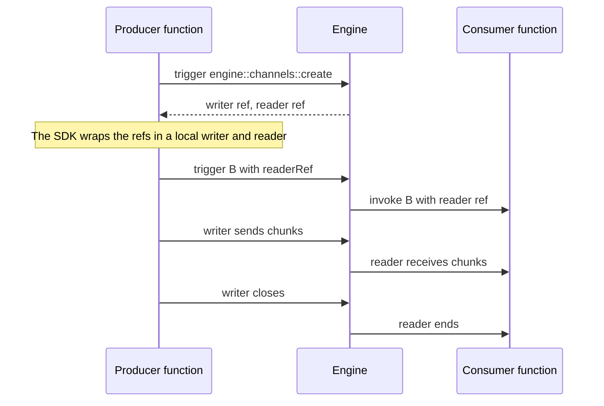

<!-- generated by iii-skill-render. DO NOT EDIT (changes here are overwritten on the next render). Edit docs/next/understanding-iii/channels.mdx. -->

# Channels

## What channels are

Channels are stream pipes between iii workers. They let one function write bytes while another
function reads those bytes in real time, even when the functions run in different processes or
languages.

For the steps in each SDK, see [Channels](../creating-workers/channels).

## The model

| Concept | What it does                                                    |
| ------- | --------------------------------------------------------------- |
| Channel | A WebSocket-backed pipe managed by the engine.                  |
| Writer  | Sends bytes or text messages into the pipe.                     |
| Reader  | Receives bytes or text messages from the pipe.                  |
| Ref     | A small serializable token passed through `trigger()` payloads. |

The key idea is that refs travel through regular function calls, but the data itself travels over
the channel.

## Why channels exist

Function invocations are JSON messages. They suit structured events and command payloads. Each JSON
message has a size limit (see [Payload size](../creating-workers/channels#payload-size)). A channel
carries large files, media, streamed responses (agents, chats), and long-running partial output.

Channels split coordination from data transfer:

- A function call coordinates the work.
- A channel carries the stream.
- The engine routes the function call and relays the channel bytes.

## Runtime flow

The producer creates a channel and passes `readerRef` to the consumer. Node and Python materialize
that ref into a live reader before the handler runs. Rust receives the ref as JSON and constructs a
`ChannelReader` from it. The producer writes chunks into its local writer, and the consumer reads
those chunks from its local reader.

## Backpressure and lifecycle

Channel streams connect lazily. Creating a channel allocates refs, but the WebSocket stream connects
when one side starts reading or writing.

The engine keeps a bounded buffer for each channel. The default size is 64 messages, and the maximum
is 1024. The SDK helper that creates a channel takes an optional buffer size. When the buffer is
full, the engine stops reading from the writer. The writer then waits until the reader takes data.

When the writer closes, the reader receives the stream end.

### Channel ownership

A channel belongs to the worker that called `engine::channels::create` (for example through the
[`createChannel(worker)` helper](../creating-workers/channels#create-a-channel) from
`iii-sdk/helpers`). When that worker disconnects, the engine releases the channel:

- Ends that no worker has attached yet are dropped. A later attempt to attach with that ref fails
  with HTTP `404`.
- A reader already waiting on the channel receives the end of the stream.
- Streams with both ends already attached keep running until they complete.

If a worker creates a channel and hands a `writerRef` or `readerRef` to another worker, the creating
worker must stay connected until the other worker attaches to its end.

Both ends must also attach within 5 minutes after the worker creates the channel. Every 60 seconds,
the engine removes each channel that is older than 5 minutes and has an end that no worker attached.
A later attempt to attach with that ref fails with HTTP `404`.

### Releasing a channel

Apart from the owner and 5-minute cases above, the reader controls when the engine removes a
channel:

- When the reader finishes or disconnects, the engine removes the channel. An end that no worker
  attached goes with it.
- When the reader is gone, the engine closes an attached writer at once. This also applies to an
  idle writer.
- When the writer closes first, the engine keeps the channel. The reader receives the buffered data
  and then the end of the stream.

For bidirectional communication, create two channels: one for each direction.
