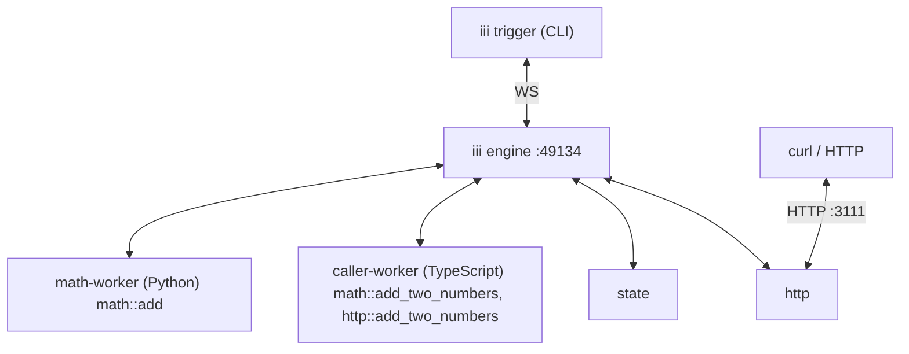

Unix gave processes a single interface. React gave components a single interface. iii gives every
category of software (queues, schedulers, agents, frontends, sandboxes, business logic, etc.) a
single interface: **Workers** host work, **Triggers** are what causes the work to run, **Functions**
are the work, and the **Engine** routes between them. Once you have a mental model for those four
pieces, everything else in iii is a variation on a theme.

<Note>This page uses the [Quickstart tutorial](../quickstart) as an example.</Note>

## The four pieces

This is a brief recap of the four pieces; the sections below expand each one with the Quickstart as
an example. More details about their actual usage are in [Using iii / Workers](../using-iii/workers)
and the rest of the "Using iii" section.

### Worker

A Worker is anything that connects to the Engine and registers Triggers and Functions with it.
Workers can run anywhere (on a laptop, in a container, in a browser tab, on a microVM) and in any
language as long as they can open a WebSocket to the Engine.

### Trigger

A Trigger is what causes a Function to run. A Trigger has a type (HTTP, cron, queue message, state
change), a configuration (which path, which schedule, which queue), and the function ID it invokes.

### Function

A Function is a named handler inside a Worker. It takes a payload and returns a result. Function
identifiers use the `service::name` convention. A caller invokes a Function by its identifier. The
Engine finds a Worker that provides that identifier at call time, so the caller does not change when
the Worker restarts or uses a different language.

### Engine

The Engine is the coordinator. It accepts worker connections, maintains a live registry of available
Triggers and Functions, and routes invocations to whichever Worker currently provides the requested
Function.

## The Quickstart

The Quickstart tutorial produces a running system with two Workers connected to the same Engine:

1. `math-worker` is a Python Worker that registers `math::add`.
1. `caller-worker` is a TypeScript Worker that registers `math::add_two_numbers`, which calls
   `math::add` through the Engine.

By the end of the Quickstart, the system also includes the `state` and `http` Workers, an HTTP
Trigger that binds `http::add_two_numbers` to `POST /math/add-two-numbers`, and a key-value scope
named `math` that holds a `running_total`. `caller-worker` registers `http::add_two_numbers`, which
calls `math::add_two_numbers`.

The runtime topology looks like this:

Every arrow to the Engine is a WebSocket connection between a Worker and the Engine. The `curl`
arrow is an HTTP request to the `http` Worker on port 3111. There is no direct worker-to-worker
traffic. When `caller-worker` invokes `math::add`, the call goes through the Engine, which looks up
the current location of `math::add` in its registry and routes the invocation to `math-worker`.

## Workers

Workers do the work in a iii system. Every category of capability is built as a Worker: queues,
scheduling, sandboxing, observability, agents, business logic, devices, and even code executing in a
browser.

Specifically, a Worker is a process that connects to the Engine over WebSocket and announces the
Triggers it registers and the Functions it can run. Once connected, those Triggers respond to their
events and those Functions are invocable from anywhere in the system, without per-pair integration
code between the caller and the Worker.

The Worker concept is intentionally narrow. A Worker is a participant in the live registry of the
Engine that contributes Triggers and Functions. Whether the Worker is a long-lived process serving
thousands of invocations per second or a short-lived process that connects, registers, runs once,
and shuts down, the Engine treats it the same.

### Worker isolation

Workers are intended and designed to be independent processes. One Worker crashing does not affect
others. Each Worker connects to the Engine over its own WebSocket, and the Engine routes invocations
only to Workers that are currently connected. A crash, restart, or network partition affecting one
Worker does not propagate to the others. The crashed Worker's Triggers and Functions drop out of the
routing table on disconnect, and every other Worker keeps serving.

### In the Quickstart

Both Workers in the Quickstart fulfill the same contract: open a WebSocket connection to the Engine.
Once connected they can register Triggers, register Functions, and `trigger()` other Functions. A
Worker will typically do at least one of these things but ultimately isn't required to do any of
them.

The Python and TypeScript Workers are independent processes in different languages, with different
runtimes, possibly on different machines. Neither one knows the execution context of the other. They
both talk to the Engine, and the Engine handles the rest.

This is what "any language, any runtime" means in practice: the worker contract is small enough to
implement in any language that can use a WebSocket and JSON, and the Engine treats every Worker the
same regardless of how it was built or where it runs.

<Note>
  For the connection lifecycle from worker code, see [Creating Workers /
  Workers](../creating-workers/workers#worker-lifecycle).
</Note>

## Triggers

A Trigger is a binding that tells iii when to invoke a Function. The Trigger declares a `type` (the
kind of event that causes it to fire), a `config` (the per-type details, like an HTTP path or a cron
expression), and the `function_id` it invokes. When the corresponding event happens, the Trigger
fires and the Engine routes the invocation to a Worker that provides the Function. HTTP requests,
cron schedules, queue messages, state changes, log events, and stream events all become Function
invocations through Triggers.

### Trigger types

Trigger types come from connected Workers. A Worker that can source events declares one or more
trigger types alongside their configuration schemas. The http Worker provides the `http` trigger
type. The cron Worker provides the `cron` trigger type. The state Worker provides the `state`
trigger type. A Trigger fires only while a Worker that provides its type is connected, because that
Worker produces the events. You can register a Trigger before that Worker connects. The Engine
stores the registration and activates it when the type becomes available. See
[Registering before a trigger type is available](../using-iii/triggers#registering-before-a-trigger-type-is-available).

### Trigger conditions

A Trigger can also set an optional `condition_function_id` in its `config`. When the Trigger fires,
the Worker that provides the trigger type calls the condition function first, with the same payload
that the handler would get. If the condition returns `false`, the handler does not run. Any other
result runs the handler. If the condition call fails, the handler does not run. Triggers decide when
to do work and Functions decide what work to do, so a condition keeps per-Trigger guards out of the
Function. See
[Gate a trigger with a condition](../using-iii/triggers#gate-a-trigger-with-a-condition).

### Trigger pipeline

When a Trigger fires, the Engine looks up its `function_id` in the live registry, finds a Worker
that currently provides the Function, and dispatches the invocation. The Worker that provides the
trigger type decides the shape of the payload. The Worker that provides the type can also send the
optional `metadata` of the Trigger to the handler as a second argument. See
[Trigger metadata](../using-iii/triggers#trigger-metadata). For the payload fields and metadata
behavior of each trigger type, see the [http](https://workers.iii.dev/workers/http),
[cron](https://workers.iii.dev/workers/cron), and [state](https://workers.iii.dev/workers/state)
Worker Docs.

### Trigger Actions

Trigger Actions control how a call runs. By default, a call is synchronous: it waits until the
Function returns its result or the timeout expires. `TriggerAction.Void()` is fire-and-forget: the
call returns immediately and does not wait for a result. Use a synchronous call when the caller
needs the result. Use `TriggerAction.Void()` for side-effect work.

<Note>
  `TriggerAction.Enqueue({queue})` sends the invocation through a named queue with retries. A queue
  Worker must be connected. See [Queues](../creating-workers/queues).
</Note>

### Trigger lifecycle

A registered Trigger is `active` or `pending`. It is `active` when a Worker that provides its type
accepts it. It is `pending` while no such Worker is connected, or after the provider rejects its
config (for example, an invalid cron expression). The Engine activates a pending Trigger when a
Worker registers the type again. When the Worker that registered a Trigger disconnects, the Engine
removes the Trigger. See
[Registering before a trigger type is available](../using-iii/triggers#registering-before-a-trigger-type-is-available).

### In the Quickstart

The Quickstart tutorial invokes Functions with Triggers in three different ways:

1. The CLI `iii trigger math::add a=2 b=3` is a Trigger fired by the CLI itself. The Engine routes
   the invocation to whatever Worker provides `math::add`.
1. The SDK call `worker.trigger({ function_id: 'math::add', ... })` is another version of the same
   idea: code in one Worker fires a Trigger that invokes another Function, routed through the Engine
   like the CLI version.

   Both paths work without an explicit Trigger. See [Direct invocation](#direct-invocation).

1. The HTTP Trigger is a binding that `caller-worker` registers with `worker.registerTrigger()`. It
   is the common reactive way to use Triggers.

   The `http` Worker provides the `http` trigger type and owns the HTTP socket. When a request
   arrives at `POST /math/add-two-numbers`, the following happens:
   1. `http` finds the matching Trigger and fires it. The Trigger targets `http::add_two_numbers`.
   1. The Engine routes the invocation to `caller-worker`, which provides `http::add_two_numbers`.
   1. `http::add_two_numbers` reads the request body from its payload and calls
      `math::add_two_numbers`, which calls `math::add` on `math-worker`.
   1. The response flows back the same way. `math::add` gets a plain payload. Only
      `http::add_two_numbers` sees the HTTP request fields.

## Functions

From the iii system's perspective, a Function is identified by its name and addressable across
language and location boundaries. Callers do not know what Worker is providing the Function, what
language the handler is written in, or where the Worker is running. The Engine routes each
invocation to a Worker that currently provides the target Function.

A Function has no fixed shape beyond payload-in / result-out. Some Functions are pure computation.
Some perform side effects (state writes, HTTP calls, queue enqueues). Some are agentic, invoking
other Functions in turn. The Engine routes all of them the same way.

### Function identifiers

Function identifiers use the `service::name` convention. The `service` segment groups related
Functions, often by worker name. The `name` segment is the specific handler. `math::add`,
`state::get`, and `state::set` follow this convention.

The Engine does not enforce the convention. The Engine reserves the `engine::` prefix for its own
Functions. See [Reserved ids](../reference/engine-protocol#reserved-ids). The `service::name` form
makes the intent of a Function clear and lowers the chance that two Workers register the same
identifier.

### Direct invocation

Registering a Function with `registerFunction()` makes it directly invokable through
`worker.trigger()` from any connected Worker and through the `iii trigger` CLI command. No explicit
Trigger registration is required for these two paths; they are the baseline call surface every
registered Function gets. Other trigger sources (HTTP, cron, queue, state, stream) bind an explicit
Trigger to the same `function_id`.

### Multiple Triggers per Function

A single Function can be the target of any number of Triggers. The same Function can be invoked by
an HTTP request, a cron schedule, and a queue message at once, by registering three separate
Triggers that share the same `function_id`. Each source differs only in its trigger registration.
This is what lets a single business-logic Function answer to many event sources without per-source
variants.

### In the Quickstart

`math::add` and `math::add_two_numbers` are Functions. Their identifiers follow `service::name`. The
`math` prefix groups related Functions, and the name identifies the specific handler.

Function IDs are stable across worker restarts. When `math-worker` stops and restarts, callers keep
invoking `math::add`, and the Engine routes the calls to whichever instance currently provides that
Function.

A caller can wait for the result of a Function, or use a [Trigger Action](#trigger-actions) to
continue without the result.

## The Engine

The Engine is a single process. It holds the live registry of every connected Worker and every
registered Trigger and Function. It routes each invocation to a Worker that provides the target
Function. When a Worker disconnects, the Engine removes its Triggers and Functions. A call in flight
to that Worker fails with `invocation_stopped`. The `engine::workers-available` and
`engine::functions-available` triggers tell other Workers about the change. Routing does not depend
on the language, runtime, or location of the Worker.

<Note>
  See [Engine](./engine) for startup flow, config hot-reload, and the live registry and discovery
  surface.
</Note>
