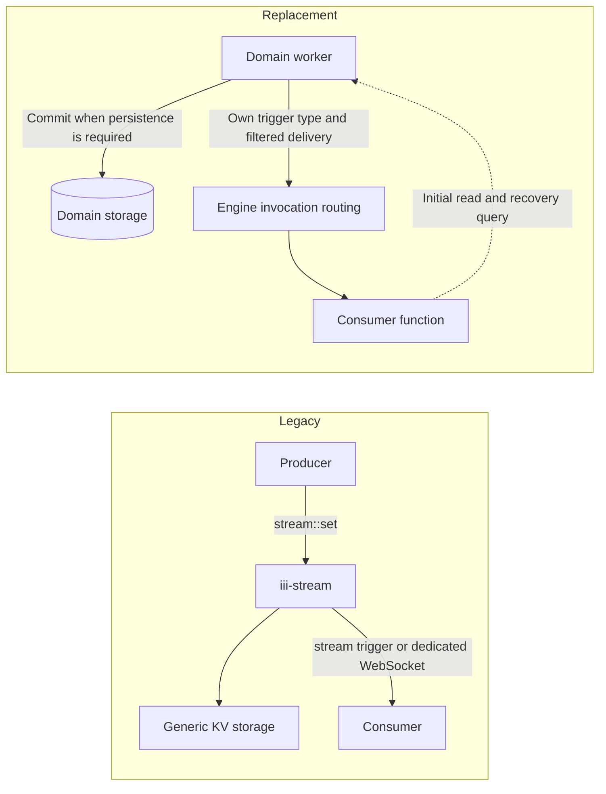

<!-- generated by iii-skill-render. DO NOT EDIT (changes here are overwritten on the next render). Edit docs/next/upgrading/migrate-from-streams.mdx. -->

# Migrate from iii-stream and pubsub


<Warning title="Deprecated">
  `iii-stream` is deprecated (iii-stream) and will be removed in a future release (version TBD).
  `pubsub` is deprecated (pubsub) and will be removed in a future release (version TBD). Behavior is
  unchanged for now. This page is the migration guide.
</Warning>

This guide explains why `iii-stream` and the `pubsub` worker are deprecated, what stays supported,
and how to move each use case to primitives every SDK already ships: worker-owned trigger types,
explicit storage with queries, channels, and the durable queue.

## Why they are deprecated

`iii-stream` bundles three concerns behind one API: a generic key/value store, a change
notification, and a dedicated WebSocket transport. Every `stream::set` writes to storage even when
the caller only wanted to notify someone, stored items have no owner that can bound or clean them
up, and consumers depend on the stream envelope instead of a domain contract. Authorization lives in
a separate `auth_function` that only covers the dedicated WebSocket.

The `pubsub` worker is a global topic bus. It drops the namespace and metadata of a binding,
delivers fire-and-forget with silent drops, and never evaluates `condition_function_id`.

The replacements already exist in Node, Browser, Python, Rust and Go: function and trigger-type
registration, trigger bindings, channels, the `state` and `database` workers, and the `queue`
worker. They put each concern with the worker that owns the data.

<Note>
  Do not replace `stream::set` with `state::set` mechanically. That keeps the storage cost of
  writing every event and loses the notification. Pick the recipe below that matches what the data
  is for.
</Note>

## Timeline and support window

| Phase | What happens | When |
| --- | --- | --- |
| Deprecation (now) | Everything keeps working. Engine, SDKs and the `pubsub` worker emit deprecation warnings. Response contracts do not change. | Now |
| Support window | Migrate producers and consumers together. | TBD |
| Removal | A separately announced breaking release removes `iii-stream`, its SDK helpers and the `pubsub` worker. | Version TBD |

What the warnings look like:

- **Engine:** a `warn` log with target `iii::deprecation` the first time a caller uses a deprecated
  function, binds a deprecated trigger type, or connects to the dedicated Streams WebSocket, then
  at most once every 10 minutes per entry point and caller. Function calls and bindings are keyed
  by the calling worker; WebSocket connections are keyed by client IP. Starting `iii-stream` and
  its WebSocket listener warns once per process. The log names the entry point, the calling worker
  when known and this guide. It never contains payloads, stream, group or item ids, headers or
  query strings. Direct calls such as `trigger({ function_id: "stream::set" })` from any SDK
  version are covered. When `iii-stream` is not running, a `stream::*` call still fails with
  `function_not_found` (code unchanged), and the message now explains how to enable `iii-stream`
  and links this guide.
- **Node and Browser SDKs:** `@deprecated` JSDoc on `createStream` and `IStream`, so editors strike
  them through. No runtime change.
- **Python SDK:** calling `create_stream` or subclassing `IStream` emits a `FutureWarning` pointing at
  your call site. Nothing is raised and behavior is unchanged.
- **Rust SDK:** `#[deprecated]` on the legacy stream helpers, `IStream`, `create_stream`, the
  `IIITrigger::Stream`, `IIITrigger::StreamJoin` and `IIITrigger::StreamLeave` variants, and the
  pubsub items `SubscribeTriggerConfig` and `IIITrigger::Subscribe`.
- **pubsub worker:** the worker logs a warning once at startup; on `publish`, at most once every 10
  minutes per caller; and on `subscribe` trigger registration, at most once every 10 minutes for the
  whole worker (the subscriber is not identified). Traffic on topic `stream.events`, used by the
  engine's own `iii-stream` bridge, never warns.

## What is deprecated and what is not

Deprecated with `iii-stream`:

- The `iii-stream` engine worker.
- Functions `stream::set`, `stream::get`, `stream::delete`, `stream::list`, `stream::list_groups`,
  `stream::list_all`, `stream::send` and `stream::update`.
- Trigger types `stream`, `stream:join` and `stream:leave`.
- The dedicated Streams WebSocket listener (default `127.0.0.1:3112`) and its clients.
- The `auth_function` setting of `iii-stream`.
- SDK helpers: Node and Browser `createStream` and `IStream`; Python `create_stream` and `IStream`;
  the Rust legacy stream provider and helpers; models that only exist for the legacy Streams
  contract.

Deprecated with `pubsub` (the registry worker `pubsub`, formerly `iii-pubsub`):

- Function `publish`, trigger type `subscribe` and the `pubsub` configuration entry.
- Rust SDK `SubscribeTriggerConfig` and `IIITrigger::Subscribe`.

Not deprecated, keep using them:

- Function, trigger-type and trigger registration APIs in every SDK.
- [Channels](../creating-workers/channels), channel readers and writers, and `StreamChannelRef`.
- `StreamRequest` and `StreamResponse` used for request/response streaming.
- `UpdateOp`, `MergePath`, `UpdateOpError`, and the Rust `StreamSetResult`, `StreamUpdateResult` and
  `StreamDeleteResult` types. The `state` worker uses them.
- The `auth_function_id` of `iii-worker-manager` and `rbac-proxy`. That is connection
  authorization for RBAC listeners, unrelated to the `iii-stream` `auth_function`. See
  [Access Control](../creating-workers/worker-manager).
- The `queue` worker, including `iii::durable::publish` and `durable:subscriber`.
- Provider token streaming in LLM workers, which already uses channels.

## Choose a replacement

| Existing requirement | Replacement |
| -- | -- |
| Ephemeral change/lifecycle notification | Worker-owned trigger type + registered consumer function |
| Queryable records with live updates | Explicit storage + get/paginated list + change trigger; initial read and recovery |
| Continuous content for one operation | Channel with explicit lifetime and bounded buffering |

A trigger is a notification mechanism, not a database or durable event log. If history or replay is
required, define and retain the source of truth in the worker that owns the data. Do not build
another generic, unbounded event store. Prefer small notification payloads plus a query for large
datasets, or bounded record snapshots with a revision.



Find your current usage:

| You use today | Move to |
| --- | --- |
| `stream::set` or `stream::send` only to tell consumers something happened | [Recipe 1: ephemeral notifications](#recipe-1-ephemeral-notifications) |
| `stream::set`, `stream::get` and `stream::list` as storage that a UI or worker watches | [Recipe 2: stored records with live updates](#recipe-2-stored-records-with-live-updates) |
| `stream::set` or `stream::send` for progress, tokens or frames of one running operation | [Recipe 3: continuous content](#recipe-3-continuous-content-for-one-operation) |
| `createStream`, `create_stream` or `IStream` | Recipe 2, with storage functions your worker owns |
| `stream:join`, `stream:leave` or the `iii-stream` `auth_function` | [Authorization and tenant isolation](#authorization-and-tenant-isolation) |
| The dedicated Streams WebSocket (port `3112`) | Browser SDK over an RBAC listener, plus one of the recipes |
| `publish` and `subscribe` | [Migrate from pubsub](#migrate-from-pubsub) |

Runnable TypeScript versions of the three recipes live in the repository under
`sdk/packages/node/iii-example/src/streams-migration/`:

- [`owned-trigger-type.ts`](https://github.com/iii-hq/iii/blob/main/sdk/packages/node/iii-example/src/streams-migration/owned-trigger-type.ts):
  ephemeral notification through a worker-owned trigger type.
- [`stored-records.ts`](https://github.com/iii-hq/iii/blob/main/sdk/packages/node/iii-example/src/streams-migration/stored-records.ts):
  storage, get and paginated list, change trigger, initial read and recovery.
- [`channel.ts`](https://github.com/iii-hq/iii/blob/main/sdk/packages/node/iii-example/src/streams-migration/channel.ts):
  bounded per-operation content over a channel.

The snippets below are shortened from those files.

## Recipe 1: Ephemeral notifications

Use this when consumers need to react to something that happened and nobody needs to read it back
later: a lifecycle change, a status flip, a "work is done" signal.

The worker that produces the event declares a trigger type and keeps its own table of bindings.
Consumers bind a function to it the same way they bind to `http` or `cron`. See
[Declaring a Trigger Type](../creating-workers/triggers#declaring-a-trigger-type) and
[Dispatch events to bound functions](../creating-workers/triggers#dispatch-events-to-bound-functions)
for the full API in every SDK.

Producer:

```typescript
import { registerWorker } from "iii-sdk";
import type { TriggerConfig, TriggerHandler } from "iii-sdk";

const worker = registerWorker(process.env.III_URL ?? "ws://localhost:49134", {
  workerName: "orders",
});

type OrderEventConfig = { status?: "created" | "shipped" | "cancelled" };
type OrderEvent = { order_id: string; status: string; revision: number };

const STATUSES = new Set(["created", "shipped", "cancelled"]);
const MAX_BINDINGS = 256;
const bindings = new Map<string, TriggerConfig<OrderEventConfig>>();

const handler: TriggerHandler<OrderEventConfig> = {
  async registerTrigger(binding) {
    const status = binding.config?.status;
    // Throwing rejects the binding with `trigger_registration_failed`.
    if (status !== undefined && !STATUSES.has(status)) {
      throw new Error(`invalid status filter: ${status}`);
    }
    if (bindings.size >= MAX_BINDINGS) throw new Error("too many orders::event bindings");
    bindings.set(binding.id, binding);
  },
  async unregisterTrigger(binding) {
    bindings.delete(binding.id);
  },
};

worker.registerTriggerType(
  { id: "orders::event", description: "Order lifecycle notifications" },
  handler,
);

export async function emitOrderEvent(event: OrderEvent): Promise<void> {
  for (const binding of bindings.values()) {
    if (binding.config?.status && binding.config.status !== event.status) continue;
    try {
      await worker.trigger({
        function_id: binding.function_id,
        payload: event,
        namespace: binding.namespace, // deliver where the consumer registered
        metadata: binding.metadata,
        timeoutMs: 5_000,
      });
    } catch (err) {
      console.warn("orders::event delivery failed", binding.id, err);
    }
  }
}
```

Consumer:

```typescript
worker.registerFunction("notify::order-shipped", async (event: OrderEvent) => {
  // Idempotent: the same event may arrive twice.
  return { notified: event.order_id };
});

worker.registerTrigger({
  type: "orders::event",
  function_id: "notify::order-shipped",
  config: { status: "shipped" },
});
```

A consumer that registers before the provider is connected is kept pending and activates when the
trigger type appears. See
[Registering before a trigger type is available](../using-iii/triggers#registering-before-a-trigger-type-is-available).

## Recipe 2: Stored records with live updates

Use this when consumers need the current data and also want to know when it changes: a dashboard, a
list view, a sync job. Storage and notification are two separate things owned by the same domain
worker.

1. Store records in storage the domain worker owns (`state`, `database`, or your own store), with a
   revision number per record.
2. Expose read functions: `orders::get` and a paginated `orders::list` (cursor plus limit).
3. After the write is committed, emit a small change notification through a worker-owned trigger
   type (`orders::changed` with `{ order_id, revision }`), built as in Recipe 1.
4. Consumers bind first, then do an initial read, then apply notifications. They repeat the read to
   recover after a reconnect.

Producer write path:

```typescript
worker.registerFunction(
  "orders::update",
  async (input: { order_id: string; patch: Record<string, unknown> }) => {
    const current = await worker.trigger<{ scope: string; key: string }, Order | null>({
      function_id: "state::get",
      payload: { scope: "orders", key: input.order_id },
    });
    const next: Order = {
      ...(current ?? { order_id: input.order_id }),
      ...input.patch,
      revision: (current?.revision ?? 0) + 1,
    };
    await worker.trigger({
      function_id: "state::set",
      payload: { scope: "orders", key: input.order_id, value: next },
    });
    // Emit only after the write succeeded. A failed write must not notify anyone.
    await emitOrderChanged({ order_id: next.order_id, revision: next.revision });
    return next;
  },
);
```

For concurrent writers to the same record, guard the write with `state::compare-and-set` or your
database's transaction so revisions stay monotonic.

Consumer:

```typescript
const applied = new Map<string, number>(); // order_id -> highest revision applied

function apply(order: Order) {
  if ((applied.get(order.order_id) ?? 0) >= order.revision) return; // duplicate or stale
  applied.set(order.order_id, order.revision);
  render(order);
}

worker.registerFunction(
  "dashboard::order-changed",
  async (change: { order_id: string; revision: number }) => {
    if ((applied.get(change.order_id) ?? 0) >= change.revision) return; // already have it
    const order = await worker.trigger<{ order_id: string }, Order>({
      function_id: "orders::get",
      payload: { order_id: change.order_id },
    });
    apply(order);
  },
);

// 1. Bind first so no change between the read and the binding is missed.
worker.registerTrigger({
  type: "orders::changed",
  function_id: "dashboard::order-changed",
  config: {},
});

// 2. Initial read. Run it again after a reconnect to recover missed changes.
async function recover() {
  let cursor: string | undefined;
  do {
    const page = await worker.trigger<
      { cursor?: string; limit: number },
      { items: Order[]; next_cursor?: string }
    >({ function_id: "orders::list", payload: { cursor, limit: 100 } });
    page.items.forEach(apply);
    cursor = page.next_cursor;
  } while (cursor);
}
await recover();
```

The notification carries an id and a revision, not the record. Consumers that fall behind fetch the
latest state instead of replaying every change, and large records never travel through the trigger.

## Recipe 3: Continuous content for one operation

Use this for content produced by one running operation and read by one reader: progress output,
tokens, frames, a file. A [channel](../understanding-iii/channels) has an explicit lifetime and
backpressure, and nothing is stored.

The reader creates the channel and passes the writer ref to the function that produces the content:

```typescript
// Reader
const channel = await worker.createChannel();
const done = worker.trigger({
  function_id: "reports::export",
  payload: { report_id: "r-42", writer: channel.writerRef },
});
for await (const chunk of channel.reader.stream) {
  render(chunk);
}
await done;
```

```typescript
// Producer
import { once } from "node:events";
import type { ChannelWriter } from "iii-sdk";

worker.registerFunction(
  "reports::export",
  async (input: { report_id: string; writer: ChannelWriter }) => {
    for await (const row of readRows(input.report_id, { maxRows: 10_000 })) {
      // Respect backpressure: wait for drain instead of buffering without limit.
      if (!input.writer.stream.write(JSON.stringify(row) + "\n")) {
        await once(input.writer.stream, "drain");
      }
    }
    input.writer.stream.end();
    return { ok: true };
  },
);
```

Rules for channels:

- One channel per operation and reader. For fan-out to many consumers, use Recipe 1 or 2 instead.
- End the writer when the operation finishes or fails. When the reader leaves, the engine closes the
  writer. See [Backpressure and lifecycle](../understanding-iii/channels#backpressure-and-lifecycle).
- Bound the content: cap size or duration, and never queue an unbounded backlog for a slow reader.
- For bidirectional traffic, create two channels.

## Provider and consumer obligations

`iii-stream` hid these responsibilities. With an owned trigger type they belong to your code.

The provider (the worker that owns the trigger type):

- **Owns registration and unregistration.** Keep a binding table keyed by trigger id; add in
  `registerTrigger`, remove in `unregisterTrigger`. When a consumer disconnects, the engine removes
  its bindings and the provider receives the unregister callback.
- **Validates filters.** Reject unknown or malformed `config` by throwing from `registerTrigger`.
  Never let a filter widen what the caller is allowed to see.
- **Preserves the target namespace and metadata.** Pass `binding.namespace` and `binding.metadata`
  on every `trigger()` so the event reaches the consumer's namespace.
- **Bounds fan-out.** Cap bindings per type and per consumer, use timeouts, and never spawn an
  unbounded task per event or keep an unbounded queue for a slow consumer.
- **Emits after commit.** For stored data, notify only after the mutation is durable. Never report
  success while dropping data or events.

The consumer (the worker that binds a function):

- **Handles duplicates.** Make handlers idempotent; delivery can repeat after retries or reconnects.
- **Tracks revisions or cursors.** Ignore notifications older than what it already applied.
- **Recovers after reconnect.** Re-run the initial read (Recipe 2) because notifications sent while
  it was away are not replayed.
- **Cleans up.** Unregister bindings it no longer needs and close channels it opened.

## Authorization and tenant isolation

A transport change alone does not reproduce the old policies. Moving a client from the dedicated
Streams WebSocket to Browser SDK subscriptions with `type: "stream"` changes the connection, not the
dependency on `iii-stream`, and it keeps the deprecated trigger types.

| Legacy mechanism | Replacement |
| --- | --- |
| `iii-stream` `auth_function` (authorizes dedicated WebSocket connections and stamps `context` on join/leave events) | Connection authorization by `iii-worker-manager` or `rbac-proxy`: `auth_function_id` runs once per connection and returns an `AuthResult` with `namespaces`, `allowed_functions`, `forbidden_functions`, `allowed_trigger_types` and a `context` forwarded to middleware. See [Access Control](../creating-workers/worker-manager). |
| `stream:join` (a subscriber arrived, optionally rejected) | The provider's `registerTrigger` callback. It sees the binding id, target function, `config`, `metadata` and namespace, and rejects the binding by throwing. |
| `stream:leave` (a subscriber left) | The provider's `unregisterTrigger` callback, also fired when the consumer disconnects. |
| Per-subscription authorization in join handlers | Validation inside `registerTrigger` against the binding namespace, plus `allowed_trigger_types` and `namespaces` in the session's `AuthResult`. |

For tenant isolation, give each tenant or browser session its own namespace through the RBAC
listener's `namespaces` grant, and have the provider deliver only events that belong to
`binding.namespace`. Do not trust a tenant id taken from the consumer's `config`; derive it from the
namespace or check it against it.

<Note>
  The `auth_function_id` of `iii-worker-manager` and `rbac-proxy` is **not** deprecated. Only the
  `auth_function` of `iii-stream` and the `stream:join` / `stream:leave` trigger types are.
</Note>

## A note on stream::send

`stream::send` already avoids the key/value write that `stream::set` does, but it still runs through
`iii-stream` and is deprecated with it. Changing `stream::set` to `stream::send` is not the final
migration, and it changes the event envelope consumers receive. Move straight to Recipe 1 or
Recipe 3.

## Migrate from pubsub

| Use case | Replacement | What changes |
| --- | --- | --- |
| Fan-out of a domain event to several consumers | Worker-owned trigger type (Recipe 1). The producer declares, for example, `link::created` and invokes bound functions after commit. | Consumers bind to the producer's trigger type id instead of a free topic string. The provider owns validation and bounded fan-out. |
| Delivery must not be lost (retries, dead letters) | `queue` worker: publish with `iii::durable::publish`, consume with `durable:subscriber`. See [Queues](../creating-workers/queues). | Every message is persisted; delivery is at-least-once, so handlers must be idempotent. Requires the `queue` worker. |
| Generic topic bus where producer and consumer do not know each other | Queue topics through `iii::durable::publish`, or a small domain events worker that owns a trigger type with a `topic` filter. | **Gap:** no non-durable, generic topic-string bus replaces `pubsub`. Pick durable queue topics or an owned trigger type. |
| Broadcast across engine instances (`redis` adapter) | `queue` worker with a `redis` or `rabbitmq` adapter, or a producer that runs per instance and owns delivery. | Owned trigger types route within one engine. |

Things to check while migrating:

- **Payload envelope.** `pubsub` and `durable:subscriber` deliver the published `data` as-is. An
  owned trigger type defines its own payload, so update consumer handlers.
- **Namespaces.** `pubsub` ignored namespaces: topics were global and subscriber functions resolved
  in the `default` namespace. Owned trigger types and queue subscribers respect the binding
  namespace, so a consumer in another namespace must bind there.
- **Silent drops.** A `publish` sent with `TriggerAction.Void()` when no `pubsub` worker is running is
  dropped without an error to the caller. The replacements make delivery explicit; do not rely on
  that behavior.
- **Order of removal.** The `iii-stream` `bridge` adapter uses `publish` and `subscribe`
  internally. If you run it, keep `pubsub` until `iii-stream` is gone.

## Existing stream data

During the support window, data stored by `iii-stream` stays readable through `stream::get`,
`stream::list` and `stream::list_groups`. To keep it, copy what you still need into storage your
domain worker owns while `iii-stream` is running, and map stream, group and item ids to your own
keys. Do not delete the `iii-stream` store files or Redis keys until your consumers run without
`iii-stream`.

A documented export path, the id mapping and a rollback plan are part of the removal phase and will
be published before storage access is removed (release TBD).

## Tutorials that still use iii-stream or pubsub

The Linkly tutorial chapters
[Ch. 4: Make it durable](../tutorials/linkly/durable-execution),
[Ch. 5: Stream live clicks](../tutorials/linkly/streaming) and
[Ch. 7: Bring in the browser](../tutorials/linkly/frontend) still use `pubsub` and `iii-stream`.
They keep working during the support window and will be rewritten with Recipe 2.

## Checklist

- [ ] List every call to `stream::*`, `publish`, and every binding of `stream`, `stream:join`,
      `stream:leave` and `subscribe`, including calls whose failures your code ignores.
- [ ] Pick a recipe per use case and name the worker that owns each piece of data.
- [ ] Move authorization to the RBAC listener and the provider's `registerTrigger` validation.
- [ ] Migrate producers and their consumers together. If you must publish to both paths for a
      while, define event identity, which consumer reads which path, and a deadline.
- [ ] Copy any stream data you still need into domain storage.
- [ ] Run your consumers with `iii-stream` and `pubsub` absent from `worker-compose.yaml` and confirm
      no deprecation warnings remain in the engine log.
