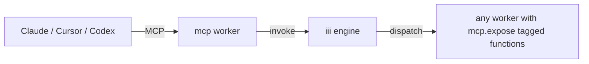

<Info title="Track 3 — iii for AI agents">
  This is tutorial **1 of 4** in Track 3. Estimated time: 15 minutes.
  This is the **hero tutorial** of the AI track — every iii function in
  your project becomes an agent tool with no MCP server code.
</Info>

## What you'll build

Take any iii function (e.g. `todos::create` from
[Tutorial 1](/tutorials/crud-api-in-10-minutes)) and expose it as an
MCP tool that Claude Desktop, Cursor, Codex, or any MCP client can
call.

## Prerequisites

- iii engine running with at least one registered function.
- An MCP-capable client (Claude Desktop, Cursor, or any client that can
  connect to an MCP server over stdio or HTTP).

## Steps

### 1. Add the MCP worker

```bash
iii worker add mcp
```

This worker is a Rust binary that exposes a Model Context Protocol
surface — both stdio and HTTP JSON-RPC.

### 2. Tag the functions you want to expose

Add the `mcp.expose` tag to any function registration. Functions
without this tag remain internal.

{/* TODO: code stub showing how to attach metadata/tags in TS, Python, Rust.
   Example:
     iii.registerFunction({
       id: 'todos::create',
       handler,
       metadata: { tags: ['mcp.expose'] },
       schema: { input: ..., output: ... }
     });
*/}

<Tip>
  The function's input/output schema becomes the MCP tool schema
  automatically. Write good schemas; agents will use them as
  documentation.
</Tip>

### 3. Connect an MCP client

**Claude Desktop / Cursor (stdio mode):**

```json
{/* TODO: real claude_desktop_config.json snippet pointing at the mcp worker binary
   {
     "mcpServers": {
       "iii": { "command": "iii", "args": ["worker","run","mcp","--stdio"] }
     }
   }
*/}
```

**Any client (HTTP mode):**

```bash
{/* TODO: confirm `iii worker run mcp --http --port PORT` invocation */}
```

### 4. Use the tool

In your MCP client, ask: *"Create a todo titled 'ship the docs'."* The
agent should discover `todos::create`, call it, and report the result.

## Result

Every iii function tagged `mcp.expose` is now an agent tool. You wrote
no MCP server code. New functions added to any worker show up
immediately because of iii's live discovery.

## What you just composed



## Next steps

- [Tutorial 8 — Build a tool-using agent worker](/tutorials/build-a-tool-using-agent):
  build the agent side, not just the tool side.
- [Reference: mcp worker](https://github.com/iii-hq/workers/tree/main/mcp)
  on GitHub.
- [How-to: Define request/response formats](/how-to/define-request-response-formats)
  — schemas matter for MCP tool quality.
