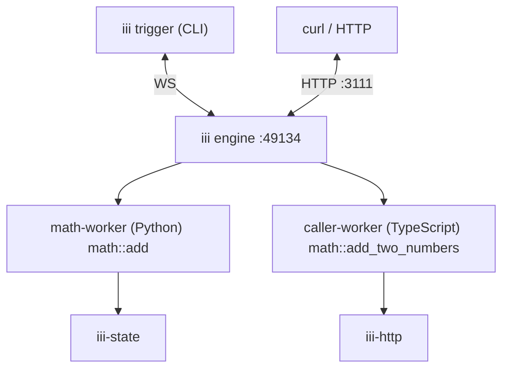

Unix gave processes a single interface. React gave components a single interface. iii gives every
category of software (queues, schedulers, agents, browsers, sandboxes, business logic) a single
interface: **workers** host work, **functions** are the work, **triggers** are what causes the work
to run, and the **engine** routes between them. Once you have a mental model for those four pieces,
everything else in iii is a variation on a theme.

<Note>This page uses the [Quickstart tutorial](/quickstart) as an example.</Note>

## The four pieces

### Worker

A worker is a process that connects to the engine and registers triggers and functions with it.
Workers can run anywhere (on a laptop, in a container, in a browser tab, on a microVM) and in any
language as long as they can open a WebSocket to the engine.

### Function

A function is a named handler inside a worker. It takes a payload and returns a result. Function
identifiers follow a `service::name` convention so they remain stable across worker restarts and
language boundaries.

### Trigger

A trigger is what causes a function to run. A trigger has a type (HTTP, cron, queue message, state
change, another function calling `trigger`), a configuration (which path, which schedule, which
queue), and the function ID it invokes.

### Engine

The engine is the coordinator. It accepts worker connections, maintains a live registry of available
functions and triggers, and routes invocations to whichever worker currently provides the requested
function.

## The Quickstart system

The Quickstart scaffold produces a running system with two workers connected to the same engine.
`math-worker` is a Python worker that registers `math::add`. `caller-worker` is a TypeScript worker
that registers `math::add_two_numbers`, which calls `math::add` through the engine. By the end of
the Quickstart, the system also includes the `iii-state` and `iii-http` workers, an HTTP trigger
that exposes `math::add_two_numbers` at `POST /math/add-two-numbers`, and a key-value scope named
`math` holding a `running_total`.

The runtime topology looks like this:

Every arrow is a WebSocket connection between a worker and the engine. There is no direct
worker-to-worker traffic. When `caller-worker` invokes `math::add`, the call goes through the
engine, which looks up the current location of `math::add` in its registry and routes the invocation
to `math-worker`.

## Workers

Both workers in the Quickstart fulfill the same contract: open a WebSocket connection to the engine,
register one or more functions, and optionally invoke other functions. The Python and TypeScript
workers are independent processes in different languages, with different runtimes, possibly on
different machines. Neither one knows the other exists. They both talk to the engine, and the engine
handles the rest.

This is what "any language, any runtime" means in practice: the worker contract is small enough to
implement in any language that can speak WebSocket and JSON, and the engine treats every worker the
same regardless of how it was built or where it runs.

See [Workers](/understanding-iii/workers) for lifecycle states, isolation guarantees, and disconnect
behavior.

## Functions

`math::add` and `math::add_two_numbers` are functions. Their identifiers follow `service::name`. The
`math` namespace groups related functions together, and the name identifies the specific handler.

Function IDs are stable across worker restarts. When `math-worker` stops and restarts, callers do
not need to know: they keep invoking `math::add`, and the engine routes the calls to whichever
instance currently provides that function.

Functions return a result by default (synchronous invocation), but a worker can also register
handlers as fire-and-forget. The Quickstart uses the synchronous form throughout: every CLI
`iii trigger` and SDK `worker.trigger` call waits for the function to return.

See [Functions](/understanding-iii/functions) for identifier conventions and invocation modes.

## Triggers

A trigger has three parts: a type, a configuration, and the function ID it invokes. The Quickstart
system contains three categories of trigger.

The CLI `iii trigger math::add a=2 b=3` is a trigger fired by the CLI itself. The engine routes the
invocation to whatever worker provides `math::add`. The SDK call
`worker.trigger({ function_id: 'math::add', ... })` is another category of the same idea: one
function inside one worker firing a trigger that invokes another function, routed through the engine
just like the CLI version.

The HTTP trigger added by the `iii-http` worker is different in kind. `iii-http` owns the HTTP
socket; when a request arrives at `POST /math/add-two-numbers`, `iii-http` looks up the matching
trigger and fires it, the engine routes the invocation to `caller-worker`, and the response flows
back the same way. The function itself never sees an HTTP request. It sees a payload, like every
other call.

One function can have many triggers. The same function could be invoked by a cron schedule, a queue
message, and a direct CLI call, all without any change to the function code.

See [Triggers](/understanding-iii/triggers) for trigger types, the trigger lifecycle, and
conditional triggers.

## The engine

The engine is a single process that holds the registry of every connected worker and every
registered function and trigger. When a worker connects, the engine records what functions it
provides. When a worker disconnects, the engine removes its functions, cancels any in-flight
invocations of those functions, and notifies the rest of the system that the topology changed.

Routing is independent of language, runtime, and location. The engine does not care whether
`math::add` is running in Docker, on a Raspberry Pi, or in a browser tab. It cares that _some_
worker provides it. The same scaffold can be redeployed across different runtimes without touching
the function code.

See [Engine](/understanding-iii/engine) for startup flow, config hot-reload, and the live discovery
mechanism.

## Worker manifests

Each worker directory in the scaffold has an `iii.worker.yaml` manifest that tells iii how to start
that worker: its runtime, its entrypoint, its install and start commands. The manifest is metadata
about _starting_ the worker. Once the worker is running, the WebSocket connection to the engine and
the function registrations are what matter. A worker started by `iii worker add` and a worker
started by hand in a container behave identically to the engine.
