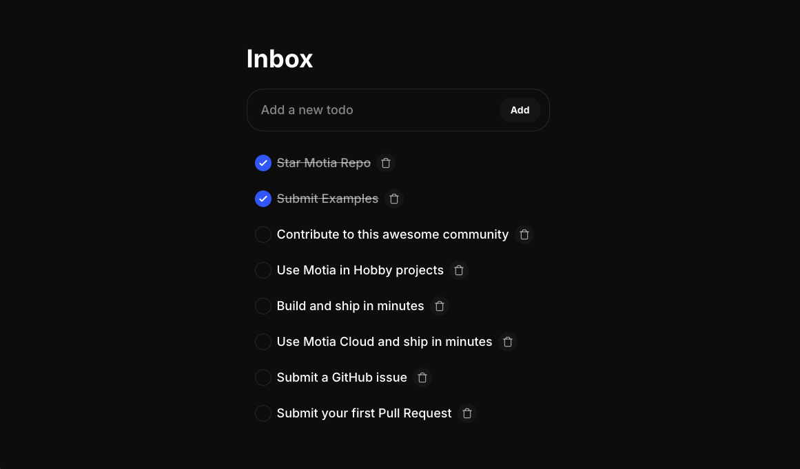

<video controls className="mb-8 w-full rounded-xl" poster="https://assets.motia.dev/images/gifs/v1/7-motia-streaming.gif">
  <source src="https://assets.motia.dev/videos/mp4/site/v1/7-motia-streaming.mp4" type="video/mp4" />
</video>

## Why Streams?

Building modern apps means dealing with long-running tasks - AI responses that stream in word by word, file processing that takes time, or chat messages that need to appear instantly.

Without Streams, you'd need to:
- Build polling logic on the frontend
- Set up WebSocket infrastructure manually
- Manage connection states and reconnection
- Handle data synchronization yourself

With Motia Streams, you get all of this out of the box. Just define what data you want to stream, and Motia handles the rest.

## Some Use Cases for Streams

- **AI/LLM responses** - Stream ChatGPT responses as they generate
- **Chat applications** - Real-time messaging and typing indicators
- **Long processes** - Video processing, data exports, batch operations
- **Live dashboards** - Real-time metrics and notifications
- **Collaborative tools** - Real-time updates across multiple users

---

## Creating a Stream

Streams are just files. Create a `.stream.ts` file in your `src/` folder and export a config.

<Tabs items={['TypeScript', 'Python', 'JavaScript']}>
<Tab value='TypeScript'>

```typescript title="src/chat-messages.stream.ts"
import { Stream, type StreamConfig } from 'motia'
import { z } from 'zod'

const chatMessageSchema = z.object({
  id: z.string(),
  userId: z.string(),
  message: z.string(),
  timestamp: z.string()
})

export const config: StreamConfig = {
  name: 'chatMessage',
  schema: chatMessageSchema,
  baseConfig: {
    storageType: 'default'
  }
}

export const chatMessageStream = new Stream(config)
export type ChatMessage = z.infer<typeof chatMessageSchema>
```

</Tab>
<Tab value='Python'>

```python title="src/chat_messages_stream.py"
from pydantic import BaseModel

class ChatMessage(BaseModel):
    id: str
    user_id: str
    message: str
    timestamp: str

config = {
    "name": "chatMessage",
    "schema": ChatMessage.model_json_schema(),
    "baseConfig": {"storageType": "default"}
}
```

</Tab>
<Tab value='JavaScript'>

```javascript title="src/chat-messages.stream.js"
const { Stream } = require('motia')

const config = {
  name: 'chatMessage',
  schema: {
    type: 'object',
    properties: {
      id: { type: 'string' },
      userId: { type: 'string' },
      message: { type: 'string' },
      timestamp: { type: 'string' }
    },
    required: ['id', 'userId', 'message', 'timestamp']
  },
  baseConfig: {
    storageType: 'default'
  }
}

const chatMessageStream = new Stream(config)
module.exports = { config, chatMessageStream }
```

</Tab>
</Tabs>

That's it. Motia auto-discovers the stream, and you can import the stream instance directly in any step file.

---

## Subscription Hooks

Stream configs support `onJoin` and `onLeave` hooks for controlling client subscriptions:

```typescript
import { logger, Stream, type StreamConfig } from 'motia'
import { z } from 'zod'

export const config: StreamConfig = {
  name: 'deployment',
  baseConfig: { storageType: 'default' },
  schema: z.object({
    id: z.string(),
    status: z.enum(['pending', 'progress', 'completed', 'failed']),
    message: z.string().optional(),
  }),
  onJoin: async (subscription, _context, authContext) => {
    logger.info('Client joined stream', { subscription, authContext })
    if (!authContext?.userId) {
      return { unauthorized: true }
    }
    return { unauthorized: false }
  },
  onLeave: async (subscription, _context, authContext) => {
    logger.info('Client left stream', { subscription, authContext })
  },
}

export const deploymentStream = new Stream(config)
```

- **`onJoin`** — Called when a client subscribes. Return `{ unauthorized: true }` to reject the subscription.
- **`onLeave`** — Called when a client unsubscribes.

---

## Using Streams in Steps

Once you've defined a stream, import and use it directly in any step file.

### Stream Methods

Every stream has these methods:

| Method | What it does |
|--------|-------------|
| `set(groupId, id, data)` | Create or update an item. Returns `StreamSetResult` with `new_value` and `old_value` |
| `get(groupId, id)` | Get a single item |
| `delete(groupId, id)` | Remove an item |
| `getGroup(groupId)` | Get all items in a group |
| `update(groupId, id, ops)` | Atomic update with `UpdateOp[]`. Returns `{ new_value, old_value }` |
| `send(channel, event)` | Send ephemeral events (typing, reactions, etc.) |

**Think of it like this:**
- `groupId` = Which room/conversation/user
- `id` = Which specific item in that room
- `data` = The actual data matching your schema

### Atomic Updates with `update()`

Use the `update()` method to perform atomic operations on stream items without reading and rewriting the entire object:

```typescript
import { deploymentStream } from './deployment.stream'

await deploymentStream.update('data', deploymentId, [
  { type: 'increment', path: 'completedSteps', by: 1 },
  { type: 'set', path: 'status', value: 'progress' },
  { type: 'decrement', path: 'retries', by: 1 },
])
```

This uses the same `UpdateOp` types as state updates: `set`, `merge`, `increment`, `decrement`, `remove`.

[Learn more about Atomic Updates](/docs/advanced-features/atomic-updates)

---

## Real Example: Todo App with Real-Time Sync

Let's build a todo app where all connected clients see updates instantly.

<Callout type="info">
  This is a real, working example from the [Motia Examples Repository](https://github.com/MotiaDev/motia-examples/tree/main/examples/realtime-todo-app). You can clone it and run it locally!
</Callout>

**Step 1:** Create the stream definition

```typescript title="src/todo.stream.ts"
import { Stream, type StreamConfig } from 'motia'
import { z } from 'zod'

const todoSchema = z.object({
  id: z.string(),
  description: z.string(),
  createdAt: z.string(),
  dueDate: z.string().optional(),
  completedAt: z.string().optional()
})

export const config: StreamConfig = {
  name: 'todo',
  schema: todoSchema,
  baseConfig: { storageType: 'default' }
}

export const todoStream = new Stream(config)
export type Todo = z.infer<typeof todoSchema>
```

**Step 2:** Create an API endpoint that uses streams

```typescript title="src/create-todo.step.ts"
import { type Handlers, logger, type StepConfig } from 'motia'
import { z } from 'zod'
import { type Todo, todoStream } from './todo.stream'

export const config = {
  name: 'CreateTodo',
  description: 'Create a new todo item',
  triggers: [
    { type: 'http', path: '/todo', method: 'POST' },
  ],
  enqueues: [],
  flows: ['todo-app'],
} as const satisfies StepConfig

export const handler: Handlers<typeof config> = async ({ request }) => {
  logger.info('Creating new todo', { body: request.body })

  const { description, dueDate } = request.body
  const todoId = `todo-${Date.now()}-${Math.random().toString(36).substring(2, 9)}`

  if (!description) {
    return { status: 400, body: { error: 'Description is required' } }
  }

  const newTodo: Todo = {
    id: todoId,
    description,
    createdAt: new Date().toISOString(),
    dueDate,
    completedAt: undefined
  }

  // Store in the 'inbox' group - all clients watching this group see the update!
  const todo = await todoStream.set('inbox', todoId, newTodo)

  logger.info('Todo created successfully', { todoId })

  return { status: 200, body: todo }
}
```

**What happens here:**
1. Client calls `POST /todo` with a description
2. Server creates the todo and calls `todoStream.set('inbox', todoId, newTodo)`
3. **Instantly**, all clients subscribed to the `inbox` group receive the new todo
4. No polling, no refresh needed

Every time you call `todoStream.set()`, connected clients receive the update instantly. No polling needed.

---

## Restricting Stream Access

Streams can enforce authentication and authorization rules so that only approved clients can subscribe.

### 1. Configure `streamAuth`

```typescript title="stream-auth.ts"
import type { StreamAuthRequest } from 'motia'
import { z } from 'zod'

const streamAuthContextSchema = z.object({
  userId: z.string(),
  plan: z.enum(['free', 'pro']),
  projectIds: z.array(z.string()),
})

const extractAuthToken = (request: StreamAuthRequest): string | undefined => {
  const protocolHeader = request.headers['sec-websocket-protocol']
  if (protocolHeader?.includes('Authorization')) {
    const [, token] = protocolHeader.split(',')
    if (token) {
      return token.trim()
    }
  }

  if (!request.url) return undefined

  try {
    const url = new URL(request.url, 'http://localhost')
    return url.searchParams.get('authToken') ?? undefined
  } catch {
    return undefined
  }
}
```

### 2. Apply fine-grained rules with `canAccess`

Each stream can expose an optional `canAccess` function that receives the subscription info plus the `StreamAuthContext` value returned by your `authenticate` function.

```typescript title="src/chat-messages.stream.ts"
export const config: StreamConfig = {
  name: 'chatMessage',
  schema: chatMessageSchema,
  baseConfig: { storageType: 'default' },
  canAccess: ({ groupId, id }, authContext) => {
    if (!authContext) return false
    return authContext.projectIds.includes(groupId)
  },
}
```

`canAccess` can be synchronous or async. If it's not defined, Motia allows every client (even anonymous ones) to subscribe.

### 3. Send tokens from the client

Provide an auth token when creating the stream client by embedding it in the WebSocket URL.

```tsx title="App.tsx"
import { useMemo } from 'react'
import { MotiaStreamProvider } from '@motiadev/stream-client-react'

function AppShell({ session }: { session?: { streamToken?: string } }) {
  const streamAddress = useMemo(() => new URL('ws://localhost:3112').toString(), [])
  const protocols = useMemo(() => {
    return session?.streamToken ? ['Authorization', session.streamToken] : undefined
  }, [session?.streamToken])

  return (
    <MotiaStreamProvider address={streamAddress} protocols={protocols}>
      <App />
    </MotiaStreamProvider>
  )
}
```

Using the browser/node clients directly:

```ts
import { Stream } from 'motia/stream-client-node'

const url = new URL('wss://api.example.com/streams')
if (process.env.STREAM_TOKEN) {
  url.searchParams.set('authToken', process.env.STREAM_TOKEN)
}

const stream = new Stream(url.toString())
```

---

## Viewing Streams in the iii Development Console

The [iii development console](https://iii.dev/docs) can display stream updates in real-time:

1. Make sure your API Step returns the stream object:

```typescript
return { status: 200, body: todo }
```

2. Open the iii development console
3. Watch the stream update in real-time

The console automatically detects stream responses and subscribes to them for you.


---

## Using Streams in Your Frontend

Once you have streams working on the backend, connect them to your React app.

### Install

```bash
npm install @motiadev/stream-client-react
```

### Setup Provider

Wrap your app with the provider:

```tsx title="App.tsx"
import { useMemo } from 'react'
import { MotiaStreamProvider } from '@motiadev/stream-client-react'

function App() {
  const authToken = useAuthToken()
  const protocols = useMemo(() => (authToken ? ['Authorization', authToken] : undefined), [authToken])

  return (
    <MotiaStreamProvider address="ws://localhost:3112" protocols={protocols}>
      {/* Your app */}
    </MotiaStreamProvider>
  )
}
```

### Subscribe to Stream Updates

```tsx title="App.tsx"
import { useStreamGroup } from '@motiadev/stream-client-react'
import { useTodoEndpoints, type Todo } from './hook/useTodoEndpoints'

function App() {
  const { createTodo, updateTodo, deleteTodo } = useTodoEndpoints()

  const { data: todos } = useStreamGroup<Todo>({
    groupId: 'inbox',
    streamName: 'todo'
  })

  const handleAddTodo = async (description: string) => {
    await createTodo(description)
  }

  return (
    <div>
      <h1>Inbox</h1>
      {todos.map((todo) => (
        <div key={todo.id}>{todo.description}</div>
      ))}
    </div>
  )
}
```

**How it works:**
1. `useStreamGroup()` subscribes to all items in the `inbox` group
2. When server calls `todoStream.set('inbox', todoId, newTodo)`, the `todos` array updates automatically
3. React re-renders with the new data
4. Works across all connected clients!



Every time you call `createTodo()`, connected clients receive the update instantly. No polling needed.

For a dedicated API reference covering `MotiaStreamProvider`, `useMotiaStream`, `useStreamGroup`, and `useStreamItem`, see [React Stream Client](/docs/development-guide/react-stream-client).

---

## Ephemeral Events

Sometimes you need to send temporary events that don't need to be stored - like typing indicators, reactions, or online status.

Use the stream's `send()` method for this:

<Tabs items={['TypeScript', 'Python', 'JavaScript']}>
<Tab value='TypeScript'>

```typescript
import { chatMessageStream } from './chat-messages.stream'

await chatMessageStream.send(
  { groupId: channelId },
  { type: 'typing', data: { userId: 'user-123', isTyping: true } }
)

await chatMessageStream.send(
  { groupId: channelId, id: messageId },
  { type: 'reaction', data: { emoji: '👍', userId: 'user-123' } }
)
```

</Tab>
<Tab value='Python'>

```python
await chat_message_stream.send(
    {"groupId": channel_id},
    {"type": "typing", "data": {"userId": "user-123", "isTyping": True}}
)

await chat_message_stream.send(
    {"groupId": channel_id, "id": message_id},
    {"type": "reaction", "data": {"emoji": "👍", "userId": "user-123"}}
)
```

</Tab>
<Tab value='JavaScript'>

```javascript
const { chatMessageStream } = require('./chat-messages.stream')

await chatMessageStream.send(
  { groupId: channelId },
  { type: 'typing', data: { userId: 'user-123', isTyping: true } }
)

await chatMessageStream.send(
  { groupId: channelId, id: messageId },
  { type: 'reaction', data: { emoji: '👍', userId: 'user-123' } }
)
```

</Tab>
</Tabs>

**Difference from `set()`:**
- `set()` - Stores data, clients sync to it. Returns `{ new_value, old_value }`
- `send()` - Fire-and-forget events, not stored

---

## Remember

- **Streams = Real-time state** that clients subscribe to
- **Every `set()` call** pushes updates to connected clients instantly and returns `{ new_value, old_value }`
- **Use `update()`** for atomic operations (increment, decrement, set fields)
- **Use `send()`** for temporary events like typing indicators
- **View in the iii development console** before building your frontend
- **No polling needed** - WebSocket connection handles everything

---

## Stream Triggers

Steps can react to stream changes (create, update, delete) using stream triggers:

```typescript
export const config = {
  name: 'OnDeploymentUpdate',
  triggers: [
    {
      type: 'stream',
      streamName: 'deployment',
      groupId: 'data',
      condition: (input) => input.event.type === 'update',
    },
  ],
  flows: ['deployments'],
} as const satisfies StepConfig
```

[Learn more about Stream Triggers](/docs/advanced-features/reactive-triggers)

---

## What's Next?

<Cards>
  <Card href="/docs/development-guide/state-management" title="State Management">
    Learn about persistent storage across Steps
  </Card>

  <Card href="/docs/concepts/steps" title="Steps">
    Deep dive into building with Steps
  </Card>
</Cards>
