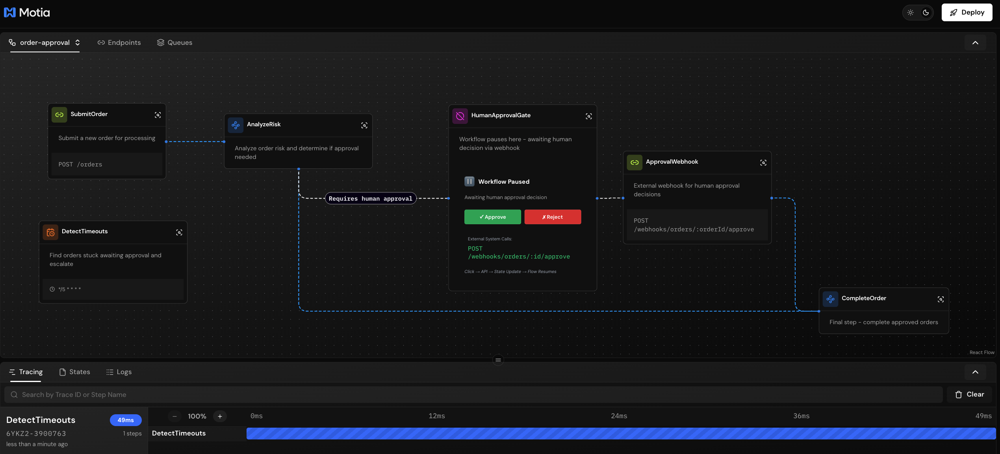

Some workflows need humans to make decisions.

Maybe it's approving a high-value order. Or reviewing content before publishing. Or signing off on a production deployment. These workflows need to **pause**, wait for a human decision, and **continue** when the decision arrives.

Motia handles this naturally. You save your progress, stop emitting events, and create an API webhook for the human to call. When they make their decision, the webhook picks up right where you left off.

## How It Works

Human-in-the-Loop workflows in Motia work like this:

1. **Process automatically when possible** - Let the system handle what it can
2. **Save "awaiting" state when human needed** - Mark the pause point clearly
3. **Stop enqueuing** - The workflow naturally pauses
4. **Webhook resumes the flow** - External systems call an API to continue

No special "pause" or "wait" commands. Just save state and use HTTP trigger steps as re-entry points.

---

## Key Ideas

| Concept | What It Means |
|---------|---------------|
| **Workflows don't sleep** | They don't "wait." They save state and stop processing. |
| **HTTP steps are re-entry points** | External systems call webhooks to restart the flow |
| **State checkpointing** | Every `stateManager.set()` is a save point you can resume from |
| **Virtual connections** | Use `virtualSubscribes` and `virtualEnqueues` to show how webhooks fit in the flow visually |

<Callout type="info">
The workflow doesn't have a concept of time. It only knows: "Is the right state present? Has the right step been triggered?"
</Callout>

---

## Real Example: Order Approval

Let's build an order processing system that auto-approves low-risk orders but pauses for human review on high-risk ones.

**Example Location:** `examples/foundational/workflow-patterns/human-in-the-loop/`

[View on GitHub →](https://github.com/MotiaDev/motia-examples/tree/main/examples/foundational/workflow-patterns/human-in-the-loop)

### The Flow




### Step 1: Submit Order

An API receives the order and saves it immediately:

<Tabs items={['TypeScript', 'Python', 'JavaScript']}>
<Tab value='TypeScript'>

```typescript title="src/01-submit-order.step.ts"
import { type Handlers, type StepConfig, enqueue, logger, stateManager } from 'motia'

export const config = {
  name: 'SubmitOrder',
  description: 'Submit an order for processing',
  triggers: [
    { type: 'http', path: '/orders', method: 'POST' },
  ],
  enqueues: ['order.submitted'],
  flows: ['order-approval'],
} as const satisfies StepConfig

export const handler: Handlers<typeof config> = async ({ request }) => {
  const orderId = crypto.randomUUID()
  
  const order = {
    id: orderId,
    items: request.body.items,
    total: request.body.total,
    status: 'pending_analysis',
    currentStep: 'submitted',
    completedSteps: ['submitted'],
    createdAt: new Date().toISOString()
  }
  
  await stateManager.set('orders', orderId, order)
  
  logger.info('Order submitted', { orderId })
  
  await enqueue({
    topic: 'order.submitted',
    data: { orderId }
  })

  return { status: 201, body: { orderId, status: order.status } }
}
```

</Tab>
<Tab value='Python'>

```python title="src/submit_order_step.py"
import uuid
from datetime import datetime
from typing import Any
from motia import ApiRequest, ApiResponse, http, enqueue, logger, state_manager

config = {
    "name": "SubmitOrder",
    "description": "Submit an order for processing",
    "triggers": [
        http("POST", "/orders"),
    ],
    "enqueues": ["order.submitted"],
    "flows": ["order-approval"]
}

async def handler(request: ApiRequest[Any]) -> ApiResponse[Any]:
    order_id = str(uuid.uuid4())
    
    order = {
        "id": order_id,
        "items": request.body.get("items"),
        "total": request.body.get("total"),
        "status": "pending_analysis",
        "current_step": "submitted",
        "completed_steps": ["submitted"],
        "created_at": datetime.now().isoformat()
    }
    
    await state_manager.set("orders", order_id, order)
    
    logger.info("Order submitted", {"orderId": order_id})
    
    await enqueue({
        "topic": "order.submitted",
        "data": {"orderId": order_id}
    })

    return ApiResponse(status=201, body={"orderId": order_id, "status": order["status"]})
```

</Tab>
<Tab value='JavaScript'>

```javascript title="src/submit-order.step.js"
import crypto from 'crypto'
import { enqueue, logger, stateManager } from 'motia'

export const config = {
  name: 'SubmitOrder',
  description: 'Submit an order for processing',
  triggers: [
    { type: 'http', path: '/orders', method: 'POST' },
  ],
  enqueues: ['order.submitted'],
  flows: ['order-approval'],
}

export const handler = async ({ request }) => {
  const orderId = crypto.randomUUID()
  const { items, total } = request.body

  const order = {
    id: orderId,
    items,
    total,
    status: 'pending_analysis',
    currentStep: 'submitted',
    completedSteps: ['submitted'],
    createdAt: new Date().toISOString()
  }

  await stateManager.set('orders', orderId, order)

  logger.info('Order submitted', { orderId })

  await enqueue({
    topic: 'order.submitted',
    data: { orderId }
  })

  return { status: 201, body: { orderId, status: order.status } }
}
```

</Tab>
</Tabs>

👉 **Key point:** We save the order immediately with `currentStep` and `completedSteps`. This becomes our checkpoint system.

### Step 2: Analyze Risk

This step decides whether to auto-approve or pause for human review:

<Tabs items={['TypeScript', 'Python', 'JavaScript']}>
<Tab value='TypeScript'>

```typescript title="src/02-analyze-risk.step.ts"
import { type Handlers, type StepConfig, enqueue, logger, stateManager } from 'motia'

export const config = {
  name: 'AnalyzeRisk',
  description: 'Analyze order risk and route accordingly',
  triggers: [
    { type: 'queue', topic: 'order.submitted' },
  ],
  enqueues: ['order.auto_approved'],
  virtualEnqueues: [{ topic: 'approval.required', label: 'Requires human approval' }],
  flows: ['order-approval'],
} as const satisfies StepConfig

export const handler: Handlers<typeof config> = async (input) => {
  const { orderId } = input
  const order = await stateManager.get('orders', orderId)
  
  // Skip if already analyzed (idempotency)
  if (order.completedSteps.includes('risk_analysis')) {
    return
  }
  
  // Calculate risk score
  const riskScore = calculateRiskScore(order)
  order.riskScore = riskScore
  order.completedSteps.push('risk_analysis')
  
  if (riskScore > 70) {
    // High risk - PAUSE for human approval
    order.status = 'awaiting_approval'
    order.currentStep = 'awaiting_approval'
    await stateManager.set('orders', orderId, order)
    
    logger.warn('Order requires approval - workflow paused', { orderId, riskScore })
    
    // NO EMIT - workflow stops here
    // Webhook will restart it when human makes decision
    
  } else {
    // Low risk - bypass gate and auto-approve
    order.status = 'approved'
    order.approvedBy = 'system'
    order.completedSteps.push('approved')
    await stateManager.set('orders', orderId, order)
    
    logger.info('Order auto-approved', { orderId, riskScore })
    
    // Continue immediately
    await enqueue({ topic: 'order.auto_approved', data: { orderId } })
  }
}

function calculateRiskScore(order: any): number {
  let score = 0
  if (order.total > 1000) score += 40
  else if (order.total > 500) score += 20
  
  const itemCount = order.items.reduce((sum, item) => sum + item.quantity, 0)
  if (itemCount > 10) score += 30
  
  score += Math.random() * 40
  return Math.min(Math.round(score), 100)
}
```

</Tab>
<Tab value='Python'>

```python title="src/analyze_risk_step.py"
import random
from motia import enqueue, logger, state_manager

config = {
    "name": "AnalyzeRisk",
    "description": "Analyze order risk and route accordingly",
    "triggers": [
        {"type": "queue", "topic": "order.submitted"}
    ],
    "enqueues": ["order.auto_approved"],
    "virtualEnqueues": [{"topic": "approval.required", "label": "Requires human approval"}],
    "flows": ["order-approval"]
}

async def handler(input_data):
    order_id = input_data.get("orderId")
    order = await state_manager.get("orders", order_id)
    
    # Skip if already analyzed
    if "risk_analysis" in order.get("completed_steps", []):
        return
    
    # Calculate risk
    risk_score = calculate_risk_score(order)
    order["risk_score"] = risk_score
    order["completed_steps"].append("risk_analysis")
    
    if risk_score > 70:
        # High risk - PAUSE
        order["status"] = "awaiting_approval"
        order["current_step"] = "awaiting_approval"
        await state_manager.set("orders", order_id, order)
        
        logger.warn("Order requires approval - workflow paused", 
                           {"orderId": order_id, "riskScore": risk_score})
        # NO EMIT - workflow stops
        
    else:
        # Low risk - bypass gate
        order["status"] = "approved"
        order["approved_by"] = "system"
        order["completed_steps"].append("approved")
        await state_manager.set("orders", order_id, order)
        
        logger.info("Order auto-approved", 
                           {"orderId": order_id, "riskScore": risk_score})
        
        await enqueue({
            "topic": "order.auto_approved",
            "data": {"orderId": order_id}
        })

def calculate_risk_score(order):
    score = 0
    total = order.get("total", 0)
    if total > 1000:
        score += 40
    elif total > 500:
        score += 20
    
    items = order.get("items", [])
    item_count = sum(item.get("quantity", 0) for item in items)
    if item_count > 10:
        score += 30
    
    score += random.random() * 40
    return min(round(score), 100)
```

</Tab>
<Tab value='JavaScript'>

```javascript title="src/analyze-risk.step.js"
import { enqueue, logger, stateManager } from 'motia'

export const config = {
  name: 'AnalyzeRisk',
  description: 'Analyze order risk and route accordingly',
  triggers: [
    { type: 'queue', topic: 'order.submitted' },
  ],
  enqueues: ['order.auto_approved'],
  virtualEnqueues: [{ topic: 'approval.required', label: 'Requires human approval' }],
  flows: ['order-approval'],
}

export const handler = async (input) => {
  const { orderId } = input
  const order = await stateManager.get('orders', orderId)
  
  // Skip if already analyzed (idempotency)
  if (order.completedSteps.includes('risk_analysis')) {
    return
  }
  
  const riskScore = calculateRiskScore(order)
  order.riskScore = riskScore
  order.completedSteps.push('risk_analysis')
  
  if (riskScore > 70) {
    // High risk - PAUSE
    order.status = 'awaiting_approval'
    order.currentStep = 'awaiting_approval'
    await stateManager.set('orders', orderId, order)
    
    logger.warn('Order requires approval - workflow paused', { orderId, riskScore })
    // NO EMIT - workflow stops here
    
  } else {
    // Low risk - bypass gate
    order.status = 'approved'
    order.approvedBy = 'system'
    order.completedSteps.push('approved')
    await stateManager.set('orders', orderId, order)
    
    logger.info('Order auto-approved', { orderId, riskScore })
    await enqueue({ topic: 'order.auto_approved', data: { orderId } })
  }
}

function calculateRiskScore(order) {
  let score = 0
  if (order.total > 1000) score += 40
  else if (order.total > 500) score += 20
  
  const itemCount = order.items.reduce((sum, item) => sum + item.quantity, 0)
  if (itemCount > 10) score += 30
  
  score += Math.random() * 40
  return Math.min(Math.round(score), 100)
}
```

</Tab>
</Tabs>

👉 **The key decision:**
- **High risk:** Save "awaiting" state and **don't enqueue** → workflow stops
- **Low risk:** Emit immediately → workflow continues

### Step 3: Human Approval Gate (Visual Noop)

This creates a visual node in the iii development console showing where the workflow pauses:

```typescript title="src/03-human-approval-gate.step.ts"
import type { NoopConfig } from 'motia'

export const config: NoopConfig = {
  type: 'noop',
  name: 'HumanApprovalGate',
  description: 'Workflow pauses here - awaiting human decision via webhook',
  flows: ['order-approval'],
  
  // Receives signal that approval is needed
  virtualSubscribes: ['approval.required'],
  
  // Shows connection to webhook that continues flow
  virtualEnqueues: ['human.decision'],
}
```
👉 **In the iii development console:** This Noop appears between AnalyzeRisk and ApprovalWebhook.


### Step 4: Approval Webhook (Re-Entry Point)

External systems (UI, Slack, etc.) call this webhook to provide the human decision:

<Tabs items={['TypeScript', 'Python', 'JavaScript']}>
<Tab value='TypeScript'>

```typescript title="src/04-approval-webhook.step.ts"
import { type Handlers, type StepConfig, enqueue, logger, stateManager } from 'motia'

export const config = {
  name: 'ApprovalWebhook',
  description: 'Webhook for human approval decisions',
  triggers: [
    { type: 'http', path: '/webhooks/orders/:orderId/approve', method: 'POST' },
  ],
  enqueues: ['order.approved'],
  virtualSubscribes: ['human.decision'],
  flows: ['order-approval'],
} as const satisfies StepConfig

export const handler: Handlers<typeof config> = async ({ request }) => {
  const { orderId } = request.pathParams
  const { approved, approvedBy, notes } = request.body
  
  const order = await stateManager.get('orders', orderId)
  
  if (!order) {
    return { status: 404, body: { error: 'Order not found' } }
  }
  
  if (order.currentStep !== 'awaiting_approval') {
    return { status: 400, body: { error: 'Order not awaiting approval' } }
  }
  
  if (approved) {
    order.status = 'approved'
    order.approvedBy = approvedBy
    order.approvedAt = new Date().toISOString()
    order.completedSteps.push('approved')
    await stateManager.set('orders', orderId, order)
    
    logger.info('Order approved - resuming workflow', { orderId, approvedBy })
    
    await enqueue({ topic: 'order.approved', data: { orderId } })

    return { status: 200, body: { success: true, message: 'Order approved' } }
  } else {
    order.status = 'rejected'
    order.rejectedBy = approvedBy
    order.rejectionReason = notes
    await stateManager.set('orders', orderId, order)
    
    logger.info('Order rejected - workflow ends', { orderId })
    return { status: 200, body: { success: true, message: 'Order rejected' } }
  }
}
```

</Tab>
<Tab value='Python'>

```python title="src/approval_webhook_step.py"
from datetime import datetime
from typing import Any
from motia import ApiRequest, ApiResponse, http, enqueue, logger, state_manager

config = {
    "name": "ApprovalWebhook",
    "description": "Webhook for human approval decisions",
    "triggers": [
        http("POST", "/webhooks/orders/:orderId/approve"),
    ],
    "enqueues": ["order.approved"],
    "virtualSubscribes": ["human.decision"],
    "flows": ["order-approval"]
}

async def handler(request: ApiRequest[Any]) -> ApiResponse[Any]:
    order_id = request.path_params.get("orderId")
    approved = request.body.get("approved")
    approved_by = request.body.get("approvedBy")
    notes = request.body.get("notes")
    
    order = await state_manager.get("orders", order_id)
    
    if not order:
        return ApiResponse(status=404, body={"error": "Order not found"})
    
    if order["current_step"] != "awaiting_approval":
        return ApiResponse(status=400, body={"error": "Not awaiting approval"})
    
    if approved:
        order["status"] = "approved"
        order["approved_by"] = approved_by
        order["approved_at"] = datetime.now().isoformat()
        order["completed_steps"].append("approved")
        await state_manager.set("orders", order_id, order)
        
        logger.info("Order approved - resuming workflow", 
                           {"orderId": order_id, "approvedBy": approved_by})
        
        await enqueue({
            "topic": "order.approved",
            "data": {"orderId": order_id}
        })
        
        return ApiResponse(status=200, body={"success": True})
    else:
        order["status"] = "rejected"
        order["rejected_by"] = approved_by
        await state_manager.set("orders", order_id, order)
        
        return ApiResponse(status=200, body={"success": True})
```

</Tab>
<Tab value='JavaScript'>

```javascript title="src/approval-webhook.step.js"
import { enqueue, logger, stateManager } from 'motia'

export const config = {
  name: 'ApprovalWebhook',
  description: 'Webhook for human approval decisions',
  triggers: [
    { type: 'http', path: '/webhooks/orders/:orderId/approve', method: 'POST' },
  ],
  enqueues: ['order.approved'],
  virtualSubscribes: ['human.decision'],
  flows: ['order-approval'],
}

export const handler = async ({ request }) => {
  const { orderId } = request.pathParams
  const { approved, approvedBy, notes } = request.body
  
  const order = await stateManager.get('orders', orderId)
  
  if (!order) {
    return { status: 404, body: { error: 'Order not found' } }
  }
  
  if (order.currentStep !== 'awaiting_approval') {
    return { status: 400, body: { error: 'Not awaiting approval' } }
  }
  
  if (approved) {
    order.status = 'approved'
    order.approvedBy = approvedBy
    order.approvedAt = new Date().toISOString()
    order.completedSteps.push('approved')
    await stateManager.set('orders', orderId, order)
    
    logger.info('Order approved - resuming', { orderId, approvedBy })
    
    await enqueue({ topic: 'order.approved', data: { orderId } })
    return { status: 200, body: { success: true } }
  } else {
    // Rejected - end workflow
    order.status = 'rejected'
    order.rejectedBy = approvedBy
    await stateManager.set('orders', orderId, order)

    logger.info('Order rejected', { orderId })
    return { status: 200, body: { success: true } }
  }
}
```

</Tab>
</Tabs>

👉 **The pattern:** Load checkpoint → Verify state → Apply decision → Resume or end

### Step 5: Complete Order

Final step that runs after approval:

<Tabs items={['TypeScript', 'Python', 'JavaScript']}>
<Tab value='TypeScript'>

```typescript title="src/05-complete-order.step.ts"
import { type Handlers, type StepConfig, logger, stateManager } from 'motia'

export const config = {
  name: 'CompleteOrder',
  description: 'Complete an approved order',
  triggers: [
    { type: 'queue', topic: 'order.approved' },
    { type: 'queue', topic: 'order.auto_approved' },
  ],
  enqueues: [],
  flows: ['order-approval'],
} as const satisfies StepConfig

export const handler: Handlers<typeof config> = async (input) => {
  const { orderId } = input
  const order = await stateManager.get('orders', orderId)
  
  // Skip if already completed (idempotency)
  if (order.completedSteps.includes('completed')) {
    return
  }
  
  // Process fulfillment
  await simulateFulfillment(order)
  
  order.status = 'completed'
  order.completedAt = new Date().toISOString()
  order.completedSteps.push('completed')
  await stateManager.set('orders', orderId, order)
  
  logger.info('Order completed', { orderId, approvedBy: order.approvedBy })
}

async function simulateFulfillment(order: any) {
  // In production: charge payment, create shipment, send email
  await new Promise(resolve => setTimeout(resolve, 1000))
}
```

</Tab>
<Tab value='Python'>

```python title="src/complete_order_step.py"
import asyncio
from motia import logger, state_manager

config = {
    "name": "CompleteOrder",
    "description": "Complete an approved order",
    "triggers": [
        {"type": "queue", "topic": "order.approved"},
        {"type": "queue", "topic": "order.auto_approved"}
    ],
    "enqueues": [],
    "flows": ["order-approval"]
}

async def handler(input_data):
    order_id = input_data.get("orderId")
    order = await state_manager.get("orders", order_id)
    
    # Skip if already completed (idempotency)
    if "completed" in order.get("completed_steps", []):
        return
    
    # Fulfill order
    await asyncio.sleep(1)
    
    order["status"] = "completed"
    order["completed_steps"].append("completed")
    await state_manager.set("orders", order_id, order)
    
    logger.info("Order completed", {"orderId": order_id})
```

</Tab>
<Tab value='JavaScript'>

```javascript title="src/complete-order.step.js"
import { logger, stateManager } from 'motia'

export const config = {
  name: 'CompleteOrder',
  description: 'Complete an approved order',
  triggers: [
    { type: 'queue', topic: 'order.approved' },
    { type: 'queue', topic: 'order.auto_approved' },
  ],
  enqueues: [],
  flows: ['order-approval'],
}

export const handler = async (input) => {
  const { orderId } = input
  const order = await stateManager.get('orders', orderId)
  
  // Skip if already completed (idempotency)
  if (order.completedSteps.includes('completed')) {
    return
  }
  
  // Fulfill order
  await new Promise(resolve => setTimeout(resolve, 1000))
  
  order.status = 'completed'
  order.completedSteps.push('completed')
  await stateManager.set('orders', orderId, order)
  
  logger.info('Order completed', { orderId, approvedBy: order.approvedBy })
}
```

</Tab>
</Tabs>

---

## Recovery Pattern: Timeout Detection

What happens if a human never responds? In production, you need a safety mechanism to detect and escalate stuck workflows.

### Step 6: Timeout Detection (Cron)

A scheduled job periodically scans for orders stuck in approval:

<Tabs items={['TypeScript', 'Python', 'JavaScript']}>
<Tab value='TypeScript'>

```typescript title="src/06-detect-timeouts.step.ts"
import { type Handlers, type StepConfig, cron, logger, stateManager } from 'motia'

export const config = {
  name: 'DetectTimeouts',
  description: 'Find orders stuck awaiting approval and escalate',
  triggers: [
    cron('0 */5 * * * * *'),
  ],
  enqueues: [],
  flows: ['order-approval'],
} as const satisfies StepConfig

export const handler: Handlers<typeof config> = async () => {
  const orders = await stateManager.list('orders')
  const now = Date.now()
  const timeoutMs = 10 * 60 * 1000  // 10 minutes (demo - use 24 hours in production)
  
  let stuckCount = 0
  
  for (const order of orders) {
    // Find orders stuck in awaiting_approval
    if (order.status === 'awaiting_approval') {
      const lastUpdate = new Date(order.updatedAt || order.createdAt).getTime()
      const age = now - lastUpdate
      
      if (age > timeoutMs) {
        stuckCount++
        
        logger.warn('Approval timeout detected', {
          orderId: order.id,
          ageMinutes: Math.round(age / (60 * 1000)),
          riskScore: order.riskScore,
          total: order.total
        })
        
        // Mark as timed out
        order.status = 'timeout'
        order.timeoutAt = new Date().toISOString()
        order.timeoutReason = `No approval within ${Math.round(timeoutMs / (60 * 1000))} min`
        await stateManager.set('orders', order.id, order)
        
        // In production, take action:
        // 1. Send escalation notification (Slack, email)
        // 2. Auto-reject if too old
        // 3. Assign to different manager
        // 4. Create support ticket
        
        logger.info('Escalation triggered', {
          orderId: order.id,
          action: 'timeout_escalation',
          notifyChannel: '#urgent-approvals'
        })
      }
    }
  }
  
  if (stuckCount > 0) {
    logger.info('Timeout detection complete', { 
      stuckCount,
      totalOrders: orders.length 
    })
  }
}
```

</Tab>
<Tab value='Python'>

```python title="src/detect_timeouts_step.py"
from datetime import datetime, timezone
import time
from motia import logger, state_manager

config = {
    "name": "DetectTimeouts",
    "description": "Find orders stuck awaiting approval and escalate",
    "triggers": [
        {"type": "cron", "expression": "0 */5 * * * * *"}
    ],
    "enqueues": [],
    "flows": ["order-approval"]
}

async def handler():
    orders = await state_manager.list("orders")
    now = time.time() * 1000  # Convert to milliseconds
    timeout_ms = 10 * 60 * 1000  # 10 minutes (demo - use 24 hours in production)
    
    stuck_count = 0
    
    for order in orders:
        # Find orders stuck in awaiting_approval
        if order.get("status") == "awaiting_approval":
            last_update_str = order.get("updated_at") or order.get("created_at")
            last_update = datetime.fromisoformat(last_update_str.replace("Z", "+00:00"))
            last_update_ms = last_update.timestamp() * 1000
            age = now - last_update_ms
            
            if age > timeout_ms:
                stuck_count += 1
                
                logger.warn("Approval timeout detected", {
                    "orderId": order["id"],
                    "ageMinutes": round(age / (60 * 1000)),
                    "riskScore": order.get("risk_score"),
                    "total": order.get("total")
                })
                
                # Mark as timed out
                order["status"] = "timeout"
                order["timeout_at"] = datetime.now(timezone.utc).isoformat()
                order["timeout_reason"] = f"No approval within {round(timeout_ms / (60 * 1000))} min"
                await state_manager.set("orders", order["id"], order)
                
                # Escalate
                logger.info("Escalation triggered", {
                    "orderId": order["id"],
                    "action": "timeout_escalation",
                    "notifyChannel": "#urgent-approvals"
                })
    
    if stuck_count > 0:
        logger.info("Timeout detection complete", {
            "stuckCount": stuck_count,
            "totalOrders": len(orders)
        })
```

</Tab>
<Tab value='JavaScript'>

```javascript title="src/detect-timeouts.step.js"
import { cron, logger, stateManager } from 'motia'

export const config = {
  name: 'DetectTimeouts',
  description: 'Find orders stuck awaiting approval and escalate',
  triggers: [
    cron('0 */5 * * * * *'),
  ],
  enqueues: [],
  flows: ['order-approval'],
}

export const handler = async () => {
  const orders = await stateManager.list('orders')
  const now = Date.now()
  const timeoutMs = 10 * 60 * 1000  // 10 minutes (demo - use 24 hours in production)
  
  let stuckCount = 0
  
  for (const order of orders) {
    // Find orders stuck in awaiting_approval
    if (order.status === 'awaiting_approval') {
      const lastUpdate = new Date(order.updatedAt || order.createdAt).getTime()
      const age = now - lastUpdate
      
      if (age > timeoutMs) {
        stuckCount++
        
        logger.warn('Approval timeout detected', {
          orderId: order.id,
          ageMinutes: Math.round(age / (60 * 1000)),
          riskScore: order.riskScore,
          total: order.total
        })
        
        // Mark as timed out
        order.status = 'timeout'
        order.timeoutAt = new Date().toISOString()
        order.timeoutReason = `No approval within ${Math.round(timeoutMs / (60 * 1000))} min`
        await stateManager.set('orders', order.id, order)
        
        // Escalate
        logger.info('Escalation triggered', {
          orderId: order.id,
          action: 'timeout_escalation',
          notifyChannel: '#urgent-approvals'
        })
      }
    }
  }
  
  if (stuckCount > 0) {
    logger.info('Timeout detection complete', { 
      stuckCount,
      totalOrders: orders.length 
    })
  }
}
```

</Tab>
</Tabs>

👉 **Why this matters:** Without timeout detection, orders could be stuck forever. This cron job acts as a safety net, ensuring no workflow is forgotten.

**Production actions:**
- 📧 Send escalation emails/Slack messages
- 🔄 Reassign to different approvers
- ⏰ Auto-reject after threshold
- 🎫 Create support tickets for investigation

---

## 🎨 Visual Flow in the iii Development Console

When you open the example in the iii development console, you'll see **5 nodes**:


1. **SubmitOrder** (green) - API entry point
2. **AnalyzeRisk** (blue) - Risk calculation and decision point
3. **HumanApprovalGate** (gray Noop) - ⏸️ **Pause indicator** showing where workflow stops
4. **ApprovalWebhook** (green) - Re-entry point for human decisions
5. **CompleteOrder** (blue) - Final fulfillment step

The **virtual connections** (dashed lines) show:
- `approval.required` → HumanApprovalGate
- `human.decision` → ApprovalWebhook

This visualizes exactly where external systems restart the flow. **Low-risk orders bypass the gate entirely** - they flow directly from AnalyzeRisk to CompleteOrder.

---

## Trying It Out

Ready to see it in action? Let's get the project running.

**Try it yourself:**
- [View Source Code](https://github.com/MotiaDev/motia-examples/tree/main/examples/foundational/workflow-patterns/human-in-the-loop)
- [Browse All Examples](https://github.com/MotiaDev/motia-examples)

<Steps>

### Install Dependencies

First, install the necessary npm packages.

```bash
npm install
```

### Run the Project

Start the Motia development server.

```bash
npm run dev
```

Open [`http://localhost:3000`](http://localhost:3000) in your browser to access the iii development console. You'll see the **HumanApprovalGate** (Noop node) showing where the workflow pauses for human decisions.

### Test High-Risk Order (Will Pause)

Submit an order with high value to trigger the approval gate:

```bash
curl -X POST http://localhost:3111/orders \
  -H "Content-Type: application/json" \
  -d '{
    "items": [{"name": "Expensive Item", "price": 500, "quantity": 3}],
    "customerEmail": "test@example.com",
    "total": 1500
  }'
```

**Response:**
```json
{
  "orderId": "abc-123",
  "status": "awaiting_approval"
}
```

**Check the iii development console:** The flow stops at HumanApprovalGate. No more steps run. The workflow is **paused** and waiting for human decision.

### Resume via Webhook (Hours/Days Later)

When you're ready (could be minutes, hours, or even days later), approve the order:

```bash
# User clicks "Approve" button in UI → Makes this call
curl -X POST http://localhost:3111/webhooks/orders/abc-123/approve \
  -H "Content-Type: application/json" \
  -d '{
    "approved": true,
    "approvedBy": "manager@company.com",
    "notes": "Verified customer identity"
  }'
```

**Check the iii development console:** Flow resumes! It loads state, enqueues `order.approved`, and CompleteOrder runs to fulfill the order.

### Test Low-Risk Order (Bypasses Gate)

Submit a low-value order that auto-approves:

```bash
curl -X POST http://localhost:3111/orders \
  -H "Content-Type: application/json" \
  -d '{
    "items": [{"name": "Widget", "price": 10, "quantity": 1}],
    "customerEmail": "test@example.com",
    "total": 10
  }'
```

**Check the iii development console:** Flows straight through SubmitOrder → AnalyzeRisk → CompleteOrder. The HumanApprovalGate is completely bypassed!

</Steps>

---

## State Management

Your state tracks the workflow position:

```typescript
{
  id: 'abc-123',
  status: 'awaiting_approval',      // What state we're in
  currentStep: 'awaiting_approval',  // Where we paused
  completedSteps: ['submitted', 'risk_analysis'],  // What's done
  
  // Business data
  items: [...],
  total: 1500,
  riskScore: 85,
  
  // Approval tracking
  approvedBy: null,      // Filled in by webhook
  approvedAt: null,
  
  // Timestamps
  createdAt: '2026-01-05T10:00:00Z',
  updatedAt: '2026-01-05T10:00:02Z',
}
```

When the webhook is called, it:
1. Loads this state
2. Verifies `currentStep === 'awaiting_approval'`
3. Updates with approval info
4. Enqueues to continue

---

## 💻 Dive into the Code

Want to explore the complete implementation? Check out the full source code and additional examples in our GitHub repository:

<div className="not-prose">
  <div className="bg-gradient-to-r from-blue-50 to-indigo-50 border border-blue-200 rounded-lg p-6 my-6">
    <div className="flex items-start space-x-4">
      <div className="flex-shrink-0">
        <svg className="w-8 h-8 text-blue-600" fill="currentColor" viewBox="0 0 20 20">
          <path fillRule="evenodd" d="M12.316 3.051a1 1 0 01.633 1.265l-4 12a1 1 0 11-1.898-.632l4-12a1 1 0 011.265-.633zM5.707 6.293a1 1 0 010 1.414L3.414 10l2.293 2.293a1 1 0 11-1.414 1.414l-3-3a1 1 0 010-1.414l3-3a1 1 0 011.414 0zm8.586 0a1 1 0 011.414 0l3 3a1 1 0 010 1.414l-3 3a1 1 0 11-1.414-1.414L16.586 10l-2.293-2.293a1 1 0 010-1.414z" clipRule="evenodd" />
        </svg>
      </div>
      <div className="flex-1">
        <h3 className="text-lg font-semibold text-gray-900 mb-2">Explore More Examples</h3>
        <p className="text-gray-600 mb-4">Get hands-on with the complete source code, configuration files, and additional examples to accelerate your learning.</p>
        <div className="flex flex-col sm:flex-row gap-3">
          <a 
            href="https://github.com/MotiaDev/motia-examples/tree/main/examples/foundational/workflow-patterns/human-in-the-loop" 
            target="_blank" 
            rel="noopener noreferrer"
            className="inline-flex items-center px-4 py-2 bg-blue-600 hover:bg-blue-700 text-white font-medium rounded-md transition-colors duration-200"
          >
            <svg className="w-4 h-4 mr-2" fill="currentColor" viewBox="0 0 24 24">
              <path d="M12 0C5.374 0 0 5.373 0 12 0 17.302 3.438 21.8 8.207 23.387c.599.111.793-.261.793-.577v-2.234c-3.338.726-4.033-1.416-4.033-1.416-.546-1.387-1.333-1.756-1.333-1.756-1.089-.745.083-.729.083-.729 1.205.084 1.839 1.237 1.839 1.237 1.07 1.834 2.807 1.304 3.492.997.107-.775.418-1.305.762-1.604-2.665-.305-5.467-1.334-5.467-5.931 0-1.311.469-2.381 1.236-3.221-.124-.303-.535-1.524.117-3.176 0 0 1.008-.322 3.301 1.23A11.509 11.509 0 0112 5.803c1.02.005 2.047.138 3.006.404 2.291-1.552 3.297-1.23 3.297-1.23.653 1.653.242 2.874.118 3.176.77.84 1.235 1.911 1.235 3.221 0 4.609-2.807 5.624-5.479 5.921.43.372.823 1.102.823 2.222v3.293c0 .319.192.694.801.576C20.566 21.797 24 17.3 24 12c0-6.627-5.373-12-12-12z"/>
            </svg>
            View Human-in-the-Loop Example
          </a>
          <a 
            href="https://github.com/MotiaDev/motia-examples" 
            target="_blank" 
            rel="noopener noreferrer"
            className="inline-flex items-center px-4 py-2 bg-gray-100 hover:bg-gray-200 text-gray-800 font-medium rounded-md transition-colors duration-200"
          >
            More Examples →
          </a>
        </div>
      </div>
    </div>
  </div>
</div>

---

## Summary

Building Human-in-the-Loop workflows in Motia:

1. **Save state when pausing** - Mark clearly with `status: 'awaiting_something'`
2. **Don't enqueue** - Workflow stops naturally
3. **Create webhook API** - This is your re-entry point
4. **Use virtual connections** - Show the pause visually in the iii development console with Noops
5. **External systems call webhook** - UI, Slack, etc. restart the flow
6. **Idempotent steps** - Always check `completedSteps` before doing work

Your workflow can pause for minutes, hours, or days. When the webhook is called, it loads state and continues exactly where it left off.

---

## Use Cases

This pattern works for:
- **Order approvals** - High-value or risky purchases
- **Content moderation** - Review before publishing
- **Document signing** - Wait for signatures
- **Deployment approvals** - Manager sign-off for production
- **Support escalations** - Human agent intervention
- **Compliance review** - Legal approval required

