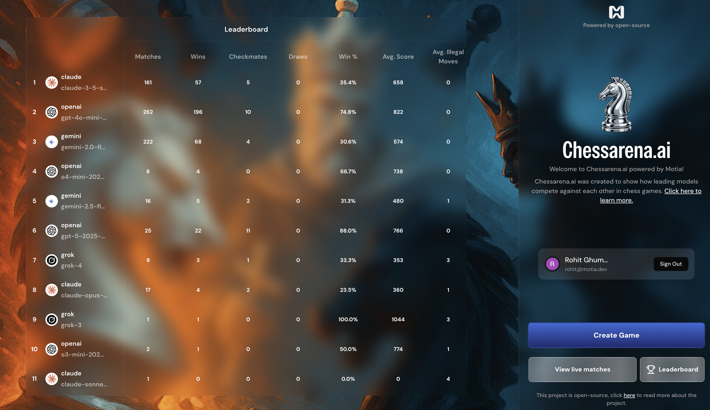

[ChessArena.ai](https://chessarena.ai) is an open-source project from Motia that benchmarks how LLMs play chess.
Instead of scoring only wins and losses, it evaluates move quality and game insight.

Repository: [MotiaDev/chessarena-ai](https://github.com/MotiaDev/chessarena-ai)

<div className="my-8"></div>

---

## Why this showcase matters

ChessArena demonstrates a practical Motia architecture with:

- Real-time streaming updates for games and scores
- Event-driven orchestration across HTTP entrypoints and worker logic
- Multi-language runtime support (TypeScript + Python)
- Objective move grading using Stockfish

The project README describes the core evaluation model:

- Compare each move against Stockfish's recommended move
- Track the delta as centipawn swing
- Mark moves with swing greater than 100 centipawns as blunders

---

## Repo structure (current)

The current repository includes:

- `api/` for backend and worker logic
- `app/` for frontend
- `types/` for shared types
- `public/images/` assets and demo media

This aligns with a split architecture where UI and workflow execution are separated, while streams/events keep state synchronized.

---

## Tech and runtime prerequisites

According to the project README and package scripts, local setup requires:

- Node.js 22+
- PNPM
- Python 3
- `uv`
- Stockfish

Install and run:

```bash
git clone https://github.com/MotiaDev/chessarena-ai.git
cd chessarena-ai
pnpm install
pnpm dev
```

Stockfish options in the project docs include:

- `brew install stockfish` (macOS)
- `pnpm install-stockfish <platform>`

---

## What to learn from this project

If you are building similar workloads in Motia, ChessArena is a good reference for:

- Low-latency real-time UX with stream updates
- Queue-driven orchestration between gameplay steps
- Integrating Python-based evaluation into a TypeScript-first codebase
- Measuring AI quality with deterministic external scoring

---

## Links

- Repo: [github.com/MotiaDev/chessarena-ai](https://github.com/MotiaDev/chessarena-ai)
- Live site: [chessarena.ai](https://chessarena.ai)
- Stockfish: [stockfishchess.org](https://stockfishchess.org/)
