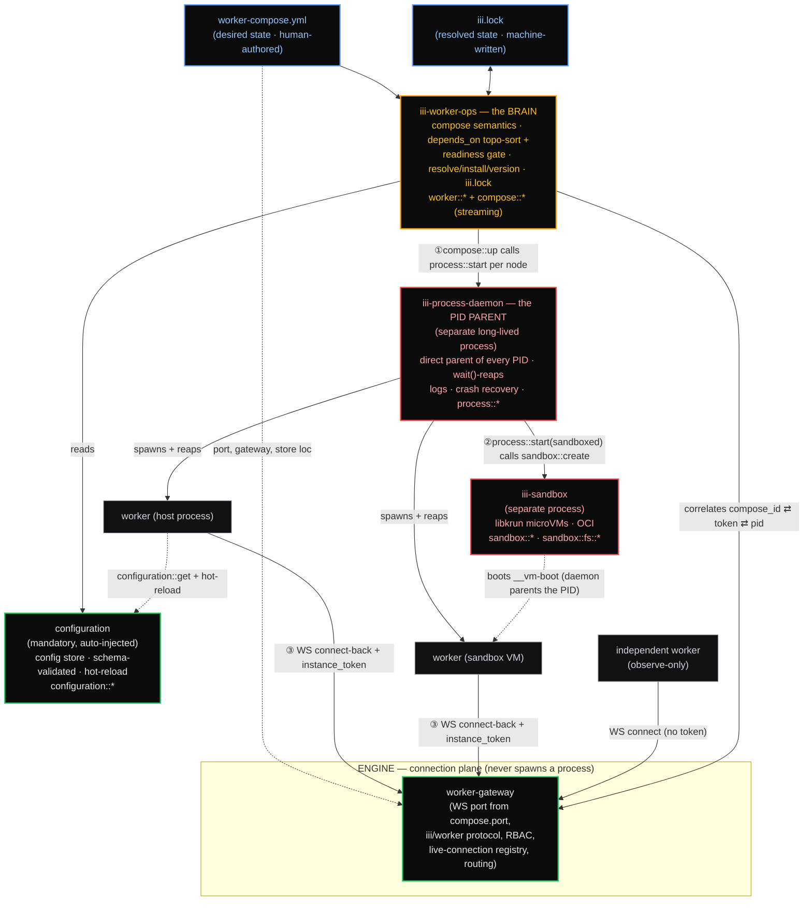

# iii Developer Experience Overhaul

A holistic redesign of how developers run, configure, and operate workers in **iii** — collapsing
today's tangle of process management, `config.yaml`, the `iii-worker-manager` worker, `iii-exec`,
sandboxes, and ~30 CLI leaf-commands into **one declarative file**, **four clean planes**, and a
**single CLI surface that is a thin wrapper over iii functions**.

This is the index. Each linked file owns one area in depth.

---

## The thesis (one breath)

iii's developer experience is rebuilt around one human-authored declarative file —
**`worker-compose.yml`** — that carries the irreducible bootstrap floor (the WS gateway `port`, the
configuration-store location, and the worker list + topology) and is the only file a human edits,
while a machine-written **`iii.lock`** records resolved versions and hashes (the package.json /
lockfile split). The **engine** becomes a pure connection plane: it binds the WS port natively from
`compose.port`, runs the iii/worker protocol + RBAC + the live-connection registry + invocation
routing — and it **never spawns an OS process again**. Every worker PID is owned by one long-lived
**`iii-process-daemon`** that is the *direct parent* of every process (no `setsid` detach, no
pidfiles, no `ps`-scan discovery), so it `wait()`-reaps every child and makes orphans and zombies
**impossible by construction** — absorbing today's `iii-exec`. A separate **`iii-worker-ops`** brain
owns compose semantics (parse/merge/env-precedence, `depends_on` topo-sort + readiness gating,
resolve/install/version, `iii.lock`) and exposes `worker::*` + streaming `compose::*` functions; on
`up` it topo-sorts the graph and calls the daemon's `process::start` per node. Per-worker
configuration is owned end-to-end by the mandatory **`configuration`** worker: each worker
self-registers its own config schema + initial value at boot via `configuration::register`
(schema-validated, hot-reloadable, addressed `config-worker:<id>`) — there is no config in any file.
The **CLI** consolidates into a
small verb set, each a thin clap arm that invokes a backing function over the same WS transport
`iii trigger` already uses — so everything in the CLI is also an iii function. The golden path
collapses to `curl|sh → iii init → iii up → iii trigger` in one terminal, with `depends_on`
readiness gating that kills the "Function not found" race — while `config.yaml` and
`worker-compose.yml` coexist for ≥3 releases so production migrates without an outage.

---

## Architecture: four planes, three meeting points



**How to read it.** Boxes are the components the spec defines. The dotted line from
`worker-compose.yml` to the gateway is the **bootstrap floor** (port + listener config + store
location read at boot). Solid arrows ①②③ are the **only three places the planes touch**:

1. **`compose::up`** (on `iii-worker-ops`, streaming) is the *only* graph orchestrator — it
   topo-sorts, resolves each worker, and calls **`process::start`** per node, gating each on
   readiness. The daemon never speaks the compose graph.
2. **`process::start`** for a *sandboxed* worker calls **`sandbox::create`**, then the daemon
   parents the resulting `__vm-boot` PID. The daemon stays dumb about images; `iii-sandbox` owns
   libkrun/OCI.
3. **WS connect-back + `instance_token`** joins *process identity* (the daemon's table) to
   *connection identity* (the engine registry). `iii-worker-ops` correlates them. A connection with
   a daemon-minted token is **managed** (full control); one without is **observe-only**.

---

## Component responsibility map

The authoritative table. No other file may redefine an owner or a function namespace.

| Component | Identity | Owns (authoritative for) | Never does | Functions |
|---|---|---|---|---|
| **Engine** | core process, not a worker (binary `iii`) | Binds the WS gateway port from `compose.port`; iii/worker protocol; RBAC handshake; **live-connection registry**; invocation routing; compose-file watcher; fires `worker_connected`/`worker_disconnected` | Spawn an OS process; resolve versions; read worker scripts; own a PID | routes all; owns none |
| **iii-worker-ops** (THE BRAIN) | worker id `iii-worker-ops`; **may** be an in-engine builtin | Compose semantics (parse + 4-layer merge over runtime/env/scripts/`depends_on`/`healthcheck` + env precedence — configuration is **not** a merged field; it lives in the `configuration` worker); `depends_on` graph → validate → cycle-detect → topo-sort → **readiness gate**; resolve/install/version (add/update/remove/clear); `iii.lock`; reconcile desired ↔ actual; the correlation map | Hold a `Child` handle; bind a socket; spawn a PID | `worker::{add,update,remove,clear,list,info,schema}`; `compose::{up,down,restart,status,validate}` |
| **iii-process-daemon** (THE PID PARENT) | worker id `iii-process-daemon`; **separate long-lived process** | Being the direct parent of every host PID; the authoritative process table; spawn / killpg-group / `wait()`-reap; log capture; `instance_token` mint+inject; crash recovery; startup orphan sweep; restart policy; absorbs `iii-exec` | Decide *what* to run; resolve versions; speak the compose graph | `process::{start,stop,restart,status,ps,logs,exec,signal,attach,reconcile}` |
| **iii-sandbox** | worker id `iii-sandbox`; **separate long-lived process** | microVM lifecycle (libkrun `__vm-boot`); OCI image pull/catalog/overlay; in-VM exec + fs; idle reaper (with a `keep_alive` carve-out for compose-managed sandboxed workers) | Be the parent of host (non-VM) workers | `sandbox::{create,run,exec,stop,list,catalog::list}` + `sandbox::fs::{…}` *(unchanged)* |
| **configuration** | worker id `configuration`; mandatory + auto-injected | Per-worker runtime config store (one entry per id); JSON-schema validation on `set` (and on `register` when an `initial_value` is given) — schema is re-supplied by the owning worker each boot, **not** persisted, so disk-loaded entries are value-only and `set` returns `SCHEMA_UNAVAILABLE` until re-register; `${VAR}` / `${VAR:default}` expansion on read (opt-out via `raw: true`); hot-reload trigger; bootstrap-tier value-only boot-read-off-disk | Store its own location (→ compose) | `configuration::{register,set,get,list,schema}` *(unchanged)* |
| **iii-supervisor** | in-VM PID-1; unchanged | Guest-side process reaping inside each VM; Restart/Shutdown/Ping/Status over virtio-console | Anything host-side | guest protocol only |
| **migrate** | one-shot tool | `config.yaml` → `worker-compose.yml` (runtime/topology only) | Run in steady state; touch config | `migrate::config_yaml` |

**Binary topology.** ONE binary `iii`. The process-daemon and sandbox-daemon run as **separate
long-lived processes of that same binary** via hidden subcommands (`iii __process-daemon`,
`iii __sandbox-daemon`) — true single-binary distribution *and* a process owner decoupled from
engine hot-reload. `iii-worker-ops` may be in-engine; the two daemons must not be.

---

## Canonical names

These names are fixed across every file. (Several of today's names were misleading — e.g.
`iii-worker-manager` never managed workers; it opened a port.)

| Concept | Canonical name | Note |
|---|---|---|
| Config-store worker | **`configuration`** | A `config-worker` *worker* does not exist. |
| Config URI scheme | **`config-worker:<id>`** | The addressing scheme for an entry (entry id == worker id), resolved to a `ConfigurationEntry{id}` inside the `configuration` worker. Not a compose field. |
| PID-owning daemon | **`iii-process-daemon`** / namespace **`process::*`** | Reject `iii-daemon` / `daemon::*`. |
| Lifecycle/catalog brain | **`iii-worker-ops`** / namespaces **`worker::*`** + **`compose::*`** | — |
| WS listener / port | **`worker-gateway`** (internal engine concept) | No longer a worker. Was the misnamed `iii-worker-manager`; its config entry is deleted. |
| Sandbox worker | **`iii-sandbox`** / **`sandbox::*`**, **`sandbox::fs::*`** | Kept separate; public API unchanged. |
| OCI/libkrun adapter | **`runtime-adapter`** (internal) | Belongs to `iii-sandbox`. |
| In-VM PID-1 | **`iii-supervisor`** | Unchanged; guest-only. |
| Arbitrary-process capability | **`process::start{spec, watch}`** | The `iii-exec` engine builtin is deleted. |
| Boot file | **`worker-compose.yml`** | Replaces `config.yaml`'s worker list + the port indirection. |
| Resolved lockfile | **`iii.lock`** | Keyed by `(package, version)`. |
| Per-worker manifest | **`iii.worker.yaml`** | Permissive/untyped; compose overrides it field-by-field for runtime/scripts/env/`depends_on`/`healthcheck`. Carries no `config:` block — config lives in the `configuration` worker. |
| Per-spawn key | **`instance_token`** (`III_INSTANCE_TOKEN`) | Plus `III_COMPOSE_ID`, `IIIWORKER_PORT`. |
| Migration tool | **`iii migrate`** / **`migrate::config_yaml`** | — |
| Top-level CLI aliases | **`iii up` / `iii down` / `iii ps` / `iii logs`** | Aliases for `iii worker compose …`; same backing functions. |
| VM egress field | **`runtime.egress: bool`** | Renamed from `runtime.network` — it is VM-egress, not inter-worker networking. |

---

## Design principles

1. **One declarative file.** A human edits exactly one file — `worker-compose.yml`. It is the boot
   egg (port + store location + worker topology) and nothing else is required to stand up a project.
2. **Compose = desired state; `iii.lock` = resolved state.** Floating tags and topology live in
   compose; concrete versions and hashes live in the machine-written lock. `up` is reproducible
   (replays the lock); `update` is the explicit re-pin.
3. **The engine never spawns.** It is a pure connection/protocol/RBAC/registry/routing plane. The
   single biggest structural simplification: the engine's `cmd.spawn` paths are deleted.
4. **One parent reaps everything.** Every PID is a direct child of `iii-process-daemon`, which
   `wait()`-reaps it. The only way to make a zombie — detach and drop the handle — is removed.
5. **The CLI is a thin wrapper over functions.** Every command is `parse → typed options → invoke
   the backing function over WS → render`. No business logic in the CLI; consent/prompts live only
   in the wrapper. Everything is scriptable via the same functions and `--json`.
6. **Config lives in the configuration worker, not in files.** Each worker registers its own schema +
   initial value at boot (`configuration::register`); compose carries no config seed and no config
   pointer.
7. **Override, never the reverse.** A worker ships `iii.worker.yaml` defaults; `worker-compose.yml`
   overrides them field-by-field (maps deep-merge; lists/scalars replace). Configuration is the
   exception: it lives in the `configuration` worker (not the manifest) and is not overridden via
   compose.

---

## Cross-cutting contracts

Five contracts span more than one file. They are fixed **here** so the per-area files stay
consistent; each file implements its slice and links back to this section.

### Project identity = the listener `port`

A machine can run several projects/engines at once, and two projects can both name a worker `math`.
So the unit of isolation is the **listener `port`** (the one fact every plane already holds):

- The process daemon's lock and state live under **`~/.iii/daemon/<port>/`** (`daemon.lock`,
  `state.json`) — a `down` in one project can never reap another project's PIDs.
- The `configuration` store `directory` will resolve **relative to the compose file's directory** (not the
  CWD that ran `up`), so each project has its own store. *(Today the fs adapter resolves it relative to the
  engine process CWD — `engine/src/workers/configuration/adapters/fs.rs:60-68` passes the relative path
  straight to `create_dir_all` with no rebasing; the compose-dir anchor is net-new.)*
- The correlation key that joins a connection to a managed process is **`(port, compose_id,
  instance_token)`** — `compose_id` alone is not globally unique.

Detail: [process-daemon.md](process-daemon.md) (daemon keying), [configuration-and-bootstrap.md](configuration-and-bootstrap.md) (store path), [engine-and-gateway.md](engine-and-gateway.md) (correlation key).

### Hot-reload / stop drain protocol

Killing a worker PID makes the engine `halt_invocation` every in-flight call to it
(`engine/mod.rs:1700-1706`) — so a naive restart drops requests. The drain is a three-party
contract: **`iii-worker-ops`** orchestrates it (in `compose::*` reconcile / `restart`), the **engine**
quiesces (stops routing *new* invokes to the instance and reports the in-flight count), and the
**daemon** executes `process::stop` with `SIGTERM → grace → SIGKILL → wait()`. Default drain timeout
**30s**; on expiry the remaining invocations are force-halted (callers get `invocation_stopped`),
logged, and surfaced as a `ComposeEvent` ("drained N, force-halted M"). Blue/green zero-downtime
reload is a **future** option for stateless workers, not a day-1 promise. Detail:
[engine-and-gateway.md](engine-and-gateway.md).

### Registration-collision rule

An untokened (independent) connection that registers a `compose_id` already owned by a managed
instance is **rejected** (and logged); the managed instance keeps the id and its function routing.
`instance_token` gates *control*; this rule gates *registration*. Detail:
[engine-and-gateway.md](engine-and-gateway.md), [process-daemon.md](process-daemon.md).

### The `health::check` convention

L2 readiness (`condition: healthy`, the `healthcheck:` block) calls a function the worker exposes.
The conventional default name is **`health::check`** — not hard-reserved; a `healthcheck:` block may
name any `function_id` (or run a `command`). A `depends_on … condition: healthy` on a worker that
declares no `healthcheck:` is a validation error. Detail: [worker-compose.md](worker-compose.md)
(the block), [lifecycle-and-onboarding.md](lifecycle-and-onboarding.md) (the L0/L1/L2 contract).

### Canonical exit codes

CLI errors equal function errors: `WorkerOpErrorKind` W-codes (`crates/iii-worker/src/core/error.rs`)
map to small stable process exit codes. This table is canonical; other files cross-link it.

| W-code | Kind | Exit |
|---|---|---|
| W100 | `InvalidName` | 2 |
| — | lock-drift (`compose up --frozen` / `validate --frozen`) | 3 *(preserves `sync --frozen`'s contract)* |
| W110 | `NotFound` | 4 |
| W104 | `ConsentRequired` | 5 |
| W120 | `LockBusy` | 6 |
| W161 | `StartTimeout` | 7 |
| (other) | `Internal` / IO / Registry | 1 |

Under `--json`, errors also emit `{ "error": { "code", "kind", "message" } }`. Detail:
[cli-and-functions.md](cli-and-functions.md).

A sixth net-new field — **`ConfigurationEntry.secret: bool`** — is shared by
[secrets.md](secrets.md) (the redaction rules) and [configuration-and-bootstrap.md](configuration-and-bootstrap.md)
(the store contract: `register`/`set` preserve it; every read path redacts to `***` unless
`reveal: true`).

---

## The spec

| File | What it owns |
|---|---|
| [worker-compose.md](worker-compose.md) | The `worker-compose.yml` schema: top-level shape, the per-worker block, the 4-layer merge chain, env precedence, `runtime`/`egress`, `depends_on`, `healthcheck`, format versioning, the six worked examples, validation error catalog, the typed serde schema, `-f` overlays. |
| [engine-and-gateway.md](engine-and-gateway.md) | The engine as a pure connection plane: boot sequence, baking the WS gateway in (deleting `iii-worker-manager`), the unified registration protocol for the three worker kinds + `instance_token`, RBAC carry-over, and the **hot-reload drain protocol**. |
| [process-daemon.md](process-daemon.md) | `iii-process-daemon`: the single spawn/stop primitives, the zombie root-cause → mechanism table, supervision tiers, logs (ring buffer vs `iii-observability`), crash recovery, multi-engine keying, the sandbox idle-reaper carve-out, and the Windows ruling. |
| [cli-and-functions.md](cli-and-functions.md) | The unified CLI tree and the **command → function → owner** contract; the thin-wrapper + bootstrap architecture; the function-id compatibility layer; output formats; the migration alias map. |
| [configuration-and-bootstrap.md](configuration-and-bootstrap.md) | Killing `config.yaml`: the three-fact bootstrap floor, the boot sequence, the `config.yaml`-entry → destination migration table, `config-worker:<id>` resolution, worker self-registration at boot, env precedence on read, restart-tier vs live, and `iii migrate`. |
| [secrets.md](secrets.md) | Secret handling: `env_file` is never persisted to the store, `${VAR}` as the recommended path, the `secret: true` redaction tag, `.gitignore` guidance, cloud handoff, and the out-of-scope line. |
| [lifecycle-and-onboarding.md](lifecycle-and-onboarding.md) | The DX payoff: the golden path, `iii init`/`iii up` semantics, hot-reload, day-2 ops, error DX, the **readiness contract** (L0/L1/L2), the testing/CI story, and the docs restructure. |
| [migration.md](migration.md) | The 6-phase rollout, the `config.yaml`/compose coexistence bridge, the `managed.rs` decomposition, the test blast radius, the **cloud cutover**, and the TUI/console/cloud co-migrations. |

---

## `worker-compose.yml` at a glance

```yaml
version: "1"
port: 49134                                  # the WS gateway port (bootstrap)
configuration:                               # the config store's own location (bootstrap)
  adapter: fs
  directory: ./data/configuration

workers:
  math-worker:                               # local source worker
    runtime: { workspace: ./workers/math-worker }
    scripts: { install: npm install, start: npm run dev }

  caller-worker:
    runtime: { workspace: ./workers/caller-worker }
    depends_on: [math-worker]                # start-ordered, gated on readiness
    environment: { LOG_LEVEL: debug }        # overrides iii.worker.yaml

  state:                                     # remote registry worker, pinned in iii.lock
    runtime: { package: workers.iii.dev/iii-state:latest }
```

See [worker-compose.md](worker-compose.md) for the full schema and the six worked examples.

---

## Scope

**In scope (v1):** single-host development and self-hosting; the four-plane runtime; the unified
CLI + function API; `config.yaml` migration; secrets-at-rest hygiene.

**Out of scope (stated explicitly so the boundary is clear):**

- **Multi-machine orchestration.** `worker-compose.yml` + the daemon are a single-host model. The
  CLI's `--address`/`--port` connect to a *remote engine* for triggering and inspection, but not for
  process management. Multi-host is iii Cloud's job — see [migration.md](migration.md).
- **Inter-worker networking.** Workers communicate only via functions over the engine bus; there are
  no service IPs/ports between workers. Docker-style `networks:` is not adopted. `runtime.egress`
  controls a sandbox VM's outbound internet, nothing more — see [worker-compose.md](worker-compose.md).
- **A real secrets backend** (Vault/SSM/age). v1 ships file-only `env_file` + `${VAR}` + redaction; the
  `configuration` adapter is the seam for a future `secret` backend — see [secrets.md](secrets.md).
- **Native Windows.** v1 is WSL-only; the daemon's `spawn_owned`/`stop_owned` is the seam for a
  future Job-Objects backend — see [process-daemon.md](process-daemon.md).
- **Host-process resource limits (cgroups/rlimits).** Sandbox VMs already cap CPU/memory; host
  processes are dev-trusted in v1.

---

## Open questions to ratify

These are the genuinely unresolved trade-offs surfaced during design review. Each has a recommended
default; the spec proceeds on the default unless overruled. (Detail in the owning file.)

| # | Question | Recommended default | Owner file |
|---|---|---|---|
| OQ-1 | Top-level `iii up/down/ps/logs` aliases? | **Yes** — marquee ergonomics, zero cost. | cli-and-functions |
| OQ-2 | Multi-engine daemon keying (two projects, one machine). | **Daemon per engine/port** — lock+state under `~/.iii/daemon/<port>/`; resolve relative paths against the compose file dir. | process-daemon |
| OQ-3 | Hot-reload drain protocol. | **Drain** (stop new invokes, bounded wait, then SIGTERM); blue/green later for stateless workers. | engine-and-gateway |
| OQ-4 | Daemon crash recovery on macOS (no subreaper). | **Documented degraded mode**: best-effort re-adopt + startup orphan sweep. | process-daemon |
| OQ-6 | `iii.lock` keying for two copies with divergent versions. | **Key by `(package, version)`.** | worker-compose |
| OQ-7 | libkrun-unavailable hosts (Intel Mac / no-KVM / CI). | **Partial up** — preflight gate, sandbox workers SKIPPED, host workers still come up. | worker-compose |
| OQ-8 | Compose format versioning. | **`version` required + semver**; minor = additive (warn-and-ignore unknown keys within a major); major = hard refuse. | worker-compose |
| OQ-9 | Comment-preserving compose edits on `add`/`remove`. | **Serialize the typed struct** (one source of truth) unless onboarding demands line-surgery. | worker-compose |
| OQ-10 | `--frozen` exit-code contract when `sync` folds into `compose up`. | **Preserve the drift exit-code/W-code** so CI keeps failing on drift. | migration |
| OQ-11 | Inter-worker networking. | **None** — function bus only; rename `network`→`egress`; `networks:` out of scope. | worker-compose |
| OQ-12 | Artifact GC for machine-global `~/.iii/`. | **`iii worker clear --unused`** intent stated; host rlimits out of scope. | cli-and-functions |
| OQ-13 | Compose-level `defaults:` block. | **Keep it** (the merge engine + migrate tool account for it). | worker-compose |

---

## Phased migration at a glance

`config.yaml` and `worker-compose.yml` **coexist for ≥3 releases** behind a format-detection bridge.
The end state is reached in six phases — full detail, entry/exit criteria, and the cloud cutover in
[migration.md](migration.md):

```
Phase 0  Dual-parser — compose lowered to today's EngineConfig (no behavior change, --compose flag)
Phase 1  iii.lock split + `iii migrate`
Phase 2  Per-worker config → worker self-registration at boot, one worker at a time (behind boot-read) — largely landed (see note)
Phase 3  The iii-process-daemon (flag-gated; the risky middle; ~10 PRs)
Phase 4  Bake the gateway into the engine; delete iii-worker-manager + iii-exec entries (cloud canary)
Phase 5  Remove config.yaml + CLI/function alias cleanup
```

> **Phase 2 is already shipped in part.** All seven built-in workers — `iii-state`, `iii-stream`,
> `iii-pubsub`, `iii-cron`, `iii-queue`, `iii-observability`, `iii-http` — already self-register their
> own config schema + initial value at boot (`configuration::register` with `initial_value`),
> read the live value via `configuration::get`, and hot-reload off the `configuration` trigger. The
> phase-defining **boot-read-off-disk** — reading the persisted value before the bus is up — currently
> exists for `iii-state` and `iii-observability` only. Remaining: boot-read for the other five, and
> external/third-party workers self-registering their own config at boot.

---

## Relationship to today's code

This overhaul is **mostly a re-wiring of sound machinery, not a rewrite** — with one genuinely
net-new build (the supervisor substrate in `iii-process-daemon`). The WS listener and iii/worker
protocol (`engine/src/workers/worker/`) already exist and need zero protocol changes; the
`worker::*` function API already exists on today's worker-ops daemon; the correct process-ownership
primitive already exists in two places (`engine/src/workers/external.rs`,
`engine/src/workers/shell/exec.rs`) and is generalized to all process kinds; the `configuration`
worker, the `iii.lock` resolver, and the sandbox daemon all exist and are reused. What changes is
*ownership and config source*: the port moves from a worker entry to `compose.port`; per-worker
config's source becomes the worker itself, which registers its own schema + initial value at boot via
`configuration::register` (already live for the seven built-in workers, which self-register then read
the live value); and the four
detached spawn paths (the zombie sources) collapse into one reaping parent. The research that grounds every claim — twelve subsystem
investigations, six design proposals, and four adversarial critiques — is summarized per-file with
`path:line` citations.
