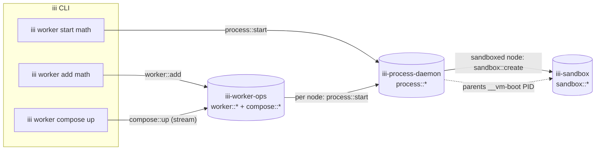
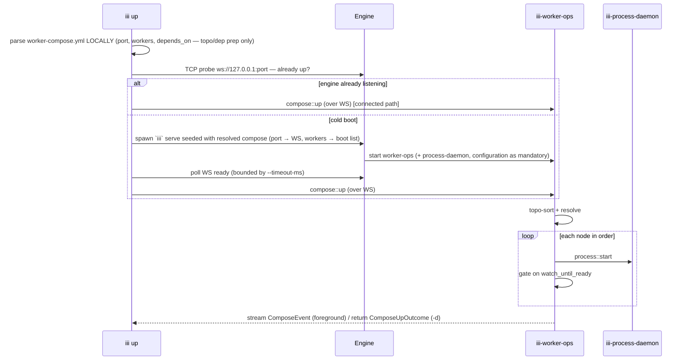

# Unified CLI & the command → function → owner contract

This file defines the centerpiece of the DX overhaul: **every CLI command is a thin wrapper over an
iii function**. The CLI parses arguments, builds a typed request, invokes a function over the same
WebSocket transport `iii trigger` already uses, and renders the typed response. No business logic
lives in the CLI binary. This document specifies the full command tree, the authoritative
command→function→owner→mode→I/O table, the thin-wrapper architecture, the bootstrap-vs-connected
split, the net-new types, the function-id compatibility layer that keeps existing consumers working,
and the migration map from today's commands.

It consumes decisions made in [worker-compose.md](worker-compose.md) (schema), assumes the engine
shape in [engine-and-gateway.md](engine-and-gateway.md), the PID model in
[process-daemon.md](process-daemon.md), the store in
[configuration-and-bootstrap.md](configuration-and-bootstrap.md), redaction in [secrets.md](secrets.md),
and the rollout in [migration.md](migration.md). All `path:line` citations are into
`/Users/sergio/Documents/workspaces/iii/iii` unless prefixed with a sibling repo (`../tuiii`,
`../registry`).

---

## 1. The three load-bearing facts

The thin-wrapper goal is not aspirational — it is **already half-true today**. Three facts in the
current code make the rest of this design an extension of a proven pattern rather than an invention.

1. **A clean, presentation-free function layer already exists and is dual-consumed.**
   `crates/iii-worker/src/core/` is documented as *"Pure async ops … No CLI presentation, no `i32`
   exit codes, no global state"* (`crates/iii-worker/src/core/mod.rs:4-6`). Each op is a free
   function `run(opts, &ProjectCtx, &dyn EventSink, &dyn WorkerHostShim) -> Result<Outcome,
   WorkerOpError>` (e.g. `core/add.rs:20`, `core/start.rs:12`). The **same** functions are already
   registered as iii functions `worker::{add,remove,update,start,stop,list,clear,schema}` on the
   `iii-worker-ops` host daemon (`crates/iii-worker/src/cli/worker_manager_daemon.rs:177-226`), and
   both the CLI and the daemon call the identical `core::*::run(...)`. So for 7 verbs, "the CLI and
   the function are the same code" is **already shipped**.

2. **`iii trigger` is already a thin WS client.** `iii trigger <fn> [k=v] --address --port`
   (`engine/src/main.rs:132`) opens `ws://{address}:{port}`, connects as a worker via the SDK
   `register_worker(...)` (`engine/src/cli_trigger/exec.rs:19-20`), sends an invocation, and awaits
   the result. This **is** the transport every unified command will use. The unified CLI is
   literally "`iii trigger` with a typed front-end and pretty output."

3. **Functions already carry per-op metadata.** `op_metadata(function_id) -> (timeout_ms, idempotent)`
   returns timeouts + safe-retry per function (`crates/iii-worker/src/cli/worker_manager_daemon.rs:157-167`:
   `worker::add`→`(600_000,true)`, `worker::start`→`(60_000,false)`, …). The function surface — not
   the CLI — is the source of truth for timeouts and idempotency; the CLI inherits them. We keep and
   extend this table.

**Bottom line:** ~7 verbs are already function-backed and need only a thin re-wrap;
`restart/logs/status/exec` and the net-new `info/ps/compose::*/process::*` must be lifted into the
function layer and registered before the goal holds across the board. The
`core/` + `EventSink` + `WorkerHostShim` + `register_function` quartet is the proven template to
extend (`crates/iii-worker/src/core/mod.rs:4`, `crates/iii-worker/src/cli/worker_manager_daemon.rs:177`).

---

## 2. The ownership boundary (read this before the table)

There are exactly four function owners. The split is by **responsibility class**, not by command
name. This map is the CANON; no other file in this set may re-namespace these.

| Owner | Worker id | Responsibility class | Owns functions |
|---|---|---|---|
| **worker-ops** | `iii-worker-ops` (MAY be in-engine) | **Desired state / catalog**: resolve sources, install/remove/version-pin artifacts, list/describe the declared set, drive the compose graph (topo-sort + readiness). Touches `worker-compose.yml`, `iii.lock`, `~/.iii/{workers,images,managed}`. **Never holds a PID.** | `worker::{add,update,remove,clear,list,info,schema}`, `compose::{up,down,restart,status,validate}` |
| **process-daemon** | `iii-process-daemon` (separate long-lived process) | **Runtime / PIDs**: the single direct parent of every host process (no `setsid`). start/stop/restart, stream logs, the authoritative process table, run-now exec, signal + group-reap. Absorbs the deleted `iii-exec` and the host-spawn logic pulled out of the engine. **Never decides WHAT to run or resolves a version.** | `process::{start,stop,restart,status,ps,logs,exec,signal,attach,reconcile}` |
| **sandbox** | `iii-sandbox` (kept separate) | **Isolated runtime**: microVM lifecycle + in-VM exec/fs. Already function-first. The process-daemon delegates sandboxed spawns here but still parents the resulting `__vm-boot` PID. | `sandbox::*` + `sandbox::fs::*` (UNCHANGED) |
| **configuration** | `configuration` (mandatory, auto-injected) | **Config store**: per-worker runtime config as iii primitives; schema validation; `${VAR}` expansion; hot-reload fan-out. | `configuration::{register,set,get,list,schema}` (UNCHANGED) |

> The `worker-gateway` (WS listener / port opener) is an **internal engine concept, not a worker and
> not a function owner**. It binds the port from `compose.port` and routes invocations. See
> [engine-and-gateway.md](engine-and-gateway.md).

### 2.1 The worker-ops ↔ process-daemon line — the single most important decision

> **worker-ops decides WHAT should exist and at WHICH VERSION. process-daemon decides WHAT IS RUNNING
> and OWNS THE PID.** `add` (download + pin + declare) is worker-ops; `start` (spawn a child, hold the
> `Child`, `wait()`-reap it) is process-daemon.

Against today's code, the verbs `start/stop/restart` exist on `iii-worker-ops`
(`crates/iii-worker/src/cli/worker_manager_daemon.rs:328-339`) but are **fire-and-detach**: they
`setsid()` the child and hand the PID to a disk pidfile — the zombie root cause documented in
[process-daemon.md](process-daemon.md). **This design moves the runtime verbs
`start/stop/restart/logs/status/ps/exec` off worker-ops onto `iii-process-daemon`**, which keeps the
`Child` and `wait()`s it. worker-ops retains only catalog verbs + compose orchestration.

Consequences for the CLI:

- `iii worker start math` is **not** a worker-ops call — the CLI invokes `process::start` directly.
- `iii worker add math` is **worker-ops only** — it never spawns anything.
- `iii worker compose up` is worker-ops orchestration that **calls** `process::start` per node.
  worker-ops is the conductor; the process-daemon is the player; they are function-to-function.

**Why split rather than one mega-daemon:** (a) catalog ops are slow, network-bound, idempotent, and
project-scoped, while runtime ops are fast, stateful, and must survive across CLI invocations while
owning PIDs; (b) the process-daemon must be a long-lived, separate process so engine hot-reload does
not orphan worker PIDs (see [process-daemon.md](process-daemon.md)), whereas worker-ops can be
request-scoped or in-engine; (c) keeping the PID owner separate lets `process::exec` (run-now) and
arbitrary processes (the absorbed `iii-exec`) share one supervisor with managed workers.



---

## 3. Full target CLI tree (every command, every flag)

Single front-end binary `iii`. The legacy `iii → iii-worker` download-and-exec hop
(`engine/src/cli/mod.rs`, the passthrough `Worker { args }` arm at `engine/src/main.rs:162`) is
**removed**; `worker` and `compose` become native clap subtrees that issue function calls, exactly
like `iii trigger` does today. The process-daemon and sandbox-daemon are still separate *processes*
of the same binary, reached via hidden subcommands (`iii __process-daemon`, `iii __sandbox-daemon`).

**Global flags on every function-backed command** (inherited from `iii trigger`,
`engine/src/main.rs`): `--address <host>` (default `127.0.0.1`), `--port <u16>` (default from
`compose.port`, else `49134`), `--timeout-ms <u64>` (default per-op from `op_metadata`), `--json`
(machine output), `-q/--quiet`, `--no-color`, `-y/--yes` (preset consent on the destructive verbs).

```
iii
├── up      [W...]  [-d|--detach] [--no-deps] [--force-recreate] [--build] [--wait] [--frozen] [--ephemeral]
├── down    [W...]  [--clear-artifacts] [--remove-orphans] [-t|--timeout <s>] [--ephemeral]
├── ps      [--json]
├── logs    [W...]  [-f|--follow] [-n|--tail <N>] [--since <dur>]
│            #  ^^^ top-level aliases = `iii worker compose {up,down,ps,logs}`; same backing fns
│
├── trigger <fn-path> [k=v ...]            # unchanged; the generic escape hatch
│
├── migrate [--from <config.yaml>] [--dry-run] [--reap-legacy]   # one-shot config.yaml → compose
│
├── worker                                  # catalog + per-worker runtime convenience
│   ├── add <SRC>...   [-f|--force] [--up] [--no-wait]
│   │        # SRC = name[@ver] | oci-ref | ./path ; edits compose+lock, does NOT auto-start
│   ├── update [W]...  [-f|--force] [--clear-artifacts] [--restart] [--no-wait]
│   ├── remove <W>...  [--clear-artifacts] [-y|--yes]
│   ├── clear  [W]...  [--unused] [-y|--yes]      # wipe artifacts only; --unused = GC
│   ├── list   [--running] [--json]
│   ├── info   <W>     [--json] [--reveal]        # NEW: one worker, full resolved detail
│   ├── start  <W>...  [--no-wait]                # runtime → process-daemon
│   ├── stop   <W>...  [-y|--yes] [-t|--timeout <s>]
│   ├── restart <W>... [--no-wait]
│   ├── logs   <W>     [-f|--follow] [-n|--tail <N>] [--since <dur>]
│   ├── status <W>     [--watch] [--json]         # default ONE-SHOT; --watch = live TUI
│   ├── ps     [--json]                           # NEW: process table across managed procs
│   ├── exec   <W> [-e K=V] [-w CWD] [-t|--tty] [--timeout <ms>] -- CMD...
│   ├── config <W> [get <key> | set <key> <val> | edit | list] [--reveal] [--json]   # NEW → configuration::*
│   ├── init   [name] ...                         # scaffold a NEW worker (engine-local, unchanged)
│   │
│   └── compose                                   # the worker-compose.yml lifecycle
│       ├── up      [W...] [-d|--detach] [--no-deps] [--force-recreate] [--build] [--wait] [--frozen] [--ephemeral]
│       ├── down    [W...] [--clear-artifacts] [--remove-orphans] [-t|--timeout <s>] [--ephemeral]
│       ├── restart [W...] [--no-deps] [-t|--timeout <s>]
│       ├── logs    [W...] [-f|--follow] [-n|--tail <N>] [--since <dur>]
│       ├── status  [W...] [--watch] [--json]
│       ├── ps      [--json]                       # alias of `worker ps` scoped to the compose set
│       ├── exec    <W> [-e K=V] [-w CWD] [-t] [--timeout <ms>] -- CMD...
│       ├── sandbox <run|exec|list|stop|fs ...>    # passthrough to sandbox::*
│       └── validate [--frozen]                    # parse + cycle-check + lock-drift; replaces `verify`
│
└── project init / generate-docker               # scaffolding (engine-local, no fn), unchanged
```

### 3.1 Per-flag justification

| Command · flag | Backed by / origin | Why it exists |
|---|---|---|
| `add --force` | `AddOptions.force` (`crates/iii-worker/src/cli/app.rs:47`) | reinstall even if the lock says current |
| `add --up` | NEW | declarative `add` does not auto-start; `--up` reconciles immediately (resolves the BREAKING auto-start removal — §6) |
| `add --no-wait` | `AddOptions.wait` (`crates/iii-worker/src/core/types.rs`) | don't block on readiness |
| `add` (dropped `--reset-config`) | was `crates/iii-worker/src/cli/app.rs:22` | config.yaml-bound; dies with config.yaml |
| `update --force` | NEW on `UpdateOptions` | re-resolve + download even if unchanged |
| `update --clear-artifacts` | NEW | delete old artifact dirs after re-pin |
| `update --restart` | NEW | restart targets currently running after update (today `update` never restarts) |
| `remove --clear-artifacts` | NEW on `RemoveOptions` | fuse the separate `clear` step into remove |
| `clear --unused` | NEW (M12) | GC artifacts not referenced by any compose in this project |
| `list --running` | `ListOptions.running_only` (`crates/iii-worker/src/core/types.rs`) | filter to running |
| `info` | NEW fn | a data dump; today `status` is a live TUI, not introspectable |
| `info --reveal` / `config --reveal` | NEW (secrets) | un-redact secret values; default is `***` (see [secrets.md](secrets.md)) |
| `start/stop/restart` (multi `W`) | `process::*` | compose convenience; one call, many ids |
| `stop -t/--timeout` | NEW | grace window before SIGKILL (process-daemon group-reap) |
| `logs --follow/--tail/--since` | process-daemon ring buffer | stream vs bounded history |
| `status` default one-shot; `--watch` | re-point of `cli::status` TUI | fixes "status is always a TUI" friction; old TUI = `--watch` |
| `ps` | NEW fn | process-table view across all managed procs |
| `exec -- CMD`, `-t/--tty` | today's `ExecArgs` (`crates/iii-worker/src/cli/app.rs:239`) | run-now in a worker; PTY mode |
| `config get/set/edit/list` | NEW → `configuration::*` | per-worker config CRUD; the single config surface (§10) |
| `compose up -d/--detach` | NEW | detach (return after ready) vs foreground (stream + SIGINT→down) |
| `compose up --no-deps` | NEW | skip `depends_on` topo gating |
| `compose up --force-recreate` | NEW | stop+start even if already running |
| `compose up --build` | NEW | re-run install/setup scripts |
| `compose up --wait` | NEW | block until all healthy (docker-compose parity) |
| `compose up [W...]` | NEW | the positional worker list IS the "only these" selector (alias `--only W...`); brings up only the named workers (+ their `depends_on` unless `--no-deps`) |
| `compose up --ephemeral` | NEW | temp `configuration` store dir + a random free `port` so a test bring-up does not collide with a running dev stack (the testing/CI path — see [lifecycle-and-onboarding.md](lifecycle-and-onboarding.md)); `down --ephemeral` tears it down |
| `compose up --frozen` / `validate --frozen` | folds `sync --frozen` | locked replay; **preserves the lock-drift exit code** (§6) |

The `compose` flags are modeled on docker-compose so the mental model transfers; the mission asks for
Docker-style semantics.

---

## 4. THE DELIVERABLE — command → function_id → owner → mode → input → output

**Mode**: `sync` = await a single result (default); `stream` = the function emits a channel/event
stream the CLI renders live; `void` = fire-and-forget. **Status today**: `EXISTS` (registered,
unchanged surface), `EXISTS*` (registered but the surface/owner changes — a compat event), `NEW`.

| CLI command | function_id | Owner | Mode | Input payload | Output payload | Status today |
|---|---|---|---|---|---|---|
| `worker add` | `worker::add` | worker-ops | sync | `AddOptions{ sources:[WorkerSource], force:bool, up:bool, wait:bool }` | `AddOutcome{ name, version?, status:AddStatus, awaited_ready, declared_in }` | EXISTS* — `source`→`sources:Vec`, drop `reset_config` (`crates/iii-worker/src/core/types.rs:40,50`) |
| `worker update` | `worker::update` | worker-ops | sync | `UpdateOptions{ names:[String], force:bool, clear_artifacts:bool, restart:bool, wait:bool }` | `UpdateOutcome{ updated:[UpdateEntry{name,from,to}], restarted:[String] }` | EXISTS* — add `force/clear_artifacts/restart` (`crates/iii-worker/src/core/types.rs:122`) |
| `worker remove` | `worker::remove` | worker-ops | sync | `RemoveOptions{ names:[String], all:bool, clear_artifacts:bool, yes:bool }` | `RemoveOutcome{ removed:[String], cleared_bytes? }` | EXISTS* — add `clear_artifacts` (`crates/iii-worker/src/core/types.rs:104`) |
| `worker clear` | `worker::clear` | worker-ops | sync | `ClearOptions{ names:[String], all:bool, unused:bool, yes:bool }` | `ClearOutcome{ cleared_bytes }` | EXISTS* — add `unused` (`crates/iii-worker/src/core/types.rs`) |
| `worker list` | `worker::list` | worker-ops | sync | `ListOptions{ running_only:bool }` | `ListOutcome{ workers:[WorkerEntry{name,version,running,pid}] }` | EXISTS (`crates/iii-worker/src/core/list.rs`) |
| `worker info` | `worker::info` | worker-ops | sync | `InfoOptions{ name:String, reveal:bool }` | `InfoOutcome{ name, version, source, locked, declared, runtime?, running, pid?, depends_on:[String] }` | **NEW** |
| `worker schema` | `worker::schema` | worker-ops | sync | `{ trigger? }` | `{ schemas: map<fn,{input,output}> }` | EXISTS (`crates/iii-worker/src/cli/worker_manager_daemon.rs:177`) |
| `worker config get/set/edit/list` | `configuration::{get,set,list}` | **configuration** | sync | per `configuration::*` (`{ entry_id, key?, value?, reveal? }`) | per `configuration::*` | EXISTS (configuration worker) |
| `worker start` | `process::start` | **process-daemon** | sync | `StartOptions{ names:[String], port?:u16, wait:bool }` | `StartOutcome{ started:[{name, pid, port?}] }` | EXISTS* as `worker::start` (`worker_manager_daemon.rs:328`) — **MOVE; stop detaching** |
| `worker stop` | `process::stop` | **process-daemon** | sync | `StopOptions{ names:[String], grace_ms?:u64, yes:bool }` | `StopOutcome{ stopped:[{name,signal}] }` | EXISTS* as `worker::stop` (`worker_manager_daemon.rs:339`) — **MOVE; group-reap** |
| `worker restart` | `process::restart` | **process-daemon** | sync | `RestartOptions{ names:[String], wait:bool }` | `RestartOutcome{ restarted:[{name,pid}] }` | EXISTS* — today not a fn (`cli::managed::handle_managed_restart`); make a fn |
| `worker logs` | `process::logs` | **process-daemon** | stream | `LogsOptions{ names:[String], follow:bool, tail?:u32, since?:Duration }` | stream of `LogLine{ ts, worker, stream:stdout\|stderr, line }` then `LogEnd` | EXISTS* as `worker::logs` (terminal-tangled; `../tuiii/src/engine/logs.rs:77`) — needs ring-buffer capture |
| `worker status` | `process::status` | **process-daemon** | sync | `StatusOptions{ name:String }` | `StatusOutcome{ name, state:ProcState, pid?, uptime?, restarts, ready, last_exit? }` | EXISTS* — TUI-only today; add data fn, keep TUI as `--watch` client |
| `worker ps` | `process::ps` | **process-daemon** | sync | `PsOptions{ scope? }` | `PsOutcome{ procs:[ProcRow{ id, name, kind:worker\|exec\|sandbox, pid, state, uptime, cpu?, mem? }] }` | **NEW** |
| `worker exec` | `process::exec` | **process-daemon** | stream | `ExecOptions{ target:{worker\|host\|sandbox}, cmd:[String], env, cwd?, tty:bool, timeout_ms? }` | stream `Started{pid}`/`Stdout`/`Stderr`/`Exited{code}` | EXISTS* — exists vs sandbox only; generalize to host+worker |
| `worker compose up` | `compose::up` | worker-ops (calls process-daemon) | **stream** (sync if `-d`) | `ComposeUpOptions{ workers:[String], detach:bool, no_deps:bool, force_recreate:bool, build:bool, wait:bool, frozen:bool }` | stream `ComposeEvent{ worker, phase:resolve\|install\|start\|ready, … }` then `ComposeUpOutcome{ started:[String] }` | **NEW** |
| `worker compose down` | `compose::down` | worker-ops (calls process-daemon) | sync | `ComposeDownOptions{ workers:[String], clear_artifacts:bool, remove_orphans:bool, timeout_s?:u32 }` | `ComposeDownOutcome{ stopped:[String], removed_orphans:[String] }` | **NEW** |
| `worker compose restart` | `compose::restart` | worker-ops (calls process-daemon) | sync | `ComposeRestartOptions{ workers:[String], no_deps:bool, timeout_s? }` | `ComposeRestartOutcome{ restarted:[String] }` | **NEW** |
| `worker compose logs` | `process::logs` (multiplexed) | process-daemon | stream | `LogsOptions{ names:[String], follow, tail?, since? }` | interleaved `LogLine{ worker, … }` | reuses `process::logs` over many ids |
| `worker compose status` | `compose::status` | worker-ops (aggregates process-daemon) | sync | `ComposeStatusOptions{ workers:[String] }` | `ComposeStatusOutcome{ rows:[{ worker, declared, state, ready, pid?, depends_on }] }` | **NEW** (joins compose graph + `process::ps`) |
| `worker compose ps` | `process::ps` | process-daemon | sync | `PsOptions{ scope:Compose }` | `PsOutcome{...}` | alias of `process::ps` |
| `worker compose exec` | `process::exec` | process-daemon | stream | `ExecOptions{ target:{worker:id}, ... }` | exec stream | reuses `process::exec` |
| `worker compose sandbox …` | `sandbox::{run,exec,list,stop}` + `sandbox::fs::*` | **sandbox** | sync/stream | per sandbox op | per sandbox op | EXISTS — pure passthrough |
| `worker compose validate` | `compose::validate` | worker-ops | sync | `ComposeValidateOptions{ frozen:bool }` | `ComposeValidateOutcome{ ok:bool, errors:[…], lock_drift? }` | **NEW** (replaces `verify`) |
| `migrate` | `migrate::config_yaml` | **migrate** (one-shot) | sync | `MigrateOptions{ from?:Path, dry_run:bool, reap_legacy:bool }` | `MigrateOutcome{ wrote:[Path], warnings:[String] }` | **NEW** |
| `up` / `down` / `ps` / `logs` (top-level) | = `compose::{up,down}` / `process::ps` / `process::logs` | as above | as above | as above | as above | aliases (§3) |

**Function-id namespaces, final (CANON):**

- `worker::*` (catalog) — owner `iii-worker-ops`.
- `compose::*` (graph orchestration) — owner `iii-worker-ops`. compose is "the whole declared set,"
  i.e. catalog-tier; it *calls* the process-daemon for the actual spawns.
- `process::*` (runtime / PIDs) — owner `iii-process-daemon`.
- `sandbox::*` + `sandbox::fs::*` — owner `iii-sandbox` (UNCHANGED — preserves the 16-fn public API
  and the publish-workflow name dependency).
- `configuration::*` — owner `configuration` (UNCHANGED).
- `migrate::config_yaml` — owner `migrate` (one-shot tool, not part of the steady-state surface).

> **Bootstrap-only commands** (work before/without a live engine — §6): `up`/`compose up` (boots the
> engine then runs `compose::up`) and `down`/`compose down` (may stop the engine after
> `compose::down`). Every other command hard-requires a live engine and fails fast with
> `engine not running; run \`iii up\``.

---

## 5. Thin-wrapper architecture

### 5.1 The connected path (the common case)

Identical mechanism to `iii trigger` today (`engine/src/cli_trigger/exec.rs:19-20`):

```
iii worker <cmd>  ──parse(clap)──▶  build typed *Options  ──serialize──▶
  WS connect ws://{address}:{port}  ──InvokeFunction{ function_id, payload }──▶ engine
  engine routes to owning worker (worker-ops / process-daemon / sandbox / configuration)
  ──InvocationResult──▶  CLI deserializes typed *Outcome  ──render(human | --json)──▶ stdout
```

The CLI is genuinely thin: **parse → typed options → invoke → render**. No business logic. A single
shared client module `engine/src/cli/client.rs`:

```rust
pub struct EngineClient { addr: String, port: u16 }

impl EngineClient {
    /// Open WS, send InvokeFunction, await InvocationResult; typed in/out.
    pub async fn call<I: Serialize, O: DeserializeOwned>(
        &self, function_id: &str, input: &I, timeout_ms: u64,
    ) -> Result<O, CliError>;

    /// For stream-mode fns (logs/exec/compose up): subscribe to the fn's channel.
    pub async fn call_stream<I: Serialize, E: DeserializeOwned>(
        &self, function_id: &str, input: &I,
    ) -> Result<impl Stream<Item = E>, CliError>;
}
```

`timeout_ms` defaults come from the extended `op_metadata` table
(`crates/iii-worker/src/cli/worker_manager_daemon.rs:157`). `call_stream` uses the engine channel
mechanism: a stream-mode function publishes `ComposeEvent` / `LogLine` / exec events to a channel and
the CLI subscribes — this is the existing `EventSink` → `worker` trigger fan-out
(`crates/iii-worker/src/cli/worker_trigger.rs`) generalized to a channel the CLI can read. See
[engine-and-gateway.md](engine-and-gateway.md) for the channel contract.

Each clap arm collapses to ~5 lines: build options, `client.call::<Fn>(opts)`, render. This finally
removes the inlined list-table rendering and the stdin-reading consent prompts that live in today's
fat dispatch (`crates/iii-worker/src/main.rs`).

### 5.2 Consent and prompts live ONLY in the wrapper

Functions take `yes: bool` and **never read stdin**. The CLI prompts `[y/N]`, sets the flag, then
invokes. A function returning `ConsentRequired` (W104) is the contract that lets a non-interactive
caller (CI, the TUI, another worker) discover it must pass `yes: true`. The destructive verbs
(`remove`, `clear`, `stop`, `down --clear-artifacts`) follow this exactly; `-y/--yes` presets the
flag for scripts.

### 5.3 Output formats and exit codes

Two renderers, selected by `--json`:

- **`--json`**: print the raw `*Outcome` as one JSON object to stdout; nothing else goes to stdout
  (progress/logs go to stderr). It is stable because it *is* the function's response schema. Stream
  functions (`logs`, `exec`, `compose up`) emit **JSONL** — one event object per line.
- **human (default)**: a printer per outcome type — `worker list` →
  `NAME  VERSION  RUNNING  PID`; `worker ps` → `ID  NAME  KIND  PID  STATE  UPTIME`; `worker info` →
  a key/value block; `compose up` (foreground) → docker-compose-style per-worker progress lines from
  `ComposeEvent`; `worker status` → a one-shot snapshot block (`--watch` → the live TUI).

**Exit codes derive from the function error contract.** `WorkerOpErrorKind` W-codes
(`crates/iii-worker/src/core/error.rs:12-64`) map to small stable exit codes:

| W-code | Kind | Exit |
|---|---|---|
| W100 | `InvalidName` | 2 |
| W104 | `ConsentRequired` | 5 |
| W110 | `NotFound` | 4 |
| W120 | `LockBusy` | 6 |
| W161 | `StartTimeout` | 7 |
| (other) | `Internal`/IO/Registry | 1 |
| — | lock-drift (`compose validate --frozen` / `up --frozen`) | **3** (preserve `sync --frozen`'s contract — §6) |

Under `--json`, errors also emit `{ "error": { "code": "W104", "kind": "ConsentRequired", "message":
… } }`. CLI errors == function errors; the contract already exists
(`crates/iii-worker/src/core/error.rs`).

---

## 6. Bootstrap vs connected split

Only `compose up`/`compose down` (and their top-level aliases `iii up`/`iii down`) work
**before an engine exists**. Everything else fails fast. `compose up` is the bootstrap entry point;
its precise split:



**The key principle: even bootstrap converges through the function.** The CLI does only the
irreducibly local part — parse the compose file, decide whether to spawn the engine, spawn it. The
instant a WS exists, the up-logic is `compose::up` running inside worker-ops. So "compose up the very
first time" and "compose up when already running" execute the **same function body**. No logic forks
into the CLI.

The engine's own boot performs an *implicit* `compose::up` of the declared set as its normal startup
(replacing today's per-worker auto-spawn), so a bare `iii` (serve) and `iii up -d` converge to the
same running state. What the engine seeds at boot — top-level `port` → the WS listener directly
(killing the old `iii-worker-manager.config.port` indirection), `workers:` → worker-ops' declared
set — is the [engine-and-gateway.md](engine-and-gateway.md) and
[configuration-and-bootstrap.md](configuration-and-bootstrap.md) deliverable; this doc consumes it.

### 6.1 `iii up` is a log-streaming client; the daemon is always detached

This is a behavioral contract, not an implementation detail:

- The **process-daemon is always detached and long-lived**. `iii up` NEVER becomes the parent of any
  worker PID.
- **`iii up` (foreground)** = "ensure engine + daemon, run `compose::up`, then **attach as a
  log-streaming client** and **install a SIGINT handler that invokes `compose::down`**." Teardown is
  an explicit CLI action (a `compose::down` call), not a side effect of the CLI exiting.
- **`iii up -d`** = same, minus the attach and minus the SIGINT→down handler.
- **Therefore: `kill -9` of the `iii up` CLI leaves workers RUNNING** (the daemon owns them). Only
  Ctrl-C (SIGINT) tears down, and only because the handler explicitly calls `compose::down`.

This gives docker-compose muscle memory (Ctrl-C = clean down) while keeping the daemon decoupled.

---

## 7. Net-new and changed types

All `*Options`/`*Outcome` derive `Serialize + Deserialize + JsonSchema` (the existing convention in
`crates/iii-worker/src/core/types.rs`).

**Changed (compat events — version these; see [migration.md](migration.md)):**

- `AddOptions`: `source: WorkerSource` → **`sources: Vec<WorkerSource>`** (net-new breaking schema
  change to a live function payload; `crates/iii-worker/src/core/types.rs:40`); **remove
  `reset_config`** (`:50`, config.yaml-bound); **add `up: bool`**.
- `UpdateOptions`: add `force: bool`, `clear_artifacts: bool`, `restart: bool`
  (`crates/iii-worker/src/core/types.rs:122`). `UpdateOutcome`: add `restarted: Vec<String>`.
- `RemoveOptions`: add `clear_artifacts: bool` (`crates/iii-worker/src/core/types.rs:104`).
- `ClearOptions`: add `unused: bool`.

**Net-new option/outcome structs:**

- `InfoOptions{ name, reveal }` / `InfoOutcome{ … }` (the §4 shape).
- `Process*`: `StartOptions`, `StopOptions`, `RestartOptions`, `LogsOptions`, `StatusOptions`,
  `PsOptions`, `ExecOptions` + matching `*Outcome` / `ProcRow` / `ProcState` / `LogLine`. (Most reuse
  the field shapes of today's `worker::start/stop` logic, made PID-owning — they are MOVES, not
  green-field; see [process-daemon.md](process-daemon.md).)
- `Compose*`: `ComposeUpOptions/Outcome`, `ComposeDownOptions/Outcome`, `ComposeRestartOptions/Outcome`,
  `ComposeStatusOptions/Outcome`, `ComposeValidateOptions/Outcome`,
  `ComposeEvent` (the streaming progress event).
- `MigrateOptions/Outcome`.

**Back-compat for the `sources` change:** accept BOTH a singular `source` and a `sources` array on
the wire for one deprecation release (deserialize either, prefer `sources`); the CLI always sends
`sources`. This keeps existing `iii trigger worker::add source=…` callers working while the schema
migrates.

---

## 8. The function-id compatibility layer (CRITICAL)

The CLI-command alias table (§9) is about command *names*. This section is about **function ids**,
which are a hard contract for non-CLI consumers and must not silently break.

**Verified consumers that hard-code function ids:**

- `../tuiii/src/engine/workers.rs:120` calls `worker::list`, `:328` `worker::start`, `:339`
  `worker::stop`; `../tuiii/src/engine/logs.rs:77` calls `worker::logs`.
- Any script using `iii trigger worker::start <name>` directly.
- `iii-console` (external repo) is an additional function-API consumer — flag as a co-migration
  dependency in [migration.md](migration.md).

This design **moves** `worker::start/stop/restart/logs/status` to `process::*` (§2.1). The instant
that lands, every consumer above no-ops or errors. The required mitigation:

> Keep `worker::{start,stop,restart,logs,status}` **registered as thin forwarding alias functions**
> that delegate to the corresponding `process::*` for one deprecation cycle. The alias body is a
> single call to the canonical function. On invocation it emits a deprecation event
> (`"worker::start is deprecated; call process::start"`), so callers are warned in logs without
> breaking.

This keeps `tuiii` and scripted `iii trigger worker::start` working through the transition. `tuiii`'s
own end-state is to become a thin client of `process::ps`/`process::status` (it already is a WS
client), tracked as a co-migration in [migration.md](migration.md). The aliases are deleted in the
final phase alongside config.yaml.

Note the distinction from §7's `worker::add` schema change: there the function id is **stable** but
its payload evolves (singular→array, drop a field); here the function id itself **moves** to a new
namespace and needs forwarding aliases.

---

## 9. CLI migration map (command rename / remove / alias)

| Today (`iii worker …`) | Target | Action | Back-compat |
|---|---|---|---|
| `add` | `worker add` | keep; drop `--reset-config`; **no longer auto-starts** | `--reset-config` → deprecation warning, no-op; auto-start removal gated behind compose-mode (legacy config.yaml mode still auto-starts) — **BREAKING vs today**, warned ≥1 release |
| `reinstall` (`crates/iii-worker/src/cli/app.rs:69`) | `worker add --force` | **remove**, alias | `reinstall` → prints "use `add --force`", runs it |
| `update` | `worker update` | keep + new flags | unchanged base behavior |
| `remove` / `clear` | `worker remove [--clear-artifacts]` / `worker clear` | keep both | `remove` without the flag still does not clear (matches today) |
| `list` | `worker list` | keep | identical |
| (none) | `worker info` | **new** | — |
| `start`/`stop`/`restart` | same CLI names, owner → process-daemon | keep CLI surface; **re-point function** + register `worker::*` forwarding aliases (§8) | transparent at the CLI; function-id callers covered by aliases |
| `logs` | `worker logs` | keep; add `--tail/--since` | identical base + `worker::logs` alias |
| `status` (`crates/iii-worker/src/cli/app.rs:173`) | `worker status` | **default → one-shot**; `--watch` = old TUI | BREAKING-ish: `watch iii worker status` / CI TUI-parsers must add `--watch`; ship `ps`/`info` data dumps first, flip the default last (see [migration.md](migration.md)) |
| (none) | `worker ps` | **new** | — |
| `exec` | `worker exec` | keep; generalize target to host/worker/sandbox | identical for the worker target |
| `sync` (`crates/iii-worker/src/cli/app.rs:157`) | (removed) | **remove**; `compose up` reconciles, `iii.lock` still pins | `sync` → "use `compose up`"; `sync --frozen` → `compose up --frozen` / `compose validate --frozen` **preserving the lock-drift exit code (3)** |
| `verify` (`crates/iii-worker/src/cli/app.rs:164`) | `compose validate` | **rename** | `verify` → alias to `compose validate` |
| `sandbox …` | `worker compose sandbox …` (+ `worker sandbox` alias) | keep | both paths work; `sandbox::*` unchanged |
| hidden `worker-manager-daemon` (`crates/iii-worker/src/cli/app.rs:225`) | internal `iii __process-daemon` / worker-ops serve | keep hidden | unchanged entry mechanism |
| hidden `sandbox-daemon` (`crates/iii-worker/src/cli/app.rs:220`) | internal `iii __sandbox-daemon` | keep hidden | unchanged |
| `iii project init` (emits config.yaml) | emits `worker-compose.yml` | **change scaffold output** | template repo updated; see [migration.md](migration.md) |
| top-level `iii worker` download-exec hop (`engine/src/cli/mod.rs`) | native subtree | **remove the exec hop** | `iii worker` still works; now in-process |

**Config-file migration is ONE tool:** `iii migrate` / `migrate::config_yaml` (NOT a `compose
import` helper). It reads an existing `config.yaml` and emits an equivalent `worker-compose.yml` (port
from the `iii-worker-manager` entry, each worker → a compose node, `iii-exec` blocks → process-daemon
`scripts.start` entries). It emits only runtime/topology into the compose file and does **not** touch
config: workers re-register their own defaults at boot, and operators re-apply any tuned values with
`iii worker config set`. `config.yaml` stays read-only behind a
format-detection bridge for ≥3 releases; details and the cloud cutover live in
[migration.md](migration.md).

**Deprecation mechanic:** removed/renamed commands remain as hidden clap arms that print a one-line
`X is renamed to Y` to stderr and forward. One minor release of warnings, then delete.

---

## 10. `iii worker config` — the single config surface

There is exactly ONE config surface. Per-worker configuration is owned end-to-end by the
`configuration` worker: each worker registers its own config schema + initial value at boot by calling
`configuration::register(id, schema, initial_value)` from its own code/SDK; the store persists the
value, and the worker reads via `configuration::get` and hot-reloads off the configuration trigger.
There is no config in `iii.worker.yaml` and none in `worker-compose.yml`, so there is no "effective
merged view" to compute and no compose-side config command.

| Surface | Command | Function(s) | Scope | Semantics |
|---|---|---|---|---|
| **Per-worker CRUD** | `iii worker config <W> get\|set\|edit\|list` | `configuration::{get,set,list}` | one worker's stored config entry (`config-worker:<id>`) | direct read/write of the **stored** value in the `configuration` worker; `set` mutates the store at runtime; `edit` opens `$EDITOR` on the resolved entry |

`config-worker:<id>` is purely the **addressing scheme** for an entry (entry id == worker id),
resolved inside the `configuration` worker — it is not a field anyone writes in compose. See
[configuration-and-bootstrap.md](configuration-and-bootstrap.md) for the store and the
`config-worker:<id>` URI scheme (which resolves to a `ConfigurationEntry{id}` in the `configuration`
worker — there is no `config-worker` worker). The only expansion applied to a stored value is
`${VAR}`/env expansion on read; configuration is **not** one of the merged compose fields (the 4-layer
runtime merge chain in [worker-compose.md](worker-compose.md) never touches config).

**Redaction:** every config-reading path (`worker config`, `worker info`, `worker ps`) redacts
secret-tagged values to `***` by default; `--reveal` un-redacts. Secret tagging and the
env_file-stays-off-disk rule are specified in [secrets.md](secrets.md); the CLI is only the
display gate.

---

## 11. Scriptability summary

- `iii <cmd> --json` → the exact `*Outcome` JSON (the function response schema), stable for parsing.
- Stream commands under `--json` → JSONL (one event per line): `compose up`, `logs`, `exec`.
- `iii trigger <fn> k=v --json` remains the universal escape hatch and the **assertion primitive in
  CI** (call any function, parse the JSON outcome). Worker-author testing builds on partial bring-up
  (`compose up [W...]`) + an ephemeral random `port` + `--json` assertions; the test recipe is
  detailed in [lifecycle-and-onboarding.md](lifecycle-and-onboarding.md).
- Exit codes are the W-code mapping (§5.3); `--frozen` preserves exit code 3 for lock drift so CI
  gates keep failing on drift.
- `iii worker clear --unused` is the artifact-GC entry point: it reaps artifact dirs not referenced
  by any compose in the current project (machine-global cross-project GC is an open question — §12).

---

## 12. Open questions

1. **`sources` wire compat duration.** Accept singular `source` + array `sources` for exactly one
   release, or keep singular on the wire and fan out to a `Vec` only in the CLI? **Recommended
   default:** dual-accept for one release, then drop `source` — it makes multi-source `add` a
   first-class function capability, not a CLI-only convenience.
2. **Cross-project artifact GC.** `clear --unused` is well-defined within the current project but
   `~/.iii/{workers,images,managed}` is machine-global and shared across projects, so a true GC needs
   reference-counting across all known projects. **Recommended default:** ship project-scoped
   `--unused` now; defer a daemon-side global GC pass.
3. **Compose file `version:` evolution and the CLI.** When `iii up`/`iii migrate` reads an older
   `version:`, does it auto-upgrade in place, warn, or refuse? **Recommended default:** warn + run for
   a higher *minor* (additive), refuse with "upgrade iii" for a higher *major*. The schema policy is
   owned by [worker-compose.md](worker-compose.md); the CLI only surfaces the error.
