# Configuration & Bootstrap — killing config.yaml; the config store; the bootstrap floor

This file specifies how `config.yaml` dies and where its two responsibilities go. It defines the
**bootstrap floor** — the irreducible set of facts the engine must know before any worker can answer
a function call — and the runtime **configuration store** that owns everything else. It also defines
the `config-worker:<id>` addressing scheme, the boot sequence, env precedence (env-only; per-worker
configuration is not a compose concern at all), the
`configuration`-worker-as-hard-dependency rule, and the `iii migrate` tool. Schema for the compose
file itself lives in [worker-compose.md](worker-compose.md); the engine boot and baked-in gateway
live in [engine-and-gateway.md](engine-and-gateway.md); process ownership lives in
[process-daemon.md](process-daemon.md); env-precedence detail and secret handling live in
[worker-compose.md](worker-compose.md) and [secrets.md](secrets.md).

---

## 1. The thesis: config.yaml is only a worker list + seed blobs

The engine's *entire* config schema today (`engine/src/workers/config.rs:28-35`) is two lists of
worker entries:

```rust
#[derive(Debug, Deserialize)]
#[serde(deny_unknown_fields)]
pub struct EngineConfig {
    #[serde(default)] pub modules: Vec<WorkerEntry>,
    #[serde(default)] pub workers: Vec<WorkerEntry>,
}
```

A `WorkerEntry` is just `{ name, image?, config? }` (`config.rs:170-177`), where `config` is an
opaque `serde_json::Value`. There is **no top-level `port`, no engine-global section, no security
section** — `deny_unknown_fields` accepts only `modules:` and `workers:`. So `config.yaml` is not a
config tree; it is *only* a list of which workers to start plus a per-worker seed blob each.

Killing it re-homes **exactly two responsibilities**:

1. **The static bootstrap floor** — facts that must be known *before any worker exists*. These move
   to **`worker-compose.yml`** (see [worker-compose.md](worker-compose.md)).
2. **Per-worker runtime config** — every `config:` blob. This is owned end-to-end by the mandatory
   **`configuration`** worker store (one `ConfigurationEntry` per id). There is **no config in
   `worker-compose.yml` at all** — no seed and no pointer. Each worker registers its own config schema
   + initial value at boot by calling `configuration::register(id, schema, initial_value)` from its
   own code/SDK; the store is the sole live source of truth.

This split is dictated by a chicken-and-egg constraint, not taste. The bootstrap floor is exactly
three facts (§2). Everything else is migratable — and the codebase has already migrated two workers
(`iii-state` #1860, `iii-observability` b38a5646) to prove the pattern.

> **Naming note (canonical).** `config-worker` is a **URI scheme**, not a worker. There is no
> `config-worker` worker. `config-worker:<id>` resolves to a `ConfigurationEntry{id}` held by the
> worker whose id is **`configuration`**. Do not introduce a `config-worker` worker anywhere.

---

## 2. The bootstrap floor — exactly three irreducible facts

The floor is the minimal set the engine must resolve *statically* (off disk, before the store is
reachable). There are three, and only three.

| Fact | What it is | Source today | Why it CANNOT live in the store |
|---|---|---|---|
| **B1 — the WS gateway port** | The single TCP port SDK workers connect to (default `49134`). | Scanned out of the `iii-worker-manager` worker entry's `WorkerManagerConfig.port` in `EngineBuilder::build` (`config.rs:672-679`), fallback `DEFAULT_PORT` (`worker/mod.rs:36`). | The `configuration` worker is reachable **only over this port**. You cannot read the port from the thing the port lets you reach. |
| **B2 — the configuration store location** | Where the `fs` adapter persists (`directory`, default `./data/configuration`). | `ConfigurationModuleConfig.adapter` (`configuration/config.rs:13-25`); `DEFAULT_DIRECTORY = "./data/configuration"` (`adapters/fs.rs:35`). | The store cannot read *its own persistence location from itself*. It must be told where its files live before it can read any file. |
| **B3 — restart-tier config read during early boot** | Config consumed before any worker exists — e.g. logging/trace init reads `iii-observability`. | Persisted entry `./data/configuration/<id>.yaml`, **boot-read directly off disk** with `${VAR}` expansion + `catch_unwind` fallback (commit b38a5646; the `iii-observability` precedent). | The value is *stored* in the configuration worker, but it is needed *before that worker is up*. The only way to break the cycle is to read the persisted file directly at boot. B3 therefore depends on B2 (knowing the store dir). |

**Bootstrap floor = `{ port, store location, restart-tier boot-reads }` — three facts. Nothing else
is irreducible.** B1 collapses the entire `config.rs:672-679` scan into a single top-level field
read; B3 is not a *new* file in compose — it is the existing b38a5646 boot-read pattern, reused
verbatim for any future early-boot value, parameterized by B2's directory.

The B1 scan deletion concretely: the seven-line `workers.iter().find("iii-worker-manager")…` block at
`config.rs:672-679` becomes `self.engine.set_worker_manager_port(compose.port)`.

---

## 3. The compose-vs-store line

What stays static in `worker-compose.yml` vs what moves into the runtime store, exhaustively:

| Stays in `worker-compose.yml` (bootstrap, static, read before workers exist) | Moves to the `configuration` store (runtime, hot-reloadable, read via `configuration::get`) |
|---|---|
| **`port`** — the WS gateway port (B1). The store is reachable only over it. | Every per-worker `config:` blob: `iii-stream`, `iii-queue`, `iii-pubsub`, `iii-cron`, `iii-http`, `iii-bridge`, `iii-sandbox`, the runtime slice of `iii-observability`, etc. |
| **The worker list + topology** — which workers, their `runtime`, `scripts`, `depends_on`, `environment`, `env_file`. (There is **no** per-worker config in compose — no seed, no pointer.) | Per-worker schema-validated values, addressed by id (`config-worker:<id>`), `${VAR}`-expanded on read, watched for hot-reload via the `configuration` trigger type. Each worker registers its own schema + initial value at boot via `configuration::register`. |
| **`configuration:` store location** (B2) — adapter + directory of the store's own backing files. It cannot read its own location from itself. | The *live* slice of any worker's config (e.g. log-level changes that apply without restart). |
| **`gateway:`** — host / rbac / middleware listener knobs, bound when the port binds. | — |
| **B3 restart-tier values** read during early boot (logging init). *Stored* in the worker but **boot-read off disk** at the floor. | — |

> Top-level compose shape (canonical; see [worker-compose.md](worker-compose.md) for full schema):
> `version`, `port`, `gateway:`, `configuration:`, `defaults:`, `workers:`. The `configuration:`
> block is an **object** mapping to the real `ConfigurationModuleConfig`/`AdapterEntry` shape — not a
> `config_store:` scalar (per critique 01 A3).

```yaml
configuration:
  adapter: fs                       # fs (default) | bridge
  directory: ./data/configuration   # fs-only; B2 — the store's own location
  ttl_seconds: 0                    # optional, runtime-tunable but simplest declared here
```

`ttl_seconds` is runtime-tunable in principle but is simplest declared here alongside the adapter;
the `bridge` adapter carries its remote target here too (B2: you must know where the remote store is
before you can read config — see §10 rule 3).

---

## 4. The new boot sequence

The whole point of the floor is ordering. The engine binds the port *before* the store starts,
boot-reads restart-tier config *off disk* before the store worker is up, then starts the store, and
only then starts the rest of the graph; each worker registers its own config schema + initial value
at boot. See [engine-and-gateway.md](engine-and-gateway.md)
for the gateway-binding detail and [process-daemon.md](process-daemon.md) for who actually spawns the
worker PIDs (the engine never does).

```mermaid
flowchart TD
    A["bare `iii` → run_serve (main.rs:222)<br/>or `iii up` → compose::up"] --> B
    B["[1] PARSE worker-compose.yml<br/>expand ${VAR:default} over text (config.rs:47-76)<br/>read port, gateway, configuration, workers<br/>NO config.yaml read; NO worker-entry port scan"] --> C
    C["[2] BIND gateway (the WS listener)<br/>engine.set_worker_manager_port(compose.port) (config.rs:679)<br/>TcpListener {host}:{port} (worker/mod.rs:121-131)<br/>apply compose.gateway.rbac<br/>━ port open; nothing else started ━"] --> D
    D["[3] BOOT-READ restart-tier config OFF DISK (B3, b38a5646)<br/>read ./data/configuration/&lt;id&gt;.yaml (dir from B2)<br/>expand ${VAR}; catch_unwind bad value → fall back to compiled default<br/>init logging/tracing<br/>━ happens BEFORE the store worker is up ━"] --> E
    E["[4] START the `configuration` worker (mandatory; auto-injected §10)<br/>adapter=fs at compose.configuration.directory (B2)<br/>prime in-memory store from disk (configuration.rs:66-107)<br/>━ configuration::{register,set,get,list,schema} now live ━"] --> G
    G["[5] START remaining workers in depends_on order<br/>each spawned by the process-daemon, NOT the engine<br/>(orchestrated by worker-ops compose::up; see process-daemon.md)<br/>worker connects over WS → RBAC handshake → WorkerRegistered"] --> H
    H["[6] WORKERS REGISTER + FETCH CONFIG at runtime<br/>on initialize(): configuration::register(id, schema, initial_value) then configuration::get{id} → env-expanded value<br/>register_config_trigger to hot-reload on configuration:updated (#1860)<br/>━ the store, not a file, is the runtime source of truth ━"] --> I
    I["[7] WATCH for changes<br/>compose-file watcher: topology change → reconcile worker set<br/>configuration trigger fan-out: value change → live hot-reload<br/>  or log 'applies at next start' (restart-tier)"]
```



Key inversions vs today:

- **B1 is one top-level field**, not a worker-entry scan (`config.rs:672-679` deleted).
- **The port binds before the configuration worker starts** — correct, because the gateway is the
  *transport* the store is reached over.
- **Restart-tier config is read off disk (step 3) before the store worker is up (step 4)** — the only
  way to break the cycle for logging-init-tier values. This is exactly what b38a5646 already does.

---

## 5. config.yaml-entry → destination migration table

Every worker entry in `engine/config.yaml` (plus the canonical `iii-worker-manager` port holder,
which lives in cloud configs like `registry/api/iii-config-production.yaml`). Destinations:
**(a)** → `worker-compose.yml`; **(b)** → `configuration` store; **(c)** → deleted; **(d)** → engine
flag/env.

| config.yaml entry (file:line) | What its `config:` holds | Dest | Exact placement |
|---|---|---|---|
| `iii-worker-manager` (port holder; `WorkerManagerConfig` `worker/mod.rs:52-66`) | `port`, `host`, `rbac`, `middleware_function_id` | **(a)+(c)** | `port` → compose top-level `port:` (B1). `host`/`rbac`/`middleware_function_id` → compose `gateway:`. The *worker entry itself is **deleted*** — the gateway is baked into the engine (see [engine-and-gateway.md](engine-and-gateway.md)); it is no longer a YAML worker. |
| `configuration` (`config.yaml` L148-156; `ConfigurationModuleConfig` `configuration/config.rs:13-25`) | `adapter{fs, directory}`, `ttl_seconds` | **(a)** | `adapter`/`directory`/`ttl_seconds` → compose `configuration:` block (B2). The store cannot hold its own location. |
| `iii-observability` (`config.yaml` L23) | `enabled`, `service_name`, `exporter`, `endpoint`, sampling, metrics, logs | **(b), restart-tier** | Store id `iii-observability`. The logging/trace slice is **boot-read off disk** (B3, already shipped b38a5646). The worker registers its own schema + initial value at boot; runtime tuning lives in the store. No compose config. |
| `iii-state` (`config.yaml` L15) | `adapter{kv,file_path}` | **(b) — DONE** | Already migrated (#1860). Store id `iii-state`. `adapter` is restart-tier; live fields apply instantly. The worker registers its own schema + initial value at boot; no compose config. |
| `iii-stream` (`config.yaml` L2) | `port`, `host`, `adapter{redis/kv}` | **(b)** | Store id `iii-stream`. **`iii-stream.port` (3112) is a DATA-PLANE per-worker port, NOT the bootstrap gateway port** — it goes to the store, not compose top-level. (Restart-tier: a rebind needs worker restart.) |
| `iii-queue` (`config.yaml` L131) | `adapter{redis}` | **(b)** | Store id `iii-queue`. Pure per-worker. |
| `iii-pubsub` (`config.yaml` L138) | `adapter{local}` | **(b)** | Store id `iii-pubsub`. |
| `iii-cron` (`config.yaml` L143) | `adapter{kv}` | **(b)** | Store id `iii-cron`. |
| `iii-http` (`config.yaml` L200) | `port: 3111`, `host`, `default_timeout`, `concurrency_request_limit`, `cors` | **(b)** | Store id `iii-http`. **The HTTP ingress port is data-plane per-worker config (restart-tier), NOT the bootstrap gateway port** → store, not compose top-level. |
| `iii-bridge` (`config.yaml` L158) | remote `url`, `service_id`, forward/expose | **(b)** | Store id `iii-bridge`. Per-worker. |
| `iii-sandbox` (`config.yaml` L176) | `image_allowlist`, idle timeout, cpus, memory, custom_images | **(b)** | Store id `iii-sandbox`. (Sandbox-runtime defaults; runtime mapping in the sandbox spec.) |
| `iii-exec` (`registry/api/iii-config*.yaml`; `ExecConfig{watch,exec}` `shell/config.rs:9-14`) | `watch`, `exec: [cmd…]` | **(c) from config.yaml; capability → process-daemon** | The `iii-exec` *engine builtin* is deleted. `exec: [cmd]` → a compose worker with `scripts.start`; `watch:` → a daemon-level watch via `process::start{spec, watch}`. See §11 and [process-daemon.md](process-daemon.md). |
| `modules:` top-level key (`config.rs:31`) | list of built-in workers | **(c)** | Folded into the single `workers:` map. The `modules`/`workers` split disappears; mandatory/default workers are injected (§10), not declared. |
| `--config` engine flag (`main.rs:99-101`, default `config.yaml`) | path to boot file | **(d)** | Becomes `--compose worker-compose.yml` (default `worker-compose.yml`). `--config` keeps accepting `config.yaml` through the coexistence window (see [migration.md](migration.md)). `--use-default-config` → `--use-defaults`. |
| `${VAR:default}` expansion (`config.rs:47-76`) | inline templating | **kept** | Reused for both compose file text and stored values (expand on read in `configuration::get`). |

There is **no class (c) "stuck" config** beyond what design deletes (`iii-worker-manager` entry,
`iii-exec` builtin, `modules`). Everything substantive is (a) bootstrap or (b) store; the only hard
constraint was ordering (§2), now solved.

`config.prod.yaml` / `iii-config-production.yaml` (`iii-http`, `iii-cron`, `iii-observability`,
`iii-exec`) map the same way, as a thin `worker-compose.prod.yml` overlay (`-f` layering, §12.3). The
cloud is the highest-stakes surface — see [migration.md](migration.md) for the cutover.

---

## 6. `config-worker:<id>` resolution

The scheme **does not exist today** (zero repo hits for `config-worker`/`config_worker`). It is
net-new, built on existing primitives: `configuration::{register,set,get}` + the `fs` adapter's
file-per-id + the id regex `[a-z0-9_-]{1,64}`.

> **`config-worker` is a SCHEME, not a worker.** `config-worker:<id>` resolves to a
> `ConfigurationEntry{id}` held by the **`configuration`** worker. No `config-worker` worker exists.

### 6.1 URI grammar

```
store-ref    ::=  "config-worker:" <id>     ; <id> matches [a-z0-9_-]{1,64}
                | "config-worker://" <id>    ; equivalent, URL-ish form
```

- `config-worker:<id>` is the **addressing scheme** for a store entry: it resolves to a
  `ConfigurationEntry{id}` in the `configuration` store, where the entry id **is** the worker id.
  Read = `configuration::get { id, raw:false }` (env-expanded); register/write =
  `configuration::register`/`set`.
- It is **not** a field anyone writes in compose, and there is **no** "default when omitted" — there
  is no compose `config:` field at all. The store entry id is always the worker id, established by the
  worker's own `configuration::register(id, …)` call at boot.

### 6.2 Resolution

The store id for a worker is simply the worker's id; `config-worker:<id>` resolves to
`ConfigurationEntry{id}` inside the `configuration` worker. There is no compose pointer and no
manifest pointer to resolve. Each worker registers its **own** schema + initial value at boot:

```rust
// at the worker's own initialize():
configuration::register(worker_id, schema_from(self), initial_value);  // idempotent
// thereafter the worker reads via configuration::get{ id: worker_id } and hot-reloads off the trigger
```

`register` is idempotent: it keeps an existing stored value rather than clobbering a value tuned at
runtime. The store is the sole source of truth; there is no file-ref escape hatch and no merge with
any compose or manifest config.

---

## 7. The config-value source + the env↔config orthogonality ruling

### 7.1 The store value is the only config value

There is no config-value precedence ladder, because there is no manifest config and no compose seed to
merge. At boot each worker calls `configuration::register(id, schema, initial_value)` with its **own**
initial value. `register` is idempotent: it keeps an existing stored value rather than clobbering a
value tuned at runtime, so re-running `up` (which restarts the worker) does not reset a value a user
changed. At runtime there is exactly one source of truth — the store value, read via
`configuration::get`. Runtime changes are made with `iii worker config set <id> …` (→
`configuration::set`).

### 7.2 env↔config-store orthogonality (critique 02 #10)

The env channel and the config-store channel are **two independent stacks resolved by
different mechanisms at different times**: env is applied by the process-daemon at process launch;
config is read by the worker at `initialize()`. A logical setting (`DB_PASSWORD`) can arrive via the
env channel (`process.env.DB_PASSWORD`) *and* the config-store channel (`config.db_password`), and
there is no global precedence between them — the winner depends on which one the worker code reads.

**Ruling: env namespace ≠ config keys. They are orthogonal namespaces, not a single merged
hierarchy.**

- **env channel** is for process-launch and secrets (`environment:`, `env_file`, host env).
- **config-store channel** is for application settings (`configuration::get`).
- A key appearing in *both* channels is a **lint warning at `up`** (`W0xx duplicate setting 'X' in
  both env and config-store; they are independent — the worker chooses which it reads`). The spec does
  not silently merge them.

Env-precedence detail (host env > inline `environment:` > `env_file[n]` > … > `env_file[0]`,
**later-listed env_file wins**) is owned by [worker-compose.md](worker-compose.md). Secret-specific
handling lives in [secrets.md](secrets.md).

### 7.3 Secret-tagged entries (the store-side contract)

`secrets.md` requires one net-new field on the store's entry shape, owned here: `ConfigurationEntry`
gains an optional **`secret: bool`** (default `false`). The store contract for a secret-tagged entry:

- `configuration::register` / `configuration::set` accept and **preserve** the `secret` flag (setting a
  value on a secret-tagged id keeps it secret; the flag is sticky once set).
- Every **read path** redacts a secret value to `***` unless the caller passes an explicit
  `reveal: true` argument: `configuration::get { id, reveal? }`, `configuration::list` (always redacts —
  it is a listing), the `configuration:updated` trigger payload (redacted; subscribers that need the
  real value call `get { reveal: true }`), and `iii worker config` / `iii worker info` /
  `iii ps` output. `--reveal` on the CLI is tty-gated. See [secrets.md](secrets.md) for the threat model
  and the `env_file`-not-persisted rule.

---

## 9. restart-tier vs LIVE taxonomy (per worker)

A worker's config has two tiers, and **every config field must be tagged**:

- **LIVE** — applies instantly via the `configuration` trigger fan-out (no restart). The hot path
  reads an `Arc`-swapped snapshot.
- **RESTART** — applies only at next worker start. The value is **boot-read off disk** (B3) for
  early-boot consumers; for ordinary workers, a runtime change logs `"applies at next start"`.

**Template: the `iii-state` #1860 / `iii-observability` b38a5646 pattern.**

1. The worker's `*ModuleConfig` derives `#[derive(JsonSchema)]` with doc comments → the schema flows
   into `configuration::register`.
2. On `initialize()`: the worker calls `configuration::register(id, schema, initial_value)` with its
   own schema + initial value (idempotent — keeps an existing stored value), then
   `register_config_trigger` to watch changes.
3. Live `config_snapshot()` (`Arc`-swapped) is read on the hot path; LIVE fields
   (`iii-state`'s `triggers_enabled`, `max_value_bytes`, `save_interval_ms`) apply instantly; RESTART
   fields (`iii-state`'s `adapter`) log "applies at next start" and are boot-read from the persisted
   entry.
4. `normalized()` re-clamps out-of-range values even for hand-edited persisted files, so a corrupt
   disk value cannot brick the worker.

**Requirement:** each migrated worker (the §5 (b) rows) must declare a per-field `LIVE`/`RESTART`
tag, following this template. Data-plane ports (`iii-stream.port`, `iii-http.port`) are RESTART. This
is the per-worker contract the spec requires before a worker is moved off config.yaml.

---

## 10. `configuration` as a hard, auto-injected dependency

**Rule: the `configuration` worker is mandatory and auto-injected. It is never required to be
declared in `worker-compose.yml`, and it cannot be removed.** It is the implicit, always-ready root
of every `depends_on` graph (critique 02 #6).

Mechanism (already in code):

- `configuration` is registered `mandatory` (`configuration.rs:455` —
  `crate::register_worker!("configuration", ConfigurationWorker, mandatory);`). At build, the engine
  appends any mandatory inventory worker not already listed (`config.rs:651-659`). So even an empty
  `workers:` map yields a running configuration worker. **Keep this.**
- This mirrors `ensure_builtin_daemons()` injecting `iii-worker-ops` (`config.rs:131-155`). The
  worker list is *already* "overlay, not full replacement."

Precise auto-inject rules:

1. **If compose omits `configuration:`** → auto-inject `adapter: fs`, `directory:` = the default
   `./data/configuration`. The store location (B2) is read from the top-level `configuration:` block,
   not from a `workers.configuration` entry — they are the same thing, declared once at top level.
2. **If a user declares `workers.configuration`** → it may override only the adapter/directory (it
   merges into the top-level block); it cannot be disabled. On conflict, top-level `configuration:`
   wins (it is the bootstrap source).
3. **`bridge` adapter** (delegate to a remote engine's store) → honored; the bridge target is itself
   bootstrap (you must know where the remote store is before reading config), so it lives in the
   compose `configuration:` block, not in the store.
4. **Gateway/port and the store are co-mandatory** (both are floor). The engine refuses to boot if it
   cannot bind the port or create the store directory (fail fast, matching today's `config_file`
   NotFound error, `config.rs:88-96`).

**Failure mode — `configuration` never readies.** Because it is the floor, this is a **hard fail**:
`up` aborts the entire graph with `E0xx configuration store failed to start (<cause>); cannot boot`,
non-zero exit. It is *not* a skippable subtree. It is also a valid (no-op, always-ready)
`depends_on` target — a user worker that lists `depends_on: [configuration]` validates OK and is
gated only on the always-ready root, never an `unknown id` error (critique 02 #12). The same applies
to the auto-injected `iii-worker-ops` and the process-daemon.

**Minimal valid `worker-compose.yml`:** just `port: 49134` — or even empty (all defaults). The
`configuration` worker, the gateway, and `iii-worker-ops` are all auto-present. The user declares only
the workers they add:

```yaml
version: "1"
port: 49134
configuration:
  adapter: fs
  directory: ./data/configuration       # B2 — the store's own location

workers:
  math-worker:
    runtime: { workspace: ./workers/math-worker }
    scripts: { install: npm install, start: npm run dev }
    # no config here — the worker registers its own schema + initial value at boot

  iii-state:
    runtime: { package: workers.iii.dev/iii-state:latest }
    # config lives entirely in the store, keyed by the worker id (migrated)

  registry-api:                            # the old iii-exec use-case (§11)
    runtime: { workspace: ./registry/api }
    scripts: { install: pnpm install, start: pnpm dev }
    env_file: [./registry/api/.env]
```

Not present (and why): no `iii-worker-manager` (baked in, port hoisted), no `configuration` worker
*entry* (auto-injected, location at top level), no `iii-worker-ops` (auto-injected,
`config.rs:135`), **no per-worker config in compose at all** — no seed and no pointer; every worker's
config lives in the store, registered by the worker itself at boot. No `iii-exec` (became
`registry-api` with `scripts.start`).

---

## 11. The iii-exec replacement (config re-homing only)

`iii-exec` today = `ExecWorker` (engine builtin, off by default, `shell/worker.rs:68`), config
`ExecConfig { watch, exec: [cmd…] }` (`shell/config.rs:9-14`), spawns commands at
`start_background_tasks` (`shell/worker.rs:45-66`), registers **zero functions**. Real cloud usage:
`registry/api/iii-config-production.yaml` runs the registry API itself
(`bun run … dist/index-production.js`).

**Migration (config side only):** delete the engine builtin; the capability becomes a compose worker
whose `runtime` is the local workspace and whose `scripts.start` is the command:

```yaml
workers:
  registry-api:
    runtime: { workspace: ./registry/api }
    scripts:
      install: pnpm install
      start: pnpm dev            # was iii-exec.config.exec: [pnpm dev]
    env_file: [./registry/api/.env]
```

`exec: [cmd]` → `scripts.start: cmd`; the old `ExecConfig.watch` → `process::start{spec, watch}` on
the process-daemon. **Process ownership — who parents and reaps this PID, the `watch` re-run
mechanics, the ${VAR}/cwd/stdout fidelity the cloud cutover depends on — is owned by
[process-daemon.md](process-daemon.md).** This file only re-homes the *config*: no config.yaml, no
engine process-spawning. (During migration, keep `iii-exec` as a thin shim that calls `process::start`
for ≥1 release so the cloud config keeps working — see [migration.md](migration.md).)

---

## 12. `iii migrate` / `migrate::config_yaml`

A one-shot converter, non-destructive by default, exposed both as a CLI verb and a function (the
CLI is a thin wrapper — see [cli-and-functions.md](cli-and-functions.md)). Detailed phasing and the
cloud cutover are in [migration.md](migration.md).

### 12.1 CLI

```
iii migrate [--in config.yaml] [--out worker-compose.yml]
            [--dry-run]      # print the diff, write nothing
            [--keep]         # leave config.yaml in place (default: rename to config.yaml.bak)
```

Backing function: `migrate::config_yaml { input_path, output_path, dry_run } -> MigrationReport`.

`migrate` emits **only runtime/topology** into `worker-compose.yml`. It does **not** touch config:
there is no compose `config:` pointer to emit and it does **not** seed the store. Workers re-register
their own defaults at boot; operators re-apply any tuned values afterward with `iii worker config set`.

### 12.2 Algorithm

```
1. Parse config.yaml via the EXISTING EngineConfig loader (config.rs:87-104) so ${VAR} and
   ensure_builtin_daemons() behavior matches boot exactly. → Vec<WorkerEntry>.
2. Extract bootstrap (→ compose top-level):
     port       ← the iii-worker-manager entry's WorkerManagerConfig.port (config.rs:672-679 logic),
                  else DEFAULT_PORT.
     gateway.{host,rbac,middleware_function_id} ← same entry.
     configuration.{adapter,directory,ttl_seconds} ← the `configuration` entry's
                  ConfigurationModuleConfig (configuration/config.rs:13-25), else ./data/configuration.
3. For each remaining worker W (skip iii-worker-manager — deleted; skip auto-injected
   iii-worker-ops — re-injected at boot, §10):
     • Emit compose workers.<id> — runtime/topology only:
         - id = W's assigned instance id (reuse assign_instance_ids dedup, config.rs:418-428)
         - runtime: W.image → runtime.package, else detect local → runtime.workspace
         - NO config: emitted. Any `config:` blob W carried in config.yaml is DROPPED — per-worker
           config is owned end-to-end by the worker's own configuration::register at boot. (Note the
           dropped value in the report so operators can re-apply it with `iii worker config set`.)
     • Special-case iii-exec: ExecConfig.exec → a compose worker with scripts.start (§11); drop it.
4. Write worker-compose.yml. Rename config.yaml → config.yaml.bak (unless --keep).
5. Return MigrationReport { workers_migrated, dropped_config[], warnings[], unmapped[] }.
```

### 12.3 Layering / overlays (replaces config.prod.yaml)

Support `-f` layering: `iii up -f worker-compose.yml -f worker-compose.prod.yml`. Later files
deep-merge over earlier (reuse `deep_merge`, `config_file.rs:378-405`). `config.prod.yaml` /
`iii-config-production.yaml`'s thin override set (`iii-http`, `iii-cron`, `iii-observability`,
`iii-exec`) becomes a `worker-compose.prod.yml` overlay. `migrate` emits both when both inputs exist.

### 12.4 Fidelity caveats (stated honestly)

- `config:` blobs in config.yaml are **dropped** by migrate, not carried into compose. Each worker
  re-registers its own schema + initial value at boot via `configuration::register`. Any value an
  operator had tuned away from the worker's default must be re-applied with `iii worker config set`
  (migrate lists the dropped blobs in `dropped_config[]` so nothing is silently lost).
- `iii.lock` and per-worker `iii.worker.yaml` are **orthogonal** and untouched by migrate. Compose
  subsumes config.yaml's worker-list role only.
- config.yaml comments are not preserved (the worker-list role moves to a new YAML we write). Compose
  comments *are* preserved (it is a new YAML we write).

---

## 13. Relative-path resolution & per-project namespacing

**`configuration.directory` resolves relative to the COMPOSE FILE'S
directory, not the CWD of whoever ran `up`** (critique 02 #16). Resolving against CWD is a hazard:
running `iii up` from a subdirectory would create a *second* empty store and the worker would read
empty config. Anchoring to the compose-file dir makes `up` location-independent.

This ties directly to the multi-engine case (critique 02 #5): two projects on one machine, each with
its own `worker-compose.yml`, must not share `./data/configuration`. Because the directory is anchored
to each compose file's dir, the two stores are naturally distinct. The process-daemon keys its
process table by project/port for the same reason — **how the daemon namespaces per project to avoid
`compose_id` collisions across projects is owned by [process-daemon.md](process-daemon.md)**; this
file's contribution is the anchoring rule that keeps the two stores separate by construction.

---

## Open questions

1. **`ttl_seconds` placement.** Routed to the compose `configuration:` block (§3) for simplicity, but
   it is runtime-tunable in spirit. Options: (a) compose-only (current recommendation — it is a
   store-wide knob, not a per-entry value, and is read when the store starts); (b) move to a store
   meta-entry so it is hot-tunable. **Recommended default: (a).**
2. **macOS / multi-engine store anchoring vs the daemon's project key.** §13 anchors the store to the
   compose-file dir; [process-daemon.md](process-daemon.md) keys the process table by project/port.
   These must agree on what "project identity" is (compose-file path? its parent dir? an explicit
   `project:` field?). **Lead author (README.md) must pick one canonical project-identity key** and
   apply it to both the store directory anchoring and the daemon's table namespacing.
