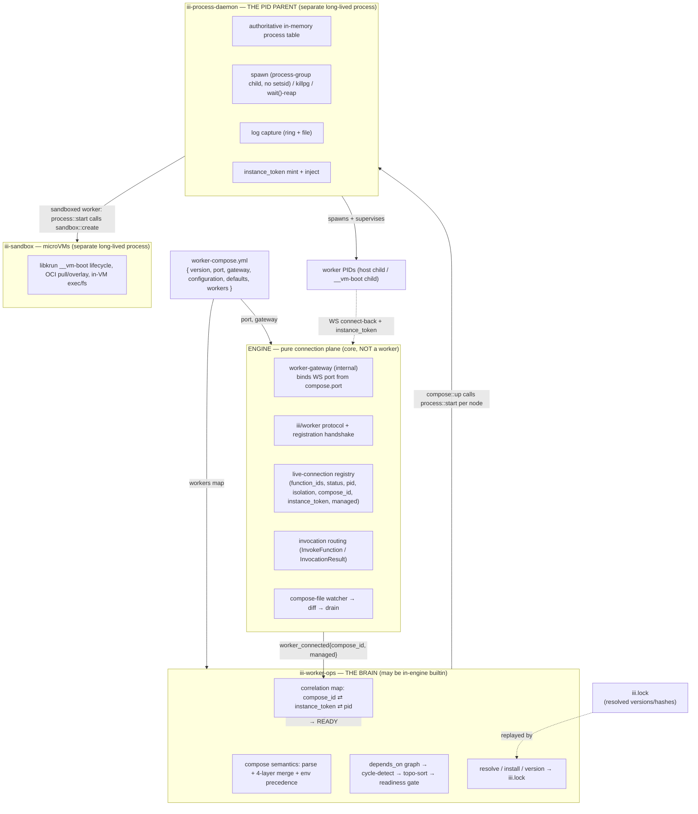

# Engine & the Baked-In WS Gateway

This file specifies the **engine** in the overhauled architecture: how it boots from `worker-compose.yml`, how the WebSocket listener (the **`worker-gateway`**) becomes a first-class engine concept instead of a worker, and how the iii/worker registration protocol carries the correlation metadata that joins a process's identity to its connection's identity. The thesis is narrow and load-bearing: **the engine becomes a pure connection plane** — it binds the port, runs the protocol, holds the live-connection registry, and routes invocations. It never spawns a process, never resolves a version, never reads a worker script, never owns a PID, and **never authenticates or authorizes a caller** (access control is an out-of-process concern — see [§7](#7-access-control-lives-outside-the-engine)).

The single most important new section here is [§8 The Hot-Reload Drain Protocol](#8-the-hot-reload-drain-protocol) — without it, every config edit silently drops in-flight requests.

Cross-links: process ownership and reaping live in [process-daemon.md](process-daemon.md); compose semantics, topo-sort, and the `compose::*`/`worker::*` functions live in [cli-and-functions.md](cli-and-functions.md); the compose file schema is in [worker-compose.md](worker-compose.md); the boot-read-off-disk bootstrap floor and the `configuration` store are in [configuration-and-bootstrap.md](configuration-and-bootstrap.md); phasing and the cloud cutover are in [migration.md](migration.md).

---

## 1. The core insight: re-wiring, not a rewrite

Three pieces of machinery already exist in-engine and are sound. **Only their owner and config source change — the wire protocol changes by zero bytes.**

| Existing machinery | Where it lives today | What changes |
|---|---|---|
| The WS listener (binds `host:port`, serves the axum router for `/`, `/otel`, `/ws/channels/{id}`) | `WorkerManager::start_background_tasks`, `engine/src/workers/worker/mod.rs:121-131` | **Promoted** from a `Worker::start_background_tasks` impl gated on a config entry to engine startup code invoked directly from `serve`, keyed off compose `port`. Logic stays verbatim. |
| The iii/worker protocol handler (registration handshake → register connection → `WorkerRegistered` → fire triggers → read loop) | `Engine::handle_worker`, `engine/src/engine/mod.rs:1429`; `WorkerRegistered` send + `worker_connected` fire at `engine/mod.rs:1486-1499` | **Unchanged** in its registration mechanics; the auth branch is deleted (see [§7](#7-access-control-lives-outside-the-engine)). Still owned by the engine. |
| The `Message` enum (`RegisterFunction`, `RegisterTrigger`, `InvokeFunction`, `InvocationResult`, `Ping/Pong`, `WorkerRegistered`, …) | `engine/src/protocol.rs:40-126`, `#[serde(tag="type")]` | **Zero changes.** No new variants. Correlation rides the existing `engine::workers::register` metadata call (see [§5](#5-the-unified-registration-protocol)). |

The listener was wrapped in a "worker" (`iii-worker-manager`) only by historical accident; investigation track 04 confirms it manages nothing — it is a WS protocol endpoint. So the design is a re-homing exercise: **promote the listener to engine startup input keyed off compose `port`; keep the protocol exactly as-is; add three additive metadata fields so the engine can tell a daemon-managed connection from an independent one.**

> **One terminology note that this whole spec depends on:** the in-engine listener concept is now called **`worker-gateway`**. It is an *internal engine concept*, **not a worker**. There is no `iii-worker-manager` worker, no `worker-gateway` worker, and no config entry for either. (The previously-misnamed `iii-worker-manager` worker is deleted; its config block is deleted.)

---

## 2. The responsibility split

Per the shared decision contract (Critique 01 §A1) and the binary-topology decision: **the process-daemon and the sandbox-daemon are SEPARATE long-lived processes** of the one `iii` binary (via hidden subcommands `iii __process-daemon` / `iii __sandbox-daemon`) — they MUST outlive an engine hot-reload. **`iii-worker-ops` MAY be an in-engine builtin.** This corrects Design E §6.1, which wrongly made the daemons in-engine.



**One-line charter per plane** (the full canonical RESPONSIBILITY MAP lives in [README.md](README.md); this is the engine-relevant slice):

| Plane | Owns | NEVER does |
|---|---|---|
| **Engine** (core) | WS port (binds from `compose.port`), iii/worker protocol, registration handshake, live-connection registry, invocation routing, compose-file watcher, fires `worker_connected`/`worker_disconnected` | spawn a process; resolve versions; read worker scripts; own a PID; authenticate or authorize a caller (access control → `rbac-proxy` worker, [§7](#7-access-control-lives-outside-the-engine)) |
| **`iii-worker-ops`** | compose semantics, depends_on topo-sort + readiness gate, resolve/install/version, `iii.lock`, the correlation map, reconcile desired↔actual | hold a Child handle; bind a socket; spawn a PID |
| **`iii-process-daemon`** | being the direct parent of every host PID, the process table, spawn/killpg/wait()-reap, log capture, `instance_token` mint+inject, crash recovery | decide WHAT to run; resolve versions; speak the compose graph |
| **`iii-sandbox`** | microVM lifecycle, OCI image pull/catalog/overlay, in-VM exec/fs | be the process parent of host workers |

**The port and the processes are two different resources owned by two different planes**, joined by a WS connect-back plus a per-spawn `instance_token`. This is what cleanly resolves "iii hosts the port" vs "the daemon owns processes": the engine owns the *connection* identity; the daemon owns the *process* identity; `iii-worker-ops` correlates the two.

---

## 3. Boot sequence

The engine boots from `worker-compose.yml`. There is no `config.yaml` in the steady state (it coexists behind a format-detection bridge for ≥3 releases — see [migration.md](migration.md)). Boot is ordered; readiness of the bootstrap floor (`configuration`, the daemons, `iii-worker-ops`) gates everything else.

```mermaid
sequenceDiagram
  participant CLI as iii up (CLI)
  participant ENG as Engine
  participant CFG as configuration (store)
  participant WO as iii-worker-ops
  participant PD as iii-process-daemon
  participant W as worker PIDs

  CLI->>ENG: ensure engine running (cold start: boot iii)
  Note over ENG: 1. parse worker-compose.yml (port, gateway, configuration, workers)
  Note over ENG: 2. worker-gateway.bind(compose.port)  [replaces config.rs:672-679 scan]
  Note over ENG: 3. boot-read restart-tier config OFF DISK<br/>(bootstrap floor — see configuration-and-bootstrap.md)
  ENG->>CFG: 4. start configuration store (mandatory)
  ENG->>WO: 5. start iii-worker-ops (may be in-engine builtin)
  ENG->>PD: ensure iii-process-daemon (separate process) is up
  CLI->>WO: compose::up{} (streaming)
  Note over WO: 6. topo-sort workers (depends_on) → for each node:
  WO->>PD: process::start{compose_id, runtime, env(+IIIWORKER_PORT), ...}
  PD->>W: spawn grouped child, inject III_INSTANCE_TOKEN/III_COMPOSE_ID
  W->>ENG: 7. WS connect-back → registration handshake → register fns/triggers
  W->>CFG: register own config (configuration::register) + fetch (configuration::get) + register hot-reload trigger
  ENG-->>WO: worker_connected{compose_id, instance_token, managed}
  WO->>PD: verify token vs process::list → mark READY
  Note over WO: 8. gate next topo level on readiness; repeat
  ENG->>ENG: 9. watch compose file + configuration store for changes
```

Numbered, with who-does-what:

1. **Engine parses `worker-compose.yml`** — reads top-level `port`, `gateway`, `configuration`, `defaults`, `workers`. (The engine only consumes `port` + `gateway` itself; the `workers` map is consumed by `iii-worker-ops`.)
2. **`worker-gateway` binds the WS port natively** from `compose.port`. This replaces the "find the first `iii-worker-manager` entry to learn the port" dance at `config.rs:672-679`; see the KEEP/MOVE/DELETE table in [§4](#4-keepmovedelete-the-engine-side).
3. **Boot-read the restart-tier config off disk.** A small irreducible floor must be read directly off disk before the store is live (the bootstrap chicken-and-egg). Detail in [configuration-and-bootstrap.md](configuration-and-bootstrap.md).
4. **Start the `configuration` store** (mandatory; the universal hidden dependency — Critique 02 #6). The store is empty of per-worker entries at this point; nothing is seeded from compose — each worker populates its own entry at boot (step 6) via `configuration::register`.
5. **Start `iii-worker-ops`** and ensure `iii-process-daemon` (and `iii-sandbox` if needed) are up as separate processes.
6. **`compose::up` (in `iii-worker-ops`, streaming) topo-sorts the worker set** and, per node, calls `process::start` on the daemon. (Graph orchestration is in `iii-worker-ops`, never in the engine or the daemon — see [cli-and-functions.md](cli-and-functions.md).)
7. **Each spawned worker connects back** to the gateway port, completes the registration handshake, and registers its functions/triggers; at boot the worker registers its OWN config schema + initial value with `configuration::register(id, schema, initial_value)`, then reads via `configuration::get` and registers a hot-reload trigger off the configuration store.
8. **Readiness gates the next topo level** via `status::watch_until_ready` (default `depends_on` condition = READY, not merely started).
9. **The engine watches** the compose file and the configuration store for changes, diffing and draining (see [§8](#8-the-hot-reload-drain-protocol)).

> **Bootstrap-floor implicit roots** (Critique 02 #6/#12): `configuration`, `iii-process-daemon`, and `iii-worker-ops` are implicit roots of *every* dependency graph, made ready before step 6. A user worker may legally `depends_on: [configuration]`; it validates OK and is a no-op gate (they are always ready first). If `configuration` never readies, `up` hard-fails — it is the floor.

---

## 4. KEEP / MOVE / DELETE (the engine side)

### 4.1 `engine/src/workers/worker/` (the deleted `iii-worker-manager` builtin)

| Item | Verdict | Detail |
|---|---|---|
| WS listener `WorkerManager::start_background_tasks` (`worker/mod.rs:121-131`) | **KEEP, promote** | Logic stays verbatim. Stops being a `Worker::start_background_tasks` impl; becomes engine startup code invoked from `serve` with `port` from compose. |
| `register_worker!("iii-worker-manager", WorkerManager, mandatory)` (`worker/mod.rs:260`) | **DELETE the registration** | No longer a worker. The port is engine infra (`worker-gateway`), not a worker. |
| `WorkerManagerConfig { port, host, middleware_function_id, rbac }` (`worker/mod.rs:52-62`) | **MOVE `host` → `GatewayConfig`; DROP `rbac` + `middleware_function_id`** | `port` is sourced from compose top-level; `host` from the compose `gateway:` block. **`rbac` and `middleware_function_id` are deleted from the engine entirely** — engine-native access control is removed; auth, middleware, and registration hooks now live in the out-of-process `rbac-proxy` worker (see [§7](#7-access-control-lives-outside-the-engine)). Top-level keeps only `port` as the marquee scalar; `gateway:` now carries only `host` — see [worker-compose.md](worker-compose.md). |
| The port-resolution scan (`config.rs:672-679`) | **DELETE the scan, KEEP the setter** | Replace the entry-scan + `serde_json::from_value::<WorkerManagerConfig>` dance with `engine.set_listener_port(compose.port.unwrap_or(DEFAULT_PORT))`. `DEFAULT_PORT = 49134` (`worker/mod.rs:36`) stays the default. |
| `ws_handler` / `otel_ws_handler` / channel routes (`worker/mod.rs:216-258`) | **KEEP** | Mounted by engine startup instead of by the worker. |
| Auth / RBAC (`rbac_session.rs` auth branch, `rbac_config.rs`, `is_function_allowed`) | **DELETE** | The authentication, gating, `expose_functions`, allowed/forbidden lists, registration hooks, and middleware are removed from the engine; only the open registration path of `handle_session` survives. Access control moves to the `rbac-proxy` worker. See [§7](#7-access-control-lives-outside-the-engine). |
| `Message` protocol (`protocol.rs:40-126`) | **KEEP unchanged** | Zero changes. |
| `iii.worker.yaml` for `iii-worker-manager` | **DELETE** | The worker it described no longer exists. |

### 4.2 Engine spawn-path deletions (the zombie sources, engine side)

The engine's `create_worker` resolution chain (`config.rs:306-369`) loses the two paths that call `cmd.spawn` / shell out:

| Path | Location | Verdict |
|---|---|---|
| **Path E** — `ExternalWorkerProcess::spawn("iii-worker start …")` + pidfile polling (`probe_pidfile_alive`, `SPAWN_GRACE`) | `registry_worker.rs` (header: *"Spawns non-built-in workers via `iii-worker start`"*) | **DELETE** — the engine never shells out to start workers. `iii-worker-ops` asks `iii-process-daemon` instead. This kills the dead-middle-child zombie. |
| **create_worker step 3** (legacy external `cmd.spawn`) | `config.rs:340-352` | **DELETE** — moves into the daemon (see [process-daemon.md](process-daemon.md)). |
| **create_worker step 4** (`iii-worker start` delegation, passing `engine.worker_manager_port()`) | `config.rs:354-369` | **DELETE** — superseded by `process::start`. |

**Net engine-side result:** after this, the engine builds **only** built-in workers in-process via `register_functions`; everything else is a WS connection it merely accepts. **The engine never calls `cmd.spawn`.** This is the single biggest structural simplification.

> The `ensure_builtin_daemons()` PATH-probe that force-injects `iii-worker-ops` when its binary is on PATH (`config.rs:131-155`) also goes away — the daemons are launched deterministically as separate processes of the `iii` binary, not auto-injected from PATH. The pidfile machinery, the `ps`/`/proc` discovery heuristics, and the detached spawn paths A/B/C/D are deleted/moved as described in [process-daemon.md](process-daemon.md).

---

## 5. The unified registration protocol

Three worker kinds, **one wire protocol**, **no `Message` enum changes**. What we add is a single additive correlation handshake so all three land in the same registry with a stable `compose_id`, and so the engine can tell a daemon-managed (controllable) connection from an independent (observe-only) one.

### 5.1 The three kinds

| Kind | Spawned by | Connects how | Engine can control lifecycle? |
|---|---|---|---|
| **(a) built-in / in-engine** | — (in-process) | No WS — `register_functions` at build (`config.rs:681-713`) | n/a (in-process) |
| **(b) daemon-managed** (local binary, sandbox VM, ex-`iii-exec`) | `iii-process-daemon` | child env carries `IIIWORKER_PORT` + `III_COMPOSE_ID` + `III_INSTANCE_TOKEN`; WS connect → register | **Yes** — daemon owns the PID; `iii-worker-ops` can stop/restart |
| **(c) independent** | a developer (separate terminal, `npm run dev`, raw binary) | WS connect with no `instance_token` (or an unrecognized one) | **No** — observe-only. `ps` shows it; `stop`/`restart` returns "not managed by this compose". `process::attach` is the opt-in best-effort escape hatch. |

The kind-(c) gap (the engine cannot control independently-started workers) is **now explicit and verifiable, not accidental**. Note also: independent workers were never an iii-zombie source — their actual parent (the user's shell, or init) reaps them; the iii zombies came only from iii's own detached spawns, which the daemon now owns (Critique 02 #7).

### 5.2 The correlation handshake (additive, no new message types)

The registration mechanics are unchanged (only the auth branch is gone — [§7](#7-access-control-lives-outside-the-engine)): the connection registers via the open path of `rbac_session::handle_session` → build `WorkerConnection` → register in `worker_registry` → engine sends `Message::WorkerRegistered { worker_id }` (`engine/mod.rs:1486-1492`) → fire `worker_connected` triggers (`engine/mod.rs:1494-1499`). We thread one `instance_token` through it by **extending the existing `engine::workers::register` metadata call** (which already sets runtime/version/name/os/pid/isolation via `WorkerConnectionRegistry::update_worker_metadata`).

```mermaid
sequenceDiagram
  participant PD as iii-process-daemon
  participant W as worker process (SDK)
  participant ENG as Engine
  participant WO as iii-worker-ops

  rect rgb(235,245,255)
  Note over PD,W: (b) DAEMON-MANAGED
  PD->>W: spawn with env IIIWORKER_PORT, III_COMPOSE_ID, III_INSTANCE_TOKEN
  W->>ENG: WS connect → registration handshake (UNCHANGED)
  ENG->>W: WorkerRegistered{ worker_id }
  W->>ENG: engine::workers::register{ compose_id, instance_token, managed:true, pid, isolation, runtime }
  ENG->>ENG: store compose_id / instance_token / managed on WorkerConnection
  W->>ENG: RegisterFunction / RegisterTrigger / RegisterTriggerType
  ENG->>WO: fire worker_connected{ compose_id, managed:true }
  WO->>PD: verify (compose_id, instance_token) against process::list tokens
  WO->>WO: verified → mark instance READY (WS conn ⇄ daemon PID joined)
  end

  rect rgb(255,245,235)
  Note over W,ENG: (c) INDEPENDENT
  W->>ENG: WS connect → registration handshake (no token)
  ENG->>W: WorkerRegistered{ worker_id }
  W->>ENG: engine::workers::register{ managed:false } (or no token)
  ENG->>WO: fire worker_connected{ managed:false }
  WO->>WO: record as INDEPENDENT (visible in ps; stop/restart → "not managed")
  end
```

**The only schema change** is additive fields on the existing `engine::workers::register` metadata call: `compose_id: Option<String>`, `instance_token: Option<String>`, `managed: bool` (default `false`). The `Message` enum (`protocol.rs:40-126`) is untouched. `WorkerConnection` gains `compose_id` / `instance_token` / `managed` fields.

**Trade-off (accepted):** because correlation rides a metadata call rather than the handshake frame, there is a brief window where a connection is registered but not yet correlated. `iii-worker-ops` gates readiness on correlation anyway, and the window is the same as today's metadata-update window.

### 5.3 `instance_token` as a verifiable control boundary

The daemon spawns the process *and* knows the `compose_id`. If we correlated on `compose_id` alone, an independent worker could spoof a managed id. The `instance_token` is a **per-spawn UUID the daemon mints and hands only to the child it parents**; `iii-worker-ops` matches `(compose_id, instance_token)` against the daemon's `process::list` (which returns the same tokens). A connection presenting a token the daemon does not recognize is downgraded to **independent**.

This makes "managed vs independent" a **verifiable property, not a guess** — it replaces the entire `ps`/`/proc` cmdline heuristic with a cryptographic-strength match. The boundary is a **lifecycle-control** one: only a connection presenting a daemon-minted token can be `stop`/`restart`ed as a managed instance (§5.1), and the registration-collision rule (an untokened connection cannot claim a managed `compose_id`) rides on it. It is **not** a function-call authorization signal — the engine performs no authorization (see [§7](#7-access-control-lives-outside-the-engine)).

> **Idempotence / re-`up` (Critique 02 #3):** because the token is per-spawn, a second `compose::up` must check existence by `compose_id` against the daemon's process table *before* minting a new token. An instance found RUNNING with a stale token is **re-adopted, not respawned**. The pre-spawn existence check and partial-up reconcile live in `iii-worker-ops` `compose::up` — see [cli-and-functions.md](cli-and-functions.md). The engine's only role is reporting connection state.

### 5.4 Built-in workers (kind a)

Built-ins never touch the socket; `register_functions` puts them in the engine registry in-process at build (`config.rs:681-713`). They appear in `compose ps` / `worker list` with `kind: builtin`, no PID of their own. `iii-worker-ops` (if in-engine) is itself a kind-(a) builtin; `iii-process-daemon` and `iii-sandbox` are kind-(b)-shaped from the engine's view (separate processes that connect over WS) but are bootstrap-floor, started before any user worker.

---

## 6. End-to-end: `compose up` (who opens the socket / who spawns / who connects)

`iii up` and `iii worker compose up` are thin CLI wrappers over the `compose::up` function (streaming). Below is the full path with the two start conditions made explicit.

### 6.1 Cold start (engine not running)

```
STEP 0   CLI `iii up` finds no engine on compose.port.
STEP 0a  CLI starts the engine binary `iii` (foreground, or via launchd/systemd unit).
         ENGINE boot (see §3): parse compose → worker-gateway.bind(port) → boot-read
         restart-tier config → start configuration + iii-worker-ops (+ ensure daemons up).
         ENGINE is READY: port open, builtins live, NO user workers yet.
         ENGINE does NOT spawn any external worker (create_worker steps 3&4 deleted).
```

### 6.2 Connected path (engine already running)

```
STEP 0   CLI `iii up` connects to the engine WS and invokes compose::up{}.
STEP 1   compose::up runs IN iii-worker-ops: parse workers: map → 4-layer merge
         (manifest ← compose ← env_file[later-wins] ← process env) → depends_on graph
         → cycle-detect → topo-sort.                          [see cli-and-functions.md]
         (The merge governs runtime/scripts/env/depends_on/healthcheck only;
          configuration is NOT a merged field — it lives in the configuration worker.)
STEP 2   Per node (topo order) iii-worker-ops RESOLVES the worker (does NOT spawn):
         workspace → local presence-lock; package → registry resolve + iii.lock;
         download/verify (sha256) if missing. (Config is NOT resolved here — each
         worker registers its own config at boot via configuration::register.)
STEP 3   iii-worker-ops invokes process::start{ compose_id, runtime, scripts, env
         (incl. IIIWORKER_PORT), isolation } on the daemon → returns
         { instance_token, pid, status: starting }.
STEP 4   iii-process-daemon spawns the child as its OWN grouped child (no setsid):
         mints instance_token; injects IIIWORKER_PORT/III_COMPOSE_ID/III_INSTANCE_TOKEN;
         records in process table; captures stdout/stderr; wait()-reaps automatically.
         (Sandboxed worker → process::start calls sandbox::create first, then the
          daemon parents the resulting __vm-boot PID.)        [see process-daemon.md]
STEP 5   The worker boots and CONNECTS BACK to the gateway port:
         SDK reads IIIWORKER_PORT → WS connect → registration handshake → ENGINE builds
         WorkerConnection, sends WorkerRegistered{worker_id} → SDK calls
         engine::workers::register{ compose_id, instance_token, managed:true, ... }
         → ENGINE stores correlation fields → SDK RegisterFunction/RegisterTrigger
         → ENGINE fires worker_connected{ compose_id, managed:true }.
STEP 6   CORRELATION: iii-worker-ops' worker_connected handler matches
         (compose_id, instance_token) against daemon process::list tokens → verified →
         mark READY (WS conn ⇄ daemon PID joined). Gate depends_on via
         status::watch_until_ready. Unmatched/absent token → INDEPENDENT (observe-only).
STEP 7   iii-worker-ops proceeds to the next topo level once deps are READY; when all
         are READY (or a failure policy trips), compose::up emits final ComposeEvent.
STEP 8   `iii up` (foreground) attaches as a log-streaming client and installs a
         SIGINT→compose::down handler. The daemon is ALWAYS detached: kill -9 of the
         `iii up` CLI leaves workers RUNNING. `-d` = no attach + no SIGINT handler.
```

**Who-does-what summary** (engine column only is in scope here; full table in [cli-and-functions.md](cli-and-functions.md)):

| Action | Engine | iii-worker-ops | iii-process-daemon |
|---|---|---|---|
| Open WS port (`worker-gateway`) | ✅ from `compose.port` | | |
| Parse / merge / topo-sort | | ✅ | |
| Resolve version / lockfile | | ✅ | |
| Spawn the OS process | | | ✅ (parent) |
| Inject `IIIWORKER_PORT` + `instance_token` | | | ✅ |
| Accept WS connect + register | ✅ | | |
| Store `compose_id`/token/`managed` on conn | ✅ | | |
| Correlate WS conn ⇄ PID | | ✅ (token match) | |
| Fire `worker_connected`/`worker_disconnected` | ✅ | | |

---

## 7. RBAC carry-over

RBAC is bound to the WS listener today (`WorkerManagerConfig.rbac`, per-listener). Carry-over:

1. **Re-home the config.** `RbacConfig { auth_function_id?, expose_functions[], on_*_registration_function_id? }` moves from the deleted `iii-worker-manager` worker config into the compose **`gateway:`** block (alongside `host` and `middleware_function_id`; `port` stays the top-level marquee scalar):

   ```yaml
   port: 49134
   gateway:
     host: 0.0.0.0
     rbac:
       auth_function_id: auth::ws_gate          # optional; absent ⇒ open session (dev default)
       expose_functions: ["math::*"]
       on_function_registration_function_id: audit::on_register   # optional
     middleware_function_id: mw::trace          # optional
   workers: { ... }
   ```

   It feeds the same `Session::authenticate` path (`rbac_session.rs:67`) unchanged. No `auth_function_id` ⇒ open session, everything allowed (`rbac_session.rs:78-86`) — the dev default.

2. **Preserve `INFRASTRUCTURE_FUNCTIONS`.** The always-allow carve-out (`engine::channels::create`, `engine::workers::register`, `engine::log::*`, `engine::baggage::*`) is a **documented public, additive-only contract** (`rbac_config.rs:240-251`, and the doc-comment at `:233-239` mandating additive-only within a major). The extended fields on `engine::workers::register` are additive on a function *already* in the carve-out, so the correlation handshake works even under a restrictive `auth_function_id` with no contract change. `process::*` / `compose::*` should be infra-callable only from connections that present a valid `instance_token` or are themselves builtins.

3. **Token-as-authz-signal.** Because `instance_token` is unforgeable per-spawn, the engine can grant daemon-managed workers a broader policy than independent connections — e.g. independent workers may register functions only under a namespace prefix (reuse `function_registration_prefix` from `AuthResult`, `rbac_session.rs:45`). This makes managed/independent a **security boundary**, not just a UI label.

4. **No change to per-call decisions.** `is_function_allowed` (`rbac_config.rs:253-289`) stays exactly as-is: forbidden wins → allowed list → `INFRASTRUCTURE_FUNCTIONS` → `expose_functions` filters → deny.

---

## 8. The hot-reload drain protocol

**This is the single most important new section in this file.** It closes the day-1 data-loss bug.

### 8.1 The bug

When a worker's PID dies, the engine sees `worker_disconnected` and **halts every in-flight invocation of that worker**:

```rust
// engine/src/engine/mod.rs:1700-1706  (cleanup_worker, on disconnect)
let worker_invocations = worker.invocations.read().await;
for invocation_id in worker_invocations.iter() {
    self.invocations.halt_invocation(invocation_id);   // caller gets {code:"invocation_stopped"}
}
```

So the naive "edit-save → reap old PID → re-exec start" reload IS request loss: every caller awaiting a `oneshot` from that worker gets `invocation_stopped`. None of the source designs mentioned draining. This is the most likely day-1 complaint (Critique 02 #1).

### 8.2 The drain (single-instance, default)

A worker replacement (config change, version bump, or removal) MUST drain before its PID is killed. The drain is orchestrated by `iii-worker-ops` on reconcile; the engine provides the routing-quiesce and the in-flight count.

```mermaid
sequenceDiagram
  participant WO as iii-worker-ops (reconcile)
  participant ENG as Engine (routing + registry)
  participant PD as iii-process-daemon
  participant W as old worker PID

  WO->>ENG: quiesce(worker_id)  — stop routing NEW invokes to this instance
  Note over ENG: new InvokeFunction for this fn → queue or route to a sibling;<br/>no new oneshots created against W
  loop until in-flight == 0 OR drain_timeout
    ENG-->>WO: in_flight_count(worker_id)
  end
  alt in-flight drained in time
    WO->>PD: process::stop{ compose_id, signal: SIGTERM }
    PD->>W: SIGTERM → grace → SIGKILL (group) → wait()-reap
  else drain_timeout expired
    Note over ENG: FORCE-HALT remaining in-flight (existing halt_invocation path);<br/>callers get invocation_stopped — bounded, logged, surfaced in compose::up event
    WO->>PD: process::stop{ compose_id, signal: SIGTERM }
  end
  W-->>ENG: WS disconnect → worker_disconnected (now drained / force-halted)
```

Steps:

1. **Quiesce routing.** `iii-worker-ops` tells the engine to stop routing **new** `InvokeFunction`s to the doomed instance. New calls for that function either route to a sibling instance (if `assign_instance_ids` produced more than one) or queue/error per policy. No new `oneshot`s are created against the old PID.
2. **Wait, bounded, for in-flight to resolve.** The engine reports the in-flight count; `iii-worker-ops` waits until it reaches zero or `drain_timeout` expires.
3. **Then SIGTERM** via `process::stop` (daemon executes SIGTERM → grace → SIGKILL on the group, then `wait()`-reaps — see [process-daemon.md](process-daemon.md)).
4. **On timeout expiry: force-halt.** The remaining in-flight invocations are halted via the existing `halt_invocation` path (callers get `invocation_stopped`). This is bounded, logged, and surfaced as a `ComposeEvent` so the operator sees "drained N, force-halted M" rather than silent loss.

**`drain_timeout` default:** `30s` (matching the existing `SPAWN_GRACE` ergonomics from `registry_worker.rs`), overridable per worker in the compose block. See the Open questions below.

### 8.3 Blue/green (future, stateless workers)

For stateless workers, a stronger option is blue/green: **start the new instance, wait for it READY, cut routing over to it, then drain+reap the old.** Zero dropped requests, at the cost of running two instances briefly. This requires routing to address instances individually (the `instance_token` already gives a stable per-instance key) and a worker-level `strategy: blue_green | drain` flag. **Recommended as a Phase-N follow-up, not in the first cut** — the drain protocol above is the floor.

### 8.4 Why today's reload is NOT "kills everything" (honest framing)

Today's reload **already diffs**: `diff_entries` (`reload.rs:84`), `promote_dead_unchanged` (`reload.rs:161`), `commit` (`reload.rs:224`) restart only *changed* workers, and it refuses to remove mandatory workers (`reload.rs:198-209`). So the design's motivation must NOT be the strawman "reload kills all workers." The real justifications for decoupling the daemon from the engine are:

1. **A single PID owner** — one parent for every host process makes orphans/zombies impossible by construction.
2. **The daemon outlives a full engine crash/restart** — workers keep running across an engine restart; they re-connect and re-correlate (see [§9](#9-engine-restart-recovery)). An in-engine daemon would die with the engine and re-parent every worker to init on every restart.

What today's diff does NOT do is **drain** — that is the genuinely new contract above.

---

## 9. Remove-worker-mid-flight & engine-restart recovery

### 9.1 Removing a worker that has in-flight work (Critique 02 #15)

Reconcile-on-edit (the compose-file watcher fires a diff) stops a removed worker through **the same drain path as §8** — quiesce → bounded wait → SIGTERM via `process::stop`. Additionally:

- **Removing a worker that others still `depends_on`** (a live dependency target) → **error or cascade-warn** (decision: error by default; `--cascade` to also stop dependents). The engine surfaces the orphaned-dependents set; `iii-worker-ops` enforces the policy.
- The removed worker's `configuration` entry is *not* auto-deleted (config is durable; deletion is a separate explicit `configuration::*` action).

### 9.2 Engine restart loses the correlation map (Critique 02 #8)

If `iii-worker-ops` is in-engine, its correlation map (`compose_id ⇄ instance_token ⇄ pid`) dies with the engine. The daemon (separate process) still holds the tokens; the reconnecting workers still hold `III_INSTANCE_TOKEN` in their env. So re-correlation is possible **only if `iii-worker-ops` rebuilds its map from the daemon on every engine boot.** This MUST be a defined boot step:

```
ENGINE RESTART (daemon + workers survive):
  1. Engine re-binds worker-gateway on compose.port.
  2. iii-worker-ops boots → pulls process::list (WITH tokens) from the daemon →
     seeds an EXPECTED correlation set { compose_id → instance_token → pid }.
  3. Surviving workers' SDK reconnect loops re-open WS → RBAC → re-send
     engine::workers::register{ compose_id, instance_token, managed:true }.
  4. iii-worker-ops matches each reconnect against its EXPECTED set → re-correlates.
  5. No re-spawn (the PIDs never died); no double trees.
```

**Ordering rule:** a worker that reconnects **before** `iii-worker-ops` finishes rebuilding (steps 2–3 race) is treated as **independent until correlated** — its functions register and route normally, but `stop`/`restart` is refused until the token is matched against the rebuilt expected set. Once `iii-worker-ops` has the daemon's `process::list`, it retroactively promotes the connection to managed. This avoids the dangerous case of accidentally treating a managed worker as un-stoppable, or worse, respawning a worker that is already running.

---

## 10. Open questions

1. **`drain_timeout` default and per-worker override.** Recommended default **30s** (consistent with `registry_worker.rs::SPAWN_GRACE`). Should there be a global `gateway.drain_timeout` plus a per-worker override, and should `0` mean "force-halt immediately" (today's behavior) vs "wait forever"? **Recommended:** global default 30s, per-worker override, `0` = immediate force-halt; no infinite wait.
2. **Multi-engine / multi-project on one machine** (Critique 02 #5/#16). The daemon and `instance_token` model assume `compose_id` is unique, but two projects can both have a worker named `math`. The engine binds one port per project; the **daemon must namespace its table by `(port_or_project_root, compose_id)`** so a `down` in one project cannot reap another's PID. This is primarily a daemon-state-key question (see [process-daemon.md](process-daemon.md)) but it touches engine correlation (the engine's `compose_id` field alone is not globally unique). **Recommended:** the engine threads the listener port (or project root) alongside `compose_id` in `engine::workers::register`, making the correlation key `(port, compose_id, instance_token)`. The lead author (README.md) must confirm this with the daemon spec.
3. **Function-registration collision when an independent worker claims a managed `compose_id`** (Critique 02 #7). Token-gating controls *lifecycle* but not *function registration* — two connections can both register `math::add`. **Recommended default:** reject the second registration of an already-registered `function_id` from a different connection (last-writer-loses), with a clear `function_already_registered` error; revisit namespacing later. Needs a decision the lead must record.

---

## See also

- [worker-compose.md](worker-compose.md) — the `port` / `gateway:` / `configuration:` / `workers:` schema this engine reads.
- [process-daemon.md](process-daemon.md) — PID ownership, `process::*`, the `instance_token` mint, crash recovery, the daemon-state namespacing for the multi-project case.
- [cli-and-functions.md](cli-and-functions.md) — `compose::up` (streaming) topo-sort/readiness orchestration that calls `process::start`, and the pre-spawn idempotence check.
- [configuration-and-bootstrap.md](configuration-and-bootstrap.md) — the boot-read-off-disk floor (step 3) and the `configuration` store (step 4).
- [migration.md](migration.md) — the dual-parser bridge, the cloud cutover, and the bake-in phase that deletes `iii-worker-manager`.
