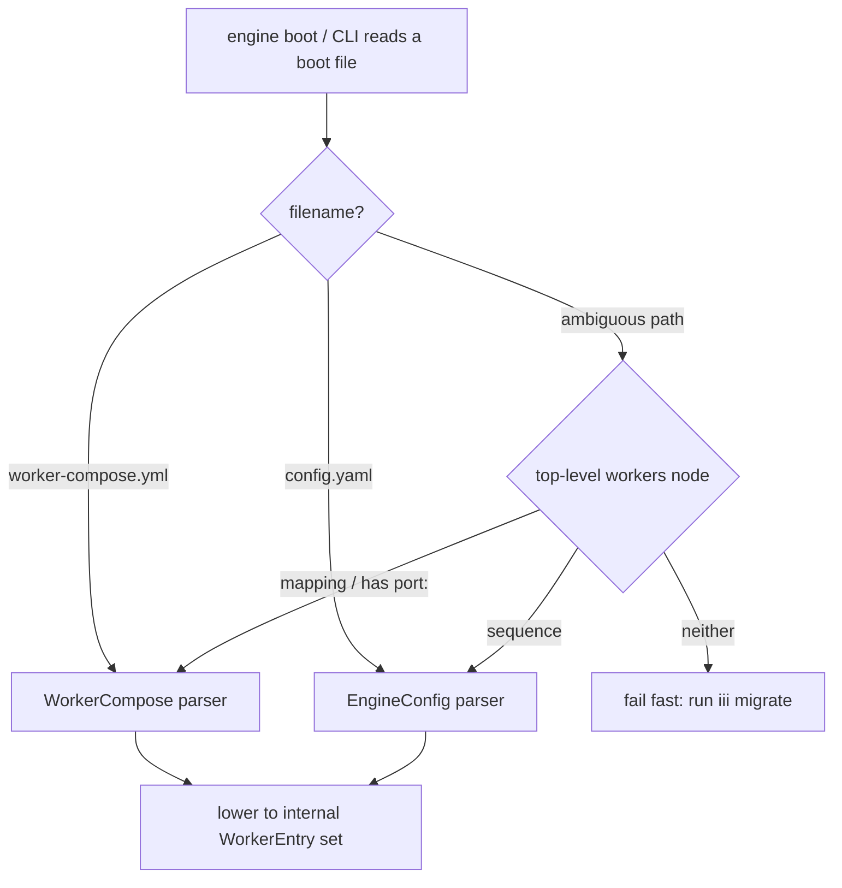
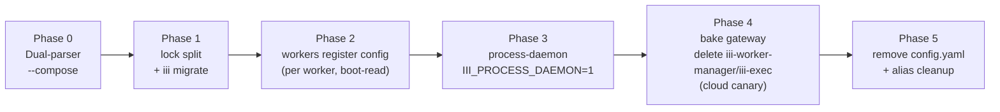

# Migration, Phasing & Cloud Cutover

How the developer-experience overhaul ships without breaking production. The end-state described
across the sibling specs ([worker-compose.md](worker-compose.md), [engine-and-gateway.md](engine-and-gateway.md),
[process-daemon.md](process-daemon.md), [cli-and-functions.md](cli-and-functions.md),
[configuration-and-bootstrap.md](configuration-and-bootstrap.md)) is a *destination*, not a *rollout*.
This file is the rollout: a six-phase sequence with per-phase flags and entry/exit gates, the
back-compat windows that keep shipped consumers alive, the test blast radius, and — the highest-stakes
surface — the cloud cutover. The governing constraint is one sentence: **`config.yaml` cannot die in
one step, because production runs on it today.**

---

## 1. The lead reality: production runs `config.yaml`

The whole migration is gated by a single deployed artifact. The registry API — iii's own cloud
backend — boots like this:

```dockerfile
# registry/api/Dockerfile:24
CMD ["iii", "--config", "iii-config-production.yaml"]
```

And `registry/api/iii-config-production.yaml` uses **every primitive this overhaul deletes**:

```yaml
# registry/api/iii-config-production.yaml (verified verbatim — LEGACY INPUT to `iii migrate`)
workers:
  - name: iii-worker-manager        # → baked into the engine (worker-gateway); entry DELETED
    config: { port: 49134 }
  - name: iii-http                  # → these config values disappear from any file; iii-http
    config: { port: 3111, host: 0.0.0.0, cors: { allowed_origins: ["${CORS_ALLOWED_ORIGINS:*}"] } }
  - name: iii-exec                  # → DELETED engine builtin; becomes a compose worker scripts.start
    config:
      exec:
        - bun run --enable-source-maps dist/index-production.js   # this launches the API itself
  - name: iii-observability         # → config disappears from any file; iii-observability
    config: { enabled: ${OTEL_ENABLED:true}, ... }
```

The `config:` blocks above are the **legacy input shape only**. They do not survive the migration:
there is no `config:` in `iii.worker.yaml` and none in `worker-compose.yml`. Per-worker configuration
is owned end-to-end by the `configuration` worker — each worker registers its own schema + initial
value at boot via `configuration::register(id, schema, initial_value)` from its own code/SDK
([configuration-and-bootstrap.md](configuration-and-bootstrap.md)).

The load-bearing line is `iii-exec`: in production it is the launcher for the registry API server
itself (`bun run … dist/index-production.js`; the dev variant `registry/api/iii-config.yaml` runs
`pnpm dev`). If `iii-exec` is deleted from the engine ([cli-and-functions.md](cli-and-functions.md))
*before* the `iii-process-daemon` exists and is trusted, **the registry's own backend stops
launching.** Likewise, if `--config config.yaml` support is dropped before the Dockerfile flips, a
version-skewed deploy is an outage.

**Decision: `config.yaml` and `worker-compose.yml` COEXIST for ≥3 releases.** The reader keeps
accepting `--config <legacy>.yaml` through Phase 4. The cloud config is the *last* thing to migrate,
behind a staging canary, never the first.

---

## 2. The format-detection bridge

`EngineConfig` (the `config.yaml` schema) is `#[serde(deny_unknown_fields)]` (`engine/src/workers/config.rs:29`)
and `WorkerCompose` is specified the same way ([worker-compose.md](worker-compose.md)). The two file
shapes are therefore **mutually unparseable, not softly forward-compatible**:

| Surface | `config.yaml` (legacy) | `worker-compose.yml` (new) |
|---|---|---|
| `workers:` | a **LIST** of `{name, image?, config?}` | a **MAP** keyed by instance id — **no `config:` block**; per-worker configuration is registered by the worker itself into the `configuration` worker at boot |
| top-level `port:` | rejected (`deny_unknown_fields`) — port lives inside the `iii-worker-manager` entry | required/marquee scalar |
| Adding a key for the other shape | parse error | parse error |

You cannot put a `port:` key into today's `config.yaml` as a forward-compat bridge, and you cannot put
a legacy `workers: [ {name…} ]` list into a compose file. So a probe is **mandatory**.

**Decision: detect by FILENAME first, content-sniff as the fallback.**

1. **Filename is authoritative.** `worker-compose.yml` / `worker-compose.yaml` → compose parser.
   `config.yaml` (or any path passed to legacy `--config`) → `EngineConfig` parser.
2. **Content-sniff only for ambiguous explicit paths** (e.g. `--compose foo.yml` or `--config foo.yml`
   where the name doesn't disambiguate): peek the top-level `workers` node. A **sequence** ⇒ legacy
   `EngineConfig`; a **mapping** (or a top-level `port:`) ⇒ compose. A file that is neither shape fails
   fast with "this is neither a config.yaml nor a worker-compose.yml — see `iii migrate`."
3. **Never auto-convert on read.** The reader picks a parser; it does not rewrite. Conversion is the
   explicit job of `iii migrate` (§9).



Both parsers lower to the same internal `Vec<WorkerEntry>` (Phase 0, §3) so the rest of boot is
shape-agnostic during coexistence.

---

## 3. The six-phase rollout

Each phase is a shippable release with a single boolean gate, explicit entry/exit criteria, and a
named acceptance test. **`config.yaml` and `worker-compose.yml` coexist for the whole of Phases 0–4.**



### Phase 0 — Dual-parser, zero behavior change

The engine learns to *read* `worker-compose.yml` and lower it to the existing
`EngineConfig{modules,workers}` (`engine/src/workers/config.rs:29-35`). **Compose is a front-end skin
over today's boot path.** `iii-worker-manager`, `iii-exec`, pidfiles, and `setsid` detach are all
UNCHANGED. No daemon, no process-ownership change, no store re-homing.

| | |
|---|---|
| **Flag** | `--compose <file>` (opt-in; `config.yaml` stays the default boot path) |
| **Entry** | none (first phase) |
| **Exit** | A compose file boots the **exact same worker set** as the equivalent `config.yaml`; a golden-file test proves byte-identical lowered `EngineConfig`. |
| **Acceptance gate** | **Port the 854-line reload suite** (`engine/tests/config_reload_e2e.rs` 271L, `reload_manager_unit.rs` 312L, `reload_scope_unit.rs` 271L) to compose semantics. These assert the 500ms-debounced file watcher reloads without crashing, errors on broken config, and *removes worker function registrations on worker removal* (`config_reload_e2e.rs:117,165,212`). This is the single most-tested engine behavior; it is the Phase-0 gate, **not a footnote**. |

> **Why reload is the gate.** [configuration-and-bootstrap.md](configuration-and-bootstrap.md) replaces
> the `config.yaml` watcher (`config.rs:785-849`) with a compose watcher. Compose reconcile is
> *strictly harder* than today's reload: a topology change must drive the process-daemon (start/stop
> children) AND the configuration store, not just re-register functions. Proving the watcher contract
> with no daemon and no store in the loop, first, isolates the regression surface.

### Phase 1 — `iii.lock`/declared-state split + `iii migrate`

Ship the package.json/lockfile split ([worker-compose.md](worker-compose.md), Track 08) and the
one-shot converter `iii migrate` / fn `migrate::config_yaml` (§9). Compose becomes writable by
`worker add` (dual-write: edits whichever of `config.yaml`/`worker-compose.yml` exists).

| | |
|---|---|
| **Flag** | `iii migrate` is opt-in tooling; dual-write is automatic by detected file |
| **Entry** | Phase 0 shipped; compose boots identically to config.yaml |
| **Exit** | `iii migrate` round-trips **both SDK examples** (`sdk/packages/{node,python}/iii-example/config.yaml`) AND **both cloud configs** (`registry/api/iii-config.yaml`, `iii-config-production.yaml`) to compose that boots byte-identically; `migrate` is itself the function `migrate::config_yaml`. |
| **Acceptance gate** | `migrate_roundtrip_*` tests: parse legacy → emit compose → lower compose → assert lowered `EngineConfig` equals the legacy-lowered one for all four canonical configs. |

The lock extension is its own net-new slice (see §11): `declared_dependencies` + `manifest_hash`
(`crates/iii-worker/src/cli/lockfile.rs:32,39`) must cover the compose-level declarations so
`compose up --frozen` can detect "compose changed but lock wasn't regenerated." The `(manifest_hash,
declared_dependencies)` pairing invariant (`lockfile.rs:274-280`) means you cannot half-migrate the
lock — a `(None, Some)` lock is *rejected*. Bump `LOCKFILE_VERSION` (`lockfile.rs:13`) only if the
on-disk shape changes; the additive `declared_dependencies` field is backward-compatible by being
`Option`.

### Phase 2 — Configuration owned by the `configuration` worker, one worker at a time, behind boot-read

Each worker takes ownership of its OWN configuration end-to-end: it calls
`configuration::register(id, schema, initial_value)` from its own code/SDK **at boot**, reads its
value via `configuration::get`, and hot-reloads off the configuration trigger
([configuration-and-bootstrap.md](configuration-and-bootstrap.md)). This reuses the **proven**
boot-read-off-disk pattern shipped for `iii-state` (#1860) and `iii-observability` (commit b38a5646).
**Do NOT big-bang this.** Restart-tier fields are boot-read directly off
`./data/configuration/<id>.yaml` with a `catch_unwind` fallback so a bad stored value cannot brick
startup; live fields read through `configuration::get`.

| | |
|---|---|
| **Flag** | per-worker (the worker registers its own config at boot or not yet); no global flag |
| **Entry** | Phase 1 shipped |
| **Exit (per worker)** | the worker registers its schema + initial value at boot and boots from the store; no `config.yaml`/compose config to be present or absent; restart-tier fields boot-read off disk |
| **Sequence** | `iii-observability` is **already done**. Then `iii-http`, `iii-stream`, `iii-sandbox`, `iii-cron`, `iii-queue`, `iii-pubsub`, `iii-bridge` — **each its own PR + release-soak.** |
| **Acceptance gate** | for each worker: a `config_store_<worker>_e2e` test boots with no inline config and asserts identical behavior; a corrupt-store test asserts `catch_unwind` falls back to the worker's own registered default. |

This is the only part of the migration with a shipped precedent — lean on it, and treat each worker
as an independent, revertible change.

### Phase 3 — The process-daemon (the risky middle)

Introduce `iii-process-daemon` as the PID owner **alongside** the existing detached-spawn paths,
selected by a flag. This is where ~250KB of `managed.rs` (6674 lines) spawn/stop/pidfile/reap logic
(`managed.rs:2333-3459`) plus the host_shim adapter moves. This is the highest-risk phase; see §10 for
the decomposition and the TOCTOU hazard.

| | |
|---|---|
| **Flag** | `III_PROCESS_DAEMON=1` — **per engine BOOT, not per worker** (see §10 for why) |
| **Entry** | Phase 2 substantially done (config no longer lives in spawn-time YAML) |
| **Exit** | the daemon passes the full `vm_*`/`worker_*` integration suite with **zero zombies under a kill-storm soak**; the flag flips to default-on; the old path stays one more release as the `III_PROCESS_DAEMON=0` escape hatch |
| **Hard guard** | the daemon **refuses to start if any legacy pidfile exists** under `~/.iii/pids/` until a one-time `iii migrate --reap-legacy` sweep runs — this is what prevents two process owners racing PID reuse |
| **Acceptance gate** | `process_daemon_killstorm_soak` (spawn/kill churn, assert `ps -el` shows no `<defunct>`); the existing `worker_*` integration suite green under the flag |

### Phase 4 — Bake in the gateway, delete `iii-worker-manager` + `iii-exec` entries

Hoist the WS port to compose top-level (the `config.rs:672-679` worker-entry scan collapses to one
field read → `engine.set_worker_manager_port(compose.port)` at `config.rs:679`), make the gateway
engine-native (the `worker-gateway` is no longer a worker — see [engine-and-gateway.md](engine-and-gateway.md)),
and convert the `iii-exec` cloud usage to a compose worker with `scripts.start`. **This is the cloud
cutover — see §8.**

| | |
|---|---|
| **Flag** | none in the engine; the cloud Dockerfile flip is the gated change |
| **Entry** | Phase 3 daemon default-on and trusted (the registry API can no longer launch via `iii-exec` once it's deleted, so the daemon's `process::start` must be production-grade first) |
| **Exit** | cloud `Dockerfile` flips to `iii up --compose worker-compose.prod.yml`; a **staging canary runs a full release before prod** |
| **Acceptance gate** | staging registry API serves traffic under the compose boot for one full release with no cwd/stdout/`${VAR}` regressions (§8) |

### Phase 5 — Remove `config.yaml` + CLI alias cleanup

Delete the `config.yaml` reader, the `iii-worker-manager`/`iii-exec` worker entries, the
`config_file.rs` YAML-line surgery (1758 lines), and the deprecated CLI + function-id aliases (§5).

| | |
|---|---|
| **Flag** | none — terminal phase |
| **Entry** | cloud has run on compose for a full release; all docs/SDK examples emit compose |
| **Exit** | `grep -r config.yaml` is zero in non-archived code; the config.yaml-bound tests are rewritten or deleted (§7); the forwarding aliases are deleted |
| **Acceptance gate** | full suite green with no `config.yaml`/`EngineConfig` references outside the migrate tool's legacy-input parser |

**The single biggest unrealism this phasing corrects:** the source designs collapse Phases 0, 3, 4,
and 5 into "ship the end-state." They are four separate releases with four separate blast radii.

---

## 4. The `managed.rs` → daemon decomposition

`crates/iii-worker/src/cli/managed.rs` is **6674 lines**; the spawn/stop/pidfile/reap logic the daemon
must absorb is `managed.rs:2333-3459` plus the `host_shim` dup2/regex adapter. This is not one PR. The
"zombie process" problem lives precisely here: pidfile-plus-ps-scan reconciliation (`managed.rs:2340`
"reap leaks from crashed starts", `:2404-2475` "surface orphan workers whose pidfiles have been
removed", `:2863-2868` the 3-tier pidfile→ps-scan→guess detection). The in-VM `iii-supervisor`
(`crates/iii-supervisor/src/child.rs:305-360`) already reaps correctly — the host side is the mess the
daemon replaces.

**Realistic decomposition (~10 PRs), each landing with the integration suite green:**

| # | PR | What lands |
|---|---|---|
| 1 | daemon skeleton | process table + `III_PROCESS_DAEMON` flag, no behavior change |
| 2 | host-binary start | `process::start` for host binaries behind the flag |
| 3 | host-binary stop | `process::stop` + group-reap (reuse `shell/exec.rs:241-325`) |
| 4 | VM/libkrun start | `process::start` for sandboxed workers → calls `sandbox::create`, daemon parents the `__vm-boot` PID |
| 5 | VM stop + reaper | sandbox stop path under the daemon |
| 6 | watcher sidecar | adopt the file/restart watcher under the daemon |
| 7 | logs ring buffer | replace `Stdio::inherit()` with captured stdout/stderr → ring buffer + file ([process-daemon.md](process-daemon.md)) |
| 8 | `iii-exec` folded in | `process::start{spec, watch}` absorbs the arbitrary-process capability; the engine builtin is deleted |
| 9 | crash recovery | startup orphan sweep + `state.json` token re-adopt |
| 10 | delete legacy path | remove the detached/pidfile spawn code; flip flag default-on |

### The TOCTOU hazard: two process owners racing PID reuse

During Phase 3 there are *two* process owners — the legacy detached path AND the daemon. If both think
they own a PID, a recycled PID gets double-SIGKILL'd (the exact TOCTOU bug already documented at
`managed.rs:2865-2876`), now racing across **two** code paths.

**Decision: the flag is all-or-nothing per *engine boot*, never per worker.** A single boot is entirely
legacy or entirely daemon-owned. And the daemon refuses to start while legacy pidfiles exist under
`~/.iii/pids/` until `iii migrate --reap-legacy` clears them. There is no mixed-ownership window.

---

## 5. The function-id alias window

The thesis "the CLI is a thin wrapper over functions" makes a **function id a contract**. The overhaul
MOVES the runtime verbs off `iii-worker-ops` onto `iii-process-daemon` and renames the namespace:
`worker::start/stop/restart/logs/status` → `process::start/stop/restart/logs/status`
([cli-and-functions.md](cli-and-functions.md)). The instant that lands, two shipped consumers break:

- **`tuiii`** (in-repo) hard-codes function ids: `tuiii/src/engine/workers.rs:120` `worker::list`,
  `:328` `worker::start`, `:339` `worker::stop`, `tuiii/src/engine/logs.rs:77` `worker::logs`. Its
  start/stop/logs buttons silently no-op the moment the ids move.
- **Any scripted `iii trigger worker::start`** (the generic escape hatch is itself a WS client) breaks
  identically.

**Decision: keep `worker::start/stop/restart/logs/status` registered as thin forwarding aliases that
call the new `process::*` ids, for ONE deprecation cycle (Phase 3 → Phase 5).** The CLI alias table in
[cli-and-functions.md](cli-and-functions.md) covers the *command* layer; this is the *function-id*
layer it must also cover. The aliases emit a one-line deprecation note to the structured log (not
stdout — `--json` consumers must stay clean) and are deleted in Phase 5.

`tuiii` is **co-migrated** (§9): updated to call `process::*` / `process::ps` in the same change set
that introduces the daemon, so it works on the new ids directly while the aliases protect external
scripts during the window.

---

## 6. CLI back-compat gaps

Three behavior reversals need explicit, phased handling (the CLI surface itself is otherwise sound —
`iii trigger`-as-WS-client, `cli_trigger/exec.rs:19`, genuinely lets the CLI stay thin):

| Gap | Risk | Decision |
|---|---|---|
| **`status` default flip** (live TUI → one-shot dump; `--watch` for the old behavior) | `watch iii worker status` and CI that parses the TUI break; a TUI→data-dump change can't be warned *inside* the old TUI | **Ship `iii ps` / `iii worker info` data dumps in an earlier phase (Phase 1/3), leave `status` as-is, and flip `status`'s default LAST (Phase 5).** Decouple the new data surfaces from the default change. |
| **`add` losing auto-start** (declarative-only: edits `worker-compose.yml` + `iii.lock`, does NOT spawn) | today's quickstart (`quickstart.mdx:36`) relies on auto-start; breaks every doc and muscle-memory | **Gate behind compose-mode**: in legacy `config.yaml` mode `add` keeps auto-starting; only in compose mode is it declarative. `add --up` reconciles immediately for users who want the old feel. Don't change `add` semantics independent of the file format. |
| **`sync --frozen` drift contract folding into `compose up --frozen`** | `sync`'s `manifest_hash` drift detection (`managed.rs:599,741`; `lockfile.rs:306-314`) is a real CI gate (`sync_drift_adversarial.rs` exists); folding it in could silently stop CI failing on drift | **`compose up --frozen` MUST preserve the exact drift exit-code / W-code that `sync --frozen` returns.** Add a `compose_up_frozen_drift` test that asserts the same non-zero exit on a stale lock. |

---

## 7. Test blast radius

Of **64 test files** across `crates/iii-worker/tests` + `engine/tests`, roughly **25 are touched and
~10 fully rewritten**. The source designs estimate none of this.

| Suite | Files | Treatment | Phase |
|---|---|---|---|
| **`config_*_integration` family** | `config_crud`, `config_clear`, `config_force`, `config_managed`, `config_path_type`, `config_crossplatform` (6) | **Rewritten** against the compose + configuration-store model — they are built around `config.yaml` write/read (`append_worker`, `ConfigYamlSnapshot`, `merge_yaml_configs` from `config_file.rs`) | 5 |
| **Engine reload suites** | `config_reload_e2e` (271L), `reload_manager_unit` (312L), `reload_scope_unit` (271L) — 854L | **Ported** to compose-watch semantics — these are the **Phase-0 acceptance gate**, not deletions | 0 |
| **`reload_diff_unit`** | 1 | updated for compose diff semantics | 0 |
| **`sync_drift_adversarial`** | 1 | retargeted to `compose up --frozen`; exit-code preserved (§6) | 1 |
| **`worker_trigger_integration` / `worker_trigger_e2e`** | 2 | updated when `start/stop/restart/logs/status` move to `process::*` (aliases keep them green mid-window) | 3 |
| **`project_init_e2e` + `fixtures/templates/*/template.yaml`** | scaffolder | assertions change: scaffold emits `worker-compose.yml`, not `config.yaml` | 1 |
| **`worker_manager_integration`** | 1 | survives (it tests the OCI/libkrun `runtime-adapter`, not the port) — rename only, for sanity | 3 |
| **Sandbox suite** | ~10 | mostly insulated (sandbox-daemon is already function-first); `sandbox_*` tests that boot via `config.yaml` fixtures need the dual-parser | 0 |
| **New suites** | — | `migrate_roundtrip_*`, `config_store_<worker>_e2e`, `process_daemon_killstorm_soak`, `compose_up_frozen_drift` | 1–4 |

The acceptance gates by phase: **Phase 0** = ported reload suites green; **Phase 1** = migrate
round-trips all four canonical configs; **Phase 2** = per-worker store boot + corrupt-store fallback;
**Phase 3** = kill-storm soak shows zero zombies; **Phase 4** = staging cloud canary clean for a
release; **Phase 5** = `grep config.yaml` zero, full suite green.

---

## 8. The cloud cutover (highest-stakes surface)

`registry/api/iii-config-production.yaml` + `iii-config.yaml` each become a `worker-compose.prod.yml` /
`worker-compose.yml`. The dangerous conversion is `iii-exec` → `scripts.start`: prod runs `bun run
--enable-source-maps dist/index-production.js`. Today's `ExecWorker` spawns at
`start_background_tasks` with `Stdio::inherit()` (`engine/src/workers/shell/worker.rs:45-66`). If the
daemon's `scripts.start` differs *at all* in env/cwd/stdout handling, the API could:

- start with the wrong working dir (the container `WORKDIR /app` — see `Dockerfile:12`),
- lose stdout to the container log collector (the daemon must `inherit` or tee, not capture-only, for
  the prod app), or
- not expand `${CORS_ALLOWED_ORIGINS}` / `${OTEL_*}`.

**Net-new verification required:** `${VAR}` expansion today runs at the `config.yaml` level
(`EngineConfig::expand_env_vars`, `config.rs:47`). Compose reuses the same function over file text
([configuration-and-bootstrap.md](configuration-and-bootstrap.md)), **but it must be verified that
expansion actually fires for `scripts.start` strings** — that path is net-new and `ExecConfig.exec`
got expansion for free at the file level today.

**Cutover sequence (all in Phase 4, behind a staging canary):**

1. Keep `iii-exec` as a thin shim that forwards to `process::start` for ≥1 release, so the *existing*
   cloud config keeps working unchanged during the daemon-trust period.
2. Convert `iii-config-production.yaml` → `worker-compose.prod.yml`:

   ```yaml
   version: "1"
   port: 49134
   workers:
     registry-api:                       # was the iii-exec block
       runtime: { workspace: . }         # WORKDIR /app — cwd must match Dockerfile
       scripts:
         start: bun run --enable-source-maps dist/index-production.js
     iii-http:                           # no config: block — iii-http registers its own
     iii-observability:                  # cors/port/otel schema into the configuration worker at boot
   ```
3. Flip `registry/api/Dockerfile:20,24` (`COPY iii-config-production.yaml .` + the `CMD`) to copy the
   compose file and run `iii up --compose worker-compose.prod.yml` — **only after** the engine release
   that supports compose ships, and **only after** the staging canary serves a full release clean.
4. Keep `--config` accepting `config.yaml` through Phase 4; delete it in Phase 5. A version skew where
   the deployed Dockerfile passes `--config iii-config-production.yaml` to an engine that dropped
   config.yaml support = prod outage — so the reader is the *last* thing removed.

CI (`registry/.github/workflows/ci.yml`) migrates and goes green on the dev compose **before** prod
flips.

### How `iii cloud deploy` consumes `worker-compose.yml`

`iii cloud deploy --config <file>` is a real, shipped passthrough subcommand (`engine/src/main.rs:301`,
parse-verified at `main.rs:458`) handled by the **external** `iii-cloud-cli` (`registry.rs:90`,
`repo: iii-hq/iii-cloud-cli`). The contract between the source-of-truth files and remote deploy:

| Compose field | Cloud behavior |
|---|---|
| `workers`, `runtime.package`, `depends_on` | **honored** — the declared graph and pinned packages deploy as-is |
| `iii.lock` | **the deploy manifest** — cloud installs the resolved, hash-pinned state (`worker-compose.yml` alone has `:latest`/no hashes and cannot reproducibly reinstall remotely) |
| `port` | **ignored / assigned by cloud** — the multi-tenant runtime allocates the listener |
| `runtime.workspace: ./dir` | **rejected for deploy** — local-only source; a deployable worker MUST be `runtime.package:` |
| `env_file` | **rejected / redirected** — secrets go through the cloud secrets backend, not a local file (see [secrets.md](secrets.md)) |

**The host process-ownership model (`iii-process-daemon`) is host-dev-only.** Cloud runs its own
multi-tenant orchestrator; it does not parent worker PIDs via the daemon. The daemon is the *local*
zombie-elimination mechanism, not a deploy substrate. This boundary is stated so devs don't expect
`iii up` to deploy.

---

## 9. Co-migration dependencies & distribution

Three downstream consumers of the renamed function API, in two repos plus this one:

| Consumer | Repo | How it breaks | Co-migration |
|---|---|---|---|
| **`tuiii`** | in-repo (`/Users/sergio/Documents/workspaces/iii/tuiii`) | hard-codes `worker::start/stop/logs/list` (§5) | **Update in the same change set** as the daemon — repoint to `process::*` / `process::ps`; the forwarding aliases (§5) cover the window for everyone else |
| **`iii-console`** (GUI) | external (`iii-hq/...`, `registry.rs:70`, download-exec) | function-API consumer; renamed ids no-op its buttons | Covered by the function-id alias window (§5); the console repo updates on its own cadence within the deprecation cycle. Flagged as an external co-migration dependency. |
| **`iii-cloud`** (deploy CLI) | external (`iii-hq/iii-cloud-cli`, `registry.rs:90`, download-exec) | must learn to consume `worker-compose.yml` + `iii.lock` (§8) before config.yaml dies | Cloud is the Phase-4 gate; `config.yaml` stays alive specifically until `iii-cloud-cli` reads compose |

### Distribution / self-update (M13)

The single-binary direction changes how sub-binaries are distributed. Today the `iii`→`iii-worker`
download-exec hop (`cli/mod.rs:23`) *is* the update mechanism for sub-binaries.

| Binary | Distribution after the overhaul |
|---|---|
| `iii-worker-ops`, `iii-process-daemon`, `iii-sandbox` | **merge into `iii`** as hidden subcommands (`iii __process-daemon`, `iii __sandbox-daemon`) — see the binary-topology contract; the daemons run as separate long-lived *processes* of the one binary so they outlive engine hot-reload. No download-exec hop. |
| `iii-console`, `iii-cloud` | **stay separate download-exec** external repos; keep the registry/download mechanism (`registry.rs`) for them |
| `iii` itself | **`iii update`** self-update for the merged binary |

**Version skew:** because `iii-worker-ops`/`iii-process-daemon`/`iii-sandbox` are now the *same
binary* as the engine, engine↔daemon skew is impossible by construction. Worker **SDK** skew (a worker
built against an older protocol) remains possible and is handled at the WS handshake (the protocol is
unchanged — `protocol.rs`); `iii-console`/`iii-cloud` skew is bounded by the registry version pin they
download.

---

## 10. Multi-machine: out of scope (ruling)

`worker-compose.yml` and the `iii-process-daemon` are a **single-host** model — one daemon per machine
(`~/.iii/daemon/daemon.lock`), the direct parent of every local PID. Devs will ask "can `iii up` deploy
workers across two boxes?" The answer is **no**:

> **Ruling: worker-compose.yml + the daemon are single-host. Multi-host orchestration is iii Cloud's
> job (§8). The CLI's `--address`/`--port` connect to a remote *engine* for triggering and inspection
> (`iii trigger`, `iii ps` against a remote port) but NOT for process management — the daemon only
> parents local processes.**

This one paragraph rules out a whole class of confusion about the boundary between "local compose" and
"cloud deploy."

---

## 11. Net-new subprojects to phase explicitly

These are placed on the golden path by the designs but are **100% net-new** — each needs its own slice
and tests, not a schema field:

| Subproject | Status today | Phase | Notes |
|---|---|---|---|
| **`env_file` loader** | does not exist anywhere | 1 | precedence ladder (highest→lowest): host process env > inline `environment:` > `env_file[n]` > … > `env_file[0]` (**later-listed file wins**). Coordinate with the daemon for *when* env is applied (process launch). |
| **`config-worker:<id>` addressing scheme + resolver** | zero repo hits | 1–2 | the addressing scheme for a configuration entry (entry id == worker id), resolved **inside the `configuration` worker** ([configuration-and-bootstrap.md](configuration-and-bootstrap.md)). It is not a field anyone writes in compose; there is no compose `config:` field at all. |
| **`iii.lock` declared-layer extension** | lock is a single engine entry today | 1 | extend `manifest_hash`/`declared_dependencies` to cover compose declarations; respect the `(manifest_hash, declared_dependencies)` pairing invariant (`lockfile.rs:274-280`); bump `LOCKFILE_VERSION` only if on-disk shape changes. |
| **Compose reconcile-on-edit watcher** | the config.yaml watcher exists (`config.rs:785-849`) but is simpler | 0 (watcher) → 3 (daemon-driven reconcile) | replaces the config.yaml notify watcher; a topology change must drive the daemon AND the store, which is why the ported reload suite is the Phase-0 gate. |

---

## Open questions (for the README author to reconcile)

1. **`scripts.start` env-expansion (cloud-blocking).** Verify `${VAR}` expansion fires for
   `scripts.start` strings, not just file-level keys, *before* the Phase 4 cloud flip. If it doesn't,
   it's a net-new code path, not a reuse — flag it as a Phase 4 prerequisite.
2. **`iii-exec` shim duration.** This file keeps `iii-exec` as a forwarding shim through Phase 4
   (cloud trust period); [cli-and-functions.md](cli-and-functions.md) says the engine builtin is
   "DELETED." Reconcile: the *engine builtin's spawn logic* is deleted in Phase 3 (folded into
   `process::start`), but the *config-entry name* `iii-exec` is honored as a compose-lowering alias
   until the cloud config flips. The README should state the two are distinct deletions on different
   phases.
