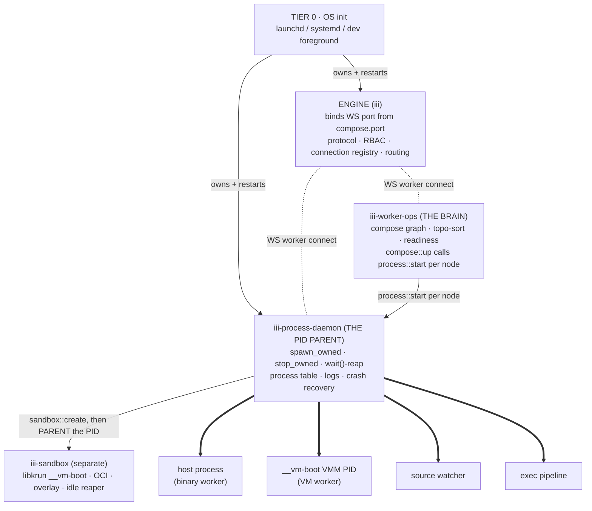
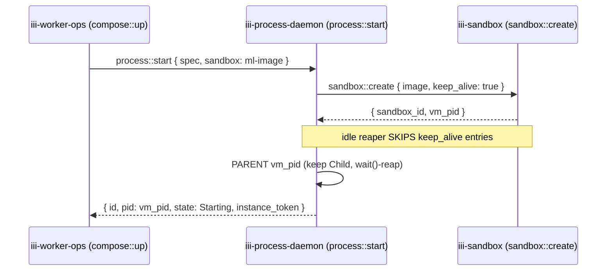

# The Process Daemon — PID ownership, zombie elimination, crash recovery, logs

Worker id: `iii-process-daemon` · Function namespace: `process::*`

This file specifies `iii-process-daemon`: the single long-lived process that is the **direct
parent of every host PID `iii` ever runs**. It exists for one reason — to make orphans and
zombies impossible *by construction* — and it does so by deleting every detach-and-forget
spawn path in the codebase and replacing it with one reaping parent. This file covers the
spawn/stop primitive, the supervision tiers ("what watches the watcher"), the zombie
root-cause→fix table, the `process::*` function surface, log capture, crash recovery, and the
honest platform/edge-case rulings. Orchestration of the compose *graph* lives elsewhere — see
[worker-compose.md](worker-compose.md) and [cli-and-functions.md](cli-and-functions.md); the
daemon only ever starts/stops/reaps *one process at a time* on instruction.

---

## 1. Thesis: one reaping parent

A **zombie** is a dead child whose parent is alive but never called `wait()`. An **orphan** is
a live process re-parented to init because its launcher exited. Today `iii` produces both, and
not by accident — it produces them *by design*:

> Every worker spawn path deliberately `setsid()`-detaches the child, the launcher returns `0`,
> and the PID is handed off to a **pidfile on disk** that the next CLI invocation re-reads.
> Nothing holds a live parent→child link, so nobody is positioned to `wait()`/reap, and
> liveness is reconstructed by `kill(pid,0)` polling plus `ps`/`/proc` cmdline scans against a
> recycle-prone PID. — see [investigation 03 §2](#7-migration-out-of-iii-inventory).

The structural fix is not a patch. It is to introduce **one process — `iii-process-daemon` —
that is the direct parent of every host process `iii` runs** (binary workers, dev/OCI VM
workers, source watchers, arbitrary exec pipelines), holds the authoritative in-memory process
table, and reaps via `wait()`/`waitpid` *because it is the parent*. The only way to make an
orphan or zombie — detach and drop the handle — is deleted everywhere. There is no longer any
other code path in `iii` that calls `Command::spawn` for a managed worker.

We are not inventing the correct ownership model — it already exists in **two places** in the
repo and works:

| Existing-correct impl | What it does | Where |
|---|---|---|
| `external.rs::kill_child` | keeps the `Child`, `killpg(SIGTERM)` → 3s grace → `killpg(SIGKILL)` → `proc.wait()` | `engine/src/workers/external.rs:349-378` |
| `shell/exec.rs::stop_process` | `setsid` group child, `killpg(SIGTERM)` → 3s → `killpg(SIGKILL)` → `child.wait()` (tested for "no zombie left") | `engine/src/workers/shell/exec.rs:241-325`, tests at `:344-454` |

The daemon **generalizes these two functions to all process kinds** — and absorbs the
`iii-exec` engine builtin, whose `Exec` struct (`engine/src/workers/shell/exec.rs`) is already
the right shape (spawn `sh -c`, group-kill, file-watch restart) but offers **zero callable
functions** (`worker.rs:39` `register_functions` is empty). After this change there is exactly
one spawn primitive (`spawn_owned`) and one stop primitive (`stop_owned`), and the
`iii-exec` engine builtin is **deleted** (folded into `process::start{spec, watch}`).

### What the daemon does NOT do

The daemon is deliberately *dumb about what it runs*. It does not decide what to run, resolve
versions, read worker scripts, or speak the compose graph — those belong to `iii-worker-ops`
(see [cli-and-functions.md](cli-and-functions.md) and [worker-compose.md](worker-compose.md)).
It does not own microVM images, OCI pull, catalog, or overlay — those stay in `iii-sandbox`
(see [engine-and-gateway.md](engine-and-gateway.md) for the worker map). The daemon's entire
job is: *be told to start a process spec, become its parent, keep it alive per policy, and reap
it cleanly.*



The thick arrows are real parent→child OS relationships (the daemon `wait()`s these). The
dashed arrows are WS worker connections. Note the daemon is parented by the **OS**, never by the
engine — that decoupling is the whole point (§2).

---

## 2. The bottom turtle: what supervises the daemon

"What manages the manager" is the crux question. If the daemon could itself be orphaned, we
would just have moved the problem up one level. Three-tier answer:

```
TIER 0  OS init          launchd (macOS) / systemd user unit (Linux) / CLI foreground (dev)
            │  owns + restarts the daemon PID — the ONLY turtle below it
            ▼
TIER 1  iii-process-daemon (separate long-lived process: `iii __process-daemon`)
            │  direct parent of all host worker PIDs · wait()-reaps · process table
            ▼
TIER 2  every worker PID (host proc / __vm-boot VMM / watcher / exec pipeline)
```

### 2.1 Separate process, NOT in-engine (resolved decision)

The daemon is a **separate long-lived OS process**, supervised by the OS in production and
self-bootstrapped by the engine in dev. It **MUST NOT** be an in-engine builtin. This is the
single most load-bearing decision in this file, and it was contested:

- The engine restarts on every config/hot-reload (it watches the compose file). If the engine
  *were* the process parent, every reload would orphan or kill all workers — exactly today's
  churn, and exactly what this design exists to prevent.
- Both `iii-sandbox` and `iii-worker-ops` are **already** separate `KNOWN_EXTERNAL` processes
  that connect over WS and block (`engine/src/workers/external.rs:61-74`;
  `crates/iii-worker/src/sandbox_daemon/mod.rs:112-181` calls `register_worker(engine_url, …)`
  then blocks on `ctrl_c`). The separate-process model is how the codebase already works.

So the daemon outlives engine hot-reload by construction. `iii-worker-ops` MAY be an in-engine
builtin (it is request-scoped graph logic with no PIDs to lose); the **process-daemon MUST NOT
be**, because losing the daemon means losing the live parent of every worker.

**Binary topology.** There is ONE binary, `iii`. The daemon is a separate *process* of that
same binary launched via a hidden subcommand `iii __process-daemon` (the sandbox-daemon is
likewise `iii __sandbox-daemon`). This satisfies both "single binary" and "separate long-lived
process" — the daemon is not a second binary, it is a second process. See
[migration.md](migration.md) for how the legacy `iii-worker sandbox-daemon` /
`iii-worker worker-manager-daemon` subcommands collapse into `iii`.

### 2.2 Who starts the daemon, and the recovery contract

- **Production / installed (recommended):** the daemon is a TIER-0 service unit (`launchd`
  plist on macOS with `KeepAlive=true`, `systemd` user unit on Linux with `Restart=always`).
  The OS supervisor is the *only* thing that owns the daemon PID. On crash the OS restarts it;
  on restart it re-adopts (§8). This is the clean steady state.
- **Dev / first-run (zero-config):** when no service unit exists, the **engine bootstraps the
  daemon** the way it already auto-injects other builtins (`config.rs:131-155`
  `ensure_builtin_daemons`). The engine launches `iii __process-daemon` ONCE via the **correct
  `external.rs` path** — process-grouped (`setsid`), `Child` kept, `killpg`+`wait()` on
  shutdown (`external.rs:280-378`) — so the daemon itself is *never* an orphan. If the engine
  dies, the daemon keeps its children alive (it is their parent, not the engine) and waits for
  the engine to reconnect (§8.3).

> **Why not just make the engine BE the daemon?** The engine is the *frequently-restarted
> protocol host*; the daemon is the *long-lived process parent*. Coupling them reintroduces the
> churn. They must be decoupled. (Note: today's hot-reload already *diffs* the worker set and
> restarts only changed workers — `engine/src/workers/reload.rs:343+` `diff_entries` /
> `promote_dead_unchanged` / `commit` — so the real win of decoupling is **surviving a full
> engine crash/restart and being the single PID owner**, not "reload kills everything." We
> state the justification on the real win, per Crit 02 #14.)

### 2.3 Single-instance guarantee (`daemon.lock`)

The daemon takes an exclusive advisory `flock` on its lock file (path is **per-port**, see
§11). A second `iii __process-daemon` that cannot take the lock exits `0` ("already running"),
so the engine-bootstrap path and a launchd unit can race safely — whoever wins the lock is the
daemon; the loser is a no-op. `flock` is released by the kernel on fd close at process death,
so a `SIGKILL`ed daemon leaves **no stale-lock deadlock** (unlike a pidfile). `daemon.lock`,
`state.json`, `pidfd`, kqueue exit-watching, and `PR_SET_CHILD_SUBREAPER` are **all net-new** —
none exist in the repo today (grep-clean, confirmed in Crit 02). This is a real supervisor
build, not a re-wire; size it accordingly.

---

## 3. The single spawn/stop primitive

Every process the daemon starts goes through ONE function, derived from the two correct
existing impls (§1). This is the replacement for the five broken spawn paths A/B/C/D/E (§7).

```rust
/// The ONLY place in all of iii that spawns a managed host process.
async fn spawn_owned(spec: &ProcSpec) -> Result<ProcHandle> {
    let mut cmd = Command::new(&spec.program);
    cmd.args(&spec.args).envs(&spec.env);
    if let Some(cwd) = &spec.cwd { cmd.current_dir(cwd); }

    // Mint + inject the correlation/authz key (§9) BEFORE spawn so the child sees it.
    let instance_token = Uuid::new_v4().to_string();
    cmd.env("III_INSTANCE_TOKEN", &instance_token);
    cmd.env("III_COMPOSE_ID", &spec.compose_id);
    cmd.env("IIIWORKER_PORT", spec.ws_port.to_string());

    // Capture, NOT inherit — so logs work. (Today exec.rs:186/204/212 use Stdio::inherit → no logs.)
    cmd.stdout(Stdio::piped()).stderr(Stdio::piped());

    #[cfg(unix)]
    unsafe {
        cmd.pre_exec(|| {
            // NEW PROCESS GROUP, but NOT a new session that detaches from us.
            // setpgid(0,0): child is its own group leader, STILL our child → we reap it.
            nix::unistd::setpgid(Pid::from_raw(0), Pid::from_raw(0))?;
            Ok(())
        });
    }
    #[cfg(windows)]
    cmd.creation_flags(CREATE_NEW_PROCESS_GROUP); // reuse exec.rs:207 path

    let child = cmd.spawn()?;              // we KEEP this handle, forever — never drop()
    let pid   = child.id().unwrap();

    // Race-free liveness + exit notification (no kill(pid,0) polling, recycle-immune on Linux).
    #[cfg(target_os = "linux")] let exit_watch = pidfd_open(pid);        // pidfd_open(2), ≥5.3
    #[cfg(target_os = "macos")] let exit_watch = kqueue_proc_exit(pid);  // EVFILT_PROC|NOTE_EXIT

    let ring = RingBuffer::new(LOG_RING_CAP);
    spawn_log_pump(child.stdout.take(), child.stderr.take(), ring.clone(), spec.log_file());
    table.insert(ProcEntry {
        id: spec.compose_id.clone(), pid, pgid: pid, child, exit_watch,
        instance_token, kind: spec.kind, owned: true,
        log_ring: ring, restart_policy: spec.restart_policy, started_at: now(), ..
    });
    Ok(handle)
}
```

```rust
/// The ONLY stop path — generalized from exec.rs:241-325 + external.rs:kill_child.
async fn stop_owned(entry: &mut ProcEntry, grace: Duration) {
    let pgid = Pid::from_raw(entry.pgid as i32);
    let _ = killpg(pgid, SIGTERM);                       // whole GROUP, polite
    if timeout(grace, entry.child.wait()).await.is_err() {
        let _ = killpg(pgid, SIGKILL);                   // whole group, forced
        let _ = entry.child.wait().await;                // reap the leader — no zombie
    }
    table.remove(&entry.id);
}
```

Key invariants:

- **`setpgid`, not `setsid`-to-detach.** The child becomes its own *process-group leader* so the
  daemon can `killpg` the whole tree (a forking worker can't orphan grandchildren), but it stays
  the daemon's *child* so `wait()` reaping is automatic. This is the host-side application of the
  in-VM fix (`crates/iii-supervisor/src/child.rs:262-300`).
- **`killpg` always.** Never signal a bare PID. This kills root cause #5 (forking binary workers
  orphaning grandchildren — `managed.rs:3016-3034` `kill_pid_with_grace` signals one PID today).
- **Keep the `Child`, forever.** Never `drop(child)` after spawn (the sandbox launcher's bug at
  `adapters.rs:236`). The kept handle is what makes `wait()` succeed.

### 3.1 Platform exit-watch notes

- **Linux:** `pidfd_open(2)` (kernel ≥5.3) gives an fd that becomes readable on child exit and is
  **immune to PID recycling** (kills root cause #3's TOCTOU). Plus `prctl(PR_SET_CHILD_SUBREAPER,
  1)` at startup: any grandchild that outlives its intermediate parent re-parents to the daemon
  (not init), so the daemon's `waitpid(-1)` loop still reaps it.
- **macOS:** kqueue `EVFILT_PROC|NOTE_EXIT` gives the same exit notification but is **not**
  recycle-immune the same way, and macOS has **no subreaper**. We additionally guard every signal
  with `child.try_wait()` first (the `terminate_gracefully` pre-check at `child.rs:230-255`), and
  accept the documented gap (§8.4, §12).
- **libkrun (VM workers):** the daemon does NOT call libkrun in-process. It delegates VM creation
  to `iii-sandbox` (`sandbox::create`, which fork+execs `iii __vm-boot` for crash isolation —
  `adapters.rs:57,169-198`) and then **parents the resulting `__vm-boot` PID** — i.e. it keeps the
  `Child` that `iii-sandbox` historically `drop`ped (`adapters.rs:236`). Two-level ownership: the
  daemon owns the VMM PID on the host; `iii-supervisor` (guest PID-1) owns processes *inside* the
  VM (`child.rs:305-360`, unchanged).

---

## 4. Zombie root-cause → mechanism table

Nine concrete sources of zombies/orphans, each with its file:line and the daemon mechanism that
deletes it. Sources verified in [investigation 03 §4](#7-migration-out-of-iii-inventory).

| # | Root cause | File:line today | Daemon mechanism |
|---|---|---|---|
| 1 | Engine holds the **wrong child handle**: spawns transient `iii-worker start` middle proc, keeps its `Child`, never `wait()`s it → **true zombie** parented to the live engine | `registry_worker.rs:302-307,370,458,476` | **Delete path E.** `iii-worker-ops` calls `process::start` over WS; no middle process exists. The daemon spawns the *real* worker as its own grouped child and `wait()`s it. |
| 2 | Detached real workers **orphaned by design** (`setsid()` + launcher `return 0`) | `managed.rs:3431-3438`; `libkrun.rs:162-166`; `local_worker.rs:1137-1143` | **Stop detaching.** `spawn_owned` uses `setpgid(0,0)` (own group, still our child) and keeps the `Child` → automatic `wait()` reaping. Orphans impossible. |
| 3 | Stale pidfile → PID recycling → SIGKILL an innocent recycled PID (TOCTOU) | `managed.rs:2865-2876,2370-2393`; hazard documented `child.rs:230-255` | **No pidfiles.** Identity is the in-memory table entry, not a disk PID; liveness is pidfd/kqueue exit events, not `kill(pid,0)` polling → no read-then-signal race. |
| 4 | Crashed launcher leaves the watcher **sidecar** respawning untracked VMs | `managed.rs:2918-2927` | The watcher becomes a daemon child like everything else; stopping a worker tears down the whole supervision unit (watcher + worker + VM). No standalone sidecar outlives its target. |
| 5 | Host-binary `stop` signals a **single PID** not the group → forking binary orphans grandchildren | `managed.rs:3016-3034` (`kill_pid_with_grace`) | **`killpg` always.** `stop_owned` SIGTERMs the *process group*, 3s grace, SIGKILL group, `wait()` leader (the in-VM fix `child.rs:262-300` applied host-side). |
| 6 | `run_dev` background path writes `vm.pid` + `return 0` without `wait()`; the reaping branch is never taken | `libkrun.rs:209-238` (vs the never-taken `:240-264`) | The daemon IS the long-lived process: it always runs the "foreground" ownership branch — holds the `__vm-boot` `Child` and `wait()`s it. No "background return 0" path. |
| 7 | `LibkrunAdapter::stop` `waitpid()`s a **non-child** → `ECHILD`, no reap | `libkrun.rs:759,774` | Daemon IS the parent of `__vm-boot` (it parented the PID from `sandbox::create`), so `waitpid` succeeds and actually reaps. |
| 8 | Independently-started processes invisible except via `ps`/`/proc` heuristics | `managed.rs:2443-2631` | **Token correlation (§9).** Workers self-identify over WS via `instance_token`; they appear in the table without cmdline scanning. `ps`-scan demoted to an opt-in `process::reconcile --scan` fallback. |
| 9 | Sandbox launcher `drop(child)` detaches `__vm-boot`; idle-reaper-only; no startup orphan sweep | `adapters.rs:229-236`; `reaper.rs:8-33` | Daemon **keeps the `Child`** and adds **startup reconciliation** (§8): on boot it reads `state.json` and reaps/re-adopts leftover `__vm-boot` PIDs before serving. |

**Honesty note (Crit 02 #4, #5):** the recovery substrate (#3, #9 fixes) leans on `state.json`,
`daemon.lock`, pidfd/kqueue, `PR_SET_CHILD_SUBREAPER` — all net-new. This is a from-scratch
supervisor, not a port. On macOS, #3's recycle-immunity and the subreaper net are **not
available**; see the degraded mode in §8.4.

---

## 5. The `process::*` function surface

Every CLI verb maps 1:1 to a function (the thin-CLI contract — see
[cli-and-functions.md](cli-and-functions.md)). All request/response types derive `JsonSchema`.

```
process::start    { spec: ProcSpec, watch?: Vec<glob>, ws_port?: u16 }  -> { id, pid, state, instance_token }
process::stop     { id, grace_secs?: u32 (def 3) }                      -> { id, state }
process::restart  { id, grace_secs?: u32 }                              -> { id, pid, state }
process::status   { id }                                                -> ProcStatus
process::ps       { filter?: { kind?, state?, owned? } }                -> { procs: Vec<ProcStatus> }
process::logs     { id, follow?: bool, tail?: u32, since?: ts, stream?: "stdout"|"stderr"|"both" }
                                                                        -> StreamChannelRef | { lines: Vec<LogLine> }
process::exec     { cmd, args?, env?, cwd?, tty?, rows?, cols?, timeout_secs? }
                                                                        -> { pid, exit_code?, stdout?, stderr?, channel?: StreamChannelRef }
process::signal   { id, signal: "TERM"|"KILL"|"HUP"|i32 }              -> { id }
process::attach   { id, pid, kind?, owned?: false }                    -> { id, state }   // §9 opt-in adoption
process::reconcile{ scan?: bool }                                      -> { adopted, reaped, started, stopped }  // §8 CRASH RECOVERY ONLY
```

> **Scope boundary (resolved):** there is no `process::up` / `process::down` here. Graph
> orchestration — topo-sort, `depends_on`, readiness gating — lives in `iii-worker-ops` as the
> **streaming** `compose::up` / `compose::down` (see [worker-compose.md](worker-compose.md) and
> [cli-and-functions.md](cli-and-functions.md)). `compose::up` calls `process::start` per node.
> The only "reconcile" the daemon owns is `process::reconcile`, which is **daemon-local crash
> recovery** (make my table match my still-alive children), *not* compose-graph reconciliation.
> Two different reconciles; named distinctly on purpose.

### 5.1 `process::start{spec, watch}` is the `iii-exec` replacement

`ProcSpec` carries everything the daemon needs and nothing about *what to install*:

```rust
struct ProcSpec {
    compose_id: String,                 // stable key (the compose <id>); the iii-exec pipeline gets a NAME
    program: String, args: Vec<String>, // or a `sh -c` line for arbitrary exec
    env: BTreeMap<String,String>, cwd: Option<PathBuf>,
    kind: ProcKind,
    restart_policy: RestartPolicy,      // Always | OnFailure (default) | Never  (capped exp. backoff)
    watch: Option<Vec<String>>,         // glob restart, reuses exec.rs glob logic (exec.rs:217-263 / glob_exec.rs)
    sandbox: Option<SandboxRef>,        // present → daemon calls sandbox::create then parents the __vm-boot PID
    ws_port: u16,                       // injected as IIIWORKER_PORT so the worker connects back
}
```

- The old `iii-exec` pipeline was a **single unnamed** `exec: [...]` list run at engine startup
  (`shell/config.rs:9-14`). Under `process::start` the compose `<id>` is the key, so the pipeline
  becomes **named and addressable** (`process::restart math-dev`, `process::logs math-dev`).
- `watch:` reuses the existing glob restart logic (`exec.rs:217-263`); on a matching fs event the
  daemon runs its own `stop_owned`→`spawn_owned`, addressed by `id`. Caveat carried over: today's
  watch matches by **root dir + file extension only** (`glob_exec.rs:72-99`) — filename ignored;
  that limitation is preserved unless explicitly fixed.
- `process::exec` is the one-shot/streaming "run a command now" verb the old `iii-exec` worker
  could never do (`SKILL.md:23`: "there is no function to 'run this command now'"). Sandboxed
  exec is NOT here — that is `sandbox::exec` on `iii-sandbox` (kept separate, §10).

### 5.2 `ProcStatus` / `ProcState` shapes (the `ps`/`status` data)

```rust
struct ProcStatus {
    id: String,                 // compose <id>, stable key
    pid: Option<u32>, pgid: Option<u32>,
    kind: ProcKind,             // HostProc | VmWorker | SourceWatcher | ExecPipeline | Sandbox | Foreign
    state: ProcState,           // Starting | Running | Ready | Unhealthy | Stopping | Stopped | Crashed | Exited(i32)
                                // Unhealthy = alive + connected but a configured healthcheck is failing
                                // (distinct from Crashed/Exited). Default on healthcheck fail = mark
                                // Unhealthy, NOT restart; opt in via healthcheck.on_fail (readiness
                                // contract in lifecycle-and-onboarding.md).
    owned: bool,                // true = daemon is parent & reaps; false = re-adopted/foreign (§9)
    instance_token: Option<String>,  // §9 correlation key (None for foreign)
    restarts: u32,
    started_at: Timestamp,
    last_exit: Option<{ code: i32, at: Timestamp }>,
    ws_connection: Option<{ worker_id, runtime, isolation }>,  // correlated from the engine registry
    sandbox: Option<SandboxRef>,
    cpu_pct: Option<f32>, rss_bytes: Option<u64>,   // best-effort, polled
}
```

`process::ps` returns `Vec<ProcStatus>` **as data** (today `status` is a live-refresh TUI dump,
not a queryable surface). The TUI (`tuiii`) and `iii ps` both become thin clients polling
`process::ps`. **TUI co-migration (Crit 04 M3):** `tuiii` hard-codes `worker::list/start/stop/logs`
(`tuiii/src/engine/workers.rs:120,328,339`, `logs.rs:77`); those functions move/rename, so the
spec's function-id compatibility plan (kept `worker::*` alias-forwarders for one deprecation cycle,
or in-lockstep TUI update) is **required** — see [migration.md](migration.md) and
[cli-and-functions.md](cli-and-functions.md).

---

## 6. Log capture: ring buffer + file (and the relationship to iii-observability)

Today the `iii-exec` worker spawns with `Stdio::inherit()` (`exec.rs:186/204/212`), so output goes
straight to the engine's terminal and **there is no capture at all** — no `iii logs`, no crash
tails. `spawn_owned` switches to `Stdio::piped()` and tees both fds into:

1. a per-process **ring buffer** (last-N lines, in memory), and
2. an append-only **log file** under the daemon's per-port state dir (so a tail survives a single
   process restart).

`process::logs` reads the ring/file; `follow:true` returns a `StreamChannelRef` (the same channel
mechanism `sandbox::fs::read` already uses). On `kind: VmWorker`, the `__vm-boot` stderr is already
persisted to `vm-boot.stderr.log` (`adapters.rs:210-216`) — the daemon links that file rather than
re-piping the VMM.

### 6.1 The daemon ring buffer vs `iii-observability` (THE line, Crit 04 M1)

These are **two different things and must never be conflated**:

| | Daemon ring buffer | `iii-observability` |
|---|---|---|
| What | An **ephemeral tee** of process stdout/stderr fds | The **durable, structured OTEL** store (logs/metrics/traces) |
| Scope | last-N lines per process, in memory (+ a capped file) | full pipeline, exported to a backend |
| Lifetime | **lost on daemon crash** (that is acceptable) | survives crashes; cross-restart history |
| Audience | `iii logs <id>`, crash tails, the inner dev loop | day-2 ops, dashboards, alerting |
| Source | the raw fds the daemon owns | the worker's own OTEL export (`iii-observability`/`iii-telemetry`, `telemetry/mod.rs:999`) |

State it explicitly: **the ring buffer is a tee of the same bytes, capped, never the durable
store.** A line can appear in `iii logs` (ring) but not the OTEL backend if the worker never
exports it, and vice versa — they are independent paths and the dev must be told so.

**Open question (recommended default below):** *Should `iii logs` optionally read durable history
from `iii-observability`?* — Recommended default: `iii logs <id>` reads the **ring** by default
(fast, zero-config, what you want in the inner loop) and accepts `--durable` to query
`iii-observability` for cross-restart/cross-daemon-crash history when the dev has it configured.
This keeps the common case ring-buffer-fast while giving an escape hatch to durable logs. Final
wiring of `OTEL_*`/`observability:` config flow is owned by
[lifecycle-and-onboarding.md](lifecycle-and-onboarding.md); cross-link it.

---

## 7. Migration-out-of-iii inventory

What moves into the daemon vs gets deleted. Spawn-path letters reference
[investigation 03 §2](#7-migration-out-of-iii-inventory)'s A–G taxonomy.

| Component | File(s) | Disposition |
|---|---|---|
| Host binary spawn (path C) | `managed.rs:3384-3459` (`start_binary_worker`) | **Move → `spawn_owned`.** Delete `setsid`+pidfile+`return 0`. |
| VM dev spawn (path A) | `local_worker.rs::run_dev`, `worker_manager/libkrun.rs:162-217` | **Move → daemon** (delegating VM create to `sandbox::create`); daemon keeps `__vm-boot` `Child`; delete `vm.pid` + background-return-0 branch. |
| OCI VM spawn (path B) | `managed.rs::start_oci_worker`, `libkrun.rs:739,759,774` | **Move → daemon** (via `sandbox::create`). Delete the non-child `waitpid` (#7). |
| Source watcher (path D) | `local_worker.rs:1091-1145` (`spawn_source_watcher`) | **Move → daemon** as a child of the supervision unit; delete `watch.pid` + standalone respawn. |
| Engine middle-child (path E) | `registry_worker.rs:115-237,302-307,370,458,476` (`ExternalWorkerProcess`) | **DELETE.** Engine/worker-ops call `process::start` over WS instead of `iii-worker start`. Kills zombie #1 entirely. |
| Stale/grace reaping | `managed.rs:2341-2393,3016-3034` (`kill_stale_worker`, `reap_source_watcher`, `kill_pid_with_grace`) | **DELETE.** Replaced by `stop_owned` (killpg+wait, group-correct). |
| PID/process discovery | `managed.rs:2406-2631` (ps/proc scan, `is_worker_running`) | **DELETE as primary.** Optional `process::reconcile --scan` fallback only. |
| Pidfile machinery | `cli/pidfile.rs` (entire); `vm.pid`/`watch.pid`/`<name>.pid`; engine re-impl in `registry_worker.rs` | **DELETE.** Daemon persists ONE snapshot of its own table (§8); no per-worker cross-process handoff. |
| `iii-exec` engine builtin | `engine/src/workers/shell/` (`ExecWorker`, `Exec`, `ExecConfig`) | **FOLD into `process::start{spec, watch}`.** Keep `exec.rs`'s group-kill reaping (the correct primitive). Delete the engine-builtin registration (`worker.rs:68`); `iii-exec` ceases to be an engine worker. |
| Host-side supervisor RPC | `cli/supervisor_ctl.rs` | **Move → daemon** as the host half of the in-VM control channel (Restart/Shutdown/Ping/Status over the VM's `control.sock`, `protocol.rs:19-58`). Protocol unchanged. |
| `worker::start`/`worker::stop` shims | `worker_manager_daemon.rs` | **Become thin shims** that call `process::start`/`process::stop`. Install/version/lockfile (`worker::add/update/remove/clear/list`) stay on `iii-worker-ops` (package management, orthogonal). |

### 7.1 What stays separate

- **`iii-sandbox`** is NOT folded into the daemon. It keeps `sandbox::*` + `sandbox::fs::*` (the
  16-fn public API; the publish workflow polls `iii-sandbox` by name — `mod.rs:114-119` — and must
  not break). The daemon *delegates* sandboxed spawns to `sandbox::create` and then *parents* the
  resulting PID (§10). The `runtime-adapter` (libkrun/OCI) belongs to `iii-sandbox`, not the daemon.
- **`iii-supervisor`** is NOT deleted and is NOT the host daemon. Its future role is **in-VM PID-1
  only** (unchanged): guest-side reaping (`child.rs:262-364`) and Restart/Shutdown/Ping/Status over
  virtio-console (`protocol.rs:19-58`). Clean two levels: the daemon owns every *host* PID; the
  supervisor owns every process *inside* each VM. The daemon is the host-side client of the
  supervisor's control protocol.

---

## 8. Crash recovery contract (net-new — stated honestly)

This is greenfield. None of the substrate exists today (Crit 02 #4). The contract:

### 8.1 State persistence (two layers)

1. **Desired state = the compose file** (human-authored, NOT rewritten by the daemon). The daemon
   does not parse the compose graph; it learns the desired set indirectly via the `process::start`
   calls `compose::up` makes. See [worker-compose.md](worker-compose.md).
2. **Runtime state = `state.json`** (machine-written, per-port — §11): the daemon's table snapshot
   `{ id, pid, pgid, kind, instance_token, started_at, sandbox_id?, rootfs?, program, compose_hash }`,
   written **atomically (temp file + rename)** on every table mutation. This is the recovery
   manifest — the analogue of pidfiles, but ONE file owned by ONE process, not per-worker handoff.

### 8.2 Daemon restart sequence

```
1. Acquire daemon.lock (exclusive). If held → exit 0 (another daemon lives).   [§2.3]
2. prctl(PR_SET_CHILD_SUBREAPER, 1)                                            [Linux only]
3. Load state.json (last known table).
4. process::reconcile (crash-recovery reconcile, NOT compose::up):
     for each persisted entry:
       - probe liveness: pidfd/kqueue if available; else kill(pid,0) + cmdline
         sanity-check against state.json's recorded `program` (the ONLY surviving
         use of cmdline, solely to avoid re-adopting a recycled PID).
       - ALIVE + identity matches → RE-ADOPT as owned:false, keep instance_token
         (we are no longer its parent — it survived our death — but we track + can
         killpg it by recorded pgid). On its next exit we drop it; a future start
         re-establishes owned:true.
       - DEAD/stale → reap if reapable, drop from table.
     orphan sweep: any leftover __vm-boot child with no table entry → SIGTERM/SIGKILL
       (fixes #9: "restart loses registry, leaks __vm-boot").
5. Reconnect to engine WS (standard worker handshake); re-register process::* functions.
6. Serve. (worker-ops then re-correlates by token — §9, §8.3.)
```

**Key property:** children **outlive a daemon crash**. They were process-group children, so when
the daemon dies they re-parent to init/subreaper — they are NOT killed. On restart the daemon
re-adopts the still-alive ones rather than kill+respawn, so a daemon crash does NOT take down
running workers. This is strictly better than today, where a crash anywhere in the chain stranded
untracked orphans.

**Trade-off (stated, per Crit 02 #4c):** a re-adopted process is `owned:false` until it next
restarts. During that window the daemon can't `wait()`-reap it (it re-parented to init/subreaper,
which reaps it instead — on Linux the subreaper net catches it; **on macOS nothing does** →
transient zombies are briefly possible). `killpg`-on-stop still works (recorded pgid). We accept
this over the alternative (kill+respawn every worker on every daemon restart), which is worse for
stateful dev workers. *Alternative for the lead to weigh:* "daemon restart = clean slate"
(kill+respawn) gives a simpler invariant at the cost of restarting healthy workers — recommended
default is **re-adopt**, with kill+respawn available as a `process::reconcile --fresh` flag.

### 8.3 Engine restart (engine dies, daemon lives)

The daemon is the children's parent, not the engine, so an engine restart does **not** touch
worker processes. The daemon's WS connection drops; it reconnects with backoff; `compose::up` is
re-issued and is idempotent. **Correlation rebuild (Crit 02 #8):** because `iii-worker-ops`
correlation state lives in memory and dies with the engine, on engine boot worker-ops **MUST**
pull `process::ps` (with `instance_token`s) from the daemon and re-join it to reconnecting workers
before treating any worker as "independent." If a worker SDK reconnects before worker-ops finishes
rebuilding, it is **uncorrelated-but-known** (token present in the daemon table, not yet joined),
not "foreign" — the join completes when worker-ops reads the table. This ordering is owned jointly
with [cli-and-functions.md](cli-and-functions.md).

### 8.4 macOS degraded mode (explicit)

macOS has **no `PR_SET_CHILD_SUBREAPER`**. On a daemon crash, grandchildren orphan to init, and
re-adoption falls back to `kill(pid,0)` + cmdline sanity — i.e. the very heuristic we deleted as a
*primary* path survives here as a *recovery-only* path. We state this honestly. macOS daemon-crash
behavior:

- Re-adopt-by-pid, best-effort, `owned:false` (as above).
- Startup **orphan sweep kills untracked `__vm-boot` children** (since idle reaping of a leaked VM
  is otherwise the only cleanup).
- Mitigation for the no-subreaper gap: `killpg` torches the whole group on stop, and we document
  that workers should not daemonize/double-fork (any grandchild that escapes the group can leak on
  macOS until reboot).

### 8.5 VM re-adoption (weak — state the rule)

Re-adopting a **microVM** is weaker than a plain process: the daemon was the one holding the
`__vm-boot` boot `Child`, and `state.json` only records the VM pid + `shell.sock` path. Rule:

> On daemon restart, for each surviving `__vm-boot`: if its `shell.sock` still accepts a
> connection, **reconnect** (treat as re-adopted, `owned:false`, exec via the existing
> `shell.sock` relay). If the socket is gone/unresponsive, the VM is **un-reattachable** →
> `kill+respawn` (SIGTERM/SIGKILL the VMM PID, then let `compose::up` re-create it).

This is deliberately conservative; a half-dead VM is killed rather than carried.

---

## 9. Independent-worker handling: `instance_token` (canonical) + `process::attach` (escape hatch)

Three tiers of process identity, by how the worker came to exist:

| Tier | How it started | Identity | Control |
|---|---|---|---|
| **Managed** | spawned by the daemon via `spawn_owned` | `instance_token` minted + injected (`III_INSTANCE_TOKEN`), correlated to its WS connection on connect | **Full** — daemon is parent, reaps, killpg, restarts per policy |
| **Connected-but-untokened** | dev ran it by hand (`npm run dev`); connects over WS with no token | known via the engine's `worker_connected` trigger (reports `pid`, runtime, isolation), appears in `ps` as `Foreign` | **Observe-only** by default (daemon never claims to reap a PID it didn't parent) |
| **Attached** | explicitly `process::attach{id, pid, owned:false}` | a `Foreign` table entry; liveness via pidfd/kqueue if it's a descendant, else low-frequency `kill(pid,0)` | **Best-effort** SIGTERM only; never claimed-reaped |

`instance_token` is the **canonical** correlation/authz key (verifiable, replaces ps-scan
identity, doubles as a security boundary — strictly better than pid-matching, which is
recycle-prone). The engine already fires `worker_connected`/`worker_disconnected`
(`engine/mod.rs:1494-1499`) and workers already self-report metadata on connect
(`worker_connections/mod.rs:126-155`), so the WS connection is the registrar that
[investigation 03 §5](#7-migration-out-of-iii-inventory) asked for — no cmdline scanning needed.
`process::attach` is the **opt-in** escape hatch for truly-foreign PIDs (always `owned:false`,
`control:best-effort`); it is never automatic.

### 9.1 Duplicate `compose_id` registration collision (Crit 02 #7 — resolved rule)

A dev hand-runs `math` while `compose::up` also runs `math`. Now two WS connections claim the same
`compose_id` and try to register the same functions ("Function … is already registered").
**Rule:**

> The **first managed (tokened) registration wins** and holds the `compose_id`. A second
> connection presenting a *valid matching token* is treated as a reconnect of the same instance
> (idempotent). A connection claiming an already-held `compose_id` **without** a matching token is
> **rejected for that id** (logged, surfaced in `ps` as `Foreign` under a namespaced display id
> like `math (foreign)`), so it cannot hijack function routing for the managed instance.

So: tokened-managed owns the id; untokened duplicates are observe-only and namespaced, never
last-writer-wins on the managed id. This makes function routing unambiguous.

### 9.2 `compose::up` idempotence depends on a pre-spawn existence check (Crit 02 #3)

Because tokens are minted **per spawn**, a re-run of `compose::up` must NOT mint a new token for an
already-running instance. The pre-spawn check is **by `compose_id` against the daemon's table**
(`process::ps`), not by token: if instance `math` is already `Running`/`Ready`, `compose::up`
leaves it (re-adopting a stale token if needed); if absent, it starts it. A half-finished `up`
(3 of 5 started, then crash) reconciles to "start the missing 2, leave the 3." This existence check
is owned by `iii-worker-ops`/`compose::up` (see [worker-compose.md](worker-compose.md)); the daemon
only answers the `process::ps`-by-id query and refuses to double-spawn a live `compose_id`.

---

## 10. Sandbox idle-reaper double-ownership (`keep_alive` carve-out)

`iii-sandbox`'s idle reaper force-kills (SIGTERM→200ms→SIGKILL) **any** sandbox idle past
`idle_timeout_secs`, keyed purely on `last_exec_at` (`reaper.rs:8-33`, `adapters.rs:576-604`). A
**compose-managed worker that runs inside a sandbox** but simply isn't being `exec`'d (it's a
long-lived service, not an interactive sandbox) would be **silently reaped out from under the
daemon** — two reapers, two policies, one PID (Crit 02 #2).

**Resolution:** when `process::start` delegates a sandboxed spawn to `sandbox::create`, it sets a
`keep_alive: true` (a.k.a. `managed: true`) mark on the sandbox registry entry, and the idle reaper
**skips** any entry so marked. Idle reaping then applies only to ephemeral, interactive sandboxes
(`sandbox::run`/ad-hoc `sandbox::create`), never to compose-managed sandbox-backed workers — whose
lifecycle is owned by the daemon's `restart_policy`, not by idle time. This requires `iii-sandbox`'s
registry to carry the new mark and its reaper to consult it; cross-link
[worker-compose.md](worker-compose.md) (which surfaces `keep_alive` / sandbox runtime in the compose
schema) and the `iii-sandbox` entry in [engine-and-gateway.md](engine-and-gateway.md).



---

## 11. Multi-engine / per-project keying (resolved decision)

A single machine-global daemon cannot serve N per-project composes safely: two projects can both
declare a worker `math`, and a `down` in project A keyed only by `compose_id` could reap project
B's `math` (Crit 02 #5/#16). **Resolved decision:**

> The daemon is **per engine / per port.** Its lock and state live under a **per-port directory**:
> `~/.iii/daemon/<port>/daemon.lock` and `~/.iii/daemon/<port>/state.json`. The `<port>` is the
> compose's WS gateway `port` (the one marquee bootstrap scalar). One `iii up` boots engine-on-:P
> plus the daemon-for-:P; a second project on a different port gets its own daemon, its own lock,
> its own state. A `down` in one project can never reap another's PIDs because they are different
> daemons keyed by different ports.

Two projects on the **same** port is a genuine port collision (the engine refuses to bind), which
is the correct, loud failure — not a silent cross-project reap.

**Relative-path resolution (Crit 02 #16):** any relative path (the `configuration` store
`directory`, etc.) is resolved against the **compose file's directory**, never the CWD of whoever
ran `up`. Running `iii up` from a subdir must not create a second store. This rule is shared with
[configuration-and-bootstrap.md](configuration-and-bootstrap.md) and
[worker-compose.md](worker-compose.md); stated here because the daemon's own `state.json` path
participates in it.

**Alternative considered (rejected):** one machine-global daemon that namespaces every entry by
`(project_root_or_port, compose_id)` and serves N engines. Rejected because it concentrates blast
radius (one daemon crash takes down every project) and complicates the lock/state model for no DX
gain at single-developer scale. Per-port is simpler and isolates failure. If a future need arises
for a shared daemon (e.g. a resource-constrained CI host running many composes), the per-port dirs
are forward-compatible with a later shared-daemon mode that simply manages multiple `<port>`
sub-tables.

---

## 12. Windows ruling (resolved decision)

The entire daemon is Unix-shaped: `setpgid`/`killpg`/`setsid`/pidfd/kqueue/`PR_SET_CHILD_SUBREAPER`
(Crit 04 M9). **Ruling: WSL-only for v1 of the new model.** This must be stated in install docs.

- `spawn_owned`/`stop_owned` are the **seam** where a future native-Windows backend plugs in: Job
  Objects for group-kill (the `killpg` analogue) + `WaitForSingleObject` for reap, behind the same
  `ProcHandle` abstraction. The Windows `CREATE_NEW_PROCESS_GROUP` + `GenerateConsoleCtrlEvent`
  path already present in `exec.rs:207,259-268` is the starting point.
- **Regression risk (acknowledged):** sandbox-less binary/source workers may run on native Windows
  *today* via the plain-spawn path this design deletes. Routing every worker through the Unix-only
  `spawn_owned` would regress those users from "works without sandbox" to "doesn't work natively."
  The spec must acknowledge them and the migration must either keep the old plain-spawn path alive
  on native Windows during the transition or document the WSL requirement loudly before cutover.
  Sandbox VMs are already unsupported on Windows regardless (`sandbox_daemon/README.md:100,522`).

---

## 13. Open questions for the lead author (README.md)

1. **`iii logs --durable` (§6.1):** confirm the default — ring-by-default, `--durable` reads
   `iii-observability`. The `OTEL_*`/`observability:` config-flow wiring is owned by
   [lifecycle-and-onboarding.md](lifecycle-and-onboarding.md); the README master table should show
   `iii logs` as a `process::logs` consumer with the optional durable hop.
2. **Re-adopt vs fresh on daemon crash (§8.2):** recommended default is **re-adopt** (keep workers
   alive, accept the `owned:false` window); `process::reconcile --fresh` is the kill+respawn opt-out.
   Confirm this is the cross-doc default.
3. **Drain-on-stop (Crit 02 #1, #15):** killing a worker's PID makes the engine `halt_invocation`
   every in-flight call (`engine/mod.rs:1700-1706`). The **drain protocol** (stop routing new
   invokes → bounded wait for in-flight → then SIGTERM; or blue/green) is cross-cutting between the
   daemon's `stop_owned` and the engine's routing — recommend it be specified in
   [engine-and-gateway.md](engine-and-gateway.md) / [lifecycle-and-onboarding.md](lifecycle-and-onboarding.md)
   with `stop_owned` taking a `drain_first` flag the daemon honors. Flag for the README to assign.
4. **libkrun preflight (Crit 02 #11):** sandbox-backed workers on a host without hardware virt
   should fail at `compose::up` preflight with a clear error, not mid-topo-sort. The capability
   probe belongs to `compose::up`/`iii-sandbox`, but the daemon's `process::start` should return a
   distinct typed error when `sandbox::create` reports no-virt rather than a generic spawn failure.
