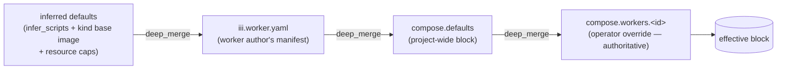

# worker-compose.yml — schema & semantics

`worker-compose.yml` is the single human-authored boot file for an iii project. It carries the
irreducible bootstrap floor (the WS gateway `port`, where the `configuration` store persists, and the
worker list + topology) and is the *only* file a person edits. This document is the reference for its
schema, its merge semantics over each worker's `iii.worker.yaml` (runtime/scripts/environment/topology —
*not* config; per-worker configuration is owned end-to-end by the `configuration` worker, not by compose),
its relationship to the machine-written `iii.lock`, and its validation/error behavior. Every claim about
current behavior is grounded in cited code (repo-relative paths).

For *who consumes* this file at runtime, see [engine-and-gateway.md](engine-and-gateway.md) (port binding +
registration protocol), [cli-and-functions.md](cli-and-functions.md) (the `compose::*` / `worker::*`
functions that parse and orchestrate it), [configuration-and-bootstrap.md](configuration-and-bootstrap.md)
(the `configuration` store + `config-worker:` resolution), [process-daemon.md](process-daemon.md) (the PID
parent that `compose::up` drives), and [migration.md](migration.md) (the config.yaml → compose cutover).

---

## 1. Design principles

These decisions drive every field in the schema.

1. **One file is the boot egg.** There is an irreducible *bootstrap floor* that cannot live in the
   configuration store, because the store is only reachable *over* the very port the floor declares:
   the WS `port`, the worker list, and where the store persists. `worker-compose.yml` *is* that egg. It
   replaces both `config.yaml`'s `workers:` list and the old `iii-worker-manager.config.port` indirection
   (`engine/src/workers/worker/mod.rs:52-66` `WorkerManagerConfig{port,host,middleware_function_id,rbac}`).
   The WS listener is now baked into the engine as the internal **worker-gateway** — it is no longer a
   worker (see [engine-and-gateway.md](engine-and-gateway.md)).

2. **Compose = desired state; `iii.lock` = resolved state.** This is the package.json/lockfile split, and
   it is already the codebase's grain. Compose is the only file a human edits; `iii.lock` is machine-written,
   carries hashes + pinned digests, and is never hand-edited. We do **not** fold one into the other (§10).

3. **Compose overrides the worker's manifest, field by field — never the reverse.** A worker ships an
   `iii.worker.yaml` declaring sensible defaults; the operator's `worker-compose.yml` is authoritative and
   overrides it. The merge reuses the existing `deep_merge` primitive (`crates/iii-worker/src/cli/config_file.rs:388-405`:
   objects merge recursively, everything else replaces) so the behavior is identical to today's config merge (§4).

4. **Per-worker config lives entirely in the `configuration` worker — never in compose.** Today config is
   an inline YAML block copied into `config.yaml` under each worker entry
   (`crates/iii-worker/src/cli/local_worker.rs:519-528`). We delete that idea from compose outright: there
   is **no** `config:` field in `worker-compose.yml` (and none in `iii.worker.yaml`). Each worker registers
   its own config schema + initial value at boot by calling `configuration::register(id, schema, initial_value)`
   from its own code/SDK; the store persists the value and the worker reads it via `configuration::get` and
   hot-reloads off the `configuration` trigger. This kills the inline-config sprawl that the onboarding
   investigation flagged as the #1 friction (see [configuration-and-bootstrap.md](configuration-and-bootstrap.md)).

5. **Typed, strict schema with `deny_unknown_fields`.** Unlike `iii.worker.yaml` — which has *no* serde
   struct and must stay permissive for forward-compat (every consumer field-picks an untyped
   `serde_yaml::Value`) — `worker-compose.yml` is new, greenfield, and human-authored, so it gets a typed
   serde struct with `#[serde(deny_unknown_fields)]` (within the current major; see the versioning policy
   in §11) to catch typos early and give good errors (§12, §13).

---

## 2. The annotated canonical `worker-compose.yml`

```yaml
# worker-compose.yml — the single boot file for an iii project.
# Replaces config.yaml's `workers:` list AND the iii-worker-manager port indirection.

# ── Format marker. REQUIRED. Semver; minor adds optional fields, major = breaking (see §11).
version: "1"

# ── WS gateway port the engine opens for SDK workers to connect to.
#    THE one marquee top-level scalar. BOOTSTRAP-TIER: must be static, cannot come from the
#    configuration store (the store is only reachable *over* this port).
#    Replaces WorkerManagerConfig.port (engine/src/workers/worker/mod.rs:54; DEFAULT_PORT=49134).
port: 49134

# ── OPTIONAL: WS-listener (worker-gateway) knobs. All bootstrap-tier alongside `port`.
gateway:
  host: "0.0.0.0"                     # bind host (WorkerManagerConfig.host, worker/mod.rs:58)
  rbac:                               # WorkerManagerConfig.rbac (worker/mod.rs:60, rbac_config::RbacConfig)
    auth_function_id: security::authorize
  middleware_function_id: null        # WorkerManagerConfig.middleware_function_id (worker/mod.rs:59)

# ── OPTIONAL: where the `configuration` store persists. BOOTSTRAP-TIER: the store can't read
#    its own location from itself. Authoring form flattens the real AdapterEntry shape (§13).
configuration:
  adapter: fs                         # fs (default) | bridge
  directory: ./data/configuration     # fs-only; resolved relative to THIS FILE (§12). Default ./data/configuration.
  ttl_seconds: 0                      # optional; 0 disables idle-entry TTL cleanup (config.rs:18-24)

# ── OPTIONAL: project-wide worker defaults applied to EVERY worker BEFORE its iii.worker.yaml
#    and BEFORE its per-worker block. Lowest compose-tier precedence (§4).
defaults:
  environment:
    LOG_LEVEL: info
  scripts:
    install: ""                       # opt out of install everywhere unless a worker overrides

# ── The workers this engine manages. Map of <instance-id> -> worker block. REQUIRED.
#    The <id> is the INSTANCE id (not necessarily the package name) — this is what makes
#    "two copies of the same worker" trivial (Example 5).
workers:

  # Local source worker (developer's own code in a sibling dir).
  math:
    runtime:
      workspace: ./workers/math-worker   # local path -> source, not an artifact
    scripts:
      start: npm run dev                 # overrides the manifest's start
    environment:
      MATH_PRECISION: "8"
    env_file:
      - .env                             # lower priority
      - .env.local                       # LATER files WIN (§5) — .env.local beats .env
    depends_on:
      - state                            # READY-gated: math starts only after `state` answers functions

  # Remote registry worker, pinned to a floating tag.
  state:
    runtime:
      package: workers.iii.dev/iii-state:latest

  # Remote worker pinned to an exact version, run inside a custom base image (sandboxed).
  scraper:
    runtime:
      package: workers.iii.dev/scraper:1.4.2
      base_image: ghcr.io/acme/scraper-base:1.2.3   # OCI rootfs for the sandbox VM
      cpus: 4
      memory: 4096
      egress: true                       # VM internet egress on (NOT inter-worker networking — §6)
    depends_on:
      - state
    healthcheck:                         # optional L2 readiness escape hatch (§8)
      function_id: scraper::health
      interval: 5s
      timeout: 2s
      retries: 3
```

---

## 3. Formal field tables

### 3.1 Top-level keys

| Key | Type | Req | Default | Bootstrap-tier? | Meaning / source |
|---|---|---|---|---|---|
| `version` | string | **yes** | — | n/a | Schema format marker. Semver. Reject unknown majors with a clear error (§11). |
| `port` | u16 | no | `49134` | **yes** | WS gateway port. Replaces `WorkerManagerConfig.port` (`worker/mod.rs:54`). The engine binds it natively at boot (`engine-and-gateway.md`). |
| `gateway` | object | no | none | **yes** | WS-listener knobs: `host`, `rbac`, `middleware_function_id`. Maps to `WorkerManagerConfig` (`worker/mod.rs:52-66`). |
| `gateway.host` | string | no | `"0.0.0.0"` | **yes** | WS bind host (`worker/mod.rs:58`). |
| `gateway.rbac` | object | no | none | **yes** | WS-listener RBAC (`worker/mod.rs:60`, `rbac_config::RbacConfig`). |
| `gateway.middleware_function_id` | string | no | none | **yes** | Per-invocation middleware fn (`worker/mod.rs:59`). |
| `configuration` | object | no | `{adapter: fs, directory: ./data/configuration, ttl_seconds: 0}` | **yes** | `configuration` store location. Maps to `ConfigurationModuleConfig`/`AdapterEntry` (`engine/src/workers/configuration/config.rs:13-25`; `engine/src/workers/traits.rs:25-28`). |
| `defaults` | worker-block (partial) | no | none | n/a | Project-wide worker defaults, lowest compose-tier precedence (§4). |
| `workers` | map<id, worker-block> | **yes** | — | n/a | The set this engine manages. `id` is `[a-z0-9_-]{1,64}` (same rule as configuration ids). |

`#[serde(deny_unknown_fields)]` at top level (within the current major — §11). Rationale: this file is new
and human-authored; strict parsing gives good typo errors, unlike the manifest, which must stay permissive.

### 3.2 Per-worker block (`workers.<id>`, also `defaults`)

| Key | Type | Req | Default | Merge (§4) | Status / maps to `iii.worker.yaml` field (file:line) |
|---|---|---|---|---|---|
| `runtime.workspace` | path | one-of* | — | replace | **NEW** (compose-only source selector). Local source dir. Today lives in `config.yaml` as `worker_path:`. |
| `runtime.package` | string | one-of* | — | replace | **NEW** (compose-only source selector). Registry/OCI ref. Today lives in `config.yaml` as `image:`. |
| `runtime.base_image` | string | no | from `runtime.kind` | replace | **EXISTING** `runtime.base_image` (`project.rs:206-225`). OCI rootfs for the sandbox VM. |
| `runtime.cpus` | uint | no | 2 (cap 4) | replace | **EXISTING** `resources.cpus` (`local_worker.rs:97-101`). |
| `runtime.memory` | uint (MiB) | no | 2048 (cap 4096) | replace | **EXISTING** `resources.memory` (`local_worker.rs:102-106`). |
| `runtime.egress` | bool | no | false | replace | **EXISTING field, RENAMED** from `network`. VM internet egress (`vm_boot.rs` `BootParams.network`). NOT inter-worker networking (§6). |
| `scripts.setup` | string | no | inferred | deep-merge per key | **EXISTING** `scripts.setup` (`project.rs:229`). |
| `scripts.install` | string | no | inferred | deep-merge per key | **EXISTING** `scripts.install` (`project.rs:149,239`). `""` = intentional opt-out. |
| `scripts.start` | string | no | inferred | deep-merge per key | **EXISTING** `scripts.start` (`project.rs:243`). |
| `environment` | map<string,string> | no | `{}` | deep-merge per key | **EXISTING field, RENAMED** from `env` (`project.rs:268`). |
| `env_file` | list<path> | no | `[]` | replace | **NEW**. No env-file loader exists anywhere today. |
| `depends_on` | list<id> | no | `[]` | replace | **NEW**. Start-ordering, distinct from manifest `dependencies` (§7). |
| `healthcheck` | object | no | none | replace | **NEW**. L2 readiness escape hatch (§8). |

There is intentionally **no** `config` field: per-worker configuration is owned end-to-end by the
`configuration` worker (each worker self-registers its schema + initial value at boot — §1, principle #4).

\* **`one-of`**: exactly one of `runtime.workspace` or `runtime.package` is required per worker, UNLESS the
worker is a built-in engine worker (e.g. `iii-state`, `iii-http`) whose source is the iii binary — those may
omit both, and we infer `package: workers.iii.dev/<id>` which the server resolves as `type: engine`.
`base_image` is allowed alongside either (it sets the sandbox rootfs, not the source).

---

## 4. Override / merge semantics (the heart of the spec)

### 4.1 The merge chain (precedence, lowest → highest)

For each worker id, the **effective block** is computed by folding four layers left-to-right with the
existing `deep_merge` (`config_file.rs:388-405`), refined per-field (§4.2), where the right operand wins:

```
inferred-defaults  ◁  iii.worker.yaml  ◁  compose.defaults  ◁  compose.workers.<id>
   (lowest)                                                         (highest)
```



- **inferred-defaults**: `infer_scripts` + kind-based base image (`project.rs:79-134`), resource caps.
- **iii.worker.yaml**: the worker author's manifest. Meaningful for `runtime.workspace` workers and
  built-ins; a `runtime.package` worker's manifest is fetched/unpacked from the artifact and merged the same way.
- **compose.defaults**: project-wide partial block (§3.1).
- **compose.workers.<id>**: the operator's per-worker overrides — authoritative.

> **Configuration is NOT a merged field.** None of the four layers source config: the manifest carries no
> config block, and compose has no `config:` field. Per-worker configuration lives entirely in the
> `configuration` worker (each worker self-registers at boot — §1, principle #4). The chain governs only
> runtime / scripts / environment / `depends_on` / healthcheck.

Reusing `deep_merge` means *objects merge recursively; scalars and arrays replace wholesale* (the
`(_, b) => b` arm at `config_file.rs:404`). We then refine per-field because some compose fields are
semantically lists/scalars/maps and we want intentional behavior, not accidental inheritance.

### 4.2 Per-field merge rules

| Field | Merge rule | Why (decision + trade-off) |
|---|---|---|
| `runtime.workspace` / `runtime.package` | **replace** | Source is a single choice; the manifest never declares these. If compose sets one, it *also clears the other* (validation §12) to prevent ambiguous source. |
| `runtime.base_image` | **replace** | Scalar; matches existing behavior (`project.rs:206`). Compose can pin a different rootfs than the author chose. |
| `runtime.cpus` / `runtime.memory` / `runtime.egress` | **replace** | Scalars; operator caps the VM. Clamp `cpus`/`memory` to caps (4 / 4096 MiB) during normalization. |
| `scripts` | **deep-merge per key** | Lets compose override just `start` while keeping the author's `install`/`setup`. Replacing the whole block would force re-declaring all three. Trade-off: a worker can't "delete" a manifest script via compose except by setting it to `""` (the established opt-out, `project.rs:151`). |
| `environment` | **deep-merge per key** | Never drop a key the worker needs; compose wins per key. |
| `env_file` | **replace (list)** | Compose owns the file set; union would surprise. Value precedence is applied at *load* (§5), not at merge. |
| `depends_on` | **replace (list)** | Compose is the source of truth for topology; a manifest shouldn't add hidden start-edges the operator didn't write. A manifest's `depends_on` is overridable to a shorter set. |
| `healthcheck` | **replace** | Single block; the operator either accepts the author's probe or replaces it wholesale. |

**Summarized:** maps deep-merge (preserve author intent for untouched keys); lists and scalars replace
(avoid accidental accumulation; compose is authoritative). Implementable by routing maps through
`deep_merge` and special-casing the two lists + the healthcheck block.

---

## 5. Environment value precedence

> **CANONICAL RULE: later-listed `env_file` WINS.** This supersedes the mission's "lowest in list wins"
> phrasing and corrects design A §3.3, which said "earlier wins" — that was **WRONG** (it misremembered
> Docker). Docker Compose's documented behavior is: when the same key appears in multiple `env_file`
> entries, the **last-listed file overrides earlier ones**.

Environment is resolved at **start time** (by the process-daemon when it spawns the worker), not at merge
time. Full ladder, highest → lowest:

```
1. host process env on the host that runs `iii up`        (highest)
2. inline compose `environment:` (already deep-merged across the four layers)
3. env_file[n]  (last-listed file)
4. …
5. env_file[0]  (first-listed file)                       (lowest)
```

Concretely, for `env_file: [.env, .env.local]`, a key in `.env.local` beats the same key in `.env`; an
inline `environment:` key beats both; and a real host env var beats everything.

`III_URL` / `III_ENGINE_URL` keys are filtered out at every layer (existing behavior, `project.rs:268-278`)
— the daemon injects the authoritative connect-back URL (and `III_INSTANCE_TOKEN`, `III_COMPOSE_ID`,
`IIIWORKER_PORT`; see [process-daemon.md](process-daemon.md)).

> **Implementation note:** the env_file loader is **NET-NEW** — no env-file loader exists anywhere today.
> It parses `KEY=VALUE` files, applies the precedence above, then does `${VAR}` expansion reusing the same
> `expand_env_vars` the configuration store uses (`engine/src/workers/configuration/store.rs:30-43`).

### 5.1 Env vs config-store orthogonality

The env channel and the `configuration` store are **two orthogonal namespaces resolved by different
mechanisms at different times**: env is injected at process launch by the daemon; config is read at
worker `initialize()` via `configuration::get`. A single logical setting arriving via *both* channels has
no defined cross-channel precedence and is a footgun.

**Decision:** env (`environment` / `env_file`) is for process-launch and secrets; the config store is for
application settings. They do not overlap. Compose has no view of a worker's config schema (the worker
registers it with the `configuration` worker at boot), so this orthogonality is a design contract, not a
compose-time lint. See [configuration-and-bootstrap.md](configuration-and-bootstrap.md) for the config-store read path and
[secrets.md](secrets.md) for which channel carries secrets (env_file stays file-only and `.gitignore`d;
the store is for non-secret settings).

---

## 6. `runtime` & the networking model

### 6.1 Source selection

`runtime.workspace` and `runtime.package` are **mutually exclusive** (validation `C011`). `workspace` is a
local source dir (started from source via the libkrun boot script); `package` is a registry/OCI ref
(`workers.iii.dev/<name>:<ver|latest>`, resolved + pinned in `iii.lock`). `is_local_path`
(`local_worker.rs:335-337`) distinguishes the two by a `.`/`/`/`~` prefix.

### 6.2 Resources & base image

`runtime.cpus` (cap 4) and `runtime.memory` (cap 4096 MiB) cap the sandbox VM; `runtime.base_image` sets
the OCI rootfs (validated by `is_plausible_image_ref`, `project.rs:17-23`: alnum + `._-/:@+`, ≤512 chars).
A custom `base_image` registers a dynamic `custom_images` entry at up-time and is pulled+extracted to the
rootfs cache (preserving the fail-closed allowlist; see [process-daemon.md](process-daemon.md) §sandbox).

### 6.3 `runtime.egress` (renamed from `network`)

> **RENAME: `runtime.network` → `runtime.egress`.** Verified at `vm_boot.rs` `BootParams.network`: this
> flag is **purely VM internet egress** — when false, no virtio-net device is attached and the guest has
> *no* network interface; when true, the host runs a smoltcp userspace TCP/IP stack and proxies outbound
> guest TCP to the host. It is **not** Docker-style inter-worker networking. The old name was a landmine:
> a Docker-literate reader expects `network: false` to *isolate a worker from its peers*, when it actually
> just kills the worker's outbound internet. `egress: bool` says what it does.

### 6.4 Networking model (one paragraph, by design)

**iii has no inter-worker network.** Workers communicate *only* via functions over the engine bus (the
engine is the message bus + invocation router); there are no service IPs, no per-worker DNS, no aliases,
no networks between workers. A worker reaches another worker by *calling its functions*, never by
addressing a host:port. Therefore Docker-style `networks:` (service discovery, aliases, network topology)
is **OUT OF SCOPE** and intentionally absent from this schema. The only listener ports in the system are
per-worker data-plane ports (e.g. http `3111`, stream `3112`) which are that worker's own config, not a
network topology. `runtime.egress` is the *only* networking knob, and it concerns the VM↔internet edge,
not worker↔worker. Multi-host orchestration is iii Cloud's job, not compose's (see [migration.md](migration.md)).

---

## 7. `depends_on` — ordering & readiness

`depends_on` is **start-ordering only** and is distinct from the manifest's `dependencies` (which is
registry-semver install resolution, `worker_manifest_deps.rs:25-76`). It does NOT trigger installs.

### 7.1 Readiness semantics

- **Graph:** directed edges `<id> -> <dep-id>` for each entry in `workers.<id>.depends_on`.
- **Default condition = READY**, not "started". A dependency is satisfied when it reaches `Phase::Ready`
  — process up AND WS-connected AND functions registered — via the existing `status::watch_until_ready`
  (`local_worker.rs:588`). This is stronger than Docker's `service_started` default and kills the
  documented "wait a few seconds or get Function not found" race.

  > **Trade-off vs Docker:** Docker `depends_on` defaults to *container started*. We choose **ready**
  > because iii's whole value is cross-worker function calls — starting a dependent before its dep can
  > answer functions reproduces the exact race we are killing.

- **The three `condition` values** (object form `depends_on: [{ id: state, condition: <c> }]`):
  `started` (L0 — process spawned), `ready` (L1, **default** — process up + WS-connected + functions
  registered), `healthy` (L2 — the dep's `healthcheck:` block (§8) passes). The list-of-strings short
  form `depends_on: [state]` means `condition: ready`. `healthy` requires the dep to declare a
  `healthcheck:` (else it is a validation error). See the readiness-level contract in
  [lifecycle-and-onboarding.md](lifecycle-and-onboarding.md).

### 7.2 Validation, cycle-detection, topo-sort

```
on compose::up:
  1. Build graph from depends_on across the workers map.
  2. Validate every dep id resolves (C020). Implicit always-ready roots count (see below).
  3. Detect cycles (Tarjan/DFS). On cycle -> C021 listing the cycle. Self-ref -> C022.
  4. Topological sort -> start order. Within a layer, start in parallel.
  5. Before starting a dependent, await each dep's readiness (watch_until_ready) bounded by a start timeout.

on compose::down:
  - Reverse topological order (stop dependents before deps).
```

Graph/topo/cycle-check are all **NEW** (none exists today); readiness gating is feasible because the signal
already exists. This logic is owned by **worker-ops `compose::up`** (the only graph orchestrator), which
*calls* `process::start` per node — NOT the process-daemon. See [cli-and-functions.md](cli-and-functions.md)
for the function ownership and [engine-and-gateway.md](engine-and-gateway.md) for how readiness fires.

### 7.3 Implicit always-ready roots (auto-injected workers)

The mandatory auto-injected workers — `configuration`, `iii-process-daemon`, `iii-worker-ops` — are NOT in
the user's `workers:` map but **are valid `depends_on` targets**. They are **implicit roots that are always
ready before any user worker starts**. A user worker that writes `depends_on: [configuration]` validates OK
(it is a no-op edge to an always-ready root), NOT a `C020 unknown id` false-positive. The topo-sort treats
them as having readied first.

> **Why this matters:** `configuration` is the universal hidden dependency — every worker registers and reads
> its config from it at boot. If `configuration` never readies, the whole system cascades. So the implicit roots are
> gated *before* step 5 above, and if `configuration` never readies, `up` **hard-fails** (it is the floor).
> See [configuration-and-bootstrap.md](configuration-and-bootstrap.md).

---

## 8. `healthcheck` — the L2 readiness escape hatch

`healthcheck` is the optional, worker-author-or-operator-declared probe for workers that connect but are
not yet *functionally* warm (DB pool not open, model not loaded). It is the L2 readiness level; the default
(no `healthcheck`) is L1 (`watch_until_ready`).

| Field | Type | Req | Default | Meaning |
|---|---|---|---|---|
| `command` | string | one-of* | — | Shell command run inside the worker's runtime; exit 0 = healthy. |
| `function_id` | string | one-of* | — | A function the worker exposes (e.g. `scraper::health`); a non-error result = healthy. |
| `interval` | duration | no | `5s` | Time between probes. |
| `timeout` | duration | no | `2s` | Per-probe timeout. |
| `retries` | uint | no | `3` | Consecutive failures before the worker is marked unhealthy. |
| `start_period` | duration | no | `0s` | Grace window after start during which failures don't count. |

\* exactly one of `command` / `function_id`.

When a `healthcheck` is present, `depends_on` gating waits for the probe to pass (not just L1). The behavior
on healthcheck FAIL of an *already-running* worker (restart vs mark-unhealthy-but-leave) is owned by the
restart policy in [process-daemon.md](process-daemon.md) and the readiness contract in
[lifecycle-and-onboarding.md](lifecycle-and-onboarding.md); this file only declares the schema.

---

## 9. Five worked examples

### Example 1 — env precedence (later env_file wins)

```yaml
workers:
  api:
    runtime: { workspace: ./api }
    environment: { PORT: "3000" }        # inline beats files
    env_file:
      - .env                              # PORT=8080, DB=local
      - .env.prod                         # PORT=9090, DB=prod, EXTRA=x   <-- LATER FILE
```
Host process env at `up`: `DB=shell-db`.

**Effective environment** (resolved at start, §5):
```
PORT  = 3000        # inline environment beats both files
DB    = shell-db    # host process env beats both files
EXTRA = x           # only in .env.prod
# .env.prod's PORT=9090 beats .env's PORT=8080 (later file wins) — but both lose to inline PORT=3000
# .env.prod's DB=prod beats .env's DB=local — but both lose to host DB=shell-db
```

### Example 2 — `package` (remote) vs `workspace` (local)

```yaml
workers:
  cache:    { runtime: { package: workers.iii.dev/iii-cache:2.1.0 } }
  myworker: { runtime: { workspace: ./services/myworker } }
```
- `cache` → registry source `iii-cache@2.1.0`; written to `iii.lock` with concrete version + sha256/digest;
  installed under `~/.iii/{workers,images,workers-bundle}/iii-cache/`.
- `myworker` → local source. **NOT lock-pinned** (source, not artifact); started from `./services/myworker`.

**`iii.lock` delta** (machine-written):
```yaml
workers:
  iii-cache:
    version: "2.1.0"
    type: binary
    source: { kind: binary, artifacts: { aarch64-apple-darwin: { url: ..., sha256: ... } } }
  # myworker: absent — local workspace workers are not locked
```

### Example 3 — `:latest` floating tag + update/lock replay

```yaml
workers:
  state: { runtime: { package: workers.iii.dev/iii-state:latest } }
```
- `up` with **no** matching lock entry → resolve `iii-state@latest` via `/resolve`, record the resolved
  concrete version + digest in `iii.lock`.
- `up` with a matching lock entry → **replay the lock offline** (`replay_lockfile`); `:latest` is NOT
  re-resolved. (`npm ci` semantics.)
- `iii worker update state` → re-resolve roots to latest and rewrite the lock (the explicit re-pin).

### Example 4 — `base_image` override (sandbox runtime)

```yaml
workers:
  ml:
    runtime:
      package: workers.iii.dev/ml-infer:1.0.0
      base_image: ghcr.io/acme/cuda-runtime:12.4
      cpus: 4
      memory: 4096
```
Worker's `iii.worker.yaml`: `runtime.base_image: docker.io/iiidev/python:latest`, `resources.cpus: 2`.

- `base_image` **replaces** the manifest's → `ghcr.io/acme/cuda-runtime:12.4` (registered as a dynamic
  `custom_images` entry, pulled + extracted to the rootfs cache, fail-closed allowlist preserved).
- `cpus: 4`, `memory: 4096` replace the manifest (clamped to caps).

### Example 5 — two copies of the same worker

```yaml
workers:
  scraper-us:
    runtime: { package: workers.iii.dev/scraper:1.4.2 }
    environment: { REGION: us-east-1 }
  scraper-eu:
    runtime: { package: workers.iii.dev/scraper:1.4.2 }
    environment: { REGION: eu-west-1 }
```
- The map key `<id>` is the **instance id**, decoupled from package name `scraper`. Two ids, one package.
- The artifact `scraper@1.4.2` is downloaded **once** (machine-global `~/.iii/...`) and shared.
- Each instance gets its **own** config-store entry, established by the worker at boot keyed by its instance
  id (`scraper-us`, `scraper-eu`) when it calls `configuration::register`, plus its own env. At WS
  registration both connect with their instance id, so the engine routes their functions independently.

> **`iii.lock` keying (Crit 02 #9).** The lock is keyed by **`(package, version)`**, not by package name
> alone, precisely so two copies with *divergent* versions are representable — e.g. editing `scraper-eu`
> to `:2.0.0` while `scraper-us` stays `1.4.2`. A package-name-only `BTreeMap<name, …>` cannot express two
> versions of one package and is rejected. Same-version copies share one lock entry; the compose `workers:`
> map records the two instances. See §10.

---

## 10. Relationship to `iii.lock`

| Concern | `worker-compose.yml` (desired) | `iii.lock` (resolved) |
|---|---|---|
| Authored by | human | machine |
| Holds | `port`, instances, ranges/`:latest`, topology, env | concrete versions, per-target sha256, `@sha256:` image digests, transitive graph, `manifest_hash` |
| Keyed by | instance id | **`(package, version)`** (Crit 02 #9) |
| Local `workspace` workers | listed | **not pinned** (source, not artifact) |
| Reproducible reinstall | no (floating tags, no hashes) | yes |

### 10.1 How the catalog verbs interact with compose vs lock

These verbs live on **worker-ops** (`worker::*` / `compose::*`); see [cli-and-functions.md](cli-and-functions.md).

- **`iii up` (`compose::up`)** = resolve compose → write/refresh `iii.lock` → install missing artifacts →
  start in `depends_on` order. With a matching lock, it **replays the lock offline** and does NOT re-resolve
  floating tags. `--frozen` fails (`C060`) if compose changed but the lock wasn't regenerated (the
  `manifest_hash`/declared-dependencies tracking extends to cover compose declarations).
- **`iii worker add <ref>...`** = edits `worker-compose.yml` + `iii.lock`, resolves, and **does NOT
  auto-start** (BREAKING vs today's auto-start; gated behind compose-mode during migration). `--up`
  reconciles immediately.
  > **Net-new schema change (Crit 01 A6):** `AddOptions.source` (singular, `core/types.rs:38-51`) becomes
  > `sources: Vec<WorkerSource>` to support multi-source `add <SRC>...`. This is a *breaking* change to the
  > live `worker::add` payload (alongside dropping `reset_config`, which was config.yaml-bound) and must be
  > versioned. The new editor writes the typed compose struct rather than today's text surgery
  > (`config_file.rs:427-440`).
- **`iii worker update [--restart]`** = re-resolve roots to latest, rewrite `iii.lock`; compose's floating
  tags are unchanged. `--restart` restarts running instances after update.
- **`iii worker remove <id> [--clear-artifacts]`** = removes the `workers.<id>` block + the lock entry (if
  no other instance uses that `(package, version)`); `--clear-artifacts` deletes machine-global artifacts
  **only when no other instance/project references them**. Removing a worker that others still `depends_on`
  → error/cascade-warn; the removed worker goes through the drain path (see [process-daemon.md](process-daemon.md)).

---

## 11. Format versioning policy

> **Reconciliation:** design A has `version: "1"`; design D omits it. With `deny_unknown_fields`, that is a
> live conflict — one schema would reject the other's files. **`version` EXISTS and is REQUIRED.**

The format is semver'd:

| Change kind | Rule | Old-iii reading newer file |
|---|---|---|
| **Minor** (additive optional field) | Allowed within a major. | **Warn-and-ignore** the unknown key (relax `deny_unknown_fields` to "deny unknown within the current major, warn for a higher minor"). |
| **Major** (breaking: removed/renamed/semantics change) | New major number. | **Hard refuse**: `worker-compose.yml declares version "2.x" but this iii supports up to "1.x". Upgrade iii.` |
| **Field deprecation** | Field still parsed for ≥1 minor; warns. | Honored + warning. |

`deny_unknown_fields` therefore means **deny unknown fields within the known major; warn (not fail) for a
higher minor**. When `iii migrate` / `iii up` reads an older `version:`, it processes it as-is and emits a
hint to bump the version after re-saving (no silent auto-rewrite). Compose is *strict* (unlike the
permissive `iii.worker.yaml`), which makes this policy more important, not less: this file is the spine of
every project and is committed to git across tool upgrades.

---

## 12. Validation rules + error-message catalog

Validation runs at **parse time** (structural) and at **`up` time** (semantic). Each error has a stable
code and an actionable message (names the offending worker id, quotes the bad value, gives the fix).

| Code | Condition | Message (example) |
|---|---|---|
| `C001 UnknownTopLevelKey` | unknown top-level key (within current major) | `worker-compose.yml: unknown key 'workrs' at top level. Did you mean 'workers'?` |
| `C002 MissingWorkers` | no `workers:` map | `worker-compose.yml: no workers defined. Add at least one entry under 'workers:'.` |
| `C003 InvalidId` | id not `[a-z0-9_-]{1,64}` | `worker id 'Scraper US' is invalid: ids must match [a-z0-9_-] (1-64 chars). Try 'scraper-us'.` |
| `C004 MissingVersion` | top-level `version` absent | `worker-compose.yml: missing required 'version:'. Add version: "1".` |
| `C005 UnsupportedMajor` | `version` major > supported | `worker-compose.yml declares version "2.0" but this iii supports up to "1.x". Upgrade iii.` |
| `C010 NoSource` | neither `workspace` nor `package`, not a built-in | `worker 'math': specify exactly one of runtime.package or runtime.workspace.` |
| `C011 BothSources` | both `workspace` and `package` set | `worker 'math': runtime.package and runtime.workspace are mutually exclusive — pick one source.` |
| `C012 BadPackageRef` | package ref fails `is_plausible_image_ref` (`project.rs:17-23`) | `worker 'ml': runtime.package 'workers.iii.dev/ml infer' has invalid characters (allowed: alphanumerics ._-/:@+).` |
| `C013 WorkspaceMissing` | `workspace` path doesn't exist / not a worker dir | `worker 'math': runtime.workspace './workers/math' has no iii.worker.yaml and no detectable project (package.json/Cargo.toml/pyproject.toml).` |
| `C020 DependsMissing` | `depends_on` references unknown id (and not an implicit root, §7.3) | `worker 'api' depends_on 'stat', which is not defined. Known workers: state, math, scraper.` |
| `C021 DependsCycle` | cycle in graph | `dependency cycle detected: api -> state -> cache -> api. Break one edge.` |
| `C022 DependsSelf` | worker depends on itself | `worker 'api' depends_on itself — remove the self-reference.` |
| `C030 PortRange` | port not 1-65535 | `port 70000 is out of range (1-65535).` |
| `C031 PortInUse` (at up) | listener bind fails | `cannot bind WS port 49134: address already in use. Another iii engine may be running, or set a different 'port:'.` |
| `C040 EnvFileMissing` | env_file path missing | `worker 'api': env_file '.env.prod' not found (resolved relative to the compose file dir). Create it or remove the entry.` |
| `C060 LockDrift` (`--frozen`) | compose changed, lock stale | `worker-compose.yml changed but iii.lock is stale. Run 'iii up' (without --frozen) to re-resolve, then commit iii.lock.` |
| `C061 ArtifactUnavailable` (at up) | lock entry's artifact missing AND registry unreachable | `cached artifact for iii-state@1.2.3 is missing and the registry is unreachable. This is NOT lock drift — check your network or registry.` |
| `C062 LockVersionConflict` | two instances of one package with divergent versions in a package-name-only lock | `instances 'scraper-us' (1.4.2) and 'scraper-eu' (2.0.0) need different versions of 'scraper'; iii.lock keys by (package, version) — re-run 'iii up' to regenerate.` |
| `C080 SandboxUnavailable` (at up, preflight) | sandbox worker declared but host lacks hardware virt | `worker 'ml' requires a sandbox (runtime.base_image set) but this host has no hardware virtualization (Intel Mac / Windows / no /dev/kvm). Use a host-runtime worker or run on a supported host.` |

### 12.1 Relative-path resolution rule (Crit 02 #16)

> **All relative paths resolve relative to the COMPOSE FILE'S DIRECTORY, not the process CWD.** This
> applies to `runtime.workspace`, `env_file[*]`, and `configuration.directory`.
> Resolving against CWD would let `iii up` from a subdirectory silently create a *second* config store and
> read empty config, or make two engines that default to `./data/configuration` collide on store entries.
> The compose-file dir is the stable anchor.

### 12.2 libkrun preflight (Crit 02 #11)

When any worker declares a sandbox runtime (`runtime.base_image`, or a `package` whose resolved type is a
microVM), `up` runs a **capability preflight before spawning any sandbox worker** and fails early with
`C080` rather than mid-topo-sort with a cryptic `libkrunfw: load` error. **Open question (below):** whether
host-runtime workers in the same compose still come up (partial up) while sandbox workers are skipped with
a per-worker `SKIPPED` status — recommended default: yes.

---

## 13. Typed Rust serde sketch (implementation contract)

```rust
#[derive(Debug, Deserialize, Serialize, JsonSchema)]
#[serde(deny_unknown_fields)]              // within the current major; warn for higher minor (§11)
pub struct WorkerCompose {
    pub version: String,                                   // REQUIRED; e.g. "1"
    #[serde(default = "default_port")]    pub port: u16,   // 49134
    #[serde(default)]                     pub gateway: Option<Gateway>,
    #[serde(default)]                     pub configuration: Option<ConfigurationStore>,
    #[serde(default)]                     pub defaults: Option<WorkerBlock>,   // partial; all-optional
    pub workers: IndexMap<String, WorkerBlock>,           // ordered, id-keyed
}

#[derive(Debug, Deserialize, Serialize, JsonSchema, Default)]
#[serde(deny_unknown_fields)]
pub struct Gateway {
    #[serde(default = "default_host")] pub host: String,          // "0.0.0.0"
    #[serde(default)]                  pub rbac: Option<RbacConfig>,       // existing rbac_config::RbacConfig
    #[serde(default)]                  pub middleware_function_id: Option<String>,
}

// Authoring form; maps onto ConfigurationModuleConfig{adapter: AdapterEntry{name, config}, ttl_seconds}.
#[derive(Debug, Deserialize, Serialize, JsonSchema)]
#[serde(deny_unknown_fields)]
pub struct ConfigurationStore {
    #[serde(default = "default_adapter")] pub adapter: String,    // "fs" | "bridge"
    #[serde(default = "default_store_dir")] pub directory: PathBuf, // fs-only; ./data/configuration
    #[serde(default)]                     pub ttl_seconds: u64,    // 0 = disabled
    // bridge target carried here when adapter == "bridge"
}

#[derive(Debug, Deserialize, Serialize, JsonSchema, Default)]
#[serde(deny_unknown_fields)]
pub struct WorkerBlock {
    #[serde(default)] pub runtime: Option<Runtime>,
    #[serde(default)] pub scripts: Option<Scripts>,
    #[serde(default)] pub environment: BTreeMap<String, String>,
    #[serde(default)] pub env_file: Vec<PathBuf>,
    #[serde(default)] pub depends_on: Vec<Dependency>,    // string short-form OR { id, condition }
    #[serde(default)] pub healthcheck: Option<HealthCheck>,
}

#[derive(Debug, Deserialize, Serialize, JsonSchema, Default)]
#[serde(deny_unknown_fields)]
pub struct Runtime {
    #[serde(default)] pub workspace: Option<PathBuf>,    // local source   ─┐ mutually
    #[serde(default)] pub package: Option<String>,       // registry/OCI ref ┘ exclusive
    #[serde(default)] pub base_image: Option<String>,    // sandbox rootfs
    #[serde(default)] pub cpus: Option<u32>,             // cap 4
    #[serde(default)] pub memory: Option<u32>,           // MiB, cap 4096
    #[serde(default)] pub egress: Option<bool>,          // RENAMED from `network`; VM egress
}

#[derive(Debug, Deserialize, Serialize, JsonSchema, Default)]
#[serde(deny_unknown_fields)]
pub struct Scripts { pub setup: Option<String>, pub install: Option<String>, pub start: Option<String> }

#[derive(Debug, Deserialize, Serialize, JsonSchema)]
#[serde(untagged)]
pub enum Dependency {
    Id(String),                                           // "state"  => condition: ready
    Full { id: String, #[serde(default)] condition: Condition },  // { id, condition }
}

#[derive(Debug, Deserialize, Serialize, JsonSchema, Default)]
#[serde(rename_all = "snake_case")]
pub enum Condition { Started, #[default] Ready, Healthy }

#[derive(Debug, Deserialize, Serialize, JsonSchema)]
#[serde(deny_unknown_fields)]
pub struct HealthCheck {
    #[serde(default)] pub command: Option<String>,       // one-of with function_id
    #[serde(default)] pub function_id: Option<String>,
    #[serde(default = "hc_interval")] pub interval: String,   // "5s"
    #[serde(default = "hc_timeout")]  pub timeout: String,    // "2s"
    #[serde(default = "hc_retries")]  pub retries: u32,       // 3
    #[serde(default)]                 pub start_period: String, // "0s"
}
```

Notes: `IndexMap` preserves authoring order for stable diffs/logs. `WorkerBlock` is reused for both
`defaults` and `workers.<id>` (a partial all-optional block), so `merge_block(base, over) -> WorkerBlock`
applies §4.2 uniformly across the four-layer chain. `RbacConfig` is the existing type
(`worker/mod.rs:60`); no new RBAC model. `ConfigurationStore` is the **authoring** form — it serializes
down to the real `ConfigurationModuleConfig{ adapter: Some(AdapterEntry{ name, config: { directory } }),
ttl_seconds }` (`engine/src/workers/configuration/config.rs:13-25`, `engine/src/workers/traits.rs:25-28`).

---

## 14. `-f` overlay layering

`iii up -f base.yml -f prod.yml` (and the implicit single `worker-compose.yml`) layers multiple compose
files. This replaces the old `config.prod.yaml` pattern.

- Files are deep-merged left-to-right; **later files win** (same `deep_merge` semantics as the worker
  override chain in §4: maps merge recursively, scalars and lists replace).
- The merge happens at the **compose-document level**, *before* the four-layer per-worker merge (§4): the
  overlaid `WorkerCompose` is computed first, then each worker block folds through inferred ◁ manifest ◁
  defaults ◁ worker as usual.
- Relative paths in each file resolve relative to **that file's** directory (§12.1).
- `deny_unknown_fields` and all validation (§12) run on the *merged* document.

Example: `base.yml` declares `port: 49134` + a `math` worker on `workspace:`; `prod.yml` overrides
`math.runtime.package: workers.iii.dev/math:1.0.0` and adds `gateway.rbac` — the merged document runs `math`
from the pinned package with RBAC on.

---

## Open questions (for the README lead to reconcile)

1. **Partial up on sandbox-unavailable hosts (§12.2).** When `C080` fires for a sandbox worker on a host
   without virt, does `up` (a) hard-fail the whole graph, or (b) bring up host-runtime workers and mark
   sandbox workers `SKIPPED`? *Recommended default:* (b) partial up with per-worker `SKIPPED` status +
   non-zero exit. Needs alignment with the readiness/status contract in
   [lifecycle-and-onboarding.md](lifecycle-and-onboarding.md).
2. **Two-engines-on-one-host store namespacing (Crit 02 #5/#16).** Resolving `configuration.directory`
   relative to the compose-file dir (§12.1) fixes the CWD hazard, but two projects whose compose files sit
   in the same dir (or both default to `./data/configuration`) still collide. The daemon/state keying
   (`<port>` vs `(project_root, compose_id)`) is owned by [process-daemon.md](process-daemon.md); this file
   assumes store entries are namespaced per engine — the README must confirm the keying so compose's
   default store path is unambiguous.
3. **`gateway.middleware_function_id` placement.** Kept under `gateway:` here (cohesive with `host`/`rbac`).
   The README should confirm no doc re-hoists it to top level.
