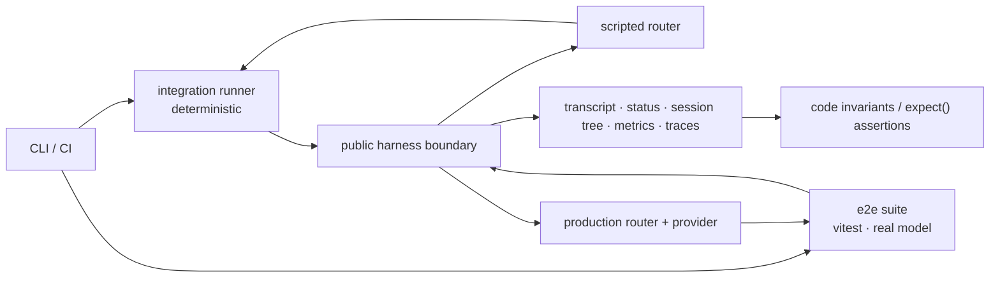

# Harness evaluation

This specification defines two evaluation tracks with separate model
boundaries and gate policies. The integration tests replace the production
router with a scripted worker and verify harness contracts deterministically.
The e2e tests use the production router/provider path with a pinned model and
verify scenario-specific outcomes and resource usage. The tracks share
identifiers and artifact conventions; they do not share an oracle or execution
policy.

## Architecture

| Track | Model boundary | Primary oracle | Version 1 execution |
|---|---|---|---|
| [Integration tests](integration-e2e.md) | Scripted `router::*` implementation | Code assertions over public, durable evidence | Pull-request regression coverage |
| [E2E tests](agent-quality.md) | Production router, provider, and pinned model | Explicit code assertions over harness-built evidence assets, plus raw metrics | Scheduled real-model runs |

Both invoke `harness::send` through the SDK function-call shape
`trigger({ function_id, payload })`. The harness enqueues `harness-turn`
internally. Neither track writes private harness state or invokes
`harness::turn` as a continuation API.

## Version 1 scope

| Capability | Role in version 1 |
|---|---|
| Durable harness turn loop, public send/status APIs, lifecycle triggers, transcript persistence | Platform contracts consumed by both tracks |
| Deterministic integration runner, scenario compiler, scripted router, recorder, live-contract readiness, typed teardown, and stable/volatile reports | Integration v1 |
| Vitest e2e suite, `harness-test` helpers, session-tree metrics, and complete triggered-work evidence | E2E v1 |
| Offline router cassette capture/import tooling | Outside v1 |
| HarnessBench same-prompt performance comparison and console view | Separate system described in [PR #280](https://github.com/iii-hq/workers/pull/280) |
| Durable production DAG orchestration | Separate [`workflow`](https://github.com/iii-hq/workers/blob/main/workflow/README.md) responsibility |

The integration v1 gate contains C-E2E-001 and C-E2E-002. The e2e v1 gate
contains four real-model tests: plain response, single function, sub-agent
fan-out/fan-in, and triggered work. Each track's acceptance section is
authoritative for its gate.

HarnessBench is outside this specification. It compares one prompt across
model/configuration legs and does not define correctness assertions, multi-turn
scenarios, or release gates. It does not share a run record or public API with
the e2e suite.

The `workflow` worker is also outside this specification. An e2e test
may evaluate it as a dependency, but the suite does not modify its DAG or retry
model. Tests invoke public functions and do not define another orchestration
protocol.

## Conventions

- Platform interfaces are cited as `file:line`; the linked source is the wire
  authority.
- Contracts introduced by these documents carry an explicit `V1` schema or
  version marker.
- `harness::hook::*` names synchronous in-path extension points.
  `harness::turn-completed` is an asynchronous lifecycle trigger.
- Function, Trigger, and Worker refer to the three iii primitives. Function IDs
  use `::`; SDK invocation uses `trigger({ function_id, payload })`.
- Model-visible capabilities are Functions. `tools` is used only for the
  router/provider wire field.
- Missing infrastructure, malformed evidence, or a failed check never becomes
  a passing skip.

## Spec index

- [Integration tests](integration-e2e.md) — isolated deterministic stacks,
  scripted router contracts, evidence, fixtures, CI, and gate policy.
- [E2E tests](agent-quality.md) — vitest authoring, `harness-test`
  helpers, default harness evidence contracts, metrics policy, artifacts, and
  scenario corpus.
- [Rendered presentation](https://iii.dev/roadmap/2026-07-15-harness-evaluation/) —
  non-canonical output derived from these Markdown files.
- [Harness implementation design](https://github.com/iii-hq/workers/blob/main/tech-specs/2026-06-agentic/harness.md) — background
  for the turn loop. Source and golden schemas govern exact wire shapes.
- [iii skill catalog](../../skills/SKILLS.md) — terminology and SDK/config/error
  references used by these specifications.

## Open questions

These questions are outside the version 1 gate:

- Which remote artifact backend and retention policy should replace local/CI
  artifact storage when evaluation runs become a shared service?
- What signing and sandbox guarantees would an agent-authored or held-out
  validator need before participating in a release gate?
- Should the harness persist effective-prompt and peak-context telemetry, or
  should those two dimensions remain trace-only diagnostics? (Sub-agent and
  triggered-work usage is already covered by the default evidence contracts;
  see the e2e metrics policy.)
