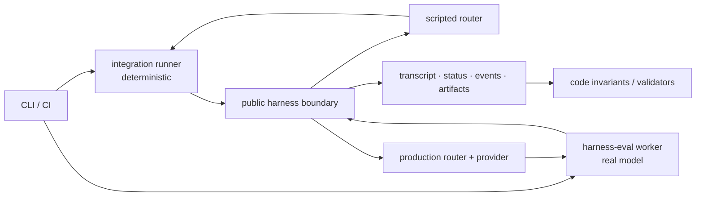

# Harness evaluation

> Status: proposed architecture; implementation has not started.
>
> Last reviewed: 2026-07-15.

The harness needs two evaluation tracks because one model boundary cannot answer
both questions honestly. Integration needs a controlled, deterministic router
to prove public lifecycle and durability contracts. Agent quality needs a
pinned real model and provider path to measure whether representative workflows
actually succeed. The tracks share vocabulary and report conventions, but not
an oracle, execution owner, or release policy.

This split is the load-bearing constraint for the design.

## Architecture

| Track | Model boundary | Primary oracle | First use |
|---|---|---|---|
| [Integration E2E](integration-e2e.md) | Scripted `router::*` implementation | Code assertions over public, durable evidence | Pull-request regression coverage |
| [Agent-quality E2E](agent-quality.md) | Production router, provider, and pinned model | Versioned validators plus raw quality and efficiency metrics | Scheduled and comparison runs |

Both enter ordinary turns through `harness::send`. Neither seeds private
harness state or calls `harness::turn` as a continuation API.

## What exists and what is proposed

| Capability | State |
|---|---|
| Durable harness turn loop, public send/status APIs, lifecycle triggers, transcript persistence | Existing; exact contracts come from current Rust source and golden schemas |
| Deterministic integration runner, scripted router, recorder, cassette format | Proposed here |
| Dedicated `harness-eval` worker, scenario manifest, validator protocol, evaluation report | Proposed here |
| HarnessBench same-prompt performance comparison and console view | Separate in-flight design in [PR #280](https://github.com/iii-hq/workers/pull/280) |
| Durable production DAG orchestration | Existing [`workflow`](https://github.com/iii-hq/workers/blob/main/workflow/README.md) worker; intentionally separate from evaluation orchestration |

HarnessBench remains an independent performance-comparison product. It compares
one prompt across model/configuration legs and intentionally omits correctness
grading, multi-turn scenarios, and release gates. Agent quality owns those
evaluation semantics and does not share a run record or public API with
HarnessBench.

The `workflow` worker remains an independent production orchestrator. It may be
the subject of an evaluation scenario, but `harness-eval` does not extend its
DAG or retry model. External validators, bounded feedback cycles, held-out
grading, and experiment aggregation require a dedicated state machine.

## Conventions

- Current interfaces are cited as `file:line`; the linked source is the wire
  authority.
- New identifiers and schemas are labeled **Proposed** until implemented.
- `harness::hook::*` names synchronous in-path extension points.
  `harness::turn-completed` is an asynchronous lifecycle trigger.
- Model-visible iii capabilities are called functions. `tools` is used only
  when naming the router/provider wire field.
- Missing infrastructure, malformed evidence, or validator failure never
  becomes a passing skip.

## Spec index

- [Integration E2E](integration-e2e.md) — isolated deterministic stacks,
  scripted router contracts, evidence, fixtures, CI, and gate policy.
- [Agent-quality E2E](agent-quality.md) — evaluator APIs, validation protocol,
  lifecycle, trust boundaries, metrics, artifacts, and scenario corpus.
- [Interactive overview](https://iii.dev/roadmap/2026-07-15-harness-evaluation/) —
  one generated deck; the Markdown files remain canonical.
- [Harness implementation design](https://github.com/iii-hq/workers/blob/main/tech-specs/2026-06-agentic/harness.md) — historical
  turn-loop design. Current source and golden schemas govern exact wire shapes.

## Open questions

These do not block the first implementation:

- Which remote artifact backend and retention policy should replace local/CI
  artifact storage when evaluation runs become a shared service?
- What signing and sandbox guarantees are required before an agent-authored
  validator may participate in a release gate?
- Should the harness persist effective-prompt and peak-context telemetry, or
  should those two dimensions remain trace-only diagnostics? (Sub-agent and
  triggered-work usage is already required in evaluation reports; see the
  agent-quality metrics policy.)
