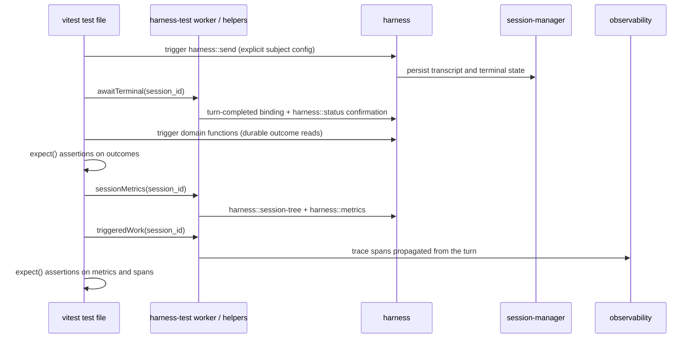

# Harness agent-quality E2E

> Status: proposed architecture; implementation has not started. Revised
> 2026-07-20 after design review: test cases are code (vitest + iii
> primitives), not YAML manifests, and evidence assets are default harness
> API.
>
> Last reviewed: 2026-07-20.

Agent-quality E2E evaluates whether a pinned model, prompt, function catalog,
worker set, and harness build can complete representative user workflows. A
test case is an ordinary vitest test file that drives a real, headless harness
stack through public iii functions, validates durable outcomes with explicit
assertions, and reads quality, reliability, latency, token, and cost evidence
from assets the harness builds by default — without compressing them into an
opaque score.

## Definition

The suite is a normal e2e test suite. A test file calls `trigger` from the iii
SDK against the production `harness::send` path with a pinned real model and
provider, awaits durable terminal state, and grades outcomes with plain
`expect()` assertions over durable records. There is no scenario manifest, no
DSL wrapper around existing APIs, and no evaluator-owned orchestration state
machine: if `send(...)` would just call `trigger('harness::send', ...)`, the
test calls `trigger` directly.

Two supporting pieces exist only where real platform work exists:

- **`@iii/harness-test`** — a helper package with the minimal operations a
  test cannot express as a single public call: awaiting terminal state,
  pulling aggregated session-tree metrics, pulling triggered-work trace
  evidence, and idempotent fixture setup/teardown support.
- **`harness-test` worker** — a shared test-support worker registering the
  capabilities that need engine presence (lifecycle event sink, evidence
  capture, metric aggregation until the harness default API ships). Both
  evaluation tracks use it: this suite headless, and the integration track's
  later console profile drives the console with Playwright while `harness-test`
  scripts harness operations without any LLM call.

A helper never wraps an existing public API; when a helper proves generally
useful, it graduates into default harness API, because the same read paths are
exactly what production orchestration code around the harness needs.

The suite is deliberately separate from two adjacent systems:

- [HarnessBench PR #280](https://github.com/iii-hq/workers/pull/280) remains a
  same-prompt performance comparison product with its own run record and UI.
- [`workflow`](https://github.com/iii-hq/workers/blob/main/workflow/README.md) remains a production DAG orchestrator
  and may be evaluated as a subject. Evaluation does not extend its node model.

`harness::react` is also not an evaluator. It is a lightweight event-to-agent
bridge without the evidence contracts or assertions required here
([`harness/src/functions/react.rs:1`](https://github.com/iii-hq/workers/blob/main/harness/src/functions/react.rs)).

## Decisions

| Area | Version 1 decision |
|---|---|
| Authoring | TypeScript vitest test files; iii primitives and harness functions called directly — no manifest, no wrapper DSL |
| Entry point | `trigger('harness::send', ...)`; never `harness::turn` |
| Runner | vitest against a dedicated headless harness stack; the console is not involved |
| Helpers | `@iii/harness-test` package plus shared `harness-test` worker; a helper exists only where real platform work exists |
| Evidence | Assets the harness builds by default: durable transcript and status, session tree, aggregated metrics, trace spans |
| Traces | First-class evidence; trace-context propagation from the turn is default harness behavior; asserted triggered work fails closed when spans are missing |
| Validation | Explicit `expect()` assertions over durable evidence; custom checks are ordinary iii functions the test calls; no model graders in the suite |
| Budgets | Assertions over reported metrics, vitest deadlines, and `harness::stop` cleanup |
| Isolation | Dedicated evaluation stack in CI and explicitly scoped fixtures |
| Comparison, held-out/generated validators, production eval | Deferred; see Future work |

## Goals

1. Evaluate real workflows through the same harness, router, provider, and
   function boundaries used in production.
2. Make outcome correctness independent from the subject agent's own claims:
   assertions read durable records and fixture state, never the agent's
   self-report.
3. Attribute every subject metric to the full session tree. Sub-agents, hooks,
   and reactive orchestration are the core of the harness; a report that
   counts only the root session's tokens while children and triggered workers
   consume more is not a benchmark.
4. Capture everything else the session triggers in trace evidence: when the
   subject invokes a worker whose orchestration code triggers further work,
   that downstream activity is part of the evaluated session, and its trace
   spans are the evidence the test asserts.
5. Bound time, tokens, network activity, and cost per test.
6. Double as documentation: a developer reading a test file sees exactly how
   to orchestrate a headless harness programmatically, because the file uses
   only iii primitives and harness functions.

## Boundaries

- This is not the deterministic harness integration track; that track controls
  the model boundary and is specified in [integration-e2e.md](integration-e2e.md).
- No model grader runs in the suite. All grading is explicit code; an LLM is
  only ever the subject, never the judge.
- No console. Headless stack only; console coverage belongs to the integration
  track's Playwright profile.
- No dedicated production/runtime evaluation feature. Evaluating production
  runs is pulling the same default assets — metrics, traces, transcript — by
  session id; that follows from this design and is tracked elsewhere.
- It does not require exact function trajectories when several valid solutions
  exist.
- It does not add peak-context or effective-prompt telemetry to the harness.
  Those two dimensions remain unavailable unless separately designed.
- It does not exclude the session tree. Sub-agent, hook, and triggered-work
  usage is read from public evidence; a partial sum is never asserted as the
  subject total.

## Existing contracts consumed

The following are shipped contracts, not proposals.

| Contract | Source | Required behavior |
|---|---|---|
| `harness::send` | [`harness/src/functions/send.rs:69`](https://github.com/iii-hq/workers/blob/main/harness/src/functions/send.rs) | Accepts `session_id?`, message, model, provider, idempotency key, session init, and frozen options. `accepted` is always true on success; `merged`, `queued`, and `deduplicated` are present only when true. |
| Prompt strategy | [`harness/src/functions/send.rs:31`](https://github.com/iii-hq/workers/blob/main/harness/src/functions/send.rs), [`harness/src/prompt/mod.rs:18`](https://github.com/iii-hq/workers/blob/main/harness/src/prompt/mod.rs) | `enrich` is the default; `override` replaces the built-in prompt. A test records the selected strategy in its subject object. |
| `harness::status` | [`harness/src/functions/status.rs:12`](https://github.com/iii-hq/workers/blob/main/harness/src/functions/status.rs) | Returns current turn/status/counters/children/queue/result, or JSON `null` for an unknown session. It does not return a transcript. |
| `session::messages` | [`session-manager/src/functions/messages.rs:10`](https://github.com/iii-hq/workers/blob/main/session-manager/src/functions/messages.rs) | Returns the active path oldest-first with cursor pagination; readers follow `next_cursor` to completion. |
| Lifecycle IDs and filters | [`harness/src/events.rs:26`](https://github.com/iii-hq/workers/blob/main/harness/src/events.rs) | IDs are `harness::turn-started`, `harness::turn-completed`, and `harness::message-queued`; binding filters accept only `session_id?` and `parent_session_id?`. |
| Completion payload | [`harness/src/events.rs:310`](https://github.com/iii-hq/workers/blob/main/harness/src/events.rs) | Includes session/turn/status/timestamp plus optional `result`, `result_error`, `reason`, parent, and reactive depth. It is not a full transcript or `TurnRecord`. |
| Event fan-out | [`harness/src/events.rs:7`](https://github.com/iii-hq/workers/blob/main/harness/src/events.rs) | `Void` delivery is at-least-once and unordered. Durable status and transcript are the recovery authority; `awaitTerminal` confirms against them. |
| `harness::stop` | [`harness/src/functions/stop.rs:12`](https://github.com/iii-hq/workers/blob/main/harness/src/functions/stop.rs) | Accepts session id and optional turn id, cascades to live children, and returns whether a non-terminal turn is stopping. |
| Public/internal boundary | [`harness/src/functions/mod.rs:32`](https://github.com/iii-hq/workers/blob/main/harness/src/functions/mod.rs) | `harness::turn` and `harness::function::{trigger,resolve}` are internal loop plumbing. |
| Usage and cost | [`harness/src/types/message.rs:39`](https://github.com/iii-hq/workers/blob/main/harness/src/types/message.rs) | Persisted assistant messages can supply tokens and cost. Peak context is not persisted in the turn record. |
| Browser evidence | [`browser/src/functions/mod.rs:42`](https://github.com/iii-hq/workers/blob/main/browser/src/functions/mod.rs) | Tests read console/network evidence directly through `browser::*`; cursor and dropped-entry semantics apply, and `dropped > 0` is never converted into a pass. |

The harness status field `validation_retries` counts output-contract repair
attempts inside a turn. Suite-level feedback loops are ordinary test code and
must not reuse that term.

## Proposed harness evidence contracts

The harness builds and exposes evaluation evidence as part of its default
behavior and API — the same assets the console tracks and displays (total
spans, total errors, total tokens, total turns) and the same reads production
orchestration code needs. Two public read contracts are required before this
suite can attribute metrics restart-safely; both use versioned request/response
shapes and deny unknown fields.

| Function | Request | Response |
|---|---|---|
| `harness::session-tree` | `SessionTreeRequestV1` | `SessionTreeResponseV1` |
| `harness::metrics` | `SessionMetricsRequestV1` | `SessionMetricsResponseV1` |

```ts
interface SessionTreeRequestV1 {
  root_session_id: string
}

interface SessionTreeResponseV1 {
  root_session_id: string
  sessions: Array<{
    session_id: string
    parent_session_id?: string
    parent_turn_id?: string
    depth: number
  }>
  complete: boolean
}

interface SessionMetricsRequestV1 {
  root_session_id: string
}

interface SessionMetricsResponseV1 {
  root_session_id: string
  complete: boolean               // false when the tree or any transcript is unavailable
  totals: SessionUsageTotalsV1    // summed over the whole session tree
  by_session: SessionUsageV1[]    // per-session breakdown, root first
}

interface SessionUsageTotalsV1 {
  sessions: number
  turns: number
  function_calls: number
  function_call_errors: number    // calls whose persisted result is an error
  input_tokens?: number
  output_tokens?: number
  cache_read_tokens?: number
  cache_write_tokens?: number
  reasoning_tokens?: number
  cost_usd?: number
}

interface SessionUsageV1 {
  session_id: string
  parent_session_id?: string
  depth: number                   // 0 for the root subject session
  turns: number
  function_calls: number
  function_call_errors: number
  input_tokens?: number
  output_tokens?: number
  cache_read_tokens?: number
  cache_write_tokens?: number
  reasoning_tokens?: number
  cost_usd?: number
}
```

`harness::session-tree` is the recovery authority for subject-session
membership: the harness persists each parent-child relation before the child
becomes runnable and includes the root at depth zero plus every
dispatcher-linked or reactive descendant. `complete: false` means the harness
cannot prove the set is exhaustive. `harness::metrics` aggregates persisted
usage over that tree; it never returns a partial sum as a total — when any
descendant transcript is unavailable it sets `complete: false` and helpers
refuse to grade it.

Trace-context propagation is likewise default behavior, not an evaluation
feature: the harness propagates the subject turn's trace context to every
function call, sub-agent turn, hook, and triggered handler, so work the
session causes in other workers is attributable from spans. Until
`harness::metrics` ships, the `harness-test` worker may implement the same
aggregation over `harness::session-tree` and `session::messages`; the shape is
identical and the implementation moves into the harness without changing
tests.

## Architecture



`awaitTerminal` treats lifecycle events as the low-latency signal and durable
status as the authority: it accepts duplicate and out-of-order deliveries and
always confirms terminal state through `harness::status` before returning.

## Test authoring

A test file is the complete definition of a case: subject configuration,
prompt sequence, fixtures, assertions, and budgets.

```ts
import { test, expect, beforeAll, afterAll } from 'vitest'
import { readFile } from 'node:fs/promises'
import { trigger } from '@iii/sdk'
import { awaitTerminal, sessionMetrics, triggeredWork, runId } from '@iii/harness-test'

const RUN = runId()   // stack-scoped identity supplied by the launcher

let fixture: { namespace: string; setup_digest: string }

beforeAll(async () => {
  fixture = await trigger('eval-fixture::store::setup', {
    profile: 'store-orders-v1',
    idempotency_key: `${RUN}:store-orders:setup`,
  })
})

afterAll(async () => {
  await trigger('eval-fixture::store::teardown', {
    namespace: fixture.namespace,
    setup_digest: fixture.setup_digest,
    idempotency_key: `${RUN}:store-orders:teardown`,
  })
})

test('order refund flow', async () => {
  const subject = {
    model: 'pinned-provider-model',
    provider: 'pinned-provider',
    options: {
      system_prompt: await readFile('./prompts/support-agent.md', 'utf8'),
      system_prompt_strategy: 'override',
      functions: { allow: ['database::query', 'state::get', 'email::send'], deny: [], expose: 'native' },
    },
  }

  // the harness API as-is: system prompt, model, and function policy all exist on send
  const { session_id } = await trigger('harness::send', {
    ...subject,
    message: 'Find order #4512 and check if it is eligible for a refund.',
    idempotency_key: `${RUN}:refund:1`,
  })
  await awaitTerminal(session_id)

  await trigger('harness::send', {
    ...subject,
    session_id,
    message: 'It is eligible — process the refund and notify the customer.',
    idempotency_key: `${RUN}:refund:2`,
  })
  await awaitTerminal(session_id)

  // durable outcomes graded with plain assertions
  const refunds = await trigger('database::query', {
    sql: 'select * from refunds where order_id = 4512',
  })
  expect(refunds).toHaveLength(1)

  // helpers only where real platform work exists
  const metrics = await sessionMetrics(session_id)   // session-tree + metrics contracts
  expect(metrics.totals.function_call_errors).toBe(0)
  expect(metrics.totals.cost_usd!).toBeLessThan(5)

  const triggered = await triggeredWork(session_id)  // trace spans propagated from the turn
  expect(triggered.function_call_errors).toBe(0)
})
```

Authoring rules:

- **Only public API.** A test uses `trigger` on public iii and harness
  functions plus the helper package. Anything that would wrap a single
  existing call in a nicer name is rejected in review.
- **Explicit subject, reused verbatim.** Current harness defaults are resolved
  again on every `harness::send`, so a multi-send test cannot rely on omitted
  options staying stable. The subject object pins model, provider, prompt
  strategy, and every option once, and every send spreads that same object.
  A test that relies on a harness default sends exactly once.
- **Prompt sequences are sequential sends.** Each scripted message is a
  `harness::send` into the same session after `awaitTerminal` for the prior
  turn. Feedback loops — resending guidance until an outcome check passes —
  are ordinary bounded loops in test code, with the bound visible in the file.
- **Deterministic identity.** Every idempotency key, fixture key, and state
  key derives from the launcher-supplied run id plus a test-local suffix, so
  a retried test run cannot double-apply side effects.
- **Cleanup is mandatory.** Helpers track every session a test creates;
  `afterEach` calls `harness::stop` for any session that is not terminal, and
  a vitest timeout bounds every test. Token and cost ceilings are assertions
  over reported metrics — post-turn checks that may overshoot by one bounded
  turn, never hard preemption.
- **Custom checks are functions.** A reusable domain check (for example
  `validation::store::refund-persisted`) is an ordinary registered iii
  function the test calls with `trigger` and asserts on, not a validator
  protocol with its own lifecycle.

## Fixtures

Fixture setup and teardown are ordinary iii functions with idempotent,
run-scoped requests, called from vitest hooks as shown above. A fixture
profile provisions isolated namespaces (database, state, filesystem, browser
session) and returns a `namespace` plus `setup_digest`; teardown receives both
and is safe to repeat. Setup failure fails the suite before any subject send;
teardown failure fails the run and retains the namespace for inspection. Each
fixture adapter must prove its own tenant isolation before it can be shared
between test files.

## Metrics policy

| Dimension | Source | Version 1 status |
|---|---|---|
| Required outcome checks | `expect()` over durable records and fixture state | Gating |
| Transcript turns and function calls | `harness::metrics`, summed over the session tree | Asserted per test |
| Function-call errors | Persisted call results with an error outcome; error-status trace spans for triggered work | Asserted per test, with per-session breakdown |
| Input/output/cache/reasoning tokens and cost | `harness::metrics` totals from persisted assistant usage | Asserted per test |
| Descendant sessions (sub-agents) | `harness::session-tree` | Gating: an incomplete tree fails the test, never a partial sum |
| Session-triggered work (hooks, reactive orchestration) | Trace spans propagated from the subject turn | First-class: a test asserting triggered work fails closed when spans are missing or dropped |
| Wall time | Test and message timestamps | Reported |
| Peak context and effective prompt | Not durably exposed today | Unsupported in v1 |

Subject metrics cover the whole session tree, never the root session alone.
`sessionMetrics` throws a typed error when `complete` is false on either
contract, so a test can never grade a partial sum; `triggeredWork` does the
same when trace evidence is absent or entries were dropped. Missing traces,
provider outage, browser `dropped > 0`, and malformed evidence are test
failures, never passes. Subject cost and wall time are separate from any
fixture or check overhead the test itself spends.

## Stack, CI, and artifacts

The suite runs against a dedicated headless evaluation stack: real engine,
harness, session-manager, context-manager, queue, and the production
router/provider path with pinned models. CI boots the stack with isolated data
directories, records component identity in `stack.json`, and runs the suite
with a scoped provider key. Real-model runs are scheduled and on-demand, not a
pull-request gate, until repeated runs establish variance.

Helpers persist evidence as they run:

```text
target/agent-quality/<run_id>/
  stack.json
  results.json                  # vitest reporter output
  tests/<test-id>/
    sends.json                  # every send request/response pair
    status.json
    session-tree.json
    metrics.json
    transcript.json             # all pages, all sessions in the tree
    triggered-spans.json
    evidence/                   # test-written domain evidence
```

CI publishes `results.json` for every run and uploads full evidence for
non-pass runs with 14-day retention. Successful verbose artifacts may be
discarded after the compact results and referenced digests are verified.

## Initial scenario corpus

Start with a small diagnosable corpus; each row is one test file:

| Family | Required outcome |
|---|---|
| Plain response | Durable final text with no duplicate assistant entry |
| Single function | Allowed target executes once and its result reaches the next generation |
| Parallel functions | Independent calls finish without loss or duplication |
| Sub-agent fan-out/fan-in | Children complete, the parent waits for all required results, and every child's usage appears in `by_session` |
| Multi-prompt conversation | Each scripted send follows the prior terminal turn; the final state reflects every input in order |
| Persistent workflow | External records match processed fixture items exactly |
| Triggered work | Declared reactive orchestration is visible in trace spans and error-free |
| Browser workflow | URL, DOM, network, console, and screenshot evidence agree |
| Recovery | A dependency failure is surfaced and bounded rather than hidden |

## Future work

Deferred deliberately; none of it blocks v1, and the first three become
possible — not redesigned — because the default assets exist.

- **Baseline/candidate comparison.** Paired scheduling, per-dimension deltas,
  and eligibility rules for comparing two subject configurations. The raw
  assets already allow manual comparison of two runs; the machinery
  (randomized pair order, paired mean/median deltas, identity digests) waits
  until repeated single-subject runs establish variance.
- **Held-out and generated validators.** Checks invisible to the subject, and
  checks generated from a frozen goal by a pinned model, need their own trust
  and isolation design before any release authority. Out of v1 entirely.
- **Production/runtime evaluation.** Evaluating a production session is
  pulling its metrics, traces, and transcript by session id and grading them —
  the same reads this suite uses. No dedicated feature is added here; the
  discussion continues elsewhere.
- **An orchestrator worker.** A durable `harness-eval` worker (long-running
  runs, comparison legs at scale, retry-safe run records) is justified only by
  a measured need that a CI test run cannot meet.

## Verification and acceptance

The implementation must cover:

- JSON Schema/golden tests for `harness::session-tree` and `harness::metrics`,
  including `complete: false` on expired history and unavailable transcripts;
- `awaitTerminal` against duplicate, missing, out-of-order, and conflicting
  completion events, always confirming through durable status;
- metric aggregation over nested sub-agent trees with per-session breakdown
  totals, and a typed throw — never a partial sum — on an incomplete tree or
  unreachable descendant transcript;
- triggered-work accounting that fails closed when spans are missing or
  dropped;
- fixture setup/teardown repeated under the same idempotency key without
  double-applying side effects;
- session cleanup: a test that times out leaves no non-terminal session behind
  after `afterEach` runs `harness::stop`;
- secret hygiene: provider keys and evaluator credentials never appear in
  persisted evidence;
- one real-model corpus test passing end-to-end headless through public
  boundaries only.

The first prototype is successful when a real-model test completes through
public harness boundaries, its metrics cover a session tree with at least one
sub-agent, a triggered-work assertion fails closed when spans are withheld,
and no infrastructure failure can produce green.

## Delivery sequence

1. Publish and implement `harness::session-tree` and `harness::metrics`, and
   make trace-context propagation from the turn default harness behavior.
2. Create the `harness-test` worker and `@iii/harness-test` helpers:
   `awaitTerminal`, `sessionMetrics`, `triggeredWork`, fixture support.
3. Stand up the headless CI stack profile with pinned real models and scoped
   keys.
4. Land the first corpus tests: plain response, single function, sub-agent
   attribution.
5. Add fixture profiles with idempotent setup/teardown and isolation proofs.
6. Run the corpus on a schedule without release gating to characterize noise.
7. Converge the integration track's console profile onto `harness-test`
   (Playwright driving the console; scripted harness operations, no LLM).

## Related material

- [Harness integration E2E](integration-e2e.md)
- [Harness architecture](https://github.com/iii-hq/workers/blob/main/harness/architecture/README.md)
- [`harness::send`](https://github.com/iii-hq/workers/blob/main/harness/src/functions/send.rs)
- [Lifecycle events](https://github.com/iii-hq/workers/blob/main/harness/src/events.rs)
- [`session::messages`](https://github.com/iii-hq/workers/blob/main/session-manager/src/functions/messages.rs)
- [Workflow worker](https://github.com/iii-hq/workers/blob/main/workflow/README.md)
