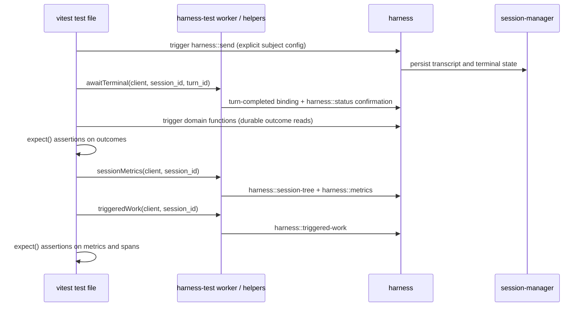

# Harness E2E tests

The E2E test suite executes workflow tests against a fixed subject configuration:
model ID, provider route, system prompt, function catalog, worker artifacts, and
harness artifact. Each vitest file invokes public iii functions, asserts durable
domain state and harness state, and records latency, token, cost, session-tree,
and trace evidence. Version 1 does not compute an aggregate quality score.

## Definition

Tests call `worker.trigger` from `iii-sdk` with the SDK request shape
`{ function_id, payload }`. Subject turns enter through `harness::send` with a
pinned provider/model pair. Tests wait for the returned `session_id` and
`turn_id` to reach durable terminal state, then evaluate `expect()` assertions.
There is no scenario manifest, wrapper DSL, or evaluator-owned state machine.

All calls made directly by the test use synchronous invocation. Tests do not
submit subject turns with `TriggerAction.Void()` or
`TriggerAction.Enqueue(...)`; the harness queue and any application-level
enqueue behavior remain part of the subject path.

Version 1 defines two test-support components:

- **`@iii/harness-test`** — a helper package with operations a
  test cannot express as a single public call: awaiting terminal state,
  pulling aggregated session-tree metrics, pulling triggered-work trace
  evidence, explicit session cleanup tracking, and idempotent fixture
  setup/teardown support.
- **`harness-test` worker** — a shared test-support worker registering the
  capabilities that need engine presence: a lifecycle event sink and
  test-scoped evidence capture. Metrics and triggered-work reads use the
  versioned harness APIs defined below.

A helper never renames or wraps a single existing public call. Default platform
reads belong in the harness API; helpers only coordinate lifecycle signals,
pagination, completeness checks, artifact persistence, and test cleanup.

The following systems are outside the suite boundary:

- [HarnessBench PR #280](https://github.com/iii-hq/workers/pull/280) defines
  same-prompt performance comparison with a separate run record and UI.
- [`workflow`](https://github.com/iii-hq/workers/blob/main/workflow/README.md)
  defines DAG execution and may be included in the subject worker set. The
  suite does not extend its node model.

`harness::react` maps events to agent turns and does not expose the evidence
contracts or assertions required by this suite
([`harness/src/functions/react.rs:1`](https://github.com/iii-hq/workers/blob/main/harness/src/functions/react.rs)).

## Decisions

| Area | Version 1 decision |
|---|---|
| Authoring | TypeScript vitest test files; iii primitives and harness functions called directly — no manifest, no wrapper DSL |
| Entry point | `worker.trigger({ function_id: 'harness::send', payload })`; never `harness::turn` |
| Runner | vitest against a dedicated headless harness stack; the console is not involved |
| Helpers | `@iii/harness-test` package plus `harness-test` worker for multi-call coordination and evidence collection |
| Evidence | Durable transcript/status plus `harness::session-tree`, `harness::metrics`, and `harness::triggered-work` |
| Traces | Gating evidence for triggered-work tests; incomplete, open, malformed, or dropped spans fail the test |
| Validation | `expect()` assertions over durable evidence; reusable checks are registered iii functions; model graders are excluded |
| Budgets | Assertions over reported metrics, vitest deadlines, and `harness::stop` cleanup |
| Isolation | Dedicated evaluation stack in CI and explicitly scoped fixtures |
| Comparison, held-out/generated validators, production eval | Outside version 1 |

## Functional requirements

1. Execute every case through the configured harness, router, provider, and
   registered Function boundaries.
2. Make outcome correctness independent from the subject agent's own claims:
   assertions read durable records and fixture state, never the agent's
   self-report.
3. Aggregate tokens, cost, turns, and function-call counts over the complete
   root-and-descendant session tree.
4. Associate hooks, triggers, sub-agents, and downstream worker calls with the
   subject trace and reject incomplete trace evidence.
5. Bound time, tokens, and cost per test.

## Boundaries

- This is not the deterministic integration-test track; that track controls
  the model boundary and is specified in [integration-e2e.md](integration-e2e.md).
- LLM execution is limited to subject turns. Validators are deterministic code.
- Console rendering and browser interaction are excluded. The suite runs
  headless; UI coverage uses a separate Playwright profile.
- Production-session evaluation is excluded. Version 1 runs dedicated test
  sessions and reads evidence by root session ID.
- It does not require exact function trajectories when several valid solutions
  exist.
- It does not add peak-context or effective-prompt telemetry to the harness.
  Those two dimensions remain unavailable unless separately designed.
- Metrics cover the complete root-and-descendant session tree. Hook and
  triggered-work evidence comes from the trace contract; partial data cannot be
  asserted as the subject total.

## Platform contracts consumed

The version 1 suite consumes the following platform contracts without changing
them.

| Contract | Source | Required behavior |
|---|---|---|
| `harness::send` | [`harness/src/functions/send.rs:92`](https://github.com/iii-hq/workers/blob/main/harness/src/functions/send.rs) | Accepts `session_id?`, message, model, provider, idempotency key, session init, and frozen options. `accepted` is always true on success; `merged`, `queued`, and `deduplicated` are present only when true. |
| Prompt strategy | [`harness/src/functions/send.rs:31`](https://github.com/iii-hq/workers/blob/main/harness/src/functions/send.rs), [`harness/src/prompt/mod.rs:18`](https://github.com/iii-hq/workers/blob/main/harness/src/prompt/mod.rs) | `enrich` is the default; `override` replaces the built-in prompt. A test records the selected strategy in its subject object. |
| `harness::status` | [`harness/src/functions/status.rs:24`](https://github.com/iii-hq/workers/blob/main/harness/src/functions/status.rs) | Returns current turn/status/counters/children/queue/result, or JSON `null` for an unknown session. It does not return a transcript. |
| `session::messages` | [`session-manager/src/functions/messages.rs:10`](https://github.com/iii-hq/workers/blob/main/session-manager/src/functions/messages.rs) | Returns the active path oldest-first with cursor pagination; readers follow `next_cursor` to completion. |
| Lifecycle IDs and filters | [`harness/src/events.rs:26`](https://github.com/iii-hq/workers/blob/main/harness/src/events.rs) | IDs are `harness::turn-started`, `harness::turn-completed`, and `harness::message-queued`; binding filters accept only `session_id?` and `parent_session_id?`. |
| Completion payload | [`harness/src/events.rs:311`](https://github.com/iii-hq/workers/blob/main/harness/src/events.rs) | Includes session/turn/status/timestamp plus optional `result`, `result_error`, `reason`, parent, and reactive depth. It is not a full transcript or `TurnRecord`. |
| Event fan-out | [`harness/src/events.rs:7`](https://github.com/iii-hq/workers/blob/main/harness/src/events.rs) | `Void` delivery is at-least-once and unordered. Durable status and transcript are the recovery authority; `awaitTerminal` confirms against them. |
| `harness::stop` | [`harness/src/functions/stop.rs:12`](https://github.com/iii-hq/workers/blob/main/harness/src/functions/stop.rs) | Accepts session id and optional turn id, cascades to live children, and returns whether a non-terminal turn is stopping. |
| Public/internal boundary | [`harness/src/functions/mod.rs:32`](https://github.com/iii-hq/workers/blob/main/harness/src/functions/mod.rs) | `harness::turn` and `harness::function::{trigger,resolve}` are internal loop plumbing. |
| Usage and cost | [`harness/src/types/message.rs:39`](https://github.com/iii-hq/workers/blob/main/harness/src/types/message.rs) | Persisted assistant messages can supply tokens and cost. Peak context is not persisted in the turn record. |
| Browser evidence | [`browser/src/functions/mod.rs:42`](https://github.com/iii-hq/workers/blob/main/browser/src/functions/mod.rs) | Tests read console/network evidence directly through `browser::*`; cursor and dropped-entry semantics apply, and `dropped > 0` is never converted into a pass. |

The harness status field `validation_retries` counts output-contract repair
attempts inside a turn. Suite-level feedback loops are ordinary test code and
must not reuse that term.

## Version 1 harness evidence contracts

The harness exposes three public read contracts for restart-safe evidence
attribution. Requests and responses are versioned and reject unknown fields.

| Function | Request | Response |
|---|---|---|
| `harness::session-tree` | `SessionTreeRequestV1` | `SessionTreeResponseV1` |
| `harness::metrics` | `SessionMetricsRequestV1` | `SessionMetricsResponseV1` |
| `harness::triggered-work` | `TriggeredWorkRequestV1` | `TriggeredWorkResponseV1` |

```ts
interface SessionTreeRequestV1 {
  root_session_id: string
}

interface SessionTreeResponseV1 {
  root_session_id: string
  sessions: Array<{
    session_id: string
    parent_session_id?: string
    parent_turn_id?: string
    depth: number
  }>
  complete: boolean
}

interface SessionMetricsRequestV1 {
  root_session_id: string
}

interface SessionMetricsResponseV1 {
  root_session_id: string
  complete: boolean               // false when the tree or any transcript is unavailable
  totals: SessionUsageTotalsV1    // summed over the whole session tree
  by_session: SessionUsageV1[]    // per-session breakdown, root first
}

interface SessionUsageTotalsV1 {
  sessions: number
  turns: number
  function_calls: number
  function_call_errors: number    // calls whose persisted result is an error
  input_tokens?: number
  output_tokens?: number
  cache_read_tokens?: number
  cache_write_tokens?: number
  reasoning_tokens?: number
  cost_usd?: number
}

interface SessionUsageV1 {
  session_id: string
  parent_session_id?: string
  depth: number                   // 0 for the root subject session
  turns: number
  function_calls: number
  function_call_errors: number
  input_tokens?: number
  output_tokens?: number
  cache_read_tokens?: number
  cache_write_tokens?: number
  reasoning_tokens?: number
  cost_usd?: number
}

interface TriggeredWorkRequestV1 {
  root_session_id: string
}

interface TriggeredWorkResponseV1 {
  root_session_id: string
  complete: boolean               // false when trace storage cannot establish exhaustive coverage
  dropped: number                 // exporter, storage, or response-cap drops
  open_spans: number              // matching spans without a terminal record
  trace_ids: string[]
  root_span_ids: string[]         // one subject-turn root for each included trace
  spans: Array<{
    trace_id: string
    span_id: string
    parent_span_id?: string
    worker_id: string
    kind: "function" | "hook" | "trigger" | "sub_agent"
    function_id?: string
    session_id?: string
    turn_id?: string
    status: "ok" | "error" | "cancelled"
    started_at: string
    ended_at: string
  }>
}
```

`harness::session-tree` is the recovery authority for subject-session
membership: the harness persists each parent-child relation before the child
becomes runnable and includes the root at depth zero plus every
dispatcher-linked or reactive descendant. `complete: false` means the harness
cannot establish that the set is exhaustive. `harness::metrics` aggregates
persisted usage over that tree; it never returns a partial sum as a total — when
any descendant transcript is unavailable it sets `complete: false` and helpers
refuse to grade it.

Trace-context propagation is default harness behavior: the harness propagates
the subject turn's trace context to every function call, sub-agent turn, hook,
and triggered handler. `harness::triggered-work` returns the complete retained
span set rooted at the subject turns for the root session after its session
tree is terminal.
It sets `complete: true` only when the trace backend reports no ingestion or
query truncation, `dropped` is zero, and every matching span is closed. Results
are ordered by `started_at`, then `span_id`; timestamps are diagnostic and do
not determine correctness. The response omits arbitrary span attributes and
payloads so evaluation artifacts do not acquire a second secret-bearing data
surface.

The `triggeredWork(client, root_session_id)` helper polls this contract until
`complete` or its deadline. It throws a typed evidence error when the deadline
expires, `dropped > 0`, `open_spans > 0`, a non-root parent reference is
missing, `root_span_ids` does not identify exactly one subject-turn root per
trace, or a span is malformed. A test may assert on function IDs, worker IDs,
kinds, status, and parentage only after that completeness check succeeds.

## Architecture



`awaitTerminal(client, session_id, turn_id)` treats lifecycle events as the
low-latency signal and durable status as the authority. It accepts duplicate
and out-of-order deliveries, ignores terminal events for other turns in the
same session, and confirms the requested turn's terminal state through
`harness::status` before returning. `sessionMetrics` and `triggeredWork` also
receive the client explicitly; helpers never create a hidden SDK connection.

`createSessionRegistry(client)` returns test-local bookkeeping with idempotent
`track(session_id)` and `stopNonTerminal()` operations. Cleanup reads durable
status, invokes `harness::stop` only for non-terminal sessions, confirms the
terminal result, and throws if any tracked session cannot be stopped or
confirmed before the cleanup deadline.

## Test authoring

A test file is the complete definition of a case: subject configuration,
prompt sequence, fixtures, assertions, and budgets.

```ts
import { readFile } from 'node:fs/promises'
import { registerWorker } from 'iii-sdk'
import { afterAll, afterEach, beforeAll, expect, test } from 'vitest'
import {
  awaitTerminal,
  createSessionRegistry,
  runId,
  sessionMetrics,
  triggeredWork,
} from '@iii/harness-test'

type SendResponse = { session_id: string; turn_id: string }
type StoreFixture = { namespace: string; setup_digest: string }

const RUN = runId()   // stack-scoped identity supplied by the launcher
const TEST_TIMEOUT_MS = 120_000
const iii = registerWorker(process.env.III_URL!, {
  workerName: `agent-quality-${RUN}`,
  invocationTimeoutMs: 30_000,
})
const sessions = createSessionRegistry(iii)

let fixture: StoreFixture | undefined

beforeAll(async () => {
  fixture = await iii.trigger<Record<string, string>, StoreFixture>({
    function_id: 'eval-fixture::store::setup',
    payload: {
      profile: 'store-orders-v1',
      idempotency_key: `${RUN}:store-orders:setup`,
    },
  })
})

afterAll(async () => {
  try {
    if (fixture) {
      await iii.trigger({
        function_id: 'eval-fixture::store::teardown',
        payload: {
          namespace: fixture.namespace,
          setup_digest: fixture.setup_digest,
          idempotency_key: `${RUN}:store-orders:teardown`,
        },
      })
    }
  } finally {
    await iii.shutdown()
  }
})

afterEach(async () => {
  await sessions.stopNonTerminal()
})

test('single function refund', async () => {
  const subject = {
    model: 'pinned-provider-model',
    provider: 'pinned-provider',
    options: {
      system_prompt: await readFile('./prompts/support-agent.md', 'utf8'),
      system_prompt_strategy: 'override',
      functions: { allow: ['orders::refund'], deny: [], expose: 'native' },
    },
  }

  const first = await iii.trigger<Record<string, unknown>, SendResponse>({
    function_id: 'harness::send',
    payload: {
      ...subject,
      message: 'Order #4512 is eligible. Refund it once and report completion.',
      idempotency_key: `${RUN}:refund:1`,
    },
  })
  sessions.track(first.session_id)
  await awaitTerminal(iii, first.session_id, first.turn_id)

  // durable outcomes graded with plain assertions
  const refunds = await iii.trigger<{ sql: string }, unknown[]>({
    function_id: 'database::query',
    payload: { sql: 'select * from refunds where order_id = 4512' },
  })
  expect(refunds).toHaveLength(1)

  // composed evidence reads
  const metrics = await sessionMetrics(iii, first.session_id)
  expect(metrics.totals.function_call_errors).toBe(0)
  expect(metrics.totals.cost_usd!).toBeLessThan(5)

  const triggered = await triggeredWork(iii, first.session_id)
  expect(triggered.spans.every((span) => span.status === 'ok')).toBe(true)
}, TEST_TIMEOUT_MS)
```

Authoring rules:

- **Only public API.** A test uses `worker.trigger` on public iii and harness
  functions plus the helper package. A helper that only renames a single
  existing call is outside the package contract.
- **Explicit subject, reused verbatim.** Harness defaults are resolved
  again on every `harness::send`, so a multi-send test cannot rely on omitted
  options staying stable. The subject object pins model, provider, prompt
  strategy, and every option once, and every send spreads that same object.
  A test that relies on a harness default sends exactly once.
- **Prompt sequences are sequential sends.** Each scripted message is a
  `harness::send` into the same session after `awaitTerminal` for the prior
  turn. Feedback loops are bounded loops in test code; the maximum iteration
  count is declared in the test file.
- **Deterministic identity.** Every idempotency key, fixture key, and state
  key derives from the launcher-supplied run id plus a test-local suffix, so
  a retried test run cannot double-apply side effects.
- **Cleanup is mandatory.** Every `harness::send` response is added immediately
  to a test-local session registry. `afterEach` calls `harness::stop` for each
  tracked session that is not terminal, and a vitest timeout bounds every test.
  Token and cost ceilings are assertions over reported metrics — post-turn
  checks that may overshoot by one bounded turn, never hard preemption.
- **Custom checks are functions.** A reusable domain check (for example
  `validation::store::refund-persisted`) is a registered iii
  function the test calls with `worker.trigger` and asserts on, not a validator
  protocol with its own lifecycle.

## Fixtures

Fixture setup and teardown are iii functions with idempotent, run-scoped
requests, called from vitest hooks as shown above. A fixture
profile provisions isolated namespaces (database, state, filesystem, browser
session) and returns a `namespace` plus `setup_digest`; teardown receives both
and is safe to repeat. Setup failure fails the suite before any subject send;
teardown failure fails the run and retains the namespace for inspection. Each
fixture adapter must pass its tenant-isolation contract test before it can be
shared between test files.

## Metrics policy

| Dimension | Source | Version 1 status |
|---|---|---|
| Required outcome checks | `expect()` over durable records and fixture state | Gating |
| Transcript turns and function calls | `harness::metrics`, summed over the session tree | Asserted per test |
| Function-call errors | Persisted call results with an error outcome; error-status trace spans for triggered work | Asserted per test, with per-session breakdown |
| Input/output/cache/reasoning tokens and cost | `harness::metrics` totals from persisted assistant usage | Asserted per test |
| Descendant sessions (sub-agents) | `harness::session-tree` | Gating: an incomplete tree fails the test, never a partial sum |
| Session-triggered work (hooks, reactive orchestration) | `harness::triggered-work` | Gating; incomplete, open, malformed, or dropped spans fail the test |
| Wall time | Test and message timestamps | Reported |
| Peak context and effective prompt | No version 1 contract | Unsupported in v1 |

Subject metrics cover the whole session tree, never the root session alone.
`sessionMetrics` throws a typed error when `complete` is false on either
contract, so a test can never grade a partial sum; `triggeredWork` does the
same when trace evidence is incomplete, open, malformed, or dropped. Missing
traces, provider outage, browser `dropped > 0`, and malformed evidence are test
failures, never passing results. Subject cost and wall time are separate from
any fixture or check overhead the test itself spends.

## Failure classification

Every failed test writes `failure.json` with one or more records. Records are
ordered by phase; cleanup failures are appended without replacing the original
failure.

```ts
type AgentQualityFailureClassV1 =
  | "setup_error"
  | "subject_error"
  | "assertion_failure"
  | "evidence_error"
  | "timeout"
  | "cleanup_error"

interface AgentQualityFailureReportV1 {
  schema_version: "1"
  failures: Array<{
    class: AgentQualityFailureClassV1
    phase: "setup" | "send" | "await" | "collect" | "assert" | "cleanup"
    code?: string
    function_id?: string
    message: string
  }>
}
```

| Class | Condition |
|---|---|
| `setup_error` | Required worker, function, trigger type, provider route, model version, fixture, or config entry is unavailable before the first subject send |
| `subject_error` | `harness::send` or the terminal turn reports a non-timeout execution failure or cancellation |
| `assertion_failure` | A domain-state, transcript, metric, or span assertion evaluates false after complete evidence collection |
| `evidence_error` | An evidence response is missing, malformed, incomplete, open, truncated, or reports dropped entries |
| `timeout` | The subject exceeds the turn/test deadline, including engine `timeout` or SDK `TIMEOUT` during send/await |
| `cleanup_error` | Fixture teardown, `harness::stop`, terminal confirmation, or SDK shutdown fails or exceeds its deadline |

The reporter preserves exact engine/SDK `code` values. `function_not_found` or
`FORBIDDEN` on a required setup probe is `setup_error`; it is not retried as a
transient error. The test layer does not retry subject calls automatically.
Timeout or transport retry is permitted only inside the configured subject
runtime and only for idempotent operations; the effective retry policy is part
of `stack.json`. Failure messages are credential-redacted before persistence.
Any failure record makes the vitest test and CI run fail.

## Stack, CI, and artifacts

The suite runs against a dedicated headless evaluation stack: real engine,
harness, session-manager, context-manager, queue, observability storage, and the
production router/provider path with pinned models. A pinned model is an
immutable provider model version, not a floating alias. `stack.json` records
the requested and resolved model IDs, provider route, harness and worker
digests, prompt digest, function-catalog digest, and configuration digest. CI
boots the engine from a run-local `config.yaml`, binds the private worker
WebSocket listener to `127.0.0.1`, and assigns run-scoped ports and adapter data
directories. Observability uses full sampling for subject traces; a sampled or
dropped trace cannot satisfy `complete: true`. Provider credentials enter only
through an environment allowlist and are not copied into config or artifacts.
When managed workers are used, `stack.json` also records the `iii.lock` digest.
Version 1 real-model runs are scheduled and on-demand; they are not a required
pull-request gate.

The custom vitest reporter writes this run index. Paths are relative to the run
directory, digests are SHA-256 of exact file bytes, and schemas reject unknown
fields.

```ts
interface AgentQualityResultV1 {
  schema_version: "1"
  run_id: string
  stack_path: string
  stack_sha256: string
  tests: Array<{
    test_id: string
    status: "pass" | "fail"
    failure_path?: string
    artifact_sha256: Record<string, string>
  }>
}
```

Helpers persist evidence as they run:

```text
target/agent-quality/<run_id>/
  stack.json
  results.json                  # AgentQualityResultV1
  tests/<test-id>/
    sends.json                  # every send request/response pair
    failure.json                # present on failure; ordered failure records
    status.json
    session-tree.json
    metrics.json
    transcript.json             # all pages, all sessions in the tree
    triggered-spans.json
    evidence/                   # test-written domain evidence
```

CI publishes `results.json` for every run and uploads full evidence for
non-pass runs with 14-day retention. Passing-run evidence may be deleted after
the compact result and referenced digests are verified.

## Version 1 scenario corpus

Version 1 contains exactly four real-model test files:

| Family | Required outcome |
|---|---|
| Plain response | Durable final text with no duplicate assistant entry |
| Single function | Allowed target executes once and its result reaches the next generation |
| Sub-agent fan-out/fan-in | Children complete, the parent waits for all required results, and every child's usage appears in `by_session` |
| Triggered work | Declared reactive orchestration is visible in trace spans and error-free |

## Post-v1 scenario expansion

| Family | Required outcome |
|---|---|
| Parallel functions | Independent calls finish without loss or duplication |
| Multi-prompt conversation | Each scripted send follows the prior terminal turn; the final state reflects every input in order |
| Persistent workflow | External records match processed fixture items exactly |
| Browser workflow | URL, DOM, network, console, and screenshot evidence agree |
| Recovery | A dependency failure is surfaced and bounded rather than hidden |

## Excluded capabilities

The following capabilities are outside version 1:

- **Baseline/candidate comparison.** Paired scheduling, per-dimension deltas,
  and eligibility rules for comparing two subject configurations. The raw
  assets already allow manual comparison of two runs; the machinery
  (randomized pair order, paired mean/median deltas, identity digests) waits
  until repeated single-subject runs establish variance.
- **Held-out and generated validators.** Checks invisible to the subject, and
  checks generated from a frozen goal by a pinned model, need their own trust
  and isolation design before any release authority.
- **Production/runtime evaluation.** Evaluating a production session is
  pulling its metrics, traces, and transcript by session id and grading them —
  the same reads this suite uses. No dedicated production-evaluation feature
  belongs to version 1.
- **An orchestrator worker.** A durable `harness-eval` worker (long-running
  runs, comparison legs at scale, retry-safe run records) is outside version 1.

## Verification and acceptance

The implementation must cover:

- JSON Schema and serialization tests for `AgentQualityResultV1` and
  `AgentQualityFailureReportV1`, including artifact digest verification;
- JSON Schema/golden tests for `harness::session-tree`, `harness::metrics`, and
  `harness::triggered-work`, including incomplete history, unavailable
  transcripts, open spans, dropped spans, and malformed parentage;
- `awaitTerminal` against duplicate, missing, out-of-order, and conflicting
  completion events, keying on both session and turn and always confirming
  through durable status;
- metric aggregation over nested sub-agent trees with per-session breakdown
  totals, and a typed throw — never a partial sum — on an incomplete tree or
  unreachable descendant transcript;
- triggered-work accounting that fails closed when spans are missing or
  dropped;
- fixture setup/teardown repeated under the same idempotency key without
  double-applying side effects;
- session cleanup: a test that times out leaves no non-terminal session behind
  after `afterEach` runs `harness::stop`;
- failure classification for setup, subject, assertion, evidence, timeout, and
  cleanup phases, including preservation of `function_not_found`, `FORBIDDEN`,
  `timeout`, and `TIMEOUT` codes;
- no test-layer retry of a subject invocation, and no retry of a non-idempotent
  operation;
- secret hygiene: provider keys and evaluator credentials never appear in
  persisted evidence;
- all four version 1 corpus tests passing end-to-end headless through public
  boundaries only.

Version 1 is accepted when all four real-model tests complete through public
harness boundaries, session-tree metrics include at least one sub-agent, the
triggered-work test verifies complete error-free descendant spans, withheld spans
produce `evidence_error`, and every infrastructure failure produces a non-pass
classification.

## Implementation order

1. Publish and implement `harness::session-tree`, `harness::metrics`, and
   `harness::triggered-work`, including trace-context propagation from the
   subject turn.
2. Create the `harness-test` worker and `@iii/harness-test` helpers:
   `awaitTerminal`, `sessionMetrics`, `triggeredWork`, session registry, and
   fixture support.
3. Stand up the headless CI stack profile with pinned real models and scoped
   keys.
4. Add the complete version 1 corpus: plain response, single function,
   sub-agent attribution, and triggered work.
5. Add fixture profiles with idempotent setup/teardown and isolation proofs.
6. Run the corpus on a schedule without release gating to characterize noise.

## Related material

- [Harness integration tests](integration-e2e.md)
- [Harness architecture](https://github.com/iii-hq/workers/blob/main/harness/architecture/README.md)
- [`harness::send`](https://github.com/iii-hq/workers/blob/main/harness/src/functions/send.rs)
- [Lifecycle events](https://github.com/iii-hq/workers/blob/main/harness/src/events.rs)
- [`session::messages`](https://github.com/iii-hq/workers/blob/main/session-manager/src/functions/messages.rs)
- [Workflow worker](https://github.com/iii-hq/workers/blob/main/workflow/README.md)
- [iii core primitives](../../skills/iii-core-primitives/SKILL.md)
- [iii SDK reference](../../skills/iii-sdk-reference/SKILL.md)
- [iii engine configuration](../../skills/iii-engine-config/SKILL.md)
- [iii error handling](../../skills/iii-error-handling/SKILL.md)
