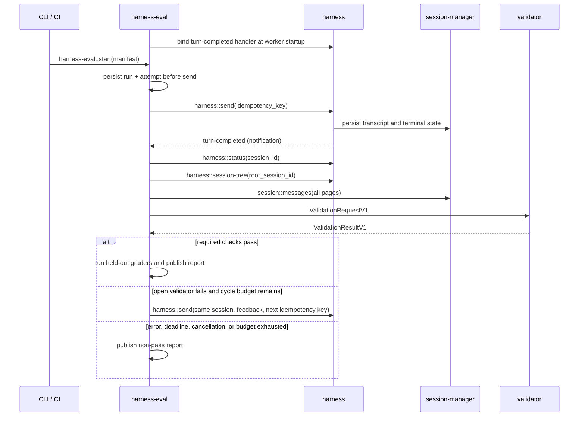

# Harness agent-quality E2E

> Status: proposed architecture; implementation has not started.
>
> Last reviewed: 2026-07-19.

Agent-quality E2E evaluates whether a pinned model, prompt, function catalog,
worker set, and harness build can complete representative user workflows. It
uses the production router/provider path, validates durable outcomes, and
reports quality, reliability, latency, token use, and cost without compressing
them into an opaque score.

## Definition

The first implementation is one dedicated `harness-eval` worker with internal
modules for orchestration, validation, evidence, and reports. A thin CLI or CI
launcher loads a strict scenario manifest, starts a run, and collects the
report. Splitting those modules into separate workers requires a measured
scaling or permission need.

The evaluator is deliberately separate from two adjacent systems:

- [HarnessBench PR #280](https://github.com/iii-hq/workers/pull/280) remains a
  same-prompt performance comparison product with its own run record and UI.
- [`workflow`](https://github.com/iii-hq/workers/blob/main/workflow/README.md) remains a production DAG orchestrator
  and may be evaluated as a subject. Evaluation does not extend its node model.

`harness::react` is also not an evaluator. It is a lightweight event-to-agent
bridge without the experiment record, validation protocol, retries, or report
aggregation required here ([`harness/src/functions/react.rs:1`](https://github.com/iii-hq/workers/blob/main/harness/src/functions/react.rs)).

## Decisions

| Area | Version 1 decision |
|---|---|
| Execution owner | One `harness-eval` worker with a durable run record |
| Entry point | `harness::send`; never `harness::turn` |
| Completion | Global evaluator binding to `harness::turn-completed`, plus status and durable session-tree reconciliation |
| Continuation | A new `harness::send` in the same session after terminal state |
| Manifest | Strict YAML parsed into a versioned JSON shape; unknown fields rejected |
| Validators | Provided validators may gate; agent-authored validators are experimental |
| Grading | Required deterministic checks plus raw dimensions; no composite score |
| Artifacts | Local run directory in v1, uploaded by CI according to result policy |
| Isolation | Dedicated evaluation stack in CI and explicitly scoped fixtures |

## Goals

1. Evaluate real workflows through the same harness, router, provider, and
   function boundaries used in production.
2. Make outcome correctness independent from the subject agent's own claims.
3. Compare a candidate and baseline with pinned inputs and visible raw metrics.
4. Survive duplicate, missing, and out-of-order completion notifications.
5. Bound feedback cycles, time, tokens, network activity, and cost.
6. Retain enough evidence to explain every non-pass classification.
7. Attribute every subject metric to the full session tree and to the work the
   session triggers. Sub-agents, hooks, and reactive orchestration are the
   core of the harness; a report that counts only the root session's tokens
   while children and triggered workers consume more is not a benchmark.
8. Capture everything else the session triggers in the run's traces: when the
   subject invokes a worker whose orchestration code triggers further work,
   that downstream activity is part of the evaluated session, not an invisible
   side effect, and its trace spans are the evidence the evaluator verifies.

## Boundaries

- This is not the deterministic harness integration track; that track controls
  the model boundary and is specified in [integration-e2e.md](integration-e2e.md).
- The integration runner does not implement, host, or partially emulate this
  evaluator. Agent-quality delivery starts only after the public durable
  `harness::session-tree` dependency below exists.
- It does not require exact function trajectories when several valid solutions
  exist.
- It does not permit a model grader to override a required deterministic or
  safety failure.
- It does not make agent-authored validators a release authority in v1.
- It does not add peak-context or effective-prompt telemetry to the harness.
  Those two dimensions remain unavailable unless separately designed.
- It does not exclude the session tree. Sub-agent, hook, and triggered-work
  usage is aggregated from public evidence and required in every report; see
  the metrics policy below.

## Existing contracts consumed

The following are shipped contracts, not proposals.

| Contract | Source | Required behavior |
|---|---|---|
| `harness::send` | [`harness/src/functions/send.rs:69`](https://github.com/iii-hq/workers/blob/main/harness/src/functions/send.rs) | Accepts `session_id?`, message, model, provider, idempotency key, session init, and frozen options. `accepted` is always true on success; `merged`, `queued`, and `deduplicated` are present only when true. |
| Prompt strategy | [`harness/src/functions/send.rs:31`](https://github.com/iii-hq/workers/blob/main/harness/src/functions/send.rs), [`harness/src/prompt/mod.rs:18`](https://github.com/iii-hq/workers/blob/main/harness/src/prompt/mod.rs) | `enrich` is the default; `override` replaces the built-in prompt. A scenario must record the selected strategy. |
| `harness::status` | [`harness/src/functions/status.rs:12`](https://github.com/iii-hq/workers/blob/main/harness/src/functions/status.rs) | Returns current turn/status/counters/children/queue/result, or JSON `null` for an unknown session. It does not return a transcript. |
| `session::messages` | [`session-manager/src/functions/messages.rs:10`](https://github.com/iii-hq/workers/blob/main/session-manager/src/functions/messages.rs) | Returns the active path oldest-first with cursor pagination; the evaluator follows `next_cursor` to completion. |
| Lifecycle IDs and filters | [`harness/src/events.rs:26`](https://github.com/iii-hq/workers/blob/main/harness/src/events.rs) | IDs are `harness::turn-started`, `harness::turn-completed`, and `harness::message-queued`; binding filters accept only `session_id?` and `parent_session_id?`. |
| Completion payload | [`harness/src/events.rs:310`](https://github.com/iii-hq/workers/blob/main/harness/src/events.rs) | Includes session/turn/status/timestamp plus optional `result`, `result_error`, `reason`, parent, and reactive depth. It is not a full transcript or `TurnRecord`. |
| Event fan-out | [`harness/src/events.rs:7`](https://github.com/iii-hq/workers/blob/main/harness/src/events.rs) | `Void` delivery is at-least-once and unordered. Durable status and transcript are the recovery authority. |
| `harness::stop` | [`harness/src/functions/stop.rs:12`](https://github.com/iii-hq/workers/blob/main/harness/src/functions/stop.rs) | Accepts session id and optional turn id, cascades to live children, and returns whether a non-terminal turn is stopping. |
| Public/internal boundary | [`harness/src/functions/mod.rs:32`](https://github.com/iii-hq/workers/blob/main/harness/src/functions/mod.rs) | `harness::turn` and `harness::function::{trigger,resolve}` are internal loop plumbing. |
| Usage and cost | [`harness/src/types/message.rs:39`](https://github.com/iii-hq/workers/blob/main/harness/src/types/message.rs) | Persisted assistant messages can supply tokens and cost. Peak context is not persisted in the turn record. |
| Browser evidence | [`browser/src/functions/mod.rs:42`](https://github.com/iii-hq/workers/blob/main/browser/src/functions/mod.rs) | Current APIs use `browser::*`; proposed `validation::browser::*` functions are adapters, not aliases for shipped functions. Console/network reads include cursor and dropped-entry semantics. |

The harness status fields named `validation_retries` count output-contract repair
attempts. Evaluator feedback cycles use `cycle` and must not reuse that term.

## Proposed durable session-tree dependency

Agent-quality v1 requires one new public harness read contract. Lifecycle
events remain the low-latency notification path, but they cannot reconstruct a
completed descendant whose events were missed while the evaluator was down.
`harness::session-tree` is therefore the recovery authority for subject-session
membership:

| Function | Request | Response |
|---|---|---|
| `harness::session-tree` | `SessionTreeRequestV1` | `SessionTreeResponseV1` |

```ts
interface SessionTreeRequestV1 {
  root_session_id: string
}

interface SessionTreeResponseV1 {
  root_session_id: string
  sessions: Array<{
    session_id: string
    parent_session_id?: string
    parent_turn_id?: string
    depth: number
  }>
  complete: boolean
}
```

The response includes the root at depth zero and every dispatcher-linked or
reactive descendant. The harness persists each parent-child relation before the
child becomes runnable, and retains the index for at least the evaluation
artifact-retention period. `complete: false` means the harness cannot prove the
set is exhaustive, for example because required history predates the index or
has expired. The evaluator reconciles observed lifecycle events against this
response before validation; an absent child, a conflicting parent relation, or
`complete: false` makes the attempt `inconclusive`. Until this contract ships,
restart-safe full-tree attribution is not implementable.

## Architecture and lifecycle



The worker registers one unfiltered completion handler before accepting runs.
It ignores events whose `(session_id, turn_id)` do not match a running attempt.
This avoids the race between a fast turn and per-run binding. A periodic
reconciler polls every non-terminal attempt, so a missed callback cannot strand
a run.

## Proposed worker surface

All types in this section are **Proposed**. They use `protocol_version: "1"`,
deny unknown fields, and publish JSON Schema through normal iii registration.

| Function | Request | Response |
|---|---|---|
| `harness-eval::start` | `StartEvaluationRequestV1` | `{ protocol_version: "1", run_id, status: "running" }` |
| `harness-eval::status` | `{ protocol_version: "1", run_id }` | `EvaluationStatusV1` |
| `harness-eval::report` | `{ protocol_version: "1", run_id }` | `EvaluationReportV1`; error until terminal |
| `harness-eval::cancel` | `{ protocol_version: "1", run_id, reason? }` | `{ protocol_version: "1", run_id, cancelled }`; idempotent |
| `harness-eval::artifact::put` | `ArtifactPutRequestV1` | `ArtifactRefV1`; evaluator and validators only |
| `harness-eval::artifact::get` | `ArtifactGetRequestV1` | `ArtifactGetResponseV1`; evaluator and validators only |

```ts
type ProtocolVersion = "1"
type RunState = "running" | "completed" | "cancelled" | "failed"
type AttemptState = "pending" | "running" | "validating" | "terminal"
type ResultStatus = "pass" | "fail" | "error" | "inconclusive"

interface SingleEvaluationStartV1 {
  protocol_version: ProtocolVersion
  scenario: ScenarioV1
  attempts?: number             // default 1; range 1..10
}

interface ComparisonEvaluationStartV1 {
  protocol_version: ProtocolVersion
  comparison: {
    baseline: ScenarioV1
    candidate: ScenarioV1
    attempts: number            // range 1..10 for each leg
    randomization_seed: string
  }
}

type StartEvaluationRequestV1 = SingleEvaluationStartV1 | ComparisonEvaluationStartV1

interface EvaluationStatusV1 {
  protocol_version: ProtocolVersion
  run_id: string
  scenarios: Array<{ leg: "single" | "baseline" | "candidate"; scenario_id: string }>
  state: RunState
  result?: ResultStatus         // present only when terminal
  attempts: Array<{
    attempt: number
    leg: "single" | "baseline" | "candidate"
    state: AttemptState
    cycle: number
    session_id?: string
    turn_id?: string
    result?: ResultStatus
  }>
  started_at: number
  updated_at: number
}

interface EvaluationReportV1 extends EvaluationStatusV1 {
  manifest_digests: Array<{ leg: "single" | "baseline" | "candidate"; sha256: string }>
  subjects: Array<{ leg: "single" | "baseline" | "candidate"; snapshot: SubjectSnapshotV1 }>
  validator_results: ValidatorResultRecordV1[]
  metrics: AttemptMetricRecordV1[]
  comparison?: {
    randomization_seed: string
    schedule: Array<{
      pair: number
      baseline_attempt: number
      candidate_attempt: number
      first: "baseline" | "candidate"
    }>
    baseline: { scenario_id: string; manifest_digest: string }
    candidate: { scenario_id: string; manifest_digest: string }
    dimensions: DimensionSummaryV1[]
  }
  generated_validators?: GeneratedValidatorRecordV1[]
  artifact_refs: ArtifactRefV1[]
}

interface SubjectSnapshotV1 {
  model: string
  provider?: string
  system_prompt_strategy: "enrich" | "override"
  system_prompt_sha256?: string
  function_catalog_sha256: string
  worker_versions: Record<string, string>
}

interface MetricSetV1 {
  subject: {
    wall_time_ms: number
    sessions: number                // the root plus every descendant session
    turns: number                   // summed over the session tree
    function_calls: number          // summed over the session tree
    function_call_errors: number    // calls whose persisted result is an error, summed over the session tree
    input_tokens?: number           // all token and cost fields: summed over the session tree
    output_tokens?: number
    cache_read_tokens?: number
    cache_write_tokens?: number
    reasoning_tokens?: number
    cost_usd?: number
    by_session: SessionUsageV1[]    // per-session breakdown, root first
  }
  triggered?: {
    function_calls: number          // handler executions rooted in the subject turn, outside its sessions
    function_call_errors: number    // those executions whose trace span records an error status
    spans: number                   // matching trace spans
    complete: boolean               // false when trace evidence is absent or entries were dropped
  }
  evaluation: { wall_time_ms: number; input_tokens?: number; output_tokens?: number; cost_usd?: number }
}

interface SessionUsageV1 {
  session_id: string
  parent_session_id?: string
  depth: number                     // 0 for the root subject session
  turns: number
  function_calls: number
  function_call_errors: number
  input_tokens?: number
  output_tokens?: number
  cache_read_tokens?: number
  cache_write_tokens?: number
  reasoning_tokens?: number
  cost_usd?: number
}

interface AttemptMetricRecordV1 {
  leg: "single" | "baseline" | "candidate"
  attempt: number
  pair?: number                    // required for baseline/candidate; absent for single
  values: MetricSetV1
}

interface ValidatorResultRecordV1 {
  result: ValidationResultV1
  aggregation: "terminal" | "superseded" | "advisory"
  superseded_by_cycle?: number     // present only when aggregation is "superseded"
}

interface DimensionSummaryV1 {
  id: string
  unit: string
  aggregation: "paired_mean_delta"
  eligible_pairs: number
  total_pairs: number
  baseline?: { mean: number; median: number }  // present when eligible_pairs > 0
  candidate?: { mean: number; median: number }
  delta?: { mean: number; median: number }
  eligible: boolean
}

interface GeneratedValidatorRecordV1 {
  id: string                      // assigned function id: eval-gen::<run_id>::<slug>
  goal_sha256: string
  code_sha256: string
  source_ref: ArtifactRefV1
  generator: { model: string; provider?: string }
}

interface ArtifactPutRequestV1 {
  protocol_version: "1"
  run_id: string
  access_token: string
  media_type: string
  content_base64: string         // decoded body is limited to 16 MiB in v1
}

interface ArtifactGetRequestV1 {
  protocol_version: "1"
  run_id: string
  access_token: string
  uri: string
}

interface ArtifactGetResponseV1 {
  protocol_version: "1"
  media_type: string
  sha256: string
  bytes: number
  content_base64: string
}
```

The start request is a tagged union: exactly one of `scenario` or `comparison`
is present. A comparison is one run, not a reference to an already completed
baseline. For pair `n`, the evaluator derives one bit from
`SHA-256(randomization_seed + ":" + n)`; an even low bit runs baseline first
and an odd low bit runs candidate first. The two legs run consecutively before
the next pair. This produces a reproducible interleaved schedule, and the
schedule is persisted before the first attempt starts.

Result aggregation applies the following precedence to terminal decisions:
`error` if any required terminal result is `error`; otherwise `fail` if any is
`fail`; otherwise `inconclusive` if any is `inconclusive`; otherwise `pass`.
A failure from an open validator configured with `continue_with_feedback` is
recorded as an intermediate failed cycle while continuation budget remains; it
does not independently fail the attempt. The latest terminal result for that
validator supersedes its earlier remediable results when aggregating the
attempt, while every raw cycle result remains in the report with an explicit
`terminal`, `superseded`, or `advisory` aggregation label. If continuation
budget is exhausted before the validator passes, its latest failure becomes
terminal and the attempt is `fail`. Errors, held-out failures, and safety
failures are terminal and are never superseded. The precedence rule folds
terminal validator decisions into an attempt and attempts into a run.
Therefore every required validator in every attempt must finish with a passing
terminal decision for the run to pass. Validators with `required: false` are
advisory and never affect the aggregate, but their result and advisory label
remain in the report.
Exhausting a declared subject budget is `fail`; an evaluator, fixture,
provider, or validator dependency failure is `error`; explicit cancellation is
`state: "cancelled"` with `result: "inconclusive"`; and an evaluator invariant
failure is `state: "failed"` with `result: "error"`.

Stable bus errors use `code: message` text with these codes:

| Code | Meaning |
|---|---|
| `harness-eval/invalid_manifest` | Schema, range, function policy, or dependency declaration is invalid |
| `harness-eval/run_not_found` | No durable run exists for the supplied id |
| `harness-eval/run_not_terminal` | A final report was requested before terminal state |
| `harness-eval/budget_exceeded` | A declared time, token, cost, attempt, or cycle budget ended the run |
| `harness-eval/dependency` | Harness, transcript, validator, browser, trace, or artifact dependency failed |
| `harness-eval/internal` | Evaluator state or invariant failure |

Cancellation looks up every running attempt and calls `harness::stop` with both
its session and turn id. It records the stop response, continues reconciliation
until the attempt is terminal, and makes repeated cancel calls harmless.

## Proposed scenario manifest

The launcher reads strict YAML and sends its JSON representation. References are
resolved and digested before `harness-eval::start`; the worker receives frozen
content, not mutable local paths.

```ts
interface ScenarioV1 {
  protocol_version: "1"
  id: string
  description: string
  subject: SubjectV1
  fixtures: FixtureSpecV1
  dependencies: DependencySpecV1[]
  validators: ValidatorSpecV1[]
  limits: LimitsV1
}

interface SubjectV1 {
  message: string | AgentMessage | (string | AgentMessage)[]
    // existing harness MessageInput contract; an array is an ordered
    // conversation script — each entry sends only after the prior turn
    // reaches terminal state
  model: string
  provider?: string
  continuation: "single_cycle" | "explicit_override"
  system_prompt?: { strategy: "enrich" | "override"; content: string; sha256: string }
  options?: {
    mode?: "plan" | "ask" | "agent"
    max_turns?: number
    thinking_level?: "minimal" | "low" | "medium" | "high" | "xhigh"
    provider_options?: Record<string, unknown>
    output?: { type: "text" } | { type: "json"; schema?: Record<string, unknown> }
    functions?: { allow: string[]; deny: string[]; expose: "agent_trigger" | "native" }
    metadata?: unknown
  }
}

interface FixtureSpecV1 {
  profile: string
  setup_function: string
  teardown_function: string
  setup_timeout_ms: number
  teardown_timeout_ms: number
  subject_capability_ids: string[]
  validator_capability_ids: string[]
}

interface DependencySpecV1 {
  function_id: string
  required: true
  request_schema_sha256?: string
  response_schema_sha256?: string
}

interface ValidatorSpecV1 {
  function_id?: string            // required when source kind is "registered"; forbidden for "generated" — the id is assigned at generation
  version: string
  mode: "provided" | "agent_authored"
  source?: ValidatorSourceV1      // default {kind: "registered"}
  phase: "after_turn" | "final"
  visibility: "open" | "held_out"
  required: boolean
  on_fail: "stop" | "continue_with_feedback"
  timeout_ms: number
  parameters?: Record<string, unknown>
}

type ValidatorSourceV1 =
  | { kind: "registered" }
  | {
      kind: "generated"           // requires mode "agent_authored"; see Generated validators
      goal: string                // frozen generator input, digested with the manifest
      generator: { model: string; provider?: string; max_tokens: number }
      evidence: Array<"fixture_state" | "transcript" | "status" | "traces">
    }

interface LimitsV1 {
  max_cycles: number
  attempt_timeout_ms: number
  max_total_tokens: number
  max_cost_usd: number
  max_browser_actions?: number
  max_network_requests?: number
}
```

```yaml
protocol_version: "1"
id: fan-out-security-scan
description: process every repository file and persist one finding per file

subject:
  message: "Inspect the fixture repository and persist the findings."
  model: pinned-provider-model
  provider: pinned-provider
  continuation: explicit_override
  system_prompt:
    strategy: override
    content: "You are a repository security analyst."
    sha256: "<digest>"
  options:
    mode: agent
    max_turns: 40
    thinking_level: medium
    provider_options: {}
    output: {type: text}
    functions:
      allow: ["state::get", "database::query", "harness::spawn"]
      deny: ["harness-eval::*", "eval-private::*", "eval-gen::*"]
      expose: native
    metadata: {evaluation: true}

fixtures:
  profile: repository-security-v1
  setup_function: eval-fixture::repository::setup
  teardown_function: eval-fixture::repository::teardown
  setup_timeout_ms: 60000
  teardown_timeout_ms: 60000
  subject_capability_ids: [fixture-repository-read, fixture-findings-write]
  validator_capability_ids: [fixture-repository-read, fixture-findings-read]

dependencies:
  - function_id: state::get
    required: true
  - function_id: database::query
    required: true
  - function_id: harness::spawn
    required: true

validators:
  - function_id: validation::workflow::all-files-processed
    version: "1"
    mode: provided
    phase: after_turn
    visibility: open
    required: true
    on_fail: continue_with_feedback
    timeout_ms: 60000
  - function_id: eval-private::workflow::no-duplicate-results
    version: "1"
    mode: provided
    phase: final
    visibility: held_out
    required: true
    on_fail: stop
    timeout_ms: 60000
  - mode: agent_authored
    source:
      kind: generated
      goal: >-
        Every persisted finding references an existing repository file and
        uses only severities from the fixture enum.
      generator: {model: pinned-generator-model, max_tokens: 30000}
      evidence: [fixture_state, transcript]
    version: "1"
    phase: final
    visibility: held_out
    required: false
    on_fail: stop
    timeout_ms: 60000

limits:
  max_cycles: 4
  attempt_timeout_ms: 300000
  max_total_tokens: 100000
  max_cost_usd: 10
  max_network_requests: 0
```

The evaluator lowers a subject to `harness::send` without adding defaults:

| Scenario field | `harness::send` field |
|---|---|
| `message` (the current script entry) | `message` |
| pinned `model` / `provider` | `model` / `provider` |
| session identity | omit `session_id` on cycle 1; use the returned `session_id` on later cycles |
| deterministic cycle digest | `idempotency_key` |
| `system_prompt.content` | `options.system_prompt` |
| `system_prompt.strategy` | `options.system_prompt_strategy` |
| each `options` member | same-named `options` member |

Fixture capability IDs are resolved before the first send. The evaluator adds
only the resolved subject functions to `options.functions.allow`; a requested
function not declared by the fixture or dependency list makes the manifest
invalid. It then snapshots the registered request and response schemas and
stores their digests as the function-catalog digest.

Current harness defaults are resolved again on every new `harness::send`, so a
multi-cycle evaluation cannot truthfully promise to preserve omitted values.
A scenario with `continuation: "explicit_override"` must set an `override`
system prompt and explicitly provide every `options` field shown above,
including `functions`; the evaluator reuses those exact values on every cycle.
A scenario that relies on an omitted option or the built-in prompt must declare
`continuation: "single_cycle"`, set `max_cycles: 1`, and cannot request
`continue_with_feedback`. The manifest validator enforces these rules.

A scenario may supply an ordered conversation script instead of a single
message. The evaluator sends the next entry in the same session only after the
previous turn reaches a terminal status and its after-turn validation
completes. Each scripted send is a cycle and consumes the same `max_cycles`
budget as feedback continuations; when an open validator fails with
`continue_with_feedback`, its feedback cycles run before the next scripted
entry, and the script resumes once the validator passes or the run stops on
budget. A script with more than one entry is a multi-cycle scenario and
therefore requires `continuation: "explicit_override"`; a script longer than
`max_cycles` makes the manifest invalid.

## Proposed fixture and validation protocols

Fixture setup and teardown use these **Proposed** schemas:

```ts
interface FixtureSetupRequestV1 {
  protocol_version: "1"
  run: { run_id: string; scenario_id: string; attempt: number; leg: "single" | "baseline" | "candidate" }
  profile: string
  idempotency_key: string
}

interface FixtureSetupResultV1 {
  protocol_version: "1"
  namespace: string
  setup_digest: string
  capabilities: FixtureCapabilityV1[]
  validator_context: Record<string, unknown>
  evidence: ArtifactRefV1[]
}

interface FixtureCapabilityV1 {
  id: string
  kind: "function" | "browser_session" | "state_namespace" | "database_namespace"
  reference: string
  access: "read" | "write" | "read_write"
}

interface FixtureTeardownRequestV1 {
  protocol_version: "1"
  run: { run_id: string; scenario_id: string; attempt: number; leg: "single" | "baseline" | "candidate" }
  namespace: string
  setup_digest: string
  reason: "completed" | "cancelled" | "failed"
  idempotency_key: string
}

interface FixtureTeardownResultV1 {
  protocol_version: "1"
  cleaned: boolean
  evidence: ArtifactRefV1[]
}
```

Setup runs once per attempt before `harness::send`, using the digest of
`harness-eval:v1:setup:<run_id>:<leg>:<attempt>` as its idempotency key. The
worker persists the request and result before exposing any capability. It
rejects a result whose capability IDs do not exactly cover the manifest lists.
The subject receives only `subject_capability_ids`; validators receive only
`validator_capability_ids`. Teardown runs after validation and before final
publication, with an equally deterministic key. Setup failure is `error` and
does not send a subject turn. Teardown failure is `error`, prevents green, and
retains the namespace and evidence for cleanup. Recovery repeats either call
with the same key.

Every validator implements the same **Proposed** request and response schemas.
The maximum inline response is 1 MiB. Evidence bodies are exchanged through
the artifact functions and returned by reference with a SHA-256 digest. Default
timeout is 60 seconds, bounded by the scenario attempt deadline.

```ts
interface ValidationRequestV1 {
  protocol_version: "1"
  run: { run_id: string; scenario_id: string; leg: "single" | "baseline" | "candidate"; attempt: number; cycle: number }
  subject: { session_id: string; turn_id: string; trace_id?: string }
  validator: { id: string; version: string; mode: "provided" | "agent_authored" }
  fixture: {
    namespace: string
    setup_digest: string
    capabilities: FixtureCapabilityV1[]
    context: Record<string, unknown>
  }
  artifacts: ArtifactAccessV1
  parameters: Record<string, unknown>
  transcript_ref: ArtifactRefV1
}

interface ValidationResultV1 {
  protocol_version: "1"
  run: { run_id: string; scenario_id: string; leg: "single" | "baseline" | "candidate"; attempt: number; cycle: number }
  subject: { session_id: string; turn_id: string }
  validator: { id: string; version: string }
  status: "pass" | "fail" | "error" | "inconclusive"
  checks: Array<{
    id: string
    passed: boolean
    expected?: unknown
    actual?: unknown
  }>
  feedback?: string
  evidence: ArtifactRefV1[]
  metrics: { duration_ms: number; input_tokens?: number; output_tokens?: number; cost_usd?: number }
  error?: { code: string; message: string }
}

interface ArtifactRefV1 {
  uri: string                     // run-relative URI
  media_type: string
  sha256: string
  bytes: number
}

interface ArtifactAccessV1 {
  read_function_id: "harness-eval::artifact::get"
  write_function_id: "harness-eval::artifact::put"
  access_token: string
}
```

Artifact access tokens are random, attempt-scoped, validator-scoped
capabilities. `put` accepts only a token's run and writes a content-addressed
run-relative URI; `get` accepts only URIs granted to that token and verifies
the stored digest before returning bytes. Tokens are never put in the subject
prompt, transcript, metadata, function catalog, or artifact. The evaluator
revokes them after the validator call. The artifact functions are denied to the
subject even if its allow pattern is broad.

`fail` means the subject missed an objective. `error` means the validator or
dependency broke. `inconclusive` means evidence cannot support a decision.
Missing traces, provider outage, browser `dropped > 0`, malformed results, and
validator timeouts are never converted to subject passes.

Validators run in manifest order. The required/advisory aggregation rule in the
worker contract determines the cycle, attempt, and run result. Advisory
failures remain visible but do not change that result.
A held-out validator never contributes function metadata, schema, prompt text,
or feedback to the subject. Only an open validator with
`continue_with_feedback` may create a new cycle.

## Proposed generated validators

A scenario may declare a validator whose implementation does not exist before
the run: `mode: "agent_authored"` with `source.kind: "generated"`. The frozen
manifest carries the generator input — the `goal` text, the pinned generator
model, and the evidence classes the generated code may read — never the code
itself. Generation is an evaluator phase, not a subject capability: the
criterion is authored on the fly, but it is still frozen before the subject
turn it judges. The manifest validator rejects `kind: "generated"` without
`mode: "agent_authored"`, and rejects a `function_id` on a generated entry.

Ordering and identity:

1. Generation runs once per run, after manifest validation and before the
   first attempt's `harness::send`, using the idempotency digest of
   `harness-eval:v1:generate:<run_id>:<validator-index>`.
2. The generator is a separate harness session on the pinned generator model.
   Its input is the validator `goal`, the fixture profile, and the validation
   protocol schemas. It never receives subject output, evaluator or held-out
   grader credentials, or held-out catalog content.
3. The produced source is persisted as an artifact, digested, and recorded in
   the run record before any subject send. The report lists every generated
   validator as a `GeneratedValidatorRecordV1`.
4. A disposable, secret-free validator-host worker registers the code under
   run-scoped ids `eval-gen::<run_id>::<slug>` through normal iii
   registration. The host holds only the manifest's
   `validator_capability_ids` and a validator-scoped artifact token. Teardown
   unregisters the namespace; teardown failure follows the fixture teardown
   rule — non-green, evidence retained.
5. Invocation, request/response schemas, timeouts, and result classification
   are identical to registered validators. A generation failure, a host
   registration failure, or a code-digest mismatch at invocation time is
   `harness-eval/dependency` and classifies the attempt as `error` — never a
   subject pass.

Restart recovery treats persisted generated code as the authority: when code
and digest are persisted, the host re-registers the same bytes; regeneration
happens only when no generation result was persisted, under the same
idempotency key. The evaluator never regenerates a validator after the first
subject send of the run.

Authority follows the agent-authored boundary: in v1 a generated validator
with `required: true` is valid only when the scenario also declares at least
one `provided` required validator — a generated validator is never the sole
gate, and manifest validation rejects a scenario that violates this rule.
`visibility` and `on_fail` behave exactly as for registered validators; the
feedback text of a generated open validator is retained in the report for
audit.

Generator usage — wall time, tokens, and cost — is attributed to
`metrics.evaluation`, never to the subject.

In a comparison run the evaluator generates each validator exactly once from
the frozen goal and uses the same registered code and digest for both legs
and every attempt; legs whose generated code digests differ are ineligible
for comparison.

## Durable state and recovery

The evaluator is the single writer for these records:

```text
harness_eval_run/<run_id>
harness_eval_attempt/<run_id>/<leg>/<attempt>
harness_eval_fixture/<run_id>/<leg>/<attempt>
harness_eval_cycle/<run_id>/<leg>/<attempt>/<cycle>
harness_eval_event/<run_id>/<leg>/<attempt>/<cycle>/<turn_id>
```

`run_id` is random and opaque. Attempt and cycle numbers are monotonic. The send
idempotency key is the SHA-256 digest of
`harness-eval:v1:<run_id>:<leg>:<attempt>:<cycle>`. The event checkpoint key makes
identical completion deliveries no-ops; conflicting terminal payloads produce
`harness-eval/internal` and preserve both payloads as evidence.

The worker persists a cycle before sending. After restart it handles these
states deterministically:

| Durable state | Recovery action |
|---|---|
| Setup request exists, result missing | Repeat fixture setup with the same idempotency key |
| Setup persisted, no cycle | Validate capabilities, then create cycle 1 |
| Cycle exists, no send identity | Repeat `harness::send` with the same idempotency key |
| Session/turn known, non-terminal | Poll `harness::status` until deadline |
| Terminal status, validation missing | Query `harness::session-tree`, require a complete tree, fetch every session transcript page, then run validators |
| Validation persisted, continuation missing | Apply the recorded decision once |
| Attempt terminal, teardown missing | Repeat teardown with the same idempotency key |
| Final report persisted | Return it; never rerun validators implicitly |

Continuation waits for terminal status, reuses the same `session_id`, resends
the fully explicit pinned model/provider/options and `override` prompt, appends
the open validator feedback as a new user-visible evaluation message, and uses
the next deterministic idempotency key. It never calls `harness::turn` or
mutates the transcript directly. Scenarios that rely on any current harness
default are single-cycle, as required by manifest validation.

## Isolation, permissions, and trust

A `run_id` is correlation, not enforcement. CI uses a dedicated engine stack
and isolated data directories. Each fixture adapter must prove its own tenant,
database, filesystem, browser-session, and state-key isolation before it can be
shared between scenarios.

- Subject function policy explicitly denies `harness-eval::*`,
  `eval-private::*`, and `eval-gen::*`.
- Evaluator and held-out grader credentials are not inherited by subject
  workers or shell processes.
- Validators are read-only by default. Active browser validators declare and
  record every action before a separate read-only assertion.
- Artifact writers redact authorization headers, provider credentials, cookies,
  personal data, and environment secrets before persistence.
- Agent-authored validators run only in disposable, secret-free stacks and
  cannot be the sole release gate in v1.
- Attempt wall-clock, cycle, and attempt-count limits are hard: the evaluator
  refuses to start work beyond them, calls `harness::stop` at the deadline, and
  reconciles to a terminal state. Token and cost usage is visible only after a
  model turn; browser and network counts are visible only after an adapter
  action. They are post-turn/action soft ceilings and may overshoot by one
  bounded turn or action. The evaluator checks them before starting the next
  unit, records the overshoot, and never calls them hard limits.

## Metrics and comparison policy

| Dimension | Source | Version 1 status |
|---|---|---|
| Required outcome checks | Validator results | Gating |
| Terminal reliability and cycles | Evaluator run record | Gating/diagnostic |
| Transcript turns and function calls | `session::messages`, summed over the session tree | Reported |
| Function-call errors | Persisted call results with an error outcome in `session::messages`; error-status trace spans for triggered work | Reported, with a per-session breakdown |
| Input/output/cache/reasoning tokens and cost | Persisted assistant usage, summed over the session tree | Reported, with a per-session breakdown |
| Descendant sessions (sub-agents) | Durable `harness::session-tree`, reconciled with completion payloads and lifecycle filters | Gating: an incomplete or conflicting tree is `inconclusive` |
| Session-triggered work (hooks, reactive orchestration) | Trace spans propagated from the subject turn | Required when the scenario declares triggered work |
| Wall time and validator duration | Evaluator and message timestamps | Reported separately |
| Trace/span failures | Observability backend when available | Diagnostic; absence is non-green only when scenario requires it |
| Peak context and effective prompt | Not durably exposed today | Unsupported in v1 |

Subject metrics cover the whole session tree, never the root session alone.
Lifecycle payloads and `parent_session_id` filters discover descendants with
low latency. Before validation, and again after evaluator restart, the
evaluator queries the durable `harness::session-tree` index rooted at the
subject session and reconciles those observations against it. It pages every
indexed transcript and sums persisted usage per session; `by_session` keeps the
breakdown visible. A function call counts toward `function_call_errors` when
its persisted result carries an error outcome; the counter is diagnostic and
reported per session and in the tree total — a nonzero value is not itself a
failure unless a validator or declared budget makes it one. A tree with
`complete: false`, a lifecycle/index conflict, or a descendant transcript that
cannot be fetched makes the attempt `inconclusive`: a partial sum is never
reported as the subject total. Work the
session triggers outside its own sessions — hooks and orchestration code in
other workers — is counted from trace spans propagated from the subject turn,
and a scenario that declares triggered work fails closed when those spans are
absent or dropped.

Subject cost and time are separate from validator/grader overhead. Comparison
eligibility requires identical scenario description, fixture, dependencies,
validators, limits, and attempt count — including, for generated validators,
one shared generation whose code digest is identical across legs. Only
`subject` may differ between the baseline and candidate; each complete manifest
and subject snapshot has its own digest in the report. Reports show raw
candidate/baseline deltas. Required or safety failures are disqualifying and
cannot be offset by lower latency or cost. No weighted composite score gates a
release in v1.

`metrics` contains one `AttemptMetricRecordV1` per attempt. Comparison records
carry both `attempt` and `pair`, and the persisted schedule maps every pair to
its baseline and candidate attempt explicitly. For each dimension, a pair is
eligible only when both legs expose complete evidence for that dimension; no
missing or non-eligible value is imputed. Raw attempt metrics and non-pass
results remain visible even when excluded from a dimension summary. Pair deltas
are candidate minus baseline. Version 1 reports the mean and median for each
leg and for the paired deltas, with `paired_mean_delta` as the primary
aggregation and with eligible and total pair counts. Confidence intervals and
significance gates are not reported until a later policy declares a minimum
sample size and establishes variance. When no pair is eligible, the summary's
baseline, candidate, and delta statistics are absent. For an even number of
eligible pairs, the median is the arithmetic mean of the two central sorted
values. A dimension has `eligible: true` exactly when at least one pair is
eligible and every comparison-wide identity check passes.

Real-model release thresholds are introduced only after repeated runs establish
variance. Comparison attempts use the persisted pair-block schedule defined by
`ComparisonEvaluationStartV1`; model and provider identifiers, prompt digests,
function catalog digests, and worker versions are frozen in the report.

## Artifact layout

```text
target/harness-eval/<run_id>/
  manifest.json
  report.json
  stack.json
  generated-validators/<validator-id>/
    record.json
    source
  attempts/<leg>/<attempt>/
    cycles/<cycle>/
      send-request.json
      send-response.json
      status.json
      transcript.json
      lifecycle-events.json
      validators/<validator-id>.json
      evidence/
  logs/
```

`<leg>` is `single`, `baseline`, or `candidate`. Every `ArtifactRefV1.uri` is
run-relative, starts in an allowed run namespace, rejects absolute paths and
`..` traversal, and cannot replace existing content with a different digest.
Immutable evidence uses content-addressed names.

CI publishes `report.json` for every run. Full evidence and logs are uploaded
for non-pass runs with 14-day retention. Successful verbose artifacts may be
discarded after the compact report and referenced digests are verified.

## Initial scenario corpus

Start with a small diagnosable corpus:

| Family | Required outcome |
|---|---|
| Plain response | Durable final text with no duplicate assistant entry |
| Single function | Allowed target executes once and its result reaches the next generation |
| Parallel functions | Independent calls finish without loss or duplication |
| Sub-agent fan-out/fan-in | Children complete, the parent waits for all required results, and every child's usage is attributed in the report |
| Multi-prompt conversation | Each scripted input sends only after the prior turn is terminal; the final state reflects every input in order |
| Persistent workflow | External records match processed fixture items exactly |
| Browser workflow | URL, DOM, network, console, and screenshot evidence agree |
| Recovery | A dependency failure is surfaced and bounded rather than hidden |
| Prompt comparison | Candidate and baseline use identical frozen inputs and report raw deltas |

Subjective model or visual graders are added only when deterministic state
cannot express the objective. They remain advisory until calibrated against a
human-reviewed set with false-positive/false-negative measurements.

## Verification and acceptance

The evaluator implementation must cover:

- JSON Schema/golden catalog tests for every proposed function and type;
- strict manifest rejection, prompt-strategy mapping, and function-policy tests;
- duplicate, conflicting, missing, and out-of-order completion events;
- restart after run persistence, after send, during validation, and before
  report publication;
- same-session continuation with deterministic idempotency;
- remediable aggregation: an open validator may fail, pass after feedback, and
  leave the attempt green while retaining both raw results; exhausting the
  continuation budget makes the latest failure terminal;
- conversation-script ordering: no scripted entry sends before the prior turn
  is terminal, feedback cycles interleave before the next entry, and a script
  longer than `max_cycles` is rejected;
- session-tree aggregation with nested sub-agents, per-session breakdown
  totals, recovery after all child lifecycle events are missed, reconciliation
  conflicts, `complete: false`, and an unreachable descendant transcript
  forcing `inconclusive`;
- triggered-work accounting: declared reactive orchestration fails closed when
  its trace spans are missing or dropped;
- validator timeout, malformed response, oversized response, and missing
  evidence classifications;
- generated-validator ordering: no subject send before every generated
  validator's code digest is persisted, and regeneration after the first
  subject send is rejected;
- `eval-gen::*` isolation: subject calls into the run-scoped namespace are
  denied even under a broad allow pattern;
- sole-gate rejection: a generated `required` validator without a `provided`
  required peer fails manifest validation;
- comparison digest sharing: legs with differing generated code digests are
  ineligible;
- restart with persisted generated code re-registers byte-identical bytes and
  regenerates only when no generation result exists;
- hidden-grader catalog isolation and prompt-injection attempts;
- browser cursor/drop handling, secret redaction, hard deadline cancellation,
  and one-turn/action soft-ceiling overshoot;
- deterministic report serialization and candidate/baseline eligibility;
- paired comparison reporting maps every metric to its attempt and schedule
  pair and verifies mean, median, eligible-pair, and missing-value behavior;
- baseline, candidate, and single artifacts use disjoint leg-qualified paths,
  and artifact URIs reject traversal and conflicting digest replacement.

The first prototype is successful when a real-model attempt completes through
public harness boundaries, a provided validator can fail then pass after one
bounded feedback cycle, a held-out validator remains invisible to the subject,
and no required validator or evaluator infrastructure failure can produce
green. Advisory validator failures remain visible but do not gate green.

## Delivery sequence

1. Publish and implement the durable `harness::session-tree` read contract.
2. Publish strict scenario, validator, status, and report schemas.
3. Implement the durable evaluator record and `start/status/report/cancel`.
4. Add global completion handling, tree reconciliation, idempotency, and
   restart tests.
5. Add one deterministic state validator and one held-out validator.
6. Add local artifacts, redaction, budgets, and CI collection.
7. Run a small real-model corpus without release gating to characterize noise.
8. Add browser evidence and calibrated subjective graders only where needed.

## Related material

- [Harness integration E2E](integration-e2e.md)
- [Harness architecture](https://github.com/iii-hq/workers/blob/main/harness/architecture/README.md)
- [`harness::send`](https://github.com/iii-hq/workers/blob/main/harness/src/functions/send.rs)
- [Lifecycle events](https://github.com/iii-hq/workers/blob/main/harness/src/events.rs)
- [`session::messages`](https://github.com/iii-hq/workers/blob/main/session-manager/src/functions/messages.rs)
- [Workflow worker](https://github.com/iii-hq/workers/blob/main/workflow/README.md)
