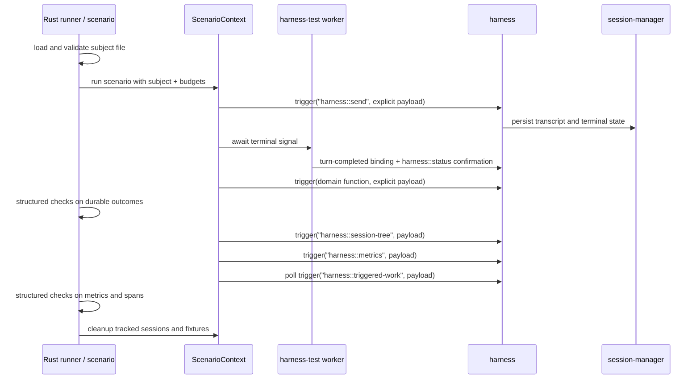

# Harness E2E tests

The E2E test suite executes one scenario corpus against a fixed run subject:
model ID, provider route, system prompt, skill set, worker artifacts, and
harness artifact. Each scenario fixes its function catalog, invokes public iii
functions, asserts durable domain and harness state, and records latency,
token, cost, session-tree, and trace evidence. In team discussion this suite is
also called the **agent-quality**, **E2E**, or **ET/ETE** suite. Version 1 does
not compute an aggregate quality score.

## Definition

Scenarios run in the Rust `harness-agent-quality` binary and invoke public iii
Functions through `ScenarioContext::trigger(function_id, payload)`. The method
delegates the exact function ID and payload to the Rust SDK's synchronous
trigger path. Subject turns enter through `harness::send` with a pinned
provider/model pair. Scenarios wait for the returned `session_id` and `turn_id`
to reach durable terminal state, then run structured Rust checks. There is no
scenario manifest, wrapper DSL, or evaluator-owned state machine.

All calls made directly by a scenario use synchronous invocation. Scenarios do
not submit subject turns with `TriggerAction.Void()` or
`TriggerAction.Enqueue(...)`; the harness queue and any application-level
enqueue behavior remain part of the subject path.

Version 1 defines two evaluation-support components:

- **`harness-agent-quality` crate and binary** — the Rust runner, scenario
  registry, `ScenarioContext`, strict subject loader, evidence collector,
  cleanup coordinator, and artifact reporter. `cargo test` validates these
  deterministic components; real-model corpus execution uses the binary.
- **`harness-test` worker** — a shared test-support worker registering the
  capabilities that need engine presence: a lifecycle event sink and
  scenario-scoped evidence capture. Metrics and triggered-work reads use the
  versioned harness APIs defined below.

`ScenarioContext::trigger` is generic across all iii Functions. It may enforce
deadlines, record redacted request/response artifacts, attach scenario phase,
and preserve SDK/engine error codes; it never recognizes `harness::send`,
injects hidden fields, changes invocation action, or rewrites the payload. A
helper never renames a single public call. Default platform reads belong in the
harness API; helpers only coordinate lifecycle signals, pagination,
completeness checks, artifact persistence, and scenario cleanup.

The following systems are outside the suite boundary:

- [HarnessBench PR #280](https://github.com/iii-hq/workers/pull/280) defines
  same-prompt performance comparison with a separate run record and UI.
- [`workflow`](https://github.com/iii-hq/workers/blob/main/workflow/README.md)
  defines DAG execution and may be included in the subject worker set. The
  suite does not extend its node model.

`harness::react` maps events to agent turns and does not expose the evidence
contracts or assertions required by this suite
([`harness/src/functions/react.rs:1`](https://github.com/iii-hq/workers/blob/main/harness/src/functions/react.rs)).

## Decisions

| Area | Version 1 decision |
|---|---|
| Authoring | Async Rust scenario modules; run-level subject file plus scenario-local prompts, fixtures, structured checks, and budgets; no scenario manifest or wrapper DSL |
| Entry point | `ctx.trigger("harness::send", payload)`; never a `harness_send` helper or `harness::turn` |
| Runner | Dedicated Tokio-based Rust binary against a headless harness stack; `cargo test` covers deterministic runner internals, not real-model corpus orchestration |
| Subject variation | The same corpus runs unchanged against one launcher-supplied subject per run; model, provider, system prompt, skill set, or artifacts may vary between runs |
| Helpers | `ScenarioContext` plus the `harness-test` worker for generic invocation, multi-call coordination, and evidence collection |
| Evidence | Durable transcript/status plus `harness::session-tree`, `harness::metrics`, and `harness::triggered-work` |
| Traces | Required for every scenario; incomplete, open, malformed, or dropped subject traces fail the scenario |
| Validation | Structured Rust checks returning typed failures over durable evidence; reusable domain checks are registered iii functions; model graders are excluded |
| Verdict | Correctness and benchmark measurements come from the same execution; no aggregate quality score |
| Budgets | Checks over reported time, token, cost, call, and error metrics, plus Tokio deadlines and `harness::stop` cleanup |
| Isolation | Dedicated evaluation stack in CI and explicitly scoped fixtures |
| Comparison | Independent baseline/candidate runs are supported; paired scheduling, statistics, and comparison UI are outside version 1 |
| Held-out/generated validators, production eval | Outside version 1 |

## Evaluation model

The E2E suite is a headless real-model evaluation of the harness. The
deterministic integration track uses a scripted model boundary and owns
Console/Playwright coverage; the E2E runner calls `harness::send` through the
generic `ctx.trigger` path and does not require the Console.

One run executes the complete scenario corpus against one pinned subject
configuration. The launcher supplies the provider route, resolved model,
system-prompt bytes and strategy, provider options, exposed skill set, harness
artifact, and worker set. Each scenario supplies its own messages, function
allowlist, fixtures, validators, and budgets. `stack.json` records the resolved
subject and all artifact digests.

The same corpus must be runnable unchanged with another model, system prompt,
skill set, or harness/worker build. Version 1 emits an independent report for
each run. Automated paired scheduling, statistical comparison, and a comparison
UI remain post-v1; two v1 reports already contain the stable identities and raw
measurements needed for manual baseline/candidate comparison.

Each scenario produces two outputs from the same execution:

- a **correctness verdict** based on deterministic assertions over durable
  outcomes and complete evidence;
- a **benchmark observation** containing wall time, tokens, cost, turns,
  function calls and errors, session-tree size, and triggered-work span counts.

Correctness and efficiency are not collapsed into one quality score. Hard
ceilings for time, tokens, cost, calls, or errors may fail a scenario. Ordinary
run-to-run variation below those ceilings remains visible in the report.

Metrics and triggered-work evidence are harness capabilities shared by the runner,
orchestration workers, and the Console. The suite consumes the public
session-keyed harness APIs; context helpers coordinate waiting, pagination,
completeness checks, artifacts, and cleanup only.

Version 1 starts with five materially different real-model scenarios. They
cover a plain response, a durable single-function outcome, a repository
security review using sub-agent fan-out/fan-in, reactive triggered work, and
model-free functional reduction of a large function result before it returns
to the model. Later corpora may add application-building, time-based,
goal-based, proactive, mixed-model, and prompt/skill-retrieval scenarios.

## Functional requirements

1. Execute every case through the configured harness, router, provider, and
   registered Function boundaries.
2. Make outcome correctness independent from the subject agent's own claims:
   assertions read durable records and fixture state, never the agent's
   self-report.
3. Aggregate tokens, cost, turns, and function-call counts over the complete
   root-and-descendant session tree.
4. Associate hooks, triggers, sub-agents, and downstream worker calls with the
   subject trace and reject incomplete trace evidence.
5. Emit a correctness verdict and compact benchmark observation from the same
   scenario execution.
6. Run the corpus unchanged against a different pinned subject configuration.
7. Bound time, tokens, cost, calls, and errors per scenario.

## Boundaries

- This is not the deterministic integration-test track; that track controls
  the model boundary and is specified in [integration-e2e.md](integration-e2e.md).
- LLM execution is limited to subject turns. Validators are deterministic code.
- Console rendering and browser interaction are excluded. The suite runs
  headless; deterministic integration and UI coverage use the separate
  integration/Playwright profile.
- Production-session evaluation is excluded. Version 1 runs dedicated evaluation
  sessions and reads evidence by root session ID.
- It does not require exact function trajectories when several valid solutions
  exist.
- It does not add peak-context or effective-prompt telemetry to the harness.
  Those two dimensions remain unavailable unless separately designed.
- Metrics cover the complete root-and-descendant session tree. Hook and
  triggered-work evidence comes from the trace contract; partial data cannot be
  asserted as the subject total.
- The suite does not define saved-prompt/project UI, provider-prompt fallback,
  or `ask`/`plan` mode behavior. Those product features can change a run subject
  and be evaluated by this corpus, but their UX and policy contracts live
  elsewhere.
- Worker installation, dependency-version resolution, and published-package
  smoke tests belong to the integration/release-confidence track. A missing or
  incompatible worker still surfaces here as `setup_error`.

## Platform contracts consumed

The version 1 suite consumes the following platform contracts without changing
them.

| Contract | Source | Required behavior |
|---|---|---|
| `harness::send` | [`harness/src/functions/send.rs:92`](https://github.com/iii-hq/workers/blob/main/harness/src/functions/send.rs) | Accepts `session_id?`, message, model, provider, idempotency key, session init, and frozen options. `accepted` is always true on success; `merged`, `queued`, and `deduplicated` are present only when true. |
| Prompt strategy | [`harness/src/functions/send.rs:31`](https://github.com/iii-hq/workers/blob/main/harness/src/functions/send.rs), [`harness/src/prompt/mod.rs:18`](https://github.com/iii-hq/workers/blob/main/harness/src/prompt/mod.rs) | `enrich` is the default; `override` replaces the built-in prompt. The run subject records the selected strategy. |
| `harness::status` | [`harness/src/functions/status.rs:24`](https://github.com/iii-hq/workers/blob/main/harness/src/functions/status.rs) | Returns current turn/status/counters/children/queue/result, or JSON `null` for an unknown session. It does not return a transcript. |
| `session::messages` | [`session-manager/src/functions/messages.rs:10`](https://github.com/iii-hq/workers/blob/main/session-manager/src/functions/messages.rs) | Returns the active path oldest-first with cursor pagination; readers follow `next_cursor` to completion. |
| Lifecycle IDs and filters | [`harness/src/events.rs:26`](https://github.com/iii-hq/workers/blob/main/harness/src/events.rs) | IDs are `harness::turn-started`, `harness::turn-completed`, and `harness::message-queued`; binding filters accept only `session_id?` and `parent_session_id?`. |
| Completion payload | [`harness/src/events.rs:311`](https://github.com/iii-hq/workers/blob/main/harness/src/events.rs) | Includes session/turn/status/timestamp plus optional `result`, `result_error`, `reason`, parent, and reactive depth. It is not a full transcript or `TurnRecord`. |
| Event fan-out | [`harness/src/events.rs:7`](https://github.com/iii-hq/workers/blob/main/harness/src/events.rs) | `Void` delivery is at-least-once and unordered. Durable status and transcript are the recovery authority; `ctx.await_terminal` confirms against them. |
| `harness::stop` | [`harness/src/functions/stop.rs:12`](https://github.com/iii-hq/workers/blob/main/harness/src/functions/stop.rs) | Accepts session id and optional turn id, cascades to live children, and returns whether a non-terminal turn is stopping. |
| Public/internal boundary | [`harness/src/functions/mod.rs:32`](https://github.com/iii-hq/workers/blob/main/harness/src/functions/mod.rs) | `harness::turn` and `harness::function::{trigger,resolve}` are internal loop plumbing. |
| Usage and cost | [`harness/src/types/message.rs:39`](https://github.com/iii-hq/workers/blob/main/harness/src/types/message.rs) | Persisted assistant messages can supply tokens and cost. Peak context is not persisted in the turn record. |

The harness status field `validation_retries` counts output-contract repair
attempts inside a turn. Suite-level feedback loops are ordinary scenario code and
must not reuse that term.

## Version 1 harness evidence contracts

The harness exposes three public read contracts for restart-safe evidence
attribution. Requests and responses are versioned and reject unknown fields.
The snippets below use compact TypeScript-style notation only to describe JSON
wire shapes. The Rust implementation uses Serde structs and generated JSON
Schema as the executable contract.

| Function | Request | Response |
|---|---|---|
| `harness::session-tree` | `SessionTreeRequestV1` | `SessionTreeResponseV1` |
| `harness::metrics` | `SessionMetricsRequestV1` | `SessionMetricsResponseV1` |
| `harness::triggered-work` | `TriggeredWorkRequestV1` | `TriggeredWorkResponseV1` |

```ts
interface SessionTreeRequestV1 {
  root_session_id: string
}

interface SessionTreeResponseV1 {
  root_session_id: string
  sessions: Array<{
    session_id: string
    parent_session_id?: string
    parent_turn_id?: string
    depth: number
  }>
  complete: boolean
}

interface SessionMetricsRequestV1 {
  root_session_id: string
}

interface SessionMetricsResponseV1 {
  root_session_id: string
  complete: boolean               // false when the tree or any transcript is unavailable
  totals: SessionUsageTotalsV1    // summed over the whole session tree
  by_session: SessionUsageV1[]    // per-session breakdown, root first
}

interface SessionUsageTotalsV1 {
  sessions: number
  turns: number
  function_calls: number
  function_call_errors: number    // calls whose persisted result is an error
  input_tokens?: number
  output_tokens?: number
  cache_read_tokens?: number
  cache_write_tokens?: number
  reasoning_tokens?: number
  cost_usd?: number
}

interface SessionUsageV1 {
  session_id: string
  parent_session_id?: string
  depth: number                   // 0 for the root subject session
  turns: number
  function_calls: number
  function_call_errors: number
  input_tokens?: number
  output_tokens?: number
  cache_read_tokens?: number
  cache_write_tokens?: number
  reasoning_tokens?: number
  cost_usd?: number
}

interface TriggeredWorkRequestV1 {
  root_session_id: string
}

interface TriggeredWorkResponseV1 {
  root_session_id: string
  complete: boolean               // false when trace storage cannot establish exhaustive coverage
  dropped: number                 // exporter, storage, or response-cap drops
  open_spans: number              // matching spans without a terminal record
  trace_ids: string[]
  root_span_ids: string[]         // one subject-turn root for each included trace
  spans: Array<{
    trace_id: string
    span_id: string
    parent_span_id?: string
    worker_id: string
    kind: "function" | "hook" | "trigger" | "sub_agent"
    function_id?: string
    session_id?: string
    turn_id?: string
    status: "ok" | "error" | "cancelled"
    started_at: string
    ended_at: string
  }>
}
```

`harness::session-tree` is the recovery authority for subject-session
membership: the harness persists each parent-child relation before the child
becomes runnable and includes the root at depth zero plus every
dispatcher-linked or reactive descendant. `complete: false` means the harness
cannot establish that the set is exhaustive. `harness::metrics` aggregates
persisted usage over that tree; it never returns a partial sum as a total — when
any descendant transcript is unavailable it sets `complete: false` and helpers
refuse to grade it.

Trace-context propagation is default harness behavior: the harness propagates
the subject turn's trace context to every function call, sub-agent turn, hook,
and triggered handler. `harness::triggered-work` returns the complete retained
span set rooted at the subject turns for the root session after its session
tree is terminal.
It sets `complete: true` only when the trace backend reports no ingestion or
query truncation, `dropped` is zero, and every matching span is closed. Results
are ordered by `started_at`, then `span_id`; timestamps are diagnostic and do
not determine correctness. The response omits arbitrary span attributes and
payloads so evaluation artifacts do not acquire a second secret-bearing data
surface.

`ctx.await_complete_triggered_work(root_session_id)` polls this contract through
the generic `ctx.trigger` method until `complete` or its deadline. It returns a
typed evidence error when the deadline expires, `dropped > 0`,
`open_spans > 0`, a non-root parent reference is missing, `root_span_ids` does
not identify exactly one subject-turn root per trace, or a span is malformed. A
scenario may check function IDs, worker IDs, kinds, status, and parentage only
after that completeness check succeeds. This helper is allowed because it
coordinates repeated calls and completeness validation; it does not rename a
single public Function invocation.

## Architecture



`ctx.await_terminal(session_id, turn_id)` treats lifecycle events as the
low-latency signal and durable status as the authority. It accepts duplicate
and out-of-order deliveries, ignores terminal events for other turns in the
same session, and confirms the requested turn's terminal state through
`harness::status` before returning. Multi-call evidence helpers use the one
Rust SDK client owned by `ScenarioContext`; they never create a hidden
connection.

The context's session registry exposes idempotent `track(session_id)` and
`stop_non_terminal()` operations. Cleanup reads durable status, invokes
`harness::stop` only for non-terminal sessions, confirms the terminal result,
and returns a typed cleanup failure if any tracked session cannot be stopped or
confirmed before the cleanup deadline. Async cleanup is explicit in the runner;
Rust `Drop` is only a synchronous last-resort guard and is never the primary
cleanup path.

## Scenario authoring

Each async Rust scenario module is the complete definition of a case: prompt
sequence, function allowlist, fixtures, structured checks, and budgets. The
run-level subject is supplied by the runner so the same scenario modules execute
unchanged against another model, prompt, or harness build.

The Rust workspace package has this logical layout:

```text
harness/tests/agent-quality/
  Cargo.toml
  src/
    lib.rs
    context.rs
    evidence.rs
    reporter.rs
    subject.rs
    bin/agent-quality.rs
    scenarios/
      mod.rs
      plain_response.rs
      single_function.rs
      security_review.rs
      triggered_work.rs
      functional_reduction.rs
```

Real-model execution uses the binary, not the Rust test harness:

```bash
cargo run -p harness-agent-quality -- \
  --subject subjects/baseline.json \
  --output target/agent-quality
```

`cargo test -p harness-agent-quality` runs deterministic unit, schema, golden,
failure-classification, and cleanup tests without calling a model provider.

The runner accepts one strict subject file. Relative prompt paths resolve from
the subject file's directory. Serde rejects unknown fields, the loader requires
`schema_version == "1"`, and it reads the exact UTF-8 prompt bytes before the
first scenario starts.

```rust
#[derive(Debug, serde::Deserialize)]
#[serde(deny_unknown_fields)]
struct AgentQualitySubjectV1 {
    schema_version: String,
    subject_id: String,
    model: String,
    provider: String,
    system_prompt_path: std::path::PathBuf,
    system_prompt_strategy: PromptStrategy,
    thinking_level: Option<String>,
    max_output_tokens: Option<u64>,
    provider_options: Option<serde_json::Value>,
}

#[derive(Debug)]
struct ResolvedAgentQualitySubjectV1 {
    subject_id: String,
    subject_sha256: String,
    system_prompt_sha256: String,
    model: String,
    provider: String,
    system_prompt: String,
    system_prompt_strategy: PromptStrategy,
    thinking_level: Option<String>,
    max_output_tokens: Option<u64>,
    provider_options: Option<serde_json::Value>,
}
```

`subject_sha256` hashes the exact subject-file bytes;
`system_prompt_sha256` hashes the exact resolved prompt bytes.

### Generic Function invocation

Every scenario-originated Function call uses one generic method:

```rust
impl ScenarioContext {
    pub async fn trigger<I, O>(
        &self,
        function_id: &str,
        payload: I,
    ) -> Result<O, EvalError>
    where
        I: serde::Serialize + Send,
        O: serde::de::DeserializeOwned,
    {
        // Apply the scenario invocation deadline, call the Rust SDK's
        // synchronous trigger path, record redacted request/response evidence,
        // and preserve the original SDK/engine error code.
        self.trigger_inner(function_id, payload).await
    }
}
```

`ScenarioContext::trigger` is not a second function protocol. It accepts every
Function ID, forwards the exact payload through the existing Rust SDK, and
returns the decoded public response. It does not inject subject fields or
idempotency keys, infer an invocation action, retry calls, or special-case any
Function. In particular, there is no `harness_send` helper.

A scenario constructs the full `harness::send` request explicitly and uses the
same generic method for domain reads and harness evidence:

```rust
use serde::Deserialize;
use serde_json::{json, Value};

#[derive(Deserialize)]
struct SendResponse {
    session_id: String,
    turn_id: String,
}

pub async fn run(ctx: &ScenarioContext) -> Result<ScenarioOutcome, EvalError> {
    let subject = ctx.subject();

    let send_request = HarnessSendRequest {
        model: subject.model.clone(),
        provider: subject.provider.clone(),
        message: "Order #4512 is eligible. Refund it once and report completion.".into(),
        idempotency_key: ctx.idempotency_key("refund:1"),
        options: HarnessSendOptions {
            system_prompt: subject.system_prompt.clone(),
            system_prompt_strategy: subject.system_prompt_strategy.clone(),
            thinking_level: subject.thinking_level.clone(),
            max_output_tokens: subject.max_output_tokens,
            provider_options: subject.provider_options.clone(),
            functions: FunctionPolicy {
                allow: vec!["orders::refund".into()],
                deny: vec![],
                expose: FunctionExposure::Native,
            },
        },
    };

    let first: SendResponse = ctx
        .trigger("harness::send", send_request)
        .await?;
    ctx.sessions().track(&first.session_id);
    ctx.await_terminal(&first.session_id, &first.turn_id).await?;

    let refunds: Vec<Value> = ctx
        .trigger(
            "database::query",
            json!({ "sql": "select * from refunds where order_id = 4512" }),
        )
        .await?;
    check_eq("refund count", refunds.len(), 1)?;

    let tree: SessionTreeResponseV1 = ctx
        .trigger(
            "harness::session-tree",
            json!({ "root_session_id": &first.session_id }),
        )
        .await?;
    check("complete session tree", tree.complete)?;

    let metrics: SessionMetricsResponseV1 = ctx
        .trigger(
            "harness::metrics",
            json!({ "root_session_id": &first.session_id }),
        )
        .await?;
    check("complete metrics", metrics.complete)?;
    check_eq(
        "function-call errors",
        metrics.totals.function_call_errors,
        0,
    )?;
    let cost_usd = metrics
        .totals
        .cost_usd
        .ok_or_else(|| EvalError::evidence("missing cost_usd"))?;
    check_lt("cost ceiling", cost_usd, 5.0)?;

    let triggered = ctx
        .await_complete_triggered_work(&first.session_id)
        .await?;
    check("complete triggered-work evidence", triggered.complete)?;
    check(
        "error-free triggered work",
        triggered.spans.iter().all(|span| span.status == SpanStatus::Ok),
    )?;

    Ok(ScenarioOutcome::from_evidence(tree, metrics, triggered))
}
```

The request and response structures above are typed Rust representations of the
public wire contracts. Request builders may reduce struct construction, but
they only build and return a payload; they never invoke a Function or inject
fields that are absent from their arguments.

Authoring rules:

- **Only public Functions.** A scenario uses `ctx.trigger` for
  `harness::send`, domain Functions, and evidence Functions. A method named
  after one public Function is outside the context contract.
- **Exact forwarding.** `ctx.trigger` may add deadlines, phase attribution,
  artifact recording, and credential redaction. The function ID, payload,
  invocation action, response, and engine/SDK error code remain unchanged.
- **Run-level subject, explicit request.** The subject loader resolves model,
  provider, prompt bytes, and frozen options, but the scenario explicitly puts
  them into every `harness::send` request together with its Function policy.
  Harness defaults are resolved on every send; a scenario that relies on a
  default sends exactly once.
- **Prompt sequences are sequential sends.** Each scripted message is another
  `ctx.trigger("harness::send", ...)` into the same session after
  `ctx.await_terminal` confirms the prior turn. A feedback loop declares a
  maximum iteration count in the scenario module.
- **Deterministic identity.** Every idempotency key, fixture key, and state key
  derives from the runner's run ID plus a scenario-local suffix.
- **Structured checks, not panics.** Scenario checks return typed
  `EvalError::Assertion` values so the reporter can write `failure.json`.
  `assert!` and `panic!` are reserved for deterministic
  `cargo test` coverage of the runner itself.
- **Cleanup is mandatory.** The runner wraps each scenario in
  `tokio::time::timeout`, then always runs async session and fixture cleanup.
  Cleanup failures are appended without replacing the original failure. Async
  cleanup never depends on `Drop`.
- **Sequential by default.** Version 1 runs scenario modules serially to keep
  provider cost, fixture isolation, trace attribution, and artifact ordering
  predictable. Subject-created parallel Functions and sub-agents remain part
  of the behavior under test.
- **Reusable domain checks are Functions.** A check such as
  `validation::store::refund-persisted` is registered in iii, invoked through
  `ctx.trigger`, and evaluated with a structured Rust check; it is not a
  validator protocol with its own lifecycle.

## Fixtures

Fixture setup and teardown are iii Functions with idempotent, run-scoped
requests invoked through `ctx.trigger`. The runner calls setup before the
scenario deadline begins and always calls teardown from its explicit async
finalizer. A fixture profile provisions isolated namespaces (database, state,
filesystem, browser session) and returns a `namespace` plus `setup_digest`;
teardown receives both and is safe to repeat. Setup failure fails the scenario
before any subject send; teardown failure fails the run and retains the
namespace for inspection. Each fixture adapter must pass its tenant-isolation
contract test before it can be shared between scenario modules.

## Metrics policy

| Dimension | Source | Version 1 status |
|---|---|---|
| Required outcome checks | Structured Rust checks over durable records and fixture state | Gating |
| Transcript turns and function calls | `harness::metrics`, summed over the session tree | Checked per scenario |
| Function-call errors | Persisted call results with an error outcome; error-status trace spans for triggered work | Checked per scenario, with per-session breakdown |
| Input/output/cache/reasoning tokens and cost | `harness::metrics` totals from persisted assistant usage | Checked per scenario |
| Descendant sessions (sub-agents) | `harness::session-tree` | Gating: an incomplete tree fails the scenario, never a partial sum |
| Session-triggered work (hooks, reactive orchestration) | `harness::triggered-work` | Gating; incomplete, open, malformed, or dropped spans fail the scenario |
| Session-tree size and triggered-work span/error counts | Complete session-tree and triggered-work responses | Reported in the compact benchmark observation |
| Wall time | Scenario and message timestamps | Reported |
| Peak context and effective prompt | No version 1 contract | Unsupported in v1 |

Subject metrics cover the whole session tree, never the root session alone.
The evidence collector returns a typed error when the session tree or metrics
response is incomplete, so a scenario can never grade a partial sum.
`ctx.await_complete_triggered_work` does the same when trace evidence remains
incomplete, open, malformed, or dropped. Missing traces, provider outage,
dropped spans, and malformed evidence are scenario failures, never passing
results. Subject cost and wall time are separate from any fixture or check
overhead the runner spends. Every scenario collects all three harness evidence
contracts, even when it expects no descendants or triggered work; an empty
complete response is valid, while unavailable or partial evidence is not.

## Failure classification

Every failed scenario writes `failure.json` with one or more records. Records are
ordered by phase; cleanup failures are appended without replacing the original
failure.

```ts
type AgentQualityFailureClassV1 =
  | "setup_error"
  | "subject_error"
  | "assertion_failure"
  | "evidence_error"
  | "timeout"
  | "cleanup_error"

interface AgentQualityFailureReportV1 {
  schema_version: "1"
  failures: Array<{
    class: AgentQualityFailureClassV1
    phase: "setup" | "send" | "await" | "collect" | "assert" | "cleanup"
    code?: string
    function_id?: string
    message: string
  }>
}
```

| Class | Condition |
|---|---|
| `setup_error` | Required worker, function, trigger type, provider route, model version, fixture, or config entry is unavailable before the first subject send |
| `subject_error` | `harness::send` or the terminal turn reports a non-timeout execution failure or cancellation |
| `assertion_failure` | A domain-state, transcript, metric, or span assertion evaluates false after complete evidence collection |
| `evidence_error` | An evidence response is missing, malformed, incomplete, open, truncated, or reports dropped entries |
| `timeout` | The subject exceeds the turn/scenario deadline, including engine `timeout` or SDK `TIMEOUT` during send/await |
| `cleanup_error` | Fixture teardown, `harness::stop`, terminal confirmation, or SDK shutdown fails or exceeds its deadline |

The reporter preserves exact engine/SDK `code` values. `function_not_found` or
`FORBIDDEN` on a required setup probe is `setup_error`; it is not retried as a
transient error. The runner does not retry subject calls automatically.
Timeout or transport retry is permitted only inside the configured subject
runtime and only for idempotent operations; the effective retry policy is part
of `stack.json`. Failure messages are credential-redacted before persistence.
Any failure record makes the scenario and CI run fail.

## Stack, CI, and artifacts

The suite runs locally and in CI against a dedicated headless evaluation stack:
real engine, harness, session-manager, context-manager, queue, observability
storage, and the production router/provider path with pinned models. A pinned
model is an immutable provider model version, not a floating alias.
`stack.json` records the subject ID and digest, requested and resolved model
IDs, provider route, harness and worker digests, prompt and skill-set digests,
per-scenario function-catalog digests, and configuration digest. For model-visible
directory skills, the skill-set digest hashes a canonical list of skill IDs and
exact content digests sorted by skill ID. CI boots the engine from a run-local
`config.yaml`, binds the private worker WebSocket listener to `127.0.0.1`, and
assigns run-scoped ports and adapter data directories. Observability uses full
sampling for subject traces; a sampled or dropped trace cannot satisfy
`complete: true`. Provider credentials enter only through an environment
allowlist and are not copied into config or artifacts.
When managed workers are used, `stack.json` also records the `iii.lock` digest.
The trace backend must retain every subject span until the reporter has written
and verified the run artifacts; an in-memory backend that cannot guarantee that
window must sync to run-local durable storage. Version 1 real-model runs are
local, scheduled, on-demand, and release-candidate jobs. They are initially
non-blocking while variance and cost are characterized, and they are not a
required pull-request gate.

The Rust reporter writes this run index. Paths are relative to the run
directory, digests are SHA-256 of exact file bytes, and schemas reject unknown
fields.

```ts
interface AgentQualityBenchmarkV1 {
  wall_time_ms: number
  sessions: number
  turns: number
  function_calls: number
  function_call_errors: number
  triggered_spans: number
  triggered_span_errors: number
  input_tokens?: number
  output_tokens?: number
  cache_read_tokens?: number
  cache_write_tokens?: number
  reasoning_tokens?: number
  cost_usd?: number
}

interface AgentQualityResultV1 {
  schema_version: "1"
  run_id: string
  subject_id: string
  subject_sha256: string
  stack_path: string
  stack_sha256: string
  scenarios: Array<{
    scenario_id: string
    status: "pass" | "fail"
    benchmark?: AgentQualityBenchmarkV1 // absent only when complete evidence was unavailable
    failure_path?: string
    artifact_sha256: Record<string, string>
  }>
}
```

Helpers persist evidence as they run:

```text
target/agent-quality/<run_id>/
  stack.json
  results.json                  # AgentQualityResultV1
  scenarios/<scenario-id>/
    invocations.json            # ordered redacted ctx.trigger requests/responses
    failure.json                # present on failure; ordered failure records
    benchmark.json              # AgentQualityBenchmarkV1 when evidence is complete
    status.json
    session-tree.json
    metrics.json
    transcript.json             # all pages, all sessions in the tree
    triggered-spans.json
    evidence/                   # scenario-written domain evidence
```

The reporter copies each complete `benchmark.json` into the corresponding
compact `results.json` scenario entry. A passed scenario always has a benchmark;
a failed scenario has one only when terminal, metric, session-tree, and trace
evidence were complete. CI publishes `results.json` for every run and uploads
full evidence for non-pass runs with 14-day retention. Passing-run evidence may
be deleted after the compact result and referenced digests are verified.

## Version 1 scenario corpus

Version 1 contains exactly five real-model scenario modules. The families are
materially different and use different capability shapes; duplicating one
prompt with cosmetic input changes does not satisfy the corpus.

| Family | Required outcome |
|---|---|
| Plain response | Durable final text with no duplicate assistant entry |
| Single function | Allowed target executes once and its result reaches the next generation |
| Repository security review (sub-agent fan-out/fan-in) | Children inspect disjoint fixture-repository partitions and persist findings; the parent waits, queries the durable findings, produces one deduplicated report, and every child's usage appears in `by_session` |
| Triggered work | Declared reactive orchestration is visible in trace spans and error-free |
| Functional reduction | A large source result is reduced through an FP pipeline before the next model generation; trace parentage proves the source-to-pipeline chain, only the reduced result enters the next generation, and the scenario stays below its token ceiling |

## Post-v1 scenario expansion

| Family | Required outcome |
|---|---|
| Parallel functions | Independent calls finish without loss or duplication |
| Multi-prompt conversation | Each scripted send follows the prior terminal turn; the final state reflects every input in order |
| Persistent workflow | External records match processed fixture items exactly |
| Browser workflow | URL, DOM, network, console, and screenshot evidence agree |
| Recovery | A dependency failure is surfaced and bounded rather than hidden |
| Application build | The agent creates a runnable application whose public behavior and durable data match the fixture contract |
| Time-, goal-, and proactive loops | The declared termination condition is reached exactly once without an unbounded reactive cycle |
| Mixed-model delegation | The configured parent and child model routes are both used and attributed to the correct sessions |
| Prompt and skill retrieval | A concise system prompt loads only the task-relevant directory skills and preserves correctness within its token budget |

## Excluded capabilities

The following capabilities are outside version 1:

- **Automated baseline/candidate comparison.** Version 1 can run the same
  corpus independently for two subjects and exposes stable identities plus raw
  benchmark observations. Paired scheduling, per-dimension deltas, eligibility
  rules, randomized pair order, paired mean/median statistics, and a comparison
  UI wait until repeated single-subject runs establish variance.
- **Held-out and generated validators.** Checks invisible to the subject, and
  checks generated from a frozen goal by a pinned model, need their own trust
  and isolation design before any release authority.
- **Production/runtime evaluation.** Evaluating a production session is
  pulling its metrics, traces, and transcript by session id and grading them —
  the same reads this suite uses. No dedicated production-evaluation feature
  belongs to version 1.
- **An orchestrator worker.** A durable `harness-eval` worker (long-running
  runs, comparison legs at scale, retry-safe run records) is outside version 1.

## Verification and acceptance

The implementation must cover:

- JSON Schema and serialization tests for `AgentQualitySubjectV1`,
  `AgentQualityBenchmarkV1`, `AgentQualityResultV1`, and
  `AgentQualityFailureReportV1`, including strict subject loading and artifact
  digest verification;
- JSON Schema/golden tests for `harness::session-tree`, `harness::metrics`, and
  `harness::triggered-work`, including incomplete history, unavailable
  transcripts, open spans, dropped spans, and malformed parentage;
- `ctx.await_terminal` against duplicate, missing, out-of-order, and conflicting
  completion events, keying on both session and turn and always confirming
  through durable status;
- metric aggregation over nested sub-agent trees with per-session breakdown
  totals, and a typed throw — never a partial sum — on an incomplete tree or
  unreachable descendant transcript;
- triggered-work accounting that fails closed when spans are missing or
  dropped;
- fixture setup/teardown repeated under the same idempotency key without
  double-applying side effects;
- session cleanup: a scenario that times out leaves no non-terminal session
  behind after the runner's async finalizer calls `harness::stop`;
- failure classification for setup, subject, assertion, evidence, timeout, and
  cleanup phases, including preservation of `function_not_found`, `FORBIDDEN`,
  `timeout`, and `TIMEOUT` codes;
- no runner-layer retry of a subject invocation, and no retry of a non-idempotent
  operation;
- secret hygiene: provider keys and evaluator credentials never appear in
  persisted evidence;
- the same corpus running unchanged with a second subject file and recording a
  distinct subject identity plus the applicable changed model, prompt, skill,
  or artifact identity without changing scenario source;
- all five version 1 scenario modules passing end-to-end headless through public
  boundaries only.

Version 1 is accepted when all five real-model scenarios complete through public
harness boundaries, session-tree metrics include at least one sub-agent, the
triggered-work scenario verifies complete error-free descendant spans, withheld
spans produce `evidence_error`, the functional-reduction scenario proves that the
large source payload does not enter an intermediate model generation, every
passing scenario has a compact benchmark observation, and every infrastructure
failure produces a non-pass classification.

## Implementation order

1. Publish and implement `harness::session-tree`, `harness::metrics`, and
   `harness::triggered-work`, including trace-context propagation from the
   subject turn.
2. Create the Rust `harness-agent-quality` crate and binary with
   `ScenarioContext::trigger`, subject loading, terminal waiting, session
   registry, evidence coordination, and explicit async cleanup.
3. Create the `harness-test` worker lifecycle sink and scenario-scoped evidence
   capabilities.
4. Add the Rust compact benchmark reporter and strict subject/result schemas.
5. Stand up the local and CI headless stack profile with pinned real models,
   scoped keys, and trace retention through artifact completion.
6. Add the complete version 1 corpus: plain response, single function,
   repository security review with sub-agent attribution, triggered work, and
   functional reduction.
7. Add fixture profiles with idempotent setup/teardown and isolation proofs.
8. Run the corpus locally, on a schedule, and before release without gating to
   characterize variance and cost.
9. Run the unchanged corpus with a second subject file and verify that the
   compact reports can be compared by subject and scenario ID.

## Related material

- [Harness integration tests](integration-e2e.md)
- [Harness architecture](https://github.com/iii-hq/workers/blob/main/harness/architecture/README.md)
- [`harness::send`](https://github.com/iii-hq/workers/blob/main/harness/src/functions/send.rs)
- [Lifecycle events](https://github.com/iii-hq/workers/blob/main/harness/src/events.rs)
- [`session::messages`](https://github.com/iii-hq/workers/blob/main/session-manager/src/functions/messages.rs)
- [Workflow worker](https://github.com/iii-hq/workers/blob/main/workflow/README.md)
- [iii core primitives](../../skills/iii-core-primitives/SKILL.md)
- [iii SDK reference](../../skills/iii-sdk-reference/SKILL.md)
- [iii engine configuration](../../skills/iii-engine-config/SKILL.md)
- [iii error handling](../../skills/iii-error-handling/SKILL.md)
