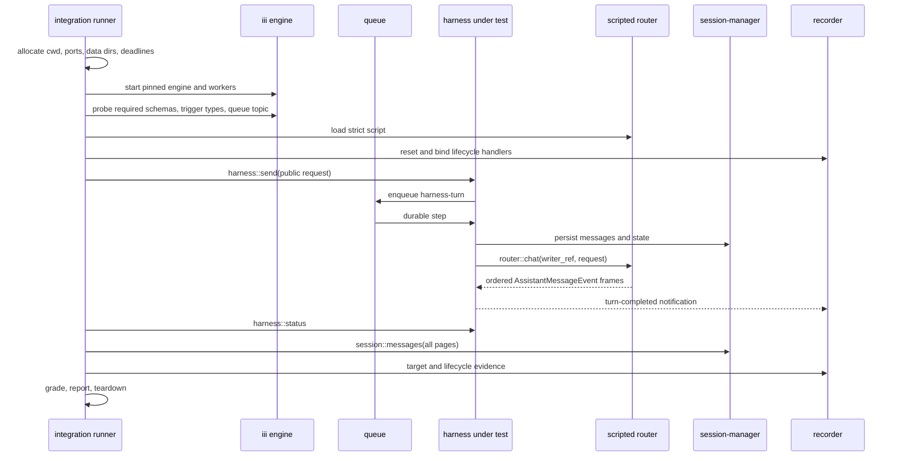

# Harness integration E2E

> Status: proposed architecture; implementation has not started.
>
> Last reviewed: 2026-07-15.

Harness integration is the deterministic regression track for the harness. It
proves that a checkout or release artifact still obeys the public turn,
durability, streaming, dispatch, and lifecycle contracts without asking a real
model to make decisions.

## Definition

Each scenario starts a fresh isolated iii stack, runs the real harness and its
durable dependencies, replaces only the `router::*` model boundary with a
strict scripted worker, and grades structured public evidence. Missing
infrastructure is a setup error, never a skip.

The first implementation is a standalone Rust runner under
`harness/evals/integration`. It owns process supervision, fixtures, evidence,
grading, and reports. It does not add a test-only function to the engine or
harness.

## Decisions

| Area | Version 1 decision |
|---|---|
| Isolation | One fresh process stack per scenario; scenarios run serially |
| Harness entry | `harness::send` for an ordinary turn |
| Model boundary | Scripted worker owns the fixed router functions; real llm-router/providers are absent |
| Context | Real context-manager is mandatory and fails closed |
| Oracle | Code assertions over status, full transcript, recorder calls, lifecycle events, and process state |
| Traces | Optional diagnostics; not a readiness requirement or ordinary oracle |
| Runner packaging | Nested standalone Cargo workspace with its own lockfile |
| Engine acquisition | Explicit `--engine-bin`/`III_BIN`; runner never downloads artifacts |
| Stack reuse | Never in v1; reconsider only after a measured runtime problem and reset proof |

## Goals

1. Exercise the public path through the real queue and durable turn loop.
2. Make function-call outcome reproducible without a model key.
3. Detect duplicate or missing transcript entries and target side effects.
4. Preserve structured evidence for every failure classification.
5. Reproduce process crashes and restart boundaries with explicit fault seeds.

## Boundaries

- Integration does not evaluate prompt quality, model judgment, or aesthetic
  output. See [agent-quality.md](agent-quality.md) for that track.
- A test that seeds `harness_turn`, private state, or an internal continuation
  is a lower-level internal white-box test, not a public-path integration test.
- The scripted router is test support outside the subject path. It mirrors the
  router contract but does not claim to test llm-router or providers.
- Console rendering and browser reconnect behavior use a later stack profile;
  they do not gate the initial harness scenarios.
- The runner does not download an engine, worker, model, or fixture during a
  test.

## System profile

| Component | Profile | Reason |
|---|---|---|
| iii engine and worker manager | Real, pinned artifact | Function registration, triggers, channels, worker lifecycle |
| queue | Real | Provision and deliver `harness-turn` FIFO work |
| iii-state | Real, isolated data directory | Durable harness state |
| configuration | Real, isolated data directory | Authoritative worker configuration |
| iii-cron | Real | Packaged dependency; no scheduled fixture is armed |
| iii-stream | Real | Packaged channel implementation |
| iii-observability | Real, isolated exporter/config | Declared harness dependency; traces remain diagnostic |
| iii-directory | Real, isolated directory | Declared harness dependency and worker discovery support |
| session-manager | Real | Transcript and session durability |
| context-manager | Real and required | Context assembly and token preflight fail closed without it |
| harness artifact under test | Real | The system under test |
| scripted router | Controlled | Deterministic implementation of required fixed `router::*` functions |
| llm-router | Absent; fixed IDs replaced by scripted router | Avoid duplicate registration |
| provider-anthropic/provider-openai | Absent | No production network/model behavior |
| recorder worker | Controlled | Target calls, lifecycle events, barriers, and test-owned evidence |
| shell/web | Absent in first slice | Declared dependencies intentionally omitted until a scenario profile exercises them |
| browser | Absent in first slice | Not a harness manifest dependency; added only by a browser profile |

Context manager is not optional. The harness explicitly rejects unbudgeted raw
history when `context::assemble` or `context::count-tokens` is unavailable
([`harness/src/clients/context.rs:1`](https://github.com/iii-hq/workers/blob/main/harness/src/clients/context.rs)); its
packaged dependency is declared at
[`harness/iii.worker.yaml:19`](https://github.com/iii-hq/workers/blob/main/harness/iii.worker.yaml). The
context-manager `allow_fallback_limits` option only changes model-limit lookup
inside that worker; it is not a harness fallback when the worker is absent.

## Existing contracts consumed

| Contract | Source | Integration rule |
|---|---|---|
| Public/internal harness IDs | [`harness/src/functions/mod.rs:32`](https://github.com/iii-hq/workers/blob/main/harness/src/functions/mod.rs) | Normal scenarios use `harness::send` and read `harness::status`; `turn` and `function::{trigger,resolve}` stay internal. |
| Send request/response | [`harness/src/functions/send.rs:69`](https://github.com/iii-hq/workers/blob/main/harness/src/functions/send.rs) | `accepted` is always true on success. Optional `merged`, `queued`, and `deduplicated` fields are omitted when false; graders normalize absence to false. |
| Status | [`harness/src/functions/status.rs:12`](https://github.com/iii-hq/workers/blob/main/harness/src/functions/status.rs) | Unknown session returns JSON `null`; known status exposes current turn, counters, pending calls, live children, queue, and result. |
| Transcript | [`session-manager/src/functions/messages.rs:10`](https://github.com/iii-hq/workers/blob/main/session-manager/src/functions/messages.rs) | Follow `next_cursor` until absent and grade ordered `MessageItem` entries. |
| Lifecycle | [`harness/src/events.rs:26`](https://github.com/iii-hq/workers/blob/main/harness/src/events.rs), [`harness/src/events.rs:271`](https://github.com/iii-hq/workers/blob/main/harness/src/events.rs) | Hyphenated IDs, strict binding filters, and exact started/completed payload fields. |
| Event delivery | [`harness/src/events.rs:7`](https://github.com/iii-hq/workers/blob/main/harness/src/events.rs), [`harness/src/events.rs:409`](https://github.com/iii-hq/workers/blob/main/harness/src/events.rs) | `Void` notifications are at-least-once and unordered; status/transcript confirm durable outcome. Identical duplicates are accepted, conflicting terminals fail. |
| Queue readiness | [`harness/src/queue.rs:13`](https://github.com/iii-hq/workers/blob/main/harness/src/queue.rs), [`queue/src/functions.rs:197`](https://github.com/iii-hq/workers/blob/main/queue/src/functions.rs) | `engine::queue::list_topics` must include `harness-turn` before send. |
| Router IDs | [`llm-router/src/surface.rs:27`](https://github.com/iii-hq/workers/blob/main/llm-router/src/surface.rs) | Scripted worker claims the exact required fixed IDs and no production router starts. |
| Router chat | [`llm-router/src/chat/chat.rs:39`](https://github.com/iii-hq/workers/blob/main/llm-router/src/chat/chat.rs) | Match `writer_ref`, request id, model/provider, prompt, messages, tools, response format, thinking, output limit, provider options, and metadata. |
| Stream vocabulary | [`llm-router/src/types/events.rs:49`](https://github.com/iii-hq/workers/blob/main/llm-router/src/types/events.rs) | Exactly 15 snake-case variants; only `done` and `error` are terminal. |
| Router response | [`llm-router/src/types/router.rs:54`](https://github.com/iii-hq/workers/blob/main/llm-router/src/types/router.rs), [`llm-router/src/chat/chat.rs:313`](https://github.com/iii-hq/workers/blob/main/llm-router/src/chat/chat.rs) | Return `{ok, provider, model, stop_reason?, usage?, error?}` only after terminal streaming has been relayed. |
| Stable harness errors | [`harness/src/error.rs:1`](https://github.com/iii-hq/workers/blob/main/harness/src/error.rs) | Preserve the `harness/<code>: message` bus shape in evidence. |

## Architecture



## Proposed scripted-router contract

Everything in this section is **Proposed test-support API**. The scripted worker
and real llm-router are mutually exclusive. Duplicate function registration
would otherwise make ownership boot-order dependent.

The worker implements these existing IDs for the first profile:

- `router::chat`
- `router::abort`
- `router::models::list`
- `router::models::get`
- `router::models::supports`
- `router::system_prompt::get`

`router::models::get` returns the pinned fixture model with a context window
large enough to prevent accidental compaction in the first two scenarios.
Compaction scenarios explicitly script the additional context-manager
`router::chat` generation instead of consuming a subject generation silently.

The other fixed functions are deterministic projections of the fixture.
`models::list` returns the model when its provider/capability filters match;
`models::get` returns `{model}` only for its exact provider and id and JSON
`null` otherwise; `models::supports` maps the requested capability to the
corresponding `supports_*` field and returns `{supported:false}` for an unknown
capability or model. `system_prompt::get` returns `{"provider":"scripted"}`
with `system_prompt` omitted, so the harness uses its checked-in built-in
prompt. `abort` indexes live generations by request id, closes the stream once,
and returns `{aborted:true}` only for the first abort of a live call.

The exact `router::chat` request is:

```ts
interface RouterChatInput {
  writer_ref: StreamChannelRef
  request_id?: string
  model: string
  provider?: string
  system_prompt?: string
  messages: unknown[]
  tools?: unknown
  response_format?: unknown
  thinking_level?: unknown
  max_output_tokens?: number
  provider_options?: unknown
  metadata?: unknown
}

interface RouterChatResponse {
  ok: boolean
  provider: string
  model: string
  stop_reason?: "end" | "length" | "function_call" | "aborted" | "error"
  usage?: { input?: number; output?: number; cache_read?: number; cache_write?: number; reasoning?: number; cost_usd?: number }
  error?: { code: string; message: string }
}
```

The frozen frame variants are `start`, `text_start`, `text_delta`, `text_end`,
`thinking_start`, `thinking_delta`, `thinking_end`, `functioncall_start`,
`functioncall_delta`, `functioncall_end`, `usage`, `ping`, `stop`, `done`, and
`error`. Frames use the exact content/message shapes in
[`llm-router/src/types/messages.rs:30`](https://github.com/iii-hq/workers/blob/main/llm-router/src/types/messages.rs)
and [`llm-router/src/types/content.rs:5`](https://github.com/iii-hq/workers/blob/main/llm-router/src/types/content.rs).

### Script schema

```ts
interface RouterScriptV1 {
  schema_version: "1"
  scenario_id: string
  model: ModelFixtureV1
  generations: ScriptedGenerationV1[]
}

interface ModelFixtureV1 {
  id: string
  provider: string
  display_name?: string
  context_window: number
  max_output_tokens: number
  input_limit?: number
  supports_thinking?: boolean
  supports_xhigh?: boolean
  reasoning_efforts?: Array<{ effort: string; description?: string }>
  supports_tools?: boolean
  supports_vision?: boolean
  supports_cache?: boolean
  supports_structured_output?: boolean
  thinking_budgets?: Record<string, number>
  pricing?: { input?: number; output?: number; cache_read?: number; cache_write?: number }
}

type JsonMatcherV1 =
  | { mode: "absent" }
  | { mode: "present" }
  | { mode: "regex"; pattern: string }
  | { mode: "sha256"; expected: string }
  | { mode: "exact"; expected: unknown; normalize?: JsonNormalizerV1[] }
  | { mode: "subset"; expected: unknown; normalize?: JsonNormalizerV1[] }

interface JsonNormalizerV1 {
  pointer: string                 // RFC 6901 JSON Pointer
  operation: "delete" | "replace"
  replacement?: unknown          // required for replace; forbidden for delete
}

interface ScriptedGenerationV1 {
  ordinal: number
  match: {
    writer_ref: JsonMatcherV1
    request_id: JsonMatcherV1
    model: JsonMatcherV1
    provider: JsonMatcherV1
    system_prompt: JsonMatcherV1
    messages: JsonMatcherV1
    tools: JsonMatcherV1
    response_format: JsonMatcherV1
    thinking_level: JsonMatcherV1
    max_output_tokens: JsonMatcherV1
    provider_options: JsonMatcherV1
    metadata: JsonMatcherV1
  }
  frames: AssistantMessageEvent[]
  response: RouterChatResponse
  barriers?: Array<{ before_frame: number; id: string; timeout_ms: number }>
}
```

Schemas deny unknown fields. `sha256` accepts a JSON string and hashes its
UTF-8 bytes. Normalizers are applied to copies of actual and
expected values before comparison and never to stored evidence. Regex uses the
Rust `regex` crate syntax and is valid only for a JSON string. `subset` requires
every expected object member or array element at the same position; it does not
ignore array ordering or extra elements between expected entries.

Calls consume generations in ordinal order. An unexpected subject call,
matcher failure, or unused expectation is a `contract_failure`. Script loading
rejects duplicate ordinals, an invalid matcher/normalizer, extra generations,
missing or multiple terminal frames, and response/frame disagreement as
`runner_error` before the stack starts. Delays are relative and barriers are
named; fixtures never depend on absolute wall-clock timestamps.

## Proposed cassette contract

A cassette is a sanitized `RouterScriptV1` plus capture provenance:

```ts
interface RouterCassetteV1 {
  schema_version: "1"
  captured_at: string
  engine_revision: string
  harness_revision: string
  router_revision: string
  provider: string
  model: string
  script: RouterScriptV1
  sanitized_sha256: string
}
```

The digest is SHA-256 over canonical JSON of the sanitized object with the
`sanitized_sha256` field omitted. Capture is manual and non-gating. Sanitization
rejects authorization headers, credentials, cookies, personal data,
nondeterministic trace/session/request IDs, and provider-private metadata. A
cassette is committed only after the denylist scan and schema round-trip pass.

## Proposed recorder contract

The controlled recorder registers these fixed control functions:

| Function | Request | Response |
|---|---|---|
| `integration-recorder::configure` | `RecorderConfigureRequestV1` | `{ schema_version: "1", target_schema_sha256 }` |
| `integration-recorder::reset` | `{ schema_version: "1", run_id }` | `{ schema_version: "1", next_sequence: 1 }` |
| `integration-recorder::snapshot` | `{ schema_version: "1", run_id, after_sequence?: number }` | `{ schema_version: "1", events: RecorderEventV1[] }` |
| `integration-recorder::await` | `{ schema_version: "1", run_id, kind, count, timeout_ms }` | `{ schema_version: "1", observed: number }` |
| `integration-recorder::lifecycle` | exact harness lifecycle payload | `{ accepted: true }` |

```ts
interface RecorderConfigV1 {
  target: {
    function_id: string
    description: string
    request_schema: Record<string, unknown>
    response: unknown
  }
  lifecycle: {
    trigger_type: "harness::turn-started" | "harness::turn-completed"
    function_id: "integration-recorder::lifecycle"
  }
}

interface RecorderConfigureRequestV1 {
  schema_version: "1"
  run_id: string
  config: RecorderConfigV1
}

interface RecorderEventV1 {
  schema_version: "1"
  run_id: string
  sequence: number
  kind: "target_call" | "lifecycle"
  function_id: string
  payload: unknown
  received_at: string
}
```

`configure` may register only a function ID prefixed by `<run_id>::`; it
registers the declared description and request schema verbatim, returns the
canonical schema digest, and uses the declared response for every target call.
That registration is part of the oracle: native tool exposure must contain the
same description and schema. `reset` clears only the current run and is
idempotent. Every accepted target or lifecycle call is durably appended before
the handler responds, with a strictly increasing sequence. `snapshot` orders by
sequence. `await` is a deadline-bounded convenience over the same durable log,
not a second evidence source.

Readiness first probes the five fixed control functions. During **Arm**, the
runner configures the run-scoped target, verifies its registered schema digest,
resets the log, and creates the lifecycle binding. The scenario does not send
until the target appears in function discovery and a direct recorder snapshot
returns an empty event list.

## Supervisor contract

The runner CLI is:

```text
harness-integration \
  --engine-bin <path> \
  --harness-bin <path> \
  --worker-bin <name=path>... \
  --scenario <id|all> \
  --artifacts-dir <path> \
  [--retain-success]
```

`III_BIN` may supply the engine path when `--engine-bin` is absent. All other
artifacts are explicit or built by the Make target. The runner records absolute
paths, SHA-256 digests, and versions before boot.

For each scenario it:

1. creates a unique engine working/config directory and an engine YAML whose
   `configuration` worker uses `adapter.name: fs` and
   `adapter.config.directory: <run>/configuration`;
2. reserves loopback ports, starts processes, and retries a bind race with a new
   complete port set;
3. applies an environment allowlist rather than inheriting provider keys or
   developer secrets;
4. writes per-worker seed YAML for a unique session-manager `data_dir`,
   context-manager `lease_dir`, queue file path, and artifact directory;
5. starts workers in declared order and captures stdout/stderr separately;
6. enforces per-process startup, readiness, scenario, collection, and teardown
   deadlines;
7. classifies early process exit before any ordinary timeout;
8. sends SIGTERM, waits five seconds, then sends SIGKILL to remaining children.

The engine starts its built-in configuration worker from the engine YAML before
external workers. The runner then starts each configurable external worker with
its per-run `--config <seed.yaml>`. On this fresh configuration directory, the
worker's first `configuration::register` installs that seed as
`initial_value`; the value returned by the configuration worker is the
authoritative value. The readiness probe fetches each entry with
`configuration::get` and byte-compares canonical JSON to the expected seed.
The runner never writes the configuration worker's private per-entry files.

## Readiness

Readiness is schema-based, never sleep-based. Before arming a scenario the
runner verifies:

- engine discovery responds;
- exact required session, context, queue, scripted-router, recorder, and harness
  functions are present with compatible request/response schemas;
- internal functions such as `harness::send` are queried through
  `engine::functions::list { include_internal: true }` or exact function-info
  lookup rather than the default filtered catalog;
- `harness::turn-completed` is a registered trigger type;
- `engine::queue::list_topics` contains `harness-turn` with the expected broker
  type.

Failure names every missing or mismatched surface and attaches process logs as
`setup_error`.

## Proposed scenario and result schemas

```ts
interface IntegrationScenarioV1 {
  schema_version: "1"
  id: string
  description: string
  stack_profile: string
  send: SendRequest
  router_script: string
  recorder: RecorderConfigV1
  deadlines: { readiness_ms: number; scenario_ms: number; teardown_ms: number }
  invariants: Array<{ id: string; parameters: Record<string, unknown> }>
}

type Classification =
  | "pass"
  | "setup_error"
  | "contract_failure"
  | "timeout"
  | "process_crash"
  | "runner_error"

interface IntegrationResultV1 {
  schema_version: "1"
  run_id: string
  scenario_id: string
  classification: Classification
  invariants: Array<{
    id: string
    passed: boolean
    expected: unknown
    actual: unknown
    evidence_refs: string[]
  }>
  artifacts: string[]
  started_at: string
  duration_ms: number
}
```

Schemas deny unknown fields. Failure precedence is `runner_error`,
`process_crash`, `setup_error`, `timeout`, then `contract_failure`; `pass` is
possible only when all required invariants pass. The process exits 0 only when
every selected scenario is `pass`, 2 for any `contract_failure` or `timeout`,
and 3 for `runner_error`, `setup_error`, or `process_crash`. `timeout` means the
subject exceeded the scenario deadline after **Send**. A readiness, recorder,
collection, or teardown deadline is owned by the runner and is classified as
`setup_error` before send or `runner_error` after send, so its exit code is 3.

## Scenario lifecycle

1. **Allocate:** run id, cwd, stores, ports, deadlines, artifact directory.
2. **Boot:** pinned engine, real dependencies, scripted router, recorder, harness.
3. **Probe:** exact functions, schemas, triggers, queue topic.
4. **Arm:** load router script, reset recorder, bind lifecycle target.
5. **Send:** call `harness::send` and record the exact request/response.
6. **Await:** key on both returned session and turn id; accept identical event
   duplicates and confirm terminal durable status.
7. **Collect:** paginate the transcript and collect router/target/lifecycle and
   process evidence.
8. **Grade:** pure code assertions; no mutation of the subject.
9. **Report:** canonical JSON plus concise console output.
10. **Teardown:** stop all children; retain according to classification.

The lifecycle notification is not the only source of truth. The harness
persists terminal state before emitting completion, so the runner confirms the
event against `harness::status` and the complete transcript. Missing lifecycle
delivery fails a lifecycle invariant when that contract is under test but does
not make evidence collection hang.

## Isolation and identity

Every session id, send idempotency key, recorder sequence, fixture row/state
key, cassette instance, and artifact path is scoped by `run_id`. Every
**test-owned** target/control function ID is also scoped. Production IDs such as
`harness::send`, `router::chat`, and lifecycle trigger types remain fixed.

The first version never reuses a stack. Reuse may be proposed only when measured
p95 runtime exceeds the CI budget and a reset-contract test proves no session,
state, registration, event, queue item, or file crosses scenario boundaries.
Restart and redelivery scenarios always own their complete stack.

## Oracles

| Oracle | What it proves |
|---|---|
| Send response | Acceptance, identity, steering, queueing, and deduplication flags |
| Full transcript | Durable order/content, function results, and absence of duplicate entries |
| Status | Terminal state, result, pending calls, live children, queue, and retry counters |
| Target recorder | Invocation arguments, count, order, and forbidden side effects |
| Scripted router | Generation count and model-visible messages/`tools` |
| Lifecycle recorder | Started/completed delivery and duplicate consistency |
| Process supervisor | Unexpected exit, restart boundary, and shutdown behavior |
| Traces/logs | Diagnosis only unless telemetry is the explicit invariant |

No single oracle is sufficient. Private state may be copied after failure for
diagnosis but cannot decide an ordinary public-contract scenario.

## First implementation slice

### I-E2E-001 — streamed text reaches durable completion

Request:

```json
{
  "message": "Return the fixture phrase.",
  "model": "fixture-model",
  "provider": "scripted",
  "idempotency_key": "<run_id>:streamed-text",
  "options": {
    "functions": { "allow": [], "deny": [], "expose": "native" }
  }
}
```

The script's model fixture is:

```json
{
  "id": "fixture-model",
  "provider": "scripted",
  "context_window": 32768,
  "max_output_tokens": 4096,
  "supports_thinking": false,
  "supports_tools": true,
  "supports_vision": false,
  "supports_cache": false,
  "supports_structured_output": true
}
```

The single generation matches every router field. `writer_ref` is a `subset`
match for `{ "direction": "write" }`; `request_id` is `regex` matched by
`^t_[0-9a-f]{32}:[0-9]+$`; model/provider are exact; system prompt is matched by
the SHA-256 of the checked-in `expected/system-prompt.txt`; messages exactly
match one user text block after deleting `/0/timestamp`; `tools` exactly matches
`[]`; and `response_format`, `thinking_level`, `max_output_tokens`,
`provider_options`, and `metadata` each use an explicit `absent` matcher. The
authored fixture stores every matcher explicitly—there is no runner default.

To remove ambiguity while keeping the frame listing readable, define `A(c, u)`
as this fully expanded wire object, where `c` is the `content` array and `u` is
omitted or the exact usage object:

```json
{
  "role": "assistant",
  "content": "<c>",
  "stop_reason": "end",
  "usage": "<u, omitted when absent>",
  "model": "fixture-model",
  "provider": "scripted",
  "timestamp": 1
}
```

The committed script expands the following table into literal
`AssistantMessageEvent` objects; `A(...)` is authoring notation, not an
additional wire format:

| Frame | Exact payload |
|---|---|
| `start` | `partial=A([])` |
| `text_start` | `partial=A([{type:"text",text:""}])` |
| `text_delta` | `partial=A([{type:"text",text:"fixture "}]), delta="fixture "` |
| `text_delta` | `partial=A([{type:"text",text:"fixture complete"}]), delta="complete"` |
| `text_end` | `partial=A([{type:"text",text:"fixture complete"}])` |
| `usage` | `usage={input:8,output:2}` |
| `stop` | `stop_reason="end"`, with `error_message` and `error_kind` omitted |
| `done` | `message=A([{type:"text",text:"fixture complete"}], {input:8,output:2})` |

The terminal response is
`{ok:true,provider:"scripted",model:"fixture-model",stop_reason:"end",usage:{input:8,output:2}}`.

Required invariants:

- one durable user message and one durable assistant message;
- assistant text is exactly `fixture complete` with the scripted usage;
- no partial update created another assistant entry;
- status is `completed` with no pending calls or queued message;
- one non-conflicting completion payload is observed;
- exactly one router generation is consumed.

### I-E2E-002 — allowed function executes exactly once

The request is the same shape with message `Call the recorder once.` and
`options.functions = {allow:["<run_id>::record"],deny:[],expose:"native"}`.

Its recorder configuration is exact:

```json
{
  "target": {
    "function_id": "<run_id>::record",
    "description": "Record one integration fixture value.",
    "request_schema": {
      "type": "object",
      "additionalProperties": false,
      "properties": { "value": { "type": "string" } },
      "required": ["value"]
    },
    "response": {
      "content": [{ "type": "text", "text": "recorded" }],
      "is_error": false
    }
  },
  "lifecycle": {
    "trigger_type": "harness::turn-completed",
    "function_id": "integration-recorder::lifecycle"
  }
}
```

Generation one matches every field as in I-E2E-001, except `tools` must exactly
equal the single native entry below. This assertion ties the router request to
the recorder registration rather than duplicating a prose approximation.

```json
[
  {
    "name": "<run_id>::record",
    "description": "Record one integration fixture value.",
    "parameters": {
      "type": "object",
      "additionalProperties": false,
      "properties": { "value": { "type": "string" } },
      "required": ["value"]
    },
    "execution_mode": "sequential"
  }
]
```

Generation one emits one `done` frame whose full assistant message is:

```json
{
  "role": "assistant",
  "content": [{
    "type": "function_call",
    "id": "call-1",
    "function_id": "<run_id>::record",
    "arguments": { "value": "expected" }
  }],
  "stop_reason": "function_call",
  "usage": { "input": 8, "output": 4 },
  "model": "fixture-model",
  "provider": "scripted",
  "timestamp": 2
}
```

Its response is
`{ok:true,provider:"scripted",model:"fixture-model",stop_reason:"function_call",usage:{input:8,output:4}}`.
The recorder response normalizes into this exact durable/model-visible message
(only `timestamp` is normalized out while matching):

```json
{
  "role": "function_result",
  "function_call_id": "call-1",
  "function_id": "<run_id>::record",
  "content": [{ "type": "text", "text": "recorded" }],
  "details": {
    "content": [{ "type": "text", "text": "recorded" }],
    "is_error": false
  },
  "is_error": false,
  "timestamp": "<normalized>"
}
```

Generation two matches, in order, the original user message, generation one's
assistant message, and that function result. It also re-matches the same tool
entry and every other router field; its request id ends in `:2`. It emits one
`done` frame whose message is
`A([{type:"text",text:"recorded once"}], {input:18,output:2})`, with timestamp
`3`, followed by the response
`{ok:true,provider:"scripted",model:"fixture-model",stop_reason:"end",usage:{input:18,output:2}}`.

Required invariants:

- the target receives `{value:"expected"}` exactly once;
- one durable function-result message references `call-1` and the correct ID;
- the second router request contains that result;
- the final assistant entry and status are terminal and durable;
- no pending call remains and exactly two generations are consumed.

The grader's duplicate-detection rule is unit-tested with synthetic evidence
containing two target calls. Public repeated-send and real crash/redelivery
scenarios are added later; the first slice does not add a private injection API
or mutant harness binary.

## Expansion order

| Phase | Scenario | Core invariant |
|---|---|---|
| 1 | Denied function | Target never runs and a durable denial reaches the next generation |
| 1 | Repeated send idempotency | Original ids return and no duplicate message/turn appears |
| 1 | Router failure | Retry/resume and terminal error match stable contracts |
| 1 | Structured output | Repair retries and final classification are bounded |
| 2 | Steering while streaming | New message participates exactly once in the active turn |
| 2 | Hook ordering and failure | Each synchronous hook follows documented chain semantics |
| 2 | Approval allow/deny | Target runs once after allow and never after deny |
| 2 | Sub-agent fan-out/fan-in | Parent waits for required children and resolves each once |
| 2 | Cancellation | Streams and descendants stop consistently |
| 3 | Queue redelivery/restart | Durable checkpoints prevent duplicate transcript and effects |
| 3 | Dynamic registration | Function discovery updates without stale schemas |
| 3 | Runtime validation | A failed validator drives one bounded public continuation |

## Repository and artifacts

```text
harness/evals/integration/
  Cargo.toml              # contains [workspace] and [package]
  Cargo.lock
  engine.lock             # repository, 40-hex revision, package, binary path
  src/{main,stack,readiness,scripted_router,recorder,scenario,grader,artifacts}.rs
  schemas/
  scenarios/{streamed-text,exactly-once-function}/
    scenario.yaml
    router-script.json
    recorder.json
    expected/system-prompt.txt
  fixtures/{authored,recorded}/

target/integration/<run_id>/
  result.json
  stack.json
  logs/
  scenarios/<scenario_id>/
    request.json
    send-response.json
    transcript.json
    status.json
    router-calls.json
    target-calls.json
    lifecycle-events.json
    invariants.json
```

The nested manifest declares its own `[workspace]` so Cargo does not treat it as
an undeclared member of the parent harness workspace. The Make entry point is:

```bash
make -C harness integration-e2e
```

## CI and gate policy

The initial CI job is non-required and runs only for harness, session-manager,
context-manager, queue, llm-router contract, and integration-runner changes. It
uses the repository Rust toolchain and the runner's strict no-skip mode. The
initial `engine.lock` pins the adjacent engine source inspected for this spec:

```toml
repository = "iii-hq/iii"
revision = "085e0fde6b424092a8b7e3ab31ac5e0cd36fa2e0"
package = "iii"
binary = "target/release/iii"
```

The new `harness-integration` job in `.github/workflows/ci.yml` first checks out
workers, reads and validates those four lock fields, then uses
`actions/checkout@v4` to place that repository and exact revision at
`target/integration-engine-src`. It runs
`cargo build --locked --release -p iii` there, records SHA-256 of the resulting
binary, and passes its absolute path as `--engine-bin`. The cache key is
`integration-engine-<runner-os>-<runner-arch>-<revision>-<Cargo.lock hash>`;
cache hits are still re-hashed before execution. Any checkout, locked build,
digest, or runner failure fails the job—there is no download or skip fallback.
The job publishes compact results for every run and retains full non-pass
artifacts for 14 days.

Promotion to a required pull-request check needs at least 100 consecutive clean
scheduled or pull-request runs across 14 days, zero skips, and zero unexplained
flakes. Any unexplained flake resets the clean-run count. Stack reuse is not a
condition for promotion.

## Verification and acceptance

The runner implementation must include:

- JSON Schema and serde round-trip tests for scripts, cassettes, scenarios,
  recorder events, and results;
- contract/golden checks for every mirrored existing function and stream shape;
- readiness failures for hidden internal functions, missing context manager,
  wrong queue topic, and schema mismatch;
- duplicate, conflicting, missing, and out-of-order lifecycle deliveries;
- supervisor tests for early exit, port collision, timeout precedence, signal
  escalation, and complete teardown;
- isolation tests proving all durable stores and environment secrets are scoped;
- cassette sanitizer fixtures for credentials, cookies, PII, and unstable IDs;
- deterministic report bytes and the documented process exit codes;
- both initial scenarios repeated without a model key and with identical
  normalized results.

## Related material

- [Harness agent-quality E2E](agent-quality.md)
- [Harness architecture](https://github.com/iii-hq/workers/blob/main/harness/architecture/README.md)
- [`harness::send`](https://github.com/iii-hq/workers/blob/main/harness/src/functions/send.rs)
- [Durable turn loop](https://github.com/iii-hq/workers/blob/main/harness/src/turn_loop.rs)
- [Queue provisioning](https://github.com/iii-hq/workers/blob/main/harness/src/queue.rs)
- [Lifecycle events](https://github.com/iii-hq/workers/blob/main/harness/src/events.rs)
- [Router event vocabulary](https://github.com/iii-hq/workers/blob/main/llm-router/src/types/events.rs)
