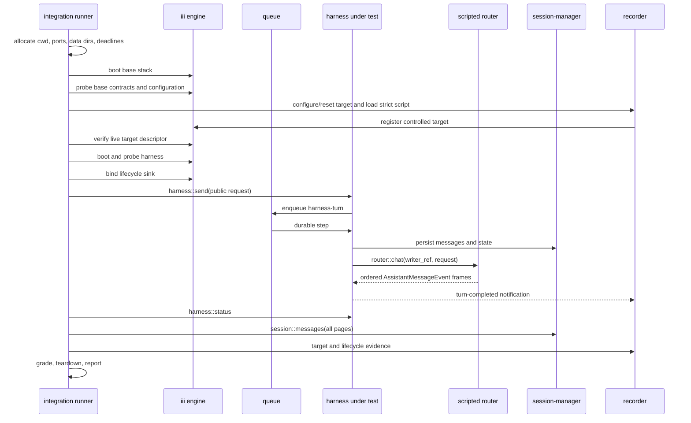

# Harness integration E2E

> Status: core implementation, live-contract readiness, and typed teardown
> exist; Phase 1 scenarios and remaining isolation/port-collision coverage
> remain. Authoring revised 2026-07-20: scenarios are authored as Rust builder
> modules instead of YAML; the migration lands before Phase 1, while exactly
> two authored scenarios exist.
>
> Last reviewed: 2026-07-20.

Harness integration is the deterministic regression track for the harness. It
proves that a checkout or release artifact still obeys the public turn,
durability, streaming, dispatch, and lifecycle contracts without asking a real
model to make decisions.

## Definition

Each scenario starts a fresh isolated iii stack, runs the real harness and its
durable dependencies, replaces only the `router::*` model boundary with a
strict scripted worker, and grades structured public evidence. Missing
infrastructure is a setup error, never a skip.

The first implementation is a standalone Rust runner under
`harness/evals/integration`. It owns process supervision, fixtures, evidence,
grading, and reports. It does not add a test-only function to the engine or
harness. As the evaluation tracks converge, reusable test support — lifecycle
await, metric pulls, scripted harness operations — consolidates in the shared
`harness-test` worker described in [agent-quality.md](agent-quality.md); the
later console profile is its first consumer here.

## Decisions

| Area | Version 1 decision |
|---|---|
| Isolation | One fresh process stack per scenario; scenarios run serially |
| Harness entry | `harness::send` for an ordinary turn |
| Model boundary | Scripted worker owns the fixed router functions; real llm-router/providers are absent |
| Context | Real context-manager is mandatory and fails closed |
| Oracle | Code assertions over status, full transcript, recorder calls, lifecycle events, and process state |
| Traces | Optional diagnostics; not a readiness requirement or ordinary oracle |
| Stack profile | `harness-core-v1`; observability is not required |
| Authoring | One concise Rust builder module per scenario, compiled before boot into strict runtime contracts; compiled snapshots stay the review artifact |
| Reports | Stable `result.json` plus volatile `execution.json`, cryptographically linked |
| Runner packaging | Nested standalone Cargo workspace with its own lockfile |
| Engine acquisition | Explicit `--engine-bin`/`III_BIN`; runner never downloads artifacts |
| Stack reuse | Never in v1; reconsider only after a measured runtime problem and reset proof |

## Goals

1. Exercise the public path through the real queue and durable turn loop.
2. Make function-call outcome reproducible without a model key.
3. Detect duplicate or missing transcript entries and target side effects.
4. Preserve structured evidence for every failure classification.
5. Reproduce process crashes and restart boundaries with explicit fault seeds.

## Boundaries

- Integration does not evaluate prompt quality, model judgment, or aesthetic
  output. See [agent-quality.md](agent-quality.md) for that track.
- A test that seeds `harness_turn`, private state, or an internal continuation
  is a lower-level internal white-box test, not a public-path integration test.
- The scripted router is test support outside the subject path. It mirrors the
  router contract but does not claim to test llm-router or providers.
- Console rendering and browser reconnect behavior use a later stack profile;
  they do not gate the initial harness scenarios. That profile drives the
  console with Playwright while the shared `harness-test` worker
  ([agent-quality.md](agent-quality.md)) scripts harness operations without
  any LLM call.
- The runner does not download an engine, worker, model, or fixture during a
  test.

## System profile

The first profile is named `harness-core-v1`. The resolved profile name and
component list are persisted in `stack.json`. Profile selection is runner-owned;
the authored v1 scenario has no opaque free-form profile field. A later,
versioned telemetry profile may add observability when a scenario declares
traces as an invariant.

| Component | Profile | Reason |
|---|---|---|
| iii engine and worker manager | Real, pinned artifact | Function registration, triggers, channels, worker lifecycle |
| queue | Real | Provision and deliver `harness-turn` FIFO work |
| iii-state | Real, isolated data directory | Durable harness state |
| configuration | Real, isolated data directory | Authoritative worker configuration |
| iii-cron | Real | Packaged dependency; no scheduled fixture is armed |
| iii-stream | Real | Packaged channel implementation |
| iii-directory | Real, isolated directory | Declared harness dependency and worker discovery support |
| session-manager | Real | Transcript and session durability |
| context-manager | Real and required | Context assembly and token preflight fail closed without it |
| harness artifact under test | Real | The system under test |
| scripted router | Controlled | Deterministic implementation of required fixed `router::*` functions |
| llm-router | Absent; fixed IDs replaced by scripted router | Avoid duplicate registration |
| provider-anthropic/provider-openai | Absent | No production network/model behavior |
| recorder service | Controlled, in-process | Target calls, lifecycle events, deterministic fault gates, and test-owned evidence |
| shell/web | Absent in first slice | Declared dependencies intentionally omitted until a scenario profile exercises them |
| browser | Absent in first slice | Not a harness manifest dependency; added only by a browser profile |

`iii-observability` is absent from `harness-core-v1`. Adding an exporter to the
core stack would increase boot and configuration surface without proving the
turn contract, while traces are explicitly diagnostic in this profile.

Context manager is not optional. The harness explicitly rejects unbudgeted raw
history when `context::assemble` or `context::count-tokens` is unavailable
([`harness/src/clients/context.rs:1`](https://github.com/iii-hq/workers/blob/main/harness/src/clients/context.rs)); its
packaged dependency is declared at
[`harness/iii.worker.yaml:19`](https://github.com/iii-hq/workers/blob/main/harness/iii.worker.yaml). The
context-manager `allow_fallback_limits` option only changes model-limit lookup
inside that worker; it is not a harness fallback when the worker is absent.

## Existing contracts consumed

| Contract | Source | Integration rule |
|---|---|---|
| Public/internal harness IDs | [`harness/src/functions/mod.rs:32`](https://github.com/iii-hq/workers/blob/main/harness/src/functions/mod.rs) | Normal scenarios use `harness::send` and read `harness::status`; `turn` and `function::{trigger,resolve}` stay internal. |
| Send request/response | [`harness/src/functions/send.rs:69`](https://github.com/iii-hq/workers/blob/main/harness/src/functions/send.rs) | `accepted` is always true on success. Optional `merged`, `queued`, and `deduplicated` fields are omitted when false; graders normalize absence to false. |
| Status | [`harness/src/functions/status.rs:12`](https://github.com/iii-hq/workers/blob/main/harness/src/functions/status.rs) | Unknown session returns JSON `null`; known status exposes current turn, counters, pending calls, live children, queue, and result. |
| Transcript | [`session-manager/src/functions/messages.rs:10`](https://github.com/iii-hq/workers/blob/main/session-manager/src/functions/messages.rs) | Follow `next_cursor` until absent and grade ordered `MessageItem` entries. |
| Lifecycle | [`harness/src/events.rs:26`](https://github.com/iii-hq/workers/blob/main/harness/src/events.rs), [`harness/src/events.rs:271`](https://github.com/iii-hq/workers/blob/main/harness/src/events.rs) | Hyphenated IDs, strict binding filters, and exact started/completed payload fields. |
| Event delivery | [`harness/src/events.rs:7`](https://github.com/iii-hq/workers/blob/main/harness/src/events.rs), [`harness/src/events.rs:409`](https://github.com/iii-hq/workers/blob/main/harness/src/events.rs) | `Void` notifications are at-least-once and unordered; status/transcript confirm durable outcome. Identical duplicates are accepted, conflicting terminals fail. |
| Queue readiness | [`harness/src/queue.rs:13`](https://github.com/iii-hq/workers/blob/main/harness/src/queue.rs), [`queue/src/functions.rs:197`](https://github.com/iii-hq/workers/blob/main/queue/src/functions.rs) | `engine::queue::list_topics` must include `harness-turn` before send. |
| Router IDs | [`llm-router/src/surface.rs:27`](https://github.com/iii-hq/workers/blob/main/llm-router/src/surface.rs) | Scripted worker claims the exact required fixed IDs and no production router starts. |
| Router chat | [`llm-router/src/chat/chat.rs:39`](https://github.com/iii-hq/workers/blob/main/llm-router/src/chat/chat.rs) | Match `writer_ref`, request id, model/provider, prompt, messages, tools, response format, thinking, output limit, provider options, and metadata. |
| Stream vocabulary | [`llm-router/src/types/events.rs:49`](https://github.com/iii-hq/workers/blob/main/llm-router/src/types/events.rs) | Exactly 15 snake-case variants; only `done` and `error` are terminal. |
| Router response | [`llm-router/src/types/router.rs:54`](https://github.com/iii-hq/workers/blob/main/llm-router/src/types/router.rs), [`llm-router/src/chat/chat.rs:313`](https://github.com/iii-hq/workers/blob/main/llm-router/src/chat/chat.rs) | Return `{ok, provider, model, stop_reason?, usage?, error?}` only after terminal streaming has been relayed. |
| Stable harness errors | [`harness/src/error.rs:1`](https://github.com/iii-hq/workers/blob/main/harness/src/error.rs) | Preserve the `harness/<code>: message` bus shape in evidence. |
| Engine call metadata | Engine-injected top-level fields such as `_caller_worker_id` | Strip top-level keys beginning with `_` before validating a declared function request; nested underscore-prefixed user data is not stripped. |

## Architecture



The split boot order is deliberate. Native function discovery can snapshot
registrations while a worker starts, so the controlled target is armed and
verified before the harness boots. The lifecycle binding is installed only
after both the base stack and harness surfaces have passed readiness.

## Scripted-router contract

This is test-support API owned by the integration runner. The scripted worker
and real llm-router are mutually exclusive. Duplicate function registration
would otherwise make ownership boot-order dependent.

The worker implements these existing IDs for the first profile:

- `router::chat`
- `router::abort`
- `router::models::list`
- `router::models::get`
- `router::models::supports`
- `router::system_prompt::get`

`router::models::get` returns the pinned fixture model with a context window
large enough to prevent accidental compaction in the first two scenarios.
Compaction scenarios explicitly script the additional context-manager
`router::chat` generation instead of consuming a subject generation silently.

The other fixed functions are deterministic projections of the fixture.
`models::list` returns the model when its provider/capability filters match;
`models::get` returns `{model}` for its exact id and, when a provider is
supplied, its exact provider; provider omission is accepted because the
production router and context-manager use that form. It returns JSON `null`
otherwise. `models::supports` maps the requested capability to the
corresponding `supports_*` field and returns `{supported:false}` for an unknown
capability or model. `system_prompt::get` returns `{"provider":"scripted"}`
with `system_prompt` omitted, so the harness uses its checked-in built-in
prompt. `abort` indexes live generations by request id, closes the stream once,
and returns `{aborted:true}` only for the first abort of a live call.

The exact `router::chat` request is:

```ts
interface RouterChatInput {
  writer_ref: StreamChannelRef
  request_id?: string
  model: string
  provider?: string
  system_prompt?: string
  messages: unknown[]
  tools?: unknown
  response_format?: unknown
  thinking_level?: unknown
  max_output_tokens?: number
  provider_options?: unknown
  metadata?: unknown
}

interface RouterChatResponse {
  ok: boolean
  provider: string
  model: string
  stop_reason?: "end" | "length" | "function_call" | "aborted" | "error"
  usage?: { input?: number; output?: number; cache_read?: number; cache_write?: number; reasoning?: number; cost_usd?: number }
  error?: { code: string; message: string }
}
```

The frozen frame variants are `start`, `text_start`, `text_delta`, `text_end`,
`thinking_start`, `thinking_delta`, `thinking_end`, `functioncall_start`,
`functioncall_delta`, `functioncall_end`, `usage`, `ping`, `stop`, `done`, and
`error`. Frames use the exact content/message shapes in
[`llm-router/src/types/messages.rs:30`](https://github.com/iii-hq/workers/blob/main/llm-router/src/types/messages.rs)
and [`llm-router/src/types/content.rs:5`](https://github.com/iii-hq/workers/blob/main/llm-router/src/types/content.rs).

### Authoring and compilation

Scenario authors maintain exactly one source module per scenario:
`src/scenarios/<slug>.rs`, a Rust function that builds the authored scenario
data through typed builders and registers it in the scenario list. There is no
YAML layer: the authored shape below is the runner's own data model, enforced
by the type system at `cargo build` instead of by a schema validator at load
time. Aliases, typed replies, deterministic defaults, and scenario-specific
expectations keep routine scenarios concise. The shape is documented in the
spec's TS-style notation; the implementation is Rust structs with builders:

```ts
interface AuthoredScenarioV1 {
  schema_version: "1"
  id: string
  description: string
  quarantine?: boolean
  send: {
    message: string
    allow?: string[]              // function aliases; [] disables dispatch
    idempotency_key?: string
  }
  functions?: Record<string, {
    description: string
    request_schema: Record<string, unknown>
    response: unknown
    expose?: boolean              // default true
  }>
  router: {
    model?: ModelFixtureV1
    generations: Array<{
      reply:
        | { type: "text"; text: string; chunks?: string[]; usage?: Usage }
        | { type: "function_call"; id?: string; function: string; arguments: unknown; usage?: Usage }
        | { type: "raw"; frames: AssistantMessageEvent[]; response: RouterChatResponse }
      match_overrides?: Partial<GenerationMatchV1>
    }>
  }
  bindings?: TriggerBindingSpecV1[]
  release?: { function_call_id?: string; action: "execute" | "deliver" }
  fault?: {
    kind: "engine_sigkill"
    function?: string
    after_target_calls?: number
    restart_delay_ms?: number
  }
  timeouts?: { readiness_ms?: number; scenario_ms?: number; teardown_ms?: number }
  expect?: ExpectationsV1
}
```

A routine scenario reads like data, because it is data:

```rust
// src/scenarios/streamed_text.rs
pub fn scenario() -> AuthoredScenario {
    AuthoredScenario::new("streamed-text", "streamed text reaches durable completion")
        .send(Send::message("Return the fixture phrase.").allow([]))
        .generation(
            Reply::text("fixture complete")
                .chunks(["fixture ", "complete"])
                .usage(8, 2),
        )
}
```

Code-authored fixtures deliberately mirror the agent-quality decision. There,
YAML orchestration was rejected because tests should be code over public APIs;
here the authored layer is not orchestration but model-boundary fixture data,
and Rust is the cleanest host for it: an invalid matcher combination or a
missing reply no longer waits for script loading — it fails `cargo build`; the
authored and compiled layers share one set of structs, so there is no schema
pair to keep synchronized; and the runner keeps a single toolchain. Builders
produce data only — a builder that derives scenarios from control flow is
rejected in review, under the same rule that forbids a second orchestration
language below. Raw frames remain data, so script loading keeps its
validation as the final defense.

Before any process starts, the compiler resolves that source into the exact
runtime unit:

```ts
interface CompiledFixtureV1 {
  scenario: CompiledScenarioV1
  script: RouterScriptV1
  system_prompt_template: string
}

interface CompiledScenarioV1 {
  schema_version: "1"
  id: string
  description: string
  send: SendRequest
  recorder: RecorderConfigV1
  deadlines: { readiness_ms: number; scenario_ms: number; teardown_ms: number }
  invariants: Array<{ id: string; parameters: Record<string, unknown> }>
  fault?: CompiledFaultV1
  bindings?: TriggerBindingV1[]
  release?: { function_call_id: string; action: "execute" | "deliver" }
  quarantine?: boolean
}
```

Every compiled generation contains all twelve router matchers explicitly and
literal wire frames. Defaults are allowed only in the authored layer; the
compiled artifact is strict and self-contained. Its canonical rendering is
checked into a snapshot or golden test so a compiler-default change is
reviewable like an authored fixture change. CI validates schema and serde
round trips for the compiled layer and verifies that committed compiled
snapshots match a fresh render; the authored layer needs no round trip
because it is never serialized.

`match_overrides` and `reply.type: raw` are escape hatches, not the normal
authoring path. Raw frames receive the same terminal-frame and
response/frame-consistency validation as compiler-generated frames.

### Compiled script schema

```ts
interface RouterScriptV1 {
  schema_version: "1"
  scenario_id: string
  model: ModelFixtureV1
  generations: ScriptedGenerationV1[]
}

interface ModelFixtureV1 {
  id: string
  provider: string
  display_name?: string
  context_window: number
  max_output_tokens: number
  input_limit?: number
  supports_thinking?: boolean
  supports_xhigh?: boolean
  reasoning_efforts?: Array<{ effort: string; description?: string }>
  supports_tools?: boolean
  supports_vision?: boolean
  supports_cache?: boolean
  supports_structured_output?: boolean
  thinking_budgets?: Record<string, number>
  pricing?: { input?: number; output?: number; cache_read?: number; cache_write?: number }
}

type JsonMatcherV1 =
  | { mode: "absent" }
  | { mode: "present" }
  | { mode: "regex"; pattern: string }
  | { mode: "sha256"; expected: string }
  | { mode: "exact"; expected: unknown; normalize?: JsonNormalizerV1[] }
  | { mode: "subset"; expected: unknown; normalize?: JsonNormalizerV1[] }

interface JsonNormalizerV1 {
  pointer: string                 // RFC 6901 JSON Pointer
  operation: "delete" | "replace"
  replacement?: unknown          // required for replace; forbidden for delete
}

interface ScriptedGenerationV1 {
  ordinal: number
  match: {
    writer_ref: JsonMatcherV1
    request_id: JsonMatcherV1
    model: JsonMatcherV1
    provider: JsonMatcherV1
    system_prompt: JsonMatcherV1
    messages: JsonMatcherV1
    tools: JsonMatcherV1
    response_format: JsonMatcherV1
    thinking_level: JsonMatcherV1
    max_output_tokens: JsonMatcherV1
    provider_options: JsonMatcherV1
    metadata: JsonMatcherV1
  }
  frames: AssistantMessageEvent[]
  response: RouterChatResponse
}
```

Schemas deny unknown fields. `sha256` accepts a JSON string and hashes its
UTF-8 bytes. Normalizers are applied to copies of actual and
expected values before comparison and never to stored evidence. Regex uses the
Rust `regex` crate syntax and is valid only for a JSON string. `subset` requires
every expected object member or array element at the same position; it does not
ignore array ordering or extra elements between expected entries.

Calls consume generations in ordinal order. An unexpected subject call,
matcher failure, or unused expectation is a `contract_failure`. Script loading
rejects duplicate ordinals, an invalid matcher/normalizer, extra generations,
missing or multiple terminal frames, and response/frame disagreement as
`runner_error` before the stack starts. Fixtures never depend on absolute
wall-clock timestamps.

Barriers are not part of the v1 fixture contract. A fault that must occur after
a target accepts a call uses an internal deterministic gate: the recorder
durably appends and `fsync`s the event, signals that the gate was reached, the
runner applies the fault, and then releases or cancels the blocked response.
The gate holds only the one-based call ordinal selected by
`fault.after_target_calls`; earlier calls return normally. The compiler derives
it automatically from `fault`, and the runner releases it on every success or
error path. Scenario authors do not declare a response delay or synchronization
primitive.

After an engine restart, the runner repeats live readiness for the base,
controlled, and harness contracts. It then inspects the exact trigger
registrations and restores only missing lifecycle or scenario bindings before
resuming **Await**. A descriptor or binding that cannot be restored is runner
infrastructure failure (`runner_error`), not a subject timeout.

A future barrier schema requires a complete reached/release/acknowledgement
handshake and will use a new schema version.

## Future offline cassette tooling

Cassette capture/import is outside the v1 runner and gate. A schema and
sanitizer without a real `capture → sanitize → verify → import` workflow would
be unused surface and could give false confidence about secret handling.

When that workflow exists, it lives in isolated offline tooling rather than in
every scenario directory. Its versioned artifact records engine, harness,
router, provider, and model provenance; hashes canonical sanitized content;
and rejects credentials, authorization headers, cookies, personal data,
unstable trace/session/request identifiers, and provider-private metadata.
No captured artifact may become a committed fixture until schema round-trip,
sanitization, and denylist tests pass.

## Recorder contract

The recorder control plane is a private in-process service owned by the
runner. `configure`, `reset`, `snapshot`, and bounded `await` are ordinary Rust
calls and are never registered as iii functions. This keeps test setup out of
the subject engine and ensures durable evidence remains readable after an
engine crash.

Only two kinds of recorder handlers traverse the engine:

- run-scoped controlled target functions such as `<run_id>::record`;
- the lifecycle sink bound to the harness trigger under test.

```ts
interface RecorderTargetV1 {
  function_id: string
  description: string
  request_schema: Record<string, unknown>
  response: unknown
  hold_response_at?: number       // one-based; compiler-derived from fault
}

interface RecorderConfigV1 {
  target: RecorderTargetV1
  extra_functions?: RecorderTargetV1[] // hook callbacks and other controlled functions
  lifecycle: {
    trigger_type: "harness::turn-completed"
    function_id: "integration-recorder::lifecycle"
  }
}

interface RecorderEventV1 {
  schema_version: "1"
  run_id: string
  sequence: number
  kind: "target_call" | "lifecycle"
  function_id: string
  payload: unknown
  received_at: string
}
```

Configuration may register only a target ID prefixed by `<run_id>::`. The
handler registers the declared description and request schema verbatim and
uses the declared response for every accepted target call. The compiler
derives its response schema deterministically as the exact-value Draft 7
schema `{"$schema":"http://json-schema.org/draft-07/schema#","const":<response>}`;
authors do not maintain a second response declaration. Every
target or lifecycle event is appended and `fsync`ed before acknowledgement,
with a strictly increasing sequence. Reset is run-scoped and idempotent;
snapshots are ordered by sequence; `await` polls the same durable store and is
not a second evidence source.

V1 records only `harness::turn-completed`; `turn-started` has a different
payload shape and is not represented by this terminal-event contract. The
lifecycle grader compares the delivered status with the compiled
`expect.terminal.status`, so `completed`, `failed`, and `cancelled` outcomes
remain distinct without hard-coding success.

The recorder does not attest to its own registration. During **Arm**, the
runner resets the durable log, registers the target, and independently queries
`engine::functions::info`. The live descriptor must have the exact authored
description, canonically equal request schema, and canonically equal
compiler-derived response schema before **Send**. A direct snapshot must also
return an empty event list. Lifecycle delivery is verified against its exact
binding and payload contract.

## Supervisor contract

The runner CLI is:

```text
harness-integration run \
  --engine-bin <path> \
  --harness-bin <path> \
  --worker-bin <name=path>... \
  --scenario <id|all> \
  [--repeat <positive integer>] \
  --artifacts-dir <path> \
  [--retain-success]
```

`III_BIN` may supply the engine path when `--engine-bin` is absent. All other
artifacts are explicit or built by the Make target. Before boot, the runner
records every executable's absolute path and SHA-256, an optional reported
version, and the exact `engine.lock` contents as engine provenance. An
unreadable binary is a setup failure; an error string is never written into a
digest field. SHA-256 plus the recorded path and engine lock are the identity
authority when a binary has no reliable `--version` surface.

For each scenario it:

1. creates a unique engine working/config directory and an engine YAML whose
   `configuration` worker uses `adapter.name: fs` and
   `adapter.config.directory: <run>/configuration`;
2. reserves loopback ports, starts processes, and retries a bind race with a new
   complete port set;
3. applies an environment allowlist rather than inheriting provider keys or
   developer secrets;
4. writes per-worker seed YAML for a unique session-manager `data_dir`,
   context-manager `lease_dir`, queue file path, and artifact directory;
5. starts workers in declared order and captures stdout/stderr separately;
6. performs bounded immediate-exit observation during boot and enforces
   readiness, scenario, collection, and teardown deadlines;
7. classifies early process exit before any ordinary timeout;
8. sends SIGTERM, waits five seconds, then sends SIGKILL to remaining children.

The engine starts its built-in configuration worker from the engine YAML before
external workers. The runner then starts each configurable external worker with
its per-run `--config <seed.yaml>`. On this fresh configuration directory, the
worker's first `configuration::register` installs that seed as
`initial_value`; the value returned by the configuration worker is the
authoritative value. The readiness probe fetches each entry with
`configuration::get` and requires every seeded key/value to match canonically.
Additional defaults installed by the worker are permitted. The runner never
writes the configuration worker's private per-entry files.

## Readiness

Readiness is contract-based, never sleep-based. It queries live descriptors
through `engine::functions::info`; catalog membership alone is insufficient.
Before sending a scenario the runner verifies:

- engine discovery responds;
- every required function ID for the resolved profile has a live descriptor;
- every mirrored session, context, scripted-router, and harness surface has a
  request and response schema canonically equal to its authoritative checked-in
  golden;
- the controlled target has the exact authored function ID, description, and
  request schema plus the exact compiler-derived constant response schema;
- internal functions such as `harness::send` are queried through
  `engine::functions::list { include_internal: true }` or exact function-info
  lookup rather than the default filtered catalog;
- `harness::turn-completed` is a registered trigger type;
- `engine::queue::list_topics` contains `harness-turn` with the expected broker
  type.

Object-key order and equivalent JSON serialization do not create a mismatch.
Producer-owned mirrors may ignore JSON Schema annotation keywords such as
`$schema`, `title`, and `description`; validation keywords including required
fields, `additionalProperties`, enums, defaults, and nullability remain exact.
The controlled target is stricter: its model-visible description and complete
request/response schemas, including property descriptions, are compared
canonically without removing annotations. Queue readiness remains a semantic
call/topic/broker check when no function golden exists. Configuration readiness
treats the seed as an authoritative subset, as defined above.

The probe accumulates all missing and mismatched surfaces, includes expected
and actual digests in `readiness-failure.json`, and retains the run's process
logs beside that evidence. Any divergence before **Send** is `setup_error`.

## Result schemas

```ts
type Classification =
  | "pass"
  | "setup_error"
  | "contract_failure"
  | "timeout"
  | "process_crash"
  | "runner_error"

interface IntegrationResultV1 {
  schema_version: "1"
  scenario_id: string
  classification: Classification
  invariants: Array<{
    id: string
    passed: boolean
    expected: unknown
    actual: unknown
    evidence_refs: string[]
  }>
  artifacts: string[]
}

interface ExecutionReportV1 {
  schema_version: "1"
  run_id: string
  scenario_id: string
  started_at: string
  duration_ms: number
  result_path: string
  result_sha256: string
}
```

`IntegrationResultV1` is the stable, canonical, byte-comparable verdict.
`ExecutionReportV1` contains volatile execution identity and timing. The
execution report links to the result by both `scenario_id` and SHA-256 of the
exact persisted `result.json` bytes; a consumer verifies that digest before
treating the pair as one execution.
Schemas deny unknown fields. Failure precedence is `runner_error`,
`process_crash`, `setup_error`, `timeout`, then `contract_failure`; `pass` is
possible only when all required invariants pass. The process exits 0 only when
every selected scenario is `pass`, 2 for any `contract_failure` or `timeout`,
and 3 for `runner_error`, `setup_error`, or `process_crash`. `timeout` means the
subject exceeded its completion deadline while the runner was in **Await**.
A readiness deadline is `setup_error`; recorder, collection, artifact, or
teardown failure after **Send** is `runner_error`. Infrastructure deadlines
never become subject timeouts.

## Scenario lifecycle

1. **Allocate:** run id, cwd, stores, ports, deadlines, artifact directory.
2. **Boot base:** pinned engine, real dependencies, scripted router, recorder.
3. **Probe base:** live contracts, configuration subset, triggers, queue topic.
4. **Arm target:** load router script, reset recorder, register and inspect target.
5. **Boot/probe harness:** start the harness and inspect its live contracts.
6. **Bind:** install and verify the lifecycle binding.
7. **Send:** call `harness::send` and record the exact request/response.
8. **Await:** key on both returned session and turn id; accept identical event
   duplicates and confirm terminal durable status.
9. **Collect:** paginate the transcript and collect router/target/lifecycle and
   process evidence.
10. **Grade:** pure code assertions; no mutation of the subject.
11. **Teardown:** stop all process groups and produce a typed teardown report.
12. **Report:** combine teardown with the verdict, then write canonical result,
    execution metadata, and concise console output.

Teardown is part of the execution outcome. Remaining process groups,
signal/reap errors, or cleanup deadline expiration produce `runner_error` and
`teardown.json`; a warning-only incomplete teardown cannot leave a scenario
green.

The lifecycle notification is not the only source of truth. The harness
persists terminal state before emitting completion, so the runner confirms the
event against `harness::status` and the complete transcript. Missing lifecycle
delivery fails a lifecycle invariant when that contract is under test but does
not make evidence collection hang.

## Isolation and identity

Every session id, send idempotency key, recorder sequence, fixture row/state
key, and artifact path is scoped by `run_id`. Every **test-owned** target
function ID is also scoped. Production IDs such as
`harness::send`, `router::chat`, and lifecycle trigger types remain fixed.

The first version never reuses a stack. Reuse may be proposed only when measured
p95 runtime exceeds the CI budget and a reset-contract test proves no session,
state, registration, event, queue item, or file crosses scenario boundaries.
Restart and redelivery scenarios always own their complete stack.

## Oracles

| Oracle | What it proves |
|---|---|
| Send response | Acceptance, identity, steering, queueing, and deduplication flags |
| Full transcript | Durable order/content, function results, and absence of duplicate entries; usage only when the shipped transcript persists it |
| Status | Terminal state, result, pending calls, live children, queue, and retry counters |
| Target recorder | Invocation arguments, count, order, and forbidden side effects |
| Scripted router | Generation count and model-visible messages/`tools` |
| Lifecycle recorder | Started/completed delivery and duplicate consistency |
| Process supervisor | Unexpected exit, restart boundary, and shutdown behavior |
| Traces/logs | Diagnosis only unless telemetry is the explicit invariant |

No single oracle is sufficient. Private state may be copied after failure for
diagnosis but cannot decide an ordinary public-contract scenario.

## First implementation slice

### C-E2E-001 — streamed text reaches durable completion

Request:

```json
{
  "message": "Return the fixture phrase.",
  "model": "fixture-model",
  "provider": "scripted",
  "idempotency_key": "<run_id>:streamed-text",
  "options": {
    "functions": { "allow": [], "deny": [], "expose": "native" }
  }
}
```

The script's model fixture is:

```json
{
  "id": "fixture-model",
  "provider": "scripted",
  "context_window": 32768,
  "max_output_tokens": 4096,
  "supports_thinking": false,
  "supports_tools": true,
  "supports_vision": false,
  "supports_cache": false,
  "supports_structured_output": true
}
```

The single generation matches every router field. `writer_ref` is a `subset`
match for `{ "direction": "write" }`; `request_id` is `regex` matched by
`^t_[0-9a-f]{32}:[0-9]+$`; model/provider are exact; system prompt is matched by
the SHA-256 of the compiled `scenarios/system-prompt.txt`; messages exactly
match one user text block after deleting `/0/timestamp`; `tools` exactly matches
`[]`; and `response_format`, `thinking_level`, `max_output_tokens`,
`provider_options`, and `metadata` each use an explicit `absent` matcher. The
compiler stores every matcher explicitly in `CompiledFixtureV1`; the authored
builder states only deviations from deterministic defaults. Request-id suffixes
are zero-based: the first generated ID ends in `:0`, then increments by one.

To remove ambiguity while keeping the frame listing readable, define `A(c, u)`
as this fully expanded wire object, where `c` is the `content` array and `u` is
omitted or the exact usage object:

```json
{
  "role": "assistant",
  "content": "<c>",
  "stop_reason": "end",
  "usage": "<u, omitted when absent>",
  "model": "fixture-model",
  "provider": "scripted",
  "timestamp": 1
}
```

The committed script expands the following table into literal
`AssistantMessageEvent` objects; `A(...)` is authoring notation, not an
additional wire format:

| Frame | Exact payload |
|---|---|
| `start` | `partial=A([])` |
| `text_start` | `partial=A([{type:"text",text:""}])` |
| `text_delta` | `partial=A([{type:"text",text:"fixture "}]), delta="fixture "` |
| `text_delta` | `partial=A([{type:"text",text:"fixture complete"}]), delta="complete"` |
| `text_end` | `partial=A([{type:"text",text:"fixture complete"}])` |
| `usage` | `usage={input:8,output:2}` |
| `stop` | `stop_reason="end"`, with `error_message` and `error_kind` omitted |
| `done` | `message=A([{type:"text",text:"fixture complete"}], {input:8,output:2})` |

The terminal response is
`{ok:true,provider:"scripted",model:"fixture-model",stop_reason:"end",usage:{input:8,output:2}}`.

Required invariants:

- one durable user message and one durable assistant message;
- durable assistant text is exactly `fixture complete`;
- streamed `usage`, terminal `done`, and `RouterChatResponse` agree exactly;
  durable transcript usage is compared only when the shipped transcript
  contract persists it;
- no partial update created another assistant entry;
- status is `completed` with no pending calls or queued message;
- one non-conflicting completion payload is observed;
- exactly one router generation is consumed.

### C-E2E-002 — allowed function executes exactly once

The request is the same shape with message `Call the recorder once.` and
`options.functions = {allow:["<run_id>::record"],deny:[],expose:"native"}`.

Its recorder configuration is exact:

```json
{
  "target": {
    "function_id": "<run_id>::record",
    "description": "Record one integration fixture value.",
    "request_schema": {
      "type": "object",
      "additionalProperties": false,
      "properties": { "value": { "type": "string" } },
      "required": ["value"]
    },
    "response": {
      "content": [{ "type": "text", "text": "recorded" }],
      "is_error": false
    }
  },
  "lifecycle": {
    "trigger_type": "harness::turn-completed",
    "function_id": "integration-recorder::lifecycle"
  }
}
```

Generation one matches every field as in C-E2E-001, except `tools` must exactly
equal the single native entry below. This assertion ties the router request to
the recorder registration rather than duplicating a prose approximation.

```json
[
  {
    "name": "<run_id>::record",
    "description": "Record one integration fixture value.",
    "parameters": {
      "type": "object",
      "additionalProperties": false,
      "properties": { "value": { "type": "string" } },
      "required": ["value"]
    },
    "execution_mode": "sequential"
  }
]
```

Generation one emits one `done` frame whose full assistant message is:

```json
{
  "role": "assistant",
  "content": [{
    "type": "function_call",
    "id": "call-1",
    "function_id": "<run_id>::record",
    "arguments": { "value": "expected" }
  }],
  "stop_reason": "function_call",
  "usage": { "input": 8, "output": 4 },
  "model": "fixture-model",
  "provider": "scripted",
  "timestamp": 2
}
```

Its response is
`{ok:true,provider:"scripted",model:"fixture-model",stop_reason:"function_call",usage:{input:8,output:4}}`.
The recorder response normalizes into this exact durable/model-visible message
(only `timestamp` is normalized out while matching):

```json
{
  "role": "function_result",
  "function_call_id": "call-1",
  "function_id": "<run_id>::record",
  "content": [{ "type": "text", "text": "recorded" }],
  "details": {
    "content": [{ "type": "text", "text": "recorded" }],
    "is_error": false
  },
  "is_error": false,
  "timestamp": "<normalized>"
}
```

Generation two matches, in order, the original user message, generation one's
assistant message, and that function result. It also re-matches the same tool
entry and every other router field; its request id ends in `:1`. It emits one
`done` frame whose message is
`A([{type:"text",text:"recorded once"}], {input:18,output:2})`, with timestamp
`3`, followed by the response
`{ok:true,provider:"scripted",model:"fixture-model",stop_reason:"end",usage:{input:18,output:2}}`.

Required invariants:

- the target receives `{value:"expected"}` exactly once;
- one durable function-result message references `call-1` and the correct ID;
- the second router request contains that result;
- the final assistant entry and status are terminal and durable;
- no pending call remains and exactly two generations are consumed.

The grader's duplicate-detection rule is unit-tested with synthetic evidence
containing two target calls. Phase 1 must also exercise repeated send through
the public API; it does not add a private injection API or mutant harness
binary.

## Expansion order

| Phase | Scenario | Core invariant |
|---|---|---|
| 1 | Denied function | Target never runs and a durable denial reaches the next generation |
| 1 | Repeated send idempotency | Original ids return and no duplicate message/turn appears |
| 1 | Router failure | Retry/resume and terminal error match stable contracts |
| 1 | Structured output | Repair retries and final classification are bounded |
| 2 | Steering while streaming | New message participates exactly once in the active turn |
| 2 | Hook ordering and failure | Each synchronous hook follows documented chain semantics |
| 2 | Approval allow/deny | Target runs once after allow and never after deny |
| 2 | Sub-agent fan-out/fan-in | Parent waits for required children and resolves each once |
| 2 | Cancellation | Streams and descendants stop consistently |
| 3 | Queue redelivery/restart | Durable checkpoints prevent duplicate transcript and effects |
| 3 | Dynamic registration | Function discovery updates without stale schemas |
| 3 | Runtime validation | A failed validator drives one bounded public continuation |

The authored layer remains single-send until the repeated-send scenario needs
more. At that point it may add a typed, ordered `steps` variant whose entries
are public send/await operations with explicit identity expectations. It must
not introduce a generic DAG, arbitrary callbacks, or a second orchestration
language. Denied function, repeated-send idempotency, router failure, and
structured output all belong to Phase 1.

## Repository and artifacts

```text
harness/evals/integration/
  Cargo.toml              # contains [workspace] and [package]
  Cargo.lock
  engine.lock             # repository, 40-hex revision, package, binary path
  src/
    main.rs
    scenarios/             # authored builder modules + registry
      mod.rs
      streamed_text.rs
      exactly_once_function.rs
    expand/                # authored → compiled contract
    stack/                 # layout, manifest, boot
    process/               # process groups and typed teardown
    readiness/             # live descriptor checks
    recorder/              # private control plane and durable event store
    scenario/              # phase runner and reports
    grader/                # pure invariants
  schemas/                 # serialized layers only; the authored layer is code
    compiled-fixture.v1.json
    router-script.v1.json
    recorder-event.v1.json
    integration-result.v1.json
    execution-report.v1.json
  scenarios/
    system-prompt.txt
  tests/snapshots/<scenario-id>.compiled.json

target/integration/<run_id>/
  result.json
  execution.json
  stack.json
  teardown.json                  # always written; records complete cleanup
  process-exit.json              # present for unexpected exits
  logs/
  scenarios/<scenario_id>/
    request.json
    send-response.json
    transcript.json
    status.json
    router-calls.json
    target-calls.json
    lifecycle-events.json
    invariants.json
```

`stack.json` records `harness-core-v1`, the exact resolved component set, and
for every executable its absolute path, SHA-256, and optional version. It also
records the exact engine-lock provenance. Unexpected-exit evidence references
the corresponding stderr path; typed teardown evidence names the affected
process and operation while the run retains its stdout/stderr files.

The nested manifest declares its own `[workspace]` so Cargo does not treat it as
an undeclared member of the parent harness workspace. The Make entry point is:

```bash
make -C harness integration-e2e
```

## CI and gate policy

During the flake-characterization period, the non-required job runs on every
pull request and manual workflow dispatch. Main-branch and scheduled execution
remain promotion work; they must be added before collecting the 100-run
promotion window below. Once duration and dependency data are available, a
pull-request filter may replace the broad trigger only if it follows the
dependency graph: harness, session-manager, context-manager, queue, directory,
SDK/wire contracts, integration runner, `engine.lock`, build plumbing, and CI
changes must all select the job. The job uses the repository Rust toolchain and
the runner's strict no-skip mode. The initial `engine.lock` pins the adjacent
engine source inspected for this spec:

```toml
repository = "iii-hq/iii"
revision = "085e0fde6b424092a8b7e3ab31ac5e0cd36fa2e0"
package = "iii"
binary = "target/release/iii"
```

The new `harness-integration` job in `.github/workflows/ci.yml` first checks out
workers, reads and validates those four lock fields, then uses
`actions/checkout@v4` to place that repository and exact revision at
`target/integration-engine-src`. It runs
`cargo build --locked --release -p iii` there, records SHA-256 of the resulting
binary, and passes its absolute path as `--engine-bin`. The cache key is
`integration-engine-<runner-os>-<runner-arch>-<revision>-<Cargo.lock hash>`;
cache hits are still re-hashed before execution. Any checkout, locked build,
digest, or runner failure fails the job—there is no download or skip fallback.
CI executes C-E2E-001 and C-E2E-002 twice and requires byte-identical
`result.json` for each repeated scenario. It uploads both `result.json` and
`execution.json` for every run, verifies their link, and retains stack,
teardown, process, evidence, and logs for every non-pass for 14 days.

Promotion to a required pull-request check needs at least 100 consecutive clean
scheduled or pull-request runs across 14 days, zero skips, and zero unexplained
flakes. Any unexplained flake resets the clean-run count. Stack reuse is not a
condition for promotion.

## Verification and acceptance

The runner implementation must include:

- JSON Schema and serde round-trip tests for `CompiledFixtureV1`, router
  scripts, recorder events, `IntegrationResultV1`, and `ExecutionReportV1`;
  builder tests proving every authored scenario compiles and registers exactly
  once;
- canonical compiled snapshots for every authored scenario, proving that all
  twelve matchers, frames, send fields, target contracts, and invariants are
  explicit after compilation;
- contract/golden checks for every mirrored existing request/response and
  stream shape, plus live descriptor checks through
  `engine::functions::info`;
- readiness failures for hidden internal functions, missing context manager,
  wrong queue topic, target description mismatch, and either request or
  response schema mismatch;
- raw scripted-frame rejection for provider/model/stop-reason/usage/error
  disagreement and for streamed content inconsistent with terminal `done`;
- duplicate, conflicting, missing, malformed, and out-of-order lifecycle
  deliveries, including exact status/function identity;
- supervisor tests for early exit, port collision, timeout precedence, signal
  escalation, typed teardown failure, and complete teardown;
- classification tests proving subject expiration in **Await** is `timeout`
  while collection and teardown deadlines are `runner_error`;
- isolation tests proving all durable stores, registrations, queue items,
  files, and environment secrets are scoped with no cross-run leakage;
- stable result bytes, result/execution digest verification, structured
  process and teardown evidence, and the documented process exit codes;
- both initial scenarios repeated through real stacks without a model key and
  with byte-identical stable results;
- Phase 1 public-path coverage for denied function, repeated-send
  idempotency, router failure, and structured output.

Barrier and cassette tests are intentionally absent from v1 acceptance. They
become acceptance criteria only for their own versioned runtime or offline
tooling proposals.

## Related material

- [Harness agent-quality E2E](agent-quality.md)
- [Harness architecture](https://github.com/iii-hq/workers/blob/main/harness/architecture/README.md)
- [`harness::send`](https://github.com/iii-hq/workers/blob/main/harness/src/functions/send.rs)
- [Durable turn loop](https://github.com/iii-hq/workers/blob/main/harness/src/turn_loop.rs)
- [Queue provisioning](https://github.com/iii-hq/workers/blob/main/harness/src/queue.rs)
- [Lifecycle events](https://github.com/iii-hq/workers/blob/main/harness/src/events.rs)
- [Router event vocabulary](https://github.com/iii-hq/workers/blob/main/llm-router/src/types/events.rs)
