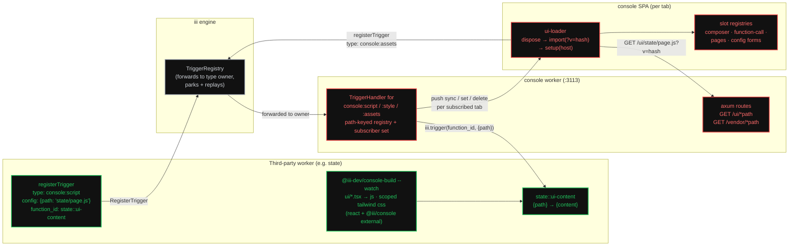

# Injectable Console UI

Third-party workers extend the console UI at **runtime**: add controls to the
chat composer, override how a function call renders, contribute whole new
pages and window-like surfaces (modals via the shared `Dialog` component),
and replace configuration forms — as plain React components, no iframes,
sharing the console's own React instance and component library.

A worker does it by registering triggers of two new **console-owned trigger
types**, `console:script` and `console:style` (a third console-owned type,
`console:assets`, is how tabs subscribe to updates — no stream worker
involved). The trigger's `config.path` (e.g.
`state/page.js`) is the asset's identity — registering the same path again
*overrides* it, which is also the hot-reload signal. The console worker fetches
the asset's source by invoking the trigger's `function_id` over the bus, serves
it to browsers from its own HTTP port (default 3113), and pushes an
invalidation frame so every open console tab disposes the old module and
re-imports the new one — the same dispose → re-import → re-register loop Vite's
HMR runtime performs, built on iii primitives instead of Vite.

Two load-bearing facts, both verified in source, shape the whole design:

1. **Trigger-type ownership is already a live push channel.** When any worker
   registers a trigger of a type the console owns, the engine forwards
   `Message::RegisterTrigger { id, trigger_type, function_id, config, metadata }`
   to the console's WebSocket immediately
   (`iii/engine/src/worker_connections/traits.rs:57-64`), forwards
   `UnregisterTrigger` on explicit removal (`iii/engine/src/trigger.rs:489-515`)
   **and** on the registering worker's
   disconnect (`iii/engine/src/trigger.rs:221-253`), parks registrations made
   while the console is down (`RegisterTriggerOutcome::Deferred`,
   `iii/engine/src/trigger.rs:40-49`), and replays every live binding when the
   console re-registers the type (`iii/engine/src/trigger.rs:311-375`). No new
   engine surface is needed — registration *is* the event.
2. **The engine never dedupes triggers by content.** Trigger identity is the
   auto-minted uuid `id` alone (`Eq`/`Hash` on `id` only,
   `iii/engine/src/trigger.rs:187-198`), and no SDK lets a caller choose it.
   Therefore "same path ⇒ override" is **console-worker policy**, implemented
   in its `TriggerHandler` with a path-keyed registry — the engine gives us
   delivery, not semantics.

## Why this exists

Every existing way to put worker-specific UI in the console is compile-time:

| Today | Mechanism | Cost |
|---|---|---|
| Per-function chat renderers | 13 `ToolView` families hand-chained with `??` in `FunctionCallCard.tsx` (`workers/console/web/src/components/function-call/FunctionCallCard.tsx:279-307`) | Edit console source, rebuild, release console |
| Worker pages (memory, browser, worktrees) | Compiled into `web/`, presence-gated via `buildViewOptions` (`workers/console/web/src/lib/nav-options.ts:9-28`) | The memory page touched **26 console files**, 23 under `web/src` (workers commit `2e31cb4b`) |
| Composer pickers | Boolean props per worker wired from `ChatView` (`workers/console/web/src/components/chat/Composer.tsx:332-375`) | Same |
| Configuration forms | One structural JSON-schema form for every worker (`.../WorkersTab/schema-form/SchemaForm.tsx:21-31`) | No per-worker form possible at all |

The registry sketch in the console's own renderer guide — `FunctionCallRenderer`
in `workers/console/docs/custom-function-call-message.md` §12 — is explicitly
"not implemented". This spec is that registry, generalized to four slot kinds
and made runtime-loadable, so a worker ships its console UI **with the worker**
instead of with the console. Nothing like it exists in either repo today
(no plugin/module-federation/import-map mechanism anywhere; `console:*`
trigger types exist nowhere — the engine's provider table
`iii/engine/src/trigger.rs:16-28` lists eleven types, none UI-shaped).

One honest caveat on the composer row: the v1 composer slot ships **additive
controls**. First-party-style pickers, whose power comes from mutating lifted
conversation state (mode, model, memory bank, working dir), remain compile-time
in v1 — see [slots-and-api.md § 1](slots-and-api.md#1-composeractions--extend-the-chat-composer)
and the non-goals below.

## Architecture



Red is new work in this spec (console worker + SPA), green is what a worker
author writes, grey is existing engine machinery used as-is. **No engine
changes are required** (one optional table entry, see
[injection-protocol.md § Engine touchpoints](injection-protocol.md#engine-touchpoints)).

## The lifecycle

```mermaid
sequenceDiagram
  participant W as worker (state)
  participant E as engine
  participant C as console worker
  participant B as console tab(s)

  B->>E: RegisterTrigger{type:"console:assets", function_id:"iii::console::ui-assets::<tab>"}
  E->>C: forward (console owns the type)
  C->>B: push {event:"sync", assets:[…]} — the subscription IS the seed
  W->>E: RegisterTrigger{type:"console:script", config:{path:"state/page.js"}, function_id:"state::ui-content"}
  E->>C: forward RegisterTrigger (console owns type "console:script")
  C->>C: validate path; supersede previous trigger for same path (if any)
  C->>W: iii.trigger("state::ui-content", {path}) → {content}
  C->>C: hash content; store {path → id, hash, bytes}
  C-->>E: TriggerRegistrationResult (ack, sent after the handler returns; error rejects registration)
  C->>B: push {event:"set", path, kind, hash} per subscribed tab (bus call over each tab's /ws)
  B->>B: dispose old module's registrations (if loaded)
  B->>C: GET /ui/state/page.js?v=<hash>
  B->>B: import(url) → mod.default(host) → slots re-registered

  Note over W,B: edit → console-build rebuilds → worker re-registers same path → same loop = hot reload
  Note over W,B: worker disconnects → engine GCs its triggers → UnregisterTrigger → C → push delete → tabs dispose
```

## What each document covers

Each concern has one home:

1. **The wire contract** — the three `console:*` trigger types (assets +
   subscription), the `{path}` config schema, the content-function contract,
   override and lifecycle semantics (replay, parking, disconnect GC),
   validation and acks, discovery, and the security posture:
   [injection-protocol.md](injection-protocol.md).
2. **Hot reload** — serving the assets (routes, headers, ETag), hash-based
   versioning, the `console:assets` push payloads, the browser loader
   algorithm (dispose → re-import → re-register), CSS link-swap, failure
   handling, and a point-by-point fidelity table against Vite's HMR
   (the registry structure itself lives in
   [injection-protocol.md § Override semantics](injection-protocol.md#override-semantics-same-path--override)):
   [hot-reload.md](hot-reload.md).
3. **Slots and the common API** — the boot contract (`window.__III_CONSOLE__`,
   the static import map, `/vendor/*` shims), the `@iii/console` module
   surface, the `setup(host)` module contract, the scope wrapper, the four
   slot kinds with their exact props (grounded in the real host components),
   and the prerequisite console refactors: [slots-and-api.md](slots-and-api.md).
4. **Authoring** — what a worker author writes: the `@iii-dev/console-build`
   pipeline (and its raw-esbuild equivalent), Node and Rust registration
   examples, the dev loop, the styling/Tailwind contract (scope wrapper,
   `@iii/console/tailwind.css` preset), and conventions (including why
   duplicating small components across workers is fine):
   [authoring.md](authoring.md).

## Decisions (and the alternatives they beat)

| Decision | Chosen | Rejected alternative | Why |
|---|---|---|---|
| Trigger type ids | `console:script` / `console:style` / `console:assets` | bare `script`/`style` (this spec's first draft); `console::script` | The console owns these types; the prefix makes ownership legible in every discovery listing and leaves bare names free for future platform-level types. Single colon is namespace style (`iii:devtools:*`), reserving `::` for function ids. Engine treats type ids as opaque strings either way. |
| Content transport | `config` carries `{path}` only; console fetches source by invoking the trigger's `function_id` | inline source in `config` | Inline source bloats every `engine::registered-triggers::list` response and every restart replay with full JS blobs; the fetch design gives the primitive's *mandatory* `function_id` field a real job. |
| Asset lifecycle | SDK Message-path registration: GC'd on worker disconnect, replayed by the SDK on reconnect | `engine::register_trigger` (durable) | Durable triggers survive their worker's death (`worker_id: None`, `iii/engine/src/workers/engine_fn/mod.rs:1615-1634`) — a page whose worker is gone is a broken page. Death-with-worker matches the existing presence-gated pages. |
| Override bookkeeping | path-keyed last-writer-wins in the console's `TriggerHandler`, **plus** `engine::unregister_trigger` on the superseded id | leave stale rows | Stale rows duplicate discovery output and are replayed on console restart in nondeterministic `DashMap` order; pruning keeps at most one live trigger per path (steady state) so replay order stops mattering. |
| Cache busting | content hash (`?v=<hex(sha256)[..16]>` — first 16 hex chars) | monotonic counter | Counters reset on console restart while browser module maps don't — a reset counter can collide with an already-imported URL and silently serve a stale module. Hashes are restart-proof and dedupe no-op replays for free. |
| HMR push channel | a third console-owned trigger type, `console:assets`: tabs register it (browser SDK), the console invokes each subscriber's `iii::console::ui-assets::<tab>` handler with `sync`/`set`/`delete` | the stream worker (`iii:devtools:ui-assets` — this spec's first draft); a new WS endpoint on :3113 | One mechanism — trigger-type ownership — carries both directions and drops the runtime dependency on the stream worker. Subscriptions inherit GC/replay/parking for free, sync-on-subscribe deletes the seed/frame race the stream draft had to argue away, and span suppression moves from the stream-name prefix to the `iii::` handler prefix. |
| React sharing | one **static** import map in `index.html` → `/vendor/*` shims re-exporting the SPA's bundled React from `window.__III_CONSOLE__` | externalize React from the Vite build; multiple/dynamic import maps | Zero change to the console's own bundling, and no dependency on multiple-import-map browser support (still uneven in 2026). Static single import maps are long-universal. |
| Module contract | default-export `setup(host)`; all registration through the per-script `host` | side-effect registration via `@iii/console` imports | The loader must attribute every slot registration to its script to dispose it on reload; a per-script scoped registrar makes that structural instead of heuristic. |
| Styling isolation | host-mounted scope wrapper (`data-iii-ui` + `display:contents`) on every injected render, worker CSS compiled selector-scoped under it | per-worker class prefixes; shadow DOM; convention-only docs | Prefixes forfeit vanilla-Tailwind authoring (and copy-paste); shadow DOM breaks the shared React tree, Radix portals, and host-component styling; convention-only leaves the failure silent and console-wide — unlayered injected CSS beats the console's fully-layered CSS at equal specificity. |
| Tailwind contract | generated `@iii/console/tailwind.css` preset (utilities-only, `data-theme` dark variant, `@theme inline` token map) + `@iii-dev/console-build` scoping | hand-maintained per-worker Tailwind SOP | Same rationale as the generated `/vendor` shims: hand-maintained token maps drift; generation + a CI assertion keep the preset ⊇ `index.css`'s `@theme`, and the build tool makes correct scoping the path of least resistance. |

Genuinely open (judgment calls surfaced, not blockers — defaults stated in the
linked docs): whether the `/ws` proxy should drop browser-originated
`registertriggertype` frames (recommended yes,
[injection-protocol.md § Security](injection-protocol.md#security--trust-model)),
and whether the 13 first-party renderer families migrate onto the new registry
in the same change (recommended yes,
[slots-and-api.md § Prerequisite refactors](slots-and-api.md#prerequisite-console-refactors)).

## Boundaries / non-goals

- **No sandboxing.** Injected scripts run with full console-origin privileges —
  by design the same trust level as any worker on the bus (which can already
  invoke arbitrary functions). Not a permission system; see
  [injection-protocol.md § Security](injection-protocol.md#security--trust-model).
  Likewise the `data-iii-ui` scope wrapper is styling hygiene, not isolation
  ([slots-and-api.md § The scope wrapper](slots-and-api.md#the-scope-wrapper)).
- **Behavior modification is render-level in v1.** The override slots replace
  what is *drawn*, never what happens: the submit pipeline, save/reset,
  approval actions, and error mapping stay host-owned, and composer extensions
  cannot mutate `ComposerSubmitPayload` or the first-party pickers' lifted
  conversation state (mode, model, memory bank, working dir). Injected
  components still *act* through `host.iii` — bus calls into their own worker.
  Deeper hooks (submit interception, save-pipeline hooks, function-call action
  hooks) are named v2 work; each is a chat/config-pipeline change, not a UI
  slot.
- **No dedicated "window" slot.** Window-like surfaces (modals, floating
  panels) come from rendering `host.components.Dialog` inside any slot or page
  — the console itself has no other windowing vocabulary (its only first-party
  overlay surfaces are `Dialog` and `Sheet`), so injected UI gets the same one.
- **No React state preservation across reloads.** Reload = dispose + remount of
  the script's slot contributions (Vite without react-refresh). Honest and
  cheap; react-refresh integration is future work.
- **No script-to-script imports** and no per-script import-map extensions. v1
  shared deps are exactly: `react`, `react-dom`, `react-dom/client`,
  `react/jsx-runtime`, `@iii/console`.
- **No asset persistence in the console worker.** The registry is rebuilt from
  engine replay + SDK reconnect replay; an engine restart wipes triggers
  engine-wide (in-memory `DashMap`s, `iii/engine/src/trigger.rs:200-210`) and
  workers re-register on reconnect.
- **No engine protocol changes.** The one engine-repo touchpoint is an optional
  install-hint table entry.
- **Browser tabs as asset *sources* are unsupported** (a tab technically can
  register any trigger; the asset contract targets workers). Tabs registering
  `console:assets` subscriptions is the design; tabs registering
  `console:script` is not.
- The devexp overhaul (worker-compose, PRs #1914/#1920) reshapes worker boot
  and config but nothing UI-facing; this spec is orthogonal and assumes the
  current `config.yaml` console worker as shipped.

## Conventions

This spec follows the repo SOPs in `workers/docs/sops`:

- **Function ids** are kebab-case `<worker>::<verb>` (`binary-worker.md`):
  `console::ui-manifest`, `state::ui-content`. Trigger-type ids and target
  function ids are public wire surface; renames are breaking.
- **Typed handlers only** — every new console function and the trigger config
  register JSON Schemas (`.trigger_request_format::<ScriptTriggerConfig>()`),
  though the engine treats trigger config schemas as advisory
  (`iii/engine/src/workers/engine_fn/mod.rs:805`); the console's
  `TriggerHandler` is the enforcing validator.
- **Trigger types register before functions** (`workers/approval-gate/src/events.rs:195-227`
  precedent), and the console's `SKILL.md` gains the trigger-binding section
  required by `workers/DOCUMENTATION_GUIDELINES.md` once it owns trigger types.
- Injected assets and handlers stay **out of user-facing catalogs**: browser
  handler ids keep the `iii::` prefix (span-suppressed,
  `iii/engine/src/workers/telemetry/mod.rs:202-220`), console functions carry
  `metadata.internal = true` like `console::status`.

## Prior art

- `workers/console/docs/custom-function-call-message.md` — the per-function
  renderer contract this spec turns into a runtime registry (its §12 sketch;
  note the doc is stale on host-file names — the host is `FunctionCallCard.tsx`
  with 13 families, not `FunctionCallMessage.tsx` with 5).
- `workers/memory/src/events.rs:107-152` and
  `workers/approval-gate/src/events.rs:195-227` — the canonical Rust
  `TriggerHandler`-over-a-worker-local-set pattern the console's script/style
  handler follows (extended to two-key path/id bookkeeping).
- `workers/console/web/src/lib/traces-stream.ts:172-198` — the
  live-subscription precedent: the first draft reused its stream channel
  verbatim; the final design keeps only its shape (subscribe → converge) on
  the `console:assets` trigger type, cutting the stream worker out entirely.
- Vite HMR — the dispose → cache-busted re-import → re-register loop and CSS
  link-swap this design mimics; divergences called out in
  [hot-reload.md § Vite fidelity](hot-reload.md#vite-fidelity-what-we-mimic-what-we-dont).
- [`engine-register-trigger-metadata.md`](../engine-register-trigger-metadata.md)
  — the metadata sidecar and `engine::register_trigger` surface (with one
  stale claim this spec corrects: function-path triggers are **not**
  disconnect-GC'd; see
  [injection-protocol.md § Lifecycle](injection-protocol.md#lifecycle-matrix)).
