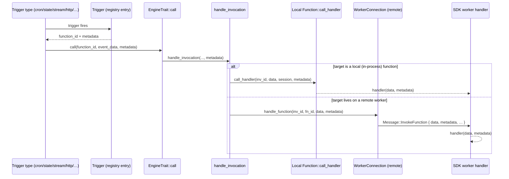

# Tech Spec — `engine::register_trigger` / `unregister_trigger` with first-class invocation metadata

**Status:** In progress — engine + all four SDKs landed; harness wiring + end-to-end test remain.
**Tracking:** MOT-3747 · branch `feat/engine-register-trigger`
**Source of truth:** commits `91a5f7947` (initial) and `6c3027ea7` (current design). All `file:line` references below are against `6c3027ea7` (HEAD).

---

## 1. Summary

Add two engine functions — `engine::register_trigger` and `engine::unregister_trigger` — that let any worker (notably the harness) register, at runtime, a trigger whose fire is delivered to an arbitrary target function, carrying arbitrary per-registration `metadata` that surfaces at invocation time.

The load-bearing decision: **metadata travels as a distinct channel through the whole invocation path, not folded into the payload and not via a per-registration proxy function.** The engine threads `metadata: Option<Value>` through `EngineTrait::call`, `InvocationHandler::handle_invocation`, `Function::call_handler`, and the `HandlerFn` / `FunctionHandler` signatures; carries it over the wire on `Message::InvokeFunction`; and every trigger-fire path passes the trigger's metadata as that distinct argument at fire time. `engine::register_trigger` then binds the trigger **directly** to `function_id` with `metadata` on the `Trigger` — no wrapper function is created, so there is nothing to leak or garbage-collect.

---

## 2. Motivation

The harness needs to register triggers at runtime — e.g. "when an HTTP request hits `/hello`, notify this session" — and, when the trigger fires, recover the per-trigger context (`session_id`, `subscription_id`, …) that told it *which* registration fired. Engine routing drops that context today: a trigger fires a `function_id` with an event payload and nothing else. A single target function (e.g. `harness::notify-session`) may back thousands of registrations and has no way to tell them apart.

**The load-bearing constraint:** the target function is shared across many registrations, and the payload it receives is the *event* (owned by the trigger type), not the *registration context*. Any solution must attach registration-time context that (a) reaches the handler at fire time, (b) does not collide with or corrupt the event payload, and (c) does not require every trigger-type worker to change.

---

## 3. Design evolution (honest framing)

This design went through three shapes. The spec describes the **final** one; the earlier two are recorded so the divergence from the original ticket text is explicit.

| Iteration | Mechanism | Problem |
|---|---|---|
| **Original (design doc)** | `register_trigger` registers a per-registration wrapper function that folds `metadata` into the payload and forwards to the real target. | Documented **memory leak**: the wrapper is never reclaimed on unregister or worker disconnect. |
| **v1 (`91a5f7947`)** | Wrapper kept, but given a *derivable* id `engine::trigger-proxy::{trigger_id}` and merged metadata under `payload.__metadata`. Reclaimed on unregister and worker-disconnect GC. | Still creates one internal function per registration; still mutates the payload (`__metadata`); GC logic must chase engine-owned functions that `unregister_worker` would miss. |
| **v2 / current (`6c3027ea7`)** | **No wrapper at all.** Trigger binds directly to `function_id`; `metadata` rides on the `Trigger` and is delivered as a distinct call argument threaded through the invocation path. | — |

The current design eliminates the leak *by construction* (there is no per-registration function to leak), leaves the event payload untouched, and needs no proxy-GC bookkeeping. It costs one additive `Option<Value>` argument on the invocation path and one additive field on the wire message.

> **Divergence from the ticket text:** the ticket's acceptance criteria describe metadata "merged under `__metadata`" and a "proxy … GC'd on unregister and worker-disconnect." The current implementation satisfies the *intent* of those criteria (metadata round-trips; nothing leaks) but via a different mechanism: metadata is a **separate argument**, not a `__metadata` payload key, and there is **no proxy**. See §13.

---

## 4. Architecture: the metadata channel

Metadata is an `Option<Value>` sidecar threaded end-to-end. It is never merged into `data`.

### 4.1 Core contracts (engine)

All signatures below are current (`6c3027ea7`). `metadata: Option<Value>` is always the **final** parameter.

**`EngineTrait::call`** — `engine/src/engine/mod.rs:200`

```rust
pub trait EngineTrait: Send + Sync {
    async fn call(
        &self,
        function_id: &str,
        input: impl Serialize + Send,
        metadata: Option<Value>,
    ) -> Result<Option<Value>, ErrorBody>;
```

**`InvocationHandler::handle_invocation`** — `engine/src/invocation/mod.rs:76`

```rust
pub async fn handle_invocation(
    &self,
    invocation_id: Option<Uuid>,
    worker_id: Option<Uuid>,
    function_id: String,
    body: Value,
    function_handler: Function,
    traceparent: Option<String>,
    baggage: Option<String>,
    session: Option<Arc<Session>>,
    metadata: Option<Value>,
) -> Result<Result<Option<Value>, ErrorBody>, RecvError>
```

For **local** functions, `handle_invocation` forwards metadata straight into the handler — `engine/src/invocation/mod.rs:167`:

```rust
.call_handler(Some(invocation_id), body, session, metadata)
```

**`Function::call_handler` and `HandlerFn`** — `engine/src/function.rs:29`, `:43`

```rust
pub type HandlerFn =
    dyn Fn(Option<Uuid>, Value, Option<Arc<Session>>, Option<Value>) -> HandlerFuture + Send + Sync;

pub async fn call_handler(
    self,
    invocation_id: Option<Uuid>,
    data: Value,
    session: Option<Arc<Session>>,
    metadata: Option<Value>,
) -> FunctionResult<Option<Value>, ErrorBody> {
    (self.handler)(invocation_id, data.clone(), session, metadata).await
}
```

**`FunctionHandler::handle_function`** (the remote-worker entry point) — `engine/src/function.rs:54`

```rust
pub trait FunctionHandler {
    fn handle_function<'a>(
        &'a self,
        invocation_id: Option<Uuid>,
        function_id: String,
        input: Value,
        metadata: Option<Value>,
    ) -> Pin<Box<dyn Future<Output = FunctionResult<Option<Value>, ErrorBody>> + Send + 'a>>;
}
```

### 4.2 Wire protocol

For **remote** workers, `WorkerConnection::handle_function` serializes metadata onto the invocation message (`engine/src/worker_connections/traits.rs:126`), so it crosses the WebSocket alongside — but separate from — `data`.

**`Message::InvokeFunction`** — `engine/src/protocol.rs:85`

```rust
InvokeFunction {
    invocation_id: Option<Uuid>,
    function_id: String,
    data: Value,
    #[serde(skip_serializing_if = "Option::is_none")]
    traceparent: Option<String>,
    #[serde(skip_serializing_if = "Option::is_none")]
    baggage: Option<String>,
    #[serde(skip_serializing_if = "Option::is_none")]
    action: Option<TriggerAction>,
    /// Per-invocation metadata sidecar, delivered to the target handler as a
    /// distinct argument (not folded into `data`). Optional and additive:
    /// omitted when absent, so older peers that don't send/expect it stay
    /// wire-compatible.
    #[serde(default, skip_serializing_if = "Option::is_none")]
    metadata: Option<Value>,
},
```

`#[serde(default, skip_serializing_if = "Option::is_none")]` is the backward-compat lever (§10): omitted from JSON when `None`; decodes to `None` when a peer never sends it.

> Note: metadata is **not** stored on the in-flight `Invocation` struct (`engine/src/invocation/mod.rs:33`); it flows as a parameter of `handle_invocation` and is consumed either locally (into `call_handler`) or onto the outbound wire message. It does not participate in the pending-invocation response bookkeeping.

### 4.3 Trigger carries metadata

**`Trigger`** — `engine/src/trigger.rs:174`

```rust
#[derive(Clone, Debug, Eq, Serialize, Deserialize)]
pub struct Trigger {
    pub id: String,
    pub trigger_type: String,
    pub function_id: String,
    pub config: Value,
    pub worker_id: Option<Uuid>,
    #[serde(skip_serializing_if = "Option::is_none")]
    pub metadata: Option<Value>,
}
```

### 4.4 Invocation flow (fire → handler)



---

## 5. `engine::register_trigger` / `engine::unregister_trigger`

### 5.1 Input / output shapes

`engine/src/workers/engine_fn/mod.rs:369`–`:410`

```rust
pub struct RegisterTriggerInput {
    /// Trigger type to bind (e.g. `cron`, `state`, `stream`, or a custom worker
    /// trigger type).
    pub trigger_type: String,
    /// The function the fire is delivered to. The trigger binds directly to it;
    /// `metadata` is delivered alongside the payload as a distinct argument.
    pub function_id: String,
    /// Trigger-type-specific configuration, passed through verbatim.
    #[serde(default)]
    pub config: Value,
    /// Arbitrary metadata delivered to the target handler as a distinct argument
    /// (not folded into the payload).
    #[serde(default)]
    pub metadata: Option<Value>,
    /// Injected by the engine from the calling worker; scopes the trigger so it
    /// is GC'd when that worker disconnects. Absent for in-process callers.
    #[serde(rename = "_caller_worker_id", default)]
    pub caller_worker_id: Option<String>,
}

pub struct RegisterTriggerResult { pub id: String }

pub struct UnregisterTriggerInput {
    /// The trigger id returned by `engine::register_trigger`.
    pub id: String,
    /// Optional trigger-type hint; accepted for symmetry with the protocol
    /// message but not required for the registry lookup.
    #[serde(default)]
    pub trigger_type: Option<String>,
}

pub struct UnregisterTriggerResult { pub removed: bool }
```

| Function | Input | Returns |
|---|---|---|
| `engine::register_trigger` | `trigger_type`, `function_id`, `config`, `metadata?`, `_caller_worker_id` (engine-injected) | `{ id }` — the trigger id |
| `engine::unregister_trigger` | `id`, `trigger_type?` (hint) | `{ removed: bool }` |

### 5.2 `register_trigger_fn` behavior

`engine/src/workers/engine_fn/mod.rs:1403`. Steps, in order:

1. **RBAC gate (session-scoped).** If a `Session` is present *and* it declares `allowed_trigger_types`, reject with `FORBIDDEN` unless `trigger_type` is in the allow-list. Parity with the `Message::RegisterTrigger` path. (See §12 for the deliberate hook divergence.)
2. **Mint a trigger id** — `uuid::Uuid::new_v4()`.
3. **Resolve worker scope** — parse `_caller_worker_id` into `Option<Uuid>`; unparseable/absent ⇒ `None` (in-process caller).
4. **Bind directly.** Build a `Trigger { id, trigger_type, function_id, config, worker_id, metadata }` and `trigger_registry.register_trigger(trigger)`. No proxy function is created.
5. **Fail closed.** If the registry bind errors (e.g. unknown trigger type), return `trigger_registration_failed`; because nothing else was created, there is nothing to roll back.
6. Return `{ id }`.

### 5.3 `unregister_trigger_fn` behavior

`engine/src/workers/engine_fn/mod.rs:1461`. Delegates to `TriggerRegistry::unregister_trigger`, which is **idempotent** — `engine/src/trigger.rs:337`:

```rust
pub async fn unregister_trigger(
    &self, id: String, trigger_type: Option<String>,
) -> Result<bool, anyhow::Error> {
    // ...
    let Some(trigger_entry) = self.triggers.get(&id) else {
        return Ok(false); // unknown id → no-op, not an error
    };
    // ... run the registrator's unregister, then:
    self.triggers.remove(&id);
    Ok(true)
}
```

`removed: false` means "no such trigger" (double-unregister is safe); `removed: true` means it existed and was removed. A registrator-side error is propagated and leaves the registry entry intact (registry and registrator stay consistent).

---

## 6. Trigger-fire path coverage

Every path that fires a **trigger** threads the trigger's metadata as the third argument to `engine.call`. Non-trigger invocations (message dequeue, auth, middleware, direct stream ops) pass `None` by design — they have no registration context to carry.

| Path | File:line | Metadata source | Threads metadata? |
|---|---|---|---|
| Cron trigger fire | `workers/cron/structs.rs:207` | `CronJobInfo.metadata` (stored at register time) | ✅ |
| State trigger fire | `workers/state/state.rs:533` | `trigger.trigger.metadata` | ✅ |
| Stream trigger fire | `workers/stream/stream.rs:922` | `trigger.metadata` | ✅ |
| HTTP/REST trigger fire | `workers/rest_api/views.rs:554` | `RouterMatch.metadata` | ✅ |
| Engine internal triggers (`fire_triggers`, workers/functions-available) | `workers/engine_fn/mod.rs:442`, `:1055` | `trigger.metadata` | ✅ |
| Queue subscriber invocation | `workers/queue/queue.rs:872` | — (dequeue, not a trigger) | `None` |
| Stream authentication | `workers/stream/stream.rs:123` | — (pre-connection auth) | `None` |
| Stream ops (`stream::set/get/delete/update/list/list_all`) | `workers/stream/stream.rs:990, 1079, …` | — (direct function calls) | `None` |
| REST middleware / condition | `workers/rest_api/views.rs:195`, `condition.rs:19` | — (cross-cutting) | `None` |

Because the round-trip happens at the invocation layer, **no trigger-type worker needed to change** to gain metadata support — only their fire call-sites now pass `trigger.metadata` instead of nothing.

---

## 7. Worked example — HTTP "notify-session" (end-to-end)

The canonical harness use case, verified through the code path:

```jsonc
// Worker calls:
iii.trigger("engine::register_trigger", {
  trigger_type: "http",
  function_id: "harness::notify-session",
  config: { method: "GET", path: "/hello" },
  metadata: { session_id: "s_42", subscription_id: "sub_abc" }
})
```

1. `register_trigger_fn` binds `Trigger { trigger_type: "http", function_id: "harness::notify-session", metadata: {…}, worker_id: <caller> }`.
2. The HTTP trigger registrator stores that metadata on the route: `PathRouter…​.with_metadata(trigger.metadata.clone())` — `workers/rest_api/api_core.rs:900`.
3. A `GET /hello` arrives. `get_router` builds a `RouterMatch` copying `metadata: r.metadata.clone()` — `api_core.rs:766`.
4. `views.rs:554` invokes `engine.call(&function_id, api_request_value, metadata)`.
5. `harness::notify-session` receives the HTTP request as `data` **and** `{ session_id: "s_42", subscription_id: "sub_abc" }` as `metadata` — recovering exactly which registration fired.

---

## 8. SDK surfaces

All four SDKs (a) surface the metadata sidecar to handlers and (b) let callers attach it at trigger/invoke time. Every addition is additive.

| SDK | Handler receives | Caller attaches | Wire field | Back-compat mechanism |
|---|---|---|---|---|
| **Rust** | `\|input: Value, metadata: Option<Value>\|` (`iii.rs:643`) via `RegisterFunction::new_async_with_metadata` (`iii.rs:632`) | `IIIClient::trigger_with_metadata(req, Option<Value>)` (`iii.rs:1154`) | `protocol.rs:114` `metadata: Option<Value>` | serde `default` + `skip_serializing_if = "Option::is_none"` |
| **Node** | `(data, metadata?) => …` — `RemoteFunctionHandler` (`types.ts:32`) | `trigger({ …, metadata })` — `TriggerRequest.metadata?` (`iii-types.ts:153`) | `InvokeFunctionMessage.metadata?` (`iii-types.ts:187`) | optional param; `undefined` dropped from JSON |
| **Python** | `def handler(data, metadata=None)` (or `*, metadata=None` / `**kwargs`) — arity-detected by `_metadata_passing_mode` (`iii.py:68`) | `trigger({ …, "metadata": … })` — `TriggerRequest.metadata` (`iii_types.py:241`) | `InvokeFunctionMessage.metadata` (`iii_types.py:252`) | signature inspection keeps 1-arg handlers working; Pydantic `exclude_none` |
| **Go** | `func(ctx, data, metadata json.RawMessage) (any, error)` — `Handler` (`client.go:88`) | `TriggerRequest.Metadata` (`client.go:252`) | `InvokeFunctionMessage.Metadata` (`protocol.go:196`) | struct field `json:"…,omitempty"`; `nil` omitted |

**Python back-compat detail:** `_metadata_passing_mode` inspects the user handler's signature and returns `positional` (`def f(data, metadata=None)`), `keyword` (`def f(data, *, metadata=None)` / `**kwargs`), or `none` (legacy `def f(data)`). Existing single-argument handlers are detected as `none` and never receive the extra argument — no code change required.

---

## 9. Lifecycle & garbage collection

- **Worker scoping.** A trigger registered with `_caller_worker_id` records `worker_id` on the `Trigger`. On that worker's disconnect, `TriggerRegistry::unregister_worker` drops its triggers.
- **No proxy GC.** Because the current design creates no per-registration function, the v1 "drop the derived `engine::trigger-proxy::{id}` on unregister and on disconnect" bookkeeping is gone. The only thing to reclaim is the trigger registry entry itself, which the existing worker-disconnect path already handles.
- **Explicit unregister.** `engine::unregister_trigger` removes the registry entry (idempotent).

---

## 10. Backward compatibility

The change is additive on every boundary:

- **Wire:** `Message::InvokeFunction.metadata` is `#[serde(default, skip_serializing_if = "Option::is_none")]` in the engine and mirrored in all SDK protocols (Rust `Option<Value>`, Node optional, Python `| None`, Go `omitempty`). An old engine/worker that never sends the field decodes it to absent/`None`; a new peer sending `None` omits it. No version handshake needed.
- **Trigger:** `Trigger.metadata` is `skip_serializing_if = "Option::is_none"`, so serialized triggers without metadata are unchanged.
- **Handlers:** existing handlers keep their old arity — Rust adds a *new* constructor (`new_async_with_metadata`) rather than changing the old one; Node's second param is optional; Python detects arity; Go handlers already take the third param but receive `nil`.
- **`unregister_trigger` return type** changed from `Result<()>` to `Result<bool>`. Internal to the engine; the only caller is `unregister_trigger_fn`.

---

## 11. Testing

**Engine unit tests** (`engine/src/workers/engine_fn/mod.rs`):
- `register_trigger_fn_binds_directly_and_delivers_metadata_as_arg` (`:3190`) — asserts the trigger binds directly to the target (no proxy), `worker_id`/`metadata` are set, and on fire the handler gets the untouched payload plus metadata as the distinct 3rd argument (`payload.__metadata` is absent).
- `unregister_trigger_fn_removes_trigger_and_is_idempotent` (`:3271`) — first unregister returns `removed: true`, second returns `removed: false`.
- `register_trigger_fn_unknown_type_fails_without_registering` (`:3321`) — failed bind leaves no trigger behind.

**Protocol / wire tests:** `worker_connections/traits.rs` asserts metadata rides as a distinct field on `Message::InvokeFunction`, not folded into `data`.

**SDK tests:** `node/…/tests/invoke-metadata.test.ts`, `python/…/tests/test_invocation_metadata.py` + `test_trigger_metadata.py`, `go/…/client_test.go` + `protocol_test.go`, Rust SDK protocol tests.

**Engine-wide fire paths:** the cross-cutting `engine.call(…, metadata)` change is exercised by the existing e2e suites (cron/state/stream/http/queue configuration e2e), updated to the new call arity.

---

## 12. Security / RBAC

`register_trigger_fn` honors `session.allowed_trigger_types` when a `Session` is present, matching the `Message::RegisterTrigger` path. **Deliberate divergence:** the `on_trigger_registration` hook is *not* replicated here — it is Message-path only. Session-less local deployments therefore bypass RBAC entirely (there is no session to gate against), which is intended: RBAC is a property of externally-authenticated worker sessions, not in-process engine callers.

---

## 13. Divergences from the original ticket design (called out)

| Ticket / doc wording | Current implementation | Why |
|---|---|---|
| metadata "merged under `__metadata`" in the payload | metadata delivered as a **separate argument**; payload untouched | avoids colliding with/corrupting the event payload; no key-name coupling |
| "registers a derived internal proxy function `engine::trigger-proxy::{id}`" | **no proxy** — trigger binds directly to `function_id` | removes the leak class entirely and all proxy-GC bookkeeping |
| "proxy is GC'd on unregister and on worker disconnect" | only the trigger registry entry is reclaimed (existing paths) | nothing else is created, so nothing else to reclaim |
| "rollback on bind failure removes the proxy" | fail-closed with no side effects to roll back | same reason |

The **intent** of every ticket acceptance criterion is met; see §14 for the mapping.

---

## 14. Acceptance-criteria mapping

| Ticket AC | Status | Where |
|---|---|---|
| `register_trigger` binds a trigger that forwards to `function_id` with metadata surfaced; returns the trigger id | ✅ (as a distinct argument, not `__metadata`) | §5.2, §11 |
| `unregister_trigger` removes the trigger; idempotent (no error on unknown id) | ✅ | §5.3, `trigger.rs:337` |
| No leaked functions on unregister / registering-worker disconnect | ✅ (no per-registration function exists) | §9 |
| Failed registry bind does not leak | ✅ (nothing to roll back) | §5.2 |
| Session `allowed_trigger_types` enforced when a session is present | ✅ | §12 |
| Harness registers a "notify-session" trigger and recovers context from metadata | ⏳ engine + HTTP path proven end-to-end in code; harness function + e2e test outstanding | §7, §15 |

---

## 15. Boundaries, non-goals & remaining work

**Non-goals**
- Persisting triggers across engine restarts (registry remains in-memory; unchanged).
- Metadata schema/validation — `metadata` is opaque `Value`; the engine never inspects it.
- Adding metadata to non-trigger invocations (queue dequeue, auth, middleware) — these intentionally pass `None`.
- Replicating the `on_trigger_registration` hook onto the function path (§12).

**Remaining work**
- Wire the harness `harness::notify-session` function that consumes `metadata` (`session_id`, `subscription_id`).
- Add an engine-level end-to-end test for `engine::register_trigger` → fire → metadata recovery (current engine coverage is unit-level; SDKs have their own metadata tests).

**Related:** MOT-3750 ("allow registering trigger on a not-yet-existent trigger type") is adjacent — it concerns bind ordering during worker spin-up and is tracked separately.

---

## 16. References

- Design doc: *Daily Sync July* → "Register Trigger Function" section (includes the original leaky pseudo-code and the memory-leak note).
- Tracking issue: MOT-3747.
- Commits: `91a5f7947` (proxy-based v1), `6c3027ea7` (first-class metadata channel — current).
