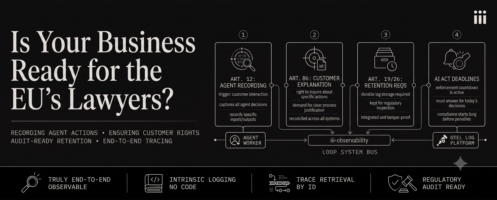
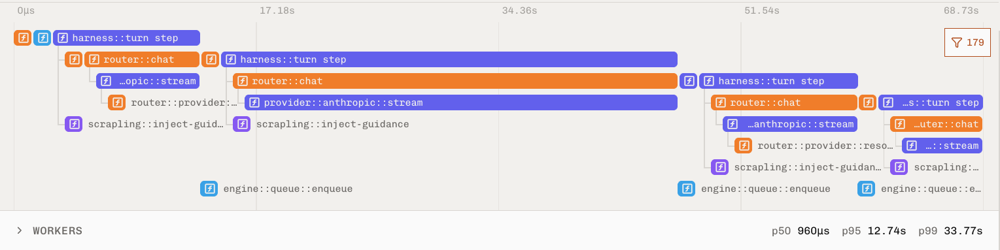

I am not a lawyer and this is not legal advice. What I am is the person who updates the software stacks when the lawyers say we need to comply with a new regulation, and as such I want to share my well informed opinion on how most software companies will deal with the EU AI Act when it's in full effect: terribly, and with countless billable hours reconciling logs when enforcement comes knocking. This is because present day logging infrastructure, even if "end-to-end," is not designed for the court room, it's designed to find outages and bugs. It won't survive contact with the coming requirements.

You may have heard that on August 2nd the EU enacted Article 50 of its AI Act, which is related to disclosure. You need to tell users when they're talking to an AI chatbot, viewing AI generated content, etc. Simple enough, and many businesses are already doing this. Far fewer businesses are prepared for what's coming next: Article 12, 19, 26, and 86. These articles cover:

1. **Article 12:** Recording what your AI agents are doing across any part of your business that interacts with customers and their data.
2. **Article 86:** The right of any customer to ask [about many kinds of activities](https://artificialintelligenceact.eu/annex/3/) and to have you explain why your AI agent took an action, and exactly what it did.
3. **Article 19 & 26:** Retention requirements that these logs be kept.

If you grabbed a software provider randomly out of a hat you'd find that most of them would be able to meet requirement 3 relatively easily by expanding their log retention period, and may already meet it today. The others, not so much.

Bundles of gzipped logs stored on offsite servers and tape are not going to be easy to dig through when a customer asks why an AI agent denied their employment application. Only compounded by the fact that your API gateway, AI agent, and database logs all represent separate sets of logs and traces. Logs and traces that likely disagree with each other. Decision criteria that may be mismatched across different versions of the software that produced them.

Start digging through logs intended to find outages or bugs and you'll quickly find no single throughline for why or even how a decision was made. This is the difference between your current logging process and what the EU AI Act wants, and it's one of several traps that many companies are going to walk right into.

The traps are:

1. Logging agent conversations is enough
2. We're not in one of those industries and won't be affected
3. Our stack already covers this
4. It's delayed, we'll build it closer to the deadline

## What modern observability looks like

Before we get to the traps I want to illustrate a core and fundamental property of iii, which is not just something I'm passionate about but clearly illustrates the issue that present day systems have with the EU AI Act.

Here's the command you need to run to add end-to-end observability to iii: `iii worker add iii-observability`, or ask our agentic harness to "add observability" with a two word prompt.

Here's the code you need to add and maintain on each of your services to reconcile traces across your production environment and produce the end-to-end traces you're going to need to comply with EU regulations:

```
// It's empty, you don't need any code.
```

Here's the code you need to add when you incorporate a new AI agent into your existing iii system:

```
// It's the same. Zero.
```

There is no code to add, there is no platform to change, it's just a configuration file pointed at your logging platform, and you might also need to bump your OTel logger's retention period. iii exports to any OTel logging platform. No other system that I'm aware of has this capability to truly map decisions and actions end-to-end.

The configuration is uncomplicated too, so much so it's obvious what it does without even looking at our docs:

```yaml
- name: iii-observability
  config:
    enabled: true
    exporter: both          # memory for the live console, otlp for durable retention
    endpoint: http://otel-collector.internal:4317
    metrics_enabled: true
    logs_enabled: true
    sampling_ratio: 1.0     # you do not sample the thing a regulator will ask about
```

In iii a trace that starts at a browser click, passes through an agent, hits a Python scoring worker, writes to state, and renders back in the browser is one trace, because there is one engine mediating all of it.

In a conventional stack every hop is a separate integration: the gateway, the agent framework, the scoring service, the database layer. Each one needs instrumentation code written, tested, and maintained, and each one is a place where the trace can break silently. You end up needing to accept some unknown level of fragility in the records you'll be handing to a regulator.

As mentioned earlier, existing observability systems create traps for EU AI Act compliance. Let's talk about those.

## Trap 1: We already log agent conversations

Conversations with agents, and records of their tool calls, and documents retrieved, are the smallest part and most trivial aspect of the trace. They're also the part that is easy to assume reflects reality, but anyone who has worked with agents day to day knows that their reality and actual reality rarely align.

The agent says it made a call to a tool and the tool says the result, but did it? An agentic framework like LangChain or LangGraph, after some integration work, can record the actual call and actual response. It's far less likely to tell you if the request led to actual database writes, if those writes were correct, if subagents conflicted on writes, or if the response is from an outdated cache that then led it to make other incorrect actions.

These are just some examples, the actual space of possibilities that could happen from an agent's actions aren't knowable in advance, and any attempt to integrate logging through traditional deterministic means is not going to be able to encapsulate every stochastic possibility.

In iii an agent is just another worker in its system. If you installed `iii-observability` like earlier, then that worker has every action recorded as part of the same trace. Here's what that looks like in our console:



You can see every single harness turn, every request to the 3rd party AI provider, every streamed response, every queued function, every tool called, and every error as one trace.

## Trap 2: We're not in one of those industries

Again, I'm not a lawyer, but my reading of Article 86, and in particular its reference to Annex III, is that it applies to the function being performed and not the sector. Are you screening applicants for positions through a third party? You might be fine.

Does any part of the screening process touch your internal infrastructure, such as enrichment, scoring, ranking, filtering, summarizing, or human in the loop review? You're going to have an obligation to have accurate records on your end of the process.

Point 4(a) of Annex III covers systems used to place targeted job advertisements, analyse and filter job applications, and evaluate candidates. There's no exemption for "we're a SaaS company, not an HR company." Article 6(3) allows a narrow carve-out for systems that only perform preparatory or narrowly procedural tasks, but Article 6(4) makes you document the assessment, which means you need records to support it.

Here's why that's an observability problem rather than just a legal one. If you're clearly in scope, you know you have to instrument for it. The dangerous position is being partially in scope: a screening process that runs mostly through a third party, but where enrichment, scoring, ranking, or human-in-the-loop review touches your infrastructure. Those are the places that companies miss, or delay observability due to competing priorities. When the request arrives, the third party has its account, you have yours, and the part where a small piece of your system majorly impacted an outcome has no trace, no record.

Orchestrate two or more third-party systems and the problem compounds: now you also have to prove what happened between them, from logs that weren't built to be reconciled with each other.

In iii the integration complexity, both for the system and its observability, is always the same: zero.

## Trap 3: Our stack already is end-to-end observable

Have you ever hit a limit debugging through logs and needed to go take a look at the code that produced that log to understand what actually happened? If so, then your stack isn't truly end-to-end observable, it has gaps, and reconstructing what happened in those gaps is no simple task.

Handling these situations is already hard in the technical sense, and that's dealing with the currently deployed code which produced the currently observed bug. Now imagine examining the logs and debugging the code deployed last year for a legal request that spans from then into the present day. You'll be facing not just gaps in the end-to-end logs but gaps in institutional knowledge, and legal pressure far higher than the current scenario of a few dissatisfied customers.

Your end-to-end stack finds outages cheaply, the EU AI Act wants to know about decisions. iii records the outages *and* the entire decision tree.

## Trap 4: We'll build it later

Okay fine, the high-risk obligations for standalone Annex III systems did move. The Digital Omnibus pushed them from August 2, 2026 to December 2, 2027, with embedded systems under Annex I following in August 2028.

But note what didn't move: your obligation to explain what happened today on December 3, 2027. A request made on December 3, 2027 about a decision made the previous April still needs to prove why an agent did what it did in April. The deadline defers when you must be able to answer. It does not defer when the events you'll be answering about start happening.

If your plan is to build this in mid-2027, your plan is to be unable to explain the first eight months of decisions your system makes under the new regime.

## Retrieving an end-to-end trace from iii

All of the traps above center around one core issue of present day observability: ***retrieval***. Emitting telemetry is solved. Actually getting the *specific* information you need back out at a later date is very hard, particularly when it's about a specific case rather than a systemic failure. Your observability dashboards are built for aggregates, a regulator wants to know about a specific person or person(s).

On iii retrieval is just a function call like any other part of the system, so eighteen months later when a legal request arrives for agent actions taken across a set of potential hires or current users, you can reliably pull exactly what you need:

```javascript
const subjectIds = ["cand_8f21c", "cand_3b90a", "cand_c74e2", ...] //+300 more users

const traceIdsBySubject = new Map()

for (const subjectId of subjectIds) {
  const { spans } = await iii.trigger({
    function_id: "engine::traces::list",
    payload: {
      attributes: { "subject.id": subjectId },
      start_time: "2027-04-01T00:00:00Z",
      end_time: "2027-04-30T23:59:59Z",
      include_internal: true,
      limit: 500,
    },
  })

  traceIdsBySubject.set(subjectId, [...new Set(spans.map((s) => s.trace_id))])
}
```

Or you can go to your logger and query for exactly the same thing, because all the data you could ever possibly need about your system is not just available but programmatically reconcilable and easily retrieved.

## It's about logging better, not logging more

The AI Act is not asking you to log more. Most companies already log too much. It's asking you to be able to answer a question about a single decision, made by a system that has since changed, in a way that holds up to a hostile reading and prosecution.

Manually integrated observability produces sets of separately-authored accounts of the same event. You can reconcile them, at length, at cost, under pressure. Intrinsic observability, like the kind iii provides, produces one trace with zero reconciliation. The only thing iii can't change is the legal pressure, but it can certainly make it a lot easier to answer every question.

You have until December 2, 2027 to be able to answer. You have until roughly now to **start producing** the records you'll be answering with. If your stack requires a project to get there, start the project. If it's on iii, it's already accounted for with a small configuration change.

If you want to try using iii for your next or current project then visit our install guide to get started: [iii.dev/docs/install](https://iii.dev/docs/install). We've also got a Discord where someone is always around to help out: [discord.gg/iiidev](https://discord.gg/iiidev).

Website: [iii.dev](https://iii.dev). Github: [github.com/iii-hq/iii](https://github.com/iii-hq/iii). Worker registry: [workers.iii.dev](https://workers.iii.dev/). Docs: [iii.dev/docs](https://iii.dev/docs).

Mike Piccolo, Founder & CEO [@iiidevs](https://x.com/iiidevs)
