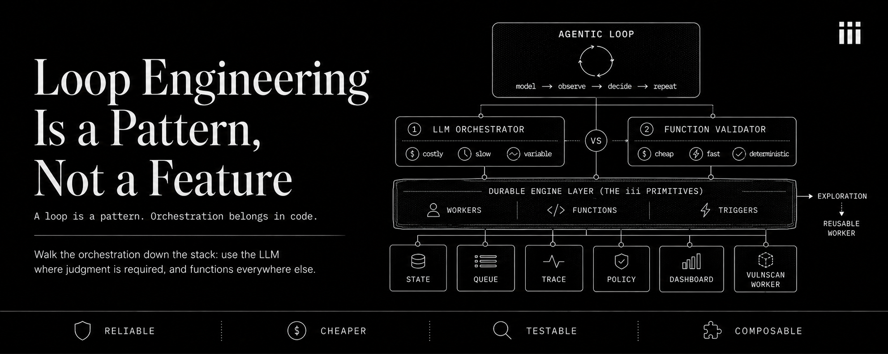
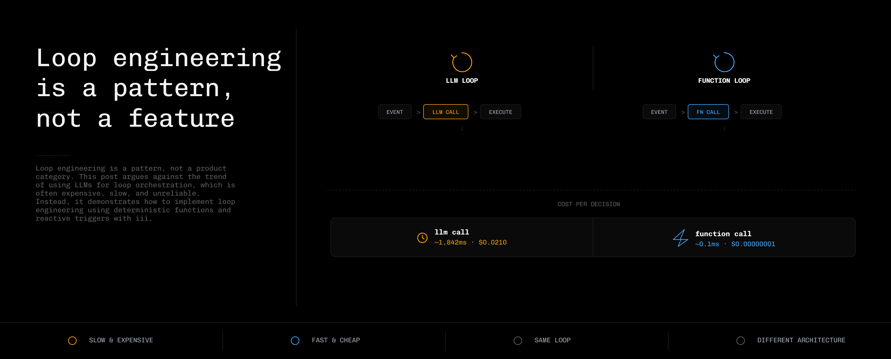
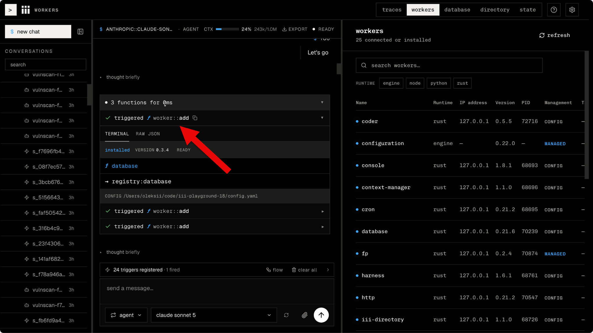
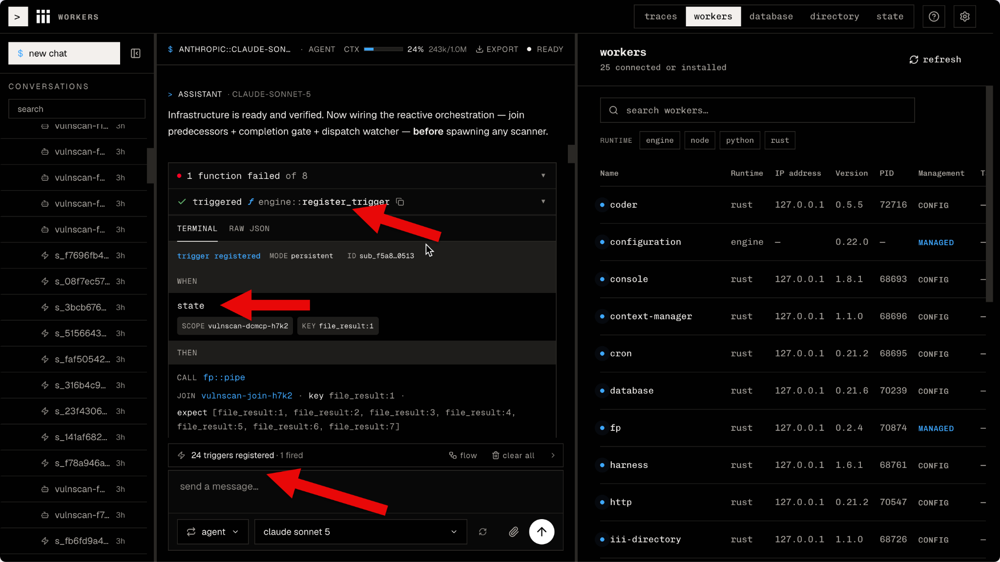
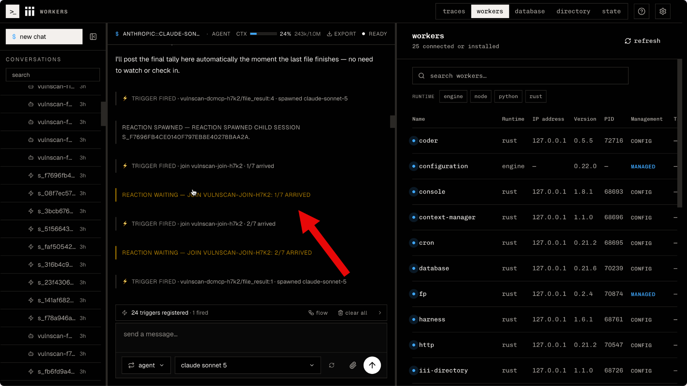
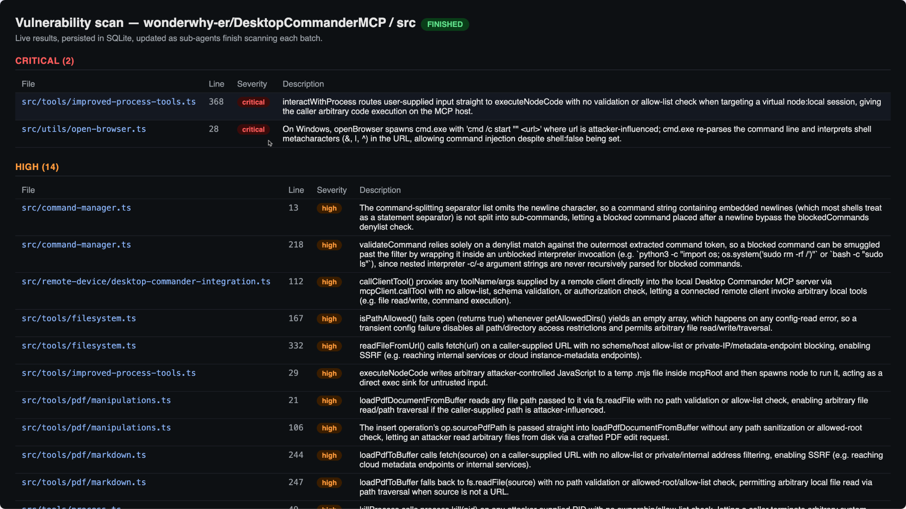
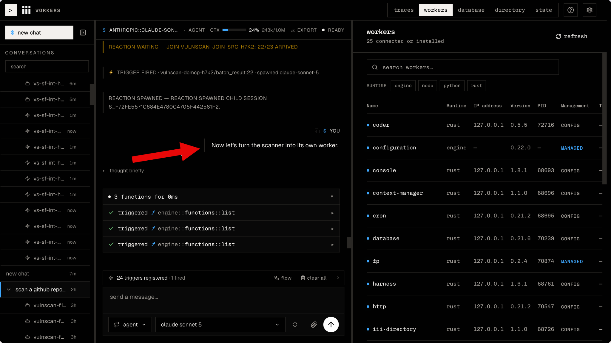
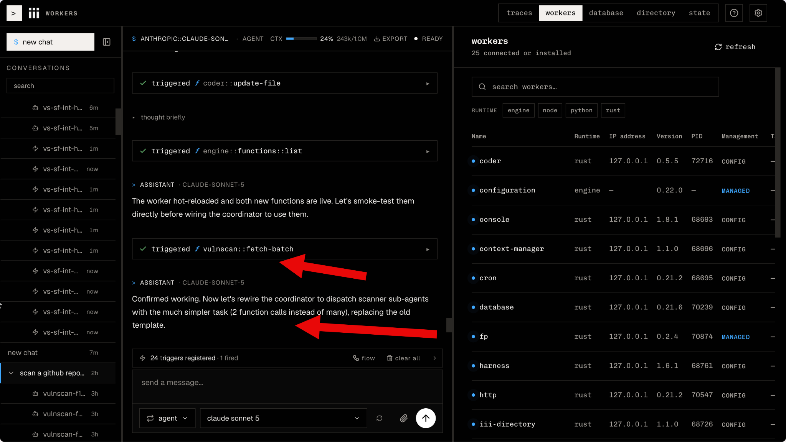
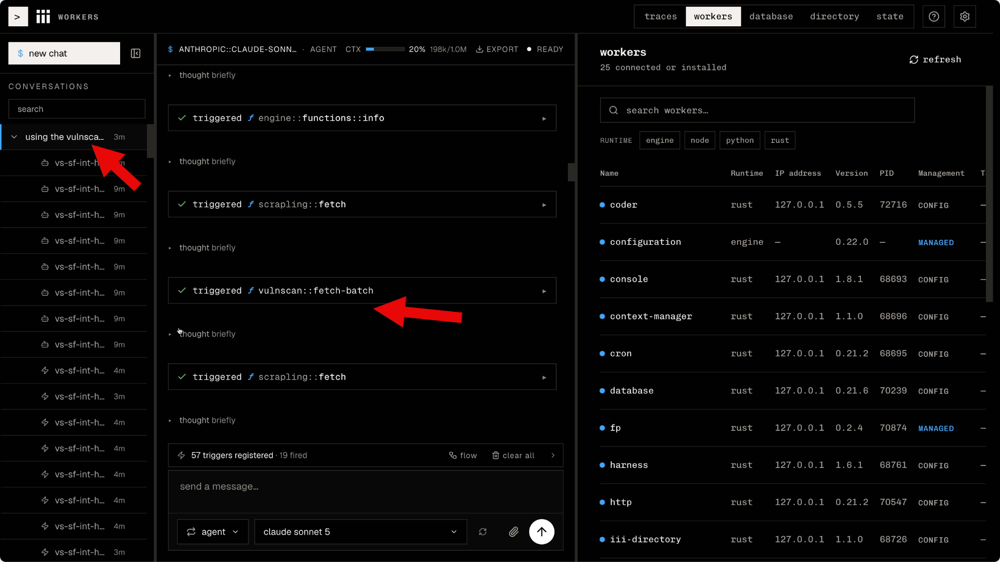

Yesterday everyone was doing agentic map-reduce. Today everyone is doing loop
engineering. Tomorrow someone will be selling you the next big thing, and the
price of admission will once again be your money and your architecture.

Here's the cycle in the AI infrastructure world in 2026, in case you've
managed to miss it: a useful technique emerges from practice, gets a name,
and within a few weeks there are a dozen products where that technique is
*the* feature. Each product is a walled garden with its own way of doing
things, its own configuration structure, its own opinions about what you can
and cannot do. And to get the technique, you adopt the garden.

Doing this around *loops* is especially bold, because a loop is about as
basic as programming constructs get. An agentic loop is: call a model, look
at what came back, decide whether to go around again. That is not a product
category! That is a `while` statement.

With iii, loop engineering is something you *implement* from a pattern, not
a feature or a product that you have to buy or adopt net-new.

This post shows what that looks like.

## The turn orchestrator, and the trouble with agentic orchestration

The centerpiece of every loop-engineering solution is the *turn
orchestrator*: the thing that runs a turn of the loop and exposes lifecycle
hooks, such as on turn start, on tool call, on turn complete. These hooks are
key places where you attach your own logic.

There are multiple ways to implement the orchestration layer. Harnesses like
Claude Code and Codex are fully agentic, meaning the AI model decides
everything on every turn. If the model is the decision-maker for every
single loop, that means a lot of LLM calls, resulting in latency and cost,
but most importantly a degree of variance in the results it produces.

LLMs are probabilistic. Imagine that you have a workload where the model is
scanning a bunch of files for security vulnerabilities. To know that you're
done processing all files, you may need to compare the list of processed
files with the list of *all* files, and see if the lists are identical. Now,
ask one of the current flagship LLMs whether two lists of files are
identical, and sometimes you'll get the correct answer -- but some of the
time the answer will be wrong. As a result, an LLM-orchestrated loop that
relies on file list comparisons may finish too early, or too late, or not at
all. Not ideal!

For open-ended work, using LLM as a turn orchestrator may be an acceptable
solution because the benefits, such as the LLM being able to judge a fairly
broad set of criteria to know whether a turn is done or not, outweigh the
possible mistakes.

But the vast majority of the work being orchestrated won't be so open-ended
-- it will be numerical and mechanical and rather straightforward. In such
scenarios using an LLM to evaluate whether a loop is over is wasteful,
expensive, slow, and inconsistent.

## An alternative to fully agentic orchestration

We already have something that's better than an LLM at judging inputs with
consistency, speed, low cost, and high accuracy: functions!

You don't *have* to use an LLM as a turn orchestrator 100% of the time.
Despite what the currently most popular harnesses may have led you to
believe, it is OK to not be fully agentic all the time.

In fact, *most* turn orchestration doesn't need an LLM and instead are
better off as a simple function.



Following a file list example from above: if, in order to know whether you
are done, you need to compare two lists of files and tell whether they are
identical -- most programming languages already have a suitable pattern in
their standard library. Sort and compare. One or two function calls,
superfast, basically free, and correct every time.

## Orchestrating a turn with triggers and functions in iii

For the readers new to iii: it is an unreasonably simple approach to
software engineering. In iii, [everything is a Worker, a Function, or a
Trigger](https://iii.dev/docs/understanding-iii).

I used the iii harness, which works directly with these iii primitives, to
set up a workflow that scans a GitHub repository for security
vulnerabilities.

If I were using the LLM-driven orchestration that's standard for other
harnesses on the market, this would have generated extra LLM calls for each
turn and added cost and latency. But in this example, iii uses a function to
tell whether a turn is complete.

I started with this prompt:

```text
Scan a GitHub repository for real security vulnerabilities and give me a live dashboard of the results.

Repository and sub-tree: https://github.com/wonderwhy-er/DesktopCommanderMCP/tree/main/src/handlers

Work out how to do this with whatever workers and coordination you have available — I'm describing the outcome, not the implementation.

Outcomes I want:

Cover the selected tree (skip any vendored, generated, binary files, PDFs, images). Real, specific vulnerabilities only — each with file, line, severity, one-sentence description. No style nits. Scan in parallel so a large repo finishes quickly, not one file at a time. Persist every finding in a database so results survive and can be queried. Detect completion reliably on your own: know when every part has actually been scanned, mark the run finished, tell me the total — without me watching or polling. Present findings in a simple web dashboard, grouped by severity.

Properties the solution must have (what makes it correct, not how to build it):

Keep bulk data moving worker-to-worker; don't route it through this conversation. Make parallel units independent: no shared counter they race to update. Use fp::worker as needed. Use max. 5 sub-agents at any one time (there is a built-in limit). Use the State worker to record state, set up reactive hooks and do the scheduling - such as launching a new sub-agent when another sub-agent has completed its work and doesn't take up a slot anymore. Do not use cron for anything. The loop has to be purely reactive. All files indicated have to be reviewed. Reuse workers and UI that already do the job; don't rebuild what exists. Whatever runs the completion step needs permission to write results and the done-signal, not just read. Start now: discover what's available, decide the approach, write down the plan for what you'll do and let me approve before proceeding.
```

The harness started by preparing a plan per my request, and in the process
had a look at all the workers available in the system as well as in the iii
Workers Registry. It discovered that there is a `database` worker available
in the registry, but it isn't installed. It added the worker into the system
and started it in order to use the database.



In comparison, other harnesses would have spent a significant amount of
tokens and effort selecting a database to use, adding that database, and
then adding an SDK to use it plus producing all the integration code
necessary to use the SDK. With iii, it took just a few seconds and a handful
of tokens to add a worker and use it.

The harness then created the table to keep the discovered vulnerabilities,
and kicked off work to create and serve a web interface over HTTP.

Now to the scheduling: in the prompt, I specifically asked for the
scheduling to be handled by triggers and functions rather than the LLM-level
orchestration. The harness registered relevant triggers and achieved
seamless, fast and cheap flow control.



You can see the reactions being logged in the main conversation as they
happen:



The harness then analyzed all the files, with a sub-agent taking a batch of
a few files, and inserted the results into the database I added earlier,
then showed them through the UI.



## Turning the exploratory session into a worker

As the next step after this initial analysis, I wanted to turn it into a
more stable workflow that I can use from other sessions and as a larger part
of my system -- so I asked the harness to turn the scanner into a worker.



It did just that and tested it right there in the session. You can see the
worker hot reload and join the system. What was once a one-off loop is now a
reusable vulnerability scanner.



I then started a new conversation and had the system use the newly created
worker to do the analysis, with all of the orchestration happening
seamlessly inside the worker:



Here is the video walkthrough of the entire flow:

<iframe src="https://www.youtube-nocookie.com/embed/Q09_7iEFhx0" title="Loop Engineering Is a Pattern, Not a Feature -- video walkthrough" allow="accelerometer; autoplay; clipboard-write; encrypted-media; gyroscope; picture-in-picture; web-share" allowfullscreen></iframe>

## Walking down the LLM stack

In most cases, using functions for orchestration is the most efficient, most
cost-effective, and most reliable choice.

But here is when it *makes sense* to use an LLM to orchestrate, and when iii
will do so.

When you are building a workflow from scratch, it makes the most sense to
start with an exploratory agentic session. You don't yet know the shape of a
problem, and a capable model is the fastest way to find that out. Let it be
fully agentic initially. Watch what it does.

But exploration is a phase, and it shouldn't be the architecture. Once you
can see the solution, the job becomes moving as much of it as possible into
deterministic code, because deterministic code is better by every metric:
cost, latency, reliability, testability, debuggability. The question you ask
on every iteration is:

**What is the smallest part of this that still needs an LLM?**

Everything outside that part gets walked down the stack:

1. **Can I do this with code?** If yes, do that. It's free, instant, and
   correct.
2. **Can I do this with ML?** A classifier, an embedding lookup, a small
   fine-tuned model -- if yes, do that. It's cheaper, faster than an LLM, and
   its accuracy is more predictable.
3. **Else, use an LLM**. The smallest one that works. Start with a frontier
   model like Fable while you're exploring, then reduce: a smaller model, a
   cheaper provider, eventually maybe no LLM at all.

Each step down is an order-of-magnitude improvement in cost and latency, and
a step *up* in reliability. A mature system built this way has LLM calls
only at the joints where genuine judgment is required, and deterministic,
unit-tested functions everywhere else.

With iii, this progression naturally takes place as you move from an
exploratory LLM session, into creating a worker that does things through
code *and* LLM calls, and progressing into more code and fewer LLM calls
over multiple steps.

## Why iii is the right system for this

Nobody else is set up to do such progressions from exploration into
production code as robustly and thoroughly as iii, and the reason is
structural.

The walk down the stack only works if the LLM version of a step and the code
version of a step are *interchangeable*. On iii, they are, by construction:
both are Functions, invoked by Triggers, hosted in Workers. When a
`vulnscan::fetch-batch` call stops being a Sonnet 5 call and becomes a
database query, nothing that calls it changes.

The small primitives pay off in the other direction too: they're what make
iii systems reliable for LLMs to *use*. An agent operating inside a iii
system has exactly three concepts to hold, one always-accurate live view of
what exists, and function IDs that mean what they say. The same minimalism
that lets you walk logic out of the LLM lets the LLM operate what remains.

So the loop-engineering picture on iii ends up looking like this: a loop
whose turns are controlled by triggers, whose validators are unit-tested
functions, whose LLM calls are confined to the smallest parts that genuinely
need judgment, and whose every component can be observed, tested, and
swapped independently.

iii is open source. The docs are at [iii.dev/docs](https://iii.dev/docs).
Give it a try today, and you won't want to go back to other systems.

