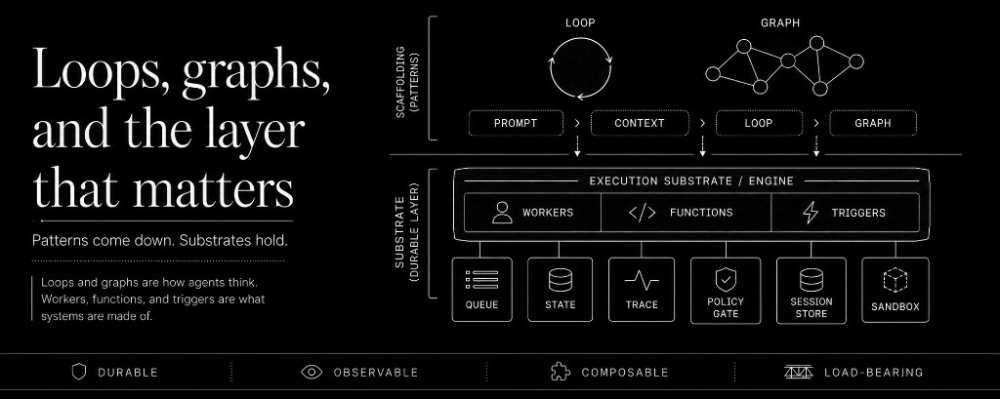
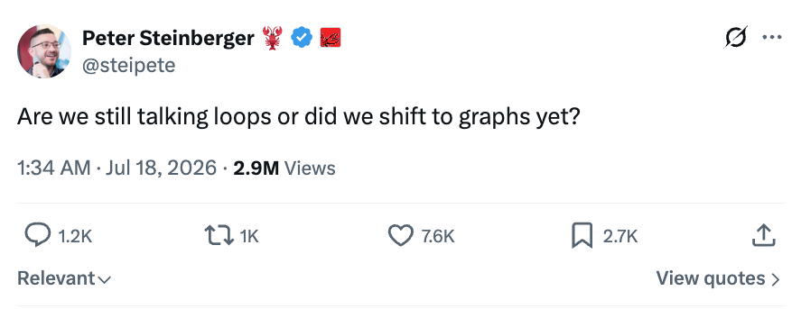
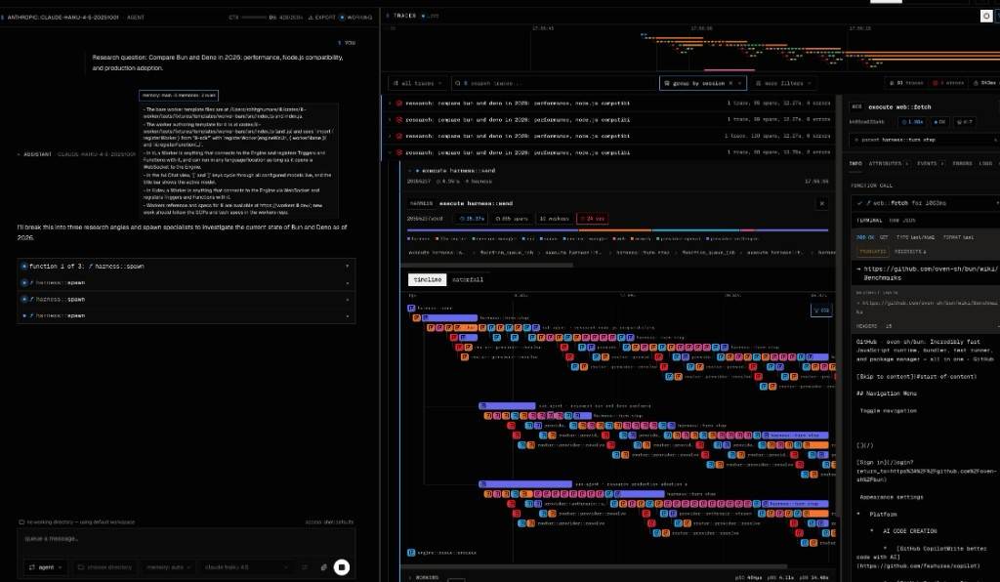
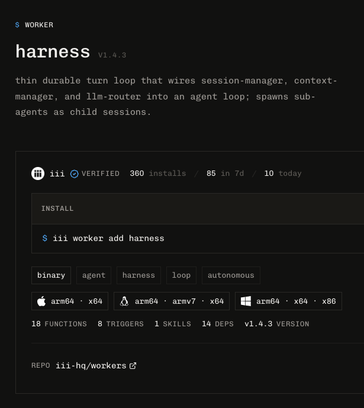

The timeline spent July arguing about whether we moved from loop engineering to
graph engineering. One post asked "are we still talking loops or did we shift
to graphs yet?" and pulled half a million views. Within a day there was a
manifesto, a backlash, and a wave of guides teaching the new discipline.
Before that it was loop engineering. Before that, context engineering. Before
that, prompt engineering.

Four namings in three years. Each one describes the layer of scaffolding one
level further out from the model. Each one arrives with the claim that the
previous layer is obsolete. Each one is real work, and none of them is a
paradigm.

Here is the pattern worth noticing: the industry keeps inventing disciplines
for the space between the model and the backend. That space keeps generating
new disciplines because it keeps generating new pain, and it keeps generating
new pain because of the paradigm underneath it. The agent scaffolding is its
own world, separate from the system it acts on, integrated by hand. Every
year the scaffolding gets a new floor, the floor gets a name, and the name
gets a course.

- **Floor 1:** prompt engineering (2023)
- **Floor 2:** context engineering (2024)
- **Floor 3:** loop engineering (2025-26)
- **Floor 4:** graph engineering (July 2026)

## What loops and graphs are

Strip the vocabulary and both terms are describing prompts and patterns.

A loop is one agent's cycle: plan, act, observe, repeat until a stop
condition. The engineering is the verifier and the stop condition. A graph is
several of those cycles integrated together: specialized nodes, routing
edges, state passed between them. A loop is just a graph with one node.
Neither is new. State machines and DAG orchestration have run production
systems for decades. What happened in July is that the pattern got a new
name, and the new name got a new market.

None of this is a criticism of the patterns. Fan-out across parallel
researchers and fan-in to a reviewer with a fresh context is a real
improvement over one agent drowning in its own transcript. Explicit routing
you can read as a diagram is better than control flow you reconstruct from a
log. These are good patterns. We use them.

The criticism is of the frame. Loop engineering and graph engineering present
the shape of the agent's reasoning as the load-bearing engineering decision.
It is not. The shape is the easy part, and it is disposable. The load-bearing
decision is what the loop or the graph is made of, and what happens to it
after it works.

## Patterns come down. Substrates hold.

At iii, we have been reducing all patterns to a few core primitives. Here is
what building an automation looks like when you focus on the engineering
decisions and business logic instead of the shape of the agent's reasoning.

You work with our harness. Our harness is what you'd expect: the turn
orchestrator, the model providers, the policy gate, the session store, the
sandbox. You describe the job. The agent runs it, in whatever shape the job
needs. Sometimes that shape is a loop. Sometimes it fans out and joins. The
difference is you are not designing the topology. You are working the
problem with the agent, in a session, against a real live system. The same
system that you can deploy later.

Every step of that session is contained inside what we call the engine. Every
function call the agent makes is a span on one trace. Every tool it touches
is a worker (aka service) in the open source catalog at
[workers.iii.dev](https://workers.iii.dev). The session chat is the design
conversation and the trace is the execution record, and they are all unified
over the same base system.

Importantly you get to keep this work long term. Most loops are designed to
be disposed of along with your token budget. In iii's case, once your loop
works, you turn it into permanent workers and functions. The session showed
you the shape: these three calls in sequence, this fan-out, this check before
this write. That shape becomes reusable functions and triggers (aka events).
The loop the agent ran becomes a durable subscriber on a queue topic. The
fan-out becomes parallel function calls. The verification step becomes a
policy gate function. The one-off session becomes a permanent capability of
the system, made of the same primitives as everything else on the iii engine.

At no point in that workflow did "loop engineering" or "graph engineering"
appear as a discipline. The loop was how the agent happened to traverse the
problem. The graph is the reusable workers and functions it produced. Both
were inherent properties of the system. The work products are functions,
triggers, and workers, and those can be used long after the pattern that
discovered them is gone.

## Why the disciplines keep multiplying everywhere else

The reason loop engineering and graph engineering feel like real disciplines
on other stacks is that on those stacks, the scaffolding is load-bearing.

When the agent framework is its own world, separate from the backend, the
topology is all you have. The graph is the system, because the graph is the
only place where control flow, state hand-off, retries, and observability
exist for the agent. Designing it feels like engineering because it is
engineering, of the same kind that already exists: transport, schema,
discovery, retry, trace propagation. The agent stack is re-deriving
distributed systems, one named discipline per year, inside a walled garden
that is separate from the systems that already solved this.

That is the paradigm problem, and it will not be fixed by the next naming.
Prompt, context, loop, graph. A fifth reinvention of an already existing
thing is implicit in the discourse: someone will coin the discipline of
integrating multiple graphs together, and it will trend, and it will also be
real work, and it will also be redundant scaffolding.

iii removes the need to reinvent the wheel. When the agent is just a worker,
just a service, on the same engine as the backend, control flow is triggers,
state is Redis, retries are RabbitMQ, observability is any Otel provider, and
topology is whatever shape the LLM chose that worked. There is no separate
world to engineer.

## The test

Here is a test for any newly named agent discipline: does the artifact it
produces work with the rest of your system? Or do you discard it?

A prompt is a discardable artifact until the model changes. A context layout
persists only until the task changes. A loop, the same loop, is rebuilt every
time you need it. Each one is scaffolding, and scaffolding comes down.

A function can exist forever, same as a trigger, and a worker is a permanent
collection of the two. A trace that shows exactly what ran, in what order,
with what result, makes sense in the world outside your LLM. These are the
artifacts a session leaves behind on iii, and they are the same artifacts the
rest of the system is made of. The pattern that discovered them can be
thrown away, but nothing else is lost.

Loops and graphs are how agents think. Workers, functions, and triggers are
what systems are made of. The industry keeps naming the first category
because it has not fixed the second. We fixed the second.

If you've made it this far, be sure to explore our earlier posts at
[iii.dev/blog](https://iii.dev/blog) or try out iii for yourself at
[iii.dev](https://iii.dev).

iii is open source. The engine is at
[github.com/iii-hq/iii](https://github.com/iii-hq/iii). The harness workers
are at [github.com/iii-hq/workers](https://github.com/iii-hq/workers). The
registry is at [workers.iii.dev](https://workers.iii.dev). The docs are at
[iii.dev/docs](https://iii.dev/docs). Come find the team in Discord at
[discord.gg/iiidev](https://discord.gg/iiidev).

Mike Piccolo, Founder & CEO @iii
