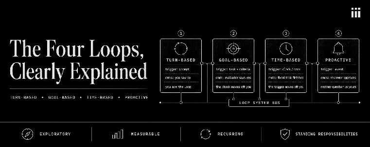

From how loop engineering is being talked about online, it may seem that
there is just one way to do it right. But in reality, loop engineering is
just a pattern, and there are a number of ways to implement it, with
different levels of ownership on the user vs the orchestrator.

(Interested in more background on loop engineering?
[Read this post](https://iii.dev/blog/loop-engineering-is-just-software-engineering/)
first.)

Each approach to loop engineering is different on two parameters: what
**starts a run**, and what **decides the work is done**.

In a hand-run AI assistant chat session, you both start runs by writing
prompts, and decide when work is done by evaluating whether the output meets
your expectations. Loop engineering is the discipline of moving the
responsibility for starting runs and deciding you're done *out of your head*
and *into a system* that runs without you.

In this article, we show how you can implement four different types of
agentic loops using iii.

## Background: Workers, Triggers, and Functions

iii consists of three primitives: Workers, Triggers, and Functions.

**Workers register functions. Triggers bind events to functions. The engine
routes between them.**

While in many harnesses loops are a separate concept, in iii you get agentic
loops when you register a trigger whose function is another agent turn.
Therefore, with iii, **every type of agentic loop is a traditional
distributed-systems pattern you already know,** simply including an LLM turn
as part of a run.

## The base case

Before the four types of loops, it helps to name the thing they're all
working around. A turn is one pass through the agent: it reads context,
triggers functions, and ends when the model ends it.

The turn ending means the *model* decides it's done for now and can't
proceed, but not necessarily because *the task is done*. It could be that it
needs more input from a user or a loop to continue.

## 1. Turn-based: you are the loop

**Trigger:** a prompt you write.

**Ends when:** you say so.

Here is the turn-based loop running end to end:

<iframe src="https://www.youtube-nocookie.com/embed/6jjjA1mQSj0" title="Implementing a Turn-Based Agentic Loop in iii" allow="accelerometer; autoplay; clipboard-write; encrypted-media; gyroscope; picture-in-picture; web-share" allowfullscreen></iframe>

**In traditional terms:** this is a REPL, a human at an interactive session.
You run a command, read the result, decide the next command. No scheduler, no
daemon, no shared state between runs, because you are the control loop.

The agent gathers context, acts, and checks its own work inside one turn,
then hands it back. You read it, decide what is missing, and write the next
prompt. No triggers get registered. Nothing runs later on its own. The loop
runs in your head, one exchange at a time.

The composability is still there. Any worker function the harness allows
(filesystem, git, database, HTTP) is triggerable inside the turn without
extra setup. You control when to continue and when to stop.

Technically, this is the simplest case there is: minimal trigger
registration, no evaluator, no schedule, no list. The task ends the same way
it started, inside a single turn, because a human is the only checkpoint the
work needs.

Use this when requirements are still forming, when every output changes what
you would ask for next. Automating the "what's next" question here is
premature. You do not know it yet either. If you find yourself refining the
same prompt structure repeatedly, you are prototyping a worker function.
Eventually, this prompt can be extracted and registered as a permanent
function.

```text
Use iii and Harness to investigate the following task:

[Describe the feature, bug, or idea.]

Work inside one turn:

1. Inspect the repository and gather the relevant context.
2. Explain the current behavior and identify ambiguities.
3. Propose the smallest sensible implementation.
4. If the requirements are sufficiently clear, implement it and run focused verification.
5. Review your own changes for regressions, security issues, and unnecessary complexity.

Do not invent requirements or begin a recurring workflow. Stop when you either:
- have a verified implementation, or
- need a product/technical decision from me.

End with:
- what you learned,
- what you changed,
- verification performed,
- unresolved questions,
- the best next prompt for me to send.
```

## 2. Goal-based: the check moves off you

**Trigger:** a task with success criteria.

**Ends when:** an evaluator function says to.

Here is the goal-based loop running end to end:

<iframe src="https://www.youtube-nocookie.com/embed/XczdpAZ8_-c" title="Implementing a Goal-Based Agentic Loop in iii" allow="accelerometer; autoplay; clipboard-write; encrypted-media; gyroscope; picture-in-picture; web-share" allowfullscreen></iframe>

**In traditional terms:** this is a retry-until-valid control loop. Do work,
run a validator, and either accept the result or feed the failure back and
try again, up to a budget. Every CI pipeline that retries a flaky step, every
job that re-runs until a health check passes, is this pattern. The validator
is a function, the attempt counter is shared state, and the loop is the
retry.

Here a real trigger appears. Say the goal is a Lighthouse score of 90 on a
webpage, five attempts allowed. Instead of you reading the result and
deciding, you register a check on the session's **turn-completed** event.
Each time the LLM's turn ends, the engine triggers the evaluator function.
The evaluator reads the result, checks it against the stated criteria, and
returns a verdict: **pass, continue, or abort.**

A *continue* starts another attempt in the same session, carrying forward
what the failed check found. A pass writes the final result to state and
removes the check. "**State**" in this case is iii's scoped key-value store
that workers can read and write to. An abort does the same, but records why
the attempt was stopped rather than succeeded. The budget is a small counter
in state too, decremented on each continue, so the loop cannot outrun what
you allowed.

The mechanics are two function calls and a state key.
`engine::register_trigger` sets up the check. `harness::react` runs the
evaluator as a sub-agent. The budget counter and the terminal verdict sit in
state. The stored state survives restarts, so a long-running goal loop does
not lose its place.

You write the criteria once. The engine runs the exchange between trying and
checking as many times as the budget allows, without you reading a single
intermediate attempt.

Use this when the outcome is measurable and the path to it is not worth your
attention. The evaluator you write here is the first iteration of a logic
gate. When the criteria stabilize, you can extract this evaluator into a
standalone validation function in a worker, turning the loop into a fixed,
automated worker.

```text
Run a goal-based Harness workflow.

Goal: produce a committed security audit of https://github.com/iii-hq/templates at reports/security/<YYYY-MM-DD>.md that:
  1. Enumerates every scan performed, with raw outputs saved under reports/security/<date>/raw/:
       - secrets / high-entropy strings across the full tree and git history,
       - dependency advisories per template (npm/pip/cargo/go as applicable, using each template's own lockfiles),
       - GitHub Actions review (permissions, pull_request_target usage, unpinned actions, ${{ }} injection in run blocks),
       - Dockerfile / container review (unpinned base images, root user, curl|sh patterns, ADD from URLs),
       - insecure defaults each template ships to downstream users (open CORS, disabled auth, wildcard IAM, debug modes, committed .env).
  2. Classifies every finding as Critical / High / Medium / Low / Info with file, line, and one-sentence rationale.
  3. For every Critical and High, includes a minimal proposed patch as a unified diff in the report (do NOT apply, do NOT open PRs).
  4. Contains no unverified severity claim — every High/Critical must cite the exact evidence in raw/.
  5. Ends with a summary table: {template, criticals, highs, mediums, lows}.

Repo: clone https://github.com/iii-hq/templates into a scratch dir under .tmp/audit/.
Budget: 5 attempts.
Constraints:
  - No writes outside reports/security/ and .tmp/.
  - No network beyond git clone and package-registry advisory lookups.
  - No secret exfiltration — findings quote at most 8 chars of any suspected secret.
  - Do NOT push, PR, or merge anything.

Wire it as a validated loop, not a chat sequence:

1. Pick a fresh worker session id (e.g. sec-audit-templates-<4char>). Record baseline = "no report yet".

2. BEFORE the first spawn, register the evaluator via @fn(engine::register_trigger):
   - trigger_type: "harness::turn-completed"
   - function_id: "harness::react"
   - config: { session_id: "<worker session id>" }
   - metadata.once: false
   - metadata.continue_on_error: true
   - metadata.task: evaluator prompt that
       a) reads reports/security/<date>.md and raw/,
       b) verifies presence of all five scan sections + summary table,
       c) spot-checks 3 random High/Critical findings by opening the cited file:line and confirming the evidence,
       d) checks every High/Critical has a diff block,
       e) confirms constraints held (no writes outside allowed paths, no full secrets quoted, no PRs opened),
       f) returns { verdict: "pass" | "continue" | "abort", evidence, feedback },
       - continue + attempts remain → @fn(harness::spawn) next worker turn into the SAME session with feedback, decrement budget state key,
       - pass / abort / budget exhausted → write terminal state and @fn(engine::unregister_trigger) itself.
   - metadata.options.functions.allow: file read, shell read-only (git log / diff / cat), state get/set, harness spawn, engine unregister_trigger.

3. THEN @fn(harness::spawn) the first worker turn into that session with the goal, constraints, and repo URL. Worker's allow list: git clone, file read/write scoped to allowed paths, shell for scanners, package-registry lookups, state set.

Return baseline note, evaluator subscription id, worker session id, budget state key, and how to cancel (unregister + delete state key).
```

## 3. Time-based: the trigger moves off you

**Trigger:** a cron.

**Ends when:** the fixed task finishes, then it waits for the next tick.

Here is the time-based loop running end to end:

<iframe src="https://www.youtube-nocookie.com/embed/gKqS7AVnnvY" title="Implementing a Time-Based Agentic Loop in iii" allow="accelerometer; autoplay; clipboard-write; encrypted-media; gyroscope; picture-in-picture; web-share" allowfullscreen></iframe>

**In traditional terms:** this is a cron job, a scheduled batch worker. A
timer fires, a job runs a fixed task against fresh inputs, and it writes its
output somewhere durable. Nightly reports, hourly syncs, the daily digest.
The only change is that the job body is an agent turn instead of a script.

Sometimes agentic tasks need to run on a schedule. iii has a worker for this
too, the same worker that the rest of the system would use for this same
task: **a cron trigger.**

Here the cron trigger runs on a schedule and starts a fresh agent session on
every tick, performing the same fixed task each time: **check the PR, fix CI,
review yesterday's issues.** The task never changes, and it runs the same
each and every day.

Importantly this schedule is not a separate service, it's just another
worker. **Cron is a standard iii trigger type; you can add it with
`iii worker add cron`.** The engine delivers cron ticks the same way it
delivers any other event, so the child session, the state it reads, and the
functions it calls are all part of the same system.

Some time-based loops will add a second. For example in this case it would be
a validation check that makes sure all claims are confirmed before a daily
report goes out. It could be implemented as:

1. A trigger that waits for and then runs on completion of the daily cron job
2. A trigger that waits for a state mutation
3. A trigger that runs on its own cron schedule
4. A trigger in a worker that you define that works exactly as you need for
   your use case

Once the schedule and task prove reliable, the cron configuration and the
agent turn become a production-grade worker, ready to be deployed as part of
your system.

In iii you get to choose the behavior rather than it being prescribed, or let
the agent make sense of what is best in your use case as it can see and use
all of the same exact functions.

```text
Create a recurring iii workflow that runs every weekday at [TIME AND TIMEZONE].

1. Register the schedule via @fn(engine::register_trigger):
   - trigger_type: "cron"
   - function_id: "harness::react"
   - config: the cron spec + timezone (fetch @fn(engine::triggers::info) for cron before registering)
   - metadata.task: the daily agent — inspect [<add your repo here>], review open PRs and CI, fix deterministic branch-caused failures, run focused verification, draft (do not publish) a concise report to a state key like "reports/daily/<date>".
   - metadata.options.functions.allow: read/edit/verify/state::set — NOT the publish function.
   - Each firing gets a unique child session id (slug + date).

2. Register a publish-gate validator via @fn(engine::register_trigger):
   - trigger_type: "harness::turn-completed"
   - config: { parent_session_id: "<this registering session>" }  (matches every cron-spawned child)
   - function_id: "harness::react"
   - metadata.once: false
   - metadata.task: reviewer that reads the drafted report from state, checks it against publish rules (no secrets, no speculative changes, cites verification, non-empty when claiming action), and only then calls the publish function. If it rejects, write the reasons to state and skip publishing that day.
   - metadata.options.functions.allow: state::get + the publish function only.

3. Overlap guard: the daily agent must no-op if a state lock for today already exists.

Return both subscription ids, the state key layout, and how to disable each.
```

## 4. Proactive: neither question is yours

**Trigger:** an event, with nobody watching.

**Ends when:** an agentic reviewer approves.

Here is the proactive loop running end to end:

<iframe src="https://www.youtube-nocookie.com/embed/XYuRQbJTzXc" title="Implementing a Proactive Agentic Loop with iii" allow="accelerometer; autoplay; clipboard-write; encrypted-media; gyroscope; picture-in-picture; web-share" allowfullscreen></iframe>

**In traditional terms:** this is an event-driven pipeline. An event lands on
a queue, a consumer picks it up, work flows through stages that pass state
between them, and a review gate approves or rejects before anything ships.
Queue, workers, shared state, a validation stage: a saga with a compensating
reviewer. Every production system that processes incoming events through a
fan-out and a check is built this way. Agents in iii are the same.

This loop hands off both questions (when to start and when to finish), and
adds a piece the other three do not need: something whose only job is to say
no. An event, a new issue, a failed check, a support message, starts a small
workflow with three stages. A triage step classifies what came in and decides
whether it deserves work. A second agent, in its own session, does the work
and writes its output to state instead of acting on it directly.

A third check, scoped to that specific session, reads the result once the
second agent's turn ends. This reviewer reads the original event, the
criteria triage set, and the drafted output, then returns approve, revise, or
escalate.

The composition is where iii's primitives pay off. A **cron writes new events
to state**. A state trigger picks them up and starts triage. A
**turn-completed trigger** scoped to the analysis session runs the reviewer.
Three trigger types, one engine, one registry. Everything runs completely
autonomously.

Approve publishes the result. Revise sends it back with concrete feedback,
capped at a couple of retries. Escalate stops the loop and hands the case to
a person. No stage grades its own work. The step that produces the answer is
never the step that decides if the answer is good enough.

Use this for standing responsibilities, the kind where you cannot predict
what is coming in, only that something reliably will. The pipeline of intake,
analysis, and adversarial review is a blueprint. As triage and review
standards solidify, you can formalize these stages into distinct workers in
iii, creating permanent, autonomous workers that operate without manual
oversight.

Moreso, the proactive loop in iii is not a fixed architecture. If you need to
add adversarial checks, insert human gates, or shift the boundaries of your
scope, you just modify the logic. You aren't fighting against a rigid
framework or learning a proprietary hook system that lives outside your
stack. Every change you make still uses the same three primitives:
**workers, triggers, and functions.**

```text
Set up a proactive workflow for new issues opened on https://github.com/iii-hq/templates that produces a triage response comment, adversarially validated before it posts.

Event source (verify shapes live via @fn(engine::triggers::list) / @fn(engine::triggers::info)):
  - Cron poller every 10 min lists open issues on iii-hq/templates.
  - For each issue not already in state key issues/templates/<number>/seen, write { number, title, body, labels, author, created_at } to issues/templates/<number>/incoming and mark seen.
  - A `state` trigger on the "incoming" key fans out one firing per issue to the triage stage.

Wire three stages:

1. INTAKE — @fn(engine::register_trigger):
   - trigger_type: "state"
   - config: filter on keys matching issues/templates/*/incoming
   - function_id: "harness::react"
   - metadata.task: triage agent that
       a) reads the issue body + labels,
       b) classifies as bug / feature-request / question / docs / security / duplicate / spam / needs-info,
       c) if not spam or duplicate, writes acceptance criteria to issues/templates/<number>/criteria covering: which template(s) are affected, minimal repro attempted, existing docs/issues cross-referenced, response cites file:line where relevant, no speculative fixes claimed as verified,
       d) picks a fresh analysis session id (e.g. issue-triage-<number>-<4char>) and @fn(harness::spawn)s the analysis agent into it with the issue payload + criteria,
       e) writes issues/templates/<number>/status = "analyzing".
   - metadata.options.functions.allow: github read, state get/set, harness spawn. NO github write, NO code edit.

2. ANALYSIS — spawned by triage; owns:
   - github read (issues, PRs, commits),
   - git read on the templates repo,
   - shell read-only for reproducing (scoped under .tmp/issue-<number>/),
   - state set to write the drafted response to issues/templates/<number>/response_draft with { classification, summary, repro_result, root_cause_hypothesis, next_steps, cited_files[], suggested_labels[] }.
   - Must NOT self-post to GitHub; must NOT declare resolved; must cite file+line for any code claim; must state explicitly when it could not reproduce.

3. REVIEW VALIDATOR — @fn(engine::register_trigger):
   - trigger_type: "harness::turn-completed"
   - config: { session_id: "<analysis session id>" }
   - function_id: "harness::react"
   - metadata.once: true
   - metadata.continue_on_error: true
   - metadata.task: adversarial reviewer that
       a) reads the issue, criteria, and response_draft,
       b) spot-checks any file:line citation by opening the referenced file at HEAD,
       c) rejects: speculative root cause without evidence, "should work" claims without repro, unrequested scope, tone problems, or suggestions that violate template constraints,
       d) returns { verdict: "approve" | "revise" | "escalate", reasons },
       - approve → post the response as an issue comment on iii-hq/templates, apply suggested_labels via github API, write issues/templates/<number>/status = "posted", record the comment URL,
       - revise (≤ 2 attempts, tracked in issues/templates/<number>/revisions) → @fn(harness::spawn) another analysis turn into the SAME session with reviewer feedback AND register a fresh review validator for it,
       - escalate / revisions exhausted → write status = "escalated" and route to [HUMAN/CHANNEL] with all evidence; do NOT post.
   - metadata.options.functions.allow: github read + comment-post + label-apply only (no close, no assign to humans, no edit-others-comments), state get/set, harness spawn, engine register_trigger.

Rules:
   - Each stage runs in its own child session; min allow list per stage.
   - Dedupe on issue number — updates to the issue body do NOT re-enter intake unless a maintainer adds the label `retriage`.
   - Never trigger on comments the workflow itself posted (filter out the bot account in the poller).
   - Before ending setup, verify via @fn(engine::registered-triggers::list) that: cron poller, state trigger on incoming key, and analysis agent's allow list actually includes state::set on response_draft (else the review validator will wait forever).

Return: poller subscription id, intake subscription id, state key layout under issues/templates/, per-stage allow lists, escalation channel, disable instructions (unregister poller + intake, cancel any in-flight review validators, optionally delete state prefix).
```

## One job at a time

Line up the loop types that we discussed, and you'll see how you move between
them by progressively handing off responsibility from yourself to the agentic
system:

1. Turn-based keeps both the trigger and the validation with you.
2. Goal-based hands off the validation.
3. Time-based also hands off the trigger.
4. Proactive hands off both trigger and validation, and adds a reviewer
   agent.

None of these is "more advanced" than the others. The real question is what
kind of task you're looking at: exploratory, measurable, recurring, or
standing.

## Why this is ordinarily simple on iii and not elsewhere

Let's look back at the software engineering patterns not specific to agents,
such as a retry-until-valid control loop, a cron job, an event-driven
pipeline.

On a regular stack, building the proactive loop alone means standing up a
queue, a state store, a scheduler, retry logic, a review service, and an
observability pipeline, then writing the integration code that holds all of
them together and correlating logs across every boundary when something
breaks. The pattern is proven and has been used in production for decades.
What's new is the *integration cost* for introducing this pattern to a new or
existing system.

On iii there is no integration, because every piece you need to build a
working system is a worker on the same engine. The queue is a worker. Cron is
a worker. State is a worker. The reviewer is a function you register. The
trace crosses all of them because the engine emits the metadata required for
it. That is why each loop above was done as a single prompt and did not
require building a full project from scratch. You are not integrating six
systems to reproduce a distributed pattern, you are only naming triggers and
functions on one iii engine that already manages durability, routing,
retries, and state.

This is the difference between iii and a framework that wraps your agent. A
framework gives you a loop primitive and stops at the edge of its own
runtime. The moment you need a real queue or real scheduling or real state,
you are back to integrating outside systems. On iii the queue, the schedule,
and the state are the same kind of thing as the loop, so the pattern never
leaves the engine.

The trending term this month is "loop engineering." The thing underneath it
is distributed systems, and iii is where distributed systems are built for
today's needs.

## Where to start

- Still working on prompts for what to ask? Stay turn-based. Don't build a
  loop for a question you haven't finished asking.
- The first time you can write success criteria as a sentence, try
  goal-based, and keep the budget small.
- The first recurring task you keep forgetting to run yourself, move to
  time-based before anything fancier.
- Only move to proactive loops once you trust the reviewer agent you've
  built. A loop with nobody watching and nothing that can say no is an agent
  nodding along to its own work.

The more of the loop you hand to the system, the less of it you carry in your
head. Pick the structure that matches the task, not the one that sounds the
most automated. Whichever you pick, you are building a familiar
distributed-systems pattern out of one prompt, on an engine that treats the
queue, the schedule, the state, and the agent as the same kind of thing.

If you want to try using iii as a harness for your next or current project,
the install guide is at [iii.dev/docs/install](https://iii.dev/docs/install).
We've also got a Discord where someone is always around to help out:
[discord.gg/iiidev](https://discord.gg/iiidev).

iii is open source. The engine is at
[github.com/iii-hq/iii](https://github.com/iii-hq/iii). The harness workers
are at [github.com/iii-hq/workers](https://github.com/iii-hq/workers). The
worker registry is at [workers.iii.dev](https://workers.iii.dev). The docs
are at [iii.dev/docs](https://iii.dev/docs).

Mike Piccolo, Founder & CEO [@iiidevs](https://x.com/iiidevs)

**P.S.** The iii harness works exactly the same in production. The proactive
prompt above added a queue, shared state, and a review gate the same way a
standing service would. If you wanted to lift that loop out of the harness
and run it as its own orchestration, you would follow the same triggers and
functions it already used. **That is the next post,** and it is why loop
engineering and the orchestration you deploy are the same three primitives
all the way down.
